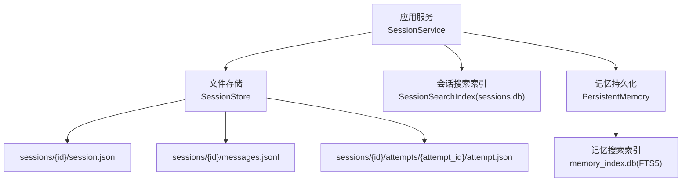
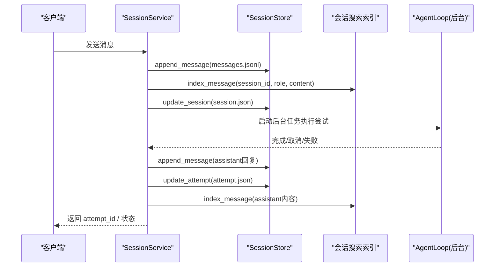
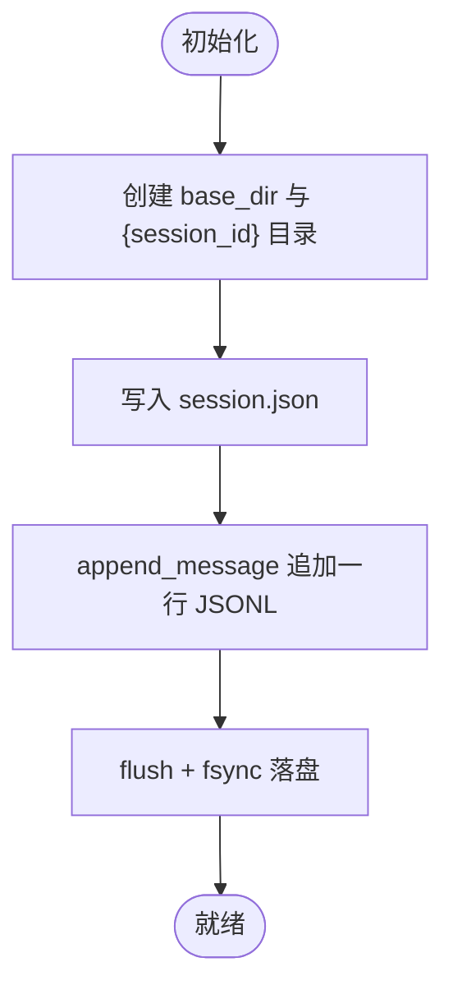
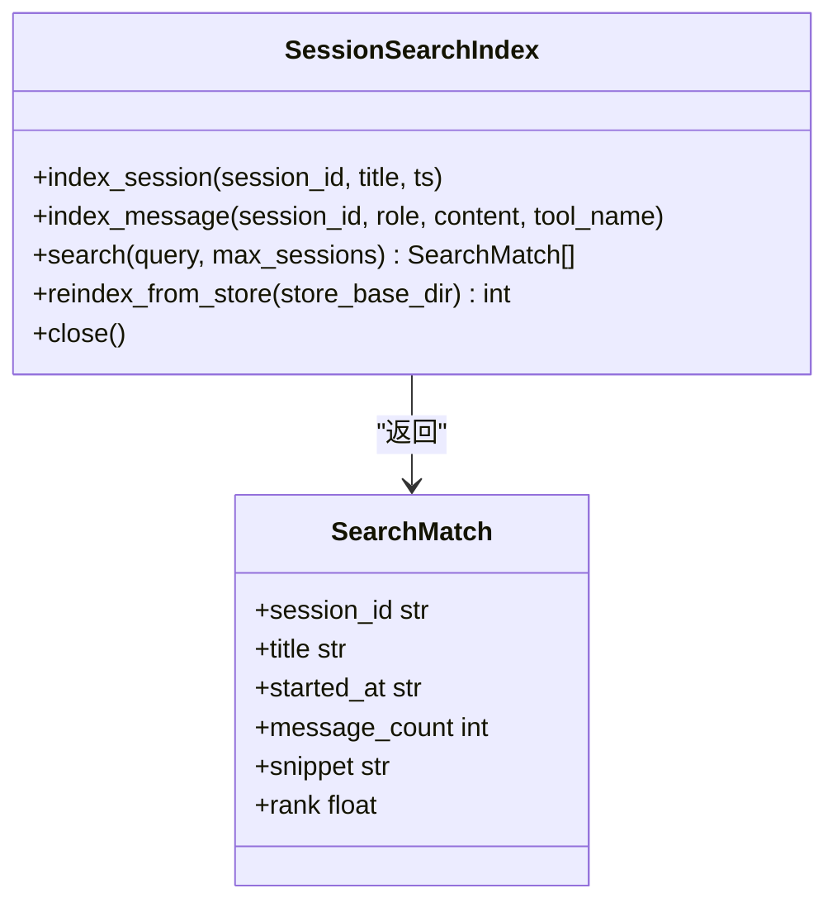
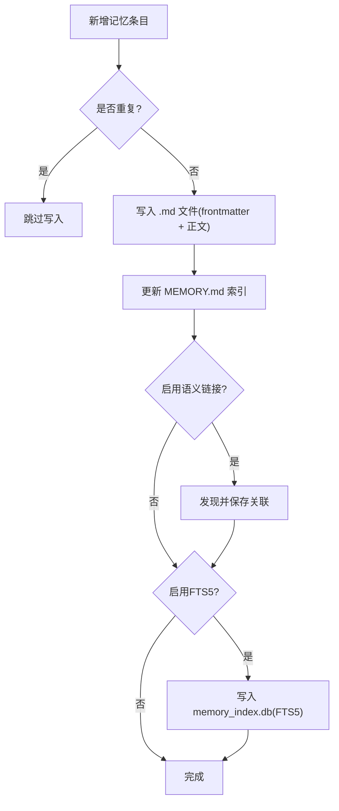
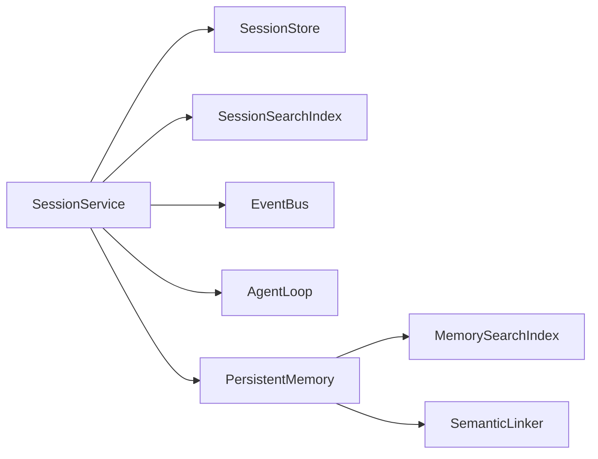

# 会话持久化存储

<cite>
**本文引用的文件**
- [store.py](file://agent/src/session/store.py)
- [models.py](file://agent/src/session/models.py)
- [service.py](file://agent/src/session/service.py)
- [search.py](file://agent/src/session/search.py)
- [persistent.py](file://agent/src/memory/persistent.py)
- [search_index.py](file://agent/src/memory/search_index.py)
</cite>

## 目录
1. [简介](#简介)
2. [项目结构](#项目结构)
3. [核心组件](#核心组件)
4. [架构总览](#架构总览)
5. [详细组件分析](#详细组件分析)
6. [依赖关系分析](#依赖关系分析)
7. [性能与调优](#性能与调优)
8. [故障排查指南](#故障排查指南)
9. [结论](#结论)
10. [附录](#附录)

## 简介
本文件面向 Vibe-Trading 的“会话持久化存储”子系统，系统性说明基于文件系统的会话、消息与执行尝试（Attempt）的存储方案，以及跨会话全文检索索引。重点覆盖：
- 文件系统存储架构：目录结构、命名规范、写入一致性与容错策略
- session.json 与 messages.jsonl 的数据格式与一致性保证
- SQLite FTS5 索引机制：会话级与记忆级全文搜索、查询优化与降级策略
- 数据迁移与版本升级：向后兼容与重建流程
- 性能调优参数与磁盘空间管理
- 备份、恢复与故障恢复方案

## 项目结构
会话持久化由“文件存储 + 可选索引”的双层设计组成：
- 文件存储：每个会话一个目录，包含会话元数据、追加式消息日志与执行尝试记录
- 索引层：SQLite FTS5 提供跨会话的消息/会话全文检索；同时存在独立的“记忆”模块的 FTS5 索引用于跨会话知识检索

**图表来源**
- [service.py:244-307](file://agent/src/session/service.py#L244-L307)
- [store.py:17-56](file://agent/src/session/store.py#L17-L56)
- [search.py:60-135](file://agent/src/session/search.py#L60-L135)
- [search_index.py:113-196](file://agent/src/memory/search_index.py#L113-L196)

**章节来源**
- [store.py:17-56](file://agent/src/session/store.py#L17-L56)
- [service.py:244-307](file://agent/src/session/service.py#L244-L307)
- [search.py:60-135](file://agent/src/session/search.py#L60-L135)
- [search_index.py:113-196](file://agent/src/memory/search_index.py#L113-L196)

## 核心组件
- SessionStore：基于文件系统的会话、消息、尝试存储，提供创建、读取、更新、删除与追加日志能力
- SessionService：编排会话生命周期、并发控制、事件广播、调用 AgentLoop 并维护索引
- SessionSearchIndex：跨会话消息的 SQLite FTS5 索引，支持增量索引与全量重建
- PersistentMemory：跨会话的记忆持久化（Markdown + 前缀元数据），含独立 FTS5 索引
- MemorySearchIndex：记忆内容的 SQLite FTS5 索引，支持中文分词与双字匹配、自动重建与降级

**章节来源**
- [store.py:16-259](file://agent/src/session/store.py#L16-L259)
- [service.py:53-221](file://agent/src/session/service.py#L53-L221)
- [search.py:60-365](file://agent/src/session/search.py#L60-L365)
- [persistent.py:200-654](file://agent/src/memory/persistent.py#L200-L654)
- [search_index.py:113-481](file://agent/src/memory/search_index.py#L113-L481)

## 架构总览
会话写入路径：
- 用户消息进入 Service，先持久化到 messages.jsonl，再写入会话元数据 session.json，随后异步执行尝试，完成后写回 assistant 消息与尝试结果
- 每次写入均同步刷新至磁盘，确保崩溃后不丢失已提交条目
- 同时向 FTS5 索引写入消息或会话元数据，以支持快速检索

**图表来源**
- [service.py:244-307](file://agent/src/session/service.py#L244-L307)
- [service.py:248-344](file://agent/src/session/service.py#L248-L344)
- [store.py:155-197](file://agent/src/session/store.py#L155-L197)
- [search.py:170-192](file://agent/src/session/search.py#L170-L192)

## 详细组件分析

### 文件系统存储：目录结构与命名规范
- 根目录：由外部配置传入 base_dir（通常为运行时根目录下的 sessions 子目录）
- 会话目录：{session_id}/
  - session.json：会话元数据（ID、标题、状态、时间戳、配置、最近尝试ID等）
  - messages.jsonl：追加式 JSON Lines 消息日志（每行一个 JSON 对象）
  - attempts/{attempt_id}/attempt.json：每次执行尝试的完整记录（状态、提示、摘要、指标、错误等）

**图表来源**
- [store.py:34-41](file://agent/src/session/store.py#L34-L41)
- [store.py:63-81](file://agent/src/session/store.py#L63-L81)
- [store.py:155-166](file://agent/src/session/store.py#L155-L166)

**章节来源**
- [store.py:17-56](file://agent/src/session/store.py#L17-L56)
- [store.py:63-81](file://agent/src/session/store.py#L63-L81)
- [store.py:155-166](file://agent/src/session/store.py#L155-L166)

### 数据模型与文件格式
- Session：会话实体，包含 ID、标题、状态、时间戳、配置、所有者等
- Message：消息实体，包含 ID、会话ID、角色、内容、时间戳、关联尝试ID、元数据、工具轨迹
- Attempt：执行尝试实体，包含 ID、会话ID、父尝试ID、状态、提示、运行目录、摘要、追踪、时间戳、错误、指标

文件映射：
- session.json：序列化后的 Session
- messages.jsonl：每行一个 Message 的 JSON 对象
- attempts/{attempt_id}/attempt.json：序列化后的 Attempt

**章节来源**
- [models.py:140-342](file://agent/src/session/models.py#L140-L342)
- [store.py:63-81](file://agent/src/session/store.py#L63-L81)
- [store.py:155-197](file://agent/src/session/store.py#L155-L197)
- [store.py:201-243](file://agent/src/session/store.py#L201-L243)

### 写入一致性与容错
- 消息追加采用“追加一行 + flush + fsync”，确保单条原子可见且落盘
- 列表会话时遇到损坏的 session.json 会跳过并记录警告，不影响其他会话
- 读取消息时对每行进行 JSON 解析校验，异常行被跳过并记录警告
- 删除会话使用安全移除，忽略不存在的情况

**章节来源**
- [store.py:155-166](file://agent/src/session/store.py#L155-L166)
- [store.py:122-151](file://agent/src/session/store.py#L122-L151)
- [store.py:168-197](file://agent/src/session/store.py#L168-L197)
- [store.py:106-120](file://agent/src/session/store.py#L106-L120)

### 并发与事务边界
- 同一会话在同一时刻仅允许一个在运行的尝试（通过内存锁 _inflight 实现），避免多循环交错写入导致不一致
- 发送消息时先保留会话，再持久化消息与尝试，失败时释放保留，防止会话永久占用
- 后台任务在 finally 中释放会话占用，确保异常或取消也能正确释放

**章节来源**
- [service.py:179-202](file://agent/src/session/service.py#L179-L202)
- [service.py:244-307](file://agent/src/session/service.py#L244-L307)
- [service.py:248-344](file://agent/src/session/service.py#L248-L344)

### 会话搜索索引（SQLite FTS5）
- 数据库位置：运行时根目录下的 sessions.db
- 表结构：
  - sessions：会话元信息（id、title、started_at、message_count）
  - messages：消息明细（session_id、role、content、tool_name、timestamp）
  - messages_fts：FTS5 虚拟表，对 content 建立倒排索引
- 触发器：插入/删除消息时自动同步 FTS5
- 查询：按 MATCH 表达式检索，返回 snippet 与 rank，并按会话去重限制数量
- 降级：若 FTS5 不可用，查询返回空结果，不影响主流程

**图表来源**
- [search.py:60-135](file://agent/src/session/search.py#L60-L135)
- [search.py:137-192](file://agent/src/session/search.py#L137-L192)
- [search.py:216-267](file://agent/src/session/search.py#L216-L267)
- [search.py:269-329](file://agent/src/session/search.py#L269-L329)

**章节来源**
- [search.py:60-135](file://agent/src/session/search.py#L60-L135)
- [search.py:137-192](file://agent/src/session/search.py#L137-L192)
- [search.py:216-267](file://agent/src/session/search.py#L216-L267)
- [search.py:269-329](file://agent/src/session/search.py#L269-L329)

### 记忆持久化与 FTS5 索引（跨会话知识）
- 存储形式：Markdown 文件（带 frontmatter 元数据），支持层级目录与压缩级别
- 去重：基于名称+描述+内容的哈希滑动窗口，避免重复写入
- 重要性衰减：根据访问频率与时间计算重要性，影响排序
- FTS5 索引：独立 memory_index.db，支持中文单字与双字匹配、查询清洗、自动重建与降级
- 语义链接：可发现并保存条目间的关联关系，增强检索召回

**图表来源**
- [persistent.py:479-595](file://agent/src/memory/persistent.py#L479-L595)
- [search_index.py:207-250](file://agent/src/memory/search_index.py#L207-L250)
- [search_index.py:304-355](file://agent/src/memory/search_index.py#L304-L355)

**章节来源**
- [persistent.py:200-654](file://agent/src/memory/persistent.py#L200-L654)
- [search_index.py:113-481](file://agent/src/memory/search_index.py#L113-L481)

## 依赖关系分析
- SessionService 依赖：
  - SessionStore：读写 session.json、messages.jsonl、attempt.json
  - SessionSearchIndex：索引消息与会话元数据
  - EventBus：事件广播（SSE）
  - AgentLoop：执行尝试（通过线程池隔离）
- PersistentMemory 依赖：
  - 文件系统：.md 文件与 MEMORY.md 索引
  - MemorySearchIndex：FTS5 索引（可选）
  - SemanticLinker：语义链接（可选）

**图表来源**
- [service.py:53-91](file://agent/src/session/service.py#L53-L91)
- [service.py:346-440](file://agent/src/session/service.py#L346-L440)
- [persistent.py:200-210](file://agent/src/memory/persistent.py#L200-L210)

**章节来源**
- [service.py:53-91](file://agent/src/session/service.py#L53-L91)
- [service.py:346-440](file://agent/src/session/service.py#L346-L440)
- [persistent.py:200-210](file://agent/src/memory/persistent.py#L200-L210)

## 性能与调优
- 文件写入
  - 消息追加使用 flush + fsync，确保强持久性；在高吞吐场景下可评估是否需要调整批处理策略
  - 列表会话时按 updated_at 排序并限制返回数量，减少 I/O 与内存压力
- SQLite 索引
  - WAL 模式与 NORMAL 同步策略提升并发读性能
  - 查询使用 MATCH 表达式与 snippet 高亮，限制返回数量以降低开销
  - 自动重建：首次空搜索且存在磁盘条目时自动重建索引，避免冷启动慢
- 记忆模块
  - 内容截断与清理控制体大小，降低索引体积
  - 中文分词与双字匹配提高召回率；查询清洗防止注入与误匹配
  - 重要性衰减与访问奖励改善排序质量

[本节为通用指导，无需特定文件引用]

## 故障排查指南
- 会话列表跳过损坏条目
  - 现象：list_sessions 跳过某个 session.json 并记录警告
  - 原因：JSON 解析失败或字段类型不符
  - 处理：检查对应 session.json 完整性，必要时重建索引
- 消息日志损坏行
  - 现象：get_messages 跳过损坏行并记录警告
  - 原因：非 JSON 对象或解析失败
  - 处理：定位并修复 messages.jsonl 中的坏行，或重建索引
- FTS5 不可用
  - 现象：搜索返回空结果或记录警告
  - 原因：SQLite 未编译 FTS5 扩展或版本差异
  - 处理：确认 SQLite 支持 FTS5；必要时回退到扫描模式
- 并发冲突
  - 现象：发送消息时报 SessionBusyError
  - 原因：同一会话已有运行中的尝试
  - 处理：等待当前尝试结束或取消后再发送

**章节来源**
- [store.py:122-151](file://agent/src/session/store.py#L122-L151)
- [store.py:168-197](file://agent/src/session/store.py#L168-L197)
- [search.py:216-267](file://agent/src/session/search.py#L216-L267)
- [service.py:46-53](file://agent/src/session/service.py#L46-L53)

## 结论
Vibe-Trading 的会话持久化采用“文件为主、索引为辅”的设计：
- 文件存储提供强一致、可审计、易恢复的数据基线
- FTS5 索引提供高性能的跨会话检索能力，并在不可用时优雅降级
- 通过严格的写入顺序、落盘同步与异常跳过策略，保障数据一致性与可用性
- 记忆模块提供跨会话知识管理与智能检索，支持中文分词与语义链接

## 附录

### 数据迁移与版本升级
- 会话索引重建
  - 使用 reindex_from_store 从文件存储重建 sessions.db 索引，恢复会话开始时间与消息计数
- 记忆索引重建
  - 首次空搜索时自动重建 memory_index.db；也可通过 rebuild_all 批量重建
- 向后兼容
  - 读取 session.json 与 messages.jsonl 时容忍缺失字段与旧格式，跳过损坏项并记录日志
  - 反序列化时重新计算派生字段（如 attributable），避免旧数据误导

**章节来源**
- [search.py:269-329](file://agent/src/session/search.py#L269-L329)
- [search_index.py:304-355](file://agent/src/memory/search_index.py#L304-L355)
- [models.py:96-119](file://agent/src/session/models.py#L96-L119)

### 权限控制与安全
- 文件权限
  - 建议将 sessions 目录与数据库文件置于受保护的运行时目录，限制非授权访问
- 输入清洗
  - 消息与内容写入前进行控制字符清理与长度截断，避免注入与过大负载
- 并发锁
  - 记忆写入使用文件锁（非 Windows 平台），避免并发竞争

**章节来源**
- [persistent.py:154-169](file://agent/src/memory/persistent.py#L154-L169)
- [persistent.py:41-73](file://agent/src/memory/persistent.py#L41-L73)

### 备份、恢复与灾难恢复
- 备份
  - 定期复制 sessions 目录与 sessions.db、memory_index.db 等关键文件
- 恢复
  - 恢复文件后，运行 reindex_from_store 重建会话索引；必要时重建记忆索引
- 故障恢复
  - 若 messages.jsonl 出现损坏，跳过坏行并继续；必要时截取有效部分并重建索引
  - 若 session.json 损坏，跳过该会话并记录警告；必要时从备份恢复

**章节来源**
- [search.py:269-329](file://agent/src/session/search.py#L269-L329)
- [store.py:122-151](file://agent/src/session/store.py#L122-L151)
- [store.py:168-197](file://agent/src/session/store.py#L168-L197)