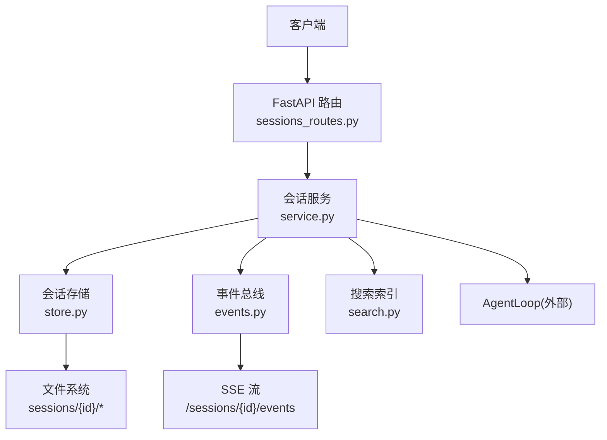
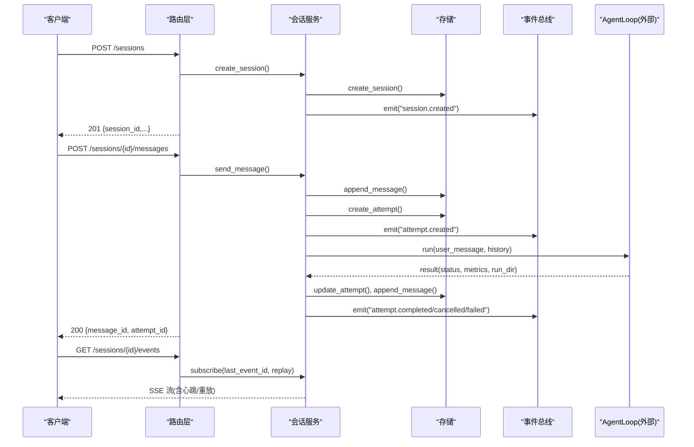
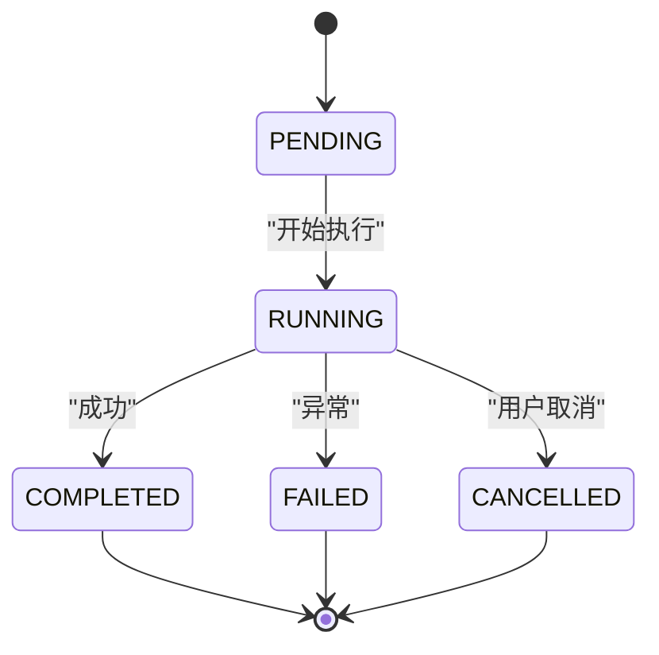
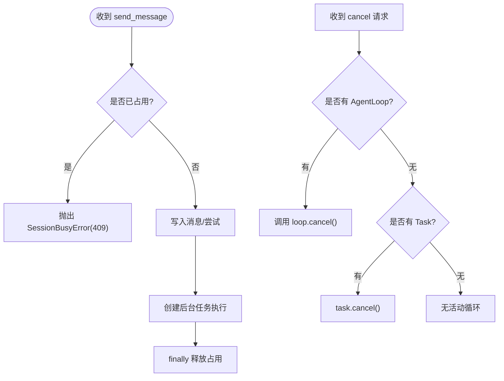
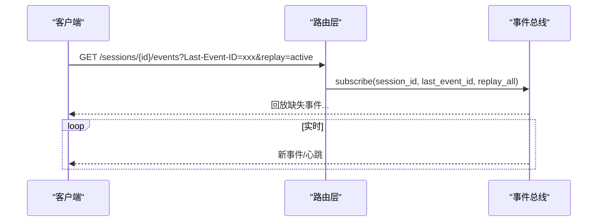
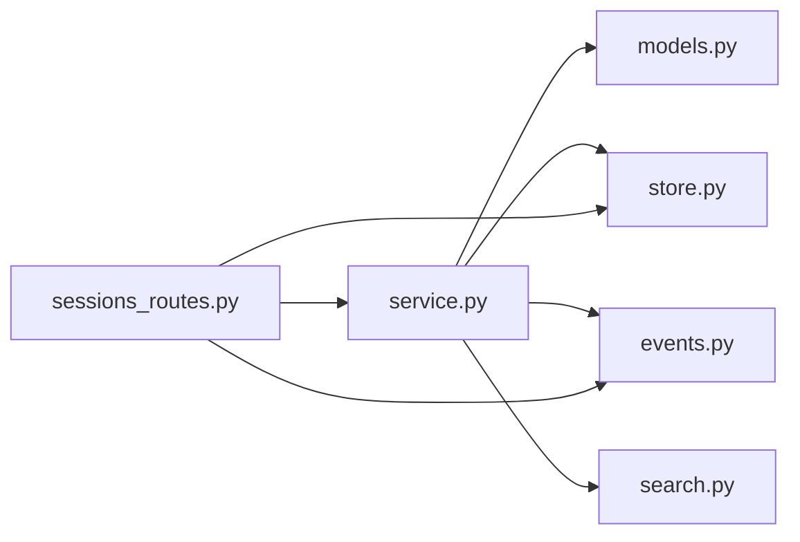

# 会话生命周期管理

<cite>
**本文引用的文件**
- [sessions_routes.py](file://agent/src/api/sessions_routes.py)
- [service.py](file://agent/src/session/service.py)
- [models.py](file://agent/src/session/models.py)
- [store.py](file://agent/src/session/store.py)
- [events.py](file://agent/src/session/events.py)
- [search.py](file://agent/src/session/search.py)
- [session.py](file://agent/cli/commands/session.py)
</cite>

## 目录
1. [简介](#简介)
2. [项目结构](#项目结构)
3. [核心组件](#核心组件)
4. [架构总览](#架构总览)
5. [详细组件分析](#详细组件分析)
6. [依赖关系分析](#依赖关系分析)
7. [性能与资源优化](#性能与资源优化)
8. [故障排查指南](#故障排查指南)
9. [结论](#结论)
10. [附录](#附录)

## 简介
本文件系统性梳理 Vibe-Trading 的会话生命周期管理，覆盖会话创建、激活（执行）、暂停（取消）与销毁全流程；解释会话 ID 生成机制与唯一性保证；说明会话状态转换规则（活跃、历史、归档）；阐述自动恢复能力（断线重连与状态同步）；并提供监控调试方法与性能优化、资源清理最佳实践。

## 项目结构
会话相关代码主要分布在以下模块：
- API 路由层：对外暴露会话 CRUD、消息发送、事件流等接口
- 会话服务层：编排消息处理、尝试（attempt）执行、并发控制、事件广播
- 数据模型：会话、消息、尝试的状态与序列化
- 持久化存储：基于文件系统的会话、消息日志、尝试记录
- 事件总线：SSE 事件发布/订阅、缓冲与重放、心跳
- 搜索索引：跨会话全文检索（FTS5）
- CLI 命令：会话历史、搜索、导出入口

图表来源
- [sessions_routes.py:289-800](file://agent/src/api/sessions_routes.py#L289-L800)
- [service.py:53-440](file://agent/src/session/service.py#L53-L440)
- [store.py:16-259](file://agent/src/session/store.py#L16-L259)
- [events.py:57-265](file://agent/src/session/events.py#L57-L265)
- [search.py:60-365](file://agent/src/session/search.py#L60-L365)

章节来源
- [sessions_routes.py:289-800](file://agent/src/api/sessions_routes.py#L289-L800)
- [service.py:53-440](file://agent/src/session/service.py#L53-L440)
- [store.py:16-259](file://agent/src/session/store.py#L16-L259)
- [events.py:57-265](file://agent/src/session/events.py#L57-L265)
- [search.py:60-365](file://agent/src/session/search.py#L60-L365)

## 核心组件
- 会话服务 SessionService：负责会话创建、消息入队、尝试调度与执行、并发控制、取消、结果回写与事件广播
- 数据模型 Session/Message/Attempt：定义实体字段、枚举状态、序列化方法
- 存储 SessionStore：文件级持久化，JSON 会话元数据 + JSONL 消息日志 + 尝试子目录
- 事件总线 EventBus：线程安全的事件缓冲、订阅、重放、心跳、清理
- 搜索索引 SessionSearchIndex：SQLite FTS5 全文索引，支持增量索引与重建
- API 路由 sessions_routes：REST/SSE 端点，鉴权、参数校验、错误映射

章节来源
- [service.py:53-440](file://agent/src/session/service.py#L53-L440)
- [models.py:121-342](file://agent/src/session/models.py#L121-L342)
- [store.py:16-259](file://agent/src/session/store.py#L16-L259)
- [events.py:57-265](file://agent/src/session/events.py#L57-L265)
- [search.py:60-365](file://agent/src/session/search.py#L60-L365)
- [sessions_routes.py:289-800](file://agent/src/api/sessions_routes.py#L289-L800)

## 架构总览
会话从创建到销毁的关键路径如下：
- 创建：POST /sessions -> SessionService.create_session -> SessionStore.create_session -> 索引与事件
- 激活（执行）：POST /sessions/{id}/messages -> SessionService.send_message -> 创建 Attempt -> 异步运行 -> 更新状态与消息 -> 事件广播
- 暂停（取消）：POST /sessions/{id}/cancel -> 取消当前任务或 AgentLoop
- 销毁：DELETE /sessions/{id} -> 清除事件缓冲并删除存储

图表来源
- [sessions_routes.py:335-800](file://agent/src/api/sessions_routes.py#L335-L800)
- [service.py:118-440](file://agent/src/session/service.py#L118-L440)
- [store.py:63-243](file://agent/src/session/store.py#L63-L243)
- [events.py:127-235](file://agent/src/session/events.py#L127-L235)

## 详细组件分析

### 会话 ID 生成与唯一性保证
- 会话 ID：使用 UUID 前缀截取，确保全局唯一
- 消息 ID、尝试 ID：同样基于 UUID 前缀截取
- 唯一性约束：
  - 存储层在创建会话时检查目录是否存在，若存在则抛出异常，避免重复创建
  - 消息为追加式 JSONL 写入，天然幂等追加
  - 尝试记录按 attempt_id 独立目录存放，更新操作按文件覆盖

章节来源
- [models.py:142-167](file://agent/src/session/models.py#L142-L167)
- [models.py:201-223](file://agent/src/session/models.py#L201-L223)
- [models.py:244-275](file://agent/src/session/models.py#L244-L275)
- [store.py:63-81](file://agent/src/session/store.py#L63-L81)

### 会话状态与转换规则
- 会话状态枚举：ACTIVE、COMPLETED、ARCHIVED
- 实际行为：
  - 新建会话默认 ACTIVE
  - 服务层未强制在每次尝试后切换会话状态；可通过业务逻辑或后续扩展实现“完成即归档”策略
  - 列表查询按 updated_at 倒序，便于展示“最近活跃”的历史会话
- 建议策略：
  - 当会话长时间无活动且所有尝试均非 RUNNING/WAITING_USER 时，可标记为 ARCHIVED
  - 对已完成但需保留审计的会话，保持 ARCHIVED 而非删除

章节来源
- [models.py:121-127](file://agent/src/session/models.py#L121-L127)
- [store.py:122-151](file://agent/src/session/store.py#L122-L151)

### 尝试（Attempt）状态机
- 状态：PENDING -> RUNNING -> COMPLETED/FAILED/CANCELLED
- 关键转换：
  - send_message 中创建 PENDING 尝试，随后标记 RUNNING
  - 成功：COMPLETED，附带 summary/metrics/run_dir
  - 失败：FAILED，附带 error
  - 用户取消：CANCELLED，区分于失败，避免误报
- 终止事件：通过 _TERMINAL_EVENTS 映射为 SSE 事件名，供 UI 区分

图表来源
- [service.py:37-43](file://agent/src/session/service.py#L37-L43)
- [service.py:248-344](file://agent/src/session/service.py#L248-L344)
- [models.py:129-138](file://agent/src/session/models.py#L129-L138)
- [models.py:301-342](file://agent/src/session/models.py#L301-L342)

### 并发控制与“暂停/取消”机制
- 并发限制：每个会话同一时间仅允许一个 in-flight 尝试
  - 通过 _inflight set + 锁进行抢占式预留，防止重复启动
  - 若已有运行中的尝试，send_message 抛出 SessionBusyError（HTTP 409）
- 取消流程：
  - 优先尝试取消已构建的 AgentLoop
  - 若尚未构建，取消后台任务以释放占用
  - 无论何种路径，finally 中确保释放 _inflight 与任务句柄

图表来源
- [service.py:179-202](file://agent/src/session/service.py#L179-L202)
- [service.py:244-307](file://agent/src/session/service.py#L244-L307)
- [service.py:227-246](file://agent/src/session/service.py#L227-L246)
- [service.py:325-344](file://agent/src/session/service.py#L325-L344)

### 自动恢复：断线重连与状态同步
- 事件重放：
  - 客户端通过 Last-Event-ID 指定上次接收的事件 ID
  - 事件总线根据 last_event_id 回放缓冲区中缺失事件
  - 对于正在运行的尝试，支持 replay_all=true 从头回放缓冲
- 心跳保活：
  - 订阅超时返回心跳事件，便于前端检测连接存活
- 会话清理：
  - 删除会话时发送 session_cleared 哨兵事件，通知订阅者退出循环

图表来源
- [events.py:151-235](file://agent/src/session/events.py#L151-L235)
- [sessions_routes.py:752-800](file://agent/src/api/sessions_routes.py#L752-L800)

### 消息与历史管理
- 消息追加：append_message 将消息以 JSONL 行追加到 messages.jsonl，并 fsync 落盘
- 读取历史：get_messages 支持 limit 分页，跳过损坏行并记录警告
- 搜索索引：每条消息入索引，支持跨会话全文检索与片段高亮

章节来源
- [store.py:155-197](file://agent/src/session/store.py#L155-L197)
- [search.py:170-267](file://agent/src/session/search.py#L170-L267)

### 会话标题自动生成
- 自动标题：基于首条用户与助手消息摘要，调用 LLM 生成短标题
- 保护手动修改：仅在标题为空或仍为自动前缀时覆盖

章节来源
- [sessions_routes.py:634-695](file://agent/src/api/sessions_routes.py#L634-L695)

## 依赖关系分析
- 路由层依赖：
  - 会话服务：创建/查询/发送消息/取消/获取消息
  - 目标存储：会话、消息、尝试的读写
  - 事件总线：会话事件广播与订阅
  - 搜索索引：会话与消息索引
- 服务层依赖：
  - 模型：Session/Message/Attempt 及其状态枚举
  - 存储：持久化与会话目录管理
  - 事件总线：线程安全事件分发
  - 外部 AgentLoop：执行策略与工具链（不在本仓库内）
- 存储层依赖：
  - 文件系统：JSON/JSONL 文件组织
- 事件总线依赖：
  - asyncio 队列与线程安全调度
  - 可选事件循环注入，用于 call_soon_threadsafe

图表来源
- [sessions_routes.py:289-800](file://agent/src/api/sessions_routes.py#L289-L800)
- [service.py:53-440](file://agent/src/session/service.py#L53-L440)
- [store.py:16-259](file://agent/src/session/store.py#L16-L259)
- [events.py:57-265](file://agent/src/session/events.py#L57-L265)
- [search.py:60-365](file://agent/src/session/search.py#L60-L365)

章节来源
- [sessions_routes.py:289-800](file://agent/src/api/sessions_routes.py#L289-L800)
- [service.py:53-440](file://agent/src/session/service.py#L53-L440)
- [store.py:16-259](file://agent/src/session/store.py#L16-L259)
- [events.py:57-265](file://agent/src/session/events.py#L57-L265)
- [search.py:60-365](file://agent/src/session/search.py#L60-L365)

## 性能与资源优化
- 并发执行隔离：
  - 使用线程池限制同时运行的 Agent 数量，避免耗尽默认执行器
  - 每个会话单实例并发控制，避免消息交错与状态竞争
- I/O 优化：
  - 消息追加采用 JSONL 顺序写 + fsync，兼顾性能与可靠性
  - 列表查询按 updated_at 排序并限制返回数量，减少内存与网络开销
- 事件缓冲：
  - 每会话事件缓冲上限，避免无限增长
  - 队列满时丢弃事件并记录告警，保障稳定性
- 搜索索引：
  - SQLite WAL 模式提升并发读性能
  - 增量索引与批量重建，降低维护成本
- 历史上下文裁剪：
  - 将历史消息转换为 LLM 格式并按字符预算裁剪，控制 token 消耗
- 资源清理：
  - 删除会话时清空事件缓冲并移除订阅者，避免悬挂引用
  - 任务完成后及时释放 _active_tasks 与 _inflight 占用

章节来源
- [service.py:32-33](file://agent/src/session/service.py#L32-L33)
- [service.py:179-202](file://agent/src/session/service.py#L179-L202)
- [service.py:227-246](file://agent/src/session/service.py#L227-L246)
- [store.py:155-166](file://agent/src/session/store.py#L155-L166)
- [store.py:122-151](file://agent/src/session/store.py#L122-L151)
- [events.py:67-125](file://agent/src/session/events.py#L67-L125)
- [search.py:80-86](file://agent/src/session/search.py#L80-L86)
- [service.py:649-699](file://agent/src/session/service.py#L649-L699)

## 故障排查指南
- 常见问题定位：
  - 409 冲突：会话正忙，等待或先取消再重试
  - 404 未找到：会话不存在或已被删除
  - 501 未启用：会话运行时未初始化
  - 502 标题生成失败：LLM 调用异常或返回空
- 事件流问题：
  - 使用 Last-Event-ID 重放缺失事件
  - 关注心跳事件判断连接存活
  - 删除会话后会收到 session_cleared 哨兵事件
- 存储损坏：
  - 列表查询会跳过损坏的 session.json 并记录警告
  - 读取消息时会跳过损坏行并记录警告
- 搜索索引：
  - FTS5 不可用或异常时降级为空结果
  - 可通过重建索引恢复一致性

章节来源
- [sessions_routes.py:335-800](file://agent/src/api/sessions_routes.py#L335-L800)
- [store.py:131-151](file://agent/src/session/store.py#L131-L151)
- [store.py:178-197](file://agent/src/session/store.py#L178-L197)
- [search.py:226-267](file://agent/src/session/search.py#L226-L267)
- [events.py:280-308](file://agent/src/session/events.py#L280-L308)

## 结论
Vibe-Trading 的会话生命周期管理以“服务+存储+事件总线”为核心，提供健壮的创建、执行、取消与销毁流程。通过严格的并发控制、线程安全的事件系统、文件级持久化与全文检索，实现了高可用与可观测的会话体验。结合自动恢复（事件重放与心跳）与完善的错误处理，满足生产环境对稳定性与可维护性的要求。建议在业务层补充会话状态归档策略，并结合监控指标持续优化性能与资源使用。

## 附录
- CLI 会话命令：
  - /history：列出近期会话（兼容旧实现）
  - /search <query>：跨会话全文检索
  - /export：占位，导出功能由 Web UI 提供

章节来源
- [session.py:1-99](file://agent/cli/commands/session.py#L1-L99)