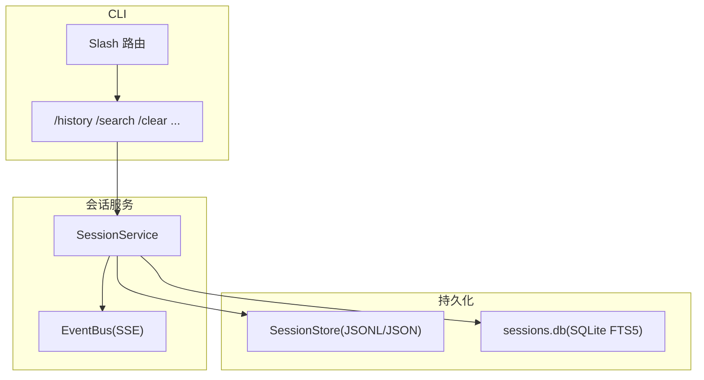
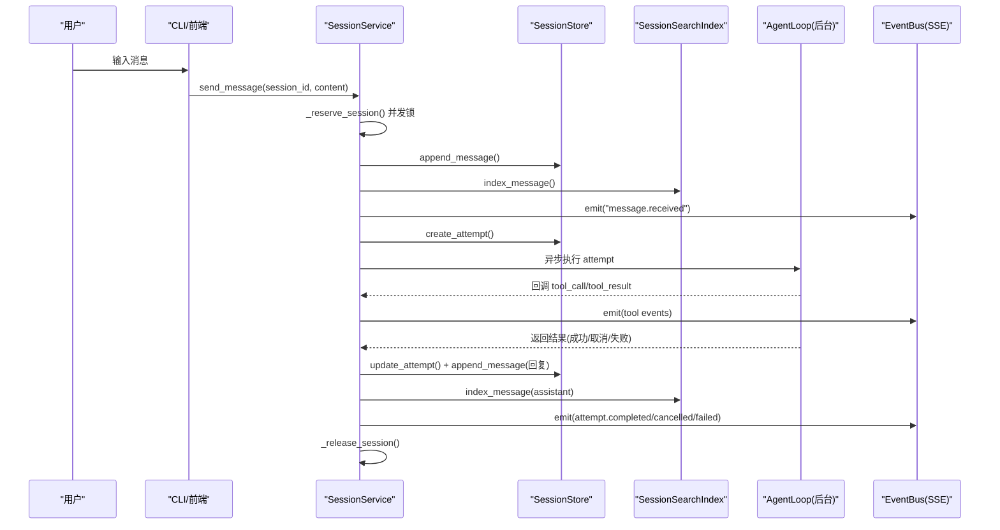
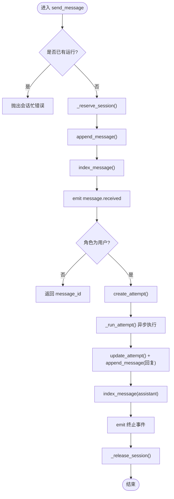
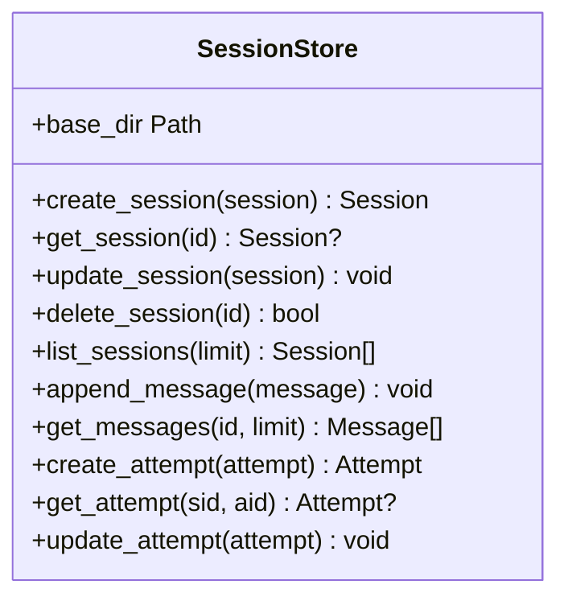
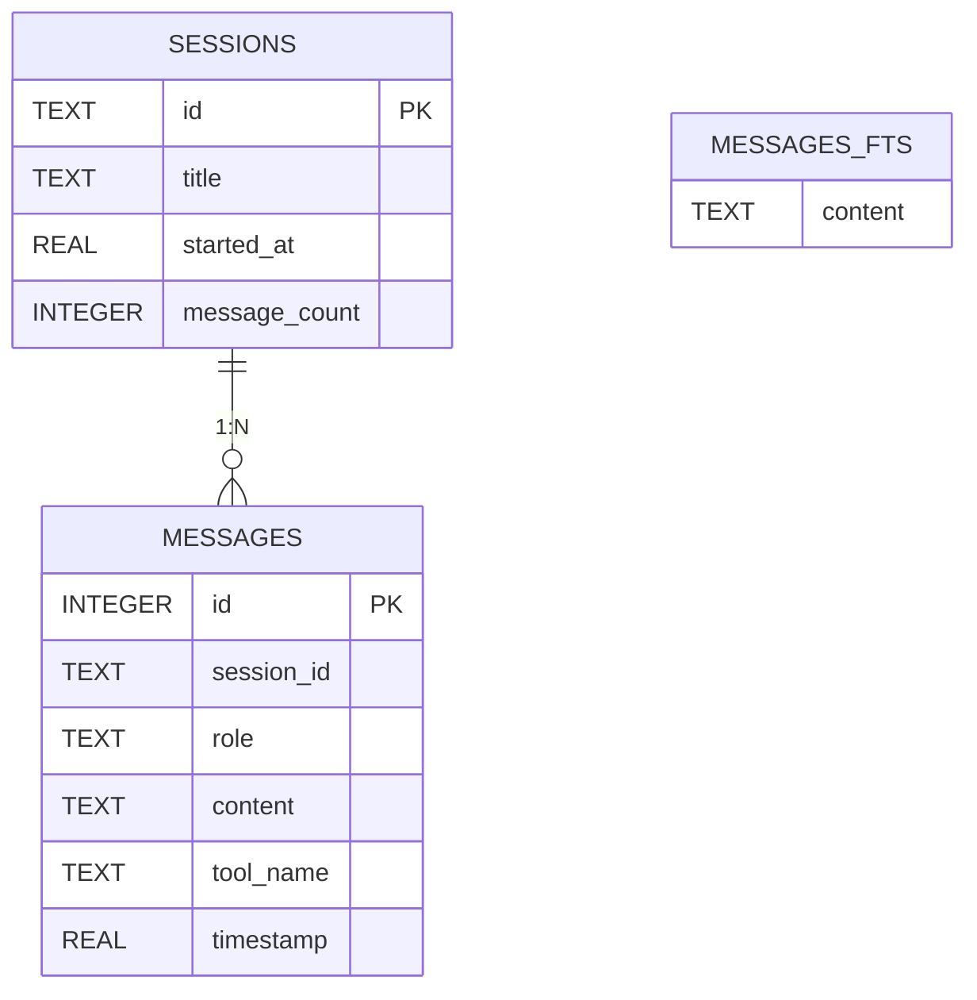
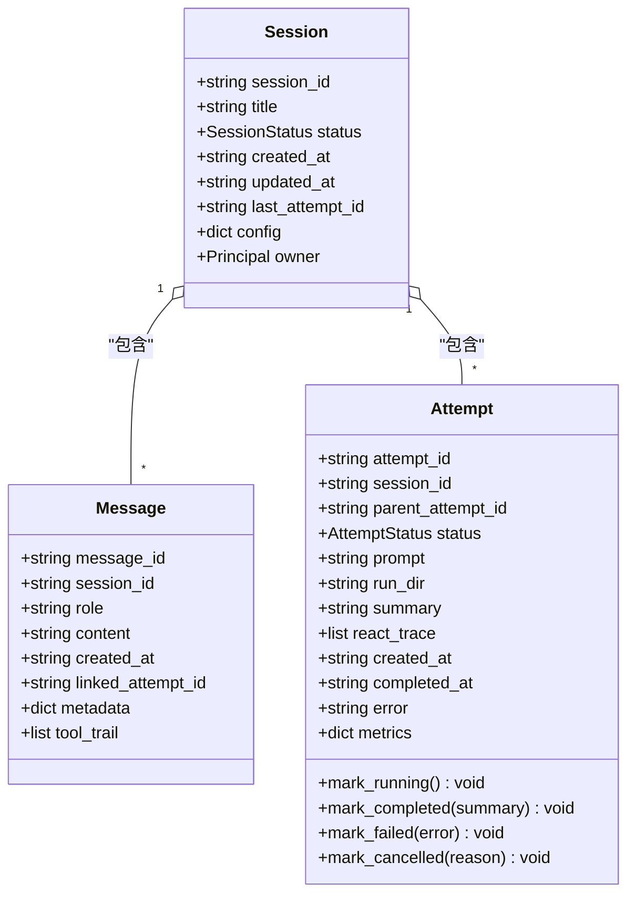
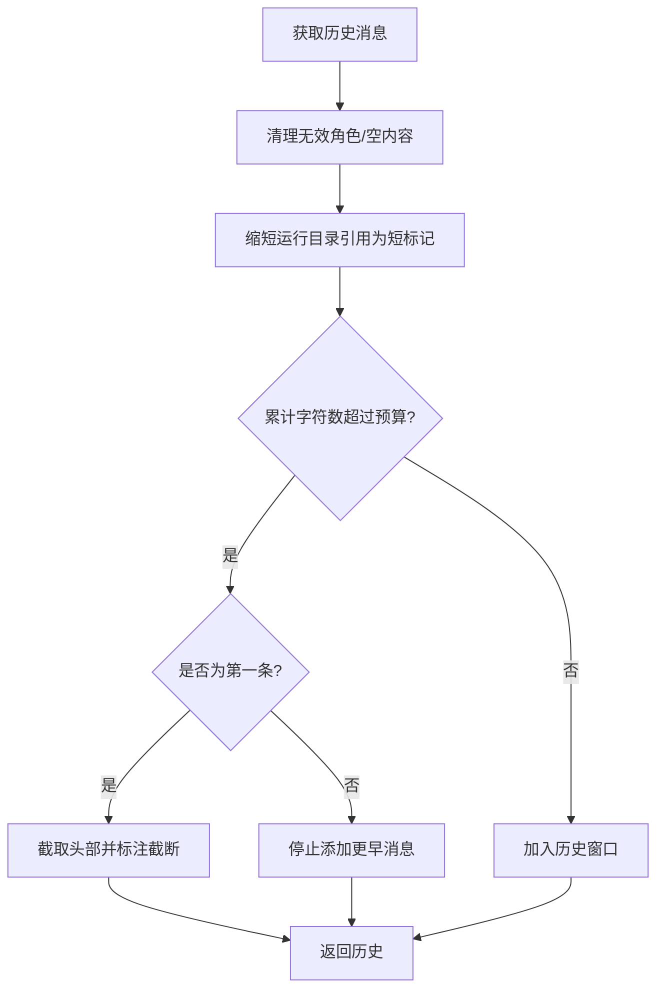
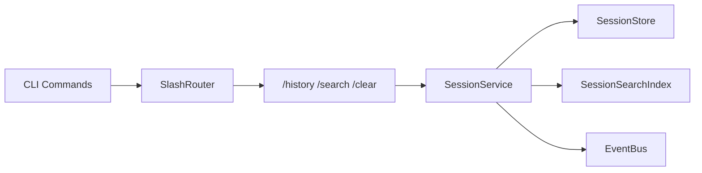

# 会话管理

<cite>
**本文引用的文件**
- [service.py](file://agent/src/session/service.py)
- [store.py](file://agent/src/session/store.py)
- [models.py](file://agent/src/session/models.py)
- [search.py](file://agent/src/session/search.py)
- [slash_router.py](file://agent/cli/commands/slash_router.py)
- [session.py](file://agent/cli/commands/session.py)
- [chat.py](file://agent/cli/commands/chat.py)
- [persistent.py](file://agent/src/memory/persistent.py)
- [compression.py](file://agent/src/memory/compression.py)
- [hierarchy.py](file://agent/src/memory/hierarchy.py)
</cite>

## 目录
1. [简介](#简介)
2. [项目结构](#项目结构)
3. [核心组件](#核心组件)
4. [架构总览](#架构总览)
5. [详细组件分析](#详细组件分析)
6. [依赖关系分析](#依赖关系分析)
7. [性能考虑](#性能考虑)
8. [故障排除指南](#故障排除指南)
9. [结论](#结论)
10. [附录：斜杠命令与使用示例](#附录：斜杠命令与使用示例)

## 简介
本文件系统性说明 Vibe-Trading 的会话管理机制，覆盖会话创建、恢复与管理、自动恢复能力、历史会话查看/切换/清理、持久化存储（JSONL 日志与 SQLite FTS5 索引）、多轮对话上下文保持与内存优化策略、跨会话工作切换与数据共享、以及性能优化与故障排除。读者可据此快速上手并深入理解会话子系统的设计与实现。

## 项目结构
会话子系统由“服务层 + 存储层 + 搜索索引 + CLI 命令”构成：
- 服务层：SessionService 负责会话生命周期编排、消息投递、尝试执行调度、事件广播与工具调用轨迹记录。
- 存储层：SessionStore 基于文件系统持久化会话元数据、消息日志与执行尝试。
- 搜索索引：SessionSearchIndex 提供跨会话全文检索（SQLite FTS5）。
- CLI 命令：/history、/search、/clear 等通过 slash_router 注册与分发。

图表来源
- [service.py:53-221](file://agent/src/session/service.py#L53-L221)
- [store.py:16-193](file://agent/src/session/store.py#L16-L193)
- [search.py:60-267](file://agent/src/session/search.py#L60-L267)
- [slash_router.py:39-56](file://agent/cli/commands/slash_router.py#L39-L56)
- [session.py:25-95](file://agent/cli/commands/session.py#L25-L95)

章节来源
- [service.py:53-221](file://agent/src/session/service.py#L53-L221)
- [store.py:16-193](file://agent/src/session/store.py#L16-L193)
- [search.py:60-267](file://agent/src/session/search.py#L60-L267)
- [slash_router.py:39-56](file://agent/cli/commands/slash_router.py#L39-L56)
- [session.py:25-95](file://agent/cli/commands/session.py#L25-L95)

## 核心组件
- SessionService：会话生命周期编排、并发控制（单会话单运行）、消息追加、尝试创建与执行、结果格式化与指标加载、SSE 事件广播。
- SessionStore：会话/消息/尝试的 JSON/JSONL 持久化，支持列表、追加、删除与损坏容错。
- SessionSearchIndex：SQLite FTS5 索引，支持增量索引、全文检索、批量重建、WAL 模式提升并发读性能。
- 模型：Session/Message/Attempt 数据类，统一序列化/反序列化与状态机。
- CLI 命令：/history、/search、/export、/clear 等，提供交互式操作入口。

章节来源
- [service.py:53-221](file://agent/src/session/service.py#L53-L221)
- [store.py:16-259](file://agent/src/session/store.py#L16-L259)
- [search.py:60-365](file://agent/src/session/search.py#L60-L365)
- [models.py:140-342](file://agent/src/session/models.py#L140-L342)
- [slash_router.py:39-56](file://agent/cli/commands/slash_router.py#L39-L56)
- [session.py:25-95](file://agent/cli/commands/session.py#L25-L95)

## 架构总览
下图展示一次用户消息从输入到执行完成的全链路流程，包括并发控制、持久化、索引更新与 SSE 事件。

图表来源
- [service.py:244-307](file://agent/src/session/service.py#L244-L307)
- [service.py:248-344](file://agent/src/session/service.py#L248-L344)
- [store.py:155-197](file://agent/src/session/store.py#L155-L197)
- [search.py:170-192](file://agent/src/session/search.py#L170-L192)

## 详细组件分析

### 会话服务（SessionService）
- 并发与独占：每个会话仅允许一个 in-flight 运行；重复发送会抛出会话忙错误，避免消息交错。
- 消息与尝试：用户消息追加后创建 Attempt，并异步执行；内部消息直接返回不触发执行。
- 执行上下文：将历史消息转换为 LLM 友好的格式，按字符预算裁剪以平衡上下文长度与成本。
- 结果处理：根据尝试状态生成最终回复文本，附加运行指标与工具调用轨迹。
- 事件总线：关键阶段通过 EventBus 广播，便于 UI 实时渲染与调试。

图表来源
- [service.py:179-202](file://agent/src/session/service.py#L179-L202)
- [service.py:244-307](file://agent/src/session/service.py#L244-L307)
- [service.py:248-344](file://agent/src/session/service.py#L248-L344)

章节来源
- [service.py:179-307](file://agent/src/session/service.py#L179-L307)
- [service.py:248-344](file://agent/src/session/service.py#L248-L344)
- [service.py:649-699](file://agent/src/session/service.py#L649-L699)

### 持久化存储（SessionStore）
- 目录结构：每个会话独立目录，包含 session.json、messages.jsonl 与 attempts/{attempt_id}/attempt.json。
- 消息日志：append-only JSONL，逐行追加并 fsync，保证顺序与一致性。
- 读取容错：解析异常行会被跳过并记录警告，不影响其他消息读取。
- 会话列表：按更新时间倒序排序，限制返回数量。

图表来源
- [store.py:16-259](file://agent/src/session/store.py#L16-L259)

章节来源
- [store.py:16-259](file://agent/src/session/store.py#L16-L259)

### 搜索索引（SessionSearchIndex）
- 存储位置：运行时根目录下的 sessions.db，启用 WAL 模式提升并发读性能。
- 表结构：sessions、messages、messages_fts（FTS5 虚拟表），并通过触发器同步插入/删除。
- 查询语义：对用户查询进行安全清洗，提取词元并以 OR 组合匹配，返回带片段高亮的会话级结果。
- 重建能力：可从 SessionStore 全量重建索引，保留会话起始时间。

图表来源
- [search.py:88-135](file://agent/src/session/search.py#L88-L135)
- [search.py:216-267](file://agent/src/session/search.py#L216-L267)

章节来源
- [search.py:60-365](file://agent/src/session/search.py#L60-L365)

### 数据模型（Session/Message/Attempt）
- Session：会话元信息、配置、所有者、最近尝试 ID。
- Message：消息角色、内容、关联尝试、元数据、工具调用轨迹。
- Attempt：执行尝试的状态机（待处理/运行中/等待用户/完成/失败/已取消），附带摘要、错误、指标等。

图表来源
- [models.py:140-342](file://agent/src/session/models.py#L140-L342)

章节来源
- [models.py:140-342](file://agent/src/session/models.py#L140-L342)

### 多轮对话上下文保持与内存优化
- 历史转换：将会话消息转为 LLM 友好格式，保留上次运行标记以便追踪产物路径。
- 预算裁剪：按字符预算（约 12000 字符）从最新消息开始裁剪，确保不会丢失全部上下文。
- 超长消息保护：若单条消息过大，保留其头部并标注截断，避免整段丢弃。
- 工具轨迹：在尝试完成后压缩记录工具调用链，用于历史回放与调试。

图表来源
- [service.py:649-699](file://agent/src/session/service.py#L649-L699)

章节来源
- [service.py:649-699](file://agent/src/session/service.py#L649-L699)

### 自动会话恢复机制
- 启动时重建索引：可通过重索引接口从文件系统恢复 FTS5 索引，确保搜索可用。
- 会话存在性检查：发送消息前校验会话是否存在，不存在则报错提示。
- 任务级取消：若 AgentLoop 尚未构建完成，取消任务释放会话占用，避免死锁。
- 事件驱动恢复：SSE 事件可用于 UI 在重载后恢复运行状态与进度。

章节来源
- [search.py:269-329](file://agent/src/session/search.py#L269-L329)
- [service.py:244-307](file://agent/src/session/service.py#L244-L307)
- [service.py:227-246](file://agent/src/session/service.py#L227-L246)

### 历史会话查看、切换与清理
- 查看历史：/history 列出最近会话（委托至遗留模块），支持分页与排序。
- 切换会话：通过服务层 get_session/list_sessions 获取会话元数据，结合前端或 CLI 选择目标会话。
- 清理会话：delete_session 删除会话目录及其所有数据，同时清空对应事件通道。

章节来源
- [session.py:25-35](file://agent/cli/commands/session.py#L25-L35)
- [service.py:231-242](file://agent/src/session/service.py#L231-L242)
- [store.py:106-151](file://agent/src/session/store.py#L106-L151)

### 跨会话工作切换与数据共享
- 会话隔离：每个会话拥有独立的 JSONL 消息日志与尝试目录，天然隔离上下文。
- 共享记忆：PersistentMemory 提供跨会话的持久化记忆（Markdown 条目），可在不同会话间复用知识。
- 工作切换：通过切换 session_id 即可在不同会话间切换；利用 PersistentMemory 共享背景知识与策略要点。

章节来源
- [store.py:17-56](file://agent/src/session/store.py#L17-L56)
- [persistent.py:200-224](file://agent/src/memory/persistent.py#L200-L224)

## 依赖关系分析
- SessionService 依赖：
  - SessionStore：读写会话、消息、尝试。
  - SessionSearchIndex：增量索引消息与会话标题。
  - EventBus：事件广播（消息接收、尝试状态变更、工具调用等）。
  - AgentLoop（外部）：执行用户请求，产出结果与工具轨迹。
- CLI 命令依赖：
  - slash_router：命令注册与模糊匹配。
  - session/chat：具体命令实现（/history、/search、/clear 等）。

图表来源
- [service.py:18-27](file://agent/src/session/service.py#L18-L27)
- [slash_router.py:39-56](file://agent/cli/commands/slash_router.py#L39-L56)
- [session.py:81-95](file://agent/cli/commands/session.py#L81-L95)

章节来源
- [service.py:18-27](file://agent/src/session/service.py#L18-L27)
- [slash_router.py:39-56](file://agent/cli/commands/slash_router.py#L39-L56)
- [session.py:81-95](file://agent/cli/commands/session.py#L81-L95)

## 性能考虑
- 并发控制：每会话单运行，避免消息交错与资源竞争；线程池限制最大并行 Agent 实例数。
- 持久化效率：JSONL 追加写入并 fsync，保证顺序与可靠性；列表读取限制返回条数。
- 搜索性能：SQLite FTS5 配合 WAL 模式，减少写放大并提升并发读；查询词元清洗避免误匹配。
- 上下文裁剪：按字符预算裁剪历史，降低 LLM 调用成本与延迟；超长消息截断保护。
- 记忆压缩：可选的三级压缩（原始/每日/摘要）减少长期记忆体积，提高检索效率。

[本节为通用性能建议，无需特定文件引用]

## 故障排除指南
- 会话忙错误：当同一会话已有运行中的尝试时，再次发送会抛出会话忙错误。应等待当前尝试完成或主动取消。
- 会话不存在：发送消息前需确认会话存在；否则返回未找到错误。
- 索引不可用：若 FTS5 初始化失败或数据库损坏，搜索将返回空结果；可执行全量重建。
- 消息解析异常：JSONL 中损坏行会被跳过并记录警告；检查 messages.jsonl 是否有非法 JSON。
- 任务取消：若尝试尚未进入 AgentLoop，取消任务可释放会话占用；否则取消 AgentLoop 实例。

章节来源
- [service.py:46-53](file://agent/src/session/service.py#L46-L53)
- [service.py:244-271](file://agent/src/session/service.py#L244-L271)
- [search.py:216-249](file://agent/src/session/search.py#L216-L249)
- [store.py:178-197](file://agent/src/session/store.py#L178-L197)
- [service.py:227-246](file://agent/src/session/service.py#L227-L246)

## 结论
Vibe-Trading 的会话管理以“服务编排 + 文件持久化 + FTS5 搜索”为核心，提供高可靠的消息日志、严格的并发控制、高效的跨会话检索与灵活的上下文管理。通过 CLI 命令与事件总线，用户可便捷地查看历史、切换会话、清理数据，并利用持久化记忆实现跨会话知识共享。合理运用上下文裁剪与记忆压缩，可在保证效果的同时优化性能与成本。

[本节为总结性内容，无需特定文件引用]

## 附录：斜杠命令与使用示例
- /history：列出最近会话，便于回顾与切换。
- /search <query>：跨会话全文检索，返回命中会话与片段。
- /clear：清空当前屏幕与内存中的对话历史（不删除持久化数据）。
- /model：显示当前模型与提供商设置，指导重新初始化。
- /debug：切换调试摘要输出，便于观察迭代次数、工具调用与上下文估算。
- /quit：退出交互界面。

章节来源
- [slash_router.py:39-56](file://agent/cli/commands/slash_router.py#L39-L56)
- [session.py:25-95](file://agent/cli/commands/session.py#L25-L95)
- [chat.py:74-97](file://agent/cli/commands/chat.py#L74-L97)
- [chat.py:183-221](file://agent/cli/commands/chat.py#L183-L221)