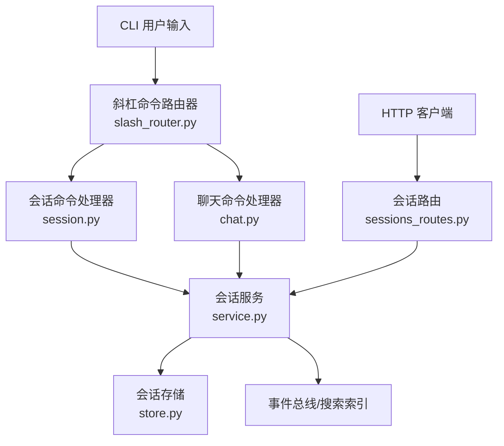
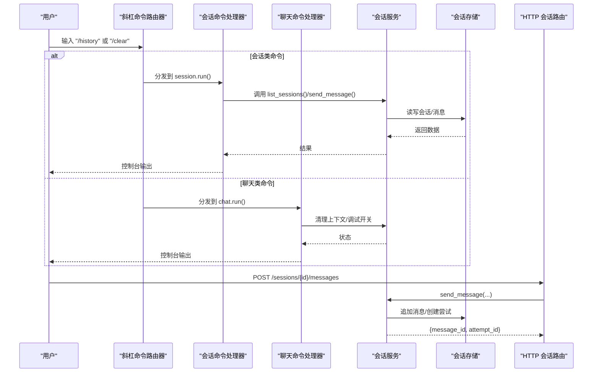
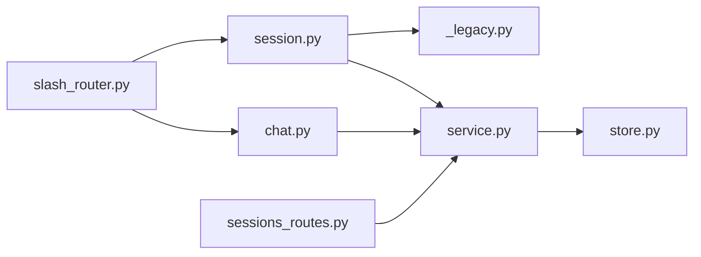

# 会话管理命令

<cite>
**本文引用的文件**
- [agent/cli/commands/slash_router.py](file://agent/cli/commands/slash_router.py)
- [agent/cli/commands/session.py](file://agent/cli/commands/session.py)
- [agent/cli/commands/chat.py](file://agent/cli/commands/chat.py)
- [agent/src/api/sessions_routes.py](file://agent/src/api/sessions_routes.py)
- [agent/src/session/service.py](file://agent/src/session/service.py)
- [agent/src/session/store.py](file://agent/src/session/store.py)
- [agent/cli/_legacy.py](file://agent/cli/_legacy.py)
</cite>

## 目录
1. [简介](#简介)
2. [项目结构](#项目结构)
3. [核心组件](#核心组件)
4. [架构总览](#架构总览)
5. [详细组件分析](#详细组件分析)
6. [依赖关系分析](#依赖关系分析)
7. [性能考虑](#性能考虑)
8. [故障排除指南](#故障排除指南)
9. [结论](#结论)
10. [附录](#附录)

## 简介
本文件面向 Vibe-Trading 的“会话管理斜杠命令”，系统性说明以下命令的使用方法、参数与输出格式，以及最佳实践与自动化集成方式：
- /history：查看历史会话列表（基于旧版实现）
- /clear：清空当前对话并刷新界面
- /sessions：列出所有会话（通过 API）
- /switch：切换会话（通过 CLI 继续某会话或 API 选择会话）
- /search：全文检索已记录会话内容
- /export：导出当前会话（占位提示，实际在 Web UI 中完成）

此外，文档还涵盖命令别名、自定义扩展点、错误处理与排障建议，以及如何通过 HTTP API 实现会话管理的自动化。

## 项目结构
Vibe-Trading 将“斜杠命令”注册到统一的命令路由中，并通过模块化的处理器执行具体逻辑；会话生命周期由服务层编排，持久化由存储层负责，HTTP 接口暴露给外部系统使用。

图表来源
- [agent/cli/commands/slash_router.py:39-56](file://agent/cli/commands/slash_router.py#L39-L56)
- [agent/cli/commands/session.py:81-95](file://agent/cli/commands/session.py#L81-L95)
- [agent/cli/commands/chat.py:226-244](file://agent/cli/commands/chat.py#L226-L244)
- [agent/src/api/sessions_routes.py:320-412](file://agent/src/api/sessions_routes.py#L320-L412)
- [agent/src/session/service.py:53-92](file://agent/src/session/service.py#L53-L92)
- [agent/src/session/store.py:63-126](file://agent/src/session/store.py#L63-L126)

章节来源
- [agent/cli/commands/slash_router.py:39-56](file://agent/cli/commands/slash_router.py#L39-L56)
- [agent/cli/commands/session.py:1-99](file://agent/cli/commands/session.py#L1-L99)
- [agent/cli/commands/chat.py:1-257](file://agent/cli/commands/chat.py#L1-L257)
- [agent/src/api/sessions_routes.py:320-412](file://agent/src/api/sessions_routes.py#L320-L412)
- [agent/src/session/service.py:53-92](file://agent/src/session/service.py#L53-L92)
- [agent/src/session/store.py:63-126](file://agent/src/session/store.py#L63-L126)

## 核心组件
- 斜杠命令注册与匹配：集中定义可用命令、描述与处理器模块路径，并提供模糊匹配与别名解析。
- 会话命令处理器：实现 /history、/search、/export 等会话相关命令。
- 聊天命令处理器：实现 /clear、/model、/debug、/quit 等交互控制命令。
- 会话服务：编排消息发送、尝试执行、取消、事件广播与搜索索引更新。
- 会话存储：会话、消息、尝试的持久化与查询。
- HTTP 会话路由：提供创建、列举、获取、删除会话，发送消息、取消运行、读取消息与 SSE 事件流等接口。

章节来源
- [agent/cli/commands/slash_router.py:39-56](file://agent/cli/commands/slash_router.py#L39-L56)
- [agent/cli/commands/session.py:25-95](file://agent/cli/commands/session.py#L25-L95)
- [agent/cli/commands/chat.py:74-244](file://agent/cli/commands/chat.py#L74-L244)
- [agent/src/session/service.py:118-246](file://agent/src/session/service.py#L118-L246)
- [agent/src/session/store.py:63-126](file://agent/src/session/store.py#L63-L126)
- [agent/src/api/sessions_routes.py:366-431](file://agent/src/api/sessions_routes.py#L366-L431)

## 架构总览
下图展示从 CLI 输入到后端执行的完整链路，包括命令路由、处理器、服务层与存储层的协作。

图表来源
- [agent/cli/commands/slash_router.py:206-251](file://agent/cli/commands/slash_router.py#L206-L251)
- [agent/cli/commands/session.py:81-95](file://agent/cli/commands/session.py#L81-L95)
- [agent/cli/commands/chat.py:226-244](file://agent/cli/commands/chat.py#L226-L244)
- [agent/src/session/service.py:158-246](file://agent/src/session/service.py#L158-L246)
- [agent/src/api/sessions_routes.py:732-763](file://agent/src/api/sessions_routes.py#L732-L763)

## 详细组件分析

### 斜杠命令注册与别名
- 命令注册：SLASH_COMMANDS 元组定义了基础命令集合，包含 help、model、memory、history、goal、search、swarm、skill、show、clear、pine、journal、shadow、export、debug、quit 等。
- 别名机制：_ALIASES 提供 q、exit、:q、? 等快捷别名，统一映射到 quit/help。
- 模糊匹配：match_commands 支持前缀、子串、子序列匹配，用于类型ahead提示。
- 精确查找：find_exact 用于解析命令名或别名，返回对应 Command。

章节来源
- [agent/cli/commands/slash_router.py:39-66](file://agent/cli/commands/slash_router.py#L39-L66)
- [agent/cli/commands/slash_router.py:159-251](file://agent/cli/commands/slash_router.py#L159-L251)

### /history 查看历史会话
- 功能：列出最近会话，内部委托至旧版 cmd_sessions。
- 参数：无。
- 输出：以表格形式显示会话 ID、标题、状态、消息数、更新时间。
- 场景：快速回顾最近的会话，定位需要继续或分析的会话。
- 错误处理：若异常，控制台打印红色错误信息并返回失败码。

章节来源
- [agent/cli/commands/session.py:25-35](file://agent/cli/commands/session.py#L25-L35)
- [agent/cli/_legacy.py:2878-2907](file://agent/cli/_legacy.py#L2878-L2907)

### /clear 清空当前会话
- 功能：清屏并重印欢迎横幅；若上下文存在 history，则清空内存中的对话历史。
- 参数：无。
- 输出：控制台提示“Conversation cleared.”或重新渲染横幅。
- 场景：开始新的对话轮次，避免上下文污染。
- 注意：该命令仅清理内存中的历史，不删除持久化存储的消息。

章节来源
- [agent/cli/commands/chat.py:74-97](file://agent/cli/commands/chat.py#L74-L97)

### /sessions 列出所有会话（API）
- 功能：通过 HTTP GET /sessions 列出会话，支持 limit 参数（默认 50，范围 1-200）。
- 认证：需要 require_auth。
- 响应字段：session_id、title、status、created_at、updated_at、last_attempt_id。
- 场景：程序化列举会话，便于前端或脚本进行会话管理。

章节来源
- [agent/src/api/sessions_routes.py:395-412](file://agent/src/api/sessions_routes.py#L395-L412)

### /switch 切换会话
- CLI 方式：通过旧版 cmd_session_chat(session_id, max_iter) 进入指定会话的交互式对话。
- API 方式：先通过 GET /sessions 获取目标 session_id，再 POST /sessions/{session_id}/messages 发送消息，或在 Web UI 中选择会话。
- 场景：在多会话环境中切换到特定会话继续对话。

章节来源
- [agent/cli/_legacy.py:2910-2980](file://agent/cli/_legacy.py#L2910-L2980)
- [agent/src/api/sessions_routes.py:732-751](file://agent/src/api/sessions_routes.py#L732-L751)

### /search 全文检索会话
- 功能：对已记录的会话内容进行全文检索，返回匹配的会话 ID、标题与片段。
- 参数：query（必需），多个词用空格分隔。
- 输出：每行显示 session_id、title、snippet。
- 场景：快速定位包含关键词的历史会话。

章节来源
- [agent/cli/commands/session.py:38-67](file://agent/cli/commands/session.py#L38-L67)

### /export 导出会话（占位）
- 功能：当前 CLI 未直接支持导出，提示通过 Web UI 的“消息底部”导出 md/json。
- 场景：在 Web 界面中完成富文本导出。

章节来源
- [agent/cli/commands/session.py:70-78](file://agent/cli/commands/session.py#L70-L78)

### 会话服务与存储
- 会话服务：负责创建会话、发送消息、取消运行、事件广播、搜索索引更新、工具轨迹记录与指标加载。
- 存储层：负责会话、消息、尝试的 CRUD 操作，支持按时间倒序列举会话，读取消息时跳过损坏行。

章节来源
- [agent/src/session/service.py:118-246](file://agent/src/session/service.py#L118-L246)
- [agent/src/session/store.py:63-126](file://agent/src/session/store.py#L63-L126)
- [agent/src/session/store.py:171-197](file://agent/src/session/store.py#L171-L197)

### HTTP 会话路由（自动化集成）
- 创建会话：POST /sessions，请求体包含 title、config。
- 列举会话：GET /sessions，支持 limit。
- 获取会话：GET /sessions/{session_id}。
- 删除会话：DELETE /sessions/{session_id}。
- 更新会话：PATCH /sessions/{session_id}，可更新 title。
- 自动标题：POST /sessions/{session_id}/title/auto，根据首条用户消息生成短标题。
- 发送消息：POST /sessions/{session_id}/messages，触发 AgentLoop 执行。
- 取消运行：POST /sessions/{session_id}/cancel。
- 读取消息：GET /sessions/{session_id}/messages，支持 limit。
- 事件流：GET /sessions/{session_id}/events，SSE 推送 agent 事件。

章节来源
- [agent/src/api/sessions_routes.py:366-431](file://agent/src/api/sessions_routes.py#L366-L431)
- [agent/src/api/sessions_routes.py:605-695](file://agent/src/api/sessions_routes.py#L605-L695)
- [agent/src/api/sessions_routes.py:697-800](file://agent/src/api/sessions_routes.py#L697-L800)

## 依赖关系分析
- 命令路由器依赖各命令处理器模块，通过 handler_module 动态导入 run(ctx, *args)。
- 会话命令处理器依赖旧版 cmd_sessions 与搜索索引。
- 聊天命令处理器依赖控制台与上下文对象，支持调试开关与退出。
- 会话服务依赖存储、事件总线、AgentLoop、LLM 与工具注册表。
- HTTP 路由依赖会话服务，并通过宿主模块注入认证与校验。

图表来源
- [agent/cli/commands/slash_router.py:39-56](file://agent/cli/commands/slash_router.py#L39-L56)
- [agent/cli/commands/session.py:81-95](file://agent/cli/commands/session.py#L81-L95)
- [agent/cli/commands/chat.py:226-244](file://agent/cli/commands/chat.py#L226-L244)
- [agent/src/api/sessions_routes.py:320-412](file://agent/src/api/sessions_routes.py#L320-L412)
- [agent/src/session/service.py:53-92](file://agent/src/session/service.py#L53-L92)
- [agent/src/session/store.py:63-126](file://agent/src/session/store.py#L63-L126)

章节来源
- [agent/cli/commands/slash_router.py:39-56](file://agent/cli/commands/slash_router.py#L39-L56)
- [agent/cli/commands/session.py:81-95](file://agent/cli/commands/session.py#L81-L95)
- [agent/cli/commands/chat.py:226-244](file://agent/cli/commands/chat.py#L226-L244)
- [agent/src/api/sessions_routes.py:320-412](file://agent/src/api/sessions_routes.py#L320-L412)
- [agent/src/session/service.py:53-92](file://agent/src/session/service.py#L53-L92)
- [agent/src/session/store.py:63-126](file://agent/src/session/store.py#L63-L126)

## 性能考虑
- 并发限制：会话服务使用线程池限制最多 4 个并发 AgentLoop，避免资源耗尽。
- 历史裁剪：转换为 LLM 历史时按字符预算裁剪，保留关键上下文，避免过大上下文影响性能。
- 指标加载：从运行目录加载 metrics.csv，仅在存在时合并到回复元数据。
- 事件流：SSE 流支持断线重连与回放，减少重复计算。

章节来源
- [agent/src/session/service.py:32-33](file://agent/src/session/service.py#L32-L33)
- [agent/src/session/service.py:649-699](file://agent/src/session/service.py#L649-L699)
- [agent/src/session/service.py:567-581](file://agent/src/session/service.py#L567-L581)
- [agent/src/api/sessions_routes.py:752-800](file://agent/src/api/sessions_routes.py#L752-L800)

## 故障排除指南
- /history 失败：捕获异常并打印红色错误信息，检查旧版 cmd_sessions 是否可用。
- /search 无参数：提示用法，需传入 query。
- 会话忙碌：当会话已有运行中的尝试时，发送消息会抛出 SessionBusyError，HTTP 返回 409；应先等待或调用取消接口。
- 会话不存在：GET/DELETE/PATCH 等操作若找不到会话，返回 404。
- 运行时未启用：若会话服务未初始化，返回 501。
- 消息损坏：读取消息时跳过损坏行并记录警告，保证其他消息正常返回。

章节来源
- [agent/cli/commands/session.py:25-67](file://agent/cli/commands/session.py#L25-L67)
- [agent/src/session/service.py:46-53](file://agent/src/session/service.py#L46-L53)
- [agent/src/api/sessions_routes.py:352-360](file://agent/src/api/sessions_routes.py#L352-L360)
- [agent/src/api/sessions_routes.py:636-663](file://agent/src/api/sessions_routes.py#L636-L663)
- [agent/src/session/store.py:171-197](file://agent/src/session/store.py#L171-L197)

## 结论
Vibe-Trading 的会话管理通过清晰的命令注册、模块化处理器与服务层编排，提供了完整的 CLI 与 HTTP 能力。用户可使用 /history、/clear、/sessions、/switch、/search、/export 等命令进行日常会话管理；开发者可通过 HTTP API 实现自动化流程，如创建会话、发送消息、取消运行、读取消息与订阅事件流。结合别名与模糊匹配，交互体验友好且易于扩展。

## 附录

### 命令速查表
- /history：列出最近会话（无参数）
- /clear：清空当前对话（无参数）
- /sessions：列举会话（API：GET /sessions?limit=50）
- /switch：切换会话（CLI：cmd_session_chat；API：POST /sessions/{id}/messages）
- /search <query>：全文检索会话
- /export：导出会话（Web UI）

章节来源
- [agent/cli/commands/slash_router.py:39-56](file://agent/cli/commands/slash_router.py#L39-L56)
- [agent/cli/commands/session.py:25-78](file://agent/cli/commands/session.py#L25-L78)
- [agent/cli/commands/chat.py:74-97](file://agent/cli/commands/chat.py#L74-L97)
- [agent/src/api/sessions_routes.py:395-412](file://agent/src/api/sessions_routes.py#L395-L412)
- [agent/cli/_legacy.py:2910-2980](file://agent/cli/_legacy.py#L2910-L2980)

### 工作流示例
- 查看历史并继续：/history → 选择 session_id → /switch 或 API 发送消息
- 清空并开始新对话：/clear → 输入自然语言策略描述
- 自动化会话管理：
  - 创建会话：POST /sessions
  - 发送消息：POST /sessions/{id}/messages
  - 取消运行：POST /sessions/{id}/cancel
  - 读取消息：GET /sessions/{id}/messages
  - 订阅事件：GET /sessions/{id}/events

章节来源
- [agent/src/api/sessions_routes.py:366-431](file://agent/src/api/sessions_routes.py#L366-L431)
- [agent/src/api/sessions_routes.py:697-800](file://agent/src/api/sessions_routes.py#L697-L800)

### 命令别名与自定义扩展
- 内置别名：q、exit、:q → quit；? → help
- 扩展点：通过注册函数向 SLASH_COMMANDS 追加命令，确保幂等且不覆盖已有名称；别名仅添加键，不会遮蔽现有命令。

章节来源
- [agent/cli/commands/slash_router.py:59-118](file://agent/cli/commands/slash_router.py#L59-L118)