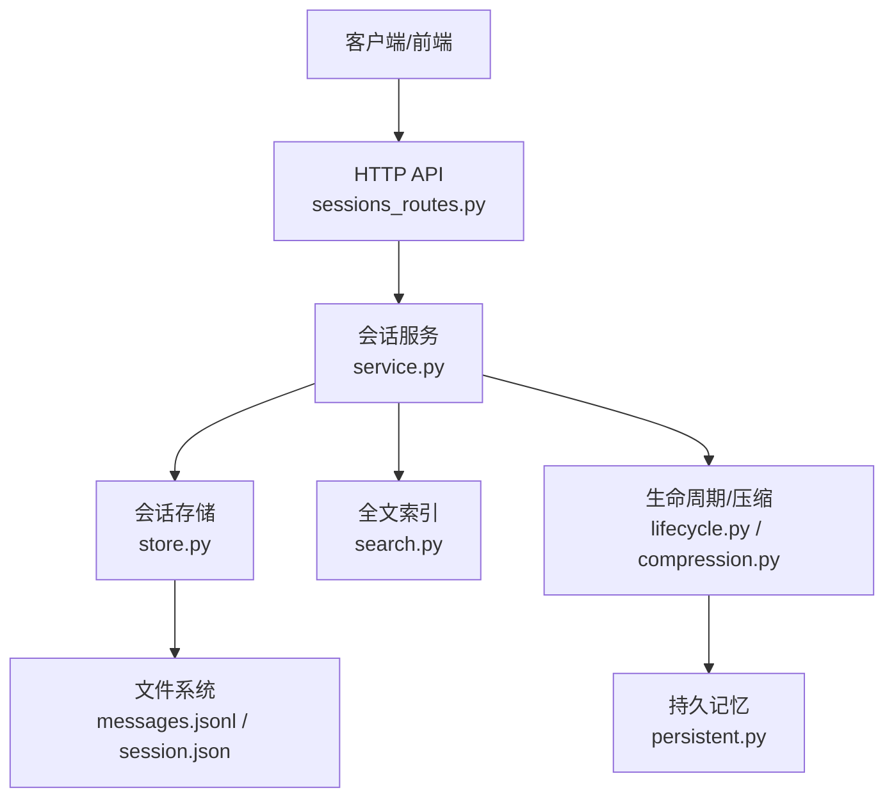
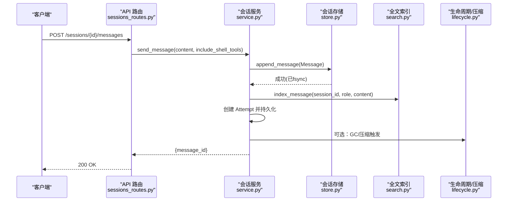
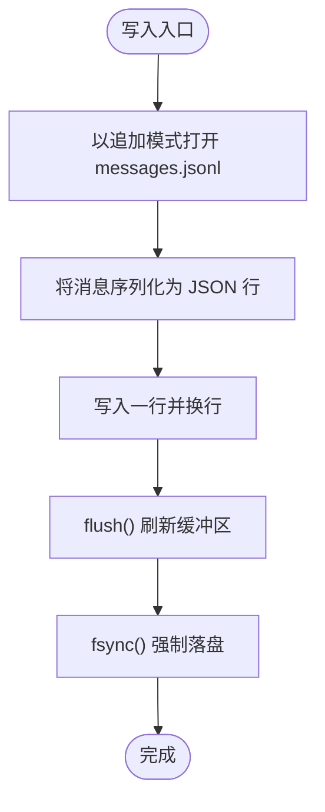
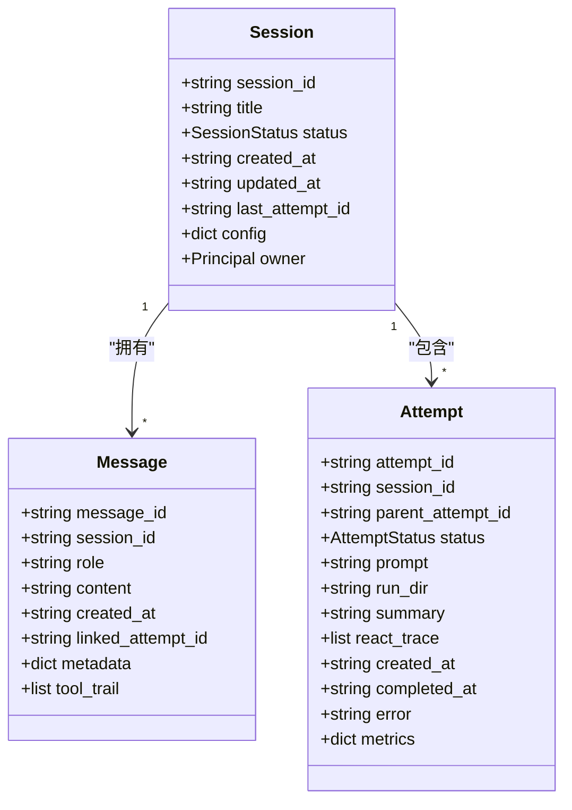
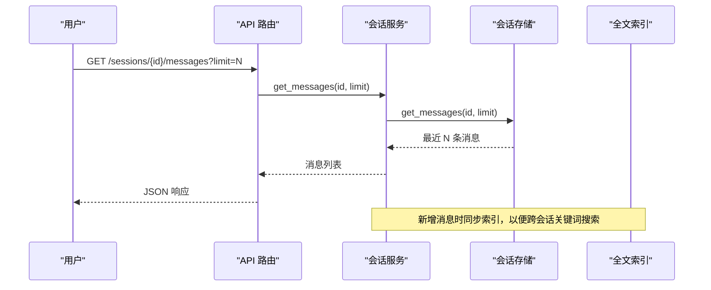
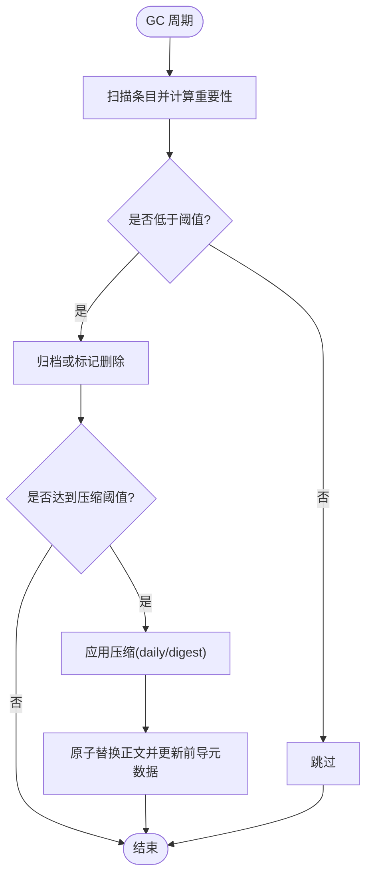
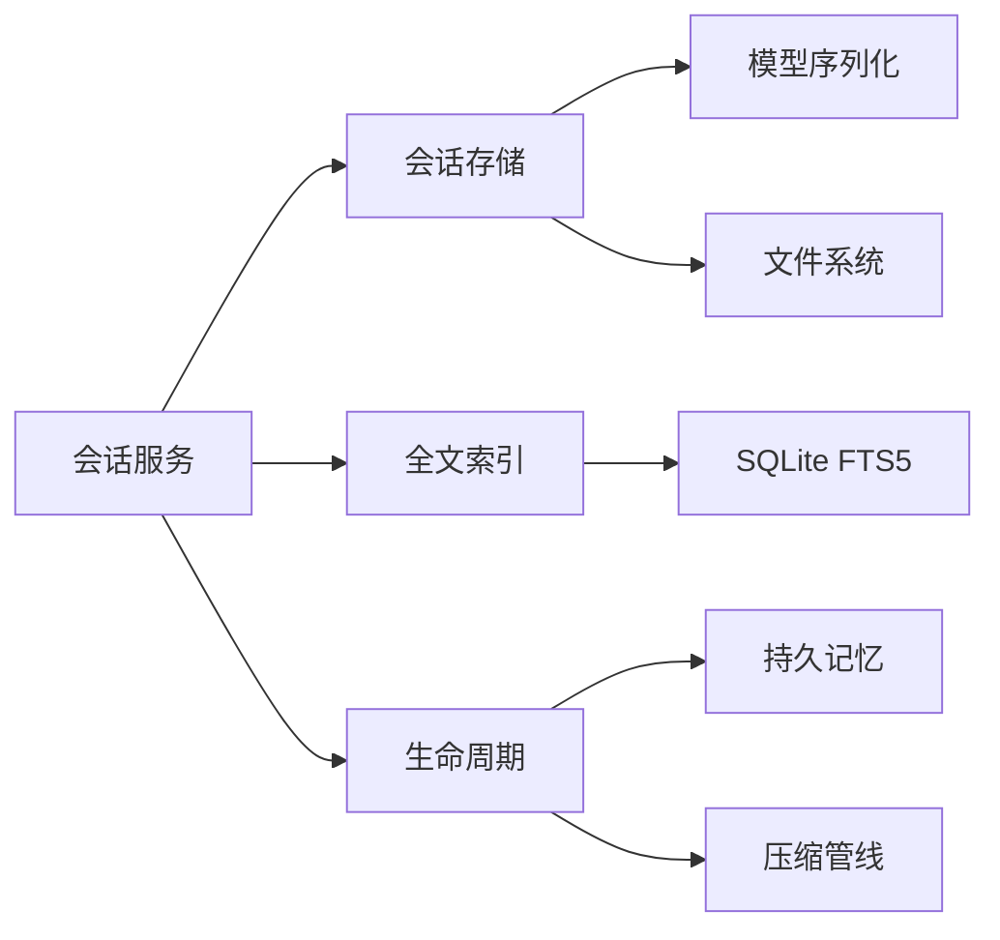

# 消息历史管理

<cite>
**本文引用的文件**
- [store.py](file://agent/src/session/store.py)
- [models.py](file://agent/src/session/models.py)
- [search.py](file://agent/src/session/search.py)
- [service.py](file://agent/src/session/service.py)
- [sessions_routes.py](file://agent/src/api/sessions_routes.py)
- [compression.py](file://agent/src/memory/compression.py)
- [lifecycle.py](file://agent/src/memory/lifecycle.py)
- [persistent.py](file://agent/src/memory/persistent.py)
- [test_session_store_messages_corrupt.py](file://agent/tests/test_session_store_messages_corrupt.py)
</cite>

## 目录
1. [简介](#简介)
2. [项目结构](#项目结构)
3. [核心组件](#核心组件)
4. [架构总览](#架构总览)
5. [详细组件分析](#详细组件分析)
6. [依赖关系分析](#依赖关系分析)
7. [性能考量](#性能考量)
8. [故障排查指南](#故障排查指南)
9. [结论](#结论)
10. [附录](#附录)

## 简介
本文件面向 Vibe-Trading 的消息历史管理子系统，系统性说明基于 JSONL 的会话消息日志格式、追加写入与数据完整性保障、消息存储结构与元数据、跨会话检索机制（时间范围、关键词搜索、分页）、压缩与归档策略（含大会话优化），以及备份恢复与分析导出方法。文档同时给出关键流程图与时序图，帮助读者快速理解从 API 到持久化的完整链路。

## 项目结构
消息历史管理由“会话服务 + 文件系统存储 + 全文索引 + 生命周期/压缩”四部分组成：
- 会话服务：负责消息入队、尝试执行、事件广播与对外接口编排
- 文件系统存储：以 JSONL 追加日志持久化消息，JSON 保存会话与尝试元信息
- 全文索引：SQLite FTS5 提供跨会话全文检索与片段高亮
- 生命周期与压缩：对长期未访问的记忆进行重要性衰减、归档与多级压缩（raw/daily/digest）

**图示来源**
- [sessions_routes.py:335-750](file://agent/src/api/sessions_routes.py#L335-L750)
- [service.py:266-293](file://agent/src/session/service.py#L266-L293)
- [store.py:16-193](file://agent/src/session/store.py#L16-L193)
- [search.py:60-86](file://agent/src/session/search.py#L60-L86)
- [lifecycle.py:183-273](file://agent/src/memory/lifecycle.py#L183-L273)
- [compression.py:163-356](file://agent/src/memory/compression.py#L163-L356)
- [persistent.py:200-654](file://agent/src/memory/persistent.py#L200-L654)

**章节来源**
- [sessions_routes.py:335-750](file://agent/src/api/sessions_routes.py#L335-L750)
- [service.py:266-293](file://agent/src/session/service.py#L266-L293)
- [store.py:16-193](file://agent/src/session/store.py#L16-L193)
- [search.py:60-86](file://agent/src/session/search.py#L60-L86)
- [lifecycle.py:183-273](file://agent/src/memory/lifecycle.py#L183-L273)
- [compression.py:163-356](file://agent/src/memory/compression.py#L163-L356)
- [persistent.py:200-654](file://agent/src/memory/persistent.py#L200-L654)

## 核心组件
- 会话与消息模型：定义 Session、Message、Attempt 的数据结构与序列化
- 会话存储：JSONL 追加写入消息，JSON 持久化会话与尝试记录
- 全文索引：SQLite FTS5 维护跨会话消息倒排索引，支持片段高亮与相关性排序
- 生命周期与压缩：按访问时间和质量评分驱动的重要性衰减、归档与多级压缩
- 持久记忆：跨会话的 Markdown 记忆库，支持前导元数据、去重、语义链接与 FTS 索引

**章节来源**
- [models.py:140-342](file://agent/src/session/models.py#L140-L342)
- [store.py:16-193](file://agent/src/session/store.py#L16-L193)
- [search.py:1-86](file://agent/src/session/search.py#L1-L86)
- [lifecycle.py:71-273](file://agent/src/memory/lifecycle.py#L71-L273)
- [compression.py:163-356](file://agent/src/memory/compression.py#L163-L356)
- [persistent.py:200-654](file://agent/src/memory/persistent.py#L200-L654)

## 架构总览
下图展示一次用户消息发送的端到端流程：API 接收请求，服务层落盘消息并更新索引，随后触发智能体执行并创建尝试记录。

**图示来源**
- [sessions_routes.py:732-751](file://agent/src/api/sessions_routes.py#L732-L751)
- [service.py:266-293](file://agent/src/session/service.py#L266-L293)
- [store.py:155-166](file://agent/src/session/store.py#L155-L166)
- [search.py:60-86](file://agent/src/session/search.py#L60-L86)
- [lifecycle.py:243-273](file://agent/src/memory/lifecycle.py#L243-L273)

## 详细组件分析

### JSONL 日志格式设计与优势
- 设计要点
  - 每行一个 JSON 对象，表示一条消息；顺序即时间顺序
  - 追加写入模式：打开文件以追加模式写入，写后 flush 并 fsync，确保崩溃不丢消息
  - 容错读取：读取时逐行解析，跳过损坏或非对象行，保证相邻消息可被恢复
- 优势
  - 低开销追加：避免随机写与大文件重写
  - 强一致性：fsync 保证落盘
  - 高可用：单行自描述，便于断点续读与增量处理

**图示来源**
- [store.py:155-166](file://agent/src/session/store.py#L155-L166)

**章节来源**
- [store.py:155-166](file://agent/src/session/store.py#L155-L166)
- [test_session_store_messages_corrupt.py:20-73](file://agent/tests/test_session_store_messages_corrupt.py#L20-L73)

### 消息存储结构与字段说明
- 会话与会话元数据
  - session.json：包含会话 ID、标题、状态、创建/更新时间、最近尝试 ID、配置、所有者等
- 消息记录
  - messages.jsonl：每条消息包含消息 ID、会话 ID、角色（user/assistant/system）、内容、创建时间、关联尝试 ID、元数据、工具调用轨迹等
- 尝试记录
  - attempts/{attempt_id}/attempt.json：包含尝试 ID、会话 ID、父尝试 ID、状态、提示词、运行目录、摘要、ReAct 轨迹、时间戳、错误、指标快照等

**图示来源**
- [models.py:140-342](file://agent/src/session/models.py#L140-L342)

**章节来源**
- [models.py:140-342](file://agent/src/session/models.py#L140-L342)
- [store.py:16-193](file://agent/src/session/store.py#L16-L193)

### 消息检索机制
- 按时间范围查询
  - 通过返回的 created_at 在客户端侧过滤；服务端提供 limit 分页参数控制返回条数
- 关键词搜索
  - 使用 SQLite FTS5 建立跨会话消息索引，支持相关性排序与片段高亮
  - 首次空结果且存在条目时自动重建索引，确保可用性
- 分页加载
  - GET /sessions/{id}/messages 支持 limit 参数（默认 100，最大 1000）
  - SSE 事件流支持 Last-Event-ID 断点续传与回放

**图示来源**
- [sessions_routes.py:765-785](file://agent/src/api/sessions_routes.py#L765-L785)
- [store.py:168-197](file://agent/src/session/store.py#L168-L197)
- [search.py:60-86](file://agent/src/session/search.py#L60-L86)

**章节来源**
- [sessions_routes.py:765-785](file://agent/src/api/sessions_routes.py#L765-L785)
- [store.py:168-197](file://agent/src/session/store.py#L168-L197)
- [search.py:60-86](file://agent/src/session/search.py#L60-L86)

### 消息压缩与归档策略（含大会话优化）
- 触发条件
  - 基于最后访问时间：超过阈值则进入下一级压缩（raw→daily→digest）
- 压缩策略
  - daily：TF-IDF 句子打分，保留首尾句与 Top-K 关键句，附带关键词上下文头
  - digest：提取高频重要术语，生成要点式摘要
- 归档与原子性
  - 压缩前先归档原始文件（archive/ 目录），采用临时文件+原子替换，失败回滚
- 与 GC 集成
  - 生命周期模块在 GC 周期中评估重要性，低于阈值归档或删除（默认仅归档），并对老化条目触发压缩
- 大会话优化建议
  - 合理设置 limit 分页与 SSE 回放窗口，避免一次性拉取超大消息集
  - 启用压缩与 GC，降低长期未访问内容的体积与内存占用

**图示来源**
- [lifecycle.py:183-273](file://agent/src/memory/lifecycle.py#L183-L273)
- [compression.py:163-356](file://agent/src/memory/compression.py#L163-L356)

**章节来源**
- [lifecycle.py:183-273](file://agent/src/memory/lifecycle.py#L183-L273)
- [compression.py:163-356](file://agent/src/memory/compression.py#L163-L356)

### 备份与恢复
- 备份
  - 会话根目录：包含 session.json、messages.jsonl、attempts/ 子目录
  - 全文索引：sessions.db（SQLite WAL 模式）
  - 记忆库：~/.vibe-trading/memory（含 MEMORY.md 与 .md 条目）
- 恢复
  - 直接复制上述目录至新环境，重启服务即可重建索引与服务状态
  - 若索引缺失，首次搜索将自动重建

**章节来源**
- [store.py:16-193](file://agent/src/session/store.py#L16-L193)
- [search.py:1-86](file://agent/src/session/search.py#L1-L86)
- [persistent.py:200-654](file://agent/src/memory/persistent.py#L200-L654)

### 数据分析与导出工具
- 会话列表与详情：GET /sessions、GET /sessions/{id}
- 消息导出：GET /sessions/{id}/messages?limit=N，结合 created_at 做时间范围筛选
- 全文检索：通过 sessions.db 的 FTS5 表进行跨会话关键词搜索（需数据库直连或使用内部索引 API）
- 记忆库分析：扫描 memory/*.md 的前导元数据与正文，统计关键词、质量分数、访问次数与重要性

**章节来源**
- [sessions_routes.py:366-431](file://agent/src/api/sessions_routes.py#L366-L431)
- [sessions_routes.py:765-785](file://agent/src/api/sessions_routes.py#L765-L785)
- [search.py:1-86](file://agent/src/session/search.py#L1-L86)
- [persistent.py:200-654](file://agent/src/memory/persistent.py#L200-L654)

## 依赖关系分析
- 会话服务依赖
  - 存储：append/get 消息、创建/更新/删除会话与尝试
  - 索引：index_message 用于全文检索
  - 生命周期：GC 与压缩触发
- 存储依赖
  - 文件系统：JSONL 追加与 JSON 读写
  - 模型：Message/Session/Attempt 的序列化/反序列化
- 索引依赖
  - SQLite：WAL 模式提升并发读性能
- 生命周期依赖
  - 持久记忆：MemoryEntry、frontmatter 解析、重要性计算
  - 压缩管线：TF-IDF 句子打分、归档与原子替换

**图示来源**
- [service.py:266-293](file://agent/src/session/service.py#L266-L293)
- [store.py:16-193](file://agent/src/session/store.py#L16-L193)
- [search.py:60-86](file://agent/src/session/search.py#L60-L86)
- [lifecycle.py:183-273](file://agent/src/memory/lifecycle.py#L183-L273)
- [compression.py:163-356](file://agent/src/memory/compression.py#L163-L356)
- [persistent.py:200-654](file://agent/src/memory/persistent.py#L200-L654)

**章节来源**
- [service.py:266-293](file://agent/src/session/service.py#L266-L293)
- [store.py:16-193](file://agent/src/session/store.py#L16-L193)
- [search.py:60-86](file://agent/src/session/search.py#L60-L86)
- [lifecycle.py:183-273](file://agent/src/memory/lifecycle.py#L183-L273)
- [compression.py:163-356](file://agent/src/memory/compression.py#L163-L356)
- [persistent.py:200-654](file://agent/src/memory/persistent.py#L200-L654)

## 性能考量
- 写入路径
  - JSONL 追加 + fsync：保证幂等与崩溃安全，适合高频写入
  - 限制单次批量大小，避免大事务阻塞
- 读取路径
  - 分页 limit：默认 100，最大 1000，减少网络与渲染压力
  - 全文索引：FTS5 提供 O(logN) 级别检索，避免全量扫描
- 压缩与 GC
  - 按访问时间与质量评分驱动，降低冷数据体积
  - 归档优先于删除，避免误删风险
- 并发与锁
  - 记忆库使用文件级锁防止并发写冲突
  - SQLite WAL 模式提升并发读性能

[本节为通用性能指导，无需特定文件引用]

## 故障排查指南
- 消息读取跳过损坏行
  - 现象：messages.jsonl 中存在非对象或非法键的行
  - 行为：读取时跳过损坏行，保留相邻有效消息
  - 参考：测试用例验证了 null 行与多余键行的跳过逻辑
- 会话不存在或运行时未启用
  - 现象：API 返回 501/404
  - 处理：检查会话是否存在、会话运行时是否启用
- 索引为空或失效
  - 现象：关键词搜索无结果
  - 行为：首次空结果且存在条目时自动重建索引
- 压缩失败
  - 现象：归档失败导致压缩中止，避免数据丢失
  - 处理：检查 archive/ 目录权限与磁盘空间

**章节来源**
- [test_session_store_messages_corrupt.py:20-73](file://agent/tests/test_session_store_messages_corrupt.py#L20-L73)
- [sessions_routes.py:366-431](file://agent/src/api/sessions_routes.py#L366-L431)
- [search.py:60-86](file://agent/src/session/search.py#L60-L86)
- [compression.py:295-337](file://agent/src/memory/compression.py#L295-L337)

## 结论
Vibe-Trading 的消息历史管理以 JSONL 追加日志为核心，结合 SQLite FTS5 全文索引与生命周期压缩，实现了高性能、可扩展、可恢复的会话消息存储与检索方案。通过严格的数据完整性保障（fsync、容错读取、原子替换）与分级压缩策略，系统在大会话与长生命周期场景下仍能保持良好性能与稳定性。配合完善的备份恢复与分析导出能力，可满足研究、审计与运营的多重需求。

## 附录
- 常用 API
  - 创建会话：POST /sessions
  - 列出会话：GET /sessions?limit=N
  - 获取会话：GET /sessions/{id}
  - 发送消息：POST /sessions/{id}/messages
  - 获取消息：GET /sessions/{id}/messages?limit=N
  - 会话事件流：GET /sessions/{id}/events（支持 Last-Event-ID）
- 环境变量
  - VT_MEMORY_QUALITY：启用质量评分与访问追踪
  - VT_MEMORY_GC：启用垃圾回收
  - VT_MEMORY_DECAY：启用重要性衰减
  - VT_MEMORY_COMPRESSION：启用压缩
  - VT_MEMORY_FTS_INDEX：启用 FTS5 索引
- 文件位置
  - 会话存储：sessions/{session_id}/session.json、messages.jsonl、attempts/
  - 全文索引：sessions.db（WAL 模式）
  - 记忆库：~/.vibe-trading/memory（含 MEMORY.md 与 .md 条目）

[本节为补充信息，无需特定文件引用]