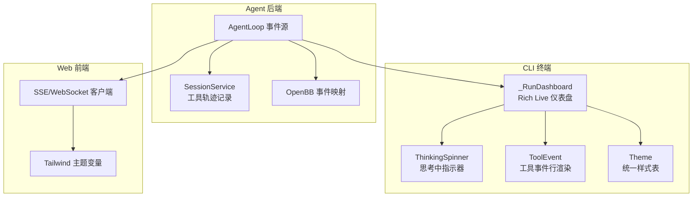
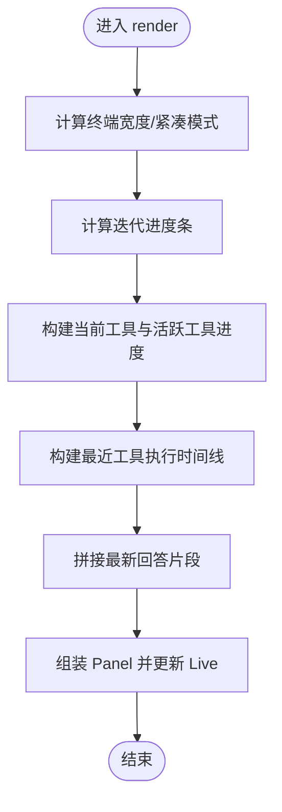
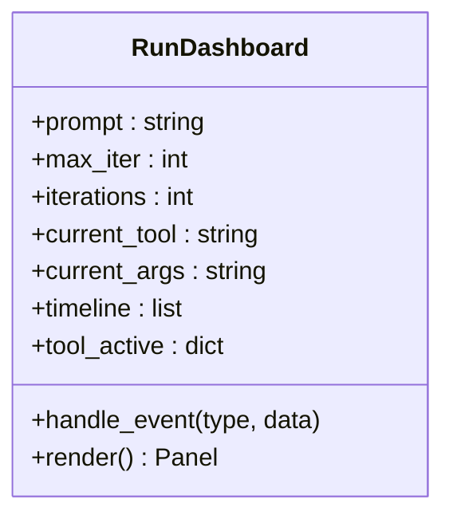
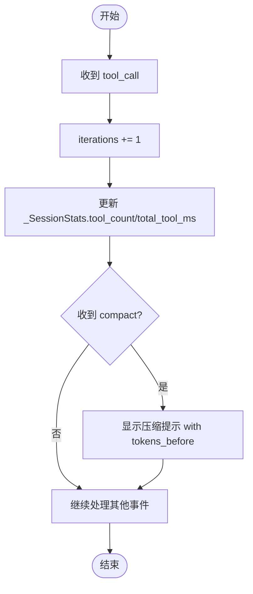
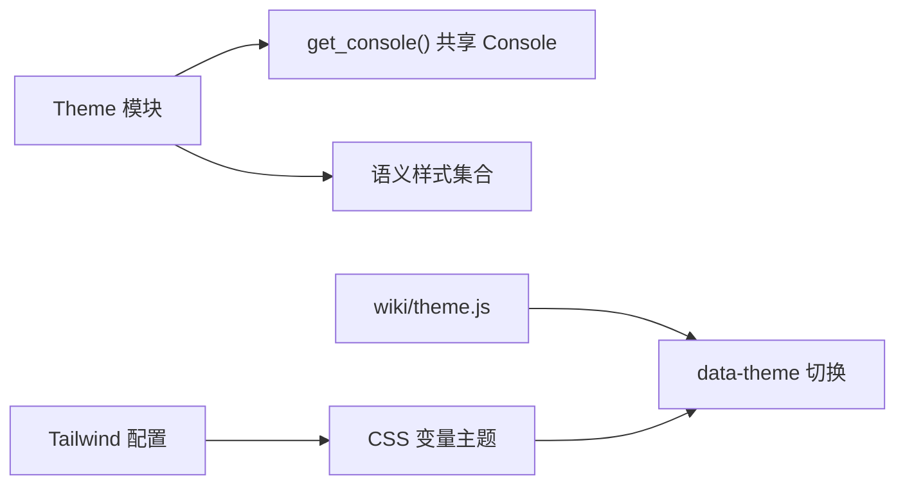
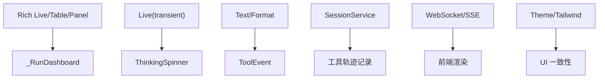

# 实时反馈

<cite>
**本文引用的文件**
- [agent/cli/_legacy.py](file://agent/cli/_legacy.py)
- [agent/cli/components/working_indicator.py](file://agent/cli/components/working_indicator.py)
- [agent/cli/components/tool_event.py](file://agent/cli/components/tool_event.py)
- [agent/cli/theme.py](file://agent/cli/theme.py)
- [agent/src/session/service.py](file://agent/src/session/service.py)
- [agent/src/openbb_bridge/event_mapper.py](file://agent/src/openbb_bridge/event_mapper.py)
- [agent/src/channels/websocket.py](file://agent/src/channels/websocket.py)
- [agent/src/api/sessions_routes.py](file://agent/src/api/sessions_routes.py)
- [frontend/tailwind.config.ts](file://frontend/tailwind.config.ts)
- [wiki/theme.js](file://wiki/theme.js)
</cite>

## 目录
1. [简介](#简介)
2. [项目结构](#项目结构)
3. [核心组件](#核心组件)
4. [架构总览](#架构总览)
5. [详细组件分析](#详细组件分析)
6. [依赖关系分析](#依赖关系分析)
7. [性能考量](#性能考量)
8. [故障诊断指南](#故障诊断指南)
9. [结论](#结论)
10. [附录](#附录)

## 简介
本文件面向 Vibe-Trading 的“实时反馈系统”，聚焦于交互式界面的工作原理与渲染机制，包括：
- Rich Live 渲染引擎的使用与实时更新策略
- 工作指示器（进度条、状态指示器、耗时统计）的显示逻辑
- 工具调用事件的实时展示（执行过程、参数传递、结果返回）
- 调试面板功能（迭代次数统计、工具调用计数、上下文大小估算）
- 界面定制与主题配置选项
- 如何解读与分析实时反馈信息，帮助开发者理解 Agent 的执行流程
- 性能监控与故障诊断技巧

## 项目结构
实时反馈由 CLI 层（终端交互）、Agent 事件流（后端）、前端 Web UI（可选）三部分协同完成。CLI 通过 Rich Live 提供高刷新率的仪表盘；Agent 在运行过程中持续发出事件；前端通过 SSE/WebSocket 订阅并渲染。



图表来源
- [agent/cli/_legacy.py:559-883](file://agent/cli/_legacy.py#L559-L883)
- [agent/cli/components/working_indicator.py:54-119](file://agent/cli/components/working_indicator.py#L54-L119)
- [agent/cli/components/tool_event.py:150-215](file://agent/cli/components/tool_event.py#L150-L215)
- [agent/cli/theme.py:125-188](file://agent/cli/theme.py#L125-L188)
- [agent/src/session/service.py:577-610](file://agent/src/session/service.py#L577-L610)
- [agent/src/openbb_bridge/event_mapper.py:83-114](file://agent/src/openbb_bridge/event_mapper.py#L83-L114)
- [agent/src/channels/websocket.py:1085-1122](file://agent/src/channels/websocket.py#L1085-L1122)
- [agent/src/api/sessions_routes.py:776-801](file://agent/src/api/sessions_routes.py#L776-L801)
- [frontend/tailwind.config.ts:6-21](file://frontend/tailwind.config.ts#L6-L21)

章节来源
- [agent/cli/_legacy.py:559-883](file://agent/cli/_legacy.py#L559-L883)
- [agent/cli/components/working_indicator.py:54-119](file://agent/cli/components/working_indicator.py#L54-L119)
- [agent/cli/components/tool_event.py:150-215](file://agent/cli/components/tool_event.py#L150-L215)
- [agent/cli/theme.py:125-188](file://agent/cli/theme.py#L125-L188)
- [agent/src/session/service.py:577-610](file://agent/src/session/service.py#L577-L610)
- [agent/src/openbb_bridge/event_mapper.py:83-114](file://agent/src/openbb_bridge/event_mapper.py#L83-L114)
- [agent/src/channels/websocket.py:1085-1122](file://agent/src/channels/websocket.py#L1085-L1122)
- [agent/src/api/sessions_routes.py:776-801](file://agent/src/api/sessions_routes.py#L776-L801)
- [frontend/tailwind.config.ts:6-21](file://frontend/tailwind.config.ts#L6-L21)

## 核心组件
- _RunDashboard：基于 Rich Live 的实时仪表盘，负责进度条、当前工具、活跃工具进度、时间线、最新回答片段等。
- ThinkingSpinner：封装 Rich Live 的瞬态旋转指示器，用于“思考中”提示，支持暂停与动词切换。
- ToolEvent：将工具调用事件渲染为单行文本，包含状态标记、工具名美化、参数摘要、耗时与结果摘要。
- Theme：集中管理 CLI 颜色与样式，确保一致的品牌色与语义化样式。
- SessionService：将工具调用事件合并为紧凑的工具轨迹记录，便于回放与持久化。
- OpenBB 事件映射：将工具结果等事件转换为推理步骤消息，便于统一展示。
- WebSocket/SSE：将运行时模型更新、会话事件以流式方式推送给前端。

章节来源
- [agent/cli/_legacy.py:559-883](file://agent/cli/_legacy.py#L559-L883)
- [agent/cli/components/working_indicator.py:54-119](file://agent/cli/components/working_indicator.py#L54-L119)
- [agent/cli/components/tool_event.py:150-215](file://agent/cli/components/tool_event.py#L150-L215)
- [agent/cli/theme.py:125-188](file://agent/cli/theme.py#L125-L188)
- [agent/src/session/service.py:577-610](file://agent/src/session/service.py#L577-L610)
- [agent/src/openbb_bridge/event_mapper.py:83-114](file://agent/src/openbb_bridge/event_mapper.py#L83-L114)
- [agent/src/channels/websocket.py:1085-1122](file://agent/src/channels/websocket.py#L1085-L1122)
- [agent/src/api/sessions_routes.py:776-801](file://agent/src/api/sessions_routes.py#L776-L801)

## 架构总览
下图展示了从 Agent 事件到 CLI 仪表盘与 Web 前端的完整数据流。

```mermaid
sequenceDiagram
participant Loop as "AgentLoop"
participant Dash as "_RunDashboard"
participant Spinner as "ThinkingSpinner"
participant TE as "ToolEvent"
participant WS as "WebSocket/SSE"
participant FE as "前端"
Loop->>Dash : 发送 text_delta/thinking_done/tool_call/tool_progress/tool_result/compact
Dash->>Dash : 更新进度条/当前工具/活跃工具进度/时间线
Dash->>Spinner : 更新思考中指示器可选
Dash->>TE : 渲染工具事件行可选
Loop->>WS : 推送会话事件SSE/WebSocket
WS-->>FE : 事件帧delta/stream_end 等
FE-->>FE : 根据 Tailwind 主题渲染
```

图表来源
- [agent/cli/_legacy.py:604-717](file://agent/cli/_legacy.py#L604-L717)
- [agent/cli/components/working_indicator.py:81-119](file://agent/cli/components/working_indicator.py#L81-L119)
- [agent/cli/components/tool_event.py:150-215](file://agent/cli/components/tool_event.py#L150-L215)
- [agent/src/channels/websocket.py:1085-1122](file://agent/src/channels/websocket.py#L1085-L1122)
- [agent/src/api/sessions_routes.py:776-801](file://agent/src/api/sessions_routes.py#L776-L801)

## 详细组件分析

### Rich Live 渲染引擎与实时更新机制
- 使用 Rich Live 创建可更新的 Panel，按固定频率刷新，避免阻塞主循环。
- 仪表盘维护 timeline（最近若干条工具执行记录）、tool_active（并行工具进度）、latest_text（最新回答片段）。
- 对高频 tool_progress 进行节流，防止渲染线程被频繁调用拖慢。



图表来源
- [agent/cli/_legacy.py:795-883](file://agent/cli/_legacy.py#L795-L883)

章节来源
- [agent/cli/_legacy.py:604-717](file://agent/cli/_legacy.py#L604-L717)
- [agent/cli/_legacy.py:795-883](file://agent/cli/_legacy.py#L795-L883)

### 工作指示器的显示逻辑
- 进度条：基于 iterations/max_iter 计算填充比例，紧凑模式下缩短条形宽度。
- 状态指示器：timeline 中的状态列根据 status 映射为 running/ok/check，并附带耗时与预览。
- 耗时统计：每次 tool_result 携带 elapsed_ms，换算为秒显示；活跃工具进度行也显示 elapsed_s。



图表来源
- [agent/cli/_legacy.py:559-717](file://agent/cli/_legacy.py#L559-L717)
- [agent/cli/_legacy.py:795-883](file://agent/cli/_legacy.py#L795-L883)

章节来源
- [agent/cli/_legacy.py:559-717](file://agent/cli/_legacy.py#L559-L717)
- [agent/cli/_legacy.py:795-883](file://agent/cli/_legacy.py#L795-L883)

### 工具调用事件的实时展示
- 事件类型：
  - tool_call：记录工具名称、参数摘要、进入 running 状态。
  - tool_heartbeat：长耗时工具的保活心跳，更新 elapsed_s。
  - tool_progress：结构化阶段/进度/消息，支持 ETA 估算与进度条。
  - tool_result：完成时写入 timeline，匹配对应 running 行并更新状态与耗时。
- 参数传递与结果返回可视化：
  - 参数摘要优先取 query/prompt，否则取前两个 key=value 并截断。
  - 结果预览针对特定工具（如 backtest/shadow report/bash）做格式化。

```mermaid
sequenceDiagram
participant Loop as "AgentLoop"
participant Dash as "_RunDashboard"
participant TE as "ToolEvent"
Loop->>Dash : tool_call(tool, args)
Dash->>Dash : 更新 current_tool/current_args, 追加 timeline running
Loop->>Dash : tool_heartbeat(tool, elapsed_s)
Dash->>Dash : 更新 tool_active.elapsed_s
Loop->>Dash : tool_progress(tool, stage, current, total, message)
Dash->>Dash : 更新阶段/进度/消息, 节流刷新
Loop->>Dash : tool_result(tool, status, elapsed_ms, preview)
Dash->>Dash : 匹配 running 行, 更新状态/耗时/预览
Dash->>TE : 渲染工具事件行可选
```

图表来源
- [agent/cli/_legacy.py:619-711](file://agent/cli/_legacy.py#L619-L711)
- [agent/cli/components/tool_event.py:150-215](file://agent/cli/components/tool_event.py#L150-L215)

章节来源
- [agent/cli/_legacy.py:619-711](file://agent/cli/_legacy.py#L619-L711)
- [agent/cli/components/tool_event.py:150-215](file://agent/cli/components/tool_event.py#L150-L215)

### 调试面板的功能和使用方法
- 迭代次数统计：dashboard.iterations 自增，配合 max_iter 计算进度条。
- 工具调用计数与耗时：_SessionStats 累计 tool_count 与 total_tool_ms，并在状态栏显示“last Xs”和“N tools (Ys)”。
- 上下文大小估算：compact 事件携带 tokens_before，dashboard 将其作为警告行显示“compressed after N tokens”。



图表来源
- [agent/cli/_legacy.py:142-186](file://agent/cli/_legacy.py#L142-L186)
- [agent/cli/_legacy.py:619-717](file://agent/cli/_legacy.py#L619-L717)

章节来源
- [agent/cli/_legacy.py:142-186](file://agent/cli/_legacy.py#L142-L186)
- [agent/cli/_legacy.py:619-717](file://agent/cli/_legacy.py#L619-L717)

### 界面定制与主题配置
- CLI 主题：
  - 通过 Theme 暴露 primary/success/danger/warning/info/muted/bold/label/accent_bg 等语义样式。
  - 自动检测深色/浅色终端，支持 NO_COLOR 环境变量禁用色彩。
  - 品牌橙色在亮/暗终端下分别取值，保持对比度与一致性。
- Web 前端主题：
  - Tailwind 扩展 colors，使用 CSS 变量定义 border/background/foreground 等。
  - wiki/theme.js 提供本地存储的主题切换逻辑（dark/light），并应用至根节点。



图表来源
- [agent/cli/theme.py:125-188](file://agent/cli/theme.py#L125-L188)
- [frontend/tailwind.config.ts:6-21](file://frontend/tailwind.config.ts#L6-L21)
- [wiki/theme.js:1-31](file://wiki/theme.js#L1-L31)

章节来源
- [agent/cli/theme.py:125-188](file://agent/cli/theme.py#L125-L188)
- [frontend/tailwind.config.ts:6-21](file://frontend/tailwind.config.ts#L6-L21)
- [wiki/theme.js:1-31](file://wiki/theme.js#L1-L31)

### 解读与分析实时反馈信息
- 工具执行过程：
  - 关注 timeline 的 State 列（running/ok/check）与 Time 列（耗时）。
  - 活跃工具进度行显示 stage/current/total/message，以及 ETA（当有 count 且稳定阶段）。
- 参数传递：
  - 工具调用行会显示参数摘要（query/prompt 或前两个键值对），便于快速定位输入。
- 结果返回：
  - tool_result 的 preview 针对特定工具做了格式化（如回测指标、报告链接、命令输出）。
- 上下文压缩：
  - compact 事件提示上下文被压缩，tokens_before 表示压缩前的 token 数，有助于判断上下文压力。

章节来源
- [agent/cli/_legacy.py:619-717](file://agent/cli/_legacy.py#L619-L717)
- [agent/cli/_legacy.py:893-940](file://agent/cli/_legacy.py#L893-L940)
- [agent/src/openbb_bridge/event_mapper.py:83-114](file://agent/src/openbb_bridge/event_mapper.py#L83-L114)

## 依赖关系分析
- CLI 仪表盘依赖 Rich Live、Table、Panel 等组件进行高刷新率渲染。
- ThinkingSpinner 依赖 Rich Live 的 transient 模式，避免“幽灵旋转器”问题。
- ToolEvent 依赖 Rich Text 与统一的时长格式化（若可用则委托外部模块，否则本地实现）。
- SessionService 将工具轨迹事件合并为紧凑历史，便于回放。
- WebSocket/SSE 将运行时模型更新与会话事件推送到前端，前端使用 Tailwind 主题变量渲染。



图表来源
- [agent/cli/_legacy.py:559-883](file://agent/cli/_legacy.py#L559-L883)
- [agent/cli/components/working_indicator.py:54-119](file://agent/cli/components/working_indicator.py#L54-L119)
- [agent/cli/components/tool_event.py:150-215](file://agent/cli/components/tool_event.py#L150-L215)
- [agent/src/session/service.py:577-610](file://agent/src/session/service.py#L577-L610)
- [agent/src/channels/websocket.py:1085-1122](file://agent/src/channels/websocket.py#L1085-L1122)
- [agent/cli/theme.py:125-188](file://agent/cli/theme.py#L125-L188)
- [frontend/tailwind.config.ts:6-21](file://frontend/tailwind.config.ts#L6-L21)

章节来源
- [agent/cli/_legacy.py:559-883](file://agent/cli/_legacy.py#L559-L883)
- [agent/cli/components/working_indicator.py:54-119](file://agent/cli/components/working_indicator.py#L54-L119)
- [agent/cli/components/tool_event.py:150-215](file://agent/cli/components/tool_event.py#L150-L215)
- [agent/src/session/service.py:577-610](file://agent/src/session/service.py#L577-L610)
- [agent/src/channels/websocket.py:1085-1122](file://agent/src/channels/websocket.py#L1085-L1122)
- [agent/cli/theme.py:125-188](file://agent/cli/theme.py#L125-L188)
- [frontend/tailwind.config.ts:6-21](file://frontend/tailwind.config.ts#L6-L21)

## 性能考量
- 渲染节流：
  - tool_progress 事件在 dashboard 中进行节流（约每 0.25s 刷新一次），避免高频事件导致渲染卡顿。
  - no-rich 路径下，progress 打印限制为每工具每 0.5s 一次，减少 I/O 开销。
- 并发安全：
  - 读取 tool_active 时使用 list(...) 快照，避免 Rich 刷新线程与心跳/工作线程并发修改字典导致的竞态。
- 网络流式传输：
  - SSE/WebSocket 使用 keep-alive 与无缓存头，确保实时性；心跳 ping 维持连接健康。
- 主题与样式：
  - 统一 Theme 减少重复样式计算；Tailwind 变量集中管理，降低前端样式复杂度。

章节来源
- [agent/cli/_legacy.py:665-685](file://agent/cli/_legacy.py#L665-L685)
- [agent/cli/_legacy.py:1179-1208](file://agent/cli/_legacy.py#L1179-L1208)
- [agent/cli/_legacy.py:826-838](file://agent/cli/_legacy.py#L826-L838)
- [agent/src/api/sessions_routes.py:776-801](file://agent/src/api/sessions_routes.py#L776-L801)

## 故障诊断指南
- 工具长时间无结果：
  - 检查 timeline 是否停留在 running 且 tool_active 为空；可能为 tool_result 未到达，降级为 warning。
- 上下文压缩频繁：
  - 观察 compact 事件与 tokens_before，评估是否需要优化 prompt 或分段处理。
- 渲染卡顿：
  - 确认 tool_progress 节流是否生效；检查是否有异常高频事件。
- 主题不一致：
  - 检查 CLI 的 Theme 与前端 Tailwind 变量是否同步；确认 NO_COLOR 与环境变量设置。
- 网络连接问题：
  - 检查 SSE/WebSocket 心跳与断开重连；查看 sessions_routes 的事件生成器是否正确 yield。

章节来源
- [agent/cli/_legacy.py:625-640](file://agent/cli/_legacy.py#L625-L640)
- [agent/cli/_legacy.py:713-717](file://agent/cli/_legacy.py#L713-L717)
- [agent/cli/_legacy.py:665-685](file://agent/cli/_legacy.py#L665-L685)
- [agent/cli/theme.py:125-188](file://agent/cli/theme.py#L125-L188)
- [agent/src/api/sessions_routes.py:776-801](file://agent/src/api/sessions_routes.py#L776-L801)

## 结论
Vibe-Trading 的实时反馈系统通过 Rich Live 与事件驱动架构，提供了高刷新率、低延迟的交互式体验。CLI 仪表盘清晰展示进度、工具执行与结果；前端通过 SSE/WebSocket 接收事件并以主题化样式呈现。结合节流、并发安全与统一主题，系统在性能与一致性方面表现良好。开发者可通过时间线与工具事件行快速定位问题，利用调试面板统计与上下文压缩提示优化执行流程。

## 附录
- 关键事件类型参考：
  - text_delta：文本增量
  - thinking_done：思考结束
  - tool_call：工具调用开始
  - tool_heartbeat：工具心跳
  - tool_progress：工具进度
  - tool_result：工具结果
  - compact：上下文压缩
- 主题环境变量：
  - NO_COLOR：禁用彩色输出
  - VIBE_TRADING_THEME：强制 dark/light 主题（CLI）

章节来源
- [agent/cli/_legacy.py:604-717](file://agent/cli/_legacy.py#L604-L717)
- [agent/cli/theme.py:125-188](file://agent/cli/theme.py#L125-L188)