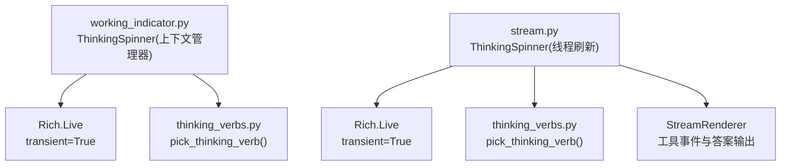
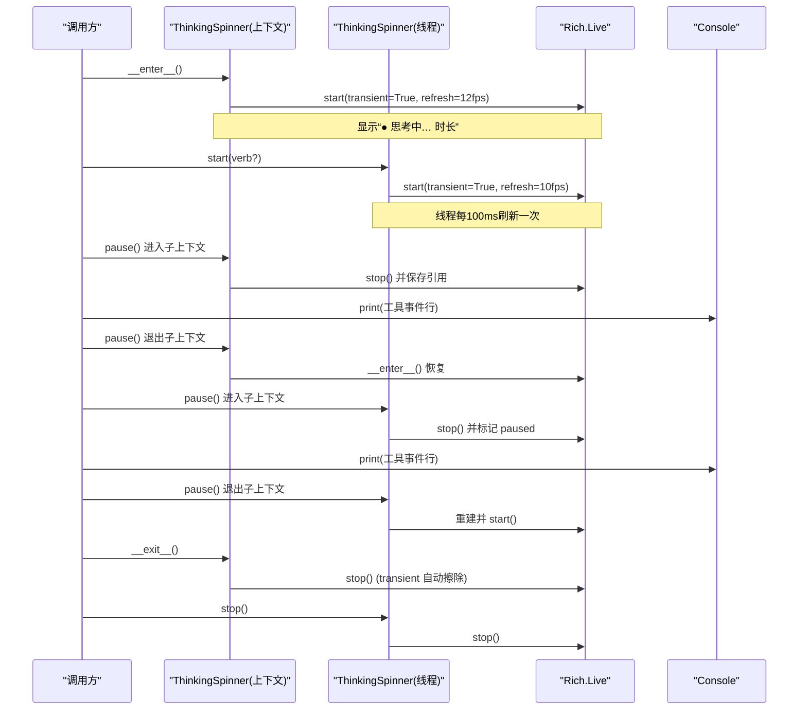
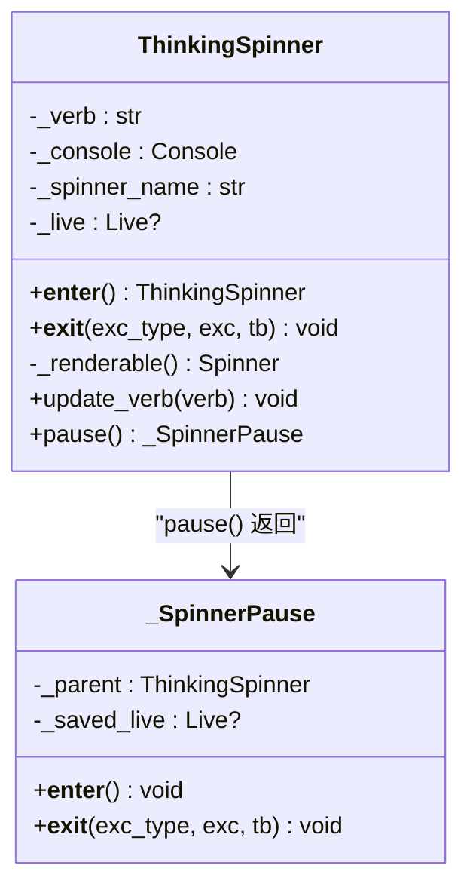
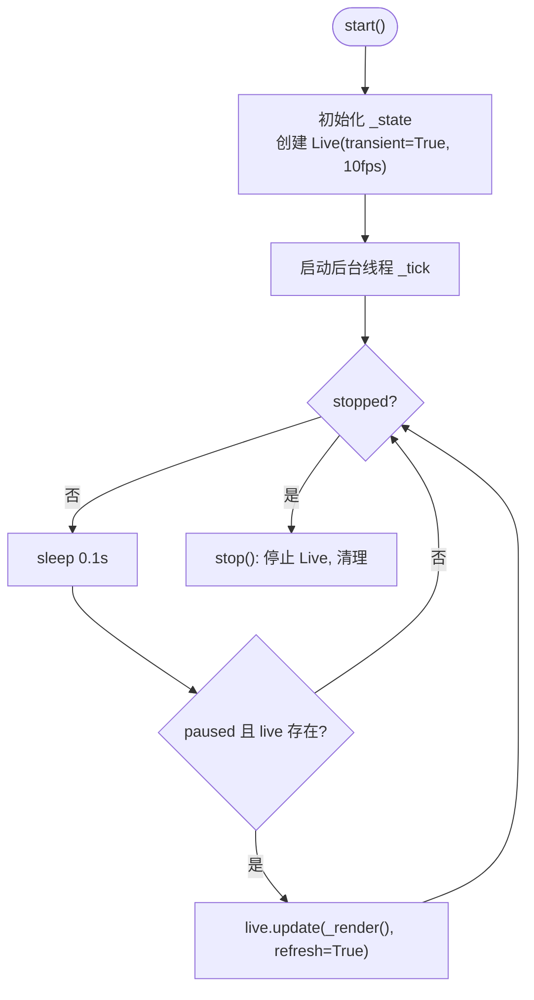
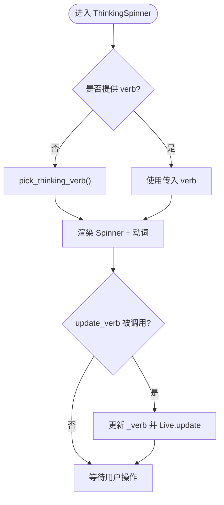
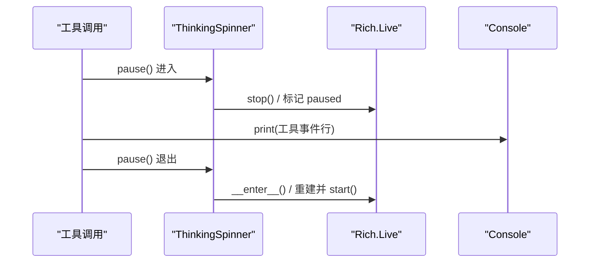
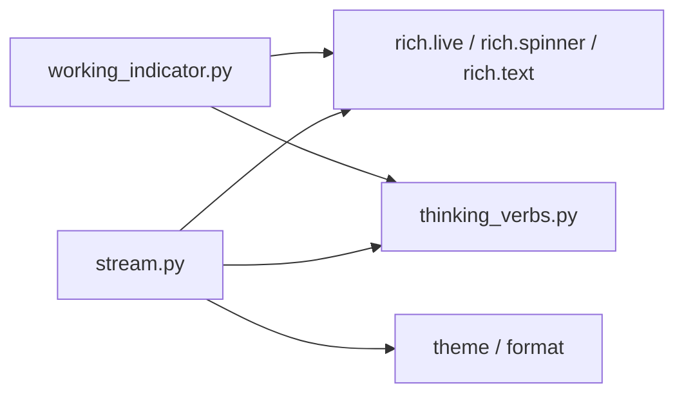

# 工作指示器

<cite>
**本文引用的文件**
- [agent/cli/components/working_indicator.py](file://agent/cli/components/working_indicator.py)
- [agent/cli/stream.py](file://agent/cli/stream.py)
- [agent/cli/utils/thinking_verbs.py](file://agent/cli/utils/thinking_verbs.py)
</cite>

## 目录
1. [简介](#简介)
2. [项目结构](#项目结构)
3. [核心组件](#核心组件)
4. [架构总览](#架构总览)
5. [详细组件分析](#详细组件分析)
6. [依赖关系分析](#依赖关系分析)
7. [性能考量](#性能考量)
8. [故障排除指南](#故障排除指南)
9. [结论](#结论)
10. [附录：使用示例与最佳实践](#附录使用示例与最佳实践)

## 简介
本文件聚焦 Vibe-Trading CLI 中的“工作指示器”能力，围绕 ThinkingSpinner 类展开，解释其基于 Rich Live 的瞬态渲染机制、思考动词的动态选择逻辑（含随机生成与自定义更新）、以及工具调用期间的暂停隐藏机制。同时提供使用示例、最佳实践、性能优化建议与常见问题排查指引，帮助你在复杂工作流中正确、稳定地使用 ThinkingSpinner。

## 项目结构
与“工作指示器”直接相关的代码分布在以下模块：
- 组件层：agent/cli/components/working_indicator.py
  - 提供面向上下文的 ThinkingSpinner（基于 Rich.Live + Spinner），支持临时暂停与退出时自动清理。
- 流式渲染层：agent/cli/stream.py
  - 提供另一个 ThinkingSpinner 实现（线程驱动刷新）和 StreamRenderer，用于单代理交互模式下的流式输出与工具事件展示。
- 动词库：agent/cli/utils/thinking_verbs.py
  - 提供随机思考动词选择函数 pick_thinking_verb，供各组件复用。

图表来源
- [agent/cli/components/working_indicator.py:54-119](file://agent/cli/components/working_indicator.py#L54-L119)
- [agent/cli/stream.py:92-195](file://agent/cli/stream.py#L92-L195)
- [agent/cli/utils/thinking_verbs.py:14-38](file://agent/cli/utils/thinking_verbs.py#L14-L38)

章节来源
- [agent/cli/components/working_indicator.py:1-145](file://agent/cli/components/working_indicator.py#L1-L145)
- [agent/cli/stream.py:1-346](file://agent/cli/stream.py#L1-L346)
- [agent/cli/utils/thinking_verbs.py:1-42](file://agent/cli/utils/thinking_verbs.py#L1-L42)

## 核心组件
- ThinkingSpinner（上下文管理器版）
  - 职责：在 with 块内显示一个带“思考动词”的旋转指示器；退出时通过 transient=True 自动擦除，避免“幽灵重绘”。
  - 关键特性：
    - 启动时自动选择一个思考动词（优先从 thinking_verbs 获取，否则回退到内置列表）。
    - 支持 update_verb 动态替换当前动词。
    - 支持 pause() 返回的子上下文管理器，在打印工具事件等静态行时临时隐藏指示器，避免 ANSI 转义冲突。
- ThinkingSpinner（线程刷新版，位于 stream.py）
  - 职责：以独立线程周期性刷新时间戳与额外信息，配合 StreamRenderer 完成单代理模式的流式渲染。
  - 关键特性：
    - start/stop 生命周期管理，内部持有 _live 实例与锁，保证并发安全。
    - pause() 作为上下文管理器，安全停止并恢复 Live，避免与 console.print 竞争。
    - set_extra 可在右侧追加额外信息（如 token/成本预览）。
- 思考动词库
  - 提供 THINKING_VERBS 常量与 pick_thinking_verb(seed=None) 函数，支持可选种子以实现可复现实验。

章节来源
- [agent/cli/components/working_indicator.py:34-119](file://agent/cli/components/working_indicator.py#L34-L119)
- [agent/cli/stream.py:92-195](file://agent/cli/stream.py#L92-L195)
- [agent/cli/utils/thinking_verbs.py:14-38](file://agent/cli/utils/thinking_verbs.py#L14-L38)

## 架构总览
下图展示了两个 ThinkingSpinner 实现与 Rich.Live 的关系，以及它们如何与工具事件输出协作，确保在工具调用期间不产生输出冲突。

图表来源
- [agent/cli/components/working_indicator.py:81-141](file://agent/cli/components/working_indicator.py#L81-L141)
- [agent/cli/stream.py:118-195](file://agent/cli/stream.py#L118-L195)

## 详细组件分析

### ThinkingSpinner（上下文管理器版）
- 设计要点
  - 使用 Rich.Live 的 transient=True，确保退出 with 块后自动擦除指示器，避免与后续静态输出重叠。
  - 通过 _renderable() 构造 Spinner，并将动词文本设置为 dim 风格，降低视觉干扰。
  - update_verb 允许在运行中动态替换动词，并通过 Live.update 即时生效。
  - pause() 返回 _SpinnerPause，内部会暂时关闭 Live，并在退出时恢复，从而在打印工具事件行时避免 ANSI 转义交错。
- 复杂度与资源
  - 每次 enter/exit 创建/销毁 Live，开销较小；refresh_per_second=12 控制刷新频率。
  - 无后台线程，简单可靠。

图表来源
- [agent/cli/components/working_indicator.py:54-141](file://agent/cli/components/working_indicator.py#L54-L141)

章节来源
- [agent/cli/components/working_indicator.py:54-141](file://agent/cli/components/working_indicator.py#L54-L141)

### ThinkingSpinner（线程刷新版，stream.py）
- 设计要点
  - 使用 dataclass _SpinnerState 维护 verb、started_at、paused、stopped、extra 等状态。
  - start() 初始化 Live（transient=True，10fps），并启动后台线程 _tick 每 100ms 刷新一次，包含耗时与额外信息。
  - pause() 作为上下文管理器，安全停止 Live 并置位 paused，退出时重建 Live 并恢复。
  - stop() 设置 stopped 标志并停止 Live，清理资源。
  - set_extra() 用于在右侧追加额外信息（例如 token/成本预览）。
- 并发与健壮性
  - 所有对 _live 的访问均受 _lock 保护，避免多线程竞态。
  - 异常捕获宽松，确保 Rich 关闭过程中的异常不会中断主流程。

图表来源
- [agent/cli/stream.py:118-195](file://agent/cli/stream.py#L118-L195)

章节来源
- [agent/cli/stream.py:92-195](file://agent/cli/stream.py#L92-L195)

### 思考动词的动态选择与更新
- 随机选择
  - 通过 pick_thinking_verb(seed=None) 从 THINKING_VERBS 中随机选取一个动词并附加省略号。
  - 支持传入 seed 以获得确定性结果，便于测试与复现。
- 回退策略
  - 当 thinking_verbs 不可用时，working_indicator 会回退到本地内置动词列表，确保演示构建可用。
- 运行时更新
  - update_verb(verb) 允许在运行中替换动词，并通过 Live.update 立即反映到界面。

图表来源
- [agent/cli/utils/thinking_verbs.py:14-38](file://agent/cli/utils/thinking_verbs.py#L14-L38)
- [agent/cli/components/working_indicator.py:34-111](file://agent/cli/components/working_indicator.py#L34-L111)

章节来源
- [agent/cli/utils/thinking_verbs.py:14-38](file://agent/cli/utils/thinking_verbs.py#L14-L38)
- [agent/cli/components/working_indicator.py:34-111](file://agent/cli/components/working_indicator.py#L34-L111)

### 暂停机制与工具调用期间的隐藏
- 目的
  - 在工具调用期间，需要输出工具事件行或中间结果。为避免与 Live 的刷新产生 ANSI 转义交错，需临时隐藏指示器。
- 实现
  - 上下文管理器版：pause() 返回 _SpinnerPause，进入时关闭 Live 并保存引用，退出时恢复 Live。
  - 线程刷新版：pause() 将 _state.paused 置位并停止 Live，退出时重建 Live 并继续刷新。
- 使用场景
  - 在 StreamRenderer 的工具事件输出路径中，统一通过 pause() 包裹 console.print，确保输出清晰且不闪烁。

图表来源
- [agent/cli/components/working_indicator.py:113-141](file://agent/cli/components/working_indicator.py#L113-L141)
- [agent/cli/stream.py:148-169](file://agent/cli/stream.py#L148-L169)

章节来源
- [agent/cli/components/working_indicator.py:113-141](file://agent/cli/components/working_indicator.py#L113-L141)
- [agent/cli/stream.py:148-169](file://agent/cli/stream.py#L148-L169)

## 依赖关系分析
- 组件耦合
  - working_indicator 的 ThinkingSpinner 依赖 Rich.Live、Spinner、Text，并通过 _resolve_console 获取共享控制台。
  - stream 的 ThinkingSpinner 依赖 Rich.Live、Thread、time，并通过 Theme/format 进行样式与格式化。
- 外部依赖
  - thinking_verbs 提供动词选择，解耦了 UI 与文案来源，便于扩展与测试。
- 潜在循环依赖
  - 两者均通过导入方式获取 console，避免在模块加载时引入主题循环依赖。

图表来源
- [agent/cli/components/working_indicator.py:19-51](file://agent/cli/components/working_indicator.py#L19-L51)
- [agent/cli/stream.py:17-32](file://agent/cli/stream.py#L17-L32)
- [agent/cli/utils/thinking_verbs.py:1-12](file://agent/cli/utils/thinking_verbs.py#L1-L12)

章节来源
- [agent/cli/components/working_indicator.py:19-51](file://agent/cli/components/working_indicator.py#L19-L51)
- [agent/cli/stream.py:17-32](file://agent/cli/stream.py#L17-L32)
- [agent/cli/utils/thinking_verbs.py:1-12](file://agent/cli/utils/thinking_verbs.py#L1-L12)

## 性能考量
- 刷新频率
  - 上下文管理器版：12fps，适合轻量提示。
  - 线程刷新版：10fps，后台线程每 100ms 刷新一次，兼顾流畅与 CPU 占用。
- 瞬态渲染
  - transient=True 确保退出时自动擦除，减少残留字符与重绘开销。
- 线程与锁
  - 线程刷新版使用锁保护 _live 与状态变更，避免并发写入导致的崩溃。
- 建议
  - 在高负载终端环境下可适当降低刷新频率。
  - 避免在 pause() 块内进行大量 I/O，以免阻塞恢复时机。

[本节为通用指导，不直接分析具体文件]

## 故障排除指南
- 指示器未消失
  - 检查是否正确使用了 with 块或显式调用 stop()/__exit__()。
  - 确认 transient=True 已启用（两个实现均已默认启用）。
- 输出闪烁或乱码
  - 在打印工具事件行时使用 pause() 包裹，避免与 Live 刷新竞争。
  - 确保仅在主线程执行 Rich 输出。
- 动词未更新
  - 确认调用了 update_verb(verb)，并且 Live 已处于活动状态。
  - 若 thinking_verbs 不可用，会回退到内置列表，属预期行为。
- 线程相关异常
  - 线程刷新版的 stop() 已包含异常捕获，若仍出现异常，检查是否在 stop() 之后继续使用 _live。

章节来源
- [agent/cli/components/working_indicator.py:81-141](file://agent/cli/components/working_indicator.py#L81-L141)
- [agent/cli/stream.py:118-195](file://agent/cli/stream.py#L118-L195)

## 结论
ThinkingSpinner 提供了两种实现以满足不同场景：
- 上下文管理器版：简洁易用，适合短生命周期任务，自动清理，避免幽灵重绘。
- 线程刷新版：具备更丰富的状态管理与额外信息显示，适合长时间运行的流式交互。
二者均通过 Rich.Live 的瞬态渲染与暂停机制，确保工具调用期间的输出清晰、稳定。结合 thinking_verbs 的动态选择与更新能力，可以在工作流中灵活表达“正在思考”的状态。

[本节为总结，不直接分析具体文件]

## 附录：使用示例与最佳实践
- 基本用法（上下文管理器版）
  - 在 with 块内执行任务，退出时自动擦除指示器。
  - 可通过 update_verb 动态替换动词，提升用户体验。
  - 参考路径：[agent/cli/components/working_indicator.py:54-111](file://agent/cli/components/working_indicator.py#L54-L111)
- 工具调用期间的暂停
  - 使用 pause() 包裹 console.print，避免 ANSI 转义交错。
  - 参考路径：[agent/cli/components/working_indicator.py:113-141](file://agent/cli/components/working_indicator.py#L113-L141)
- 流式交互（线程刷新版）
  - 使用 start/stop 管理生命周期，使用 pause() 安全输出工具事件。
  - 使用 set_extra 追加额外信息（如 token/成本预览）。
  - 参考路径：[agent/cli/stream.py:118-195](file://agent/cli/stream.py#L118-L195)
- 动词选择与更新
  - 通过 pick_thinking_verb 获取随机动词，支持 seed 用于测试。
  - 在运行中通过 update_verb 切换动词，增强反馈。
  - 参考路径：[agent/cli/utils/thinking_verbs.py:14-38](file://agent/cli/utils/thinking_verbs.py#L14-L38), [agent/cli/components/working_indicator.py:107-111](file://agent/cli/components/working_indicator.py#L107-L111)
- 最佳实践
  - 始终在 with 块中使用 ThinkingSpinner（上下文管理器版），或在 finally 中调用 stop（线程刷新版）。
  - 在输出工具事件或中间结果前，先调用 pause()。
  - 避免在高频刷新期间执行阻塞 I/O。
  - 如需可复现实验，为 pick_thinking_verb 提供固定 seed。

章节来源
- [agent/cli/components/working_indicator.py:54-141](file://agent/cli/components/working_indicator.py#L54-L141)
- [agent/cli/stream.py:118-195](file://agent/cli/stream.py#L118-L195)
- [agent/cli/utils/thinking_verbs.py:14-38](file://agent/cli/utils/thinking_verbs.py#L14-L38)