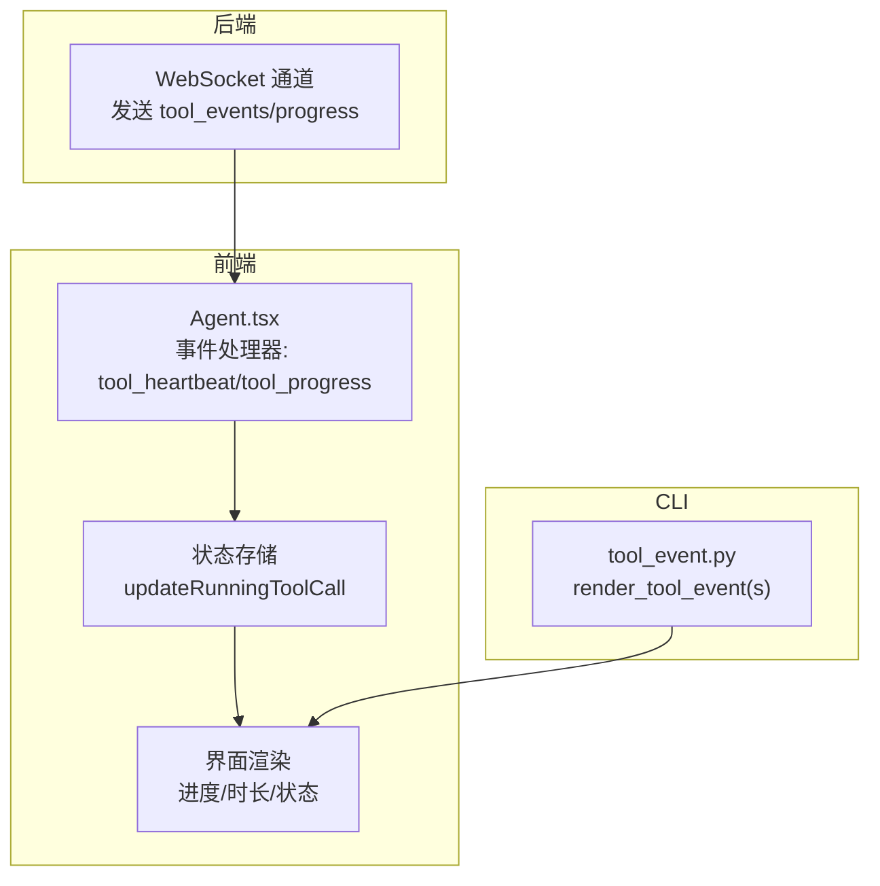
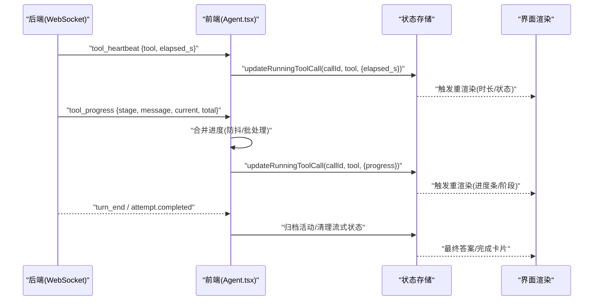
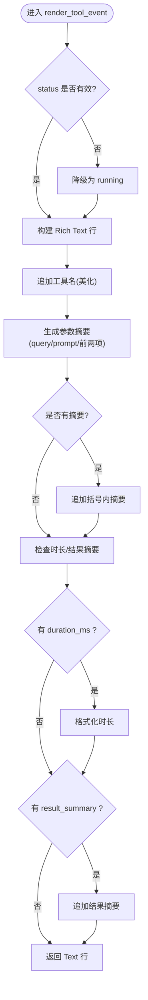
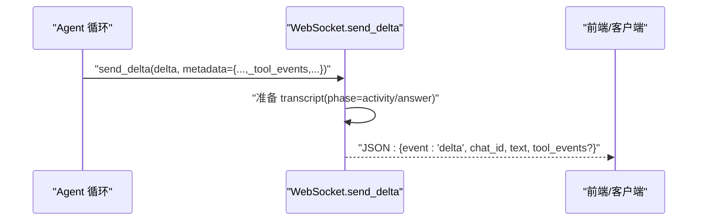
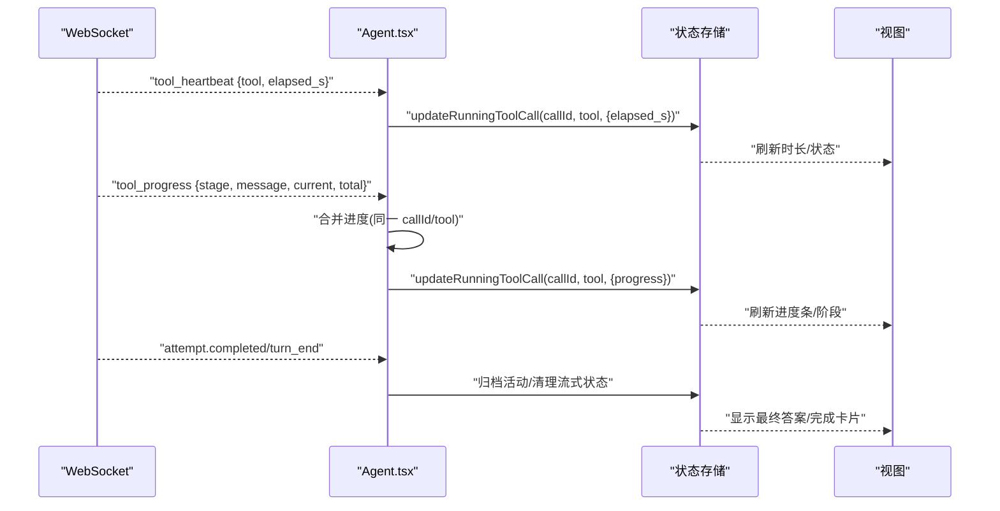
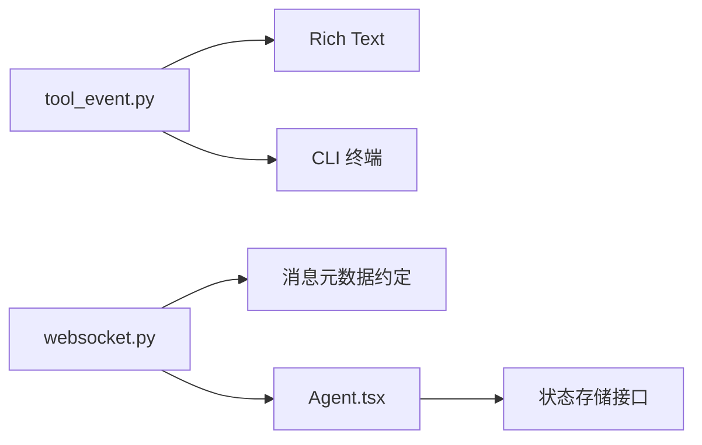

# 工具事件展示

<cite>
**本文引用的文件**
- [agent/cli/components/tool_event.py](file://agent/cli/components/tool_event.py)
- [agent/src/channels/websocket.py](file://agent/src/channels/websocket.py)
- [frontend/src/pages/Agent.tsx](file://frontend/src/pages/Agent.tsx)
- [agent/tests/test_cli_interactive.py](file://agent/tests/test_cli_interactive.py)
</cite>

## 目录
1. [简介](#简介)
2. [项目结构](#项目结构)
3. [核心组件](#核心组件)
4. [架构总览](#架构总览)
5. [详细组件分析](#详细组件分析)
6. [依赖关系分析](#依赖关系分析)
7. [性能考虑](#性能考虑)
8. [故障排查指南](#故障排查指南)
9. [结论](#结论)
10. [附录](#附录)

## 简介
本文件聚焦 Vibe-Trading 中“工具调用事件”的实时展示机制，覆盖从后端事件生成、传输到前端渲染与状态更新的完整链路。重点包括：
- 事件类型识别：如何区分开始、进行中、进度、完成、错误等阶段。
- 参数格式化显示：如何将工具参数压缩为可读的一行摘要。
- 结果可视化呈现：时长、结果摘要、进度条等富文本/富交互展示。
- 执行状态跟踪：开始、进行中、完成、错误的状态流转与更新逻辑。
- 结构化数据处理与富文本渲染：Rich Text（CLI）与 React 状态管理（Web）。
- 事件监听与自定义处理：如何在前后端扩展事件流。
- 调试技巧与性能优化：节流、批处理、降级策略等。

## 项目结构
围绕工具事件展示的关键路径如下：
- CLI 侧渲染：将工具事件转换为 Rich Text 行，用于终端实时输出。
- 后端通道：通过 WebSocket/SSE 推送工具相关事件（心跳、进度、结束等），并附带 tool_events 元数据。
- 前端页面：订阅事件，维护运行中的工具调用状态，合并进度更新，并在消息流中渲染。

图表来源
- [agent/src/channels/websocket.py:970-997](file://agent/src/channels/websocket.py#L970-L997)
- [frontend/src/pages/Agent.tsx:843-883](file://frontend/src/pages/Agent.tsx#L843-L883)
- [agent/cli/components/tool_event.py:150-215](file://agent/cli/components/tool_event.py#L150-L215)

章节来源
- [agent/src/channels/websocket.py:970-997](file://agent/src/channels/websocket.py#L970-L997)
- [frontend/src/pages/Agent.tsx:843-883](file://frontend/src/pages/Agent.tsx#L843-L883)
- [agent/cli/components/tool_event.py:150-215](file://agent/cli/components/tool_event.py#L150-L215)

## 核心组件
- CLI 工具事件渲染器
  - 负责将单个或批量工具事件渲染为 Rich Text 行，支持状态颜色、参数摘要、时长与结果摘要。
- 后端 WebSocket 通道
  - 在消息元数据中携带 _tool_events，并将工具提示/进度标记为 activity 阶段，推送到客户端。
- 前端 Agent 页面
  - 订阅 tool_heartbeat 与 tool_progress，合并高频进度更新，更新运行中的工具调用状态，驱动 UI 刷新。

章节来源
- [agent/cli/components/tool_event.py:150-215](file://agent/cli/components/tool_event.py#L150-L215)
- [agent/src/channels/websocket.py:970-997](file://agent/src/channels/websocket.py#L970-L997)
- [frontend/src/pages/Agent.tsx:843-883](file://frontend/src/pages/Agent.tsx#L843-L883)

## 架构总览
工具事件从后端产生，经 WebSocket 推送至前端；前端根据事件类型进行状态管理与 UI 更新。CLI 侧则直接消费事件数据进行本地渲染。

图表来源
- [frontend/src/pages/Agent.tsx:843-883](file://frontend/src/pages/Agent.tsx#L843-L883)
- [frontend/src/pages/Agent.tsx:830-939](file://frontend/src/pages/Agent.tsx#L830-L939)
- [agent/src/channels/websocket.py:970-997](file://agent/src/channels/websocket.py#L970-L997)

## 详细组件分析

### CLI 工具事件渲染器（tool_event.py）
- 事件类型识别
  - 支持 running、ok、error 三种状态，未知状态降级为 running，确保渲染不中断。
- 参数格式化显示
  - 优先使用 query/prompt 字段作为摘要；否则取前两个 key=value 对，值截断至固定长度。
  - 复杂类型（列表、映射）以长度/键数形式压缩，避免行过长。
- 结果可视化呈现
  - 时长格式化为 ms/s/m 单位；可选追加 result_summary（如“8 quarters”）。
  - 使用 Rich Text 样式实现状态颜色与闪烁（running 时）。
- 批量渲染
  - render_tool_events 将事件字典列表转为 Text 行列表，便于回放或日志输出。

图表来源
- [agent/cli/components/tool_event.py:150-194](file://agent/cli/components/tool_event.py#L150-L194)
- [agent/cli/components/tool_event.py:72-113](file://agent/cli/components/tool_event.py#L72-L113)
- [agent/cli/components/tool_event.py:116-144](file://agent/cli/components/tool_event.py#L116-L144)

章节来源
- [agent/cli/components/tool_event.py:150-215](file://agent/cli/components/tool_event.py#L150-L215)
- [agent/cli/components/tool_event.py:72-113](file://agent/cli/components/tool_event.py#L72-L113)
- [agent/cli/components/tool_event.py:116-144](file://agent/cli/components/tool_event.py#L116-L144)

### 后端 WebSocket 通道（websocket.py）
- 工具事件透传
  - 若消息元数据包含 _tool_events，则将其放入 payload.tool_events 并推送给客户端。
- 活动阶段标记
  - 根据 _tool_hint/_progress 设置 kind，决定归类为 activity 阶段的子项，而非对话回复。
- 转写与持久化
  - 所有事件通过 transcripts.prepare_and_append 记录，便于回放与审计。

图表来源
- [agent/src/channels/websocket.py:970-997](file://agent/src/channels/websocket.py#L970-L997)

章节来源
- [agent/src/channels/websocket.py:970-997](file://agent/src/channels/websocket.py#L970-L997)

### 前端 Agent 页面（Agent.tsx）
- 事件监听与状态更新
  - tool_heartbeat：保持流式状态活跃，更新运行中工具的 elapsed_s。
  - tool_progress：收集 stage/message/current/total，按 callId+tool 合并，使用 requestAnimationFrame 批处理，减少频繁重渲染。
  - attempt.completed/turn_end：归档活动、清理流式文本、添加最终答案或运行完成卡片。
- 富交互呈现
  - 通过 store.updateRunningToolCall 更新运行中工具的状态，驱动进度条、时长与阶段信息展示。

图表来源
- [frontend/src/pages/Agent.tsx:843-883](file://frontend/src/pages/Agent.tsx#L843-L883)
- [frontend/src/pages/Agent.tsx:830-939](file://frontend/src/pages/Agent.tsx#L830-L939)

章节来源
- [frontend/src/pages/Agent.tsx:843-883](file://frontend/src/pages/Agent.tsx#L843-L883)
- [frontend/src/pages/Agent.tsx:830-939](file://frontend/src/pages/Agent.tsx#L830-L939)

### 测试用例（test_cli_interactive.py）
- 验证不同状态下的渲染行为：running、ok、error 以及非法状态的降级处理。
- 确保参数摘要与时长/结果摘要的显示符合预期。

章节来源
- [agent/tests/test_cli_interactive.py:570-600](file://agent/tests/test_cli_interactive.py#L570-L600)

## 依赖关系分析
- CLI 渲染器依赖 Rich Text 库进行富文本渲染，并通过统一工具函数格式化时长。
- 后端通道依赖消息元数据约定（_tool_events、_tool_hint、_progress）来标注活动阶段。
- 前端依赖 WebSocket 事件模型与状态管理接口（updateRunningToolCall）进行实时更新。

图表来源
- [agent/cli/components/tool_event.py:150-215](file://agent/cli/components/tool_event.py#L150-L215)
- [agent/src/channels/websocket.py:970-997](file://agent/src/channels/websocket.py#L970-L997)
- [frontend/src/pages/Agent.tsx:843-883](file://frontend/src/pages/Agent.tsx#L843-L883)

章节来源
- [agent/cli/components/tool_event.py:150-215](file://agent/cli/components/tool_event.py#L150-L215)
- [agent/src/channels/websocket.py:970-997](file://agent/src/channels/websocket.py#L970-L997)
- [frontend/src/pages/Agent.tsx:843-883](file://frontend/src/pages/Agent.tsx#L843-L883)

## 性能考虑
- 前端进度合并与批处理
  - 使用 pendingProgressRef 缓存同一次调用的多次进度，借助 requestAnimationFrame 一次性提交，降低重渲染频率。
- 降级与健壮性
  - CLI 渲染对未知状态进行降级处理，避免因异常导致主流程中断。
  - 时长格式化提供本地 fallback，避免跨模块导入失败影响渲染。
- 网络与存储
  - 后端将所有活动事件写入 transcript，便于回放与审计，但需注意大会话下的存储与检索开销。

[本节为通用性能建议，无需特定文件引用]

## 故障排查指南
- 现象：工具事件未显示或显示不正确
  - 检查后端是否在消息元数据中包含 _tool_events，并确保 kind 正确标记为 activity。
  - 确认前端是否正确订阅 tool_heartbeat 与 tool_progress，并调用 updateRunningToolCall。
- 现象：进度条不更新或卡顿
  - 确认前端是否启用进度合并与动画帧批处理；检查是否存在重复或冲突的 callId。
- 现象：CLI 渲染异常
  - 检查传入 status 是否为已知值；若为未知值应降级为 running。
  - 检查参数摘要是否过大，必要时调整截断策略。

章节来源
- [agent/src/channels/websocket.py:970-997](file://agent/src/channels/websocket.py#L970-L997)
- [frontend/src/pages/Agent.tsx:843-883](file://frontend/src/pages/Agent.tsx#L843-L883)
- [agent/cli/components/tool_event.py:150-194](file://agent/cli/components/tool_event.py#L150-L194)

## 结论
Vibe-Trading 的工具事件展示体系通过后端事件透传、前端状态合并与 CLI 富文本渲染，实现了端到端的实时可视化和可追溯性。开发者可基于现有事件模型扩展新的工具阶段与展示样式，同时利用批处理与降级策略保障性能与稳定性。

[本节为总结性内容，无需特定文件引用]

## 附录
- 事件字段参考（来自后端与前端处理）
  - tool_heartbeat：{tool, elapsed_s}
  - tool_progress：{stage, message, current, total}
  - tool_events：由后端元数据透传的数组/对象集合
  - attempt.completed/turn_end：用于归档活动与清理流式状态

[本节为概念性说明，无需特定文件引用]