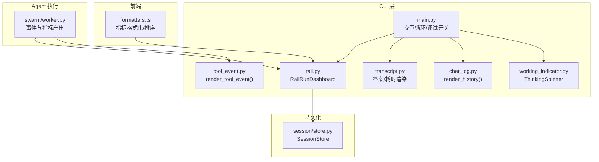
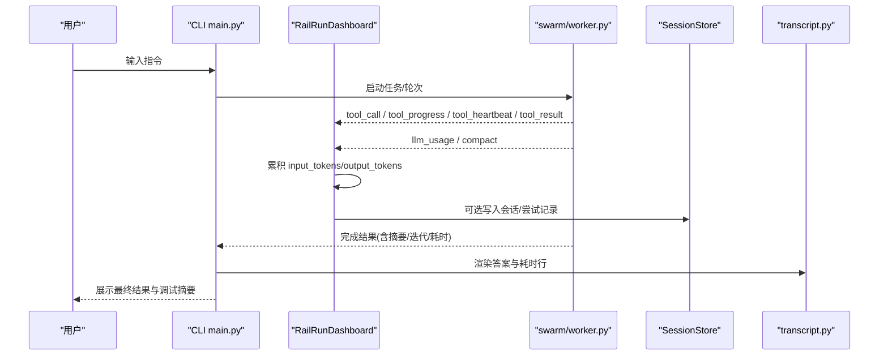
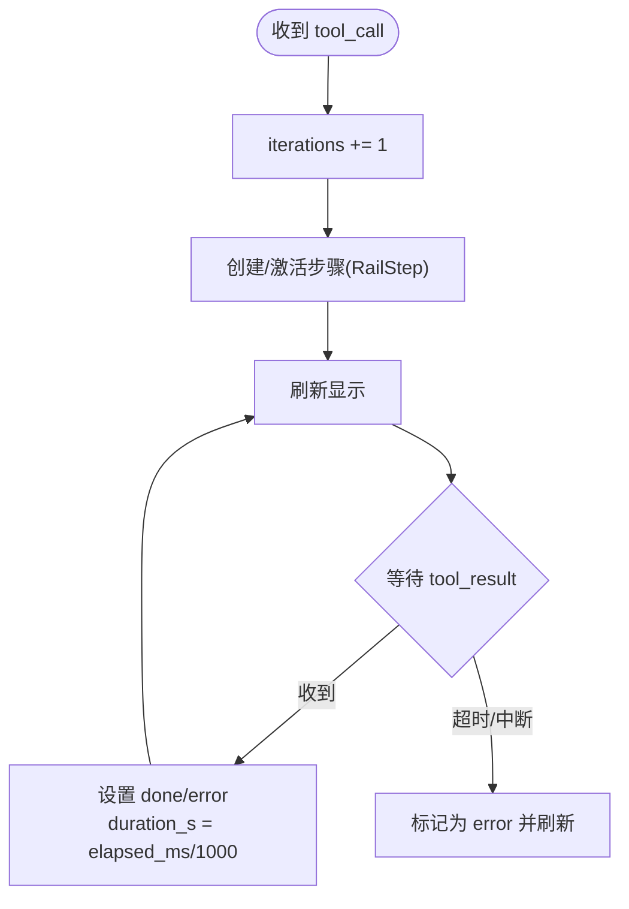
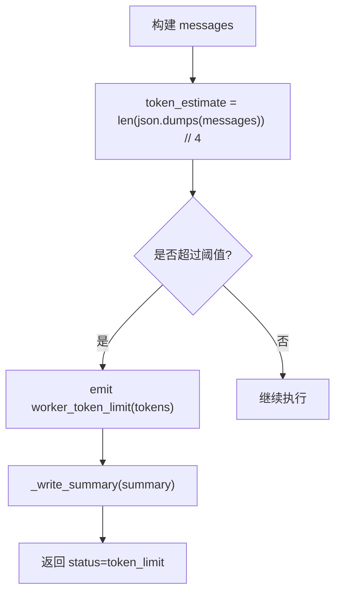
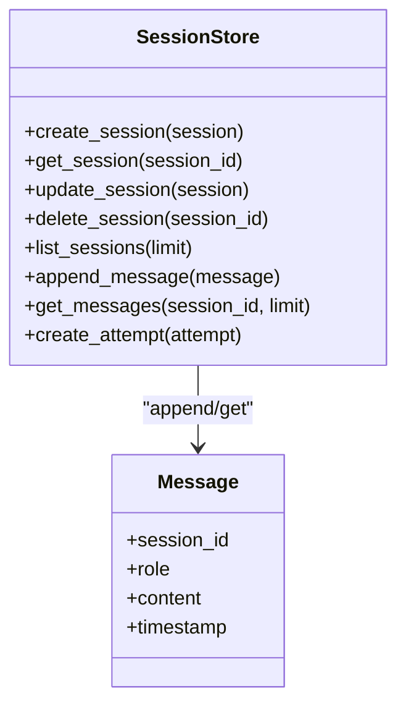
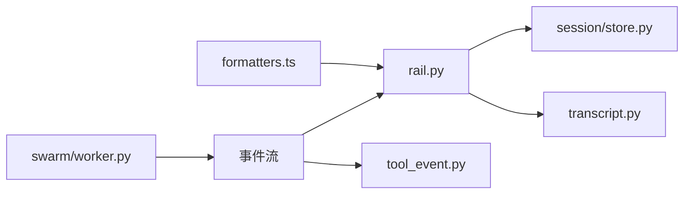

# 调试面板

<cite>
**本文引用的文件**
- [agent/cli/main.py](file://agent/cli/main.py)
- [agent/cli/commands/chat.py](file://agent/cli/commands/chat.py)
- [agent/cli/ui/transcript.py](file://agent/cli/ui/transcript.py)
- [agent/cli/ui/rail.py](file://agent/cli/ui/rail.py)
- [agent/cli/components/tool_event.py](file://agent/cli/components/tool_event.py)
- [agent/cli/components/chat_log.py](file://agent/cli/components/chat_log.py)
- [agent/cli/components/working_indicator.py](file://agent/cli/components/working_indicator.py)
- [agent/src/swarm/worker.py](file://agent/src/swarm/worker.py)
- [agent/src/session/store.py](file://agent/src/session/store.py)
- [agent/cli/_legacy.py](file://agent/cli/_legacy.py)
- [frontend/src/lib/formatters.ts](file://frontend/src/lib/formatters.ts)
</cite>

## 目录
1. [简介](#简介)
2. [项目结构](#项目结构)
3. [核心组件](#核心组件)
4. [架构总览](#架构总览)
5. [详细组件分析](#详细组件分析)
6. [依赖关系分析](#依赖关系分析)
7. [性能考量](#性能考量)
8. [故障诊断指南](#故障诊断指南)
9. [结论](#结论)
10. [附录](#附录)

## 简介
本文件面向 Vibe-Trading 的“调试面板”能力，系统性说明调试信息的采集、计算与展示机制，覆盖：
- 迭代次数统计、工具调用计数、上下文大小估算
- 会话转录的存储与检索（历史查看与分析）
- 调试指标的计算方法与可视化呈现
- 调试面板的配置选项与可扩展点
- 性能监控与故障诊断技巧，帮助定位 Agent 执行流程中的瓶颈与问题

## 项目结构
调试面板由 CLI 层与前端两部分组成：
- CLI 层负责事件驱动渲染、实时状态更新、指标汇总与回放
- 前端提供 Web 侧的指标卡片、时间格式化与数值展示等能力
- 后端 Worker 在 Agent 执行过程中产出事件与指标，供 UI 消费

图表来源
- [agent/cli/ui/rail.py:281-435](file://agent/cli/ui/rail.py#L281-L435)
- [agent/cli/components/tool_event.py:150-215](file://agent/cli/components/tool_event.py#L150-L215)
- [agent/cli/components/chat_log.py:52-74](file://agent/cli/components/chat_log.py#L52-L74)
- [agent/cli/components/working_indicator.py:54-119](file://agent/cli/components/working_indicator.py#L54-L119)
- [agent/cli/main.py:357-393](file://agent/cli/main.py#L357-L393)
- [agent/cli/ui/transcript.py:61-106](file://agent/cli/ui/transcript.py#L61-L106)
- [agent/src/swarm/worker.py:515-531](file://agent/src/swarm/worker.py#L515-L531)
- [agent/src/session/store.py:17-56](file://agent/src/session/store.py#L17-L56)
- [frontend/src/lib/formatters.ts:69-96](file://frontend/src/lib/formatters.ts#L69-L96)

章节来源
- [agent/cli/ui/rail.py:281-435](file://agent/cli/ui/rail.py#L281-L435)
- [agent/cli/components/tool_event.py:150-215](file://agent/cli/components/tool_event.py#L150-L215)
- [agent/cli/components/chat_log.py:52-74](file://agent/cli/components/chat_log.py#L52-L74)
- [agent/cli/components/working_indicator.py:54-119](file://agent/cli/components/working_indicator.py#L54-L119)
- [agent/cli/main.py:357-393](file://agent/cli/main.py#L357-L393)
- [agent/cli/ui/transcript.py:61-106](file://agent/cli/ui/transcript.py#L61-L106)
- [agent/src/swarm/worker.py:515-531](file://agent/src/swarm/worker.py#L515-L531)
- [agent/src/session/store.py:17-56](file://agent/src/session/store.py#L17-L56)
- [frontend/src/lib/formatters.ts:69-96](file://frontend/src/lib/formatters.ts#L69-L96)

## 核心组件
- RailRunDashboard：接收 Agent 事件（文本增量、工具调用/进度/心跳/结果、LLM 用量、上下文压缩），维护步骤列表与活跃状态，按固定频率刷新显示。
- Tool Event 渲染：将单次工具调用以“● 工具名 (参数摘要) 耗时 · 结果摘要”的形式输出，支持运行中/成功/错误三种状态。
- Chat Log 渲染：以“角色 + 时间戳 + 元信息”的行格式回放历史对话。
- Thinking Spinner：在执行期间显示思考提示，自动隐藏避免残留。
- Transcript：对助手回答进行 Markdown 表格增强与耗时行渲染。
- Session Store：基于 JSONL 的消息追加式日志，支持读取最近消息用于历史回放。
- Worker：在 Agent 执行中估算上下文 token 数、记录工具调用与耗时、触发上下文压缩事件、产出完成摘要。
- 前端格式化：指标语义化、排序与数值缩写，提升可读性。

章节来源
- [agent/cli/ui/rail.py:281-435](file://agent/cli/ui/rail.py#L281-L435)
- [agent/cli/components/tool_event.py:150-215](file://agent/cli/components/tool_event.py#L150-L215)
- [agent/cli/components/chat_log.py:52-74](file://agent/cli/components/chat_log.py#L52-L74)
- [agent/cli/components/working_indicator.py:54-119](file://agent/cli/components/working_indicator.py#L54-L119)
- [agent/cli/ui/transcript.py:61-106](file://agent/cli/ui/transcript.py#L61-L106)
- [agent/src/session/store.py:155-197](file://agent/src/session/store.py#L155-L197)
- [agent/src/swarm/worker.py:515-531](file://agent/src/swarm/worker.py#L515-L531)
- [frontend/src/lib/formatters.ts:69-96](file://frontend/src/lib/formatters.ts#L69-L96)

## 架构总览
调试面板的事件流从 Agent 执行开始，经由 Worker 产生事件与指标，CLI 层订阅并渲染到控制台或 Web 界面；同时，会话消息被持久化以便后续回放与分析。

图表来源
- [agent/cli/ui/rail.py:319-435](file://agent/cli/ui/rail.py#L319-L435)
- [agent/src/swarm/worker.py:515-531](file://agent/src/swarm/worker.py#L515-L531)
- [agent/cli/ui/transcript.py:61-106](file://agent/cli/ui/transcript.py#L61-L106)
- [agent/src/session/store.py:155-197](file://agent/src/session/store.py#L155-L197)

## 详细组件分析

### 迭代次数统计与工具调用计数
- 迭代次数：每次收到 tool_call 事件时，RailRunDashboard 自增 iterations，并在活动步骤中体现当前轮次。
- 工具调用计数：CLI 底部状态栏维护 _SessionStats，累计 tool_count 与 total_tool_ms，便于快速概览本轮工具使用强度与耗时。
- 工具耗时：tool_result 事件携带 elapsed_ms，Dashboard 将其转换为秒级并附加到对应步骤。

图表来源
- [agent/cli/ui/rail.py:345-402](file://agent/cli/ui/rail.py#L345-L402)
- [agent/cli/_legacy.py:142-186](file://agent/cli/_legacy.py#L142-L186)

章节来源
- [agent/cli/ui/rail.py:345-402](file://agent/cli/ui/rail.py#L345-L402)
- [agent/cli/_legacy.py:142-186](file://agent/cli/_legacy.py#L142-L186)

### 上下文大小估算与压缩
- 估算方法：Worker 根据 messages 的 JSON 序列化长度粗略估算 token 数，超过阈值时触发 worker_token_limit 事件并生成摘要。
- 压缩事件：当上下文过大时，CLI 会收到 compact 事件，Dashboard 将其作为一条“context”步骤显示，标注被总结的 token 数量。
- 影响：防止上下文溢出导致失败，同时通过 UI 提示用户发生了压缩。

图表来源
- [agent/src/swarm/worker.py:515-531](file://agent/src/swarm/worker.py#L515-L531)
- [agent/cli/ui/rail.py:404-416](file://agent/cli/ui/rail.py#L404-L416)

章节来源
- [agent/src/swarm/worker.py:515-531](file://agent/src/swarm/worker.py#L515-L531)
- [agent/cli/ui/rail.py:404-416](file://agent/cli/ui/rail.py#L404-L416)

### LLM 用量与上下文大小估算
- LLM 用量：收到 llm_usage 事件时，Dashboard 累加 input_tokens 与 output_tokens（或 total_tokens），用于统计与展示。
- 上下文大小：结合 messages 估算与 llm_usage 累计，可评估单轮/多轮上下文增长趋势。

章节来源
- [agent/cli/ui/rail.py:333-343](file://agent/cli/ui/rail.py#L333-L343)
- [agent/src/swarm/worker.py:515-531](file://agent/src/swarm/worker.py#L515-L531)

### 会话转录的存储与检索
- 存储：SessionStore 以 JSONL 形式追加消息，保证顺序与幂等；每条消息落盘后 fsync，确保数据一致性。
- 检索：get_messages 支持 limit 参数，返回最近 N 条消息，用于 CLI 历史回放与 Web 侧展示。
- 历史回放：CLI 的 chat_log 渲染器按“角色+时间戳+元信息”逐条打印，保持 diff 友好的纯文本主体。

图表来源
- [agent/src/session/store.py:17-56](file://agent/src/session/store.py#L17-L56)
- [agent/src/session/store.py:155-197](file://agent/src/session/store.py#L155-L197)

章节来源
- [agent/src/session/store.py:17-56](file://agent/src/session/store.py#L17-L56)
- [agent/src/session/store.py:155-197](file://agent/src/session/store.py#L155-L197)
- [agent/cli/components/chat_log.py:52-74](file://agent/cli/components/chat_log.py#L52-L74)

### 调试指标的计算与可视化
- 指标来源：
  - 工具调用计数与耗时：_SessionStats 与 tool_result.elapsed_ms
  - LLM 用量：llm_usage 事件中的 input/output/total tokens
  - 上下文估算：messages JSON 长度估算与 compact 事件
- 可视化：
  - CLI：RailRunDashboard 的步骤列表、活动行、完成行；Tool Event 的单行摘要；Transcript 的答案与耗时行
  - 前端：formatters.ts 提供指标语义化、排序与数值缩写，便于卡片展示

章节来源
- [agent/cli/_legacy.py:142-186](file://agent/cli/_legacy.py#L142-L186)
- [agent/cli/ui/rail.py:319-435](file://agent/cli/ui/rail.py#L319-L435)
- [agent/cli/components/tool_event.py:150-215](file://agent/cli/components/tool_event.py#L150-L215)
- [agent/cli/ui/transcript.py:61-106](file://agent/cli/ui/transcript.py#L61-L106)
- [frontend/src/lib/formatters.ts:69-96](file://frontend/src/lib/formatters.ts#L69-L96)

### 调试面板的配置与扩展
- 调试开关：通过命令切换调试摘要开关，开启后每轮结束后输出一行包含迭代次数、工具数、耗时与近似上下文 token 的摘要。
- 环境变量：可通过配置项控制行为（如搜索后端、重试延迟等），调试相关通常配合日志级别与环境变量调整。
- 扩展点：
  - 自定义工具事件渲染：实现 render_tool_event 的参数摘要与时长格式化
  - 自定义步骤标题与详情：扩展 _tool_title 与 _initial_detail 逻辑
  - 自定义指标展示：在前端 formatters.ts 中添加新的指标映射与排序规则

章节来源
- [agent/cli/commands/chat.py:183-212](file://agent/cli/commands/chat.py#L183-L212)
- [agent/cli/ui/rail.py:75-121](file://agent/cli/ui/rail.py#L75-L121)
- [agent/cli/components/tool_event.py:116-144](file://agent/cli/components/tool_event.py#L116-L144)
- [frontend/src/lib/formatters.ts:69-96](file://frontend/src/lib/formatters.ts#L69-L96)

### 性能监控与故障诊断
- 性能监控：
  - 关注 tool_result.elapsed_ms 分布，识别慢工具
  - 跟踪 llm_usage 的 token 增长，评估上下文膨胀
  - 观察 compact 事件频率，判断是否需要优化 prompt 或工具输出
- 故障诊断：
  - 若出现 token_limit，检查 messages 规模与工具输出大小
  - 若工具长时间无进展，检查 tool_progress 与 tool_heartbeat 是否持续
  - 若会话丢失或损坏，检查 SessionStore 的 JSONL 完整性与异常跳过逻辑

章节来源
- [agent/src/swarm/worker.py:515-531](file://agent/src/swarm/worker.py#L515-L531)
- [agent/cli/ui/rail.py:359-386](file://agent/cli/ui/rail.py#L359-L386)
- [agent/src/session/store.py:178-197](file://agent/src/session/store.py#L178-L197)

## 依赖关系分析
- CLI 层依赖 Rich 进行终端渲染，依赖 prompt_toolkit 提供交互式输入（可选）。
- Worker 与 CLI 通过事件协议解耦，便于替换 UI 或接入 Web 通道。
- SessionStore 与 CLI 解耦，仅通过路径与接口交互，支持独立测试与替换。
- 前端通过 API 获取运行结果与指标，使用 formatters.ts 统一展示。

图表来源
- [agent/src/swarm/worker.py:515-531](file://agent/src/swarm/worker.py#L515-L531)
- [agent/cli/ui/rail.py:319-435](file://agent/cli/ui/rail.py#L319-L435)
- [agent/cli/components/tool_event.py:150-215](file://agent/cli/components/tool_event.py#L150-L215)
- [agent/src/session/store.py:155-197](file://agent/src/session/store.py#L155-L197)
- [agent/cli/ui/transcript.py:61-106](file://agent/cli/ui/transcript.py#L61-L106)
- [frontend/src/lib/formatters.ts:69-96](file://frontend/src/lib/formatters.ts#L69-L96)

章节来源
- [agent/src/swarm/worker.py:515-531](file://agent/src/swarm/worker.py#L515-L531)
- [agent/cli/ui/rail.py:319-435](file://agent/cli/ui/rail.py#L319-L435)
- [agent/cli/components/tool_event.py:150-215](file://agent/cli/components/tool_event.py#L150-L215)
- [agent/src/session/store.py:155-197](file://agent/src/session/store.py#L155-L197)
- [agent/cli/ui/transcript.py:61-106](file://agent/cli/ui/transcript.py#L61-L106)
- [frontend/src/lib/formatters.ts:69-96](file://frontend/src/lib/formatters.ts#L69-L96)

## 性能考量
- 事件节流：Dashboard 对 tool_progress 与 text_delta 进行节流刷新，避免频繁重绘造成卡顿。
- 上下文压缩：当估算 token 超过阈值时主动压缩，减少后续处理开销。
- 工具超时与心跳：通过 tool_progress 的 stage 与 heartbeat 检测长耗时工具，及时告警或中止。
- 前端展示：指标采用本地格式化与排序，减少服务端压力。

[本节为通用指导，不直接分析具体文件]

## 故障诊断指南
- 常见问题
  - 上下文过大：检查 compact 事件与 worker_token_limit，必要时精简 prompt 或工具输出
  - 工具卡死：观察 tool_progress 与 tool_heartbeat，确认是否有阶段推进
  - 会话损坏：检查 SessionStore 的 JSONL 文件，确认解析异常是否被安全跳过
- 定位技巧
  - 启用调试摘要，关注每轮的迭代次数、工具数、耗时与上下文估算
  - 使用 RailRunDashboard 的步骤视图，定位具体工具与阶段
  - 通过 transcript 的输出与耗时行，对比端到端耗时

章节来源
- [agent/cli/ui/rail.py:359-386](file://agent/cli/ui/rail.py#L359-L386)
- [agent/src/swarm/worker.py:515-531](file://agent/src/swarm/worker.py#L515-L531)
- [agent/src/session/store.py:178-197](file://agent/src/session/store.py#L178-L197)
- [agent/cli/ui/transcript.py:61-106](file://agent/cli/ui/transcript.py#L61-L106)

## 结论
Vibe-Trading 的调试面板通过事件驱动的 CLI 渲染与前后端协作，提供了完整的执行过程可视化工具。借助迭代统计、工具调用计数、上下文估算与会话转录，开发者可以高效定位性能瓶颈与问题根因，并通过配置与扩展点定制调试体验。

[本节为总结，不直接分析具体文件]

## 附录
- 常用命令
  - 切换调试摘要开关：在交互模式下使用调试命令开启/关闭
  - 查看运行结果：通过 CLI 或 Web 打开对应 run_id 的 dashboard
- 关键路径
  - CLI 主循环与调试开关：agent/cli/main.py
  - 事件渲染与状态管理：agent/cli/ui/rail.py
  - 工具事件渲染：agent/cli/components/tool_event.py
  - 会话存储：agent/src/session/store.py
  - 指标格式化：frontend/src/lib/formatters.ts

章节来源
- [agent/cli/commands/chat.py:183-212](file://agent/cli/commands/chat.py#L183-L212)
- [agent/cli/main.py:357-393](file://agent/cli/main.py#L357-L393)
- [agent/cli/ui/rail.py:319-435](file://agent/cli/ui/rail.py#L319-L435)
- [agent/cli/components/tool_event.py:150-215](file://agent/cli/components/tool_event.py#L150-L215)
- [agent/src/session/store.py:155-197](file://agent/src/session/store.py#L155-L197)
- [frontend/src/lib/formatters.ts:69-96](file://frontend/src/lib/formatters.ts#L69-L96)