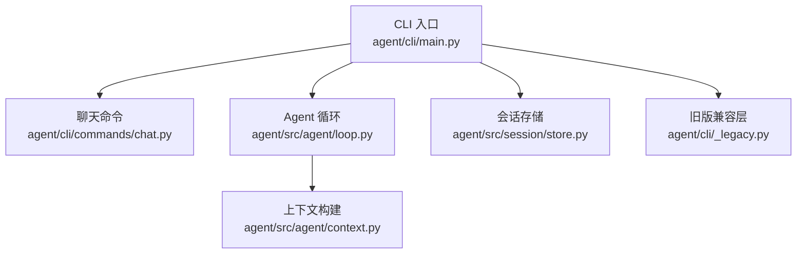
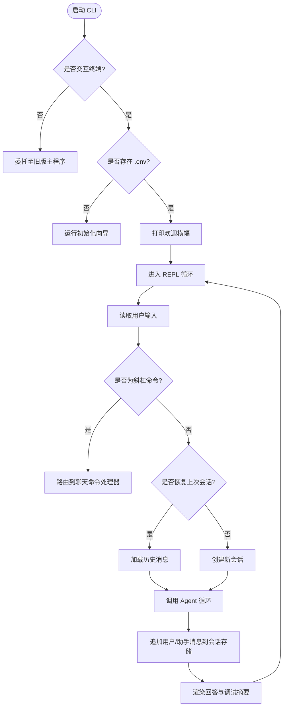
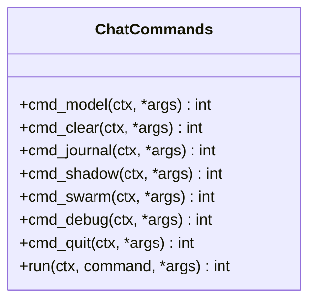
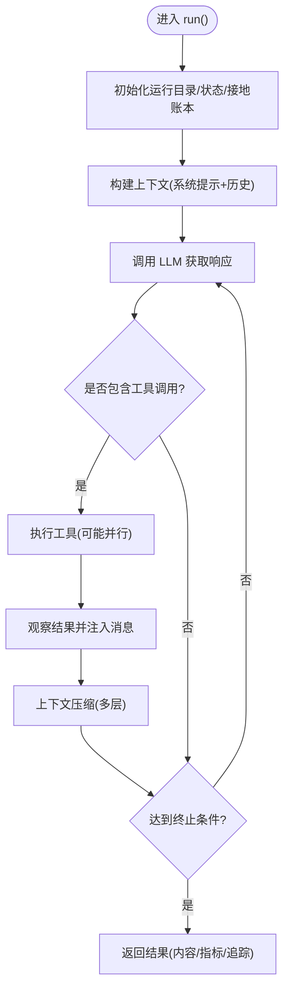
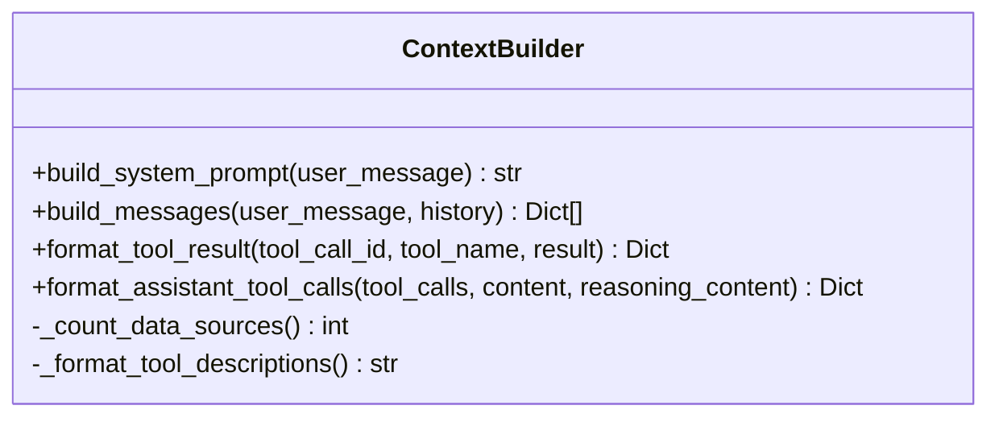
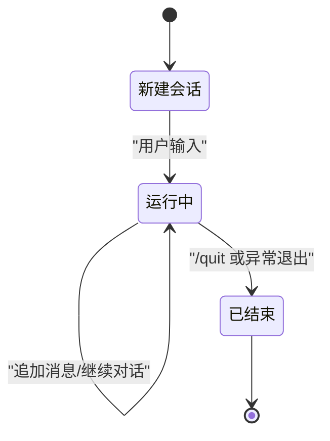
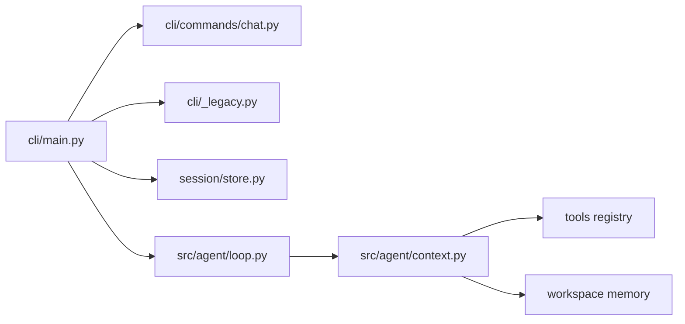

# 对话模式基础

<cite>
**本文引用的文件**
- [agent/cli/main.py](file://agent/cli/main.py)
- [agent/cli/commands/chat.py](file://agent/cli/commands/chat.py)
- [agent/src/agent/loop.py](file://agent/src/agent/loop.py)
- [agent/src/agent/context.py](file://agent/src/agent/context.py)
- [agent/src/session/store.py](file://agent/src/session/store.py)
- [agent/src/session/__init__.py](file://agent/src/session/__init__.py)
- [agent/cli/_legacy.py](file://agent/cli/_legacy.py)
</cite>

## 目录
1. [简介](#简介)
2. [项目结构](#项目结构)
3. [核心组件](#核心组件)
4. [架构总览](#架构总览)
5. [详细组件分析](#详细组件分析)
6. [依赖关系分析](#依赖关系分析)
7. [性能与可伸缩性](#性能与可伸缩性)
8. [故障排查指南](#故障排查指南)
9. [结论](#结论)
10. [附录：对话示例与最佳实践](#附录：对话示例与最佳实践)

## 简介
本文件面向首次使用 Vibe-Trading 对话模式的读者，系统讲解“自然语言对话”的工作原理、ReAct 推理-行动-观察循环机制、会话生命周期管理、基本语法与格式要求，以及从启动 CLI 到完成一次对话的完整流程。文档同时提供常见问题的解决方案与最佳实践建议，帮助你高效开展量化研究、数据查询与策略分析。

## 项目结构
Vibe-Trading 的对话模式由 CLI 入口、聊天命令、Agent 循环、上下文构建与会话持久化等模块协作完成：
- CLI 入口负责交互式启动、环境检测、欢迎横幅、斜杠命令路由与轮询循环。
- 聊天命令提供 /model、/clear、/debug、/quit 等控制命令。
- Agent 循环实现 ReAct 的核心迭代（思考-调用工具-观察结果），并维护上下文压缩、记忆与追踪。
- 上下文构建器组装系统提示词、工具描述、技能摘要与历史消息。
- 会话存储将消息以 JSONL 追加写入，并提供列表、读取、尝试记录等能力。



**图表来源**
- [agent/cli/main.py:219-268](file://agent/cli/main.py#L219-L268)
- [agent/cli/commands/chat.py:224-244](file://agent/cli/commands/chat.py#L224-L244)
- [agent/src/agent/loop.py:638-800](file://agent/src/agent/loop.py#L638-L800)
- [agent/src/agent/context.py:221-333](file://agent/src/agent/context.py#L221-L333)
- [agent/src/session/store.py:16-193](file://agent/src/session/store.py#L16-L193)
- [agent/cli/_legacy.py:1-12](file://agent/cli/_legacy.py#L1-L12)

**章节来源**
- [agent/cli/main.py:219-268](file://agent/cli/main.py#L219-L268)
- [agent/cli/commands/chat.py:224-244](file://agent/cli/commands/chat.py#L224-L244)
- [agent/src/agent/loop.py:638-800](file://agent/src/agent/loop.py#L638-L800)
- [agent/src/agent/context.py:221-333](file://agent/src/agent/context.py#L221-L333)
- [agent/src/session/store.py:16-193](file://agent/src/session/store.py#L16-L193)
- [agent/cli/_legacy.py:1-12](file://agent/cli/_legacy.py#L1-L12)

## 核心组件
- CLI 入口：检测交互模式、运行引导、打印横幅、解析参数、进入 REPL 循环；在每轮对话中创建或恢复会话、追加用户消息、调用 Agent 循环、渲染结果与调试信息。
- 聊天命令：提供模型查看、清屏、日志分析、影子账户、调试开关、退出等快捷指令。
- Agent 循环：实现 ReAct 五层上下文压缩、工具并行执行、流式重试、用量统计、归档产物等。
- 上下文构建：生成系统提示词（包含输出原则、工具与技能摘要、任务路由）、组装消息列表、自动召回持久记忆。
- 会话存储：以 JSONL 追加记录消息，支持会话 CRUD、消息读取、尝试记录与损坏行跳过。

**章节来源**
- [agent/cli/main.py:329-470](file://agent/cli/main.py#L329-L470)
- [agent/cli/commands/chat.py:41-244](file://agent/cli/commands/chat.py#L41-L244)
- [agent/src/agent/loop.py:1-12](file://agent/src/agent/loop.py#L1-L12)
- [agent/src/agent/context.py:221-333](file://agent/src/agent/context.py#L221-L333)
- [agent/src/session/store.py:16-193](file://agent/src/session/store.py#L16-L193)

## 架构总览
下图展示一次对话从输入到输出的关键路径：CLI 接收用户输入，必要时创建会话并追加消息；调用 Agent 循环执行 ReAct；循环内通过上下文构建器组装消息并调用 LLM；根据工具结果继续迭代；最终返回答案并持久化。

```mermaid
sequenceDiagram
participant U as "用户"
participant CLI as "CLI 入口"
participant CMD as "聊天命令"
participant LOOP as "Agent 循环"
participant CTX as "上下文构建"
participant STORE as "会话存储"
U->>CLI : 输入自然语言查询
CLI->>STORE : 创建/恢复会话并追加用户消息
CLI->>LOOP : 传入历史与最大迭代次数
LOOP->>CTX : 构建系统提示与消息列表
CTX-->>LOOP : OpenAI 格式消息
LOOP->>LOOP : 推理-行动-观察循环(工具调用/并行/压缩)
LOOP-->>CLI : 返回结果(内容/指标/追踪)
CLI->>STORE : 追加助手回复
CLI-->>U : 渲染回答与调试摘要
```

**图表来源**
- [agent/cli/main.py:696-773](file://agent/cli/main.py#L696-L773)
- [agent/src/agent/loop.py:638-800](file://agent/src/agent/loop.py#L638-L800)
- [agent/src/agent/context.py:354-390](file://agent/src/agent/context.py#L354-L390)
- [agent/src/session/store.py:155-197](file://agent/src/session/store.py#L155-L197)

## 详细组件分析

### CLI 入口与交互循环
- 交互判定：当标准输入/输出为 TTY 且无参数或仅 chat 子命令时进入交互模式。
- 引导与环境：若缺少 provider 凭据则运行初始化向导；加载 .env 后刷新配置。
- 欢迎横幅：探测模型名、技能数、工具数、会话数并打印。
- 会话管理：首次对话创建新会话；支持恢复最近会话；每次轮次追加用户与助手消息。
- 调试面板：可选显示每轮迭代的工具调用次数、耗时与上下文大小估算。



**图表来源**
- [agent/cli/main.py:219-268](file://agent/cli/main.py#L219-L268)
- [agent/cli/main.py:271-320](file://agent/cli/main.py#L271-L320)
- [agent/cli/main.py:400-470](file://agent/cli/main.py#L400-L470)
- [agent/cli/main.py:696-773](file://agent/cli/main.py#L696-L773)

**章节来源**
- [agent/cli/main.py:219-320](file://agent/cli/main.py#L219-L320)
- [agent/cli/main.py:400-470](file://agent/cli/main.py#L400-L470)
- [agent/cli/main.py:696-773](file://agent/cli/main.py#L696-L773)

### 聊天命令
- /model：查看当前 Provider/模型，并提示如何切换。
- /clear：清屏并重新打印横幅；清空内存中的对话历史。
- /journal：快速触发交易流水分析（可带路径）。
- /shadow：打开或训练影子账户（可带路径）。
- /swarm：委派到旧版 swarm 处理。
- /debug：切换调试摘要开关。
- /quit：返回特定退出码以结束循环。



**图表来源**
- [agent/cli/commands/chat.py:41-244](file://agent/cli/commands/chat.py#L41-L244)

**章节来源**
- [agent/cli/commands/chat.py:41-244](file://agent/cli/commands/chat.py#L41-L244)

### Agent 循环（ReAct）
- 五层上下文管理：微压缩、折叠长文本、LLM 结构化摘要、显式压缩工具、迭代更新。
- 工具执行：连续只读工具并行执行，提升吞吐。
- 流式与重试：支持流式响应与失败重试，避免卡死。
- 用量统计：累计 provider 上报的 token 用量并落盘。
- 产物归档：成功回测结果复制到活跃运行目录，便于统一查看。



**图表来源**
- [agent/src/agent/loop.py:638-800](file://agent/src/agent/loop.py#L638-L800)
- [agent/src/agent/loop.py:307-400](file://agent/src/agent/loop.py#L307-L400)
- [agent/src/agent/loop.py:542-636](file://agent/src/agent/loop.py#L542-L636)

**章节来源**
- [agent/src/agent/loop.py:1-12](file://agent/src/agent/loop.py#L1-L12)
- [agent/src/agent/loop.py:307-400](file://agent/src/agent/loop.py#L307-L400)
- [agent/src/agent/loop.py:542-636](file://agent/src/agent/loop.py#L542-L636)
- [agent/src/agent/loop.py:638-800](file://agent/src/agent/loop.py#L638-L800)

### 上下文构建
- 系统提示词：固定输出原则、工具与技能摘要、任务路由规则、当前时间等。
- 消息组装：system + history + user（含自动召回的持久记忆片段）。
- 工具结果格式化：将工具调用结果转为 tool 角色消息。
- 助手工具调用格式化：保留思考签名与额外字段，适配不同提供商。



**图表来源**
- [agent/src/agent/context.py:221-420](file://agent/src/agent/context.py#L221-L420)

**章节来源**
- [agent/src/agent/context.py:221-420](file://agent/src/agent/context.py#L221-L420)

### 会话生命周期管理
- 创建：首次对话创建会话并索引搜索；失败时回退到本地 ID。
- 保持：每轮追加用户与助手消息；支持恢复最近会话并载入历史。
- 结束：/quit 返回退出码；CLI 在退出前进行持久化与告别。
- 存储：JSONL 追加写入，fsync 保证落盘；读取时跳过损坏行。



**图表来源**
- [agent/cli/main.py:400-470](file://agent/cli/main.py#L400-L470)
- [agent/src/session/store.py:63-197](file://agent/src/session/store.py#L63-L197)
- [agent/cli/commands/chat.py:215-222](file://agent/cli/commands/chat.py#L215-L222)

**章节来源**
- [agent/cli/main.py:400-470](file://agent/cli/main.py#L400-L470)
- [agent/src/session/store.py:63-197](file://agent/src/session/store.py#L63-L197)
- [agent/cli/commands/chat.py:215-222](file://agent/cli/commands/chat.py#L215-L222)

## 依赖关系分析
- CLI 入口依赖聊天命令、旧版兼容层、会话存储与 Agent 循环。
- Agent 循环依赖上下文构建、工具注册表、提供者接口与状态存储。
- 上下文构建依赖工具注册表、技能加载器与工作区记忆。
- 会话存储独立于其他模块，提供纯持久化能力。



**图表来源**
- [agent/cli/main.py:219-268](file://agent/cli/main.py#L219-L268)
- [agent/src/agent/loop.py:638-800](file://agent/src/agent/loop.py#L638-L800)
- [agent/src/agent/context.py:221-333](file://agent/src/agent/context.py#L221-L333)
- [agent/src/session/store.py:16-193](file://agent/src/session/store.py#L16-L193)

**章节来源**
- [agent/cli/main.py:219-268](file://agent/cli/main.py#L219-L268)
- [agent/src/agent/loop.py:638-800](file://agent/src/agent/loop.py#L638-L800)
- [agent/src/agent/context.py:221-333](file://agent/src/agent/context.py#L221-L333)
- [agent/src/session/store.py:16-193](file://agent/src/session/store.py#L16-L193)

## 性能与可伸缩性
- 工具并行：连续只读工具批量并行执行，减少等待时间。
- 上下文压缩：多层压缩策略降低输入长度，节省 token 并提高稳定性。
- 流式重试：对瞬态中断进行重试，避免整轮失败。
- 用量统计：按运行累积 provider 上报的 token 用量，便于审计与优化。
- 产物归档：将成功的回测产物复制到活跃运行目录，便于统一查看与对比。

[本节为通用性能讨论，不直接分析具体文件]

## 故障排查指南
- 无法进入交互模式：检查标准输入/输出是否为 TTY；确认未传入不支持的参数。
- 会话恢复失败：检查 sessions 目录是否存在；读取端会跳过损坏行并记录警告。
- 工具调用超时或卡住：关注 Agent 循环的工具超时配置与重试逻辑；必要时降低并发或缩短历史窗口。
- 模型空响应或流式失败：查看 provider 能力层与重试机制；确认网络与鉴权。
- 调试信息：启用 /debug 查看每轮迭代、工具调用次数、耗时与上下文大小估算。

**章节来源**
- [agent/cli/main.py:664-694](file://agent/cli/main.py#L664-L694)
- [agent/src/agent/loop.py:101-115](file://agent/src/agent/loop.py#L101-L115)
- [agent/src/session/store.py:178-197](file://agent/src/session/store.py#L178-L197)

## 结论
Vibe-Trading 的对话模式以 CLI 为入口，结合 ReAct 循环与上下文构建，实现了自然语言驱动的量化研究与策略分析。通过会话持久化、工具并行与多层压缩，系统在易用性与性能之间取得平衡。遵循输出原则与证据导向，确保每一次数字都有据可查，帮助用户高效完成从市场数据查询到策略评估的完整工作流。

[本节为总结性内容，不直接分析具体文件]

## 附录：对话示例与最佳实践

### 基本操作流程
- 启动 CLI：在终端运行交互模式；若无凭据将引导初始化。
- 输入查询：直接以自然语言描述需求，例如“查询某标的近期行情”或“对某策略进行回测”。
- 理解响应：系统会逐步调用工具、展示中间结果，并在结束时给出结构化回答与指标。
- 使用斜杠命令：如 /model 查看模型、/clear 清屏、/debug 开启调试、/quit 退出。

**章节来源**
- [agent/cli/main.py:219-320](file://agent/cli/main.py#L219-L320)
- [agent/cli/commands/chat.py:41-244](file://agent/cli/commands/chat.py#L41-L244)

### 对话语法与格式建议
- 明确标的与时段：尽量提供代码后缀与时间范围，帮助系统准确识别与取数。
- 分步请求：复杂任务拆分为多轮对话，先定位标的再深入分析。
- 指定输出形式：如需表格或指标，可在请求中说明，系统会优先采用结构化呈现。
- 遵循证据原则：所有数值需有工具来源；缺失数据应如实说明而非猜测。

**章节来源**
- [agent/src/agent/context.py:23-211](file://agent/src/agent/context.py#L23-L211)

### 会话生命周期要点
- 创建：首次对话自动生成会话 ID；失败时回退到本地 ID 不影响本轮。
- 保持：每轮追加用户与助手消息；支持恢复最近会话并载入历史。
- 结束：通过 /quit 正常退出；系统会在退出前完成持久化。

**章节来源**
- [agent/cli/main.py:400-470](file://agent/cli/main.py#L400-L470)
- [agent/src/session/store.py:63-197](file://agent/src/session/store.py#L63-L197)

### 简单实用示例
- 市场数据查询：用自然语言描述“查看某标的近一周行情”，系统会调用相关工具并返回结构化结果。
- 策略分析请求：描述“对某策略进行回测并报告主要指标”，系统将生成信号引擎、执行回测并输出指标与归因。
- 交易流水分析：上传或指定路径，系统解析并生成行为诊断报告，并可进一步训练影子账户。

[本节为概念性示例，不直接分析具体文件]

### 常见问题与最佳实践
- 问题：模型名称未设置。解决：运行初始化向导或设置环境变量。
- 问题：工具调用超时。解决：调整工具超时配置或减少历史长度。
- 问题：会话恢复失败。解决：检查 sessions 目录与权限；读取端会跳过损坏行。
- 最佳实践：明确需求、分步推进、使用斜杠命令提高效率、启用调试辅助定位问题。

**章节来源**
- [agent/cli/main.py:122-141](file://agent/cli/main.py#L122-L141)
- [agent/src/agent/loop.py:101-115](file://agent/src/agent/loop.py#L101-L115)
- [agent/src/session/store.py:178-197](file://agent/src/session/store.py#L178-L197)