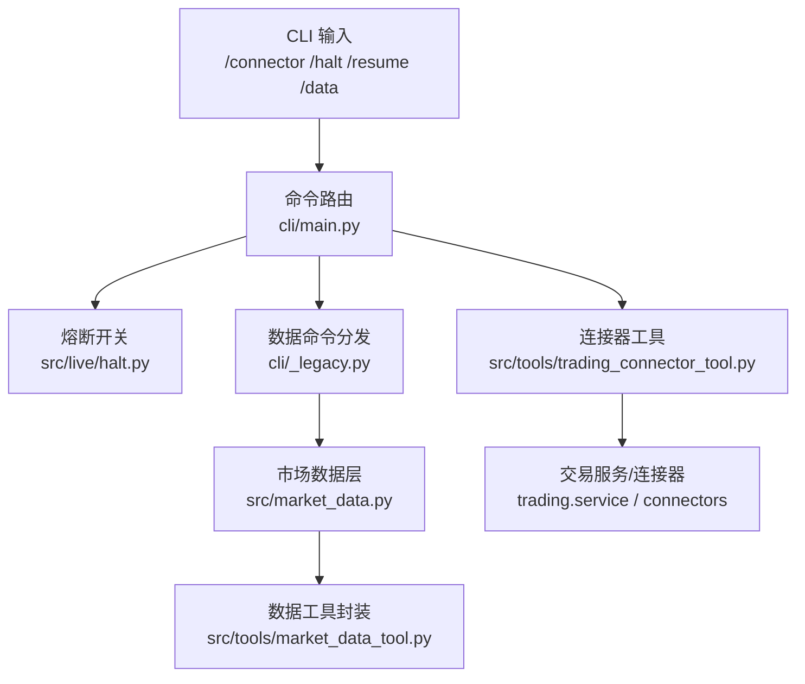
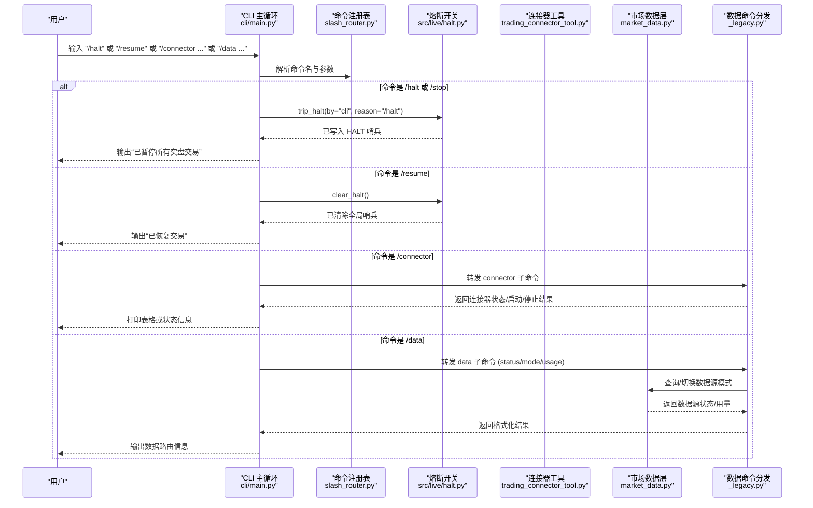
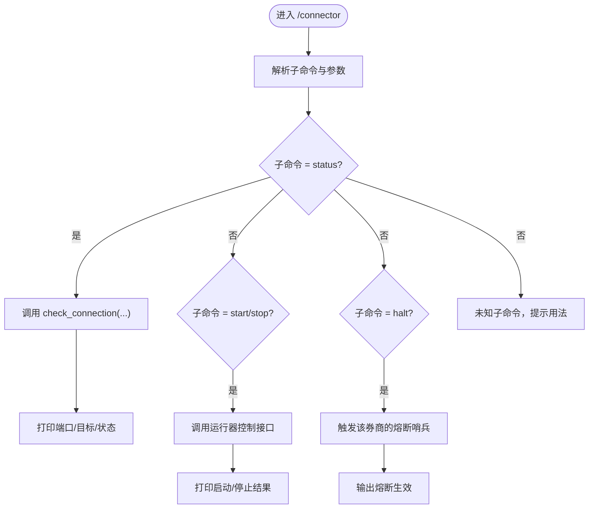
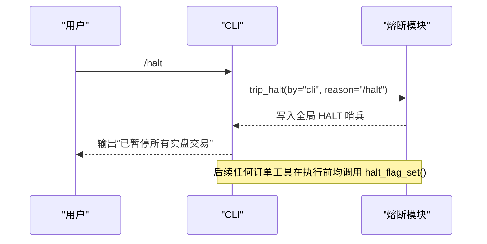
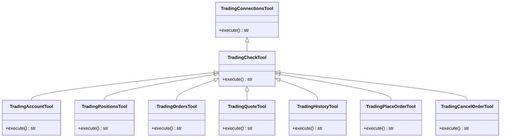
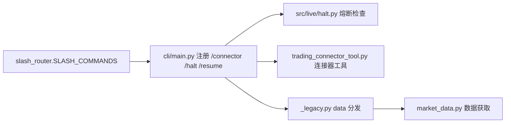

# 交易命令

<cite>
**本文引用的文件**
- [agent/cli/main.py](file://agent/cli/main.py)
- [agent/cli/commands/slash_router.py](file://agent/cli/commands/slash_router.py)
- [agent/src/live/halt.py](file://agent/src/live/halt.py)
- [agent/src/tools/trading_connector_tool.py](file://agent/src/tools/trading_connector_tool.py)
- [agent/src/market_data.py](file://agent/src/market_data.py)
- [agent/src/tools/market_data_tool.py](file://agent/src/tools/market_data_tool.py)
- [agent/cli/_legacy.py](file://agent/cli/_legacy.py)
</cite>

## 目录
1. [简介](#简介)
2. [项目结构](#项目结构)
3. [核心组件](#核心组件)
4. [架构总览](#架构总览)
5. [详细组件分析](#详细组件分析)
6. [依赖关系分析](#依赖关系分析)
7. [性能考虑](#性能考虑)
8. [故障排查指南](#故障排查指南)
9. [结论](#结论)
10. [附录](#附录)

## 简介
本文件面向 Vibe-Trading 的交易相关斜杠命令，系统性说明 /connector、/halt、/resume、/data 等命令的用途、用法与内部执行机制。重点包括：
- /connector：管理交易连接器配置与状态（查看、启动、停止、暂停等子命令），以及数据路由选择。
- /halt：立即暂停所有实盘交易执行（全局熔断）。
- /resume：清除熔断标志，恢复交易。
- /data：查看与管理市场数据源与模式（状态、模式切换、用量查询）。

同时涵盖安全限制与权限控制、错误处理、执行优先级与并发控制，并提供实际使用场景与操作示例。

## 项目结构
Vibe-Trading 将“用户可见的斜杠命令”与“底层交易/数据能力”分层组织：
- 命令行入口与注册：cli/main.py 负责注册 live trading 相关的斜杠命令（/connector、/halt、/resume）以及 data 命令；slash_router.py 提供命令注册表与模糊匹配。
- 熔断开关：src/live/halt.py 实现基于文件系统哨兵的“即时、全局、LLM 无关”的熔断机制。
- 连接器工具：src/tools/trading_connector_tool.py 暴露连接器的读/写工具（账户、持仓、订单、报价、历史、下单、取消等）。
- 市场数据：src/market_data.py 提供统一的市场数据获取与回退链；src/tools/market_data_tool.py 将其封装为本地工具。
- 数据命令桥接：cli/_legacy.py 提供 data 子命令的分发逻辑（status、mode、usage）。

图表来源
- [agent/cli/main.py:60-86](file://agent/cli/main.py#L60-L86)
- [agent/cli/main.py:920-933](file://agent/cli/main.py#L920-L933)
- [agent/cli/main.py:936-950](file://agent/cli/main.py#L936-L950)
- [agent/cli/main.py:1407-1426](file://agent/cli/main.py#L1407-L1426)
- [agent/src/live/halt.py:46-163](file://agent/src/live/halt.py#L46-L163)
- [agent/src/tools/trading_connector_tool.py:208-504](file://agent/src/tools/trading_connector_tool.py#L208-L504)
- [agent/src/market_data.py:97-234](file://agent/src/market_data.py#L97-L234)
- [agent/src/tools/market_data_tool.py:11-107](file://agent/src/tools/market_data_tool.py#L11-L107)
- [agent/cli/_legacy.py:3419-3427](file://agent/cli/_legacy.py#L3419-L3427)

章节来源
- [agent/cli/main.py:60-86](file://agent/cli/main.py#L60-L86)
- [agent/cli/commands/slash_router.py:37-56](file://agent/cli/commands/slash_router.py#L37-L56)

## 核心组件
- 命令注册与路由
  - slash_router.py 维护命令注册表与别名，支持模糊匹配与类型提示。
  - cli/main.py 在导入时注册 live trading 命令组（/connector、/halt、/resume），并插入到注册表末尾附近，保证“安全相关命令靠前”。
- 熔断开关（Kill Switch）
  - halt.py 通过文件系统哨兵（HALT 文件）实现“即时、全局、独立于 LLM”的熔断。支持全局与按券商粒度设置。
  - trip_halt/clear_halt/halt_flag_set 提供写入、清除与读取状态的能力。
- 连接器工具
  - trading_connector_tool.py 提供一系列 BaseTool 子类，用于查看/选择连接器、检查连接、读取账户/持仓/订单/报价/历史、下单、取消订单等。
  - 参数校验严格，数值型参数必须有限且合法，避免误下单。
- 市场数据
  - market_data.py 提供 fetch_market_data，自动检测符号来源并按市场回退链尝试多个数据源，返回标准化 OHLCV。
  - market_data_tool.py 将该能力封装为 get_market_data 工具，便于本地调用。
- 数据命令
  - _legacy.py 中的 data 子命令分发器支持 status、mode、usage 三种子命令，用于查看与调整数据路由模式与用量。

章节来源
- [agent/cli/commands/slash_router.py:159-251](file://agent/cli/commands/slash_router.py#L159-L251)
- [agent/cli/main.py:60-86](file://agent/cli/main.py#L60-L86)
- [agent/src/live/halt.py:72-163](file://agent/src/live/halt.py#L72-L163)
- [agent/src/tools/trading_connector_tool.py:139-174](file://agent/src/tools/trading_connector_tool.py#L139-L174)
- [agent/src/market_data.py:16-57](file://agent/src/market_data.py#L16-L57)
- [agent/cli/_legacy.py:3419-3427](file://agent/cli/_legacy.py#L3419-L3427)

## 架构总览
下图展示从用户输入斜杠命令到具体执行的端到端流程，包括熔断检查、连接器管理与数据路由。

图表来源
- [agent/cli/main.py:1407-1426](file://agent/cli/main.py#L1407-L1426)
- [agent/cli/main.py:920-933](file://agent/cli/main.py#L920-L933)
- [agent/cli/main.py:936-950](file://agent/cli/main.py#L936-L950)
- [agent/src/live/halt.py:72-163](file://agent/src/live/halt.py#L72-L163)
- [agent/cli/_legacy.py:3419-3427](file://agent/cli/_legacy.py#L3419-L3427)
- [agent/src/market_data.py:97-234](file://agent/src/market_data.py#L97-L234)

## 详细组件分析

### /connector 命令：连接器管理与数据路由
- 功能概述
  - 作为 REPL 内的薄桥接，将 /connector 子命令转发给非交互式的 privileged handler（如 status、start、stop、halt 等），这些处理器不是 agent tool，具备更高权限。
  - 默认 /connector 无参数时等价于 /connector status，便于快速查看当前连接器状态。
- 关键行为
  - 参数解析复用 argparse 表面，确保与 CLI 一致。
  - 对 local_tws 等本地连接器，会显示端口开放状态与目标地址。
- 典型子命令
  - /connector status：列出并检查连接器配置与可达性。
  - /connector start：启动指定连接器的运行器。
  - /connector stop：停止指定连接器的运行器。
  - /connector halt：针对某券商通道单独暂停（若实现）。
- 使用示例
  - 查看连接器状态：/connector
  - 检查特定连接器：/connector robinhood-live-mcp
  - 启动连接器：/connector start ibkr-paper-local
  - 停止连接器：/connector stop binance-live

图表来源
- [agent/cli/main.py:936-950](file://agent/cli/main.py#L936-L950)
- [agent/cli/_legacy.py:4037-4068](file://agent/cli/_legacy.py#L4037-L4068)
- [agent/src/live/halt.py:72-163](file://agent/src/live/halt.py#L72-L163)

章节来源
- [agent/cli/main.py:936-950](file://agent/cli/main.py#L936-L950)
- [agent/cli/_legacy.py:4037-4068](file://agent/cli/_legacy.py#L4037-L4068)

### /halt 命令：立即暂停所有实盘交易
- 功能概述
  - 通过写入全局 HALT 哨兵文件，立即阻止所有实盘订单到达券商。即使代理循环卡住或模型不配合，也能生效。
  - 支持 per-broker 哨兵（可选），但全局哨兵优先。
- 关键行为
  - trip_halt：原子写入哨兵（临时文件 + replace），记录 by/reason。
  - halt_flag_set：每次订单前检查是否存在哨兵，存在则拒绝下单。
  - clear_halt：仅由特权路径调用，删除哨兵以恢复交易。
- 使用示例
  - 暂停所有实盘：/halt 或 /stop（别名）
  - 查看是否已熔断：结合 /connector status 或系统日志
  - 恢复交易：/resume

图表来源
- [agent/cli/main.py:1407-1420](file://agent/cli/main.py#L1407-L1420)
- [agent/src/live/halt.py:72-163](file://agent/src/live/halt.py#L72-L163)

章节来源
- [agent/src/live/halt.py:72-163](file://agent/src/live/halt.py#L72-L163)
- [agent/cli/main.py:1407-1420](file://agent/cli/main.py#L1407-L1420)

### /resume 命令：清除熔断并恢复交易
- 功能概述
  - 调用 clear_halt() 删除全局 HALT 哨兵，从而允许后续订单继续执行。
- 使用示例
  - 恢复交易：/resume
  - 确认已恢复：再次 /connector status 或观察订单可提交

章节来源
- [agent/cli/main.py:920-933](file://agent/cli/main.py#L920-L933)
- [agent/src/live/halt.py:111-132](file://agent/src/live/halt.py#L111-L132)

### /data 命令：查看与管理市场数据
- 功能概述
  - 通过 _legacy.py 的数据命令分发器，支持：
    - status：查看当前数据源状态
    - mode：切换数据源模式（例如 auto/local/yahoo/tencent 等）
    - usage：查询用量统计
- 与 market_data.py 的关系
  - 数据命令可能触发 fetch_market_data 或相关查询，依据所选 source 与 interval 获取 OHLCV。
- 使用示例
  - 查看数据源状态：/data status
  - 切换数据源模式：/data mode --mode auto
  - 查询用量：/data usage

章节来源
- [agent/cli/_legacy.py:3419-3427](file://agent/cli/_legacy.py#L3419-L3427)
- [agent/src/market_data.py:97-234](file://agent/src/market_data.py#L97-L234)

### 连接器工具族（trading_* 工具）
- 功能概览
  - 提供连接器的只读与写操作工具，包括：
    - 只读：trading_connections、trading_check、trading_account、trading_positions、trading_orders、trading_quote、trading_history
    - 写操作：trading_place_order、trading_cancel_order、eToro 系列工具（关闭仓位、编辑止损止盈、跟单预检/开始等）
- 参数校验与安全
  - 数值参数必须有限且合法，否则直接拒绝，避免误下单。
  - 写操作标记为非 repeatable，防止重复提交。
  - 实盘订单需经过 mandate + kill switch + fail-closed 前置检查与审计。
- 使用示例
  - 查看连接器列表：trading_connections
  - 检查连接：trading_check connection=ibkr-paper-local
  - 读取账户：trading_account
  - 下单：trading_place_order symbol=AAPL side=buy quantity=10 order_type=limit limit_price=150

图表来源
- [agent/src/tools/trading_connector_tool.py:208-504](file://agent/src/tools/trading_connector_tool.py#L208-L504)

章节来源
- [agent/src/tools/trading_connector_tool.py:208-504](file://agent/src/tools/trading_connector_tool.py#L208-L504)

### 市场数据工具（get_market_data）
- 功能概览
  - 通过统一的 loader 层获取标准化 OHLCV，支持多市场与多数据源的回退链。
  - 支持 max_rows 限制以避免过大响应。
- 使用示例
  - 获取 AAPL.US 近 30 日日线：get_market_data codes=["AAPL.US"] start_date=YYYY-MM-DD end_date=YYYY-MM-DD interval=1D

章节来源
- [agent/src/tools/market_data_tool.py:11-107](file://agent/src/tools/market_data_tool.py#L11-L107)
- [agent/src/market_data.py:97-234](file://agent/src/market_data.py#L97-L234)

## 依赖关系分析
- 命令注册与别名
  - slash_router.py 维护 SLASH_COMMANDS 元组与别名映射，/stop 作为 /halt 的别名被注册。
  - cli/main.py 在导入时追加 live trading 命令组，确保顺序与可见性。
- 熔断与订单门控
  - 每个订单工具在执行前会调用 halt_flag_set()，若检测到 HALT 哨兵则拒绝下单。
- 数据路由
  - market_data.py 根据符号格式推断首选数据源，并在失败时按市场回退链尝试其他源。

图表来源
- [agent/cli/commands/slash_router.py:37-56](file://agent/cli/commands/slash_router.py#L37-L56)
- [agent/cli/main.py:60-86](file://agent/cli/main.py#L60-L86)
- [agent/src/live/halt.py:135-163](file://agent/src/live/halt.py#L135-L163)
- [agent/src/market_data.py:16-57](file://agent/src/market_data.py#L16-L57)

章节来源
- [agent/cli/commands/slash_router.py:37-56](file://agent/cli/commands/slash_router.py#L37-L56)
- [agent/cli/main.py:60-86](file://agent/cli/main.py#L60-L86)

## 性能考虑
- 数据获取
  - fetch_market_data 支持 max_rows 限制与采样策略，避免超大响应影响性能。
  - 回退链尝试次数受 max_fallback_attempts 限制，减少无效网络请求。
- 连接器检查
  - 检查连接时仅进行必要探测，避免频繁长耗时操作。
- 熔断检查
  - halt_flag_set 为纯文件系统检查，开销极低，适合高频调用。

[本节提供一般性指导，无需特定文件引用]

## 故障排查指南
- 无法下单
  - 检查是否触发了全局或券商级熔断：查看 HALT 哨兵是否存在。
  - 使用 /connector status 确认连接器可达性与端口状态。
- 数据为空或未解析
  - 使用 /data status 查看当前数据源状态。
  - 尝试切换数据源模式：/data mode --mode auto 或指定具体源。
  - 检查符号格式是否符合预期（如 .US/.HK/.KS 等后缀）。
- 连接器异常
  - 检查本地 TWS/Gateway 端口与客户端 ID 是否正确。
  - 重新执行 /connector start 启动运行器，再试。

章节来源
- [agent/src/live/halt.py:135-191](file://agent/src/live/halt.py#L135-L191)
- [agent/cli/_legacy.py:4037-4068](file://agent/cli/_legacy.py#L4037-L4068)
- [agent/src/market_data.py:16-57](file://agent/src/market_data.py#L16-L57)

## 结论
Vibe-Trading 的交易命令体系通过清晰的层次化设计实现了高可用与强安全：
- /connector 提供连接器全生命周期管理，便于运维与排障。
- /halt 与 /resume 构成“即时熔断+可控恢复”的安全闭环，保障实盘交易风险可控。
- /data 提供灵活的数据路由能力，适配多市场与多数据源。
- 严格的参数校验与权限控制确保命令执行的安全性与一致性。

[本节总结内容，无需特定文件引用]

## 附录
- 安全限制与权限控制
  - /connector、/halt、/resume 为特权路径，不在 agent tool 中执行，避免被模型滥用。
  - 实盘订单需通过 mandate + kill switch + fail-closed 前置检查与审计。
- 执行优先级与并发控制
  - 全局熔断优先于任何券商级设置；每笔订单执行前都会检查熔断状态。
  - 熔断哨兵写入采用原子操作，避免并发写入导致的状态不一致。
- 常见操作示例
  - 暂停交易：/halt
  - 恢复交易：/resume
  - 查看连接器：/connector
  - 查看数据源：/data status
  - 切换数据源：/data mode --mode auto

[本节提供概念性内容，无需特定文件引用]