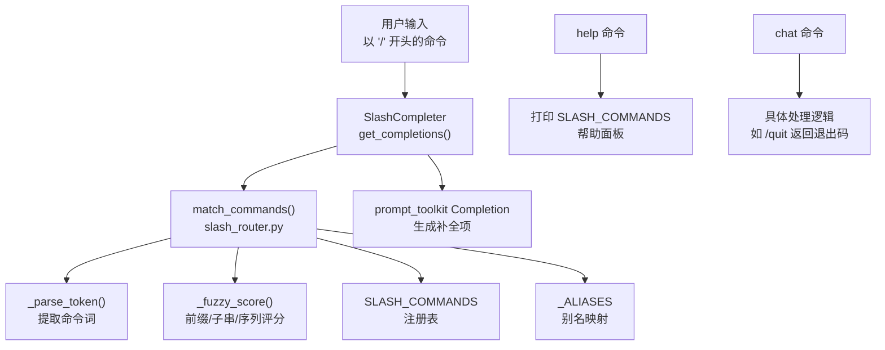
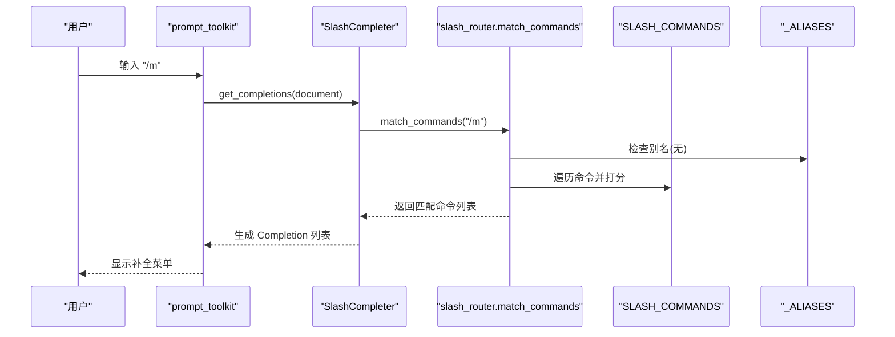
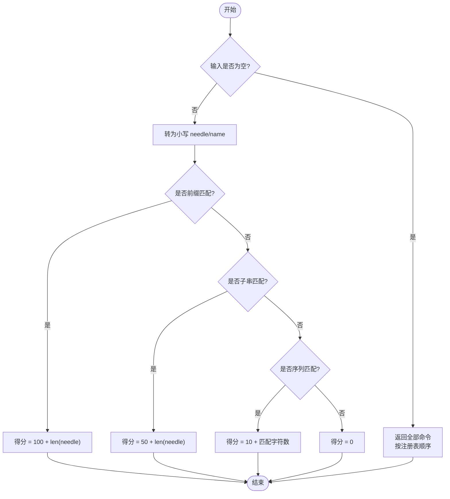
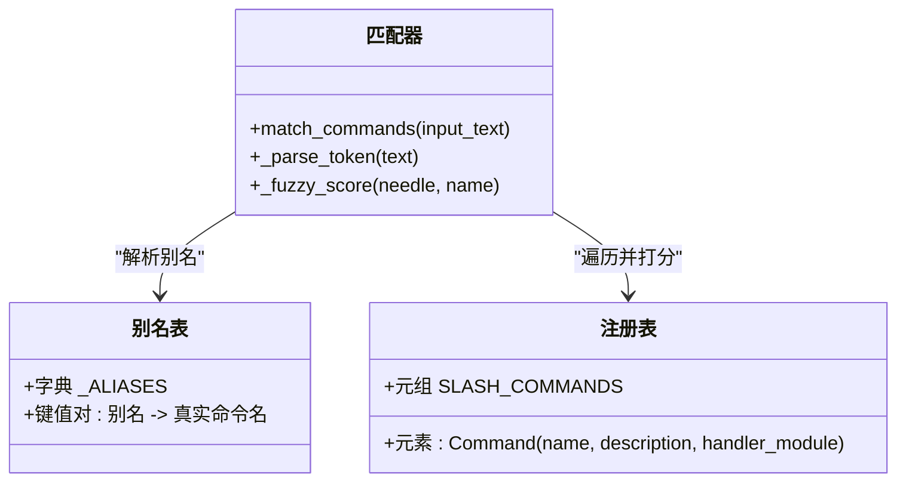
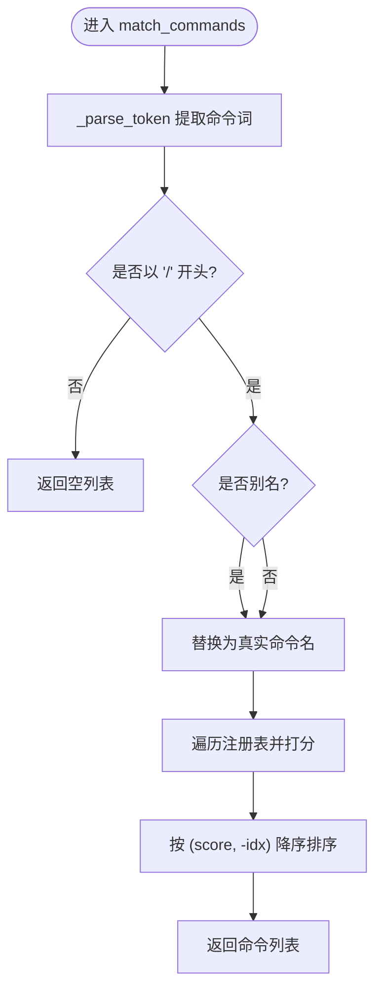
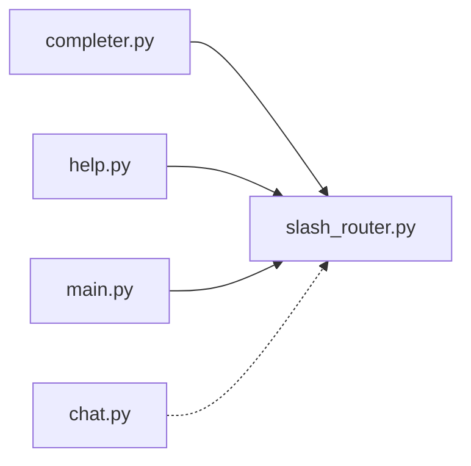

# 命令匹配与补全

<cite>
**本文引用的文件**
- [agent/cli/commands/slash_router.py](file://agent/cli/commands/slash_router.py)
- [agent/cli/completer.py](file://agent/cli/completer.py)
- [agent/cli/commands/help.py](file://agent/cli/commands/help.py)
- [agent/cli/commands/chat.py](file://agent/cli/commands/chat.py)
- [agent/cli/main.py](file://agent/cli/main.py)
- [agent/cli/commands/__init__.py](file://agent/cli/commands/__init__.py)
</cite>

## 目录
1. [简介](#简介)
2. [项目结构](#项目结构)
3. [核心组件](#核心组件)
4. [架构总览](#架构总览)
5. [详细组件分析](#详细组件分析)
6. [依赖关系分析](#依赖关系分析)
7. [性能考量](#性能考量)
8. [故障排查指南](#故障排查指南)
9. [结论](#结论)
10. [附录：自定义命令开发指南](#附录自定义命令开发指南)

## 简介
本文件聚焦 Vibe-Trading 的“斜杠命令”匹配与智能补全能力，覆盖以下要点：
- 模糊匹配算法：前缀匹配、子串匹配、序列匹配的评分机制与排序规则。
- 命令别名系统：如 q、exit、:q 映射到 quit；? 映射到 help；以及运行时动态注册的 stop→halt 等。
- 补全菜单排序：基于匹配分数与注册表顺序的优先级策略。
- match_commands 函数：如何解析输入文本并返回匹配的命令列表。
- 自定义命令开发：如何注册新命令与设置别名。
- 性能优化与调试技巧：避免重复导入、缓存快照、最小化计算路径。
- 边界情况与错误恢复：空输入、非斜杠输入、未知命令、异常隔离等。

## 项目结构
与命令匹配和补全相关的核心代码位于 CLI 层：
- 命令注册与模糊匹配：agent/cli/commands/slash_router.py
- 交互式补全器（prompt_toolkit）：agent/cli/completer.py
- 帮助显示与快捷键面板：agent/cli/commands/help.py
- 聊天类命令实现（含 /quit 等）：agent/cli/commands/chat.py
- 主入口与动态注册（连接器/数据路由等）：agent/cli/main.py
- 模块导出聚合：agent/cli/commands/__init__.py

图表来源
- [agent/cli/completer.py:47-112](file://agent/cli/completer.py#L47-L112)
- [agent/cli/commands/slash_router.py:159-237](file://agent/cli/commands/slash_router.py#L159-L237)
- [agent/cli/commands/help.py:36-61](file://agent/cli/commands/help.py#L36-L61)
- [agent/cli/commands/chat.py:215-221](file://agent/cli/commands/chat.py#L215-L221)

章节来源
- [agent/cli/commands/slash_router.py:1-15](file://agent/cli/commands/slash_router.py#L1-L15)
- [agent/cli/completer.py:1-20](file://agent/cli/completer.py#L1-L20)

## 核心组件
- 命令数据模型 Command：不可变的数据类，包含 name、description、handler_module。
- 注册表 SLASH_COMMANDS：按使用频率排序的元组，决定裸 “/” 时的展示顺序。
- 别名表 _ALIASES：将短别名或特殊符号映射到真实命令名。
- 匹配器 match_commands：解析输入、应用别名、打分、排序并返回匹配结果。
- 补全器 SlashCompleter：仅在首 token 为斜杠时触发补全，渲染带描述的候选项。

章节来源
- [agent/cli/commands/slash_router.py:22-66](file://agent/cli/commands/slash_router.py#L22-L66)
- [agent/cli/commands/slash_router.py:206-237](file://agent/cli/commands/slash_router.py#L206-L237)
- [agent/cli/completer.py:47-112](file://agent/cli/completer.py#L47-L112)

## 架构总览
下图展示了从用户输入到补全展示的完整调用链，以及与注册表和别名的交互。

图表来源
- [agent/cli/completer.py:63-112](file://agent/cli/completer.py#L63-L112)
- [agent/cli/commands/slash_router.py:159-237](file://agent/cli/commands/slash_router.py#L159-L237)

## 详细组件分析

### 模糊匹配算法与评分机制
- 前缀匹配：命令名以输入片段开头，得分为 100 + 输入长度。
- 子串匹配：输入片段出现在命令名中任意位置，得分为 50 + 输入长度。
- 序列匹配：输入片段的字符按顺序出现在命令名中（不必连续），得分为 10 + 匹配字符数。
- 空输入：当仅输入 “/” 时，返回全部命令并按注册表顺序展示。

图表来源
- [agent/cli/commands/slash_router.py:177-203](file://agent/cli/commands/slash_router.py#L177-L203)

章节来源
- [agent/cli/commands/slash_router.py:177-203](file://agent/cli/commands/slash_router.py#L177-L203)

### 命令别名系统
- 内置别名：
  - q、exit、:q → quit
  - ? → help
- 运行时别名扩展：
  - stop → halt（在 main 启动时注入）
- 别名作用范围：
  - 补全阶段：match_commands 会先解析别名再打分，因此 /q 会显示 quit 行。
  - 精确查找：find_exact 同样支持别名解析。

图表来源
- [agent/cli/commands/slash_router.py:59-66](file://agent/cli/commands/slash_router.py#L59-L66)
- [agent/cli/commands/slash_router.py:206-237](file://agent/cli/commands/slash_router.py#L206-L237)
- [agent/cli/main.py:37-84](file://agent/cli/main.py#L37-L84)

章节来源
- [agent/cli/commands/slash_router.py:59-66](file://agent/cli/commands/slash_router.py#L59-L66)
- [agent/cli/main.py:37-84](file://agent/cli/main.py#L37-L84)

### 补全菜单排序规则
- 排序依据：
  - 主要：匹配分数从高到低。
  - 次要：当分数相同时，优先注册表中靠前的命令（通过负索引保证降序排序下的稳定性）。
- 行为约束：
  - 仅在首 token 为斜杠且未出现空格/制表符时触发补全，避免干扰参数输入。
  - 补全项显示命令名与描述，名称列右对齐便于阅读。

图表来源
- [agent/cli/commands/slash_router.py:159-237](file://agent/cli/commands/slash_router.py#L159-L237)
- [agent/cli/completer.py:63-112](file://agent/cli/completer.py#L63-L112)

章节来源
- [agent/cli/commands/slash_router.py:159-237](file://agent/cli/commands/slash_router.py#L159-L237)
- [agent/cli/completer.py:63-112](file://agent/cli/completer.py#L63-L112)

### match_commands 函数详解
- 输入处理：
  - 去除前导空白后判断是否以 “/” 开头。
  - 提取第一个命令词（忽略后续参数）。
- 别名解析：
  - 若命令词命中 _ALIASES，则替换为目标命令名。
- 打分与排序：
  - 对每个注册命令计算 _fuzzy_score。
  - 收集 (score, -idx, cmd) 三元组并降序排序。
- 返回值：
  - 返回新的命令列表，供补全器或帮助界面使用。

章节来源
- [agent/cli/commands/slash_router.py:206-237](file://agent/cli/commands/slash_router.py#L206-L237)

### 帮助与命令展示
- /help 命令：
  - 渲染 SLASH_COMMANDS 为两列表格（命令名与描述）。
  - 附带键盘快捷键说明。
- 主题与样式：
  - 命令名使用品牌色，描述使用弱化样式，提升可读性。

章节来源
- [agent/cli/commands/help.py:36-61](file://agent/cli/commands/help.py#L36-L61)

### 聊天类命令与退出流程
- /quit：
  - 返回特定退出码（2），由交互循环解释为用户请求退出，执行会话持久化与告别提示。
- 其他聊天命令：
  - /model、/clear、/journal、/shadow、/swarm、/debug 等各自实现独立逻辑。

章节来源
- [agent/cli/commands/chat.py:215-221](file://agent/cli/commands/chat.py#L215-L221)
- [agent/cli/commands/chat.py:44-68](file://agent/cli/commands/chat.py#L44-L68)
- [agent/cli/commands/chat.py:74-97](file://agent/cli/commands/chat.py#L74-L97)
- [agent/cli/commands/chat.py:116-144](file://agent/cli/commands/chat.py#L116-L144)
- [agent/cli/commands/chat.py:147-167](file://agent/cli/commands/chat.py#L147-L167)
- [agent/cli/commands/chat.py:170-180](file://agent/cli/commands/chat.py#L170-L180)
- [agent/cli/commands/chat.py:183-212](file://agent/cli/commands/chat.py#L183-L212)

## 依赖关系分析
- completer 依赖 slash_router 的 SLASH_COMMANDS、Command、match_commands。
- slash_router 被 help、completer、main 等多个模块读取或使用。
- main 在启动时动态注册连接器与数据路由命令，并扩展别名表。

图表来源
- [agent/cli/completer.py:19-19](file://agent/cli/completer.py#L19-L19)
- [agent/cli/commands/help.py:15-15](file://agent/cli/commands/help.py#L15-L15)
- [agent/cli/main.py:37-84](file://agent/cli/main.py#L37-L84)

章节来源
- [agent/cli/commands/__init__.py:11-18](file://agent/cli/commands/__init__.py#L11-L18)
- [agent/cli/commands/slash_router.py:1-15](file://agent/cli/commands/slash_router.py#L1-L15)

## 性能考量
- 避免重复导入：
  - 注册表在模块导入时构建，completer 捕获快照作为默认参数，减少运行时开销。
- 最小化计算路径：
  - 仅在首 token 为斜杠且未出现空格时触发匹配，避免对整行进行复杂处理。
- 稳定排序：
  - 使用 (score, -idx) 确保同分情况下按注册表顺序稳定输出。
- 懒加载与异常隔离：
  - 主题、控制台、工具计数等按需导入并在失败时回退，不阻塞启动与补全。

章节来源
- [agent/cli/completer.py:57-60](file://agent/cli/completer.py#L57-L60)
- [agent/cli/completer.py:63-83](file://agent/cli/completer.py#L63-L83)
- [agent/cli/main.py:144-167](file://agent/cli/main.py#L144-L167)

## 故障排查指南
- 输入为空或非斜杠：
  - match_commands 直接返回空列表，不会抛出异常。
- 未知命令：
  - find_exact 返回 None，由上层统一处理“未知命令”提示。
- 别名冲突：
  - 别名不会覆盖已存在的命令名或已有别名，保证安全性。
- 主题/控制台导入失败：
  - 采用 try/except 包裹，回退到默认样式或提示信息，不影响核心功能。
- 退出流程：
  - /quit 返回特定退出码，交互循环负责持久化与会话收尾。

章节来源
- [agent/cli/commands/slash_router.py:240-251](file://agent/cli/commands/slash_router.py#L240-L251)
- [agent/cli/commands/slash_router.py:107-118](file://agent/cli/commands/slash_router.py#L107-L118)
- [agent/cli/completer.py:22-44](file://agent/cli/completer.py#L22-L44)
- [agent/cli/commands/chat.py:215-221](file://agent/cli/commands/chat.py#L215-L221)

## 结论
Vibe-Trading 的命令匹配与补全系统通过清晰的注册表、灵活的别名机制与稳健的模糊匹配算法，提供了高效且友好的交互体验。其设计强调：
- 可维护性：注册表与别名集中管理，易于扩展。
- 鲁棒性：异常隔离与边界处理完善。
- 性能：最小化计算路径与缓存快照。
- 可扩展：支持运行时动态注册命令与别名。

## 附录：自定义命令开发指南
- 注册新命令：
  - 在 SLASH_COMMANDS 中添加 Command(name, description, handler_module)。
  - 确保 handler_module 暴露 run(ctx, *args) 接口。
- 设置别名：
  - 在 _ALIASES 中添加映射，如 "mycmd": "realname"。
  - 注意别名不得覆盖已有命令名或已有别名。
- 动态注册：
  - 可在模块导入时调用注册函数（参考 main 中的 _register_live_slash_commands）。
  - 保持幂等性，避免重复插入。
- 测试建议：
  - 验证 match_commands 能正确匹配别名与命令。
  - 验证补全器在 “/” 开头时能列出新增命令。
  - 验证帮助界面能显示新增命令及其描述。

章节来源
- [agent/cli/commands/slash_router.py:37-66](file://agent/cli/commands/slash_router.py#L37-L66)
- [agent/cli/main.py:37-84](file://agent/cli/main.py#L37-L84)
- [agent/cli/commands/help.py:36-61](file://agent/cli/commands/help.py#L36-L61)