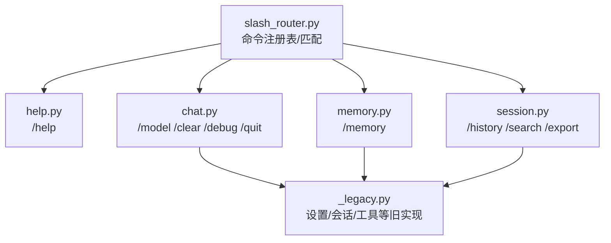
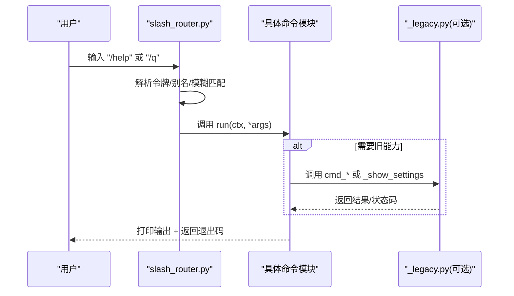
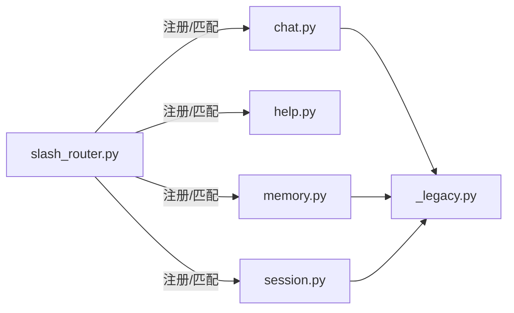

# 基础命令

<cite>
**本文引用的文件**
- [agent/cli/commands/slash_router.py](file://agent/cli/commands/slash_router.py)
- [agent/cli/commands/help.py](file://agent/cli/commands/help.py)
- [agent/cli/commands/chat.py](file://agent/cli/commands/chat.py)
- [agent/cli/commands/memory.py](file://agent/cli/commands/memory.py)
- [agent/cli/commands/session.py](file://agent/cli/commands/session.py)
- [agent/cli/_legacy.py](file://agent/cli/_legacy.py)
</cite>

## 目录
1. [简介](#简介)
2. [项目结构](#项目结构)
3. [核心组件](#核心组件)
4. [架构总览](#架构总览)
5. [详细组件分析](#详细组件分析)
6. [依赖关系分析](#依赖关系分析)
7. [性能考虑](#性能考虑)
8. [故障排除指南](#故障排除指南)
9. [结论](#结论)
10. [附录](#附录)

## 简介
本文件面向 Vibe-Trading CLI 的“基础斜杠命令”，聚焦以下命令的使用与原理：/help、/model、/memory、/history、/clear、/debug、/quit。文档将说明每个命令的功能、参数选项、返回值格式，并提供常用示例与最佳实践；同时给出错误处理与排障建议。

## 项目结构
Vibe-Trading 的斜杠命令采用“注册表 + 分发器”的结构：
- 命令注册表集中定义命令名、描述与处理器模块路径，并支持别名与模糊匹配。
- 各命令以独立模块实现，统一暴露 run(ctx, *args) -> int 接口。
- 部分命令通过“遗留模块”复用既有能力（如会话列表、设置展示等）。

图表来源
- [agent/cli/commands/slash_router.py:1-56](file://agent/cli/commands/slash_router.py#L1-L56)
- [agent/cli/commands/help.py:1-65](file://agent/cli/commands/help.py#L1-L65)
- [agent/cli/commands/chat.py:1-257](file://agent/cli/commands/chat.py#L1-L257)
- [agent/cli/commands/memory.py:1-68](file://agent/cli/commands/memory.py#L1-L68)
- [agent/cli/commands/session.py:1-99](file://agent/cli/commands/session.py#L1-L99)
- [agent/cli/_legacy.py:1-200](file://agent/cli/_legacy.py#L1-L200)

章节来源
- [agent/cli/commands/slash_router.py:1-56](file://agent/cli/commands/slash_router.py#L1-L56)

## 核心组件
- 命令注册表与匹配器：集中维护命令元数据、别名、模糊匹配与精确查找。
- 命令处理器：每个命令一个模块，提供 run(ctx, *args) -> int 的统一入口。
- 控制台输出：使用 Rich 渲染表格、面板与文本。
- 遗留能力桥接：对历史功能（会话、设置、搜索等）进行兼容调用。

章节来源
- [agent/cli/commands/slash_router.py:1-56](file://agent/cli/commands/slash_router.py#L1-L56)
- [agent/cli/commands/__init__.py:1-19](file://agent/cli/commands/__init__.py#L1-L19)

## 架构总览
下图展示了用户输入到命令执行的完整流程，包括别名解析、模糊匹配、精确查找与处理器调用。

图表来源
- [agent/cli/commands/slash_router.py:159-251](file://agent/cli/commands/slash_router.py#L159-L251)
- [agent/cli/commands/chat.py:224-244](file://agent/cli/commands/chat.py#L224-L244)
- [agent/cli/_legacy.py:1-200](file://agent/cli/_legacy.py#L1-L200)

## 详细组件分析

### /help — 显示快捷键与命令列表
- 功能：打印所有可用斜杠命令及其描述，并附带键盘快捷键提示。
- 参数：无。
- 返回值：始终返回 0。
- 行为要点：
  - 从注册表读取命令列表，按名称与描述渲染为两列表格。
  - 内置一组快捷键（发送、换行、补全、历史浏览、清屏/退出、命令前缀等）。
- 常见用法：
  - 在交互界面输入 /help 查看帮助。
- 最佳实践：
  - 首次使用时先运行 /help 了解快捷键与命令概览。

章节来源
- [agent/cli/commands/help.py:1-65](file://agent/cli/commands/help.py#L1-L65)
- [agent/cli/commands/slash_router.py:37-56](file://agent/cli/commands/slash_router.py#L37-L56)

### /model — 切换 LLM 提供商与模型
- 功能：显示当前使用的 LLM 提供商与模型，并提示如何重新配置。
- 参数：无。
- 返回值：始终返回 0。
- 行为要点：
  - 优先尝试旧版设置展示；若不可用，则回退到读取环境配置并打印 provider/model。
  - 提示可通过初始化向导切换提供商、模型或凭据。
- 常见用法：
  - 输入 /model 查看当前模型信息。
- 最佳实践：
  - 如需更换模型，按提示执行初始化流程完成配置。

章节来源
- [agent/cli/commands/chat.py:41-68](file://agent/cli/commands/chat.py#L41-L68)
- [agent/cli/_legacy.py:142-186](file://agent/cli/_legacy.py#L142-L186)

### /memory — 管理与查看持久化记忆
- 功能：列出、查看、全文检索或删除持久化记忆片段。
- 参数：
  - 无参：列出所有记忆片段。
  - <name>：查看指定名称的记忆片段。
  - search <q>：全文检索记忆。
  - forget <name>：删除指定名称的记忆片段。
- 返回值：成功返回 0；失败返回 1。
- 行为要点：
  - 通过子命令路由到对应实现；异常时打印错误并返回 1。
- 常见用法：
  - /memory：列出记忆。
  - /memory my_note：查看名为 my_note 的记忆。
  - /memory search 关键词：检索包含关键词的记忆。
  - /memory forget my_note：删除该记忆。
- 最佳实践：
  - 命名具有语义的记忆片段，便于检索与管理。
  - 定期清理不再需要的记忆，保持上下文整洁。

章节来源
- [agent/cli/commands/memory.py:1-68](file://agent/cli/commands/memory.py#L1-L68)

### /history — 浏览与恢复之前的会话
- 功能：列出最近的会话。
- 参数：无。
- 返回值：成功返回 0；失败返回 1。
- 行为要点：
  - 委托给旧实现列出会话；异常时打印错误并返回 1。
- 常见用法：
  - 输入 /history 查看最近会话列表。
- 最佳实践：
  - 结合 /search 快速定位历史对话中的关键信息。

章节来源
- [agent/cli/commands/session.py:25-35](file://agent/cli/commands/session.py#L25-L35)

### /clear — 清空当前对话
- 功能：清屏并重绘欢迎横幅，重置内存中的对话历史（如果上下文支持）。
- 参数：无。
- 返回值：始终返回 0。
- 行为要点：
  - 尽力清屏；若终端不支持则忽略。
  - 重绘横幅以呈现“新的对话”。
  - 若上下文存在 history，则尝试清空。
- 常见用法：
  - 输入 /clear 开始一段新对话。
- 最佳实践：
  - 在长对话中适时使用 /clear 减少上下文噪声。

章节来源
- [agent/cli/commands/chat.py:74-97](file://agent/cli/commands/chat.py#L74-L97)

### /debug — 切换调试摘要
- 功能：切换每次智能体回合后是否打印调试摘要（迭代次数、工具调用数、耗时、近似上下文大小等）。
- 参数：无。
- 返回值：成功返回 0；失败返回 1。
- 行为要点：
  - 若上下文支持 debug 属性，则切换开关并提示当前状态。
  - 若不支持，则提示通过环境变量启用详细日志。
- 常见用法：
  - 输入 /debug 开启或关闭调试摘要。
- 最佳实践：
  - 仅在排查问题时开启，避免干扰正常阅读。

章节来源
- [agent/cli/commands/chat.py:183-212](file://agent/cli/commands/chat.py#L183-L212)

### /quit — 退出程序
- 功能：请求退出交互会话。
- 参数：无。
- 返回值：返回 2（由交互循环解释为用户主动退出，并进行会话保存与告别）。
- 常见用法：
  - 输入 /quit 或 q、exit、:q（别名）退出。
- 最佳实践：
  - 退出前确保重要对话已保存（交互循环会自动处理）。

章节来源
- [agent/cli/commands/chat.py:215-221](file://agent/cli/commands/chat.py#L215-L221)
- [agent/cli/commands/slash_router.py:59-66](file://agent/cli/commands/slash_router.py#L59-L66)

## 依赖关系分析
- 命令注册表集中管理命令元数据与别名，保证类型ahead与帮助显示的准确性。
- 命令模块通过统一接口被调度器调用，降低耦合度。
- 遗留模块提供会话、设置、搜索等能力，新命令可无缝复用。

图表来源
- [agent/cli/commands/slash_router.py:37-66](file://agent/cli/commands/slash_router.py#L37-L66)
- [agent/cli/commands/chat.py:224-244](file://agent/cli/commands/chat.py#L224-L244)
- [agent/cli/commands/memory.py:24-64](file://agent/cli/commands/memory.py#L24-L64)
- [agent/cli/commands/session.py:81-95](file://agent/cli/commands/session.py#L81-L95)
- [agent/cli/_legacy.py:1-200](file://agent/cli/_legacy.py#L1-L200)

章节来源
- [agent/cli/commands/slash_router.py:37-66](file://agent/cli/commands/slash_router.py#L37-L66)

## 性能考虑
- 命令注册表与匹配逻辑轻量，适合高频调用。
- 历史与搜索操作可能涉及磁盘 I/O，建议在批量查询时注意频率控制。
- 调试模式会追加额外输出，频繁刷新可能影响交互体验，按需开启。

[本节为通用指导，不直接分析具体文件]

## 故障排除指南
- /memory list/search/forget 失败：
  - 现象：打印 “/memory failed: ...” 并返回 1。
  - 排查：检查底层存储或权限问题；确认参数是否正确。
- /history 失败：
  - 现象：打印 “/history failed: ...” 并返回 1。
  - 排查：检查会话存储是否损坏或不可读。
- /debug 切换失败：
  - 现象：打印 “/debug toggle failed: ...” 并返回 1。
  - 排查：若上下文不支持 debug 属性，改用环境变量方式启用详细日志。
- /model 无法显示设置：
  - 现象：回退到读取环境配置并提示 legacy 不可用。
  - 排查：按提示执行初始化流程重新配置提供商与模型。
- /quit 未退出：
  - 现象：返回 2 但进程未结束。
  - 排查：确认交互循环正确解释退出码；检查是否有后台任务阻塞。

章节来源
- [agent/cli/commands/memory.py:34-59](file://agent/cli/commands/memory.py#L34-L59)
- [agent/cli/commands/session.py:25-35](file://agent/cli/commands/session.py#L25-L35)
- [agent/cli/commands/chat.py:183-212](file://agent/cli/commands/chat.py#L183-L212)
- [agent/cli/commands/chat.py:41-68](file://agent/cli/commands/chat.py#L41-L68)
- [agent/cli/commands/chat.py:215-221](file://agent/cli/commands/chat.py#L215-L221)

## 结论
Vibe-Trading 的基础斜杠命令通过统一的注册表与分发机制，提供了清晰易用的交互入口。/help 帮助用户快速上手；/model 便于查看与切换模型；/memory 支持持久化记忆的增删查；/history 与 /search 辅助回顾与定位；/clear 与 /debug 提升交互效率；/quit 安全退出。遵循本文的最佳实践与排障建议，可获得稳定高效的日常使用体验。

## 附录

### 命令速查表
- /help：显示快捷键与命令列表；无参；返回 0。
- /model：显示当前提供商与模型；无参；返回 0。
- /memory：列出/查看/检索/删除记忆；参数见上文；成功 0，失败 1。
- /history：列出最近会话；无参；成功 0，失败 1。
- /clear：清屏并重置内存对话；无参；返回 0。
- /debug：切换调试摘要；无参；成功 0，失败 1。
- /quit：退出程序；无参；返回 2。

章节来源
- [agent/cli/commands/slash_router.py:37-66](file://agent/cli/commands/slash_router.py#L37-L66)
- [agent/cli/commands/help.py:36-61](file://agent/cli/commands/help.py#L36-L61)
- [agent/cli/commands/chat.py:41-221](file://agent/cli/commands/chat.py#L41-L221)
- [agent/cli/commands/memory.py:24-64](file://agent/cli/commands/memory.py#L24-L64)
- [agent/cli/commands/session.py:25-35](file://agent/cli/commands/session.py#L25-L35)