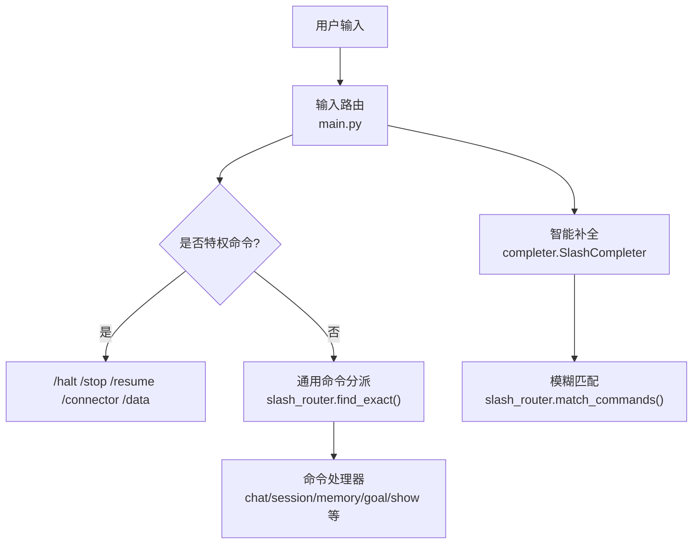
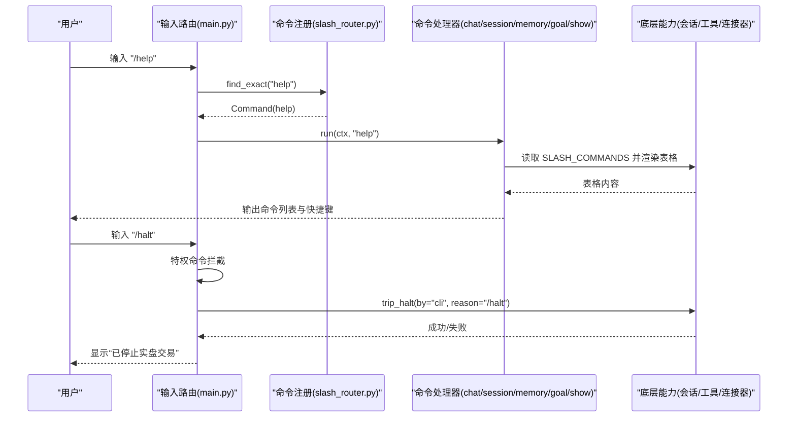
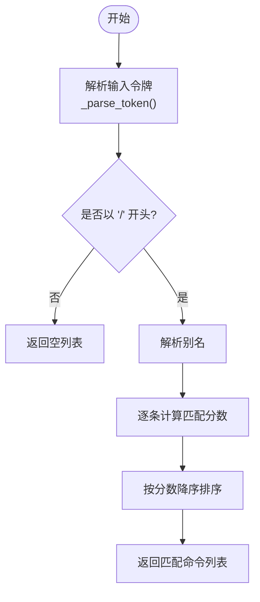
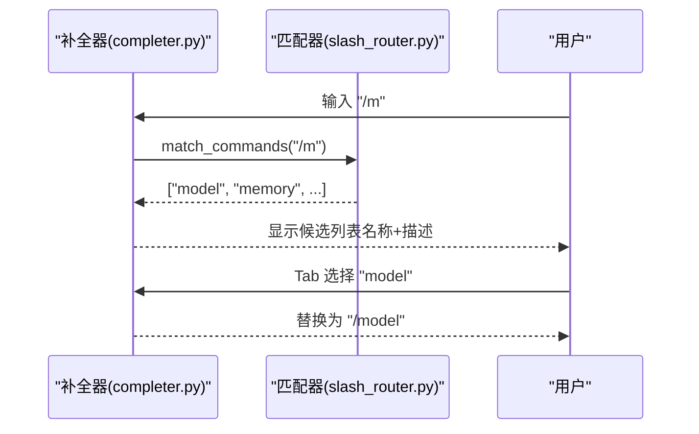
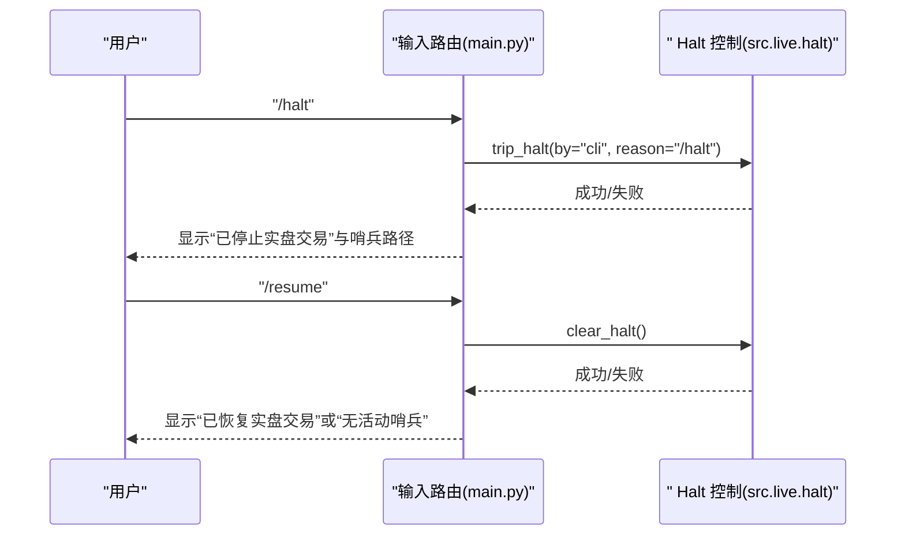
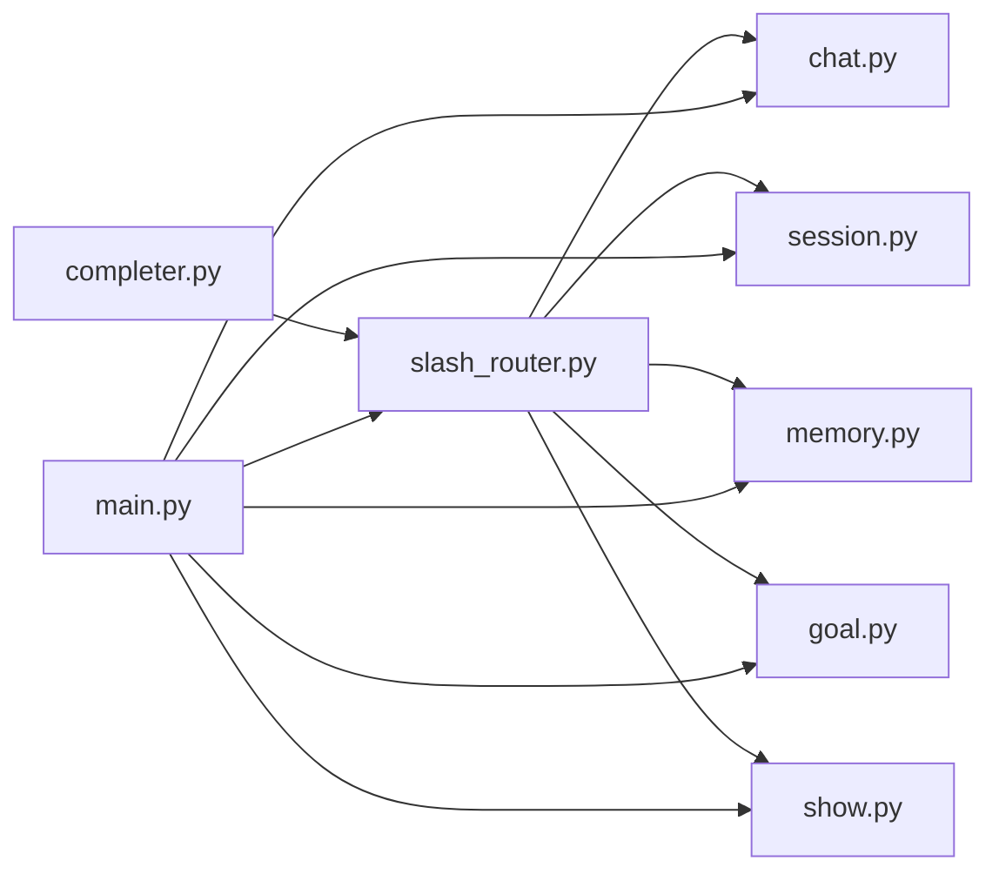

# 斜杠命令

<cite>
**本文引用的文件**
- [slash_router.py](file://agent/cli/commands/slash_router.py)
- [help.py](file://agent/cli/commands/help.py)
- [completer.py](file://agent/cli/completer.py)
- [chat.py](file://agent/cli/commands/chat.py)
- [session.py](file://agent/cli/commands/session.py)
- [memory.py](file://agent/cli/commands/memory.py)
- [goal.py](file://agent/cli/commands/goal.py)
- [show.py](file://agent/cli/commands/show.py)
- [playbooks.py](file://agent/cli/commands/institutional/playbooks.py)
- [main.py](file://agent/cli/main.py)
</cite>

## 目录
1. [简介](#简介)
2. [项目结构](#项目结构)
3. [核心组件](#核心组件)
4. [架构总览](#架构总览)
5. [详细组件分析](#详细组件分析)
6. [依赖关系分析](#依赖关系分析)
7. [性能考虑](#性能考虑)
8. [故障排除指南](#故障排除指南)
9. [结论](#结论)
10. [附录](#附录)

## 简介
本文件系统化说明 Vibe-Trading 的斜杠命令体系，覆盖所有可用命令、参数与返回值、智能补全与模糊匹配、错误提示与建议、执行优先级与安全限制（尤其是交易相关命令）、常用组合与最佳实践、自定义命令扩展方法，以及调试与排错技巧。目标是让不同技术背景的读者都能高效使用并安全地扩展系统。

## 项目结构
斜杠命令由“注册中心 + 命令处理器 + 输入路由 + 补全器”构成：
- 注册中心集中声明命令元数据（名称、描述、处理器模块），并提供模糊匹配与别名解析。
- 各命令处理器实现具体行为（如 /model、/clear、/debug 等）。
- 主入口在交互式循环中识别以“/”开头的输入，优先拦截特权命令（/halt、/resume、/connector、/data），再分派到通用命令处理器。
- 补全器提供类型ahead建议，仅当光标位于首词且未出现空格时触发。

图表来源
- [main.py:1407-1433](file://agent/cli/main.py#L1407-L1433)
- [slash_router.py:159-251](file://agent/cli/commands/slash_router.py#L159-L251)
- [completer.py:47-115](file://agent/cli/completer.py#L47-L115)

章节来源
- [slash_router.py:1-251](file://agent/cli/commands/slash_router.py#L1-L251)
- [completer.py:1-116](file://agent/cli/completer.py#L1-L116)
- [main.py:85-99](file://agent/cli/main.py#L85-L99)
- [main.py:1407-1433](file://agent/cli/main.py#L1407-L1433)

## 核心组件
- 命令注册与匹配
  - 命令元数据：Command(name, description, handler_module)
  - 全局注册表：SLASH_COMMANDS（按使用频率排序）
  - 别名映射：_ALIASES（如 q/exit/:q → quit；? → help；stop → halt）
  - 模糊匹配：match_commands(input_text)，支持前缀/子串/子序列评分
  - 精确查找：find_exact(name)
- 交互入口与特权命令
  - 输入路径识别“/”开头行
  - 特权命令：/halt、/stop、/resume、/connector、/data（不进入模型，直接调用底层能力）
- 命令处理器分组
  - chat：/model、/clear、/journal、/shadow、/swarm、/debug、/quit
  - session：/history、/search、/export
  - memory：/memory（list/show/search/forget）
  - goal：/goal（status/start/evidence/complete/cancel）
  - show：/show、/skill、/pine
  - institutional playbooks：/comps、/dcf、/attrib、/memo、/earnings、/screen（通过注册机制动态加入）
- 帮助与补全
  - /help 展示命令列表与快捷键
  - SlashCompleter 提供类型ahead，仅在首词且无空格时生效

章节来源
- [slash_router.py:22-66](file://agent/cli/commands/slash_router.py#L22-L66)
- [slash_router.py:177-251](file://agent/cli/commands/slash_router.py#L177-L251)
- [help.py:1-65](file://agent/cli/commands/help.py#L1-L65)
- [completer.py:47-115](file://agent/cli/completer.py#L47-L115)
- [main.py:1407-1433](file://agent/cli/main.py#L1407-L1433)

## 架构总览
下图展示了从输入到执行的完整流程，包括特权命令拦截、通用命令分派、处理器调用与结果返回。

图表来源
- [main.py:1407-1433](file://agent/cli/main.py#L1407-L1433)
- [slash_router.py:240-251](file://agent/cli/commands/slash_router.py#L240-L251)
- [help.py:36-61](file://agent/cli/commands/help.py#L36-L61)

## 详细组件分析

### 命令注册与模糊匹配
- 设计要点
  - 命令注册为不可变数据类，避免并发修改导致的不一致
  - 注册顺序即展示顺序，高频命令靠前
  - 别名机制允许更短或习惯性的关键字（如 ? → help）
  - 模糊匹配采用分层评分：前缀 > 子串 > 子序列，保证直观性
- 复杂度
  - match_commands 对注册表线性扫描，时间复杂度 O(N)，N 为命令数
  - 评分函数为常数级字符串操作，整体开销低
- 优化点
  - 可缓存最近匹配结果用于频繁输入场景（例如连续补全）
  - 对极长注册表可引入索引（如前缀树）加速前缀匹配

图表来源
- [slash_router.py:159-237](file://agent/cli/commands/slash_router.py#L159-L237)

章节来源
- [slash_router.py:22-66](file://agent/cli/commands/slash_router.py#L22-L66)
- [slash_router.py:177-237](file://agent/cli/commands/slash_router.py#L177-L237)

### 智能补全与错误提示
- 触发条件
  - 仅当输入以“/”开头且光标位于首词（未出现空格或制表符）时触发
  - 使用 match_commands 获取候选，并以品牌色+灰度描述呈现
- 用户体验
  - 接受补全后自动替换当前词，便于快速切换命令
  - 若无可匹配项，静默退出，不打断自然语言输入
- 错误提示与建议
  - 未知命令会打印“Unknown ... command: /xxx”，并返回非零状态码
  - 可通过 /help 查看完整命令列表与快捷键

图表来源
- [completer.py:47-115](file://agent/cli/completer.py#L47-L115)
- [slash_router.py:206-237](file://agent/cli/commands/slash_router.py#L206-L237)

章节来源
- [completer.py:1-116](file://agent/cli/completer.py#L1-L116)
- [slash_router.py:206-237](file://agent/cli/commands/slash_router.py#L206-L237)

### 命令处理器详解

#### /help
- 功能：展示命令列表与键盘快捷键
- 参数：无
- 返回值：始终返回 0
- 使用场景：首次使用或需要回顾命令时

章节来源
- [help.py:1-65](file://agent/cli/commands/help.py#L1-L65)

#### /model
- 功能：显示当前 LLM 提供商与模型，并提示如何重新运行初始化向导
- 参数：无
- 返回值：0
- 使用场景：切换或确认模型配置

章节来源
- [chat.py:44-68](file://agent/cli/commands/chat.py#L44-L68)

#### /clear
- 功能：清屏并重印欢迎横幅，清空内存中的对话历史
- 参数：无
- 返回值：0
- 使用场景：重置对话上下文

章节来源
- [chat.py:74-97](file://agent/cli/commands/chat.py#L74-L97)

#### /debug
- 功能：切换调试摘要开关（每轮后显示迭代次数、工具调用数、耗时、近似上下文大小）
- 参数：无
- 返回值：0（成功）或 1（失败）
- 使用场景：定位性能问题或工具调用异常

章节来源
- [chat.py:183-212](file://agent/cli/commands/chat.py#L183-L212)

#### /quit
- 功能：请求退出（返回特定退出码，由交互循环处理持久化与告别）
- 参数：无
- 返回值：2（退出信号）

章节来源
- [chat.py:215-221](file://agent/cli/commands/chat.py#L215-L221)

#### /history、/search、/export
- /history：列出最近会话（委托至旧版 cmd_sessions）
- /search <query>：跨会话全文检索，返回命中条目（会话ID、标题、片段）
- /export：占位提示，导出功能在 Web UI 中提供
- 返回值：0（成功）或 1（失败/无参数）

章节来源
- [session.py:25-99](file://agent/cli/commands/session.py#L25-L99)

#### /memory
- 功能：管理持久记忆片段（list/show/search/forget）
- 参数：
  - 无：列出记忆
  - <name>：显示指定记忆
  - search <q>：全文搜索
  - forget <name>：删除指定记忆
- 返回值：0（成功）或 1（失败）

章节来源
- [memory.py:24-67](file://agent/cli/commands/memory.py#L24-L67)

#### /goal
- 功能：管理研究目标（status/start/evidence/complete/cancel）
- 参数：
  - <objective>：启动或替换当前目标
  - status：显示快照
  - evidence <criterion-index-or-id> <note>：添加证据
  - complete [recap]：完成（需满足验证证据要求）
  - cancel [recap]：取消
- 返回值：0（成功）或 1（失败）
- 使用场景：结构化研究流程，跟踪标准与证据

章节来源
- [goal.py:154-393](file://agent/cli/commands/goal.py#L154-L393)

#### /show、/skill、/pine
- /show <run_id>：回放某次运行
- /skill：列出内置与用户技能
- /pine <run_id>：导出回测为 Pine Script
- 返回值：0（成功）或 1（失败/无参数）

章节来源
- [show.py:24-87](file://agent/cli/commands/show.py#L24-L87)

#### 机构工作流命令（/comps、/dcf、/attrib、/memo、/earnings、/screen）
- 通过注册机制动态加入，每个命令携带步骤骨架、示例、工具清单与缺口策略
- 返回值：遵循各自处理器约定（通常 0/1）
- 使用场景：标准化研究与估值流程，确保可复现与可审计

章节来源
- [playbooks.py:34-83](file://agent/cli/commands/institutional/playbooks.py#L34-L83)
- [playbooks.py:104-642](file://agent/cli/commands/institutional/playbooks.py#L104-L642)

### 特权命令与安全限制
- 特权命令：/halt、/stop、/resume、/connector、/data
- 执行优先级：在输入路径被优先拦截，不会进入模型或工具调用
- 权限控制：
  - /halt 与 /stop：立即停止所有实盘交易，记录原因与哨兵路径
  - /resume：清除全局哨兵，重新启用实盘交易
  - /connector：桥接至连接器子命令组（status/start/halt 等）
  - /data：数据路由模式（QVERIS 集成）
- 安全原则：这些操作属于“决策面”，必须由用户显式触发，模型不得代为执行

图表来源
- [main.py:889-933](file://agent/cli/main.py#L889-L933)
- [main.py:1407-1433](file://agent/cli/main.py#L1407-L1433)

章节来源
- [main.py:85-99](file://agent/cli/main.py#L85-L99)
- [main.py:889-933](file://agent/cli/main.py#L889-L933)
- [main.py:1407-1433](file://agent/cli/main.py#L1407-L1433)

## 依赖关系分析
- 耦合与内聚
  - slash_router 作为单一事实源，解耦命令注册与处理器实现
  - completer 依赖 slash_router 进行匹配，保持补全逻辑独立
  - main.py 负责输入路由与特权命令拦截，职责清晰
- 外部依赖
  - Rich 用于终端渲染
  - prompt_toolkit 用于补全
  - src.live.halt 用于实盘交易控制
  - src.session.search 用于会话检索
- 潜在循环依赖
  - 通过延迟导入与只读注册表避免循环（如 help 与 completer 在导入时读取 SLASH_COMMANDS）

图表来源
- [slash_router.py:1-251](file://agent/cli/commands/slash_router.py#L1-L251)
- [completer.py:1-116](file://agent/cli/completer.py#L1-L116)
- [main.py:85-99](file://agent/cli/main.py#L85-L99)

章节来源
- [slash_router.py:1-251](file://agent/cli/commands/slash_router.py#L1-L251)
- [completer.py:1-116](file://agent/cli/completer.py#L1-L116)
- [main.py:85-99](file://agent/cli/main.py#L85-L99)

## 性能考虑
- 补全性能
  - 仅在首词且无空格时触发，减少不必要计算
  - 匹配为线性扫描，适合当前规模；未来可扩展为前缀索引
- 渲染性能
  - /clear 重绘横幅时复用缓存统计，避免重复构建注册表
- 资源占用
  - 延迟导入重型模块（如 _legacy、providers）以降低启动成本
- 建议
  - 对高频命令（/help、/model）可进一步缓存结果
  - 对模糊匹配可引入 Trie 或倒排索引以提升大规模注册表下的性能

[本节为通用指导，无需特定文件来源]

## 故障排除指南
- 常见错误
  - 未知命令：打印“Unknown ... command: /xxx”，检查拼写或使用 /help
  - 缺少参数：如 /search、/show、/pine 需要参数，否则返回 1 并提示用法
  - 特权命令失败：/halt 或 /resume 失败时打印错误信息，检查底层服务状态
- 调试技巧
  - 使用 /debug 切换调试摘要，观察迭代、工具调用与耗时
  - 使用 /history 与 /search 回溯会话内容与命中
  - 使用 /memory search 检索关键记忆片段
- 排错步骤
  - 确认命令是否存在于 /help 列表
  - 检查参数是否正确（参考各命令的使用说明）
  - 对于特权命令，确认当前环境是否允许（如连接器状态）

章节来源
- [chat.py:237-244](file://agent/cli/commands/chat.py#L237-L244)
- [session.py:38-67](file://agent/cli/commands/session.py#L38-L67)
- [show.py:24-66](file://agent/cli/commands/show.py#L24-L66)
- [main.py:889-933](file://agent/cli/main.py#L889-L933)

## 结论
Vibe-Trading 的斜杠命令系统通过清晰的注册中心、严格的输入路由与安全的特权命令控制，提供了易用且可靠的交互体验。模糊匹配与智能补全提升了效率，而 /help 与错误提示降低了学习成本。对于交易相关命令，系统采用显式授权与隔离执行，确保安全性。建议在生产环境中结合 /debug、/history、/search 与 /memory 进行持续监控与排错，并遵循最佳实践进行命令组合与扩展。

[本节为总结，无需特定文件来源]

## 附录

### 常用命令组合与最佳实践
- 快速开始
  - /help：查看命令与快捷键
  - /model：确认或切换模型
  - /clear：重置对话
- 研究与分析
  - /goal start <objective>：启动研究目标
  - /goal evidence <id> <note>：添加证据
  - /goal complete：在完成审计后关闭目标
- 会话管理
  - /history：查看最近会话
  - /search <query>：全文检索
  - /export：通过 Web UI 导出
- 调试与诊断
  - /debug：切换调试摘要
  - /memory search <q>：检索记忆
- 交易控制（特权）
  - /halt：立即停止实盘交易
  - /resume：清除哨兵，恢复交易
  - /connector status：查看连接器状态

[本节为概念性内容，无需特定文件来源]

### 自定义命令开发方法与扩展机制
- 注册新命令
  - 在 SLASH_COMMANDS 中添加 Command(name, description, handler_module)
  - 如需别名，更新 _ALIASES
  - 实现处理器模块，暴露 run(ctx, *args) -> int
- 动态注册
  - 可使用类似 _register_institutional_slash_commands 的模式，在导入时追加命令
  - 确保幂等性与不覆盖已有名称
- 最佳实践
  - 保持处理器轻量，复杂逻辑下沉至工具或服务
  - 使用 Rich 进行友好输出，遵循错误处理与返回值约定
  - 对特权命令严格隔离，避免进入模型或工具调用

章节来源
- [slash_router.py:69-156](file://agent/cli/commands/slash_router.py#L69-L156)
- [playbooks.py:34-83](file://agent/cli/commands/institutional/playbooks.py#L34-L83)