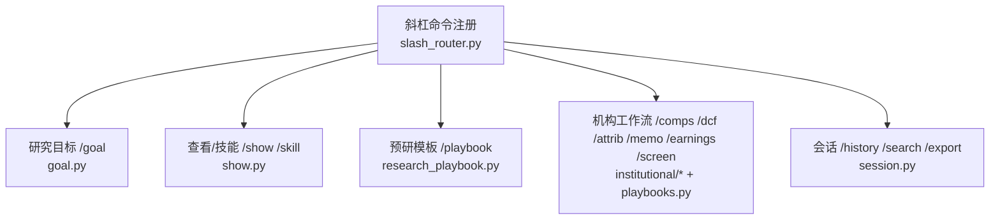
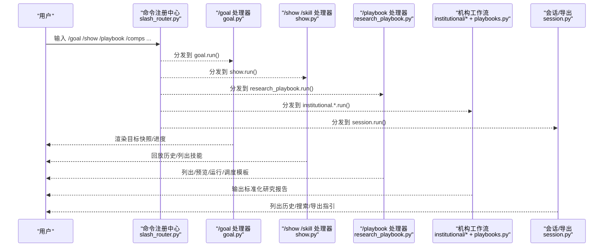
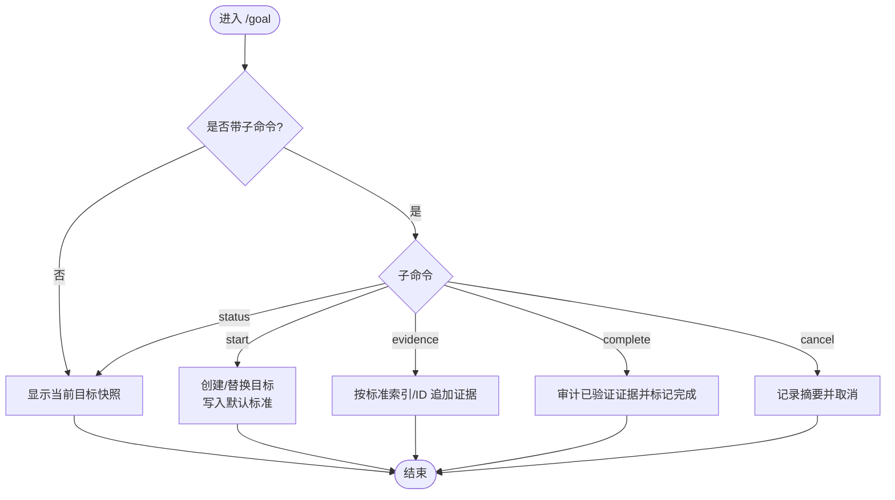
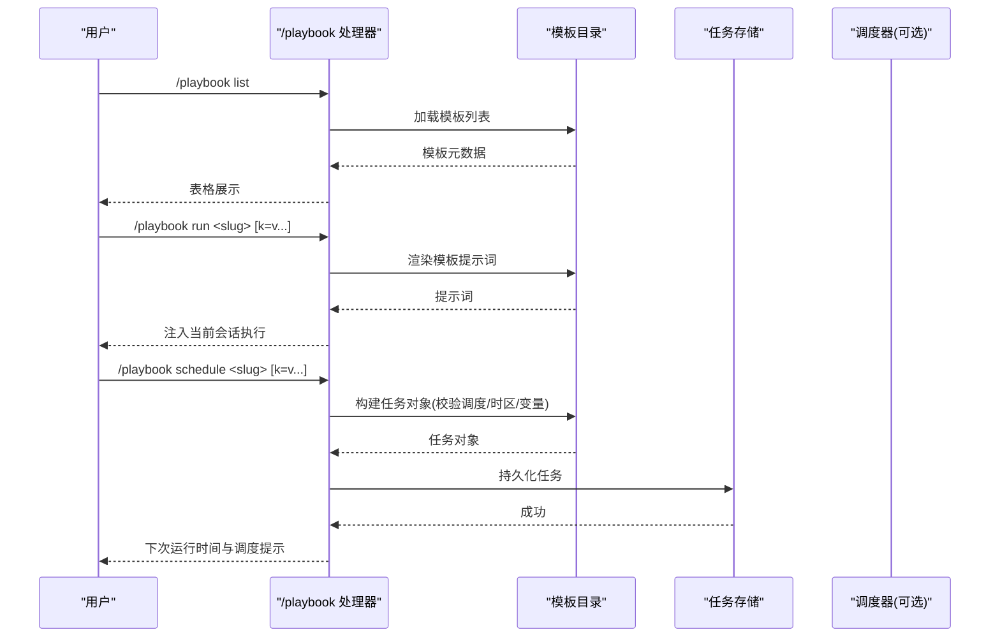
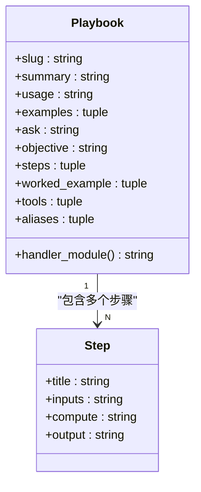
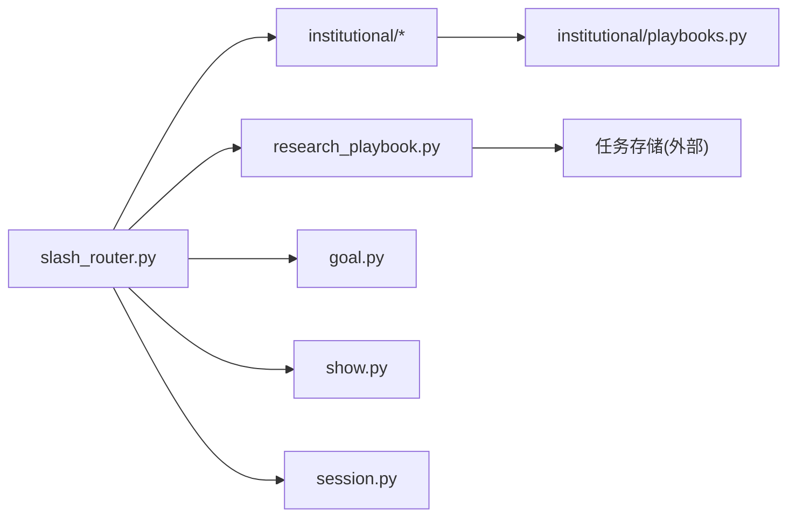

# 研究命令

<cite>
**本文引用的文件**
- [slash_router.py](file://agent/cli/commands/slash_router.py)
- [goal.py](file://agent/cli/commands/goal.py)
- [show.py](file://agent/cli/commands/show.py)
- [research_playbook.py](file://agent/cli/commands/research_playbook.py)
- [playbooks.py](file://agent/cli/commands/institutional/playbooks.py)
- [comps.py](file://agent/cli/commands/institutional/comps.py)
- [dcf.py](file://agent/cli/commands/institutional/dcf.py)
- [screen.py](file://agent/cli/commands/institutional/screen.py)
- [session.py](file://agent/cli/commands/session.py)
</cite>

## 目录
1. [简介](#简介)
2. [项目结构](#项目结构)
3. [核心组件](#核心组件)
4. [架构总览](#架构总览)
5. [详细组件分析](#详细组件分析)
6. [依赖关系分析](#依赖关系分析)
7. [性能注意事项](#性能注意事项)
8. [故障排查指南](#故障排查指南)
9. [结论](#结论)
10. [附录](#附录)

## 简介
本文件系统化梳理 Vibe-Trading 中与“研究”相关的斜杠命令，覆盖目标管理、历史结果查看、预研模板（Playbook）管理与调度、技能（Skill）管理，以及机构级研究工作流命令（可比公司分析、DCF、归因、备忘录、财报审阅、筛选器）。文档同时给出组合使用示例、工作流指导与结果导出分析方法，帮助研究者高效完成从“提出目标—执行研究—归档复用—定期复跑”的闭环。

## 项目结构
研究相关命令通过统一的斜杠命令注册中心进行分发，核心入口包括：
- 命令注册与模糊匹配：集中定义用户可见的命令清单、别名与匹配逻辑
- 研究目标管理：启动、查看、补充证据、完成或取消当前研究目标
- 历史结果查看与技能管理：按 ID 回放运行结果、列出/加载/卸载技能
- 预研模板（Playbook）：列出、预览、立即运行或按周期调度
- 机构研究工作流：标准化的可重复研究流程卡片（含步骤、工具、数值示例）
- 会话与导出：历史会话浏览、全文检索、导出说明

图表来源
- [slash_router.py:39-156](file://agent/cli/commands/slash_router.py#L39-L156)

章节来源
- [slash_router.py:39-156](file://agent/cli/commands/slash_router.py#L39-L156)

## 核心组件
- 斜杠命令注册中心：维护命令元数据、别名、模糊匹配与精确查找，确保帮助菜单、类型提示与路由一致
- 研究目标（/goal）：以“目标+标准+证据”的结构化方式推进研究，支持状态查看、手动证据追加、审计后完成或取消
- 历史与技能（/show、/skill）：按运行 ID 回放历史结果；列出并管理内置与用户技能
- 预研模板（/playbook）：统一入口，支持列出模板、预览完整提示词、在当前会话运行、或持久化为定时任务
- 机构工作流：将复杂研究拆解为标准化步骤，绑定推荐工具与缺失数据处理策略，保证可复现与可审计
- 会话与导出：提供会话历史、全文检索与导出指引

章节来源
- [slash_router.py:39-156](file://agent/cli/commands/slash_router.py#L39-L156)
- [goal.py:154-393](file://agent/cli/commands/goal.py#L154-L393)
- [show.py:24-83](file://agent/cli/commands/show.py#L24-L83)
- [research_playbook.py:365-449](file://agent/cli/commands/research_playbook.py#L365-L449)
- [playbooks.py:104-642](file://agent/cli/commands/institutional/playbooks.py#L104-L642)
- [session.py:25-95](file://agent/cli/commands/session.py#L25-L95)

## 架构总览
研究命令的执行路径遵循“注册—解析—分发—处理—渲染/持久化”的统一模式。机构工作流进一步将“步骤骨架—工具绑定—数值示例—缺失数据策略”固化为可复用的 Playbook。

图表来源
- [slash_router.py:39-156](file://agent/cli/commands/slash_router.py#L39-L156)
- [goal.py:374-393](file://agent/cli/commands/goal.py#L374-L393)
- [show.py:76-83](file://agent/cli/commands/show.py#L76-L83)
- [research_playbook.py:365-449](file://agent/cli/commands/research_playbook.py#L365-L449)
- [playbooks.py:104-642](file://agent/cli/commands/institutional/playbooks.py#L104-L642)
- [session.py:88-95](file://agent/cli/commands/session.py#L88-L95)

## 详细组件分析

### /goal：研究与目标管理
- 功能要点
  - 启动或替换当前研究目标：自动创建会话上下文，写入默认评估标准与协议
  - 查看当前目标快照：展示目标、状态、证据数量、标准覆盖度与下一步建议
  - 追加人工证据：按序号或 ID 定位标准，附加证据文本
  - 审计完成后标记完成：要求每个标准均有已验证的证据
  - 取消目标：记录摘要并结束
- 交互流程

图表来源
- [goal.py:154-393](file://agent/cli/commands/goal.py#L154-L393)

章节来源
- [goal.py:154-393](file://agent/cli/commands/goal.py#L154-L393)

### /show：按 ID 回放历史运行
- 功能要点
  - 通过运行 ID 回放之前的研究或回测结果
  - 错误时返回友好提示
- 使用建议
  - 结合 /goal 的目标 ID 或研究产物的 run_id 进行回溯
  - 配合 /search 快速定位历史会话

章节来源
- [show.py:24-37](file://agent/cli/commands/show.py#L24-L37)

### /skill：列出、加载与卸载技能
- 功能要点
  - 列出内置与用户技能
  - 通过底层能力实现加载/卸载（由遗留模块承载）
- 使用建议
  - 在需要扩展研究能力时先列出可用技能，按需加载

章节来源
- [show.py:40-50](file://agent/cli/commands/show.py#L40-L50)

### /playbook：预研模板管理（列出/运行/调度）
- 功能要点
  - 列出所有可用的预研模板（包含建议频率、市场范围、产出描述）
  - 预览模板完整提示词（支持变量替换）
  - 在当前会话立即运行（生成 prompt 并注入执行）
  - 将模板持久化为定时任务（支持覆盖调度与时间区，校验规则由调度器负责）
- 参数与变量
  - 支持 key=value 形式的变量传递，限制最大变量数与参数长度
  - 支持 --var 选项用于命令行场景
- 调度与存储
  - 直接写入共享存储，API 服务器读取并触发
  - 若调度器未启用，会提示如何开启

图表来源
- [research_playbook.py:81-128](file://agent/cli/commands/research_playbook.py#L81-L128)
- [research_playbook.py:136-201](file://agent/cli/commands/research_playbook.py#L136-L201)
- [research_playbook.py:203-231](file://agent/cli/commands/research_playbook.py#L203-L231)
- [research_playbook.py:365-449](file://agent/cli/commands/research_playbook.py#L365-L449)

章节来源
- [research_playbook.py:365-449](file://agent/cli/commands/research_playbook.py#L365-L449)

### 机构研究工作流命令
以下命令均为“薄包装”，实际执行骨架、工具绑定、数值示例与缺失数据策略集中在 Playbook 定义中，并由统一 runner 分发执行。

- /comps：可比公司分析
  - 目的：构建可比公司倍数表，计算主体相对中位数的溢价/折价，推导价值区间
  - 关键步骤：确定可比公司集合、拉取财务与市场数据、标准化倍数、定位主体、推导价值区间
  - 推荐工具：股票画像、财务报表、市场数据、市场筛选
- /dcf：贴现现金流估值
  - 目的：无杠杆 DCF，每股价值、终值占比、退出倍数交叉检验、WACC×g 敏感性网格
  - 关键步骤：锚定基年、设定驱动、折现率、终值双方法、桥接每股价值、敏感性分析
  - 推荐工具：财务报表、SEC 文件、宏观序列、股票画像
- /attrib：Brinson-Fachler 归因
  - 目的：将超额收益分解为配置、选择与交互效应，重算至活跃收益并解释残差
  - 关键步骤：权重固定、获取收益、分解、重算门控、解释残差、指令符合性判断
  - 推荐工具：市场数据、风险穿透、板块信息、股票画像
- /memo：投资备忘录
  - 目的：决策就绪的备忘录：论点、差异观点、情景概率、证伪条件、季度监控集
  - 关键步骤：论点与差异、业务与单位经济、数字、双锚估值、致命风险、监控集
  - 推荐工具：财务报表、SEC 文件、股票画像、研报、新闻
- /earnings：财报审阅
  - 目的：将头条超预期拆分为逐行桥，区分经常性与非经常性，更新模型假设
  - 关键步骤：拉取打印、构建桥、质量评级、指引差、模型变更
  - 推荐工具：财务报表、SEC 文件、新闻、研报、市场数据
- /screen：系统筛选器
  - 目的：将假设转化为硬阈值，运行漏斗，去重后交付研究队列
  - 关键步骤：声明假设、转硬阈值、运行漏斗、数据完整性检查、按驱动去重、交付队列
  - 推荐工具：市场筛选、财务报表、股票画像、搜索

图表来源
- [playbooks.py:34-83](file://agent/cli/commands/institutional/playbooks.py#L34-L83)

章节来源
- [playbooks.py:104-642](file://agent/cli/commands/institutional/playbooks.py#L104-L642)
- [comps.py:17-27](file://agent/cli/commands/institutional/comps.py#L17-L27)
- [dcf.py:17-27](file://agent/cli/commands/institutional/dcf.py#L17-L27)
- [screen.py:16-26](file://agent/cli/commands/institutional/screen.py#L16-L26)

### 会话与导出
- /history：列出最近会话
- /search：跨会话全文检索，返回命中片段
- /export：当前 CLI 中为占位符，富导出通过 Web UI 完成

章节来源
- [session.py:25-95](file://agent/cli/commands/session.py#L25-L95)

## 依赖关系分析
- 命令注册与分发
  - 注册中心集中维护命令元数据与别名，并在导入时动态追加机构工作流与预研模板命令
  - 模糊匹配与精确查找保障类型提示与路由一致性
- 机构工作流解耦
  - 具体命令仅做薄包装，真实逻辑集中在 Playbook 定义与统一 runner
  - 缺失数据策略与数值示例随模板携带，避免分散实现
- 预研模板与调度
  - 模板渲染与变量替换独立于调度器；调度器负责语法与时区校验
  - 本地 CLI 直接写入共享存储，API 服务器读取并触发执行

图表来源
- [slash_router.py:69-156](file://agent/cli/commands/slash_router.py#L69-L156)
- [research_playbook.py:136-201](file://agent/cli/commands/research_playbook.py#L136-L201)
- [playbooks.py:104-642](file://agent/cli/commands/institutional/playbooks.py#L104-L642)

章节来源
- [slash_router.py:69-156](file://agent/cli/commands/slash_router.py#L69-L156)
- [research_playbook.py:136-201](file://agent/cli/commands/research_playbook.py#L136-L201)
- [playbooks.py:104-642](file://agent/cli/commands/institutional/playbooks.py#L104-L642)

## 性能注意事项
- 命令注册与匹配
  - 注册表在导入时一次性构建，运行时只做轻量匹配与查找
- 预研模板
  - 变量与参数有上限保护，避免异常输入导致过大渲染
  - 模板渲染与调度校验分离，减少不必要的开销
- 机构工作流
  - 步骤顺序与工具调用建议明确，便于后续并行化与缓存优化
- 会话与搜索
  - 全文检索基于共享索引，注意索引更新与查询负载

[本节为通用性能建议，不直接分析具体文件]

## 故障排查指南
- /goal
  - 无当前目标：提示先启动目标
  - 证据为空或无法定位标准：检查标准索引/ID 与参数格式
  - 完成失败：确认每个标准均附有已验证证据
- /show
  - 参数缺失或 ID 无效：检查传入的运行 ID
- /playbook
  - 模板不存在或渲染失败：检查 slug 与变量键名
  - 调度失败：检查调度语法与时区设置，确认调度器是否启用
- /comps /dcf /attrib /memo /earnings /screen
  - 工具调用失败或缺失数据：遵循模板中的缺失数据策略，明确标注缺失项并继续分析
- /history /search /export
  - 搜索无结果：调整查询关键词
  - 导出不可用：通过 Web UI 完成富导出

章节来源
- [goal.py:154-393](file://agent/cli/commands/goal.py#L154-L393)
- [show.py:24-83](file://agent/cli/commands/show.py#L24-L83)
- [research_playbook.py:365-449](file://agent/cli/commands/research_playbook.py#L365-L449)
- [session.py:25-95](file://agent/cli/commands/session.py#L25-L95)

## 结论
Vibe-Trading 的研究命令体系以“注册中心 + 标准化 Playbook + 目标管理”为核心，既支持交互式快速研究，也支持批量与定时复跑。通过结构化目标、可审计的步骤与明确的工具绑定，研究者可以在个人与团队层面建立一致、可追溯、可复用的研究工作流。

[本节为总结性内容，不直接分析具体文件]

## 附录

### 常用命令速查
- /goal
  - 启动：/goal <研究目标>
  - 查看：/goal status
  - 追加证据：/goal evidence <标准序号或ID> <备注>
  - 完成：/goal complete [摘要]
  - 取消：/goal cancel [摘要]
- /show
  - 回放：/show <运行ID>
- /skill
  - 列出/加载/卸载技能：/skill
- /playbook
  - 列出：/playbook list
  - 预览：/playbook <slug>
  - 立即运行：/playbook run <slug> [k=v ...]
  - 定时调度：/playbook schedule <slug> [k=v ...]
- 机构工作流
  - /comps <ticker> [peer ...] [--asof YYYY-MM-DD]
  - /dcf <ticker> [horizon=5] [wacc=9%] [g=2.5%]
  - /attrib <组合或持仓> [--benchmark SPY] [--from YYYY-MM-DD] [--to YYYY-MM-DD]
  - /memo <ticker> [long|short] [horizon=12m]
  - /earnings <ticker> [quarter=Q3-2026]
  - /screen <假设或条件> [--universe sp500|csi300|...]
- 会话与导出
  - /history：列出最近会话
  - /search <查询>：全文检索
  - /export：通过 Web UI 导出 md/json

[本节为操作参考，不直接分析具体文件]