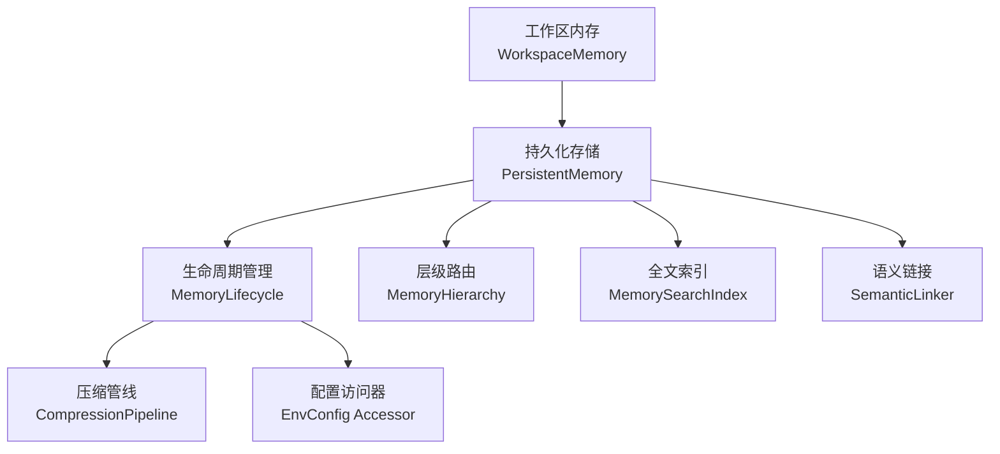
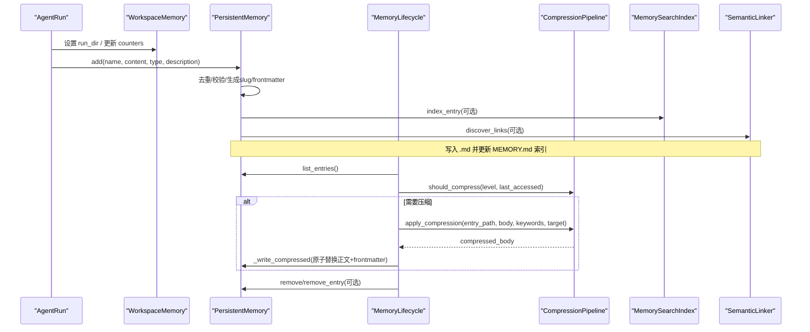
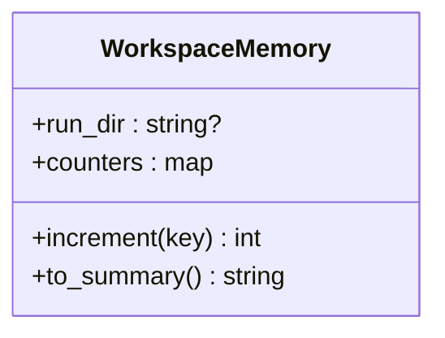
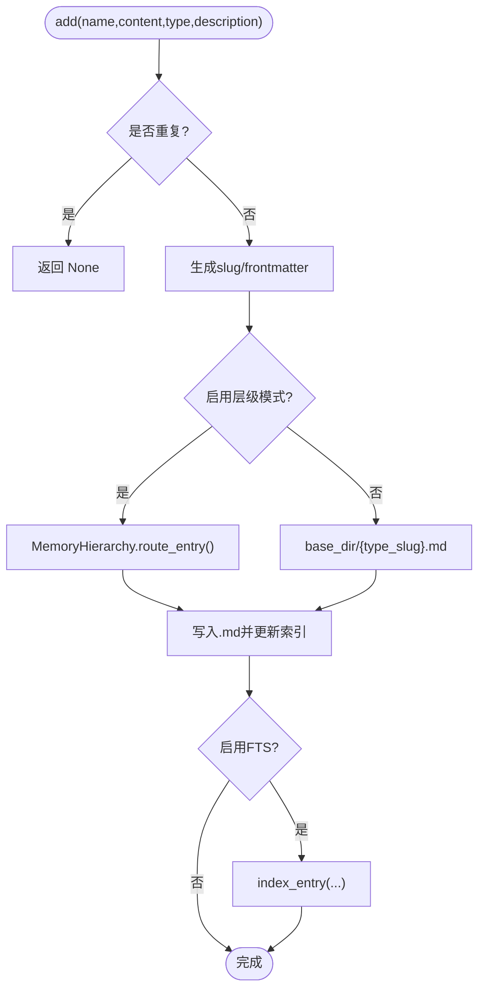
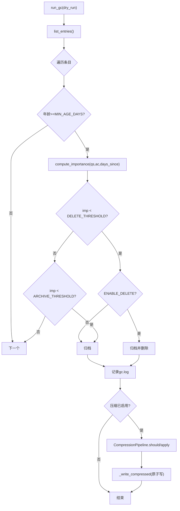
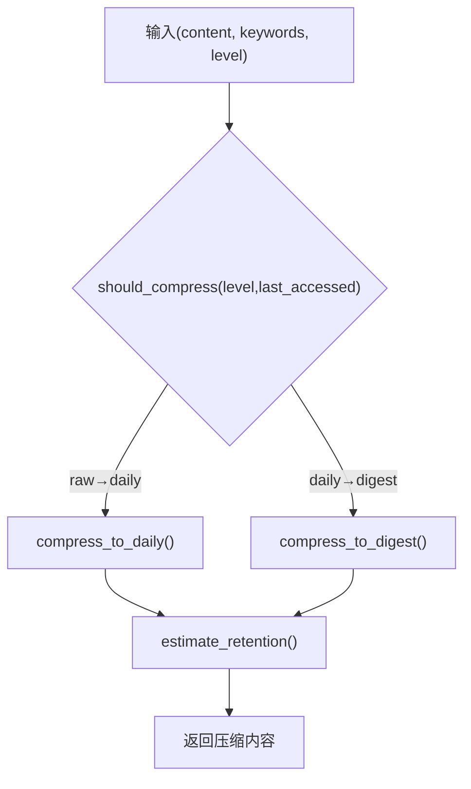
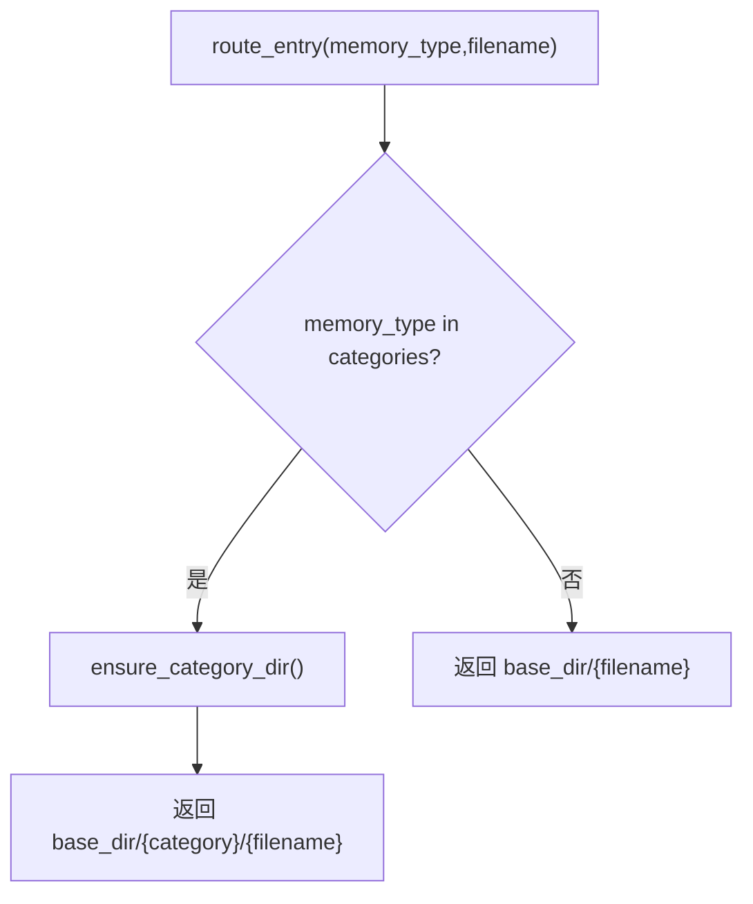
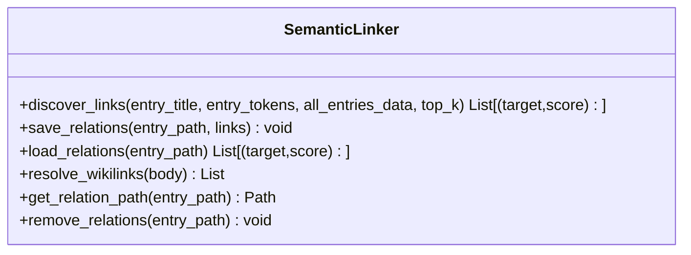
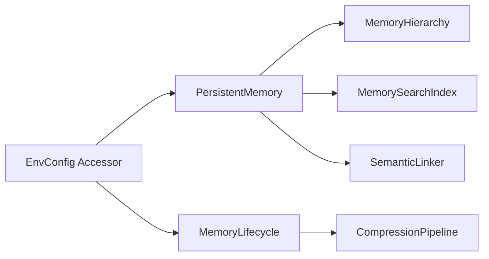

# 上下文管理

<cite>
**本文引用的文件**
- [agent/src/agent/memory.py](file://agent/src/agent/memory.py)
- [agent/src/memory/persistent.py](file://agent/src/memory/persistent.py)
- [agent/src/memory/lifecycle.py](file://agent/src/memory/lifecycle.py)
- [agent/src/memory/compression.py](file://agent/src/memory/compression.py)
- [agent/src/memory/hierarchy.py](file://agent/src/memory/hierarchy.py)
- [agent/src/memory/search_index.py](file://agent/src/memory/search_index.py)
- [agent/src/memory/semantic_links.py](file://agent/src/memory/semantic_links.py)
- [agent/src/config/accessor.py](file://agent/src/config/accessor.py)
- [agent/tests/test_memory_lifecycle.py](file://agent/tests/test_memory_lifecycle.py)
- [agent/tests/test_persistent_memory.py](file://agent/tests/test_persistent_memory.py)
</cite>

## 目录
1. [简介](#简介)
2. [项目结构](#项目结构)
3. [核心组件](#核心组件)
4. [架构总览](#架构总览)
5. [详细组件分析](#详细组件分析)
6. [依赖关系分析](#依赖关系分析)
7. [性能考量](#性能考量)
8. [故障排查指南](#故障排查指南)
9. [结论](#结论)
10. [附录](#附录)

## 简介
本文件系统性阐述 Vibe-Trading 的上下文管理系统，重点覆盖：
- 工作区内存（WorkspaceMemory）的设计与实现：运行目录、工具调用计数、状态摘要生成。
- 短期记忆与长期记忆的区分与协作：会话内状态 vs 跨会话持久化。
- 上下文压缩策略：如何在保留关键信息的前提下降低上下文体积。
- 语义链接系统：实体关系建模与知识图谱构建。
- 最佳实践：内存优化、垃圾回收、资源清理。
- 企业级部署：上下文隔离与多租户支持方案。

## 项目结构
上下文管理相关代码集中在 agent/src/memory 与 agent/src/agent 中，辅以配置访问器与测试用例：
- 工作区内存：agent/src/agent/memory.py
- 持久化存储与检索：agent/src/memory/persistent.py
- 生命周期管理（质量评分、衰减、GC、压缩触发）：agent/src/memory/lifecycle.py
- 三级压缩管线（raw/daily/digest）：agent/src/memory/compression.py
- 层级目录路由与索引：agent/src/memory/hierarchy.py
- 全文检索（SQLite FTS5）：agent/src/memory/search_index.py
- 语义链接（BM25 相似度 + 侧车文件）：agent/src/memory/semantic_links.py
- 配置开关与环境变量解析：agent/src/config/accessor.py
- 行为验证与回归测试：agent/tests/test_memory_lifecycle.py、agent/tests/test_persistent_memory.py



**图表来源**
- [agent/src/agent/memory.py:1-53](file://agent/src/agent/memory.py#L1-L53)
- [agent/src/memory/persistent.py:200-654](file://agent/src/memory/persistent.py#L200-L654)
- [agent/src/memory/lifecycle.py:71-421](file://agent/src/memory/lifecycle.py#L71-L421)
- [agent/src/memory/compression.py:163-355](file://agent/src/memory/compression.py#L163-L355)
- [agent/src/memory/hierarchy.py:34-436](file://agent/src/memory/hierarchy.py#L34-L436)
- [agent/src/memory/search_index.py:113-481](file://agent/src/memory/search_index.py#L113-L481)
- [agent/src/memory/semantic_links.py:158-372](file://agent/src/memory/semantic_links.py#L158-L372)
- [agent/src/config/accessor.py:52-76](file://agent/src/config/accessor.py#L52-L76)

**章节来源**
- [agent/src/agent/memory.py:1-53](file://agent/src/agent/memory.py#L1-L53)
- [agent/src/memory/persistent.py:200-654](file://agent/src/memory/persistent.py#L200-L654)
- [agent/src/memory/lifecycle.py:71-421](file://agent/src/memory/lifecycle.py#L71-L421)
- [agent/src/memory/compression.py:163-355](file://agent/src/memory/compression.py#L163-L355)
- [agent/src/memory/hierarchy.py:34-436](file://agent/src/memory/hierarchy.py#L34-L436)
- [agent/src/memory/search_index.py:113-481](file://agent/src/memory/search_index.py#L113-L481)
- [agent/src/memory/semantic_links.py:158-372](file://agent/src/memory/semantic_links.py#L158-L372)
- [agent/src/config/accessor.py:52-76](file://agent/src/config/accessor.py#L52-L76)

## 核心组件
- 工作区内存（WorkspaceMemory）：单次 AgentLoop.run() 内的共享运行时状态，包含当前运行目录与工具调用计数器，并提供可被压缩后仍保留的状态摘要。
- 持久化存储（PersistentMemory）：基于文件的跨会话记忆，维护条目元数据、索引、去重、搜索与删除等能力。
- 生命周期管理（MemoryLifecycle）：质量评分、重要性衰减、垃圾回收（归档/删除）、压缩触发与写入。
- 压缩管线（CompressionPipeline）：三级压缩（raw→daily→digest），使用 TF-IDF 句子打分与关键词提取，并在压缩前备份原文。
- 层级路由（MemoryHierarchy）：按 memory_type 将条目路由到 category 子目录，提供扫描、重建索引与迁移能力。
- 全文索引（MemorySearchIndex）：SQLite FTS5 倒排索引，支持 O(log n) 检索与自动重建，含 CJK bigram 处理。
- 语义链接（SemanticLinker）：基于 BM25 的相似度发现，保存 .relations.json 侧车文件，并支持 wiki-link 解析。

**章节来源**
- [agent/src/agent/memory.py:13-53](file://agent/src/agent/memory.py#L13-L53)
- [agent/src/memory/persistent.py:126-654](file://agent/src/memory/persistent.py#L126-L654)
- [agent/src/memory/lifecycle.py:71-421](file://agent/src/memory/lifecycle.py#L71-L421)
- [agent/src/memory/compression.py:163-355](file://agent/src/memory/compression.py#L163-L355)
- [agent/src/memory/hierarchy.py:34-436](file://agent/src/memory/hierarchy.py#L34-L436)
- [agent/src/memory/search_index.py:113-481](file://agent/src/memory/search_index.py#L113-L481)
- [agent/src/memory/semantic_links.py:158-372](file://agent/src/memory/semantic_links.py#L158-L372)

## 架构总览
下图展示从“会话内工作区”到“跨会话持久化”，再到“检索与链接”的整体流程。



**图表来源**
- [agent/src/agent/memory.py:13-53](file://agent/src/agent/memory.py#L13-L53)
- [agent/src/memory/persistent.py:479-595](file://agent/src/memory/persistent.py#L479-L595)
- [agent/src/memory/lifecycle.py:183-273](file://agent/src/memory/lifecycle.py#L183-L273)
- [agent/src/memory/compression.py:163-355](file://agent/src/memory/compression.py#L163-L355)
- [agent/src/memory/search_index.py:207-250](file://agent/src/memory/search_index.py#L207-L250)
- [agent/src/memory/semantic_links.py:179-230](file://agent/src/memory/semantic_links.py#L179-L230)

## 详细组件分析

### 工作区内存（WorkspaceMemory）
- 职责：在单次 AgentLoop 运行期间维护共享状态，包括当前运行目录与工具调用计数器。
- 设计要点：
  - 轻量数据结构，仅进程内有效，不跨会话持久化。
  - 提供 to_summary() 生成 LLM 可读的状态摘要，便于上下文压缩后仍能恢复上下文。
- 典型用法：工具间共享 run_dir；通过 increment(key) 统计工具调用次数；在提示词或日志中注入摘要。



**图表来源**
- [agent/src/agent/memory.py:13-53](file://agent/src/agent/memory.py#L13-L53)

**章节来源**
- [agent/src/agent/memory.py:13-53](file://agent/src/agent/memory.py#L13-L53)

### 持久化存储（PersistentMemory）
- 职责：跨会话的文件型记忆存储，负责条目增删改查、索引维护、去重、搜索、以及与其他子系统（FTS、语义链接）集成。
- 关键机制：
  - 条目模型 MemoryEntry：包含标题、描述、类型、正文、时间戳、关键词、质量分、访问次数、重要性、关联条目、分类、压缩级别等。
  - 去重：滑动窗口哈希去重，避免重试或并行导致的重复写入。
  - 搜索：优先走 FTS5 索引，失败回退到 token 扫描；结果按重要性加权排序。
  - 索引：MEMORY.md 作为轻量索引；层级模式下由 MemoryHierarchy 组织目录。
  - 安全：写操作使用文件锁 memory_lock 保护。



**图表来源**
- [agent/src/memory/persistent.py:479-595](file://agent/src/memory/persistent.py#L479-L595)
- [agent/src/memory/hierarchy.py:70-90](file://agent/src/memory/hierarchy.py#L70-L90)

**章节来源**
- [agent/src/memory/persistent.py:126-654](file://agent/src/memory/persistent.py#L126-L654)
- [agent/src/memory/hierarchy.py:70-90](file://agent/src/memory/hierarchy.py#L70-L90)

### 生命周期管理（MemoryLifecycle）
- 职责：质量评分、访问追踪、重要性衰减、垃圾回收（归档/删除）、压缩触发与写入。
- 关键点：
  - 质量强化：根据事件（任务成功/失败、用户确认/拒绝、被动衰减）调整 quality_score，带会话上限防止抖动。
  - 重要性计算：结合质量分、访问次数与最近访问时间，采用类艾宾浩斯衰减公式。
  - GC 阈值：低于归档阈值则归档，低于删除阈值且允许删除时删除；默认 Tier 1 仅归档。
  - 压缩联动：GC 非 dry_run 时，若开启压缩，则对老化条目执行压缩并原子写回 frontmatter。



**图表来源**
- [agent/src/memory/lifecycle.py:183-273](file://agent/src/memory/lifecycle.py#L183-L273)
- [agent/src/memory/lifecycle.py:352-407](file://agent/src/memory/lifecycle.py#L352-L407)
- [agent/src/memory/persistent.py:80-91](file://agent/src/memory/persistent.py#L80-L91)

**章节来源**
- [agent/src/memory/lifecycle.py:71-421](file://agent/src/memory/lifecycle.py#L71-L421)
- [agent/src/memory/persistent.py:80-91](file://agent/src/memory/persistent.py#L80-L91)

### 上下文压缩（CompressionPipeline）
- 目标：在不丢失关键信息的前提下减少上下文大小，支持 raw→daily→digest 三级压缩。
- 策略：
  - daily：TF-IDF 句子打分，保留首尾句与 top-k 关键句，附加关键词头。
  - digest：提取 top-N 重要术语，输出要点式摘要。
  - 原内容归档：压缩前原子复制到 archive/ 目录，失败则中止以避免数据丢失。
  - 保留率估计：Jaccard 词重叠评估压缩前后信息保留度。
- 触发：由 MemoryLifecycle 在 GC 周期中根据 last_accessed 与阈值决定是否压缩。



**图表来源**
- [agent/src/memory/compression.py:163-355](file://agent/src/memory/compression.py#L163-L355)

**章节来源**
- [agent/src/memory/compression.py:163-355](file://agent/src/memory/compression.py#L163-L355)

### 层级目录与索引（MemoryHierarchy）
- 目标：将记忆条目按 memory_type 路由至 category 子目录，实现 O(category_size) 范围搜索。
- 功能：
  - route_entry：未知类型回退到根目录。
  - scan_all / scan_category：扫描 .md 文件，跳过特定名称与 archive/。
  - rebuild_index：生成 .hierarchy.yaml 索引，包含类别统计与关键词。
  - prune_search_scope：基于关键词重叠对类别进行优先级排序。
  - migrate_flat_entry：将扁平存储条目迁移到对应类别目录。



**图表来源**
- [agent/src/memory/hierarchy.py:70-90](file://agent/src/memory/hierarchy.py#L70-L90)

**章节来源**
- [agent/src/memory/hierarchy.py:34-436](file://agent/src/memory/hierarchy.py#L34-L436)

### 全文检索（MemorySearchIndex）
- 目标：提供 O(log n) 的全文检索，替代 O(n) 扫描。
- 特性：
  - SQLite FTS5 虚拟表，WAL 模式提升并发性能。
  - CJK 文本处理：单字+二元组展开，查询时生成 safe MATCH 表达式。
  - 自动重建：首次空搜索时根据磁盘条目重建索引。
  - 线程安全：操作加锁，进程级单例。

```mermaid
sequenceDiagram
participant PM as "PersistentMemory"
participant SI as "MemorySearchIndex"
PM->>SI : search(query, max_results)
alt FTS可用
SI-->>PM : MemoryMatch[] (rank排序)
else 不可用
SI-->>PM : []
PM回退token扫描
end
```

**图表来源**
- [agent/src/memory/search_index.py:252-302](file://agent/src/memory/search_index.py#L252-L302)
- [agent/src/memory/persistent.py:362-455](file://agent/src/memory/persistent.py#L362-L455)

**章节来源**
- [agent/src/memory/search_index.py:113-481](file://agent/src/memory/search_index.py#L113-L481)
- [agent/src/memory/persistent.py:362-455](file://agent/src/memory/persistent.py#L362-L455)

### 语义链接（SemanticLinker）
- 目标：基于 BM25 相似度自动发现记忆间的关联，并以 .relations.json 侧车文件持久化。
- 特性：
  - 计算 IDF 与 BM25 分数，过滤低分链接，限制出边数量。
  - 原子写入 relations 文件，崩溃安全。
  - 支持 wiki-link [[id]] 解析，用于显式引用。
  - 与 PersistentMemory 集成：新增条目时自动发现链接；删除条目时清理关系。



**图表来源**
- [agent/src/memory/semantic_links.py:158-372](file://agent/src/memory/semantic_links.py#L158-L372)

**章节来源**
- [agent/src/memory/semantic_links.py:158-372](file://agent/src/memory/semantic_links.py#L158-L372)

## 依赖关系分析
- 配置驱动：所有功能均通过 EnvConfig 开关控制（如质量评分、GC、衰减、层级、FTS、链接、压缩）。
- 模块耦合：
  - PersistentMemory 依赖 Hierarchy、SearchIndex、SemanticLinker（按需导入，避免循环依赖）。
  - MemoryLifecycle 依赖 PersistentMemory 与 CompressionPipeline。
  - CompressionPipeline 独立，但受 Lifecycle 调度。
- 外部依赖：SQLite（FTS5）、文件系统锁（fcntl 在非 Windows 平台）。



**图表来源**
- [agent/src/config/accessor.py:52-76](file://agent/src/config/accessor.py#L52-L76)
- [agent/src/memory/persistent.py:200-654](file://agent/src/memory/persistent.py#L200-L654)
- [agent/src/memory/lifecycle.py:71-421](file://agent/src/memory/lifecycle.py#L71-L421)

**章节来源**
- [agent/src/config/accessor.py:52-76](file://agent/src/config/accessor.py#L52-L76)
- [agent/src/memory/persistent.py:200-654](file://agent/src/memory/persistent.py#L200-L654)
- [agent/src/memory/lifecycle.py:71-421](file://agent/src/memory/lifecycle.py#L71-L421)

## 性能考量
- 检索性能：
  - 启用 FTS5 后检索复杂度降至 O(log n)，并支持 snippet 高亮。
  - 未启用 FTS5 时回退 token 扫描，仍保持可用性。
- 写入性能：
  - 文件锁保证并发安全，超时保护避免死锁。
  - 原子写（临时文件+rename）确保崩溃一致性。
- 压缩成本：
  - daily/digest 压缩仅在 GC 周期触发，避免频繁 IO。
  - 保留率估计用于监控压缩质量。
- 内存占用：
  - 去重窗口限制近期哈希缓存大小。
  - 层级目录缩小扫描范围，降低 I/O。

[本节为通用指导，无需具体文件分析]

## 故障排查指南
- 常见问题定位：
  - 压缩失败：检查 archive 目录权限与空间；查看日志中的 “Compression failed” 与 “archive failed”。
  - 检索为空：确认 FTS5 是否可用；必要时触发自动重建或手动 rebuild_all。
  - 链接缺失：确认 VT_MEMORY_LINKS 已启用；检查 .relations.json 是否存在与版本兼容。
  - GC 未生效：确认 VT_MEMORY_GC 与 VT_MEMORY_COMPRESSION 开关；检查 dry_run 模式。
- 调试建议：
  - 使用 gc.log 查看归档/删除决策。
  - 通过 test_memory_lifecycle.py 与 test_persistent_memory.py 复现问题场景。

**章节来源**
- [agent/src/memory/lifecycle.py:183-317](file://agent/src/memory/lifecycle.py#L183-L317)
- [agent/src/memory/compression.py:261-337](file://agent/src/memory/compression.py#L261-L337)
- [agent/src/memory/search_index.py:147-196](file://agent/src/memory/search_index.py#L147-L196)
- [agent/tests/test_memory_lifecycle.py:183-201](file://agent/tests/test_memory_lifecycle.py#L183-L201)
- [agent/tests/test_persistent_memory.py:132-197](file://agent/tests/test_persistent_memory.py#L132-L197)

## 结论
Vibe-Trading 的上下文管理系统以“会话内工作区 + 跨会话持久化”为核心，配合生命周期管理、压缩、层级路由、全文检索与语义链接，形成高效、可扩展、可观测的记忆体系。通过环境配置开关，可在不同部署规模下灵活启用功能，满足从单机到企业多租户的多样化需求。

[本节为总结性内容，无需具体文件分析]

## 附录

### 短期记忆与长期记忆的区分与协作
- 短期记忆：WorkspaceMemory，进程内状态，随运行结束释放，适合工具间共享上下文与计数。
- 长期记忆：PersistentMemory，文件持久化，跨会话保留，支持检索与链接。
- 协作方式：
  - 工具调用过程中使用 WorkspaceMemory 维持上下文连贯性。
  - 关键结论、策略、参数等通过 PersistentMemory.add 持久化。
  - MemoryLifecycle 定期整理长期记忆，压缩与归档以保持健康度。

**章节来源**
- [agent/src/agent/memory.py:13-53](file://agent/src/agent/memory.py#L13-L53)
- [agent/src/memory/persistent.py:200-654](file://agent/src/memory/persistent.py#L200-L654)
- [agent/src/memory/lifecycle.py:71-421](file://agent/src/memory/lifecycle.py#L71-L421)

### 上下文压缩策略与最佳实践
- 策略：
  - 三级压缩：raw→daily→digest，按最后访问时间触发。
  - 保留首尾句与关键句，附加关键词头，确保语义完整。
  - 压缩前归档原文，失败中止，避免数据丢失。
- 最佳实践：
  - 合理设置阈值（DAILY_THRESHOLD_DAYS、DIGEST_THRESHOLD_DAYS）。
  - 监控 retention 指标，评估压缩质量。
  - 结合 GC 周期批量处理，避免实时压缩开销。

**章节来源**
- [agent/src/memory/compression.py:163-355](file://agent/src/memory/compression.py#L163-L355)
- [agent/src/memory/lifecycle.py:183-273](file://agent/src/memory/lifecycle.py#L183-L273)

### 语义链接系统与知识图谱构建
- 实体关系建模：
  - 通过 BM25 相似度发现条目间关联，限制出边数量与最低分数。
  - 侧车文件 .relations.json 持久化关系，支持版本演进。
- 知识图谱构建：
  - 增量发现：新增条目时自动计算链接。
  - 查询扩展：检索结果可基于链接扩展，增强召回。
  - Wiki-link：显式引用 [[id]] 建立强关系。

**章节来源**
- [agent/src/memory/semantic_links.py:158-372](file://agent/src/memory/semantic_links.py#L158-L372)
- [agent/src/memory/persistent.py:435-455](file://agent/src/memory/persistent.py#L435-L455)

### 企业级部署：上下文隔离与多租户支持
- 隔离策略：
  - 基于目录隔离：每个租户拥有独立的 memory_dir，避免数据交叉。
  - 配置隔离：通过环境变量或配置文件为各租户启用不同功能开关。
  - 索引隔离：FTS5 数据库路径可按租户分离，避免共享冲突。
- 多租户方案：
  - 服务层路由：根据租户 ID 选择对应的 memory_dir 与索引路径。
  - 资源配额：结合 GC 阈值与压缩策略，限制单租户资源占用。
  - 审计与日志：统一日志格式，便于跨租户问题定位。

[本节为概念性内容，无需具体文件分析]