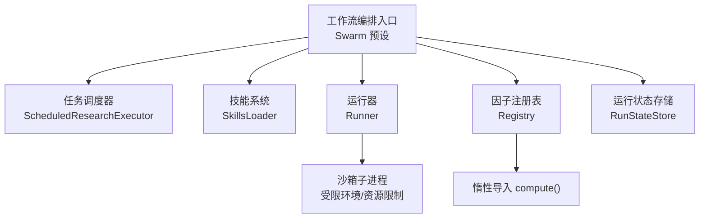
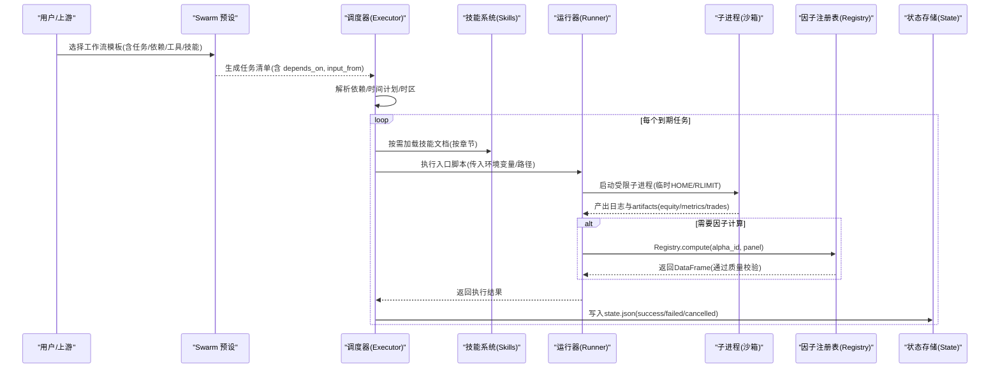
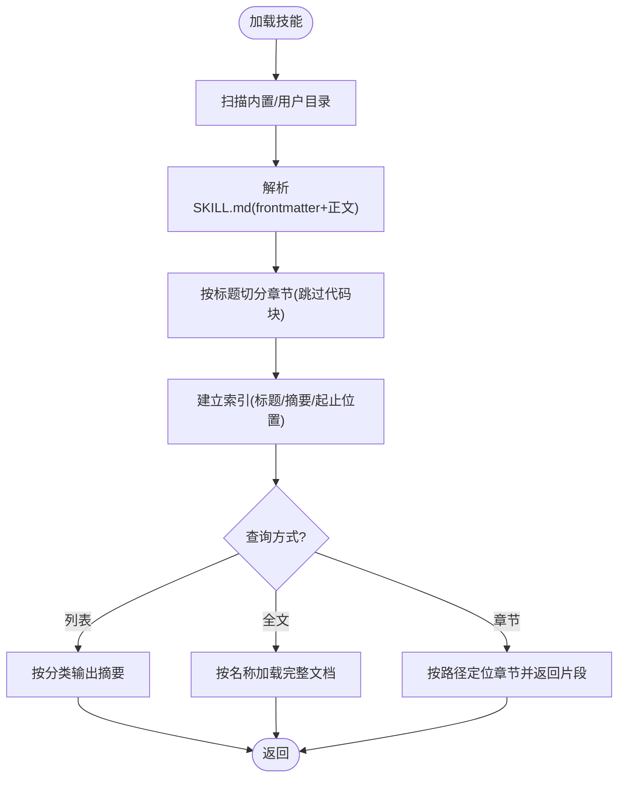
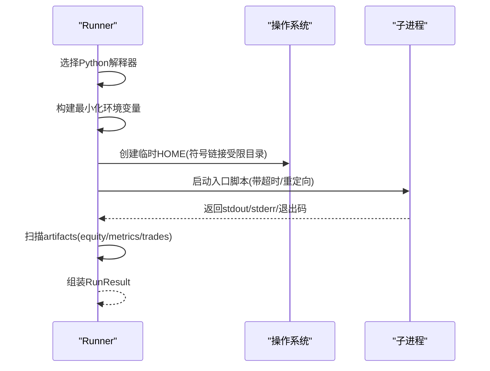
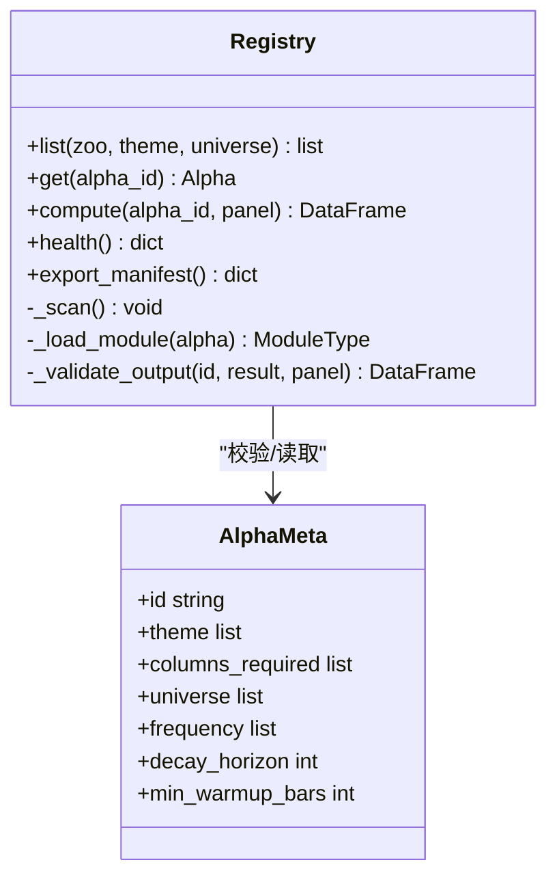
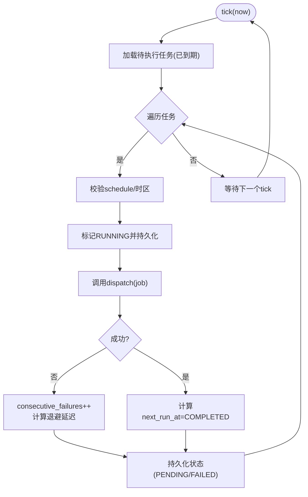
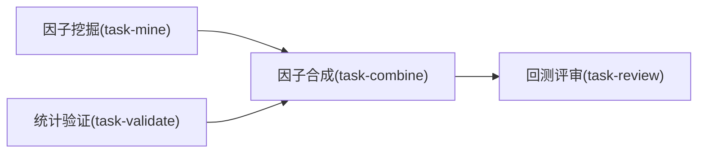
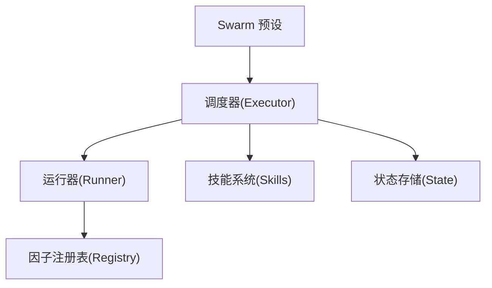

# 工作流编排

<cite>
**本文引用的文件**
- [agent/src/agent/skills.py](file://agent/src/agent/skills.py)
- [agent/src/core/runner.py](file://agent/src/core/runner.py)
- [agent/src/factors/registry.py](file://agent/src/factors/registry.py)
- [agent/src/scheduled_research/executor.py](file://agent/src/scheduled_research/executor.py)
- [agent/src/core/state.py](file://agent/src/core/state.py)
- [agent/src/swarm/presets/factor_research_committee.yaml](file://agent/src/swarm/presets/factor_research_committee.yaml)
- [agent/src/swarm/presets/etf_allocation_desk.yaml](file://agent/src/swarm/presets/etf_allocation_desk.yaml)
- [agent/src/swarm/presets/fund_selection_panel.yaml](file://agent/src/swarm/presets/fund_selection_panel.yaml)
</cite>

## 目录
1. [简介](#简介)
2. [项目结构](#项目结构)
3. [核心组件](#核心组件)
4. [架构总览](#架构总览)
5. [详细组件分析](#详细组件分析)
6. [依赖关系分析](#依赖关系分析)
7. [性能考量](#性能考量)
8. [故障排查指南](#故障排查指南)
9. [结论](#结论)
10. [附录](#附录)

## 简介
本文件面向 Vibe-Trading 的“工作流编排”能力，聚焦复杂量化研究任务的自动化编排机制：多步骤分析流程、条件分支与结果验证策略；任务调度器的依赖解析、并行执行与错误处理；技能系统（Skills）的注册、参数传递与结果聚合；以及工作流监控与调试（执行跟踪、性能分析与故障诊断）。同时提供因子研究、回测验证、投资组合优化等常见模板，并给出自定义工作流的开发指南（接口规范、测试方法与部署配置）。

## 项目结构
围绕工作流编排的关键代码分布在以下模块：
- 技能系统：skills.py 负责加载、分页与检索 SKILL.md 文档，支持按章节按需加载。
- 运行器：core/runner.py 负责在沙箱中执行生成的脚本，收集日志与产物，限制资源与环境泄露。
- 因子注册表：factors/registry.py 扫描并校验因子元数据，惰性导入并计算因子，输出质量校验。
- 定时研究执行器：scheduled_research/executor.py 实现基于 cron/间隔的任务调度、重试与持久化。
- 运行状态：core/state.py 管理运行目录、请求上下文与生命周期状态。
- Swarm 预设：swarm/presets/*.yaml 定义多角色、多任务的工作流模板（含依赖、输入输出、工具与技能）。

图表来源
- [agent/src/swarm/presets/factor_research_committee.yaml:202-236](file://agent/src/swarm/presets/factor_research_committee.yaml#L202-L236)
- [agent/src/scheduled_research/executor.py:160-241](file://agent/src/scheduled_research/executor.py#L160-L241)
- [agent/src/agent/skills.py:100-189](file://agent/src/agent/skills.py#L100-L189)
- [agent/src/core/runner.py:379-627](file://agent/src/core/runner.py#L379-L627)
- [agent/src/factors/registry.py:201-397](file://agent/src/factors/registry.py#L201-L397)
- [agent/src/core/state.py:13-87](file://agent/src/core/state.py#L13-L87)

章节来源
- [agent/src/agent/skills.py:1-387](file://agent/src/agent/skills.py#L1-L387)
- [agent/src/core/runner.py:1-627](file://agent/src/core/runner.py#L1-L627)
- [agent/src/factors/registry.py:1-454](file://agent/src/factors/registry.py#L1-L454)
- [agent/src/scheduled_research/executor.py:1-452](file://agent/src/scheduled_research/executor.py#L1-L452)
- [agent/src/core/state.py:1-87](file://agent/src/core/state.py#L1-L87)
- [agent/src/swarm/presets/factor_research_committee.yaml:202-236](file://agent/src/swarm/presets/factor_research_committee.yaml#L202-L236)
- [agent/src/swarm/presets/etf_allocation_desk.yaml:196-272](file://agent/src/swarm/presets/etf_allocation_desk.yaml#L196-L272)
- [agent/src/swarm/presets/fund_selection_panel.yaml:157-193](file://agent/src/swarm/presets/fund_selection_panel.yaml#L157-L193)

## 核心组件
- 技能系统（SkillsLoader）
  - 从内置与用户目录加载 SKILL.md，支持分类展示与按需加载全文。
  - 将文档按标题切分为章节，支持路径定位与摘要提取，便于工具分块返回。
- 运行器（Runner）
  - 选择 Python 解释器，构建最小化运行环境，创建临时 HOME（沙箱），限制地址空间与文件描述符。
  - 执行入口脚本，捕获 stdout/stderr，发现并映射 artifacts（如 equity/metrics/trades 等）。
- 因子注册表（Registry）
  - AST 静态扫描 zoo 模块，校验 AlphaMeta 元数据，惰性导入 compute 并执行。
  - 输出形状、无穷值与 NaN 比例校验，保障因子计算稳定性。
- 定时研究执行器（ScheduledResearchExecutor）
  - 支持间隔与简化 cron 表达式，时区感知，DST 安全。
  - 失败重试（指数退避）、连续失败阈值、恢复卡死 RUNNING 任务。
- 运行状态（RunStateStore）
  - 创建隔离的运行目录（code/logs/artifacts），持久化请求与状态（success/failed/cancelled）。

章节来源
- [agent/src/agent/skills.py:100-387](file://agent/src/agent/skills.py#L100-L387)
- [agent/src/core/runner.py:379-627](file://agent/src/core/runner.py#L379-L627)
- [agent/src/factors/registry.py:147-397](file://agent/src/factors/registry.py#L147-L397)
- [agent/src/scheduled_research/executor.py:160-452](file://agent/src/scheduled_research/executor.py#L160-L452)
- [agent/src/core/state.py:13-87](file://agent/src/core/state.py#L13-L87)

## 架构总览
下图展示了工作流从“预设模板”到“调度执行”、“技能加载”、“运行器执行”、“因子计算”和“状态记录”的端到端流程。

图表来源
- [agent/src/swarm/presets/factor_research_committee.yaml:202-236](file://agent/src/swarm/presets/factor_research_committee.yaml#L202-L236)
- [agent/src/scheduled_research/executor.py:266-323](file://agent/src/scheduled_research/executor.py#L266-L323)
- [agent/src/agent/skills.py:166-189](file://agent/src/agent/skills.py#L166-L189)
- [agent/src/core/runner.py:510-627](file://agent/src/core/runner.py#L510-L627)
- [agent/src/factors/registry.py:321-397](file://agent/src/factors/registry.py#L321-L397)
- [agent/src/core/state.py:49-87](file://agent/src/core/state.py#L49-L87)

## 详细组件分析

### 技能系统（SkillsLoader）
- 设计要点
  - 渐进式披露：系统提示仅注入一行摘要；完整文档按需加载。
  - 章节化：按 ATX 标题拆分文档，跳过围栏代码块，提取每段首行作为摘要。
  - 路径寻址：支持“父级 > 子级”的路径定位，解决重复标题歧义。
- 关键能力
  - 分类排序与列表输出，便于 UI 或 LLM 选择。
  - 动态加载用户技能目录，支持会话内新增技能。
  - 辅助函数：ancestor_titles、qualified_path、find_sections/find_section。

图表来源
- [agent/src/agent/skills.py:100-189](file://agent/src/agent/skills.py#L100-L189)
- [agent/src/agent/skills.py:229-387](file://agent/src/agent/skills.py#L229-L387)

章节来源
- [agent/src/agent/skills.py:1-387](file://agent/src/agent/skills.py#L1-L387)

### 运行器（Runner）与沙箱执行
- 设计要点
  - 环境白名单：仅允许必要的环境变量进入子进程，避免泄露密钥。
  - 沙箱 HOME：为子进程创建临时 HOME，仅符号链接必要的缓存/配置目录。
  - 资源限制：在 POSIX 上设置 RLIMIT_AS 与 NOFILE，限制内存与文件句柄。
  - 产物采集：根据 artifacts_spec 发现 equity/metrics/trades 等文件并映射。
- 执行流程
  - 选择 Python 解释器 -> 构建运行环境 -> 启动子进程 -> 捕获输出 -> 清理临时目录 -> 汇总结果。

图表来源
- [agent/src/core/runner.py:522-569](file://agent/src/core/runner.py#L522-L569)
- [agent/src/core/runner.py:510-627](file://agent/src/core/runner.py#L510-L627)

章节来源
- [agent/src/core/runner.py:1-627](file://agent/src/core/runner.py#L1-L627)

### 因子注册表（Registry）与惰性计算
- 设计要点
  - AST 静态解析 __alpha_meta__，严格校验字段与列依赖。
  - 惰性导入：仅在 compute 时加载模块，降低冷启动开销。
  - 输出校验：形状一致、无无穷值、NaN 比例阈值保护。
- 使用场景
  - 在回测/研究中按需调用 compute(panel)，得到因子序列用于后续组合与回测。

图表来源
- [agent/src/factors/registry.py:87-125](file://agent/src/factors/registry.py#L87-L125)
- [agent/src/factors/registry.py:201-397](file://agent/src/factors/registry.py#L201-L397)

章节来源
- [agent/src/factors/registry.py:1-454](file://agent/src/factors/registry.py#L1-L454)

### 定时研究执行器（ScheduledResearchExecutor）
- 设计要点
  - 支持间隔与简化 cron，时区感知，DST 安全（不存在时刻跳过，重叠时刻取首次）。
  - 失败重试：指数退避，最大连续失败次数达到后标记 FAILED。
  - 恢复机制：启动时恢复上次未完成的 RUNNING 任务。
- 执行循环
  - 轮询到期任务 -> 校验 schedule -> 标记 RUNNING -> 调用 dispatch -> 更新 next_run_at -> 持久化状态。

图表来源
- [agent/src/scheduled_research/executor.py:64-125](file://agent/src/scheduled_research/executor.py#L64-L125)
- [agent/src/scheduled_research/executor.py:266-452](file://agent/src/scheduled_research/executor.py#L266-L452)

章节来源
- [agent/src/scheduled_research/executor.py:1-452](file://agent/src/scheduled_research/executor.py#L1-L452)

### 运行状态（RunStateStore）
- 职责
  - 创建唯一运行目录（code/logs/artifacts）。
  - 保存请求上下文与状态（success/failed/cancelled），确保原子落盘。
- 作用
  - 为上层报告/审计提供可追溯的运行上下文与结果定位。

章节来源
- [agent/src/core/state.py:13-87](file://agent/src/core/state.py#L13-L87)

### 工作流模板（Swarm Presets）
- 因子研究委员会（factor_research_committee.yaml）
  - 任务：因子挖掘、统计验证、因子合成、回测评审。
  - 依赖：combine 依赖 mine 与 validate；review 依赖 combine 及原始结果。
  - 工具与技能：factor_analysis、backtest、multi-factor、strategy-generate、backtest-diagnose、quant-statistics。
- ETF 资产配置（etf_allocation_desk.yaml）
  - 任务：ETF 筛选、宏观配置、组合优化、回测验证。
  - 工具与技能：get_market_data、backtest、risk-analysis、volatility、etf-analysis、asset-allocation。
- 基金选择面板（fund_selection_panel.yaml）
  - 任务：基金初筛、业绩归因、FOF 优化。
  - 工具与技能：backtest、performance-attribution、asset-allocation、risk-analysis、strategy-generate、etf-analysis。

图表来源
- [agent/src/swarm/presets/factor_research_committee.yaml:202-236](file://agent/src/swarm/presets/factor_research_committee.yaml#L202-L236)

章节来源
- [agent/src/swarm/presets/factor_research_committee.yaml:134-236](file://agent/src/swarm/presets/factor_research_committee.yaml#L134-L236)
- [agent/src/swarm/presets/etf_allocation_desk.yaml:196-272](file://agent/src/swarm/presets/etf_allocation_desk.yaml#L196-L272)
- [agent/src/swarm/presets/fund_selection_panel.yaml:157-193](file://agent/src/swarm/presets/fund_selection_panel.yaml#L157-L193)

## 依赖关系分析
- 组件耦合
  - Swarm 预设驱动任务编排，依赖 Executor 进行调度；Executor 通过回调触发 Runner 执行。
  - Runner 依赖 Registry 进行因子计算；Registry 惰性加载模块，避免全局冷启动成本。
  - SkillsLoader 被各任务按需加载，减少上下文体积。
- 外部依赖
  - 运行时环境变量白名单控制子进程可见性。
  - 平台相关能力（POSIX rlimit、pwd）在非 Linux 下优雅降级。

图表来源
- [agent/src/scheduled_research/executor.py:160-241](file://agent/src/scheduled_research/executor.py#L160-L241)
- [agent/src/core/runner.py:379-627](file://agent/src/core/runner.py#L379-L627)
- [agent/src/factors/registry.py:201-397](file://agent/src/factors/registry.py#L201-L397)
- [agent/src/agent/skills.py:100-189](file://agent/src/agent/skills.py#L100-L189)
- [agent/src/core/state.py:13-87](file://agent/src/core/state.py#L13-L87)

章节来源
- [agent/src/scheduled_research/executor.py:160-452](file://agent/src/scheduled_research/executor.py#L160-L452)
- [agent/src/core/runner.py:379-627](file://agent/src/core/runner.py#L379-L627)
- [agent/src/factors/registry.py:201-397](file://agent/src/factors/registry.py#L201-L397)
- [agent/src/agent/skills.py:100-189](file://agent/src/agent/skills.py#L100-L189)
- [agent/src/core/state.py:13-87](file://agent/src/core/state.py#L13-L87)

## 性能考量
- 惰性加载与缓存
  - Registry 对 zoo 模块采用惰性导入，并在默认 zoo 下复用进程级单例，减少扫描与导入开销。
- 资源限制与隔离
  - Runner 通过 RLIMIT_AS/NOFILE 限制子进程资源，防止异常占用影响宿主。
  - 临时 HOME 与符号链接仅暴露必要目录，减少 I/O 与权限风险。
- 调度与重试
  - Executor 支持指数退避与最大连续失败阈值，避免雪崩与无限重试。
- 产物与日志
  - artifacts_spec 明确产物结构与必填项，便于下游快速校验与可视化。

[本节为通用指导，不直接分析具体文件]

## 故障排查指南
- 常见问题定位
  - 子进程执行失败：检查 runner_stdout.txt/runner_stderr.txt，确认环境变量与依赖是否可用。
  - 因子计算异常：查看 Registry 健康信息（loaded/failed/errors），核对面板列与 sector 标签。
  - 调度不触发：确认 is_due 判断、cron 表达式与时区设置；检查是否存在 DST 间隙导致跳过。
  - 状态不一致：核对 state.json 与 artifacts 是否存在；确认取消/失败原因。
- 建议步骤
  - 启用最小复现：使用预设模板的最小任务集，逐步增加复杂度。
  - 隔离环境：在容器或独立环境中运行，避免宿主机环境干扰。
  - 日志增强：在 Runner 与 Executor 中追加关键路径日志，定位失败点。

章节来源
- [agent/src/core/runner.py:510-627](file://agent/src/core/runner.py#L510-L627)
- [agent/src/factors/registry.py:312-319](file://agent/src/factors/registry.py#L312-L319)
- [agent/src/scheduled_research/executor.py:64-125](file://agent/src/scheduled_research/executor.py#L64-L125)
- [agent/src/core/state.py:49-87](file://agent/src/core/state.py#L49-L87)

## 结论
Vibe-Trading 的工作流编排以“预设模板 + 调度器 + 技能系统 + 运行器 + 因子注册表 + 状态存储”为核心，实现了复杂量化研究的自动化、可观测与可维护。通过严格的沙箱执行、惰性加载与健壮的重试机制，系统在安全性、性能与可靠性之间取得平衡。结合多种预设模板，可覆盖因子研究、回测验证与投资组合优化等典型场景。

[本节为总结性内容，不直接分析具体文件]

## 附录

### 常见工作流模板速览
- 因子研究
  - 任务：因子挖掘 -> 统计验证 -> 因子合成 -> 回测评审。
  - 工具/技能：factor_analysis、backtest、multi-factor、strategy-generate、backtest-diagnose、quant-statistics。
- 回测验证
  - 任务：策略生成 -> 历史回测 -> 诊断与稳健性检验。
  - 工具/技能：strategy-generate、backtest、backtest-diagnose、quant-statistics。
- 投资组合优化
  - 任务：资产筛选 -> 宏观配置 -> 权重优化 -> 回测验证。
  - 工具/技能：get_market_data、backtest、risk-analysis、volatility、etf-analysis、asset-allocation。

章节来源
- [agent/src/swarm/presets/factor_research_committee.yaml:134-236](file://agent/src/swarm/presets/factor_research_committee.yaml#L134-L236)
- [agent/src/swarm/presets/etf_allocation_desk.yaml:196-272](file://agent/src/swarm/presets/etf_allocation_desk.yaml#L196-L272)
- [agent/src/swarm/presets/fund_selection_panel.yaml:157-193](file://agent/src/swarm/presets/fund_selection_panel.yaml#L157-L193)

### 自定义工作流开发指南
- 接口规范
  - 预设 YAML：定义角色、任务、依赖（depends_on）、输入（input_from）、工具与技能。
  - 技能文档：遵循 SKILL.md 规范，包含 frontmatter（name/description/category）与结构化章节。
  - 运行器契约：入口脚本需输出约定 artifacts（equity/metrics/trades 等），并遵守环境变量白名单。
- 测试方法
  - 单元测试：针对 Registry.compute 的输入/输出校验；Executor 的 is_due/next_due 逻辑。
  - 集成测试：端到端执行预设模板，验证任务依赖与产物完整性。
  - 沙箱测试：在受限环境下验证 Runner 的资源限制与环境隔离。
- 部署配置
  - 环境变量：合理设置代理、数据源密钥与最小间隔限制；必要时调整沙箱内存上限。
  - 调度开关：通过环境变量启用/禁用调度器，并配置重试策略与最大失败次数。
  - 监控与审计：利用 state.json 与 artifacts 进行运行追踪与审计。

章节来源
- [agent/src/agent/skills.py:100-189](file://agent/src/agent/skills.py#L100-L189)
- [agent/src/core/runner.py:522-569](file://agent/src/core/runner.py#L522-L569)
- [agent/src/scheduled_research/executor.py:160-241](file://agent/src/scheduled_research/executor.py#L160-L241)
- [agent/src/factors/registry.py:201-397](file://agent/src/factors/registry.py#L201-L397)
- [agent/src/core/state.py:13-87](file://agent/src/core/state.py#L13-L87)