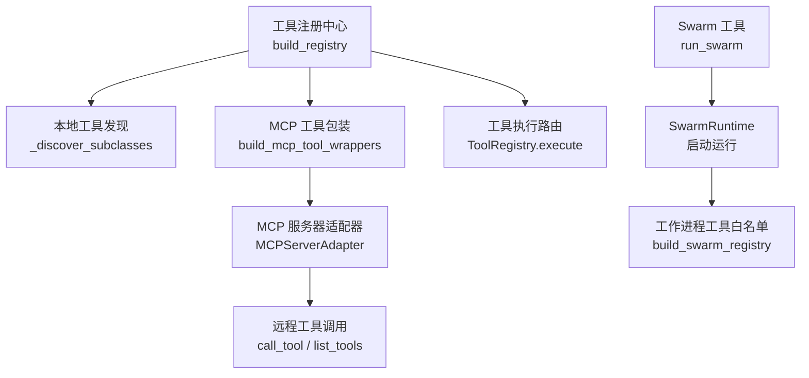
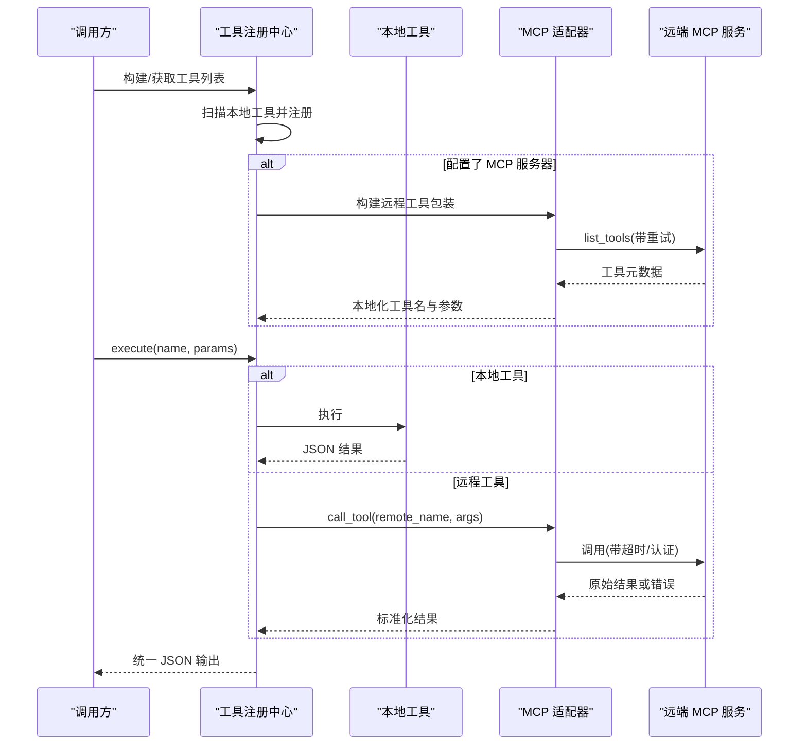
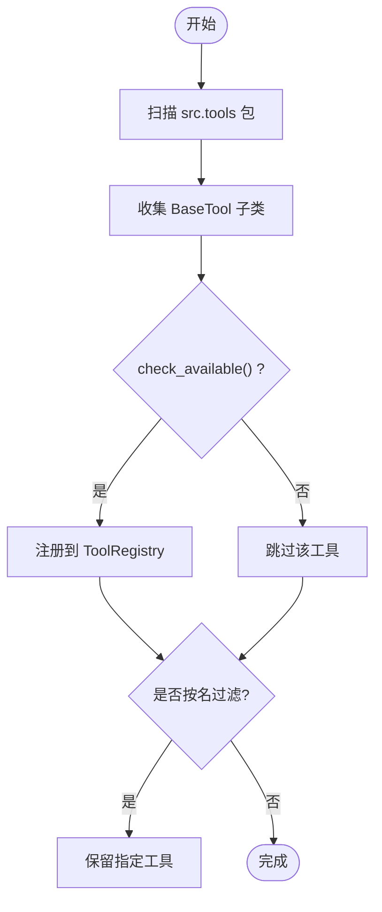
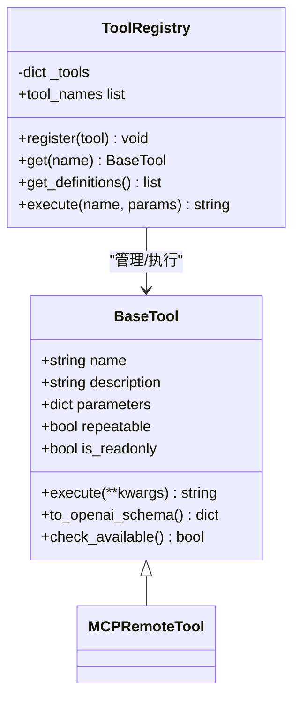
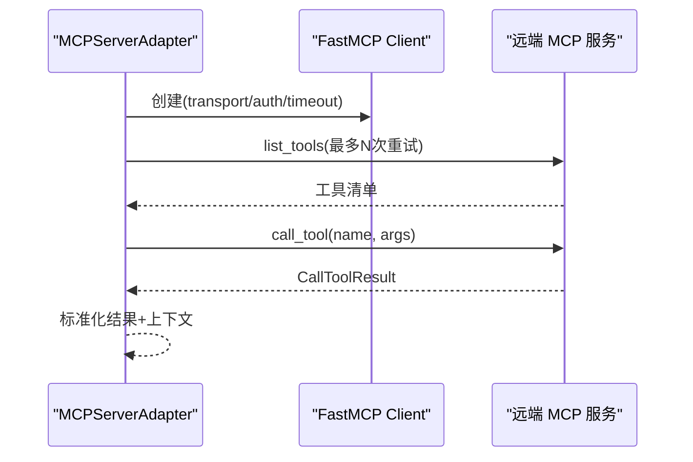
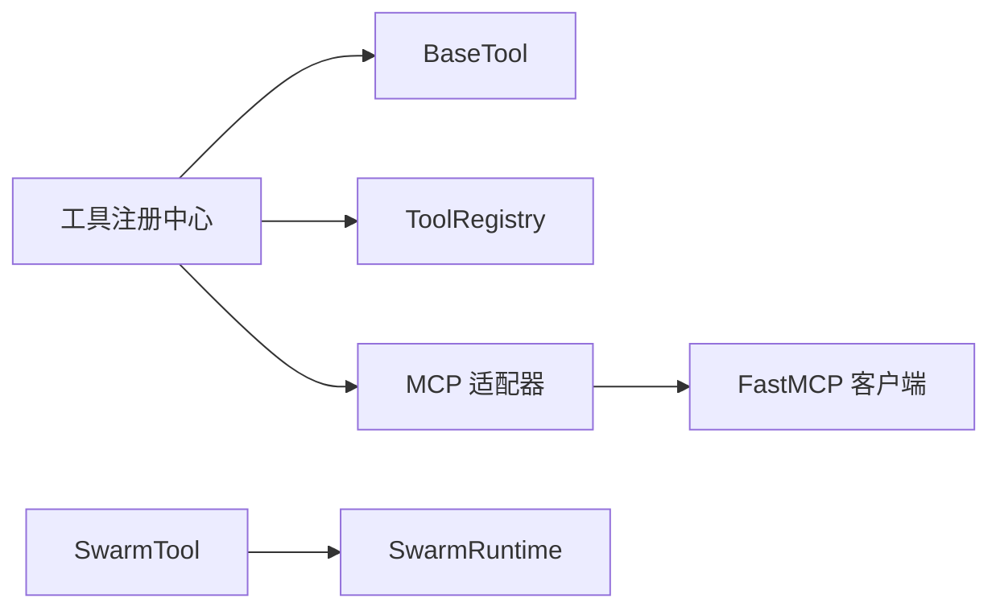

# 工具集成模式

<cite>
**本文引用的文件**
- [agent/src/tools/__init__.py](file://agent/src/tools/__init__.py)
- [agent/src/agent/tools.py](file://agent/src/agent/tools.py)
- [agent/src/tools/mcp.py](file://agent/src/tools/mcp.py)
- [agent/src/tools/swarm_tool.py](file://agent/src/tools/swarm_tool.py)
</cite>

## 目录
1. [简介](#简介)
2. [项目结构](#项目结构)
3. [核心组件](#核心组件)
4. [架构总览](#架构总览)
5. [详细组件分析](#详细组件分析)
6. [依赖关系分析](#依赖关系分析)
7. [性能考量](#性能考量)
8. [故障排查指南](#故障排查指南)
9. [结论](#结论)
10. [附录](#附录)

## 简介
本文件面向 Vibe-Trading 的“工具集成模式”，聚焦以下目标：
- 外部工具的动态发现与注册机制（元数据定义、参数校验、错误处理）
- API 调用封装模式（认证管理、请求重试、响应解析）
- 文件处理工具的使用模式（安全沙箱、权限控制、批量操作）
- 批量操作最佳实践（并发控制、进度跟踪、结果合并）
- 工具链组合技巧（数据管道、中间结果缓存、错误恢复）
- 开发指南（自定义工具、测试方法、部署配置）
- 企业级部署中的工具安全策略与访问控制

## 项目结构
围绕工具集成的关键代码集中在 agent/src 下：
- 工具基础设施与注册：BaseTool、ToolRegistry、自动发现与构建器
- MCP 远程工具适配：客户端、适配器、名称规范化、认证与重试
- 多智能体编排：SwarmTool 作为统一入口，驱动复杂任务执行

图表来源
- [agent/src/tools/__init__.py:33-63](file://agent/src/tools/__init__.py#L33-L63)
- [agent/src/tools/__init__.py:66-245](file://agent/src/tools/__init__.py#L66-L245)
- [agent/src/tools/mcp.py:312-375](file://agent/src/tools/mcp.py#L312-L375)
- [agent/src/tools/mcp.py:413-670](file://agent/src/tools/mcp.py#L413-L670)
- [agent/src/tools/swarm_tool.py:667-800](file://agent/src/tools/swarm_tool.py#L667-L800)

章节来源
- [agent/src/tools/__init__.py:33-63](file://agent/src/tools/__init__.py#L33-L63)
- [agent/src/tools/__init__.py:66-245](file://agent/src/tools/__init__.py#L66-L245)
- [agent/src/tools/mcp.py:312-375](file://agent/src/tools/mcp.py#L312-L375)
- [agent/src/tools/mcp.py:413-670](file://agent/src/tools/mcp.py#L413-L670)
- [agent/src/tools/swarm_tool.py:667-800](file://agent/src/tools/swarm_tool.py#L667-L800)

## 核心组件
- BaseTool：统一的工具抽象，提供 name/description/parameters/repeatable/is_readonly 等元数据，以及 to_openai_schema 转换。
- ToolRegistry：工具注册表，负责注册、查询、获取 OpenAI 函数定义、统一执行与异常兜底。
- 工具发现与构建：通过包扫描与子类收集实现本地工具的自动发现；支持按名过滤与 Swarm 专用构建。
- MCP 适配层：将远端 MCP 工具包装为本地 BaseTool，处理认证、传输、超时、重试、参数归一化与结果标准化。
- SwarmTool：以自然语言触发多智能体团队执行，自动匹配预设并提取变量，阻塞等待完成并返回摘要。

章节来源
- [agent/src/agent/tools.py:13-95](file://agent/src/agent/tools.py#L13-L95)
- [agent/src/tools/__init__.py:33-63](file://agent/src/tools/__init__.py#L33-L63)
- [agent/src/tools/__init__.py:66-245](file://agent/src/tools/__init__.py#L66-L245)
- [agent/src/tools/mcp.py:292-375](file://agent/src/tools/mcp.py#L292-L375)
- [agent/src/tools/swarm_tool.py:667-800](file://agent/src/tools/swarm_tool.py#L667-L800)

## 架构总览
下图展示了从“工具注册”到“远程调用”的关键路径，包括本地工具发现、MCP 工具包装、认证与重试、参数与结果归一化。

图表来源
- [agent/src/tools/__init__.py:66-245](file://agent/src/tools/__init__.py#L66-L245)
- [agent/src/tools/mcp.py:413-670](file://agent/src/tools/mcp.py#L413-L670)
- [agent/src/agent/tools.py:54-95](file://agent/src/agent/tools.py#L54-L95)

## 详细组件分析

### 工具元数据与动态发现
- 元数据模型：BaseTool 暴露 name、description、parameters、repeatable、is_readonly，并提供 to_openai_schema 用于 LLM 函数调用。
- 自动发现：通过遍历包内模块并收集 BaseTool 子类，跳过以“_”开头的内部模块，缓存结果避免重复扫描。
- 可用性检查：工具可重写 check_available 声明依赖是否满足，不满足则被静默排除。
- 注册与过滤：build_registry 负责组装本地工具与可选的 MCP 工具；build_filtered_registry 与 build_swarm_registry 支持按名过滤与白名单。

图表来源
- [agent/src/tools/__init__.py:33-63](file://agent/src/tools/__init__.py#L33-L63)
- [agent/src/tools/__init__.py:66-245](file://agent/src/tools/__init__.py#L66-L245)
- [agent/src/agent/tools.py:13-52](file://agent/src/agent/tools.py#L13-L52)

章节来源
- [agent/src/tools/__init__.py:33-63](file://agent/src/tools/__init__.py#L33-L63)
- [agent/src/tools/__init__.py:66-245](file://agent/src/tools/__init__.py#L66-L245)
- [agent/src/agent/tools.py:13-52](file://agent/src/agent/tools.py#L13-L52)

### 参数验证与错误处理
- 参数归一化：MCP 输入 schema 会被 normalize_mcp_tool_schema 转换为 OpenAI 兼容对象，处理 anyOf/oneOf/allOf、nullable 等。
- 参数过滤：MCPRemoteTool 在转发前会依据 schema 的 properties 与 additionalProperties 规则过滤本地专属参数，防止越权传递。
- 执行错误：ToolRegistry.execute 对未找到工具与执行异常进行统一捕获，返回标准 JSON 错误结构；MCP 适配器对远端异常也做标准化。

图表来源
- [agent/src/agent/tools.py:13-95](file://agent/src/agent/tools.py#L13-L95)
- [agent/src/tools/mcp.py:672-737](file://agent/src/tools/mcp.py#L672-L737)

章节来源
- [agent/src/agent/tools.py:54-95](file://agent/src/agent/tools.py#L54-L95)
- [agent/src/tools/mcp.py:332-367](file://agent/src/tools/mcp.py#L332-L367)
- [agent/src/tools/mcp.py:876-902](file://agent/src/tools/mcp.py#L876-L902)

### API 调用封装：认证、重试与响应解析
- 认证管理：根据传输类型选择 stdio/sse/streamable-http；HTTP 场景使用 OAuth，持久化 token 存储于受限目录（0700），支持回调端口与元数据 URL。
- 重试策略：list_tools 支持有限次数的瞬态错误重试；工具调用本身不自动重试以避免幂等性风险。
- 响应解析：远端结果经 _normalize_call_tool_result 标准化，附加 server/remote_tool/tool 等上下文字段，便于追踪与聚合。

图表来源
- [agent/src/tools/mcp.py:518-578](file://agent/src/tools/mcp.py#L518-L578)
- [agent/src/tools/mcp.py:745-834](file://agent/src/tools/mcp.py#L745-L834)
- [agent/src/tools/mcp.py:625-659](file://agent/src/tools/mcp.py#L625-L659)

章节来源
- [agent/src/tools/mcp.py:510-537](file://agent/src/tools/mcp.py#L510-L537)
- [agent/src/tools/mcp.py:518-578](file://agent/src/tools/mcp.py#L518-L578)
- [agent/src/tools/mcp.py:745-834](file://agent/src/tools/mcp.py#L745-L834)
- [agent/src/tools/mcp.py:625-659](file://agent/src/tools/mcp.py#L625-L659)

### 文件处理工具与安全沙箱
- 沙箱隔离：Shell 类工具默认禁用，需显式 include_shell_tools 开启；Swarm 工作进程可通过白名单精细控制可用工具集合。
- 权限控制：OAuth token 存储目录权限收紧至 0700；MCP 服务器名称冲突时生成唯一前缀，避免命名污染。
- 批量与批处理：Swarm 工具支持多智能体并行执行，结合 max_workers 与超时控制，适合大规模数据处理与分析任务。

章节来源
- [agent/src/tools/__init__.py:66-245](file://agent/src/tools/__init__.py#L66-L245)
- [agent/src/tools/mcp.py:510-537](file://agent/src/tools/mcp.py#L510-L537)
- [agent/src/tools/mcp.py:409-455](file://agent/src/tools/mcp.py#L409-L455)
- [agent/src/tools/swarm_tool.py:667-800](file://agent/src/tools/swarm_tool.py#L667-L800)

### 批量操作最佳实践
- 并发控制：通过 SwarmRuntime 的 max_workers 限制并发度，避免资源耗尽；工具调用设置超时，防止长尾阻塞。
- 进度跟踪：SwarmTool 将运行事件通过回调推送到会话通道，便于前端展示进度与状态。
- 结果合并：每个工具返回标准化 JSON，上层可按 run_id 聚合各阶段结果，形成最终报告。

章节来源
- [agent/src/tools/swarm_tool.py:757-800](file://agent/src/tools/swarm_tool.py#L757-L800)

### 工具链组合技巧
- 数据管道：本地工具与 MCP 工具混合注册，形成“采集-清洗-分析-报告”的流水线；MCP 工具可作为外部数据源或计算节点。
- 中间结果缓存：MCP 工具发现结果基于指纹键缓存，减少重复探测开销；可在每次运行前失效缓存以保证一致性。
- 错误恢复：瞬态网络错误自动重试；不可重试的错误直接上报，由上层决定回退策略（如切换备用数据源）。

章节来源
- [agent/src/tools/mcp.py:222-253](file://agent/src/tools/mcp.py#L222-L253)
- [agent/src/tools/mcp.py:745-834](file://agent/src/tools/mcp.py#L745-L834)

### 开发指南：自定义工具、测试与部署
- 自定义工具：新建继承 BaseTool 的类，实现 execute 与必要元数据；如需依赖检查，重写 check_available。
- 测试方法：通过注入 client_factory 构造 Mock MCP 客户端；利用 build_swarm_registry 限定工具白名单进行单元测试。
- 部署配置：在 agent_config 中声明 mcp_servers，按需启用 enabled_tools；生产环境建议关闭 shell 工具，仅开放只读能力。

章节来源
- [agent/src/agent/tools.py:13-52](file://agent/src/agent/tools.py#L13-L52)
- [agent/src/tools/__init__.py:267-308](file://agent/src/tools/__init__.py#L267-L308)
- [agent/src/tools/mcp.py:312-375](file://agent/src/tools/mcp.py#L312-L375)

### 企业级安全策略与访问控制
- 最小权限：默认 is_readonly=True，写操作工具需显式标记；MCP 工具包装默认 is_readonly=False，但可通过上游策略限制。
- 白名单与隔离：Swarm 工作进程仅加载白名单内的工具；MCP 服务器名称冲突时采用唯一前缀，避免跨租户干扰。
- 认证与审计：OAuth 令牌落盘受保护；工具调用失败记录结构化错误信息，便于审计与排障。

章节来源
- [agent/src/agent/tools.py:13-52](file://agent/src/agent/tools.py#L13-L52)
- [agent/src/tools/mcp.py:409-455](file://agent/src/tools/mcp.py#L409-L455)
- [agent/src/tools/mcp.py:510-537](file://agent/src/tools/mcp.py#L510-L537)

## 依赖关系分析
- 组件耦合：
  - 工具注册中心依赖 BaseTool/ToolRegistry 与 MCP 适配器；SwarmTool 依赖运行时与存储。
  - MCP 适配器依赖 FastMCP 客户端与传输层，封装认证、超时与重试。
- 外部依赖：
  - fastmcp、mcp types、key_value 等用于远程工具通信与令牌存储。
- 潜在循环：未发现直接循环依赖；通过协议与工厂解耦。

图表来源
- [agent/src/tools/__init__.py:66-245](file://agent/src/tools/__init__.py#L66-L245)
- [agent/src/tools/mcp.py:312-375](file://agent/src/tools/mcp.py#L312-L375)
- [agent/src/tools/swarm_tool.py:667-800](file://agent/src/tools/swarm_tool.py#L667-L800)

章节来源
- [agent/src/tools/__init__.py:66-245](file://agent/src/tools/__init__.py#L66-L245)
- [agent/src/tools/mcp.py:312-375](file://agent/src/tools/mcp.py#L312-L375)
- [agent/src/tools/swarm_tool.py:667-800](file://agent/src/tools/swarm_tool.py#L667-L800)

## 性能考量
- 缓存：MCP 工具发现结果按指纹键缓存，减少重复探测；首次冷启动可能较慢，后续调用受益明显。
- 重试：list_tools 支持一次瞬态重试，避免偶发网络抖动导致失败；工具调用不重试以保障幂等性。
- 并发：Swarm 通过 max_workers 控制并发度，建议根据资源与下游限流合理设置。
- 超时：init_timeout 与 tool_timeout 分离，初始化允许更长耗时，调用保持严格时限。

[本节为通用指导，无需特定文件引用]

## 故障排查指南
- 工具未注册：检查 check_available 返回值与依赖是否满足；确认 include_shell_tools 策略。
- MCP 连接失败：查看日志中的瞬态错误与重试次数；确认 OAuth 配置与 token 存储目录权限。
- 参数不匹配：核对 normalize_mcp_tool_schema 后的 properties 与 required；必要时调整传入参数。
- 执行异常：ToolRegistry 与 MCP 适配器均返回结构化错误，包含 error/error_type 字段，便于定位。

章节来源
- [agent/src/tools/__init__.py:136-154](file://agent/src/tools/__init__.py#L136-L154)
- [agent/src/tools/mcp.py:745-834](file://agent/src/tools/mcp.py#L745-L834)
- [agent/src/agent/tools.py:72-84](file://agent/src/agent/tools.py#L72-L84)

## 结论
Vibe-Trading 的工具集成模式以 BaseTool/ToolRegistry 为核心，结合 MCP 适配器实现本地与远端工具的无缝融合。通过严格的参数归一化、认证管理与重试策略，保障了调用的健壮性与安全性；Swarm 工具提供了强大的批量与编排能力。企业级部署应遵循最小权限、白名单与审计原则，确保工具链的安全与可控。

[本节为总结，无需特定文件引用]

## 附录
- 术语
  - MCP：Model Context Protocol，用于工具与服务间通信的标准协议。
  - 工具元数据：name、description、parameters 等描述工具能力的结构化信息。
  - 白名单：仅允许使用的工具集合，常用于受限环境。
- 参考路径
  - 工具基础与注册：[agent/src/agent/tools.py](file://agent/src/agent/tools.py)、[agent/src/tools/__init__.py](file://agent/src/tools/__init__.py)
  - MCP 适配与认证：[agent/src/tools/mcp.py](file://agent/src/tools/mcp.py)
  - 多智能体编排：[agent/src/tools/swarm_tool.py](file://agent/src/tools/swarm_tool.py)

[本节为补充说明，无需特定文件引用]