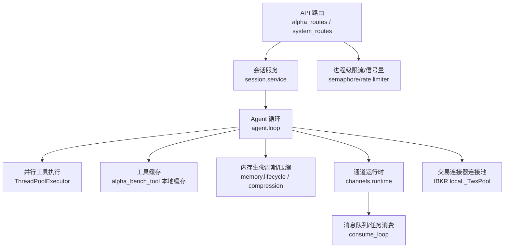
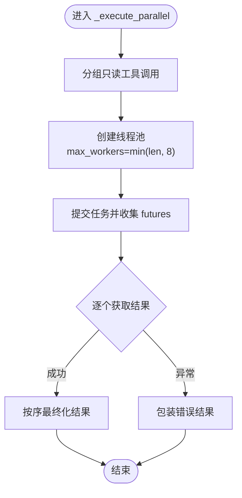
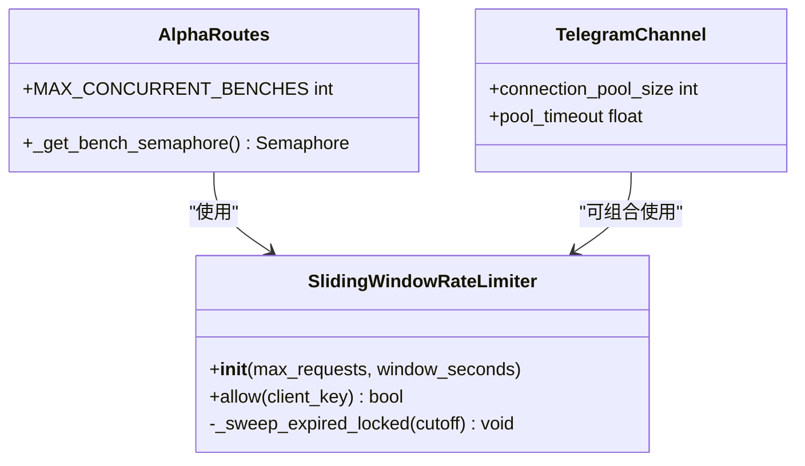
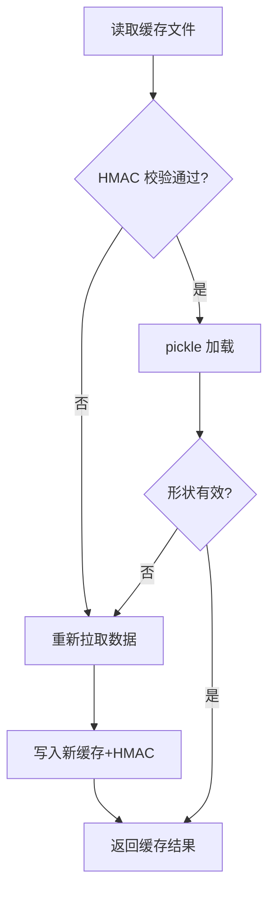
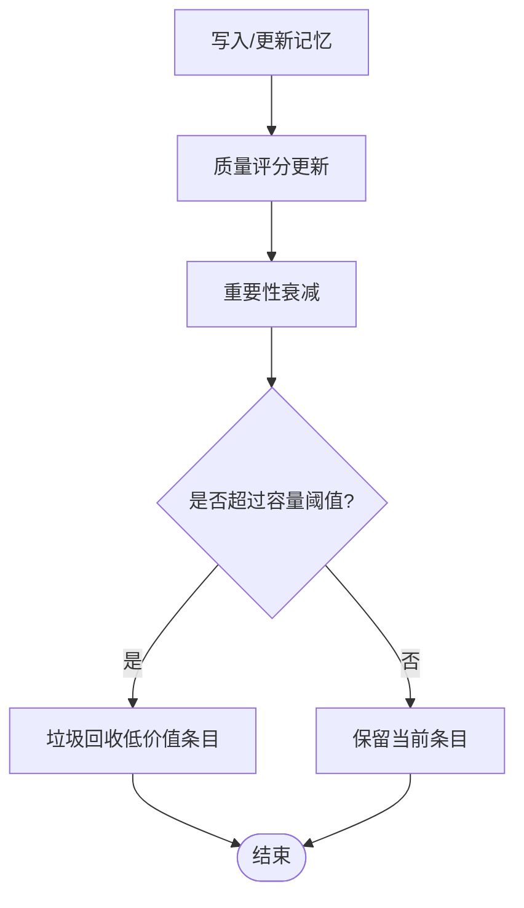
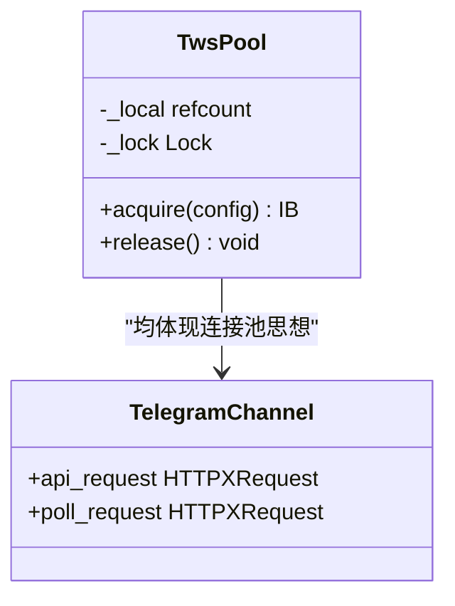
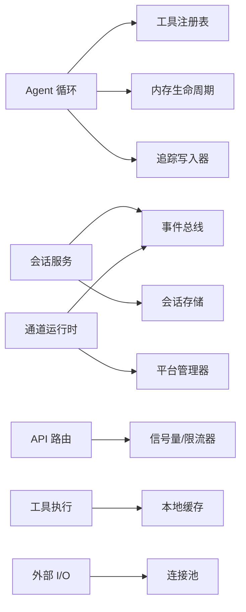

# 性能优化策略

<cite>
**本文引用的文件**
- [agent/src/agent/loop.py](file://agent/src/agent/loop.py)
- [agent/src/session/service.py](file://agent/src/session/service.py)
- [agent/src/api/alpha_routes.py](file://agent/src/api/alpha_routes.py)
- [agent/src/api/system_routes.py](file://agent/src/api/system_routes.py)
- [agent/src/channels/runtime.py](file://agent/src/channels/runtime.py)
- [agent/src/channels/telegram.py](file://agent/src/channels/telegram.py)
- [agent/src/memory/lifecycle.py](file://agent/src/memory/lifecycle.py)
- [agent/src/memory/compression.py](file://agent/src/memory/compression.py)
- [agent/src/tools/alpha_bench_tool.py](file://agent/src/tools/alpha_bench_tool.py)
- [agent/src/trading/connectors/ibkr/local.py](file://agent/src/trading/connectors/ibkr/local.py)
- [agent/src/core/runner.py](file://agent/src/core/runner.py)
- [agent/scripts/bench_performance.py](file://agent/scripts/bench_performance.py)
- [agent/src/config/limits.py](file://agent/src/config/limits.py)
</cite>

## 目录
1. [简介](#简介)
2. [项目结构](#项目结构)
3. [核心组件](#核心组件)
4. [架构总览](#架构总览)
5. [详细组件分析](#详细组件分析)
6. [依赖关系分析](#依赖关系分析)
7. [性能考量](#性能考量)
8. [故障排查指南](#故障排查指南)
9. [结论](#结论)
10. [附录](#附录)

## 简介
本文件聚焦 Vibe-Trading 的性能优化策略，围绕并发处理、缓存策略、内存管理、I/O 优化、监控与基准测试、以及生产环境调优实践展开。内容基于代码库中的实际实现进行归纳与可视化说明，帮助读者理解系统如何在高并发、大数据量与外部 I/O 受限场景下保持稳定与高效。

## 项目结构
Vibe-Trading 在 agent 模块中实现了核心的 Agent 循环、会话编排、通道运行时、API 路由、内存生命周期与压缩、工具执行与缓存、交易连接器连接池等关键能力。这些模块共同构成“请求进入—任务调度—资源控制—结果返回”的完整链路，并在多处引入限流、并发上限、连接池与缓存机制以保障吞吐与稳定性。



图表来源
- [agent/src/api/alpha_routes.py:61-95](file://agent/src/api/alpha_routes.py#L61-L95)
- [agent/src/api/system_routes.py:62-78](file://agent/src/api/system_routes.py#L62-L78)
- [agent/src/session/service.py:32-33](file://agent/src/session/service.py#L32-L33)
- [agent/src/agent/loop.py:2615-2692](file://agent/src/agent/loop.py#L2615-L2692)
- [agent/src/tools/alpha_bench_tool.py:270-303](file://agent/src/tools/alpha_bench_tool.py#L270-L303)
- [agent/src/memory/lifecycle.py:71-83](file://agent/src/memory/lifecycle.py#L71-L83)
- [agent/src/memory/compression.py:163-195](file://agent/src/memory/compression.py#L163-L195)
- [agent/src/channels/runtime.py:72-118](file://agent/src/channels/runtime.py#L72-L118)
- [agent/src/trading/connectors/ibkr/local.py:525-556](file://agent/src/trading/connectors/ibkr/local.py#L525-L556)

章节来源
- [agent/src/api/alpha_routes.py:61-95](file://agent/src/api/alpha_routes.py#L61-L95)
- [agent/src/api/system_routes.py:62-78](file://agent/src/api/system_routes.py#L62-L78)
- [agent/src/session/service.py:32-33](file://agent/src/session/service.py#L32-L33)
- [agent/src/agent/loop.py:2615-2692](file://agent/src/agent/loop.py#L2615-L2692)
- [agent/src/tools/alpha_bench_tool.py:270-303](file://agent/src/tools/alpha_bench_tool.py#L270-L303)
- [agent/src/memory/lifecycle.py:71-83](file://agent/src/memory/lifecycle.py#L71-L83)
- [agent/src/memory/compression.py:163-195](file://agent/src/memory/compression.py#L163-L195)
- [agent/src/channels/runtime.py:72-118](file://agent/src/channels/runtime.py#L72-L118)
- [agent/src/trading/connectors/ibkr/local.py:525-556](file://agent/src/trading/connectors/ibkr/local.py#L525-L556)

## 核心组件
- 并发与异步调度：Agent 循环将只读工具调用分组并行执行，使用线程池限制最大并发；会话服务通过专用线程池隔离 Agent 执行，避免耗尽默认执行器；通道运行时维护消费者任务与处理器任务集合，统一生命周期管理。
- 资源竞争避免：API 层对重计算任务（如基准测试）使用进程级信号量限制并发；系统路由提供滑动窗口限流器按客户端独立配额；Telegram 通道为长轮询与 API 请求分别配置连接池，避免相互饥饿。
- 缓存策略：Alpha 基准工具使用带 HMAC 校验的本地 pickle 缓存，失败或损坏时自动回退到重新拉取；内存子系统支持三级压缩（原始→每日→摘要），并配合归档保留原数据。
- 内存管理：MemoryLifecycle 提供质量评分、重要性衰减与容量型垃圾回收；CompressionPipeline 按访问时长触发压缩，估算信息保留率；核心运行器在沙箱子进程中设置 RLIMIT_AS/NOFILE 限制地址空间与文件描述符。
- I/O 优化：IBKR 连接器采用线程局部连接池与引用计数，避免跨线程共享 socket 导致的冲突；Telegram 通道分离连接池大小与超时参数；系统路由限流保护后端计算密集接口。
- 监控与基准：bench_performance 脚本对比算子与净值计算路径；系统路由限流与状态输出便于定位瓶颈；内存压缩与 GC 开关可通过环境变量启用。

章节来源
- [agent/src/agent/loop.py:2615-2692](file://agent/src/agent/loop.py#L2615-L2692)
- [agent/src/session/service.py:32-33](file://agent/src/session/service.py#L32-L33)
- [agent/src/channels/runtime.py:72-118](file://agent/src/channels/runtime.py#L72-L118)
- [agent/src/api/alpha_routes.py:61-95](file://agent/src/api/alpha_routes.py#L61-L95)
- [agent/src/api/system_routes.py:62-78](file://agent/src/api/system_routes.py#L62-L78)
- [agent/src/channels/telegram.py:516-542](file://agent/src/channels/telegram.py#L516-L542)
- [agent/src/tools/alpha_bench_tool.py:270-303](file://agent/src/tools/alpha_bench_tool.py#L270-L303)
- [agent/src/memory/lifecycle.py:71-83](file://agent/src/memory/lifecycle.py#L71-L83)
- [agent/src/memory/compression.py:163-195](file://agent/src/memory/compression.py#L163-L195)
- [agent/src/trading/connectors/ibkr/local.py:525-556](file://agent/src/trading/connectors/ibkr/local.py#L525-L556)
- [agent/scripts/bench_performance.py:19-134](file://agent/scripts/bench_performance.py#L19-L134)

## 架构总览
下图展示了从 API 请求到 Agent 执行、再到 I/O 与缓存的关键路径，体现并发控制、限流与资源隔离的设计。

```mermaid
sequenceDiagram
participant Client as "客户端"
participant API as "API 路由"
participant Session as "会话服务"
participant Loop as "Agent 循环"
participant Tools as "工具执行"
participant Cache as "本地缓存"
participant IO as "外部 I/O"
Client->>API : "发起基准/比较请求"
API->>API : "信号量/限流检查"
API-->>Client : "排队或拒绝(超限时)"
API->>Session : "创建尝试/调度执行"
Session->>Loop : "提交到专用线程池"
Loop->>Tools : "分组并行执行只读工具"
Tools->>Cache : "读取带 HMAC 的缓存"
alt 缓存命中
Cache-->>Tools : "返回面板数据"
else 缓存未命中
Tools->>IO : "拉取数据/计算"
IO-->>Tools : "原始数据"
Tools->>Cache : "写入带 HMAC 的缓存"
end
Tools-->>Loop : "结果汇总"
Loop-->>Session : "完成/失败事件"
Session-->>Client : "SSE/REST 响应"
```

图表来源
- [agent/src/api/alpha_routes.py:61-95](file://agent/src/api/alpha_routes.py#L61-L95)
- [agent/src/api/system_routes.py:62-78](file://agent/src/api/system_routes.py#L62-L78)
- [agent/src/session/service.py:32-33](file://agent/src/session/service.py#L32-L33)
- [agent/src/agent/loop.py:2615-2692](file://agent/src/agent/loop.py#L2615-L2692)
- [agent/src/tools/alpha_bench_tool.py:270-303](file://agent/src/tools/alpha_bench_tool.py#L270-L303)

## 详细组件分析

### 并发处理与异步任务调度
- 工具调用并行化：Agent 循环将只读工具调用批量提交至 ThreadPoolExecutor，最大并发受 min(len(batch), 8) 限制，异常被捕获并以错误结果形式记录，保证顺序化处理结果。
- 会话执行隔离：会话服务使用专用线程池（固定工作线程数）执行 Agent，避免与默认执行器争用，降低整体抖动。
- 通道运行时任务管理：启动消费者任务与平台适配器任务，停止时取消所有处理器任务并等待完成，确保优雅退出。



图表来源
- [agent/src/agent/loop.py:2637-2692](file://agent/src/agent/loop.py#L2637-L2692)

章节来源
- [agent/src/agent/loop.py:2615-2692](file://agent/src/agent/loop.py#L2615-L2692)
- [agent/src/session/service.py:32-33](file://agent/src/session/service.py#L32-L33)
- [agent/src/channels/runtime.py:72-118](file://agent/src/channels/runtime.py#L72-L118)

### 资源竞争避免与限流
- 进程级信号量：基准测试与比较任务各自拥有独立的 asyncio.Semaphore，防止 pandas 重型任务耗尽服务器资源。
- 滑动窗口限流：系统路由实现线程安全的 per-client 滑动窗口限流器，按客户端 IP 独立配额，超限返回 429。
- 连接池隔离：Telegram 通道为 API 请求与长轮询分别配置 HTTPXRequest，避免 getUpdates 阻塞发送。



图表来源
- [agent/src/api/system_routes.py:62-78](file://agent/src/api/system_routes.py#L62-L78)
- [agent/src/api/alpha_routes.py:61-95](file://agent/src/api/alpha_routes.py#L61-L95)
- [agent/src/channels/telegram.py:516-542](file://agent/src/channels/telegram.py#L516-L542)

章节来源
- [agent/src/api/alpha_routes.py:61-95](file://agent/src/api/alpha_routes.py#L61-L95)
- [agent/src/api/system_routes.py:62-78](file://agent/src/api/system_routes.py#L62-L78)
- [agent/src/channels/telegram.py:516-542](file://agent/src/channels/telegram.py#L516-L542)

### 缓存策略与智能失效
- 本地缓存与完整性校验：Alpha 基准工具将面板数据以 pickle 存储，并生成 HMAC 侧边文件校验完整性；若哈希不匹配或反序列化失败，则降级为重新拉取。
- 压缩与归档：MemoryLifecycle 与 CompressionPipeline 根据最近访问时间决定压缩级别（raw→daily→digest），压缩前归档原始内容，估算信息保留率。



图表来源
- [agent/src/tools/alpha_bench_tool.py:270-303](file://agent/src/tools/alpha_bench_tool.py#L270-L303)
- [agent/src/memory/compression.py:163-195](file://agent/src/memory/compression.py#L163-L195)

章节来源
- [agent/src/tools/alpha_bench_tool.py:270-303](file://agent/src/tools/alpha_bench_tool.py#L270-L303)
- [agent/src/memory/compression.py:163-195](file://agent/src/memory/compression.py#L163-L195)

### 内存管理与对象生命周期
- 质量评分与衰减：MemoryLifecycle 根据任务成功/失败、用户确认等事件调整记忆质量，并按时间衰减重要性，支持容量型垃圾回收。
- 沙箱资源限制：核心运行器在子进程中设置 RLIMIT_AS 与 RLIMIT_NOFILE，限制地址空间与文件描述符，防止失控进程占用过多资源。
- 结果截断：工具结果统一截断至固定字符上限，避免模型上下文溢出。



图表来源
- [agent/src/memory/lifecycle.py:71-83](file://agent/src/memory/lifecycle.py#L71-L83)
- [agent/src/core/runner.py:73-102](file://agent/src/core/runner.py#L73-L102)
- [agent/src/config/limits.py:12-48](file://agent/src/config/limits.py#L12-L48)

章节来源
- [agent/src/memory/lifecycle.py:71-83](file://agent/src/memory/lifecycle.py#L71-L83)
- [agent/src/core/runner.py:73-102](file://agent/src/core/runner.py#L73-L102)
- [agent/src/config/limits.py:12-48](file://agent/src/config/limits.py#L12-L48)

### I/O 优化技术
- 交易连接器连接池：IBKR 连接器使用线程局部连接池与引用计数，每个工作线程持有独立 socket，避免 client ID 冲突；仅在引用计数归零时断开连接。
- 网络请求批处理与池化：Telegram 通道为不同用途的请求分别配置连接池大小与超时，减少握手开销与竞争。
- 数据库/文件系统操作：内存压缩流程在归档时使用原子写入（临时文件+rename），提高可靠性；工具结果截断减少 I/O 传输体积。



图表来源
- [agent/src/trading/connectors/ibkr/local.py:525-556](file://agent/src/trading/connectors/ibkr/local.py#L525-L556)
- [agent/src/channels/telegram.py:516-542](file://agent/src/channels/telegram.py#L516-L542)

章节来源
- [agent/src/trading/connectors/ibkr/local.py:525-556](file://agent/src/trading/connectors/ibkr/local.py#L525-L556)
- [agent/src/channels/telegram.py:516-542](file://agent/src/channels/telegram.py#L516-L542)

### 性能监控与分析工具
- 基准脚本：bench_performance 对比因子算子与净值计算路径，评估向量化与循环实现的加速比，并报告瓶颈可用性。
- 限流与状态：系统路由限流器与通道运行时状态输出（入队/出队大小、会话数、通道状态）可用于识别热点与拥塞点。
- 指标建议：结合限流日志、任务耗时、缓存命中率与内存压缩比率，持续跟踪性能变化。

章节来源
- [agent/scripts/bench_performance.py:19-134](file://agent/scripts/bench_performance.py#L19-L134)
- [agent/src/channels/runtime.py:104-112](file://agent/src/channels/runtime.py#L104-L112)
- [agent/src/api/system_routes.py:62-78](file://agent/src/api/system_routes.py#L62-L78)

## 依赖关系分析
- Agent 循环依赖工具注册表、内存与追踪写入器，并通过线程池执行工具；会话服务依赖 EventBus 与 SessionStore；通道运行时依赖总线与管理器；API 路由依赖信号量与限流器。
- 连接池与缓存作为横切关注点，被多个组件复用，提升整体吞吐与稳定性。



图表来源
- [agent/src/agent/loop.py:2615-2692](file://agent/src/agent/loop.py#L2615-L2692)
- [agent/src/session/service.py:32-33](file://agent/src/session/service.py#L32-L33)
- [agent/src/channels/runtime.py:72-118](file://agent/src/channels/runtime.py#L72-L118)
- [agent/src/api/alpha_routes.py:61-95](file://agent/src/api/alpha_routes.py#L61-L95)
- [agent/src/tools/alpha_bench_tool.py:270-303](file://agent/src/tools/alpha_bench_tool.py#L270-L303)
- [agent/src/trading/connectors/ibkr/local.py:525-556](file://agent/src/trading/connectors/ibkr/local.py#L525-L556)

## 性能考量
- 并发上限与背压：对 CPU/IO 密集型任务设置明确上限（信号量/线程池大小），避免雪崩；对慢速 I/O 使用超时与重试策略。
- 缓存命中率与一致性：优先命中本地缓存，但必须校验完整性；当数据源变更或版本升级时，需考虑失效策略（如 TTL 或键前缀）。
- 内存压力控制：开启质量评分与衰减，定期压缩与归档，限制工具结果大小，防止上下文溢出；在沙箱中限制地址空间与文件描述符。
- I/O 隔离：区分读写与轮询的连接池，避免相互饥饿；对第三方接口实施速率限制与退避。
- 监控与回归：持续运行基准脚本，记录关键路径耗时与加速比；结合限流日志与运行时状态，定位瓶颈。

[本节为通用指导，不直接分析具体文件]

## 故障排查指南
- 限流触发：若频繁出现 429，检查滑动窗口参数与客户端配额，必要时放宽或拆分请求。
- 缓存损坏：当 HMAC 校验失败或反序列化异常，系统将回退到重新拉取；检查磁盘权限与缓存目录完整性。
- 连接池饥饿：Telegram 通道若出现发送延迟，检查 getUpdates 与 API 请求的连接池大小与超时配置。
- 内存增长：观察 MemoryLifecycle 的 GC 与压缩效果，必要时调整阈值或关闭压缩功能进行对比测试。
- 子进程资源：若出现 OOM 或 FD 耗尽，检查 RLIMIT_AS 与 RLIMIT_NOFILE 的设置是否合理。

章节来源
- [agent/src/api/system_routes.py:62-78](file://agent/src/api/system_routes.py#L62-L78)
- [agent/src/tools/alpha_bench_tool.py:270-303](file://agent/src/tools/alpha_bench_tool.py#L270-L303)
- [agent/src/channels/telegram.py:516-542](file://agent/src/channels/telegram.py#L516-L542)
- [agent/src/memory/lifecycle.py:71-83](file://agent/src/memory/lifecycle.py#L71-L83)
- [agent/src/core/runner.py:73-102](file://agent/src/core/runner.py#L73-L102)

## 结论
Vibe-Trading 通过多层并发控制、严格的资源隔离、健壮的缓存与压缩机制，以及完善的限流与监控手段，在高负载与复杂 I/O 环境下保持了稳定与高效。生产环境中应结合基准测试与运行时指标，持续优化并发上限、缓存策略与内存管理，确保系统在扩展性与鲁棒性之间取得平衡。

[本节为总结，不直接分析具体文件]

## 附录
- 生产环境基准与容量规划建议：
  - 使用 bench_performance 定期评估关键路径性能，记录基线并与变更前后对比。
  - 结合限流与信号量设置，进行压力测试以确定最大安全并发度。
  - 监控缓存命中率、压缩比率与 GC 频率，调整阈值以平衡内存与吞吐。
  - 对 I/O 敏感服务（如 Telegram、IBKR）进行连接池与超时参数的容量规划，避免峰值拥塞。

[本节为通用指导，不直接分析具体文件]