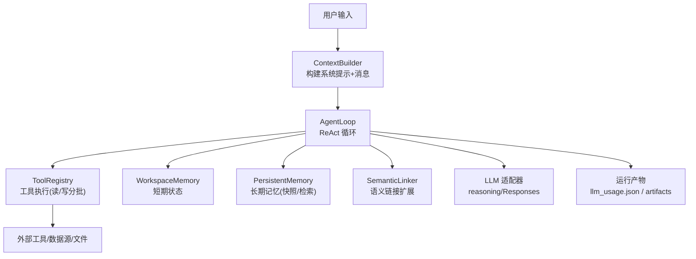
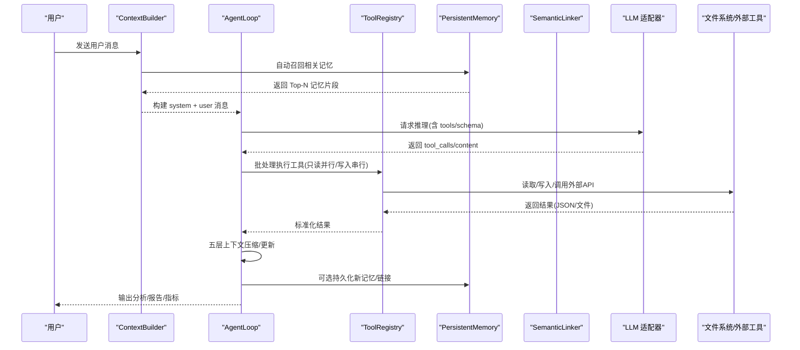
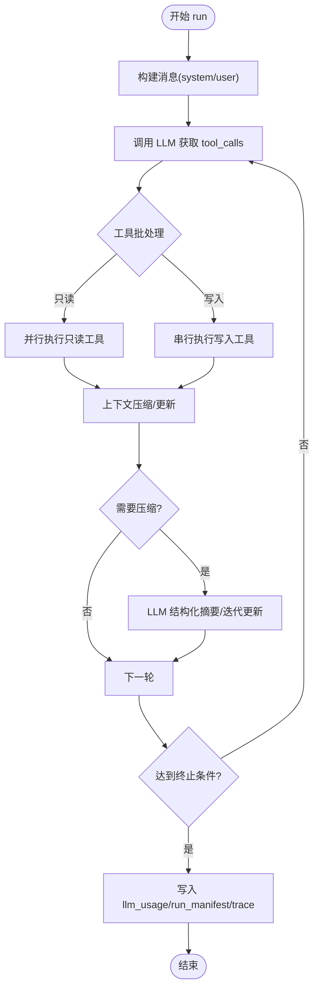
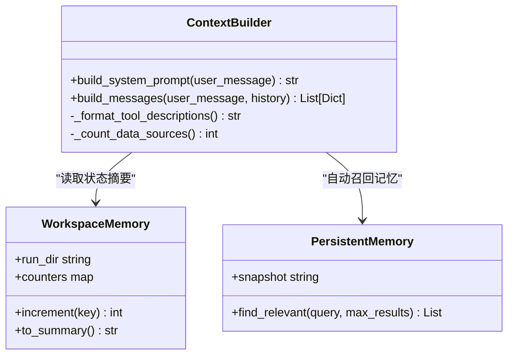
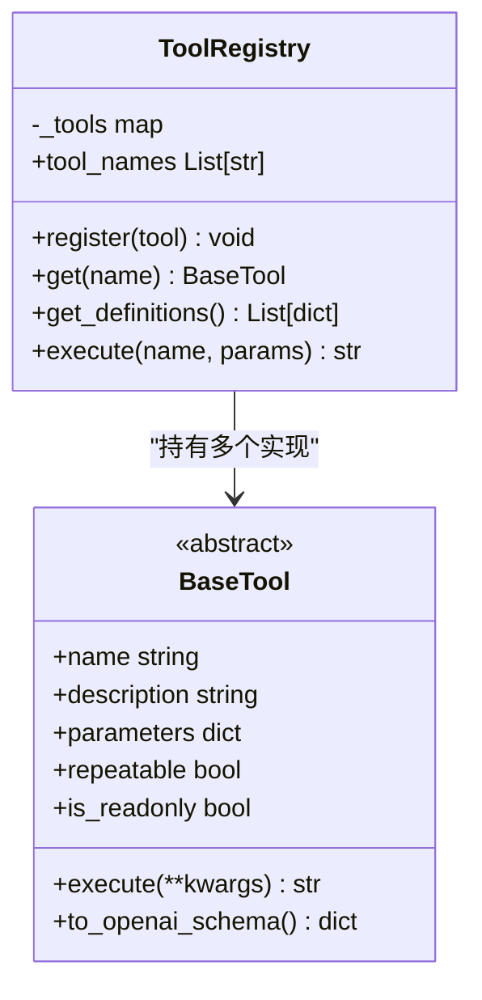
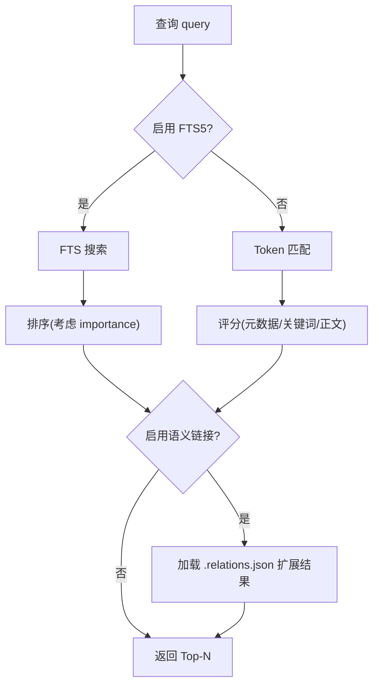
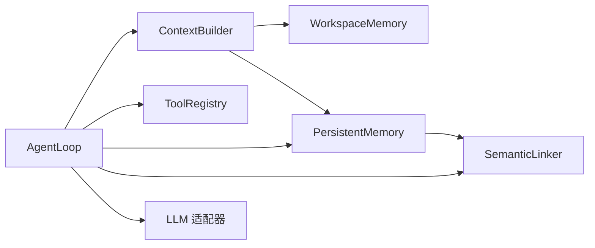

# 高级对话模式

<cite>
**本文引用的文件**
- [README.md](file://README.md)
- [context.py](file://agent/src/agent/context.py)
- [memory.py](file://agent/src/agent/memory.py)
- [loop.py](file://agent/src/agent/loop.py)
- [tools.py](file://agent/src/agent/tools.py)
- [persistent.py](file://agent/src/memory/persistent.py)
- [semantic_links.py](file://agent/src/memory/semantic_links.py)
- [llm.py](file://agent/src/providers/llm.py)
- [models.py](file://agent/src/api/models.py)
</cite>

## 目录
1. [简介](#简介)
2. [项目结构](#项目结构)
3. [核心组件](#核心组件)
4. [架构总览](#架构总览)
5. [详细组件分析](#详细组件分析)
6. [依赖关系分析](#依赖关系分析)
7. [性能考虑](#性能考虑)
8. [故障排查指南](#故障排查指南)
9. [结论](#结论)
10. [附录](#附录)

## 简介
本文件面向高级用户，系统化阐述 Vibe-Trading 的“高级对话模式”，聚焦复杂量化研究任务的对话编排技巧：多步骤分析、条件分支与结果验证；上下文管理与记忆机制（短期工作区记忆、长期持久化记忆、语义链接）；构建端到端自动化工作流（数据获取、因子计算、回测验证、结果分析）；与外部工具集成（API 调用、文件处理、批量操作）；并发与缓存优化；企业级部署最佳实践与故障恢复。

## 项目结构
围绕“对话编排”的关键代码集中在 agent 层：
- 对话循环与压缩：AgentLoop（五层上下文管理、批处理执行、使用量记录）
- 系统提示与消息组装：ContextBuilder（注入技能、工具、状态、持久化快照）
- 工具基础设施：BaseTool + ToolRegistry（统一注册、执行、OpenAI schema 导出）
- 短期记忆：WorkspaceMemory（run_dir、计数器）
- 长期记忆：PersistentMemory（文件存储、索引、去重、重要性衰减、FTS 可选）
- 语义链接：SemanticLinker（BM25 相似度、侧车 relations.json、wikilink 解析）
- LLM 适配：ChatLLM 包装（reasoning 字段、Responses API 路由）
- API 模型：BacktestMetrics、Artifact 等结构化响应

图表来源
- [loop.py:1-120](file://agent/src/agent/loop.py#L1-L120)
- [context.py:221-333](file://agent/src/agent/context.py#L221-L333)
- [tools.py:13-95](file://agent/src/agent/tools.py#L13-L95)
- [memory.py:13-54](file://agent/src/agent/memory.py#L13-L54)
- [persistent.py:200-455](file://agent/src/memory/persistent.py#L200-L455)
- [semantic_links.py:158-372](file://agent/src/memory/semantic_links.py#L158-L372)
- [llm.py:508-533](file://agent/src/providers/llm.py#L508-L533)

章节来源
- [README.md:1-166](file://README.md#L1-L166)

## 核心组件
- 对话编排中枢：AgentLoop
  - 五层上下文管理：microcompact、context_collapse、auto_compact、compact tool、iterative update
  - 工具执行批处理：连续只读工具并行执行，写入工具串行隔离
  - 使用量追踪：按 run 聚合 provider 上报 token 用量并落盘
- 上下文构建：ContextBuilder
  - 注入系统提示（原则、工具/技能摘要、当前日期、记忆快照）
  - 自动召回相关长期记忆并注入到用户消息中
- 工具体系：BaseTool + ToolRegistry
  - 统一 schema 导出、异常兜底 JSON 返回、只读标记用于批处理
- 短期记忆：WorkspaceMemory
  - 维护 run_dir 与工具调用计数，生成可压缩的状态摘要
- 长期记忆：PersistentMemory
  - 文件型跨会话记忆，支持层级目录、FTS 索引、重要性衰减、去重窗口
- 语义链接：SemanticLinker
  - BM25 相似度发现关联条目，保存 .relations.json 侧车文件，解析 wikilink
- LLM 适配：ChatLLM 包装
  - reasoning 捕获/回放、Responses API 路由、extra_content 清理

章节来源
- [loop.py:1-120](file://agent/src/agent/loop.py#L1-L120)
- [context.py:221-333](file://agent/src/agent/context.py#L221-L333)
- [tools.py:13-95](file://agent/src/agent/tools.py#L13-L95)
- [memory.py:13-54](file://agent/src/agent/memory.py#L13-L54)
- [persistent.py:200-455](file://agent/src/memory/persistent.py#L200-L455)
- [semantic_links.py:158-372](file://agent/src/memory/semantic_links.py#L158-L372)
- [llm.py:508-533](file://agent/src/providers/llm.py#L508-L533)

## 架构总览
下图展示一次典型“复杂量化研究任务”的对话编排流程：从用户输入到多步工具调用、条件分支、结果验证与归档。

图表来源
- [loop.py:1248-1581](file://agent/src/agent/loop.py#L1248-L1581)
- [context.py:354-390](file://agent/src/agent/context.py#L354-L390)
- [persistent.py:362-455](file://agent/src/memory/persistent.py#L362-L455)
- [semantic_links.py:179-230](file://agent/src/memory/semantic_links.py#L179-L230)
- [tools.py:72-84](file://agent/src/agent/tools.py#L72-L84)

## 详细组件分析

### AgentLoop：ReAct 核心循环与上下文压缩
- 功能要点
  - 五层上下文管理：在内存压力下裁剪旧工具结果、折叠长文本、LLM 结构化摘要、显式 compact 工具触发、迭代更新摘要
  - 工具批处理：识别只读工具并行执行，写入工具串行隔离，避免竞态
  - 使用量记录：归一化 provider 上报 token 数，按 iteration 累计并原子写入 llm_usage.json
  - 目标延续：结合 goal context 进行阶段推进与续写控制
- 关键路径
  - 消息构造后进入主循环，解析 assistant 的 tool_calls，调用 _batch_execute 执行
  - 每次工具执行后根据策略进行 microcompact/context_collapse/auto_compact
  - 结束时写入 run_manifest、trace、llm_usage 等审计与可复现产物

图表来源
- [loop.py:1-120](file://agent/src/agent/loop.py#L1-L120)
- [loop.py:1248-1581](file://agent/src/agent/loop.py#L1248-L1581)
- [loop.py:178-208](file://agent/src/agent/loop.py#L178-L208)

章节来源
- [loop.py:1-120](file://agent/src/agent/loop.py#L1-L120)
- [loop.py:178-208](file://agent/src/agent/loop.py#L178-L208)
- [loop.py:1248-1581](file://agent/src/agent/loop.py#L1248-L1581)

### ContextBuilder：系统提示与自动记忆注入
- 功能要点
  - 注入系统提示：包含六条输出原则、工具/技能描述、当前时间、工作区状态摘要
  - 自动召回：基于 PersistentMemory 的相关性检索，将 Top-N 记忆片段注入用户消息
  - 工具描述精简：仅保留短提示，完整 schema 通过 API tools 下发，降低 token 成本
- 设计考量
  - 系统提示稳定可缓存；每轮仅动态注入少量上下文
  - 记忆快照在会话开始时冻结，保证一致性

图表来源
- [context.py:221-333](file://agent/src/agent/context.py#L221-L333)
- [memory.py:13-54](file://agent/src/agent/memory.py#L13-L54)
- [persistent.py:200-224](file://agent/src/memory/persistent.py#L200-L224)

章节来源
- [context.py:221-333](file://agent/src/agent/context.py#L221-L333)
- [memory.py:13-54](file://agent/src/agent/memory.py#L13-L54)

### 工具基础设施：BaseTool + ToolRegistry
- 功能要点
  - BaseTool：定义 name/description/parameters/repeatable/is_readonly，提供 to_openai_schema
  - ToolRegistry：注册、查询、批量执行；异常时返回标准错误 JSON；暴露工具名列表
- 对编排的意义
  - is_readonly 标志驱动 AgentLoop 的并行批处理
  - 统一 schema 使 LLM 能准确选择工具与参数

图表来源
- [tools.py:13-95](file://agent/src/agent/tools.py#L13-L95)

章节来源
- [tools.py:13-95](file://agent/src/agent/tools.py#L13-L95)

### 短期记忆：WorkspaceMemory
- 作用：在同一 run 内共享 run_dir 与工具调用计数，生成可被压缩的状态摘要，帮助 LLM 记住当前工作进度
- 复杂度：O(1) 增量计数；摘要生成 O(k)（k 为计数器数量）

章节来源
- [memory.py:13-54](file://agent/src/agent/memory.py#L13-L54)

### 长期记忆：PersistentMemory
- 能力
  - 文件存储与索引：MEMORY.md 索引，扫描 .md 条目，解析 frontmatter
  - 相关性检索：FTS5 优先，失败回退到 token 匹配；支持权重与重要性衰减
  - 去重与锁：30 秒滑动窗口去重；跨进程文件锁
  - 层级组织：可选 MemoryHierarchy 路由
  - 语义链接：写入时自动发现关联条目并保存 .relations.json
- 复杂度
  - 检索：FTS 近似 O(log N)；token 扫描 O(N·T)（N 条目数，T 词表）
  - 写入：原子写入 + 索引更新 O(1)~O(N)

图表来源
- [persistent.py:362-455](file://agent/src/memory/persistent.py#L362-L455)
- [semantic_links.py:179-230](file://agent/src/memory/semantic_links.py#L179-L230)

章节来源
- [persistent.py:200-455](file://agent/src/memory/persistent.py#L200-L455)

### 语义链接：SemanticLinker
- 能力
  - BM25 相似度打分，阈值过滤与上限限制
  - 原子写入 .relations.json 侧车文件
  - 解析 wikilink [[id]] 显式引用
- 适用场景
  - 增强记忆检索的召回面，提升跨主题关联度
  - 支持知识图谱式导航（如策略→因子→回测报告）

章节来源
- [semantic_links.py:158-372](file://agent/src/memory/semantic_links.py#L158-L372)

### LLM 适配：reasoning 与 Responses API
- 能力
  - 捕获 reasoning_content，兼容不同 provider 的多轮工具调用
  - 当启用 Responses API 时，自动切换客户端并维持流式行为
  - 清理 extra_content 以避免下游不兼容

章节来源
- [llm.py:508-533](file://agent/src/providers/llm.py#L508-L533)

## 依赖关系分析
- 耦合关系
  - AgentLoop 强依赖 ContextBuilder、ToolRegistry、PersistentMemory、SemanticLinker、LLM 适配器
  - ContextBuilder 依赖 WorkspaceMemory 与 PersistentMemory
  - PersistentMemory 可选依赖 SemanticLinker 与 FTS5 索引
- 外部依赖
  - 数据源/工具：通过 ToolRegistry 暴露的工具访问外部 API、文件系统等
- 潜在环
  - 模块间以单向依赖为主，未见明显循环导入风险

图表来源
- [loop.py:1-120](file://agent/src/agent/loop.py#L1-L120)
- [context.py:221-333](file://agent/src/agent/context.py#L221-L333)
- [persistent.py:200-455](file://agent/src/memory/persistent.py#L200-L455)
- [semantic_links.py:158-372](file://agent/src/memory/semantic_links.py#L158-L372)
- [tools.py:13-95](file://agent/src/agent/tools.py#L13-L95)
- [llm.py:508-533](file://agent/src/providers/llm.py#L508-L533)

章节来源
- [loop.py:1-120](file://agent/src/agent/loop.py#L1-L120)
- [context.py:221-333](file://agent/src/agent/context.py#L221-L333)
- [persistent.py:200-455](file://agent/src/memory/persistent.py#L200-L455)
- [semantic_links.py:158-372](file://agent/src/memory/semantic_links.py#L158-L372)
- [tools.py:13-95](file://agent/src/agent/tools.py#L13-L95)
- [llm.py:508-533](file://agent/src/providers/llm.py#L508-L533)

## 性能考虑
- 并发处理
  - 只读工具并行执行，写入工具串行隔离，减少 I/O 竞争与状态不一致
- 缓存策略
  - 长期记忆：FTS5 加速检索；重要性衰减与访问奖励提高热点命中率
  - 运行产物：llm_usage.json 原子写入，避免中断导致损坏
- 资源管理
  - 五层上下文压缩控制 token 预算，避免超限
  - 文件锁与原子写入保障高并发下的稳定性
- 建议
  - 合理设置只读/写入工具分类，最大化并行收益
  - 开启 FTS5 与语义链接以提升检索效率与召回质量
  - 监控 llm_usage.json 中的 per_iteration 分布，定位瓶颈

[本节为通用指导，无需特定文件来源]

## 故障排查指南
- 常见问题
  - 工具执行失败：ToolRegistry.execute 会捕获异常并返回标准错误 JSON，便于上层重试或降级
  - 上下文过大：microcompact/context_collapse/auto_compact 协同工作，必要时手动触发 compact
  - 记忆写入冲突：memory_lock 超时保护，避免长时间阻塞
  - 提供者流式错误：ProviderStreamError 会被识别并记录，支持一次性重试
- 诊断手段
  - 查看 trace 与 run_manifest 确认方法学一致性与工具集
  - 检查 llm_usage.json 了解各 provider/model 的 token 消耗
  - 使用 PersistentMemory 的 FTS5 开关与日志定位检索问题

章节来源
- [tools.py:72-84](file://agent/src/agent/tools.py#L178-L208)
- [loop.py:1248-1581](file://agent/src/agent/loop.py#L1248-L1581)
- [persistent.py:41-73](file://agent/src/memory/persistent.py#L41-L73)
- [llm.py:508-533](file://agent/src/providers/llm.py#L508-L533)

## 结论
Vibe-Trading 的高级对话模式以 AgentLoop 为核心，结合 ContextBuilder 的上下文构建、工具批处理、五层上下文压缩与长期记忆/语义链接，形成一套可扩展、可审计、可复现的复杂量化研究编排框架。通过只读并行与写入串行的执行策略、原子写入与文件锁、以及 provider 适配层的健壮性设计，能够在企业级环境中稳定支撑多步骤分析、条件分支与结果验证的全流程自动化。

[本节为总结，无需特定文件来源]

## 附录
- 回测指标模型：BacktestMetrics 提供标准化回测指标字段，便于前后端一致渲染与比较
- 建议模板
  - 数据获取 → 因子计算 → 信号合成 → 回测验证 → 归因分析 → 报告归档
  - 在每个阶段明确输入/输出契约，利用 ToolRegistry 的 schema 约束与 Grounding 校验
  - 使用 PersistentMemory 记录关键假设、参数与结果，并通过 SemanticLinker 建立跨期关联

章节来源
- [models.py:10-38](file://agent/src/api/models.py#L10-L38)