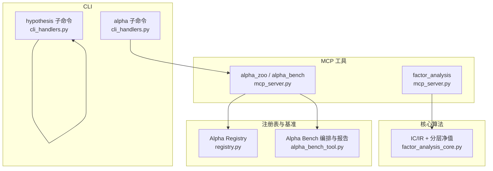
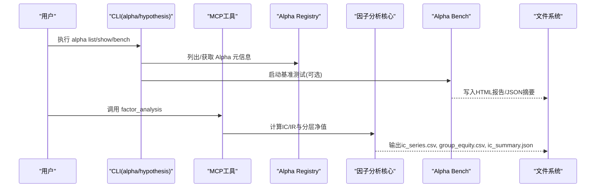
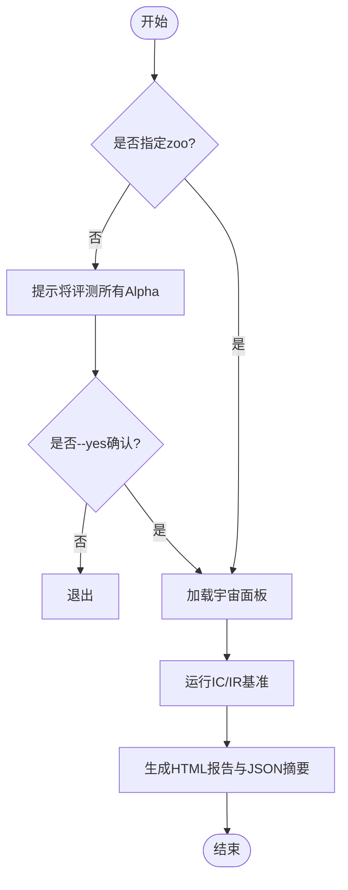
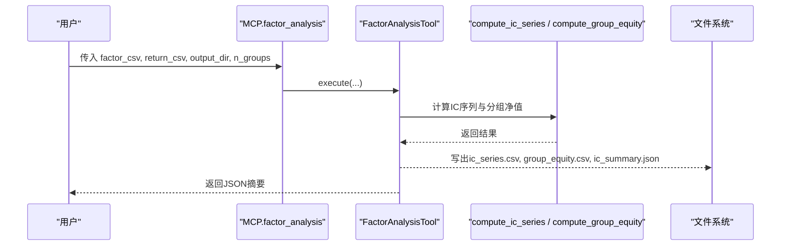
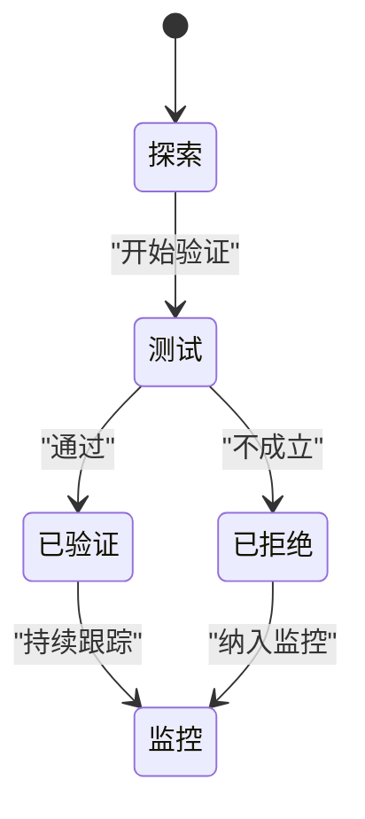
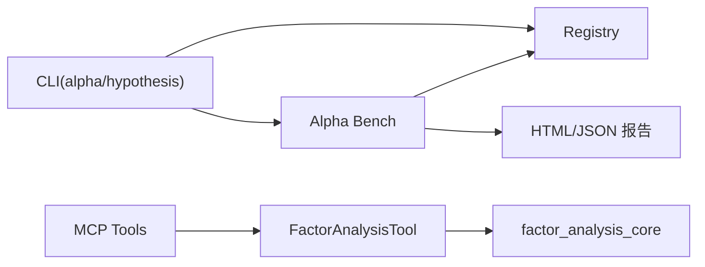

# 分析命令

<cite>
**本文引用的文件**
- [agent/src/factors/cli_handlers.py](file://agent/src/factors/cli_handlers.py)
- [agent/src/hypotheses/cli_handlers.py](file://agent/src/hypotheses/cli_handlers.py)
- [agent/src/factors/factor_analysis_core.py](file://agent/src/factors/factor_analysis_core.py)
- [agent/src/tools/factor_analysis_tool.py](file://agent/src/tools/factor_analysis_tool.py)
- [agent/mcp_server.py](file://agent/mcp_server.py)
- [agent/src/tools/alpha_bench_tool.py](file://agent/src/tools/alpha_bench_tool.py)
- [agent/src/factors/registry.py](file://agent/src/factors/registry.py)
- [agent/src/skills/alpha-zoo/SKILL.md](file://agent/src/skills/alpha-zoo/SKILL.md)
- [agent/src/skills/factor-research/SKILL.md](file://agent/src/skills/factor-research/SKILL.md)
- [agent/src/skills/multi-factor/SKILL.md](file://agent/src/skills/multi-factor/SKILL.md)
</cite>

## 目录
1. [简介](#简介)
2. [项目结构](#项目结构)
3. [核心组件](#核心组件)
4. [架构总览](#架构总览)
5. [详细组件分析](#详细组件分析)
6. [依赖关系分析](#依赖关系分析)
7. [性能与可观测性](#性能与可观测性)
8. [故障排查指南](#故障排查指南)
9. [结论](#结论)
10. [附录：命令速查与示例](#附录命令速查与示例)

## 简介
本文件面向数据分析相关命令，覆盖以下能力：
- Alpha 库查询与筛选（list/show）
- Alpha 基准测试（bench），输出 HTML 报告
- 因子分析（factor_analysis），基于用户提供的因子与收益 CSV 计算 IC/IR、分层回测净值
- 假设检验（hypothesis）注册表管理（list/show/invalidate）
并提供组合使用建议、结果解读方法与可视化报告生成指引。

## 项目结构
围绕“分析命令”的关键代码分布在 CLI 处理器、MCP 工具、因子分析核心算法、Alpha Zoo 注册表与基准测试工具中。整体组织方式如下：
- CLI 层：提供命令行入口与交互提示（alpha、hypothesis）
- MCP 工具层：对外暴露 factor_analysis、alpha_zoo、alpha_bench 等工具接口
- 核心算法：IC/IR 与分层回测的纯函数实现
- 注册表与基准：Alpha Zoo 元数据扫描、加载、校验；统一基准流程与 HTML 报告渲染

图表来源
- [agent/src/factors/cli_handlers.py:172-778](file://agent/src/factors/cli_handlers.py#L172-L778)
- [agent/src/hypotheses/cli_handlers.py:144-324](file://agent/src/hypotheses/cli_handlers.py#L144-L324)
- [agent/mcp_server.py:823-985](file://agent/mcp_server.py#L823-L985)
- [agent/src/factors/factor_analysis_core.py:8-103](file://agent/src/factors/factor_analysis_core.py#L8-L103)
- [agent/src/factors/registry.py:1-200](file://agent/src/factors/registry.py#L1-L200)
- [agent/src/tools/alpha_bench_tool.py:1-200](file://agent/src/tools/alpha_bench_tool.py#L1-L200)

章节来源
- [agent/src/factors/cli_handlers.py:172-778](file://agent/src/factors/cli_handlers.py#L172-L778)
- [agent/src/hypotheses/cli_handlers.py:144-324](file://agent/src/hypotheses/cli_handlers.py#L144-L324)
- [agent/mcp_server.py:823-985](file://agent/mcp_server.py#L823-L985)
- [agent/src/factors/factor_analysis_core.py:8-103](file://agent/src/factors/factor_analysis_core.py#L8-L103)
- [agent/src/factors/registry.py:1-200](file://agent/src/factors/registry.py#L1-L200)
- [agent/src/tools/alpha_bench_tool.py:1-200](file://agent/src/tools/alpha_bench_tool.py#L1-L200)

## 核心组件
- Alpha 库（Zoo）注册表：负责扫描、校验并懒加载内置因子，提供 list/get/compute/health/export-manifest 等能力。
- Alpha 基准测试：按宇宙（universe）+ 时间段运行 IC/IR 评估，生成 HTML 报告与 JSON 摘要。
- 因子分析工具：对任意因子 CSV 与收益 CSV 进行 Spearman IC、IR、分组回测净值计算，输出 ic_series.csv、ic_summary.json、group_equity.csv。
- 假设检验注册表：维护研究假设的生命周期状态（探索/测试/验证/拒绝/监控），支持列表、详情查看与标记失效。

章节来源
- [agent/src/factors/registry.py:1-200](file://agent/src/factors/registry.py#L1-L200)
- [agent/src/tools/alpha_bench_tool.py:1-200](file://agent/src/tools/alpha_bench_tool.py#L1-L200)
- [agent/src/tools/factor_analysis_tool.py:19-151](file://agent/src/tools/factor_analysis_tool.py#L19-L151)
- [agent/src/hypotheses/cli_handlers.py:144-324](file://agent/src/hypotheses/cli_handlers.py#L144-L324)

## 架构总览
下图展示从 CLI/MCP 到核心算法与报告的调用链。

图表来源
- [agent/src/factors/cli_handlers.py:172-778](file://agent/src/factors/cli_handlers.py#L172-L778)
- [agent/mcp_server.py:823-985](file://agent/mcp_server.py#L823-L985)
- [agent/src/factors/factor_analysis_core.py:8-103](file://agent/src/factors/factor_analysis_core.py#L8-L103)
- [agent/src/tools/alpha_bench_tool.py:1-200](file://agent/src/tools/alpha_bench_tool.py#L1-L200)

## 详细组件分析

### Alpha 库查询与基准测试（alpha）
- 功能要点
  - list：按 zoo/theme/universe 过滤，支持 --limit、--json、--include-load-errors（或 --show-failed）。
  - show：显示指定 alpha 的元信息与源码（优先从缓存路径读取，否则通过 importlib 获取）。
  - bench：选择单个 zoo 或全部 zoo，在指定 universe 与 period 上运行 IC/IR，输出 HTML 报告与 JSON 摘要；支持 strict 模式（随机控制、OOS 分割等）。
- 关键参数
  - universe：csi300/sp500/btc-usdt（需满足多标的要求）
  - period：YYYY-YYYY 或 YYYY-MM-DD/YYYY-MM-DD
  - top：报告包含的前 N 个 alpha
  - strict/--oos-split/--random-seeds：严格模式下的统计控制与样本外分割
- 输出
  - JSON 摘要：status、n_alphas_tested、n_skipped、top、report_path 等
  - HTML 报告：含排名、指标、失败原因、宇宙元信息等
- 注意事项
  - 未传 zoo 时会提示风险，需 --yes 确认
  - TUSHARE_TOKEN 缺失会给出修复指引
  - 报告路径受安全白名单限制（MCP 场景）

图表来源
- [agent/src/factors/cli_handlers.py:542-778](file://agent/src/factors/cli_handlers.py#L542-L778)
- [agent/src/tools/alpha_bench_tool.py:75-159](file://agent/src/tools/alpha_bench_tool.py#L75-L159)

章节来源
- [agent/src/factors/cli_handlers.py:172-778](file://agent/src/factors/cli_handlers.py#L172-L778)
- [agent/src/tools/alpha_bench_tool.py:1-200](file://agent/src/tools/alpha_bench_tool.py#L1-L200)

### 因子分析（factor_analysis）
- 功能要点
  - 输入：因子值 CSV（index=date，columns=codes）、收益 CSV（同结构）
  - 计算：Spearman 秩相关 IC、IR（IC/std）、按因子分组的等权分层回测累计净值
  - 输出：ic_series.csv、ic_summary.json、group_equity.csv
- 核心算法
  - compute_ic_series：按日计算因子与收益的秩相关，剔除当日有效样本不足（<5）的日期
  - compute_group_equity：每日按因子值分位数分组，计算组内平均收益并累积净值
- 使用入口
  - CLI：通过 alpha bench 间接产出 IC/IR 与报告
  - MCP：直接调用 factor_analysis 工具，适合自有因子评估

图表来源
- [agent/mcp_server.py:823-850](file://agent/mcp_server.py#L823-L850)
- [agent/src/tools/factor_analysis_tool.py:19-151](file://agent/src/tools/factor_analysis_tool.py#L19-L151)
- [agent/src/factors/factor_analysis_core.py:8-103](file://agent/src/factors/factor_analysis_core.py#L8-L103)

章节来源
- [agent/src/tools/factor_analysis_tool.py:19-151](file://agent/src/tools/factor_analysis_tool.py#L19-L151)
- [agent/src/factors/factor_analysis_core.py:8-103](file://agent/src/factors/factor_analysis_core.py#L8-L103)
- [agent/mcp_server.py:823-850](file://agent/mcp_server.py#L823-L850)

### 假设检验（hypothesis）
- 功能要点
  - list：列出假设，支持按状态过滤、限制行数、JSON 输出
  - show：查看假设详情（标题、状态、数据集、技能、关联 run cards 等）
  - invalidate：将假设标记为 rejected，并可记录失效说明
- 存储与路径
  - 默认路径由环境变量或 --path 覆盖
- 状态流转
  - exploring → testing → validated/rejected → monitoring

图表来源
- [agent/src/hypotheses/cli_handlers.py:144-324](file://agent/src/hypotheses/cli_handlers.py#L144-L324)

章节来源
- [agent/src/hypotheses/cli_handlers.py:144-324](file://agent/src/hypotheses/cli_handlers.py#L144-L324)

### 组合使用与最佳实践
- 推荐工作流
  - 先用 alpha list 浏览候选因子（可按 theme/universe 过滤）
  - 用 alpha show 查看元数据与公式，确认所需列与衰减期
  - 用 alpha bench 批量评估 zoo 或单因子，生成 HTML 报告
  - 对自定义因子，准备 factor_csv 与 return_csv，调用 factor_analysis 得到 IC/IR 与分组净值
  - 将多个有效因子通过 multi-factor 引擎合成信号，进入回测
- 注意事项
  - 收益必须为前瞻收益（避免未来函数）
  - 因子与收益的行列对齐（日期与标的一致）
  - 宇宙选择需满足多标的要求（如 btc-usdt 单标的不适合截面 IC）
  - 严格模式用于更稳健的统计判断（随机控制、OOS 分割）

章节来源
- [agent/src/skills/alpha-zoo/SKILL.md:1-26](file://agent/src/skills/alpha-zoo/SKILL.md#L1-L26)
- [agent/src/skills/factor-research/SKILL.md:1-36](file://agent/src/skills/factor-research/SKILL.md#L1-L36)
- [agent/src/skills/multi-factor/SKILL.md:59-79](file://agent/src/skills/multi-factor/SKILL.md#L59-L79)

## 依赖关系分析
- CLI 与 MCP
  - CLI 的 alpha 子命令通过本地处理器调用基准工具与注册表
  - MCP 暴露 factor_analysis、alpha_zoo、alpha_bench 工具，内部委托给对应实现
- 注册表与基准
  - Registry 负责 AST 解析与元数据校验，懒加载模块以 compute 因子
  - Alpha Bench 负责宇宙面板加载、IC/IR 计算、HTML 报告渲染
- 因子分析核心
  - 纯函数 compute_ic_series 与 compute_group_equity 被工具层复用

图表来源
- [agent/src/factors/cli_handlers.py:172-778](file://agent/src/factors/cli_handlers.py#L172-L778)
- [agent/mcp_server.py:823-985](file://agent/mcp_server.py#L823-L985)
- [agent/src/factors/registry.py:1-200](file://agent/src/factors/registry.py#L1-L200)
- [agent/src/tools/alpha_bench_tool.py:1-200](file://agent/src/tools/alpha_bench_tool.py#L1-L200)
- [agent/src/tools/factor_analysis_tool.py:19-151](file://agent/src/tools/factor_analysis_tool.py#L19-L151)

章节来源
- [agent/src/factors/cli_handlers.py:172-778](file://agent/src/factors/cli_handlers.py#L172-L778)
- [agent/mcp_server.py:823-985](file://agent/mcp_server.py#L823-L985)
- [agent/src/factors/registry.py:1-200](file://agent/src/factors/registry.py#L1-L200)
- [agent/src/tools/alpha_bench_tool.py:1-200](file://agent/src/tools/alpha_bench_tool.py#L1-L200)
- [agent/src/tools/factor_analysis_tool.py:19-151](file://agent/src/tools/factor_analysis_tool.py#L19-L151)

## 性能与可观测性
- 性能
  - 宇宙面板缓存：pickle 文件配合 HMAC-SHA256 侧车校验，避免重复网络请求与篡改风险
  - 并发：CSI300 构建采用多线程拉取，控制速率以避免限流
  - 进度条：Rich Progress 实时反馈基准进度
- 可观测性
  - JSON 摘要：便于自动化消费与集成
  - HTML 报告：包含排名、指标、失败原因、宇宙元信息，便于审阅与分享
  - 错误提示：TUSHARE_TOKEN 缺失时给出修复步骤

章节来源
- [agent/src/tools/alpha_bench_tool.py:1-200](file://agent/src/tools/alpha_bench_tool.py#L1-L200)
- [agent/src/factors/cli_handlers.py:416-539](file://agent/src/factors/cli_handlers.py#L416-L539)

## 故障排查指南
- 常见问题
  - 未设置 TUSHARE_TOKEN：导致 CSI300 面板加载失败，CLI 会给出注册与配置指引
  - 宇宙不支持：仅支持 csi300/sp500/btc-usdt；btc-usdt 单标的无法做截面 IC
  - 参数冲突：alpha_bench 要求 alpha_id 与 zoo 二选一；period 格式不正确会被拒绝
  - 报告写入受限：MCP 下输出目录需位于允许的安全根目录下
- 处理建议
  - 检查环境变量与网络连通性
  - 调整 universe/period/top 等参数
  - 使用 --verbose 查看完整堆栈
  - 若报告生成失败，不影响 JSON 摘要输出

章节来源
- [agent/src/factors/cli_handlers.py:152-164](file://agent/src/factors/cli_handlers.py#L152-L164)
- [agent/src/tools/alpha_bench_tool.py:75-159](file://agent/src/tools/alpha_bench_tool.py#L75-L159)
- [agent/mcp_server.py:885-985](file://agent/mcp_server.py#L885-L985)

## 结论
本项目提供了完整的“Alpha 库—基准测试—因子分析—假设管理”的分析闭环：
- 通过 alpha 命令快速浏览与评估内置因子，生成可视化报告
- 通过 factor_analysis 对自定义因子进行严谨的 IC/IR 与分层回测评估
- 通过 hypothesis 命令管理研究假设生命周期，形成可追溯的研究资产
结合 multi-factor 引擎，可将多个有效因子组合为策略信号，进入后续回测与实盘流程。

## 附录：命令速查与示例

- Alpha 库
  - 列出因子：vibe-trading alpha list [--zoo X] [--theme Y] [--universe Z] [--limit N] [--json]
  - 查看因子：vibe-trading alpha show <alpha_id> [--brief]
  - 基准测试：vibe-trading alpha bench --zoo X --universe csi300 --period 2020-2025 [--top N] [--strict]
- 因子分析
  - 调用工具：factor_analysis(factor_csv, return_csv, output_dir, n_groups=5)
  - 输出：ic_series.csv、ic_summary.json、group_equity.csv
- 假设检验
  - 列表：vibe-trading hypothesis list [--status ...] [--limit N] [--json]
  - 详情：vibe-trading hypothesis show <id> [--json]
  - 失效：vibe-trading hypothesis invalidate <id> [--note "..."] [--json]

章节来源
- [agent/src/factors/cli_handlers.py:172-778](file://agent/src/factors/cli_handlers.py#L172-L778)
- [agent/src/hypotheses/cli_handlers.py:144-324](file://agent/src/hypotheses/cli_handlers.py#L144-L324)
- [agent/src/tools/factor_analysis_tool.py:19-151](file://agent/src/tools/factor_analysis_tool.py#L19-L151)
- [agent/mcp_server.py:823-985](file://agent/mcp_server.py#L823-L985)