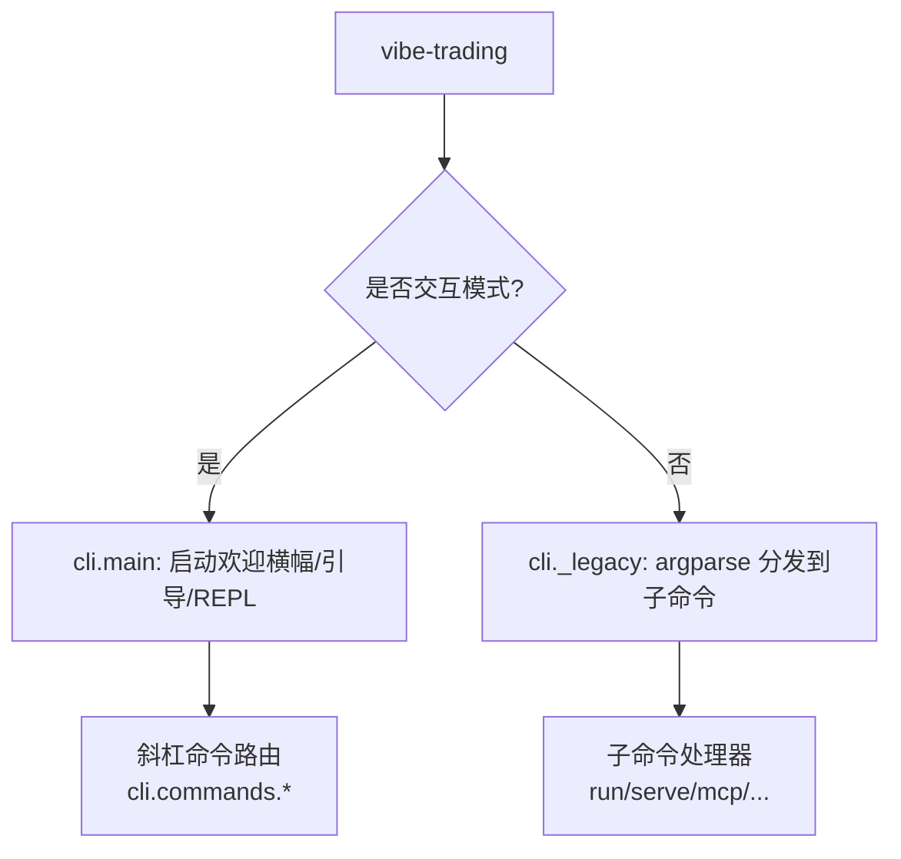
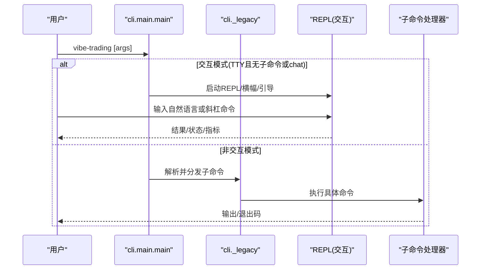
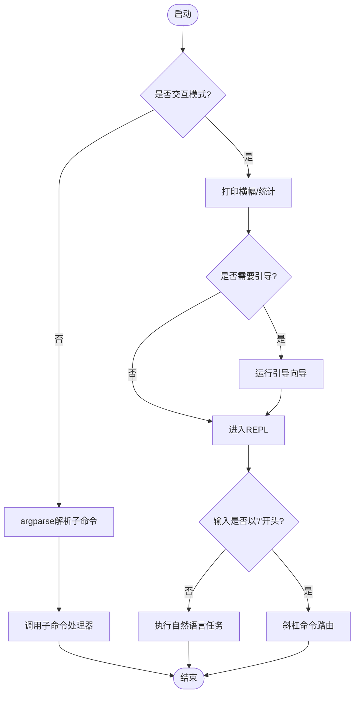

# 命令参考

<cite>
**本文引用的文件**
- [agent/cli/main.py](file://agent/cli/main.py)
- [agent/cli/_legacy.py](file://agent/cli/_legacy.py)
- [agent/cli/commands/chat.py](file://agent/cli/commands/chat.py)
- [agent/cli/commands/session.py](file://agent/cli/commands/session.py)
- [agent/cli/commands/slash_router.py](file://agent/cli/commands/slash_router.py)
- [agent/src/factors/cli_handlers.py](file://agent/src/factors/cli_handlers.py)
- [agent/src/hypotheses/cli_handlers.py](file://agent/src/hypotheses/cli_handlers.py)
</cite>

## 目录
1. [简介](#简介)
2. [项目结构](#项目结构)
3. [核心组件](#核心组件)
4. [架构总览](#架构总览)
5. [详细命令参考](#详细命令参考)
6. [依赖关系与执行顺序](#依赖关系与执行顺序)
7. [性能注意事项](#性能注意事项)
8. [故障诊断与错误码](#故障诊断与错误码)
9. [最佳实践](#最佳实践)
10. [结论](#结论)

## 简介
本参考文档面向 Vibe-Trading CLI 用户，系统化梳理所有支持的命令、参数、选项、默认值、使用示例与输出格式说明。内容覆盖：
- 聊天相关命令（chat、sessions/history/search/export）
- 回测命令（run、backtest）
- 数据分析命令（alpha、hypothesis）
- 系统管理命令（serve、mcp、dev、setup、init、list、show、resume）
- 会话内斜杠命令（/model、/clear、/journal、/shadow、/swarm、/debug、/quit、/help、/memory、/goal、/search、/skill、/show、/pine、/export、/playbook 等）
同时说明命令间的依赖关系、执行顺序、错误码与排错方法，并提供组合使用的最佳实践。

## 项目结构
Vibe-Trading CLI 的入口由主模块负责：
- 交互式模式：无子命令或 chat 时进入 REPL，支持斜杠命令与富文本面板
- 非交互式模式：其他子命令（serve、run、mcp、swarm、alpha、hypothesis 等）统一交由遗留解析器处理，保证向后兼容

图表来源
- [agent/cli/main.py:1455-1514](file://agent/cli/main.py#L1455-L1514)
- [agent/cli/_legacy.py:4764-4921](file://agent/cli/_legacy.py#L4764-L4921)

章节来源
- [agent/cli/main.py:1-18](file://agent/cli/main.py#L1-L18)
- [agent/cli/main.py:1455-1514](file://agent/cli/main.py#L1455-L1514)
- [agent/cli/_legacy.py:4764-4921](file://agent/cli/_legacy.py#L4764-L4921)

## 核心组件
- 入口与路由：cli.main.main 决定交互/非交互路径；对 chat 及 TTY 环境启用新 REPL
- 斜杠命令注册：cli.commands.slash_router 维护 SLASH_COMMANDS、别名与模糊匹配
- 聊天子命令：cli.commands.chat 提供 /model、/clear、/journal、/shadow、/swarm、/debug、/quit
- 会话子命令：cli.commands.session 提供 /history、/search、/export
- 遗留解析器：cli._legacy._build_parser 定义所有非交互子命令（serve、run、mcp、alpha、hypothesis、connector、data、channels、memory 等）

章节来源
- [agent/cli/main.py:219-268](file://agent/cli/main.py#L219-L268)
- [agent/cli/commands/slash_router.py:37-66](file://agent/cli/commands/slash_router.py#L37-L66)
- [agent/cli/commands/chat.py:224-244](file://agent/cli/commands/chat.py#L224-L244)
- [agent/cli/commands/session.py:81-95](file://agent/cli/commands/session.py#L81-L95)
- [agent/cli/_legacy.py:4764-4921](file://agent/cli/_legacy.py#L4764-L4921)

## 架构总览
CLI 在启动时根据参数与环境选择不同路径：
- 交互模式：打印横幅、可选首次引导、进入 REPL，支持斜杠命令与富文本渲染
- 非交互模式：通过 argparse 解析并调用对应子命令处理器

图表来源
- [agent/cli/main.py:1455-1514](file://agent/cli/main.py#L1455-L1514)
- [agent/cli/_legacy.py:4764-4921](file://agent/cli/_legacy.py#L4764-L4921)

## 详细命令参考

### 顶层命令
- vibe-trading
  - 用途：默认进入交互模式（TTY），否则进入非交互模式
  - 行为：若检测到缺少 provider .env，将运行首次引导向导
  - 示例：
    - vibe-trading
    - vibe-trading chat
- vibe-trading chat [--max-iter N|--max-iter=N]
  - 用途：以交互方式启动 ReAct 对话循环
  - 参数：
    - --max-iter：最大迭代次数，默认 50
  - 示例：
    - vibe-trading chat --max-iter 100
- vibe-trading serve [--host HOST] [--port PORT] [--dev]
  - 用途：启动 FastAPI 服务（后端）
  - 参数：
    - --host：监听地址，默认 127.0.0.1
    - --port：端口号，默认 8000
    - --dev：是否同时启动前端开发服务器
  - 示例：
    - vibe-trading serve --port 8899
- vibe-trading dev [--port PORT] [--frontend-port PORT] [--frontend-dir DIR]
  - 用途：一键启动后端+前端开发服务器
  - 参数：
    - --port：后端端口，默认 8899
    - --frontend-port：前端端口，默认 5899
    - --frontend-dir：前端目录，默认 frontend
  - 示例：
    - vibe-trading dev
- vibe-trading setup [--frontend-dir DIR]
  - 用途：安装前端依赖并构建生产包
  - 参数：
    - --frontend-dir：前端目录路径
  - 示例：
    - vibe-trading setup
- vibe-trading init
  - 用途：重新运行交互式设置向导（切换提供商/模型/凭据）
  - 示例：
    - vibe-trading init
- vibe-trading list [--limit N]
  - 用途：列出最近的运行记录
  - 参数：
    - --limit：显示数量，默认 20
  - 示例：
    - vibe-trading list --limit 50
- vibe-trading show <RUN_ID>
  - 用途：查看指定运行记录的详情
  - 参数：
    - RUN_ID：运行记录ID
  - 示例：
    - vibe-trading show abc123
- vibe-trading resume <SESSION_ID>
  - 用途：恢复指定会话并进入交互模式
  - 参数：
    - SESSION_ID：会话ID
  - 示例：
    - vibe-trading resume sess_abc

章节来源
- [agent/cli/main.py:1455-1514](file://agent/cli/main.py#L1455-L1514)
- [agent/cli/main.py:1550-1632](file://agent/cli/main.py#L1550-L1632)
- [agent/cli/main.py:1498-1502](file://agent/cli/main.py#L1498-L1502)

### 聊天相关命令（会话内斜杠命令）
以下命令在交互模式下通过“/”前缀触发，由 cli.commands.* 模块实现：
- /help
  - 用途：显示快捷键与命令列表
- /model
  - 用途：查看当前提供商/模型配置，提示如何切换
- /memory
  - 用途：查看/管理持久化记忆
- /history
  - 用途：浏览最近会话
- /goal
  - 用途：开始/检查金融研究目标
- /search <QUERY>
  - 用途：跨会话全文检索
  - 参数：
    - QUERY：搜索查询
- /swarm
  - 用途：多智能体预设（委员会/量化/风控）
- /skill
  - 用途：列出/加载/卸载技能
- /show
  - 用途：按ID展示历史运行
- /clear
  - 用途：清空当前对话并重新打印横幅
- /pine
  - 用途：导出当前策略为 Pine Script
- /journal <PATH>
  - 用途：分析交易流水 CSV
  - 参数：
    - PATH：CSV 文件路径
- /shadow [PATH]
  - 用途：训练/查看影子账户
  - 参数：
    - PATH：可选，交易流水路径用于训练
- /export
  - 用途：导出当前会话（md/json，Web UI 中可用）
- /debug
  - 用途：切换调试摘要（每轮后显示迭代、工具数、耗时、上下文估算）
- /quit（或 q、exit、:q）
  - 用途：退出交互模式

注意：
- 斜杠命令通过 cli.commands.slash_router 注册，支持别名与模糊匹配
- 部分命令（如 /journal、/shadow）会向交互循环排队一个代理任务，自动执行

章节来源
- [agent/cli/commands/slash_router.py:37-66](file://agent/cli/commands/slash_router.py#L37-L66)
- [agent/cli/commands/chat.py:224-244](file://agent/cli/commands/chat.py#L224-L244)
- [agent/cli/commands/session.py:81-95](file://agent/cli/commands/session.py#L81-L95)

### 回测命令
- vibe-trading run
  - 用途：执行一次策略请求（可来自命令行参数、文件或标准输入）
  - 典型参数（由遗留解析器定义）：
    - -p/--prompt：策略请求字符串
    - --prompt-file：从文件读取策略请求
    - --no-rich：禁用富文本输出
    - 其他参数由 _build_parser 的子命令定义
  - 示例：
    - vibe-trading run -p "Backtest AAPL MACD"
    - vibe-trading run --prompt-file prompt.txt
- vibe-trading backtest
  - 用途：执行回测（由遗留解析器定义）
  - 示例：
    - vibe-trading backtest ...

说明：
- run 与 backtest 的具体参数与选项由 cli._legacy._build_parser 及其子命令定义，遵循统一的 argparse 规范
- 输出包含运行 ID、指标摘要与仪表盘访问提示（需先启动 serve）

章节来源
- [agent/cli/_legacy.py:4764-4921](file://agent/cli/_legacy.py#L4764-L4921)

### 数据分析命令
- vibe-trading alpha
  - 用途：因子/Alpha 基准测试与分析
  - 子命令与参数由 src/factors/cli_handlers 定义
  - 示例：
    - vibe-trading alpha ...
- vibe-trading hypothesis
  - 用途：假设检验与分析
  - 子命令与参数由 src/hypotheses/cli_handlers 定义
  - 示例：
    - vibe-trading hypothesis ...

章节来源
- [agent/src/factors/cli_handlers.py:968-981](file://agent/src/factors/cli_handlers.py#L968-L981)
- [agent/src/hypotheses/cli_handlers.py:228-250](file://agent/src/hypotheses/cli_handlers.py#L228-L250)

### 系统管理命令
- vibe-trading mcp
  - 用途：启动 MCP（Model Context Protocol）服务
  - 示例：
    - vibe-trading mcp
- vibe-trading connector
  - 用途：连接器管理（状态/启动/停止/暂停/恢复/撤销）
  - 示例：
    - vibe-trading connector status
    - vibe-trading connector start robinhood-live-mcp
- vibe-trading data
  - 用途：数据路由模式（状态/免费/付费/用量）
  - 示例：
    - vibe-trading data status
    - vibe-trading data mode free
- vibe-trading channels
  - 用途：渠道管理（消息通道配置与运行）
  - 示例：
    - vibe-trading channels ...
- vibe-trading memory
  - 用途：记忆管理（增删改查）
  - 示例：
    - vibe-trading memory ...

章节来源
- [agent/cli/_legacy.py:4764-4921](file://agent/cli/_legacy.py#L4764-L4921)

## 依赖关系与执行顺序
- 入口判断：cli.main.main 根据 TTY 与参数决定交互或非交互路径
- 交互模式：
  - 打印横幅与统计信息
  - 必要时运行首次引导
  - 进入 REPL，支持斜杠命令与自然语言输入
  - 斜杠命令通过 slash_router 注册与匹配，分派到各 handler
- 非交互模式：
  - 通过 _build_parser 解析子命令与参数
  - 分发到对应处理器（run、backtest、serve、mcp、alpha、hypothesis、connector、data、channels、memory 等）

图表来源
- [agent/cli/main.py:219-268](file://agent/cli/main.py#L219-L268)
- [agent/cli/main.py:1455-1514](file://agent/cli/main.py#L1455-L1514)
- [agent/cli/_legacy.py:4764-4921](file://agent/cli/_legacy.py#L4764-L4921)

## 性能注意事项
- 交互模式下的横幅统计（模型名、技能数、工具数、会话数）采用懒加载与缓存，避免阻塞启动
- 工具计数与技能计数失败时回退到内置计数，确保用户体验稳定
- 调试模式（/debug）会在每轮后输出一行摘要，便于评估迭代次数、工具调用数、耗时与上下文大小估算
- 回测与数据分析命令可能涉及大量数据处理，建议在本地或高性能环境中运行，并合理设置迭代上限（--max-iter）

章节来源
- [agent/cli/main.py:122-211](file://agent/cli/main.py#L122-L211)
- [agent/cli/main.py:664-694](file://agent/cli/main.py#L664-L694)

## 故障诊断与错误码
- 退出码约定：
  - 0：成功
  - 1：运行失败
  - 2：用法错误或用户请求退出（如 /quit）
- 常见错误与处理：
  - 未知斜杠命令：提示“Did you mean...”建议
  - 导入失败：打印错误并继续（健壮性设计）
  - 保存/索引失败：最佳努力写入，不阻塞主流程
  - JSON 参数错误：给出可读的诊断信息与正确用法提示
- 排查步骤：
  - 使用 /help 查看可用命令
  - 使用 /debug 打开调试摘要，观察迭代与工具调用情况
  - 使用 list/show 查看运行记录与指标
  - 使用 serve 启动服务后通过 Web UI 查看仪表盘

章节来源
- [agent/cli/_legacy.py:71-79](file://agent/cli/_legacy.py#L71-L79)
- [agent/cli/main.py:553-642](file://agent/cli/main.py#L553-L642)
- [agent/cli/_legacy.py:268-286](file://agent/cli/_legacy.py#L268-L286)

## 最佳实践
- 首次使用：运行 vibe-trading init 配置提供商与模型，随后使用 vibe-trading chat 进入交互模式
- 单次任务：使用 vibe-trading run -p "..." 快速执行策略请求，或通过 --prompt-file 批量处理
- 回测与分析：结合 vibe-trading backtest 与 vibe-trading alpha/hypothesis 进行因子与假设验证
- 服务与可视化：运行 vibe-trading serve 启动后端，配合 Web UI 查看运行详情与仪表盘
- 会话管理：使用 /history 浏览会话，/search 全文检索，/export 导出会话内容
- 安全与可控：在交互模式中随时使用 /halt 或“停/stop/kill”触发全局暂停，使用 /resume 恢复
- 组合工作流：
  - 先用 vibe-trading run 执行策略，再用 vibe-trading show 查看结果
  - 在交互模式中用 /journal 分析交易流水，或用 /shadow 训练影子账户
  - 使用 /swarm 进行多智能体协作，提升研究与策略生成效率

## 结论
Vibe-Trading CLI 提供了完整的命令集，覆盖交互与非交互两种模式，支持聊天、回测、数据分析与系统管理等核心场景。通过清晰的命令路由、健壮的参数解析与友好的交互体验，用户可以高效地进行金融研究与策略验证。建议结合本文的命令参考与最佳实践，构建稳定的研究工作流。