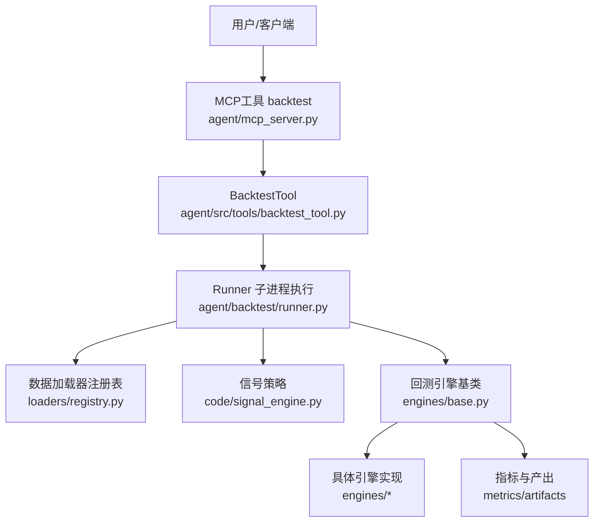
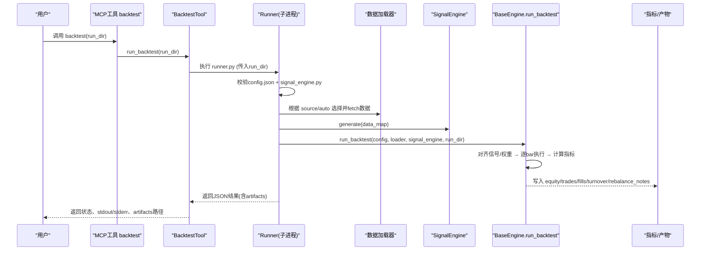
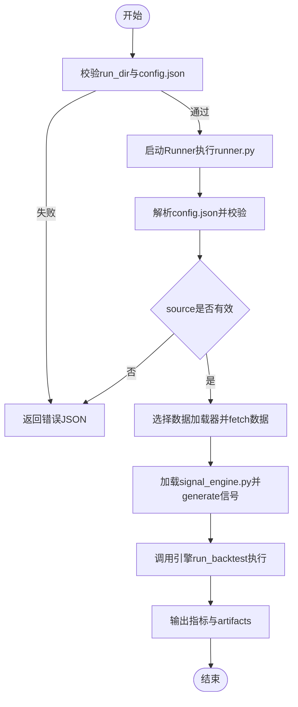
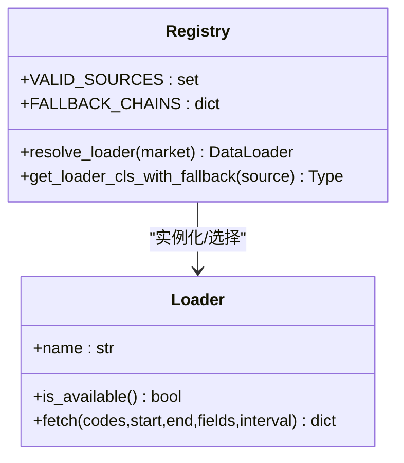
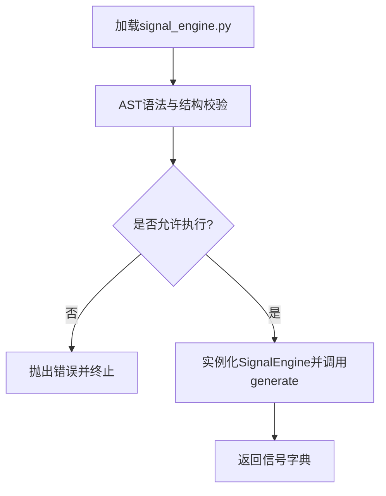
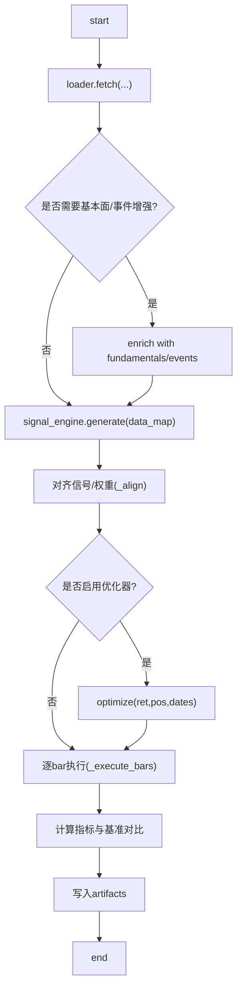
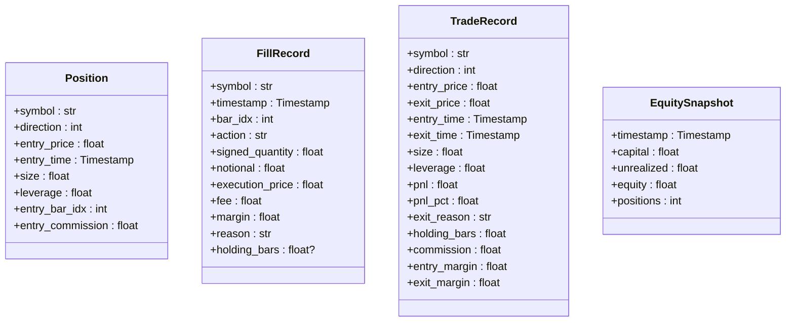
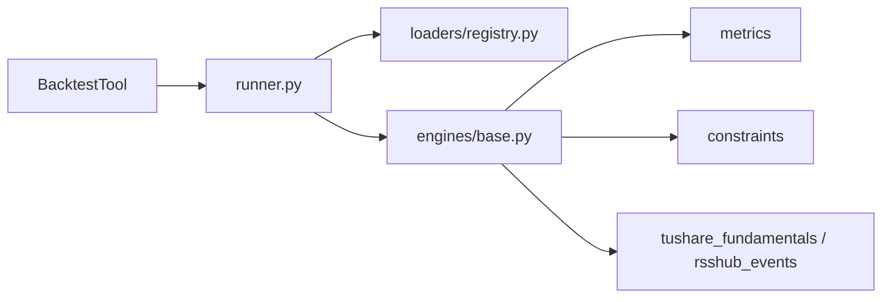

# 回测命令

<cite>
**本文引用的文件**
- [agent/backtest/runner.py](file://agent/backtest/runner.py)
- [agent/backtest/engines/base.py](file://agent/backtest/engines/base.py)
- [agent/backtest/models.py](file://agent/backtest/models.py)
- [agent/backtest/loaders/registry.py](file://agent/backtest/loaders/registry.py)
- [agent/src/tools/backtest_tool.py](file://agent/src/tools/backtest_tool.py)
- [agent/mcp_server.py](file://agent/mcp_server.py)
- [agent/src/skills/strategy-generate/SKILL.md](file://agent/src/skills/strategy-generate/SKILL.md)
</cite>

## 目录
1. [简介](#简介)
2. [项目结构](#项目结构)
3. [核心组件](#核心组件)
4. [架构总览](#架构总览)
5. [详细组件分析](#详细组件分析)
6. [依赖关系分析](#依赖关系分析)
7. [性能与调优](#性能与调优)
8. [故障排查指南](#故障排查指南)
9. [结论](#结论)
10. [附录：命令与参数速查](#附录：命令与参数速查)

## 简介
本文件面向“回测”相关命令与执行流程，覆盖 run、backtest 等入口的完整语法、参数配置、数据源选择、策略接入、优化器与约束、结果可视化与指标解读，以及常见场景的最佳实践与注意事项。文档基于仓库中的回测运行器、引擎基类、数据加载器注册表、工具封装与技能说明进行整理，确保与实际实现一致。

## 项目结构
回测能力由“命令/工具层 → 运行器 → 引擎 → 数据加载器 → 信号策略”构成。关键路径如下：
- 命令/工具层：MCP 工具 backtest、Agent 工具 backtest、CLI 命令（通过 slash_router 注册）
- 运行器：读取 config.json，校验并选择数据源，导入 signal_engine.py，调用引擎执行
- 引擎：统一 bar-by-bar 执行循环，市场规则可定制（涨跌停、滑点、手续费、合约乘数等）
- 数据加载器：按市场类型自动或显式选择数据源，支持多源回退链
- 信号策略：用户实现的 SignalEngine.generate(data_map) → Dict[str, pd.Series]

图表来源
- [agent/mcp_server.py:792-815](file://agent/mcp_server.py#L792-L815)
- [agent/src/tools/backtest_tool.py:15-74](file://agent/src/tools/backtest_tool.py#L15-L74)
- [agent/backtest/runner.py:1-8](file://agent/backtest/runner.py#L1-L8)
- [agent/backtest/loaders/registry.py:1-60](file://agent/backtest/loaders/registry.py#L1-L60)
- [agent/backtest/engines/base.py:652-723](file://agent/backtest/engines/base.py#L652-L723)

章节来源
- [agent/backtest/runner.py:1-8](file://agent/backtest/runner.py#L1-L8)
- [agent/backtest/loaders/registry.py:1-60](file://agent/backtest/loaders/registry.py#L1-L60)
- [agent/backtest/engines/base.py:652-723](file://agent/backtest/engines/base.py#L652-L723)
- [agent/src/tools/backtest_tool.py:15-74](file://agent/src/tools/backtest_tool.py#L15-L74)
- [agent/mcp_server.py:792-815](file://agent/mcp_server.py#L792-L815)

## 核心组件
- 运行器 runner.py：负责读取 config.json、校验参数、选择数据源、安全校验并加载 signal_engine.py、驱动引擎执行、输出指标与产物
- 引擎 base.py：提供统一的 run_backtest 流水线（数据→信号→权重对齐→逐bar执行→指标计算→产物写入），子类实现市场规则
- 数据加载器 registry.py：维护 VALID_SOURCES、FALLBACK_CHAINS，提供 resolve_loader/get_loader_cls_with_fallback
- 模型 models.py：Position/FillRecord/TradeRecord/EquitySnapshot 等不可变记录，用于追踪与指标计算
- 工具 backtest_tool.py：对外暴露 backtest 工具，校验 run_dir 与 config.json，调用 Runner 执行
- MCP 服务 mcp_server.py：将 backtest 工具暴露为 MCP 接口
- 技能 SKILL.md：给出 config.json 字段参考（source、interval、optimizer、engine、position_adjustment、initial_cash、commission、validation 等）

章节来源
- [agent/backtest/runner.py:68-163](file://agent/backtest/runner.py#L68-L163)
- [agent/backtest/engines/base.py:377-723](file://agent/backtest/engines/base.py#L377-L723)
- [agent/backtest/models.py:13-118](file://agent/backtest/models.py#L13-L118)
- [agent/backtest/loaders/registry.py:23-60](file://agent/backtest/loaders/registry.py#L23-L60)
- [agent/src/tools/backtest_tool.py:15-74](file://agent/src/tools/backtest_tool.py#L15-L74)
- [agent/mcp_server.py:792-815](file://agent/mcp_server.py#L792-L815)
- [agent/src/skills/strategy-generate/SKILL.md:134-160](file://agent/src/skills/strategy-generate/SKILL.md#L134-L160)

## 架构总览
下图展示一次回测从命令到产物的完整时序。

图表来源
- [agent/mcp_server.py:792-815](file://agent/mcp_server.py#L792-L815)
- [agent/src/tools/backtest_tool.py:15-74](file://agent/src/tools/backtest_tool.py#L15-L74)
- [agent/backtest/runner.py:1216-1250](file://agent/backtest/runner.py#L1216-L1250)
- [agent/backtest/engines/base.py:652-723](file://agent/backtest/engines/base.py#L652-L723)

## 详细组件分析

### 命令入口与执行流程
- MCP 工具 backtest：接收 run_dir，内部调用 BacktestTool.run_backtest
- BacktestTool：校验 run_dir、config.json、source 合法性，使用 Runner 以子进程方式执行 agent/backtest/runner.py
- runner.py：读取并校验 config.json；定位 code/signal_engine.py；选择数据源；执行引擎；输出 JSON 结果与 artifacts

图表来源
- [agent/src/tools/backtest_tool.py:15-74](file://agent/src/tools/backtest_tool.py#L15-L74)
- [agent/backtest/runner.py:1216-1250](file://agent/backtest/runner.py#L1216-L1250)
- [agent/backtest/loaders/registry.py:614-649](file://agent/backtest/loaders/registry.py#L614-L649)

章节来源
- [agent/mcp_server.py:792-815](file://agent/mcp_server.py#L792-L815)
- [agent/src/tools/backtest_tool.py:15-74](file://agent/src/tools/backtest_tool.py#L15-L74)
- [agent/backtest/runner.py:1216-1250](file://agent/backtest/runner.py#L1216-L1250)

### 数据源选择与回退链
- 支持显式 source 或 auto 自动路由（按代码格式识别市场）
- 注册表维护 VALID_SOURCES 与 FALLBACK_CHAINS，按市场类型依次尝试可用加载器
- 某些源（如 local、tickerall、qveris）不允许静默降级到网络源，避免掩盖配置问题

图表来源
- [agent/backtest/loaders/registry.py:23-60](file://agent/backtest/loaders/registry.py#L23-L60)
- [agent/backtest/loaders/registry.py:139-158](file://agent/backtest/loaders/registry.py#L139-L158)
- [agent/backtest/loaders/registry.py:614-649](file://agent/backtest/loaders/registry.py#L614-L649)
- [agent/backtest/loaders/registry.py:199-256](file://agent/backtest/loaders/registry.py#L199-L256)

章节来源
- [agent/backtest/loaders/registry.py:23-60](file://agent/backtest/loaders/registry.py#L23-L60)
- [agent/backtest/loaders/registry.py:139-158](file://agent/backtest/loaders/registry.py#L139-L158)
- [agent/backtest/loaders/registry.py:614-649](file://agent/backtest/loaders/registry.py#L614-L649)
- [agent/backtest/loaders/registry.py:199-256](file://agent/backtest/loaders/registry.py#L199-L256)

### 策略接入与安全沙箱
- 策略需实现 SignalEngine 类并提供 generate(data_map) → Dict[str, pd.Series]
- 运行器在导入前对 signal_engine.py 做 AST 静态检查，禁止危险操作（网络、进程、文件系统写入、动态执行等），并在运行时可达路径扫描中拒绝非法调用
- 要求 __init__ 无必需参数，便于 runner 直接实例化

图表来源
- [agent/backtest/runner.py:215-230](file://agent/backtest/runner.py#L215-L230)
- [agent/backtest/runner.py:324-416](file://agent/backtest/runner.py#L324-L416)
- [agent/backtest/runner.py:786-837](file://agent/backtest/runner.py#L786-L837)

章节来源
- [agent/backtest/runner.py:215-230](file://agent/backtest/runner.py#L215-L230)
- [agent/backtest/runner.py:324-416](file://agent/backtest/runner.py#L324-L416)
- [agent/backtest/runner.py:786-837](file://agent/backtest/runner.py#L786-L837)

### 回测引擎与执行流水线
- BaseEngine.run_backtest 统一流程：
  - 数据加载与可选基本面/事件增强
  - 信号生成与对齐（shift+归一化，支持优化器）
  - 逐bar执行（市场规则：涨跌停、滑点、手续费、合约乘数等）
  - 指标计算（收益、回撤、夏普、换手率、基准对比等）
  - 产物写入（equity、trades、fills、rebalance notes 等）

图表来源
- [agent/backtest/engines/base.py:652-723](file://agent/backtest/engines/base.py#L652-L723)
- [agent/backtest/engines/base.py:358-385](file://agent/backtest/engines/base.py#L358-L385)
- [agent/backtest/engines/base.py:282-371](file://agent/backtest/engines/base.py#L282-L371)

章节来源
- [agent/backtest/engines/base.py:652-723](file://agent/backtest/engines/base.py#L652-L723)
- [agent/backtest/engines/base.py:358-385](file://agent/backtest/engines/base.py#L358-L385)
- [agent/backtest/engines/base.py:282-371](file://agent/backtest/engines/base.py#L282-L371)

### 数据与记录模型
- Position：持仓信息（方向、入场价、时间、数量、杠杆、佣金等）
- FillRecord：单笔成交证据（符号、时间、动作、数量、名义值、价格、费用、保证金、原因、持有bar数）
- TradeRecord：完整交易闭环（进出场价/时间、盈亏、百分比、原因、持有bar数、佣金、保证金）
- EquitySnapshot：权益快照（时间、现金、未实现盈亏、权益、持仓数）

图表来源
- [agent/backtest/models.py:13-118](file://agent/backtest/models.py#L13-L118)

章节来源
- [agent/backtest/models.py:13-118](file://agent/backtest/models.py#L13-L118)

## 依赖关系分析
- 命令/工具层依赖 Runner 与 BacktestTool
- Runner 依赖 loaders.registry 选择数据源，依赖 engines.base 执行回测
- 引擎依赖 metrics、constraints、fundamentals/events 增强模块
- 数据加载器通过注册表统一管理，支持按市场类型的回退链

图表来源
- [agent/src/tools/backtest_tool.py:15-74](file://agent/src/tools/backtest_tool.py#L15-L74)
- [agent/backtest/runner.py:30-47](file://agent/backtest/runner.py#L30-L47)
- [agent/backtest/engines/base.py:26-44](file://agent/backtest/engines/base.py#L26-L44)
- [agent/backtest/loaders/registry.py:23-60](file://agent/backtest/loaders/registry.py#L23-L60)

章节来源
- [agent/src/tools/backtest_tool.py:15-74](file://agent/src/tools/backtest_tool.py#L15-L74)
- [agent/backtest/runner.py:30-47](file://agent/backtest/runner.py#L30-L47)
- [agent/backtest/engines/base.py:26-44](file://agent/backtest/engines/base.py#L26-L44)
- [agent/backtest/loaders/registry.py:23-60](file://agent/backtest/loaders/registry.py#L23-L60)

## 性能与调优
- 频率与数据量：分钟级回测数据量大，建议限制范围（例如 1m 不超过30天，1H 不超过1年）
- 年化因子：不同频率自动推断（A股按252交易日，加密资产按365日历日）
- 优化器与约束：
  - optimizer 可选 equal_volatility、risk_parity、mean_variance、max_diversification、turnover_aware
  - optimizer_params 可调参（如 lookback、risk_free、risk_aversion、turnover_penalty）
  - constraints 作用于优化器输出，需配合 optimizer 使用
- 仓位调整模式：
  - position_adjustment="hold"：保持同向持仓直至平仓或反转
  - position_adjustment="rebalance"：每次目标变化均按市价加权平均入场执行
- 基准对比：可通过 benchmark 指定外部基准，系统会获取并计算超额收益
- 统计验证：支持 monte_carlo、bootstrap、walk_forward 等后验检验

章节来源
- [agent/src/skills/strategy-generate/SKILL.md:134-160](file://agent/src/skills/strategy-generate/SKILL.md#L134-L160)
- [agent/backtest/engines/base.py:358-385](file://agent/backtest/engines/base.py#L358-L385)
- [agent/backtest/engines/base.py:652-723](file://agent/backtest/engines/base.py#L652-L723)

## 故障排查指南
- 缺少 config.json 或 source 字段：工具会返回错误提示
- source 不在 VALID_SOURCES：会被拒绝
- 数据源不可用：若显式请求 local/tickerall/qveris 且不可用，不会静默降级；否则按市场回退链尝试
- 信号函数返回类型不符：必须返回 Dict[str, pd.Series]
- 初始资金非正或无穷/NaN：配置校验阶段即拒绝，防止指标出现 inf/NaN
- 日期无效或 start > end：Pydantic 校验阶段报错
- 不支持的 interval/engine：校验阶段报错

章节来源
- [agent/src/tools/backtest_tool.py:15-74](file://agent/src/tools/backtest_tool.py#L15-L74)
- [agent/backtest/runner.py:68-163](file://agent/backtest/runner.py#L68-L163)
- [agent/backtest/loaders/registry.py:199-256](file://agent/backtest/loaders/registry.py#L199-L256)
- [agent/backtest/engines/base.py:920-939](file://agent/backtest/engines/base.py#L920-L939)

## 结论
本回测体系通过“命令/工具 → 运行器 → 引擎 → 数据加载器 → 信号策略”的分层设计，提供了灵活的数据源选择、安全的策略执行环境、可扩展的优化器与约束、完善的指标与产物输出。结合合理的频率与参数设置，可在多市场环境下高效完成策略研究与评估。

## 附录：命令与参数速查
- 命令入口
  - MCP 工具：backtest(run_dir)
  - Agent 工具：BacktestTool.execute(run_dir)
  - CLI：通过 slash_router 注册（当前注册表中未见独立 backtest 命令名，实际通过工具/MCP 调用）
- 运行目录结构
  - run_dir/config.json：回测配置
  - run_dir/code/signal_engine.py：策略信号生成代码
- 常用配置项（来自技能说明）
  - source：auto 或具体数据源（yfinance、okx、tushare、akshare、ccxt 等）
  - interval：1m/5m/15m/30m/1H/4H/1D
  - extra_fields：如 A 股的 pe/pb/roe 等
  - fundamental_fields：财务报表字段映射（如 income、fina_indicator）
  - optimizer：equal_volatility/risk_parity/mean_variance/max_diversification/turnover_aware/null
  - optimizer_params：各优化器参数
  - engine：daily 或 options
  - position_adjustment：hold 或 rebalance
  - initial_cash：默认 1,000,000
  - commission：默认 0.1%
  - validation：monte_carlo/bootstrap/walk_forward 组合

章节来源
- [agent/mcp_server.py:792-815](file://agent/mcp_server.py#L792-L815)
- [agent/src/tools/backtest_tool.py:15-74](file://agent/src/tools/backtest_tool.py#L15-L74)
- [agent/src/skills/strategy-generate/SKILL.md:134-160](file://agent/src/skills/strategy-generate/SKILL.md#L134-L160)