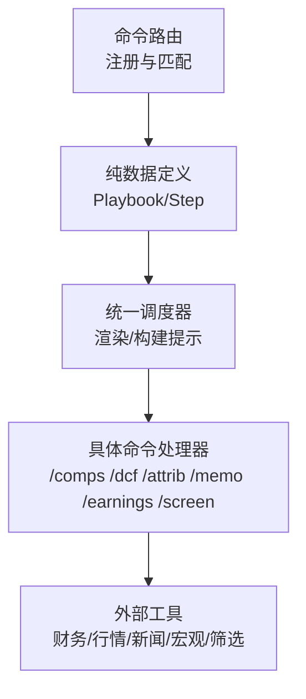
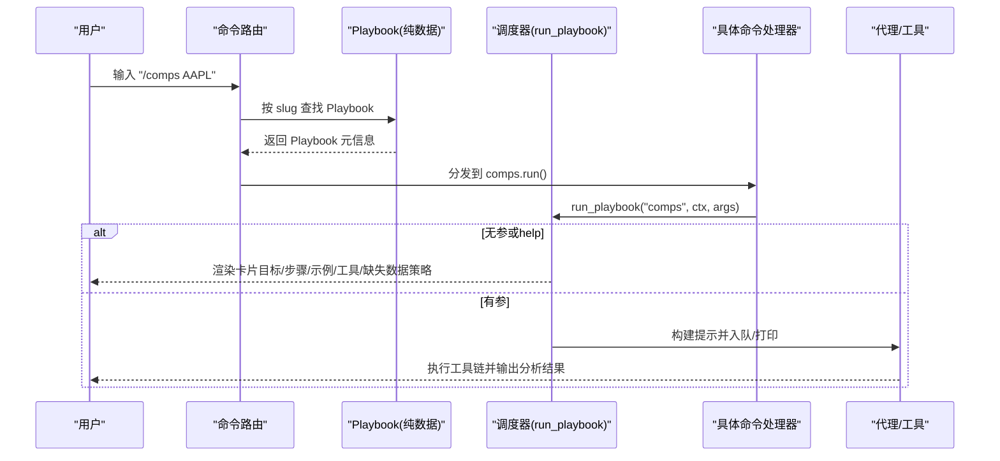
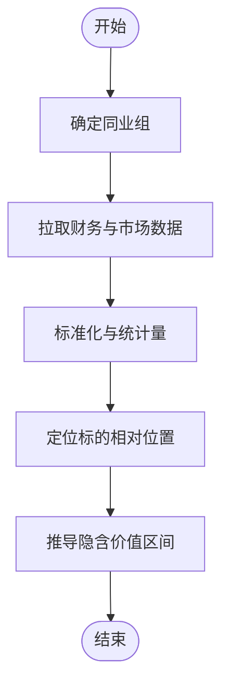
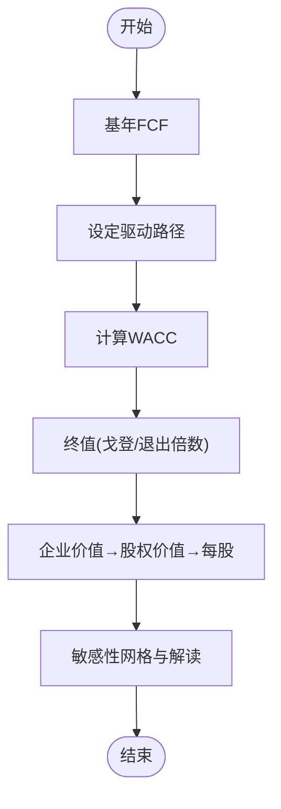
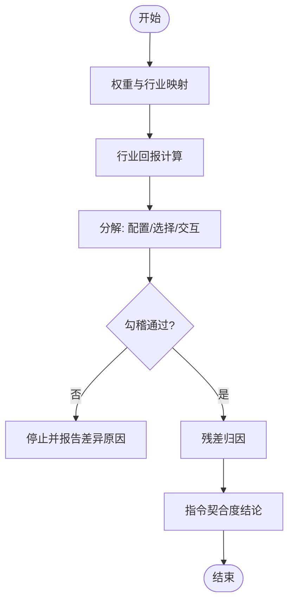
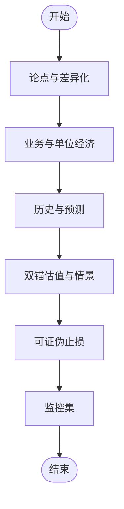
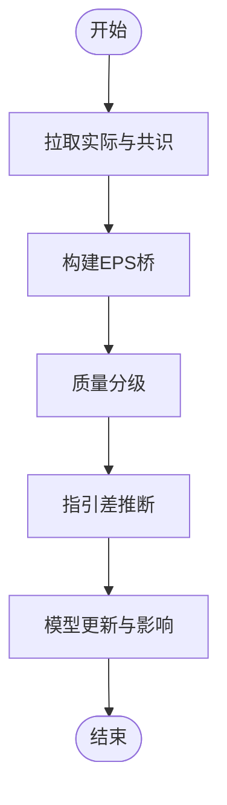
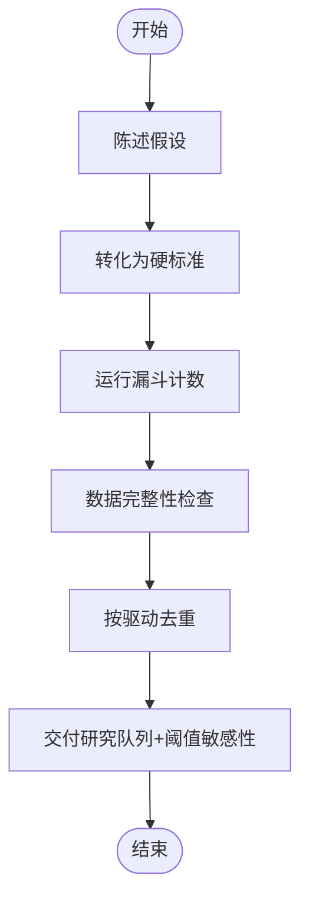

# 机构命令

<cite>
**本文引用的文件**
- [slash_router.py](file://agent/cli/commands/slash_router.py)
- [__init__.py（institutional）](file://agent/cli/commands/institutional/__init__.py)
- [playbooks.py](file://agent/cli/commands/institutional/playbooks.py)
- [runner.py](file://agent/cli/commands/institutional/runner.py)
- [comps.py](file://agent/cli/commands/institutional/comps.py)
- [dcf.py](file://agent/cli/commands/institutional/dcf.py)
- [attrib.py](file://agent/cli/commands/institutional/attrib.py)
- [memo.py](file://agent/cli/commands/institutional/memo.py)
- [earnings.py](file://agent/cli/commands/institutional/earnings.py)
- [screen.py](file://agent/cli/commands/institutional/screen.py)
</cite>

## 目录
1. [简介](#简介)
2. [项目结构](#项目结构)
3. [核心组件](#核心组件)
4. [架构总览](#架构总览)
5. [详细组件分析](#详细组件分析)
6. [依赖关系分析](#依赖关系分析)
7. [性能与可用性考虑](#性能与可用性考虑)
8. [故障排查指南](#故障排查指南)
9. [结论](#结论)
10. [附录：使用示例与术语解释](#附录使用示例与术语解释)

## 简介
本文件面向机构级研究工作流，系统化说明“机构命令”模块中的专业分析能力，包括可比公司分析、折现现金流估值、业绩归因、投资备忘录、盈利桥与系统筛选等。这些命令以“可执行骨架 + 数值示例 + 缺失数据策略”的方式，将卖方/买方常见流程固化为可发现、可复现的 slash 命令，便于在交互式环境中一键触发并产出结构化结果。

## 项目结构
- 入口注册：通过命令路由模块在导入时自动注册机构级命令及其别名，确保帮助菜单、补全和模糊匹配均可见。
- 纯数据定义：所有命令的“步骤、目标、工具、示例、缺失数据策略”集中在纯数据模块中，避免循环依赖与运行时开销。
- 统一调度器：每个具体命令仅暴露一个薄包装函数，统一调用共享调度器进行渲染或提示构建。
- 命令清单：当前包含 comps、dcf、attrib、memo、earnings、screen 六个工作流。

图表来源
- [slash_router.py:69-121](file://agent/cli/commands/slash_router.py#L69-L121)
- [playbooks.py:34-83](file://agent/cli/commands/institutional/playbooks.py#L34-L83)
- [runner.py:55-157](file://agent/cli/commands/institutional/runner.py#L55-L157)
- [comps.py:17-27](file://agent/cli/commands/institutional/comps.py#L17-L27)
- [dcf.py:17-27](file://agent/cli/commands/institutional/dcf.py#L17-L27)
- [attrib.py:16-26](file://agent/cli/commands/institutional/attrib.py#L16-L26)
- [memo.py:17-27](file://agent/cli/commands/institutional/memo.py#L17-L27)
- [earnings.py:16-26](file://agent/cli/commands/institutional/earnings.py#L16-L26)
- [screen.py:16-26](file://agent/cli/commands/institutional/screen.py#L16-L26)

章节来源
- [slash_router.py:69-121](file://agent/cli/commands/slash_router.py#L69-L121)
- [__init__.py（institutional）:1-29](file://agent/cli/commands/institutional/__init__.py#L1-L29)

## 核心组件
- 命令注册与别名：在导入时把机构级命令追加到全局命令表，并注入别名，保证帮助与补全一致。
- Playbook/Step 模型：用不可变数据结构描述每个工作流的“目标、用法、示例、步骤、数值示例、推荐工具、缺失数据策略”。
- 统一调度器：负责三种路径
  - 无参/help：渲染完整卡片（目标、步骤、示例、工具、缺失数据策略、免责声明）。
  - 有参：构建结构化提示并写入上下文待处理队列；若不支持队列则直接打印提示以便粘贴。
  - 未知 slug：返回错误码。
- 各命令处理器：每个命令仅一行转发到调度器，保持职责单一、易于扩展。

章节来源
- [slash_router.py:69-121](file://agent/cli/commands/slash_router.py#L69-L121)
- [playbooks.py:34-83](file://agent/cli/commands/institutional/playbooks.py#L34-L83)
- [runner.py:55-157](file://agent/cli/commands/institutional/runner.py#L55-L157)
- [runner.py:160-206](file://agent/cli/commands/institutional/runner.py#L160-L206)
- [comps.py:17-27](file://agent/cli/commands/institutional/comps.py#L17-L27)
- [dcf.py:17-27](file://agent/cli/commands/institutional/dcf.py#L17-L27)
- [attrib.py:16-26](file://agent/cli/commands/institutional/attrib.py#L16-L26)
- [memo.py:17-27](file://agent/cli/commands/institutional/memo.py#L17-L27)
- [earnings.py:16-26](file://agent/cli/commands/institutional/earnings.py#L16-L26)
- [screen.py:16-26](file://agent/cli/commands/institutional/screen.py#L16-L26)

## 架构总览
下图展示从用户输入到最终产出的端到端流程：命令路由解析、查找 Playbook、渲染或构建提示、进入代理执行，并最终调用工具获取数据完成分析。

图表来源
- [slash_router.py:69-121](file://agent/cli/commands/slash_router.py#L69-L121)
- [playbooks.py:34-83](file://agent/cli/commands/institutional/playbooks.py#L34-L83)
- [runner.py:160-206](file://agent/cli/commands/institutional/runner.py#L160-L206)
- [comps.py:17-27](file://agent/cli/commands/institutional/comps.py#L17-L27)

## 详细组件分析

### 可比公司分析 /comps
- 目标：基于同行倍数表，给出标的相对同行的溢价/折价，并推导隐含价值区间与经营解释。
- 关键步骤要点
  - 固定同业组：按收入驱动与市值带筛选，拒绝不相关公司。
  - 拉取原始输入：最新年报/季报，计算 EV/Sales、EV/EBITDA、TTM P/E。
  - 标准化：负值或非意义项标记为“nm”，计算行业中位数与四分位。
  - 定位标的：对每倍数的溢价/折价百分比，并用增长与利润率解释最大缺口。
  - 隐含价值区间：用同行分位数乘以标的自身指标，得到区间并标注现价位置。
- 推荐工具：股票资料、财务报表、市场筛选、行情数据。
- 缺失数据策略：禁止用记忆或典型值填补，必须显式声明缺失项并继续分析。

图表来源
- [playbooks.py:104-190](file://agent/cli/commands/institutional/playbooks.py#L104-L190)
- [comps.py:17-27](file://agent/cli/commands/institutional/comps.py#L17-L27)

章节来源
- [playbooks.py:104-190](file://agent/cli/commands/institutional/playbooks.py#L104-L190)
- [comps.py:17-27](file://agent/cli/commands/institutional/comps.py#L17-L27)

### 折现现金流估值 /dcf
- 目标：产出每股价值、终值占比、退出倍数交叉校验以及 WACC×g 敏感性网格。
- 关键步骤要点
  - 锚定基年：TTM/最近三年，计算无杠杆自由现金流。
  - 设定驱动：收入增长、利润率、资本支出、折旧摊销、营运资本变动，逐期标注来源。
  - 折现率：WACC 分解，明确假设与来源。
  - 终值：戈登增长法与退出倍数法双算，并做一致性检查。
  - 桥接至每股价值：企业价值→股权价值→稀释股数。
  - 敏感性：WACC±100bp、g±50bp 的 3×3 网格，指出最敏感驱动与市场价格隐含参数。
- 推荐工具：财务报表、SEC 文件、宏观系列、股票资料。
- 缺失数据策略：同上，严禁脑补。

图表来源
- [playbooks.py:193-282](file://agent/cli/commands/institutional/playbooks.py#L193-L282)
- [dcf.py:17-27](file://agent/cli/commands/institutional/dcf.py#L17-L27)

章节来源
- [playbooks.py:193-282](file://agent/cli/commands/institutional/playbooks.py#L193-L282)
- [dcf.py:17-27](file://agent/cli/commands/institutional/dcf.py#L17-L27)

### 业绩归因 /attrib
- 目标：Brinson-Fachler 归因，将超额收益分解为配置、选择与交互效应，并与总主动收益勾稽。
- 关键步骤要点
  - 权重对齐：组合与基准权重归一化，行业映射。
  - 收益率：行业层面组合与基准回报。
  - 分解：按公式计算配置、选择、交互效应。
  - 勾稽：三者之和与总主动收益核对，超差需停止并报告原因。
  - 残差归因：交易/时机、现金拖累、汇率翻译等。
  - 指令契合度：判断收益是否来自授权技能。
- 推荐工具：行情数据、风险透视、行业信息、股票资料。
- 缺失数据策略：同上。

图表来源
- [playbooks.py:285-372](file://agent/cli/commands/institutional/playbooks.py#L285-L372)
- [attrib.py:16-26](file://agent/cli/commands/institutional/attrib.py#L16-L26)

章节来源
- [playbooks.py:285-372](file://agent/cli/commands/institutional/playbooks.py#L285-L372)
- [attrib.py:16-26](file://agent/cli/commands/institutional/attrib.py#L16-L26)

### 投资备忘录 /memo
- 目标：生成决策就绪的投资备忘录——论点、差异化观点、概率加权情景、可证伪的止损条件与季度监控集。
- 关键步骤要点
  - 论点与差异化：共识一句话 vs 你的观点一句话，并指明分歧点。
  - 业务与单位经济：收入驱动树、边际贡献趋势。
  - 数字：历史与预测对照，每项预测追溯驱动。
  - 估值：DCF 与可比公司双锚，给出三情景与期望值。
  - 止损：三条可观测阈值。
  - 监控：三个先行指标及触发条件。
- 推荐工具：财务报表、SEC 文件、股票资料、研报、新闻。
- 缺失数据策略：同上。

图表来源
- [playbooks.py:375-458](file://agent/cli/commands/institutional/playbooks.py#L375-L458)
- [memo.py:17-27](file://agent/cli/commands/institutional/memo.py#L17-L27)

章节来源
- [playbooks.py:375-458](file://agent/cli/commands/institutional/playbooks.py#L375-L458)
- [memo.py:17-27](file://agent/cli/commands/institutional/memo.py#L17-L27)

### 盈利桥 /earnings
- 目标：将头条超预期拆解为逐行桥，区分经常性经营惊喜与非经常性项，更新模型关键输入。
- 关键步骤要点
  - 拉取报表与共识：实际 vs 共识对齐。
  - 构建桥：逐项变量调整，重基线，严格加总等于 EPS 差额。
  - 质量分级：区分经常性与非经常性。
  - 指引差：全年指引与已报 YTD 的剩余推断。
  - 模型更新：修订三项前瞻输入并评估对公允价值的影响。
- 推荐工具：财务报表、SEC 文件、新闻、研报、行情。
- 缺失数据策略：同上。

图表来源
- [playbooks.py:461-543](file://agent/cli/commands/institutional/playbooks.py#L461-L543)
- [earnings.py:16-26](file://agent/cli/commands/institutional/earnings.py#L16-L26)

章节来源
- [playbooks.py:461-543](file://agent/cli/commands/institutional/playbooks.py#L461-L543)
- [earnings.py:16-26](file://agent/cli/commands/institutional/earnings.py#L16-L26)

### 系统筛选 /screen
- 目标：将假设转化为硬阈值，运行漏斗筛选，去重后交付研究队列，并量化阈值敏感性。
- 关键步骤要点
  - 先陈述假设：机制一句话，再选阈值。
  - 转化为硬标准：指标、运算符、阈值与理由。
  - 运行漏斗：按成本与剔除力排序应用过滤，记录每步存活数。
  - 数据完整性检查：缺失数据单独列出，不与失败混同。
  - 按驱动去重：同一宏观/商品/客户集群只保留代表。
  - 交付队列：每个标的最弱指标与首要问题，并报告阈值敏感性。
- 推荐工具：市场筛选、财务报表、股票资料、搜索。
- 缺失数据策略：同上。

图表来源
- [playbooks.py:546-639](file://agent/cli/commands/institutional/playbooks.py#L546-L639)
- [screen.py:16-26](file://agent/cli/commands/institutional/screen.py#L16-L26)

章节来源
- [playbooks.py:546-639](file://agent/cli/commands/institutional/playbooks.py#L546-L639)
- [screen.py:16-26](file://agent/cli/commands/institutional/screen.py#L16-L26)

## 依赖关系分析
- 命令路由依赖纯数据模块，动态追加命令与别名，避免循环导入。
- 各命令处理器仅依赖统一调度器，保持最小耦合。
- 调度器依赖富文本渲染与配置层，用于控制提示长度上限与主题控制台。
- 工作流对外部工具的依赖由 Playbook 声明，未注册的工具被视为不可用，转为“缺失数据”而非脑补。

图表来源
- [slash_router.py:69-121](file://agent/cli/commands/slash_router.py#L69-L121)
- [playbooks.py:34-83](file://agent/cli/commands/institutional/playbooks.py#L34-L83)
- [runner.py:26-28](file://agent/cli/commands/institutional/runner.py#L26-L28)
- [runner.py:142-151](file://agent/cli/commands/institutional/runner.py#L142-L151)

章节来源
- [slash_router.py:69-121](file://agent/cli/commands/slash_router.py#L69-L121)
- [runner.py:26-28](file://agent/cli/commands/institutional/runner.py#L26-L28)
- [runner.py:142-151](file://agent/cli/commands/institutional/runner.py#L142-L151)

## 性能与可用性考虑
- 提示长度保护：通过配置项限制自由文本参数长度，防止提示注入与上下文爆炸。
- 导入时注册：命令与别名在导入阶段一次性注册，避免重复开销。
- 无参友好：无参或 help 走快速渲染路径，不阻塞主循环。
- 工具可用性：未注册工具视为不可用，不会导致崩溃，而是作为缺失数据上报。

章节来源
- [runner.py:30-43](file://agent/cli/commands/institutional/runner.py#L30-L43)
- [slash_router.py:69-121](file://agent/cli/commands/slash_router.py#L69-L121)
- [runner.py:142-151](file://agent/cli/commands/institutional/runner.py#L142-L151)

## 故障排查指南
- 未知命令：当传入的 slug 不在注册表中，会返回错误码并在控制台提示“未知研究剧本”。
- 参数为空：将渲染完整卡片并附带引导问题，属于正常成功路径。
- 参数过长：超过配置上限会被截断并提示“已截断”，避免破坏下游上下文。
- 工具不可用：若某首选工具未注册（如需要特定密钥），将被跳过并在缺失数据部分显式声明，不得用记忆填充。

章节来源
- [runner.py:176-190](file://agent/cli/commands/institutional/runner.py#L176-L190)
- [runner.py:192-206](file://agent/cli/commands/institutional/runner.py#L192-L206)
- [playbooks.py:85-101](file://agent/cli/commands/institutional/playbooks.py#L85-L101)

## 结论
机构命令通过“可执行骨架 + 数值示例 + 缺失数据策略”的设计，将复杂金融分析流程标准化、可审计且可复现。其模块化架构使新增工作流成本低、风险小；统一的调度器与路由保证了用户体验一致性与系统稳定性。建议在实际使用中遵循缺失数据策略，优先使用声明的推荐工具，并对阈值与假设保持透明与可追溯。

## 附录：使用示例与术语解释
- 常用命令与用法
  - /comps <ticker> [peer ...] [--asof YYYY-MM-DD]
  - /dcf <ticker> [horizon=5] [wacc=9%] [g=2.5%]
  - /attrib <portfolio-or-holdings> [--benchmark SPY] [--from YYYY-MM-DD] [--to YYYY-MM-DD]
  - /memo <ticker> [long|short] [horizon=12m]
  - /earnings <ticker> [quarter=Q3-2026]
  - /screen <hypothesis or criteria> [--universe sp500|csi300|...]
- 术语速查
  - EV/EBITDA：企业价值倍数，常用于跨规模比较。
  - WACC：加权平均资本成本，折现率的核心输入。
  - Brinson-Fachler 归因：将主动收益分解为配置、选择与交互效应。
  - 终止增长率 g：永续增长假设，通常不超过长期名义 GDP。
  - 活跃收益：组合收益减去基准收益。
  - 漏斗筛选：逐步应用过滤器并记录每步存活数量，避免幸存者偏差。
- 最佳实践
  - 始终标注数据来源与期间，缺失数据显式声明。
  - 对阈值与假设进行敏感性分析，避免单点估计误导。
  - 将“可证伪”的止损条件与监控指标纳入备忘录。
  - 对工具不可用的情况，将其作为缺失数据上报，不要用记忆替代。

章节来源
- [playbooks.py:104-190](file://agent/cli/commands/institutional/playbooks.py#L104-L190)
- [playbooks.py:193-282](file://agent/cli/commands/institutional/playbooks.py#L193-L282)
- [playbooks.py:285-372](file://agent/cli/commands/institutional/playbooks.py#L285-L372)
- [playbooks.py:375-458](file://agent/cli/commands/institutional/playbooks.py#L375-L458)
- [playbooks.py:461-543](file://agent/cli/commands/institutional/playbooks.py#L461-L543)
- [playbooks.py:546-639](file://agent/cli/commands/institutional/playbooks.py#L546-L639)