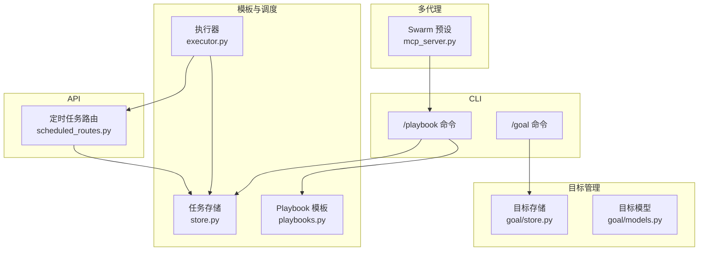
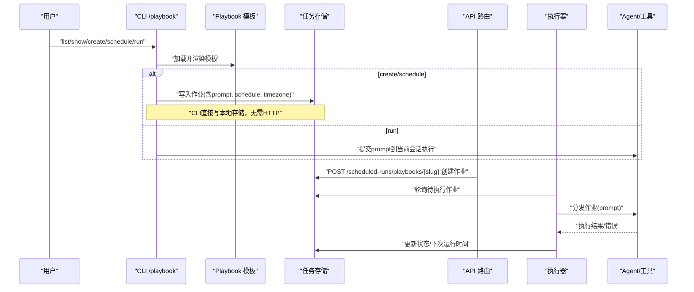
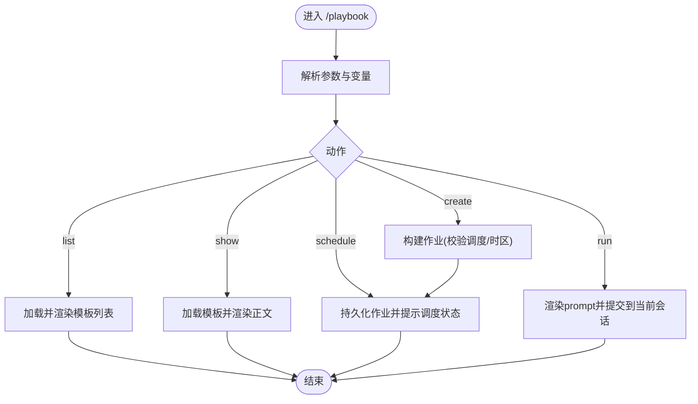
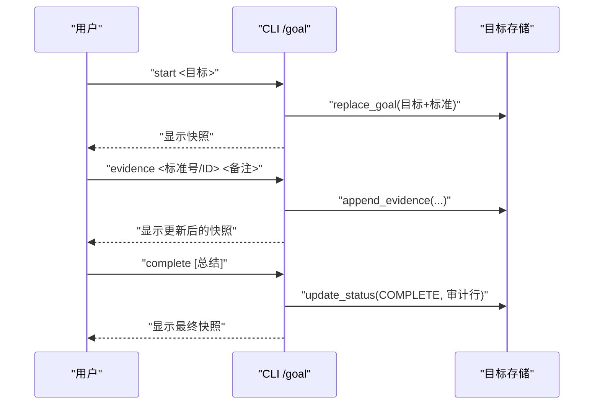
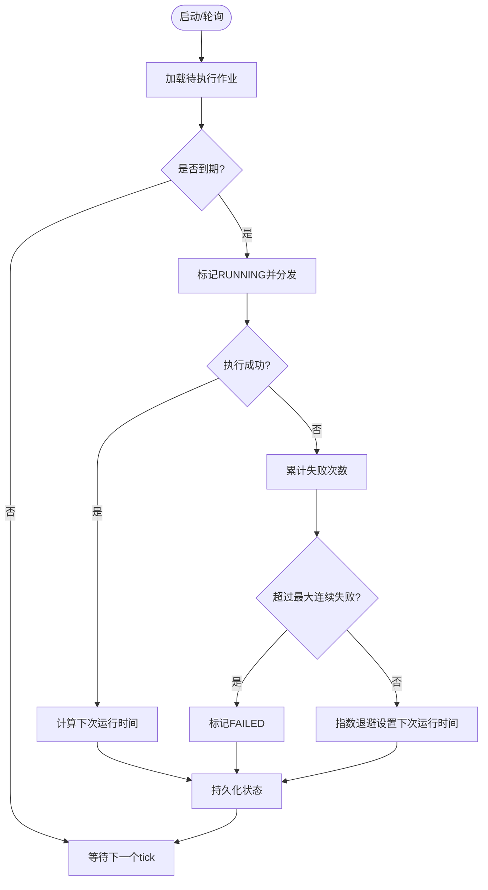
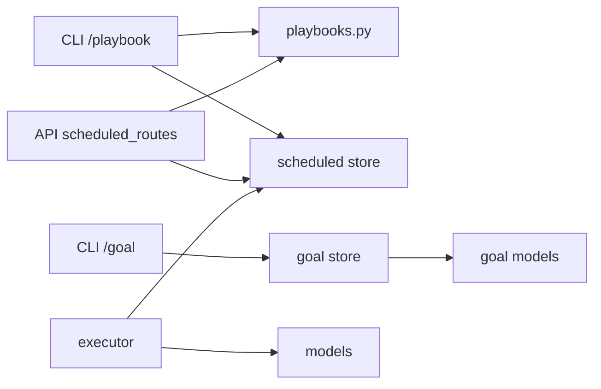

# 研究命令

<cite>
**本文引用的文件**
- [research_playbook.py](file://agent/cli/commands/research_playbook.py)
- [goal.py](file://agent/cli/commands/goal.py)
- [playbooks.py](file://agent/src/scheduled_research/playbooks.py)
- [executor.py](file://agent/src/scheduled_research/executor.py)
- [store.py](file://agent/src/scheduled_research/store.py)
- [models.py](file://agent/src/scheduled_research/models.py)
- [scheduled_routes.py](file://agent/src/api/scheduled_routes.py)
- [premarket-brief.md](file://agent/src/scheduled_research/playbooks/premarket-brief.md)
- [portfolio-checkup.md](file://agent/src/scheduled_research/playbooks/portfolio-checkup.md)
- [store.py](file://agent/src/goal/store.py)
- [models.py](file://agent/src/goal/models.py)
- [SKILL.md](file://agent/SKILL.md)
- [mcp_server.py](file://agent/mcp_server.py)
</cite>

## 目录
1. [简介](#简介)
2. [项目结构](#项目结构)
3. [核心组件](#核心组件)
4. [架构总览](#架构总览)
5. [详细组件分析](#详细组件分析)
6. [依赖关系分析](#依赖关系分析)
7. [性能与可靠性](#性能与可靠性)
8. [故障排查指南](#故障排查指南)
9. [结论](#结论)
10. [附录：使用示例与最佳实践](#附录使用示例与最佳实践)

## 简介
本文件面向“研究相关命令”的使用与实现，覆盖以下能力：
- 研究计划（Playbook）的浏览、预览、立即执行与定时调度
- 研究目标（Goal）的创建、证据追加、完成与取消
- 工作流编排：通过 Playbook 模板驱动 Agent 自动编排工具调用，产出研究报告
- 多代理协作：通过 Swarm 预设团队进行复杂研究的分工与汇总
- 结果分析与报告生成：结构化输出、数据缺口说明、可审计的证据链

## 项目结构
围绕研究命令的关键路径如下：
- CLI 入口层：/playbook、/goal 等子命令解析与渲染
- 模板与调度层：Playbook 模板加载、变量替换、任务构建与持久化
- 执行器层：定时轮询、时区与 Cron 计算、失败重试与状态推进
- 存储层：研究任务存储、研究目标存储（SQLite）
- API 层：REST 接口用于远程创建/查询研究任务
- 多代理层：Swarm 预设团队与 MCP 工具集成

图表来源
- [research_playbook.py:365-449](file://agent/cli/commands/research_playbook.py#L365-L449)
- [playbooks.py:250-419](file://agent/src/scheduled_research/playbooks.py#L250-L419)
- [executor.py:160-452](file://agent/src/scheduled_research/executor.py#L160-L452)
- [scheduled_routes.py:603-634](file://agent/src/api/scheduled_routes.py#L603-L634)
- [goal.py:154-392](file://agent/cli/commands/goal.py#L154-L392)
- [store.py:106-132](file://agent/src/goal/store.py#L106-L132)
- [models.py:10-34](file://agent/src/goal/models.py#L10-L34)

章节来源
- [research_playbook.py:1-661](file://agent/cli/commands/research_playbook.py#L1-L661)
- [goal.py:1-403](file://agent/cli/commands/goal.py#L1-L403)
- [playbooks.py:1-419](file://agent/src/scheduled_research/playbooks.py#L1-L419)
- [executor.py:1-452](file://agent/src/scheduled_research/executor.py#L1-L452)
- [scheduled_routes.py:603-634](file://agent/src/api/scheduled_routes.py#L603-L634)
- [store.py:106-132](file://agent/src/goal/store.py#L106-L132)
- [models.py:10-34](file://agent/src/goal/models.py#L10-L34)

## 核心组件
- 研究计划（Playbook）
  - 以 Markdown + YAML frontmatter 描述“需要哪些数据能力”，不绑定具体工具
  - 支持变量占位符 {{var}}，在创建或运行时注入
  - 提供 list/show/create/run/schedule 等能力
- 研究目标（Goal）
  - 将研究拆分为“目标-标准-证据”的可审计流程
  - 支持 start/status/evidence/complete/cancel
- 执行器（Executor）
  - 基于 Cron/间隔的调度，支持时区、DST 处理、失败重试与退避
  - 负责状态推进（PENDING→RUNNING→COMPLETED/FAILED）
- 存储（Store）
  - 研究任务持久化（JSON/文件），研究目标持久化（SQLite）
- API（Scheduled Routes）
  - 提供 REST 接口创建/获取研究任务，复用同一套校验规则
- 多代理（Swarm）
  - 预置团队协作（如投资委员会、全球股票交易台等），通过 run_swarm 启动

章节来源
- [playbooks.py:79-212](file://agent/src/scheduled_research/playbooks.py#L79-L212)
- [goal.py:154-392](file://agent/cli/commands/goal.py#L154-L392)
- [executor.py:160-452](file://agent/src/scheduled_research/executor.py#L160-L452)
- [store.py:106-132](file://agent/src/goal/store.py#L106-L132)
- [scheduled_routes.py:603-634](file://agent/src/api/scheduled_routes.py#L603-L634)
- [SKILL.md:100-111](file://agent/SKILL.md#L100-L111)
- [mcp_server.py:1645-1672](file://agent/mcp_server.py#L1645-L1672)

## 架构总览
研究命令的整体数据流与控制流如下：

图表来源
- [research_playbook.py:365-449](file://agent/cli/commands/research_playbook.py#L365-L449)
- [playbooks.py:250-419](file://agent/src/scheduled_research/playbooks.py#L250-L419)
- [scheduled_routes.py:603-634](file://agent/src/api/scheduled_routes.py#L603-L634)
- [executor.py:266-452](file://agent/src/scheduled_research/executor.py#L266-L452)

## 详细组件分析

### 研究计划（Playbook）命令
- 功能要点
  - list：列出可用模板（支持 JSON 输出）
  - show：展示模板元数据与完整正文（支持 --var 变量替换）
  - create：从模板创建定时作业（支持 --schedule/--timezone/--utc/--id/--dry-run/--json）
  - run：在当前会话中立即执行模板生成的 prompt
  - schedule：按建议频率保存作业（由执行器触发）
- 变量与校验
  - 变量键名需匹配模板声明；单值长度上限保护
  - 调度语法与时区由执行器统一校验，避免重复实现
- 存储与提示
  - CLI 直接写入共享存储文件，便于 API 服务器与执行器读取
  - 创建后提示是否启用调度器及首次运行时间

图表来源
- [research_playbook.py:365-449](file://agent/cli/commands/research_playbook.py#L365-L449)
- [playbooks.py:250-419](file://agent/src/scheduled_research/playbooks.py#L250-L419)

章节来源
- [research_playbook.py:81-128](file://agent/cli/commands/research_playbook.py#L81-L128)
- [research_playbook.py:136-211](file://agent/cli/commands/research_playbook.py#L136-L211)
- [research_playbook.py:365-449](file://agent/cli/commands/research_playbook.py#L365-L449)
- [playbooks.py:250-419](file://agent/src/scheduled_research/playbooks.py#L250-L419)

### 研究目标（Goal）命令
- 功能要点
  - start：开始或替换当前研究目标（自动生成默认检查清单）
  - status：查看当前目标快照（目标、标准、证据、进度）
  - evidence：为某标准追加人工证据（支持索引或ID前缀）
  - complete：在审计已验证证据后标记完成
  - cancel：取消当前目标
- 会话与持久化
  - 首次使用时自动创建 CLI 会话并索引
  - 目标与证据通过 SQLite 持久化，支持并发安全（WAL、锁）

图表来源
- [goal.py:154-392](file://agent/cli/commands/goal.py#L154-L392)
- [store.py:106-132](file://agent/src/goal/store.py#L106-L132)
- [models.py:10-34](file://agent/src/goal/models.py#L10-L34)

章节来源
- [goal.py:154-392](file://agent/cli/commands/goal.py#L154-L392)
- [store.py:106-132](file://agent/src/goal/store.py#L106-L132)
- [models.py:10-34](file://agent/src/goal/models.py#L10-L34)

### 执行器与调度
- 调度语法
  - 支持“间隔毫秒”或“简化五字段 Cron”
  - 支持 IANA 时区；DST 缺失时刻跳过，重叠时刻取第一次
- 生命周期
  - PENDING → RUNNING → COMPLETED/FAILED
  - 失败计数达到阈值则转为 FAILED；否则按指数退避重试
- 恢复机制
  - 启动时恢复上次遗留的 RUNNING 状态为 PENDING
  - 每次 tick 重新读取最新记录，避免并发冲突

图表来源
- [executor.py:64-158](file://agent/src/scheduled_research/executor.py#L64-L158)
- [executor.py:266-452](file://agent/src/scheduled_research/executor.py#L266-L452)

章节来源
- [executor.py:64-158](file://agent/src/scheduled_research/executor.py#L64-L158)
- [executor.py:266-452](file://agent/src/scheduled_research/executor.py#L266-L452)

### API 与外部集成
- REST 接口
  - POST /scheduled-runs/playbooks/{slug}：从模板创建作业，复用同一套调度与时区校验
  - GET /scheduled-runs/playbooks/{slug}：获取模板详情（含正文）
- 安全与一致性
  - 通过 require_auth 保护写操作
  - 与 CLI 共用同一套校验逻辑，避免语法漂移

章节来源
- [scheduled_routes.py:603-634](file://agent/src/api/scheduled_routes.py#L603-L634)

### 多代理协作（Swarm）
- 预设团队
  - 投资委员会、全球股票交易台、加密交易台、财报研究台、宏观/利率/FX 台、量化策略台、风控委员会等
- 使用方式
  - 通过 MCP 工具 run_swarm 启动团队，传入 preset_name 与 variables
  - 支持进度上报与超时控制，完成后通过 get_run_result 获取报告

章节来源
- [SKILL.md:100-111](file://agent/SKILL.md#L100-L111)
- [mcp_server.py:1645-1672](file://agent/mcp_server.py#L1645-L1672)

## 依赖关系分析
- CLI 层依赖模板与存储：/playbook 通过 playbooks.py 加载模板，并通过 store.py 持久化作业
- 执行器依赖模型与存储：executor.py 使用 models.py 的状态机与 store.py 的读写
- API 层复用模板与模型：scheduled_routes.py 调用 playbooks.py 与 models.py 保持一致性
- Goal 子系统独立：goal.py 通过 goal/store.py 与 goal/models.py 管理目标生命周期

图表来源
- [research_playbook.py:365-449](file://agent/cli/commands/research_playbook.py#L365-L449)
- [playbooks.py:250-419](file://agent/src/scheduled_research/playbooks.py#L250-L419)
- [executor.py:160-452](file://agent/src/scheduled_research/executor.py#L160-L452)
- [scheduled_routes.py:603-634](file://agent/src/api/scheduled_routes.py#L603-L634)
- [goal.py:154-392](file://agent/cli/commands/goal.py#L154-L392)
- [store.py:106-132](file://agent/src/goal/store.py#L106-L132)
- [models.py:10-34](file://agent/src/goal/models.py#L10-L34)

章节来源
- [research_playbook.py:365-449](file://agent/cli/commands/research_playbook.py#L365-L449)
- [playbooks.py:250-419](file://agent/src/scheduled_research/playbooks.py#L250-L419)
- [executor.py:160-452](file://agent/src/scheduled_research/executor.py#L160-L452)
- [scheduled_routes.py:603-634](file://agent/src/api/scheduled_routes.py#L603-L634)
- [goal.py:154-392](file://agent/cli/commands/goal.py#L154-L392)
- [store.py:106-132](file://agent/src/goal/store.py#L106-L132)
- [models.py:10-34](file://agent/src/goal/models.py#L10-L34)

## 性能与可靠性
- 模板渲染与变量限制
  - 单个变量字符上限，防止超长输入导致作业膨胀
  - 模板正文不重写，保证交互与调度一致
- 调度与时间
  - Cron 搜索窗口限制（约四年），避免极端表达式扫描过久
  - DST 处理：不存在时刻跳过，重叠时刻取第一次
- 执行器健壮性
  - 失败计数与指数退避，避免风暴式重试
  - 启动恢复：将残留 RUNNING 重置为 PENDING
  - 并发安全：每次 tick 重读最新记录，避免竞态
- 存储与并发
  - 目标存储使用 SQLite WAL 模式与锁，提升并发读性能
  - 任务存储采用文件原子写入，确保 API 与执行器一致性

章节来源
- [playbooks.py:62-65](file://agent/src/scheduled_research/playbooks.py#L62-L65)
- [executor.py:62-67](file://agent/src/scheduled_research/executor.py#L62-L67)
- [executor.py:367-389](file://agent/src/scheduled_research/executor.py#L367-L389)
- [executor.py:340-452](file://agent/src/scheduled_research/executor.py#L340-L452)
- [store.py:118-124](file://agent/src/goal/store.py#L118-L124)

## 故障排查指南
- 常见错误与定位
  - 模板变量未声明或超出长度：检查模板 variables 与传入值
  - 调度语法无效或无匹配时间：检查 cron 表达式与时区
  - 执行失败：查看作业 last_error 与 failure_kind（schedule/dispatch）
  - 目标无法完成：确认每个标准都有 verified 证据
- 快速自检步骤
  - 使用 playbook list/show 确认模板存在且可渲染
  - 使用 playbook create --dry-run 预览将要存储的作业
  - 使用 goal status 查看当前目标与证据覆盖情况
  - 检查执行器日志中的失败堆栈与重试信息

章节来源
- [research_playbook.py:136-211](file://agent/cli/commands/research_playbook.py#L136-L211)
- [executor.py:340-452](file://agent/src/scheduled_research/executor.py#L340-L452)
- [goal.py:198-262](file://agent/cli/commands/goal.py#L198-L262)

## 结论
研究命令体系以“模板驱动、工具解耦、可审计、可调度”为核心设计：
- Playbook 用自然语言声明数据需求，Agent 自行选择工具，提高可维护性
- Goal 将研究过程标准化为“目标-标准-证据”，便于审计与复盘
- Executor 提供稳定可靠的定时执行与失败恢复机制
- API 与 CLI 共享同一套校验，保障一致性
- Swarm 预设团队支持复杂研究的多角色协作

## 附录：使用示例与最佳实践

- 研究计划（Playbook）
  - 列出模板：vibe-trading playbook list
  - 查看模板详情：vibe-trading playbook show premarket-brief
  - 创建定时作业：vibe-trading playbook create premarket-brief --var home_market=China A-shares --var watchlist=AAPL.US,TSLA.US
  - 立即执行：/playbook run premarket-brief [home_market=...] [watchlist=...]
  - 仅预览不存储：vibe-trading playbook create premarket-brief --dry-run

- 研究目标（Goal）
  - 开始目标：/goal start 评估NVDA动量作为研究性论点
  - 查看状态：/goal status
  - 追加证据：/goal evidence 1 价格突破关键阻力位，成交量放大
  - 完成目标：/goal complete 已完成基本面与技术面交叉验证
  - 取消目标：/goal cancel 不再需要

- 多代理协作（Swarm）
  - 查看预设：list_swarm_presets()
  - 启动团队：run_swarm(preset_name="investment_committee", variables={"target":"AAPL.US","market":"US"}, wait_seconds=3600)
  - 获取结果：get_run_result(run_id)

- 模板编写要点
  - 使用 YAML frontmatter 声明 name/description/suggested_schedule/data_capabilities/markets/variables
  - 正文中使用 {{变量}} 占位，并确保所有占位在 variables 中声明
  - 明确“数据缺口”与“边界”：只报告实际检索到的数据，不臆造

章节来源
- [research_playbook.py:459-633](file://agent/cli/commands/research_playbook.py#L459-L633)
- [goal.py:154-392](file://agent/cli/commands/goal.py#L154-L392)
- [playbooks.py:250-419](file://agent/src/scheduled_research/playbooks.py#L250-L419)
- [premarket-brief.md:1-100](file://agent/src/scheduled_research/playbooks/premarket-brief.md#L1-L100)
- [portfolio-checkup.md:1-111](file://agent/src/scheduled_research/playbooks/portfolio-checkup.md#L1-L111)
- [SKILL.md:100-111](file://agent/SKILL.md#L100-L111)
- [mcp_server.py:1645-1672](file://agent/mcp_server.py#L1645-L1672)