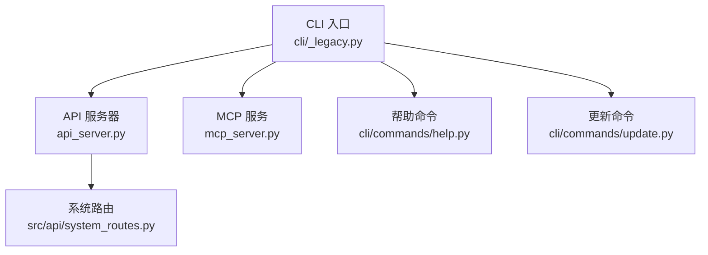
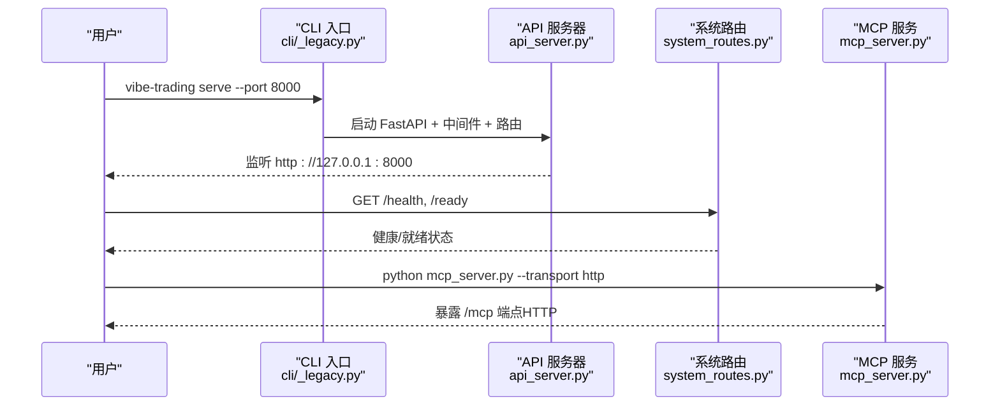
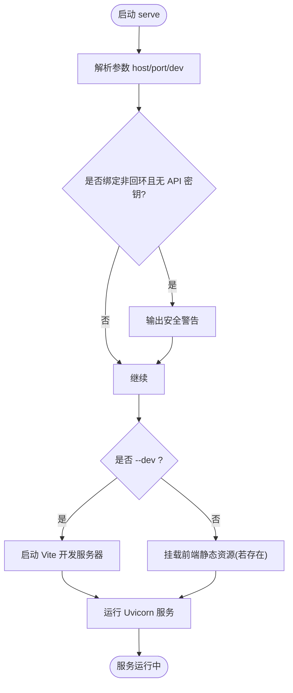
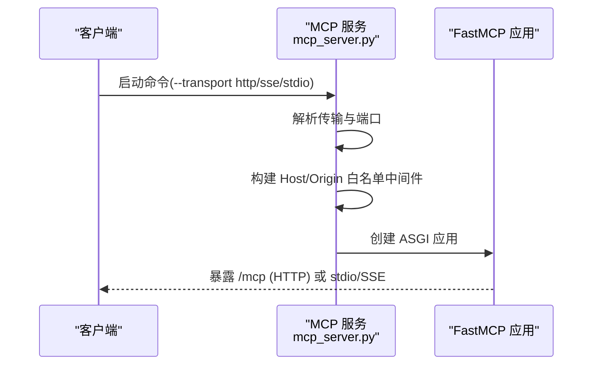
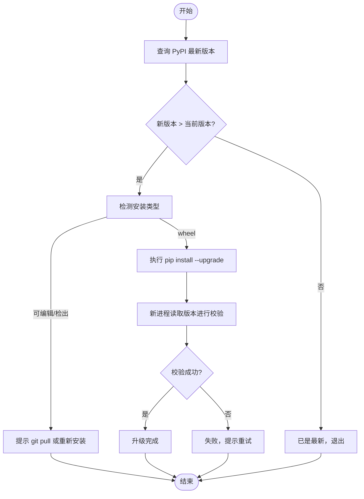
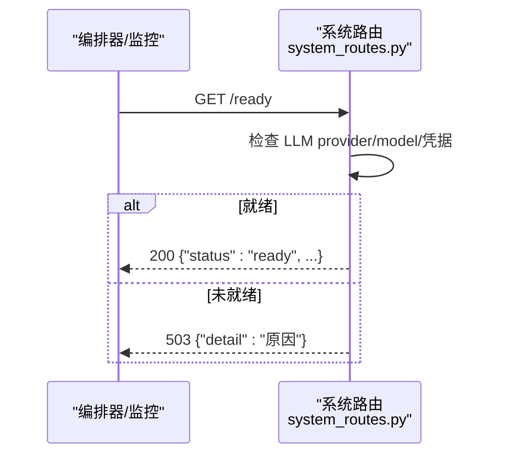
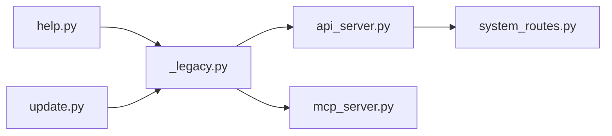

# 系统命令

<cite>
**本文引用的文件**
- [agent/api_server.py](file://agent/api_server.py)
- [agent/mcp_server.py](file://agent/mcp_server.py)
- [agent/cli/_legacy.py](file://agent/cli/_legacy.py)
- [agent/cli/commands/help.py](file://agent/cli/commands/help.py)
- [agent/cli/commands/update.py](file://agent/cli/commands/update.py)
- [agent/src/api/system_routes.py](file://agent/src/api/system_routes.py)
</cite>

## 目录
1. [简介](#简介)
2. [项目结构](#项目结构)
3. [核心组件](#核心组件)
4. [架构总览](#架构总览)
5. [详细组件分析](#详细组件分析)
6. [依赖关系分析](#依赖关系分析)
7. [性能与可用性](#性能与可用性)
8. [故障诊断与排错](#故障诊断与排错)
9. [结论](#结论)
10. [附录：常用命令速查](#附录：常用命令速查)

## 简介
本文件面向系统管理员与运维人员，系统化说明 Vibe-Trading 的系统级命令与能力，覆盖以下主题：
- API 服务器启动与配置（serve）
- MCP 服务启动与传输模式（mcp）
- 版本自更新（update）
- 帮助与交互提示（help）
- 系统监控、日志查看、配置管理
- 系统维护与故障诊断

目标是帮助你快速、安全地部署、运行与维护系统。

## 项目结构
围绕系统命令的关键代码组织如下：
- CLI 入口与子命令解析：cli/_legacy.py
- API 服务器装配与启动：api_server.py
- MCP 服务实现与传输：mcp_server.py
- 系统路由（健康检查、关闭、API 信息、文档等）：src/api/system_routes.py
- 帮助与更新命令：cli/commands/help.py、cli/commands/update.py

**图表来源**
- [agent/cli/_legacy.py:5402-5458](file://agent/cli/_legacy.py#L5402-L5458)
- [agent/api_server.py:166-185](file://agent/api_server.py#L166-L185)
- [agent/mcp_server.py:30-55](file://agent/mcp_server.py#L30-L55)
- [agent/src/api/system_routes.py:235-272](file://agent/src/api/system_routes.py#L235-L272)

**章节来源**
- [agent/cli/_legacy.py:5402-5458](file://agent/cli/_legacy.py#L5402-L5458)
- [agent/api_server.py:166-185](file://agent/api_server.py#L166-L185)
- [agent/mcp_server.py:30-55](file://agent/mcp_server.py#L30-L55)
- [agent/src/api/system_routes.py:235-272](file://agent/src/api/system_routes.py#L235-L272)

## 核心组件
- serve：通过 CLI 子命令或模块入口启动 FastAPI 应用，挂载中间件与路由，支持开发模式与前端静态资源托管。
- mcp：提供 stdio、SSE、Streamable HTTP 三种传输的 MCP 服务，内置 Host/Origin 白名单防护，默认仅允许回环地址。
- update：从 PyPI 检测最新版本并执行原地升级；对可编辑安装与源码检出给出明确指引。
- help：在交互式界面中展示斜杠命令列表与键盘快捷键。
- 系统路由：提供 /live、/health、/ready、/system/shutdown、/skills、/api 等系统级接口。

**章节来源**
- [agent/api_server.py:321-395](file://agent/api_server.py#L321-L395)
- [agent/mcp_server.py:30-55](file://agent/mcp_server.py#L30-L55)
- [agent/cli/commands/update.py:132-171](file://agent/cli/commands/update.py#L132-L171)
- [agent/cli/commands/help.py:36-61](file://agent/cli/commands/help.py#L36-L61)
- [agent/src/api/system_routes.py:235-272](file://agent/src/api/system_routes.py#L235-L272)

## 架构总览
下图展示了系统命令到后端服务的调用关系与关键路径。

**图表来源**
- [agent/cli/_legacy.py:5402-5405](file://agent/cli/_legacy.py#L5402-L5405)
- [agent/api_server.py:321-395](file://agent/api_server.py#L321-L395)
- [agent/src/api/system_routes.py:235-272](file://agent/src/api/system_routes.py#L235-L272)
- [agent/mcp_server.py:30-55](file://agent/mcp_server.py#L30-L55)

## 详细组件分析

### 组件：serve（API 服务器）
- 功能要点
  - 使用 argparse 解析 --host、--port、--dev。
  - 在 dev 模式下启动 Vite 前端开发服务器，并在生产模式下挂载静态资源。
  - 注册 CORS、安全头、SPA 深链回退等中间件。
  - 启动前执行预检、迁移、定时任务初始化等。
- 典型用法
  - 本地开发：vibe-trading serve --port 8000 --dev
  - 生产部署：vibe-trading serve --host 127.0.0.1 --port 8000
- 安全建议
  - 非回环绑定且未设置 API 密钥时，会输出警告；建议使用回环地址或配置认证。
- 相关流程

**图表来源**
- [agent/api_server.py:321-395](file://agent/api_server.py#L321-L395)

**章节来源**
- [agent/api_server.py:321-395](file://agent/api_server.py#L321-L395)

### 组件：mcp（MCP 服务）
- 功能要点
  - 支持 stdio、SSE、Streamable HTTP 三种传输；推荐 Streamable HTTP。
  - 网络传输启用 Host/Origin 白名单，默认仅允许 127.0.0.1、::1、localhost。
  - 工具集以只读研究为主，不暴露下单/撤单能力。
- 典型用法
  - stdio：python mcp_server.py
  - HTTP：python mcp_server.py --transport http --port 8900
  - SSE（已弃用）：python mcp_server.py --transport sse
- 安全要点
  - 可通过环境变量限制允许的 Host/Origin。
  - 进程内会话 ID 默认稳定，避免模型“猜测”内部标识。
- 启动序列

**图表来源**
- [agent/mcp_server.py:30-55](file://agent/mcp_server.py#L30-L55)
- [agent/mcp_server.py:146-196](file://agent/mcp_server.py#L146-L196)
- [agent/mcp_server.py:231-318](file://agent/mcp_server.py#L231-L318)

**章节来源**
- [agent/mcp_server.py:30-55](file://agent/mcp_server.py#L30-L55)
- [agent/mcp_server.py:146-196](file://agent/mcp_server.py#L146-L196)
- [agent/mcp_server.py:231-318](file://agent/mcp_server.py#L231-L318)

### 组件：update（版本自更新）
- 功能要点
  - 查询 PyPI 最新版本并与当前版本比较（PEP 440）。
  - 识别安装类型：wheel、editable、checkout，分别给出不同处理策略。
  - 通过当前解释器执行 pip 升级，并在独立进程中验证结果。
- 典型用法
  - vibe-trading update
- 流程图

**图表来源**
- [agent/cli/commands/update.py:60-71](file://agent/cli/commands/update.py#L60-L71)
- [agent/cli/commands/update.py:73-114](file://agent/cli/commands/update.py#L73-L114)
- [agent/cli/commands/update.py:132-171](file://agent/cli/commands/update.py#L132-L171)
- [agent/cli/commands/update.py:174-227](file://agent/cli/commands/update.py#L174-L227)

**章节来源**
- [agent/cli/commands/update.py:60-71](file://agent/cli/commands/update.py#L60-L71)
- [agent/cli/commands/update.py:73-114](file://agent/cli/commands/update.py#L73-L114)
- [agent/cli/commands/update.py:132-171](file://agent/cli/commands/update.py#L132-L171)
- [agent/cli/commands/update.py:174-227](file://agent/cli/commands/update.py#L174-L227)

### 组件：help（帮助与快捷键）
- 功能要点
  - 展示斜杠命令列表与键盘快捷键，便于交互式使用。
- 典型用法
  - 在交互界面输入 /help
- 输出内容
  - 命令表：名称与描述
  - 快捷键表：发送、换行、历史、退出等

**章节来源**
- [agent/cli/commands/help.py:18-61](file://agent/cli/commands/help.py#L18-L61)

### 组件：系统路由（监控、关闭、API 信息）
- 关键接口
  - /live：进程存活探针（无条件返回）
  - /health：兼容旧监控的健康检查
  - /ready：就绪探针（检查 LLM 提供商配置与凭据）
  - /system/shutdown：受保护的本地关闭接口（需授权且仅限本地访问）
  - /skills：列出已注册技能（需认证）
  - /api：服务元数据（版本、文档与健康链接）
- 安全与限流
  - /correlation 系列接口具备滑动窗口限流，防止滥用。
- 请求序列示例（/ready）

**图表来源**
- [agent/src/api/system_routes.py:235-272](file://agent/src/api/system_routes.py#L235-L272)

**章节来源**
- [agent/src/api/system_routes.py:235-272](file://agent/src/api/system_routes.py#L235-L272)

## 依赖关系分析
- CLI 层
  - _legacy.py 负责子命令解析与分发（serve、update、init、setup、dev、memory、connector、channels、data 等）。
- 服务层
  - api_server.py 组装 FastAPI 应用、中间件与路由，统一入口 serve_main。
  - system_routes.py 提供系统级 HTTP 接口。
- MCP 层
  - mcp_server.py 提供多传输 MCP 服务，内置安全中间件与工具注册。

**图表来源**
- [agent/cli/_legacy.py:5402-5458](file://agent/cli/_legacy.py#L5402-L5458)
- [agent/api_server.py:166-185](file://agent/api_server.py#L166-L185)
- [agent/mcp_server.py:30-55](file://agent/mcp_server.py#L30-L55)
- [agent/src/api/system_routes.py:235-272](file://agent/src/api/system_routes.py#L235-L272)
- [agent/cli/commands/help.py:36-61](file://agent/cli/commands/help.py#L36-L61)
- [agent/cli/commands/update.py:132-171](file://agent/cli/commands/update.py#L132-L171)

**章节来源**
- [agent/cli/_legacy.py:5402-5458](file://agent/cli/_legacy.py#L5402-L5458)
- [agent/api_server.py:166-185](file://agent/api_server.py#L166-L185)
- [agent/mcp_server.py:30-55](file://agent/mcp_server.py#L30-L55)
- [agent/src/api/system_routes.py:235-272](file://agent/src/api/system_routes.py#L235-L272)
- [agent/cli/commands/help.py:36-61](file://agent/cli/commands/help.py#L36-L61)
- [agent/cli/commands/update.py:132-171](file://agent/cli/commands/update.py#L132-L171)

## 性能与可用性
- API 服务器
  - 启动阶段包含预检与迁移，尽量非阻塞；生产环境建议提前构建前端静态资源。
  - 日志中自动脱敏敏感查询参数，降低泄露风险。
- MCP 服务
  - 网络传输默认仅允许回环主机，避免 DNS 重绑定攻击。
  - 工具集设计为只读研究，减少执行面。
- 系统路由
  - /ready 轻量检查，适合编排器探测；/correlation 等计算接口具备限流保护。

[本节为通用指导，无需特定文件引用]

## 故障诊断与排错
- 无法启动 API
  - 检查端口占用与非回环绑定的安全警告；确认是否设置了 API 密钥或使用回环地址。
  - 参考：[agent/api_server.py:321-395](file://agent/api_server.py#L321-L395)
- /ready 返回 503
  - 检查 LLM provider、model 与凭据是否配置正确。
  - 参考：[agent/src/api/system_routes.py:235-272](file://agent/src/api/system_routes.py#L235-L272)
- MCP 连接被拒绝
  - 确认 Host/Origin 在白名单内；默认仅允许 127.0.0.1、::1、localhost。
  - 参考：[agent/mcp_server.py:146-196](file://agent/mcp_server.py#L146-L196)
- 更新失败
  - 网络问题或版本解析异常会导致失败；可重试或手动 pip 升级。
  - 参考：[agent/cli/commands/update.py:60-71](file://agent/cli/commands/update.py#L60-L71)、[agent/cli/commands/update.py:174-227](file://agent/cli/commands/update.py#L174-L227)
- 日志查看
  - API 访问日志已对敏感字段脱敏；可在 Uvicorn 日志级别调整输出详细度。
  - 参考：[agent/api_server.py:404-410](file://agent/api_server.py#L404-L410)

**章节来源**
- [agent/api_server.py:321-395](file://agent/api_server.py#L321-L395)
- [agent/src/api/system_routes.py:235-272](file://agent/src/api/system_routes.py#L235-L272)
- [agent/mcp_server.py:146-196](file://agent/mcp_server.py#L146-L196)
- [agent/cli/commands/update.py:60-71](file://agent/cli/commands/update.py#L60-L71)
- [agent/cli/commands/update.py:174-227](file://agent/cli/commands/update.py#L174-L227)

## 结论
- serve 提供统一的 API 服务入口，支持开发与生产两种模式，配合系统路由可实现健康检查与受控关闭。
- mcp 提供安全的 MCP 服务，默认最小权限与回环访问，适合集成各类 MCP 客户端。
- update 简化版本升级流程，对不同安装方式给出明确指引。
- help 提升交互体验，帮助用户快速掌握可用命令与快捷键。
- 结合系统路由与 CLI，可实现完整的系统监控、配置管理与维护闭环。

[本节为总结性内容，无需特定文件引用]

## 附录：常用命令速查
- API 服务器
  - vibe-trading serve --port 8000 [--host 127.0.0.1] [--dev]
  - 健康检查：GET /health、/live
  - 就绪检查：GET /ready
  - 关闭服务：POST /system/shutdown（需本地授权）
- MCP 服务
  - stdio：python mcp_server.py
  - HTTP：python mcp_server.py --transport http --port 8900
  - SSE（弃用）：python mcp_server.py --transport sse
- 版本更新
  - vibe-trading update
- 帮助
  - 交互界面输入 /help

**章节来源**
- [agent/cli/_legacy.py:5402-5458](file://agent/cli/_legacy.py#L5402-L5458)
- [agent/api_server.py:321-395](file://agent/api_server.py#L321-L395)
- [agent/mcp_server.py:30-55](file://agent/mcp_server.py#L30-L55)
- [agent/cli/commands/help.py:36-61](file://agent/cli/commands/help.py#L36-L61)
- [agent/cli/commands/update.py:132-171](file://agent/cli/commands/update.py#L132-L171)
- [agent/src/api/system_routes.py:235-272](file://agent/src/api/system_routes.py#L235-L272)