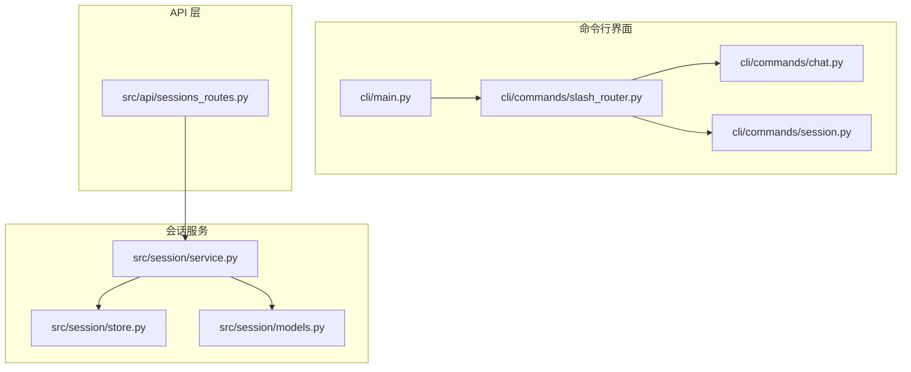
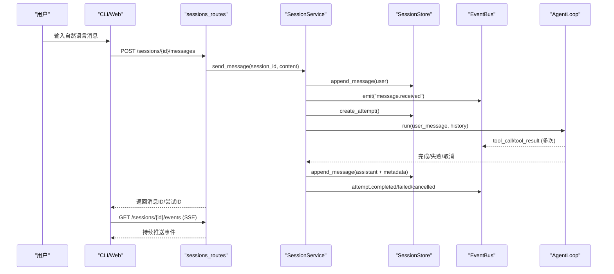
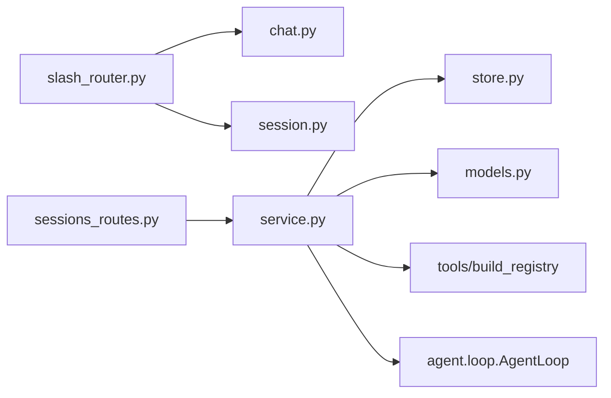

# 聊天命令

<cite>
**本文引用的文件**
- [agent/cli/commands/chat.py](file://agent/cli/commands/chat.py)
- [agent/cli/commands/session.py](file://agent/cli/commands/session.py)
- [agent/cli/commands/slash_router.py](file://agent/cli/commands/slash_router.py)
- [agent/src/api/sessions_routes.py](file://agent/src/api/sessions_routes.py)
- [agent/src/session/service.py](file://agent/src/session/service.py)
- [agent/src/session/store.py](file://agent/src/session/store.py)
- [agent/src/session/models.py](file://agent/src/session/models.py)
- [agent/cli/main.py](file://agent/cli/main.py)
</cite>

## 目录
1. [简介](#简介)
2. [项目结构](#项目结构)
3. [核心组件](#核心组件)
4. [架构总览](#架构总览)
5. [详细组件分析](#详细组件分析)
6. [依赖关系分析](#依赖关系分析)
7. [性能与可扩展性](#性能与可扩展性)
8. [故障排除指南](#故障排除指南)
9. [结论](#结论)
10. [附录：命令速查表](#附录命令速查表)

## 简介
本文件面向使用“聊天”能力进行量化研究的用户与开发者，系统化说明聊天相关命令的语法、参数与交互方式，覆盖会话创建、消息发送、历史查看、全文检索、导出占位、上下文保持与会话持久化机制。文档同时提供错误处理与故障排除建议，帮助你在自然语言驱动的研究工作流中高效协作。

## 项目结构
聊天功能由 CLI 层（交互式命令）、API 层（HTTP/SSE）与 Session 服务层（生命周期、持久化、事件总线）共同构成。CLI 通过斜杠命令路由到具体处理器；API 暴露 REST 接口并支持 SSE 实时事件；Session 服务负责消息追加、执行尝试、状态管理与搜索索引更新。

图表来源
- [agent/cli/main.py:1-120](file://agent/cli/main.py#L1-L120)
- [agent/cli/commands/slash_router.py:37-56](file://agent/cli/commands/slash_router.py#L37-L56)
- [agent/cli/commands/chat.py:224-244](file://agent/cli/commands/chat.py#L224-L244)
- [agent/cli/commands/session.py:81-95](file://agent/cli/commands/session.py#L81-L95)
- [agent/src/api/sessions_routes.py:320-363](file://agent/src/api/sessions_routes.py#L320-L363)
- [agent/src/session/service.py:53-91](file://agent/src/session/service.py#L53-L91)
- [agent/src/session/store.py:17-41](file://agent/src/session/store.py#L17-L41)
- [agent/src/session/models.py:142-167](file://agent/src/session/models.py#L142-L167)

章节来源
- [agent/cli/main.py:1-120](file://agent/cli/main.py#L1-L120)
- [agent/cli/commands/slash_router.py:37-56](file://agent/cli/commands/slash_router.py#L37-L56)

## 核心组件
- 斜杠命令注册与匹配：集中定义可用命令、别名与模糊匹配，供输入补全与帮助系统使用。
- 聊天命令组：模型切换、清理对话、日志分析、影子账户、调试开关、退出等。
- 会话管理命令：历史列表、全文检索、导出占位。
- API 路由：会话 CRUD、消息发送、取消、SSE 事件流、自动标题生成、目标（Goal）管理等。
- 会话服务：消息追加、尝试（Attempt）调度、AgentLoop 执行、工具轨迹记录、指标加载、历史裁剪与上下文注入。
- 存储层：基于文件的会话、消息（JSONL）、尝试（JSON）持久化。
- 数据模型：会话、消息、尝试、状态枚举、主体（Principal）。

章节来源
- [agent/cli/commands/slash_router.py:37-56](file://agent/cli/commands/slash_router.py#L37-L56)
- [agent/cli/commands/chat.py:224-244](file://agent/cli/commands/chat.py#L224-L244)
- [agent/cli/commands/session.py:81-95](file://agent/cli/commands/session.py#L81-L95)
- [agent/src/api/sessions_routes.py:320-363](file://agent/src/api/sessions_routes.py#L320-L363)
- [agent/src/session/service.py:53-91](file://agent/src/session/service.py#L53-L91)
- [agent/src/session/store.py:17-41](file://agent/src/session/store.py#L17-L41)
- [agent/src/session/models.py:142-167](file://agent/src/session/models.py#L142-L167)

## 架构总览
聊天交互的核心流程如下：用户在 CLI 或 Web 中输入自然语言，系统将其作为用户消息写入会话，创建一次执行尝试（Attempt），在后台线程池中运行 AgentLoop，期间通过事件总线广播工具调用与结果，最终将助手回复与元数据落盘并通过 SSE 推送给前端。

图表来源
- [agent/src/api/sessions_routes.py:732-751](file://agent/src/api/sessions_routes.py#L732-L751)
- [agent/src/api/sessions_routes.py:752-800](file://agent/src/api/sessions_routes.py#L752-L800)
- [agent/src/session/service.py:244-307](file://agent/src/session/service.py#L244-L307)
- [agent/src/session/service.py:248-344](file://agent/src/session/service.py#L248-L344)
- [agent/src/session/store.py:155-166](file://agent/src/session/store.py#L155-L166)

## 详细组件分析

### 聊天命令（chat.py）
- /model：显示当前 LLM 提供商与模型信息，并提供重新初始化向导提示。
- /clear：清空屏幕并重新打印欢迎横幅；若上下文支持，会清空内存中的对话历史。
- /journal <path>：将“分析我的交易流水于 <path>”的自然语言指令入队，交由 ReAct 循环选择合适工具进行分析。
- /shadow [path]：打开影子账户仪表盘或从交易流水训练影子账户；同样以自然语言指令入队。
- /swarm：转发到遗留的多智能体预设处理逻辑。
- /debug：切换调试摘要开关，便于观察迭代次数、工具调用数、耗时与上下文估算。
- /quit：返回特定退出码，由交互循环解释为用户主动退出，触发会话持久化与告别流程。

使用要点
- 所有命令通过统一分发器路由到对应处理器。
- 部分命令通过上下文对象挂起待处理提示，由主循环消费执行。

章节来源
- [agent/cli/commands/chat.py:44-68](file://agent/cli/commands/chat.py#L44-L68)
- [agent/cli/commands/chat.py:74-97](file://agent/cli/commands/chat.py#L74-L97)
- [agent/cli/commands/chat.py:116-144](file://agent/cli/commands/chat.py#L116-L144)
- [agent/cli/commands/chat.py:147-167](file://agent/cli/commands/chat.py#L147-L167)
- [agent/cli/commands/chat.py:170-180](file://agent/cli/commands/chat.py#L170-L180)
- [agent/cli/commands/chat.py:183-212](file://agent/cli/commands/chat.py#L183-L212)
- [agent/cli/commands/chat.py:215-221](file://agent/cli/commands/chat.py#L215-L221)
- [agent/cli/commands/chat.py:224-244](file://agent/cli/commands/chat.py#L224-L244)

### 会话命令（session.py）
- /history：列出最近会话（委托至遗留实现）。
- /search <query>：对已记录的会话进行全文检索，展示会话 ID、标题与片段。
- /export：占位命令，提示通过 Web UI 的消息页脚导出 md/json。

使用要点
- 搜索依赖共享的搜索索引，需确保索引可用。
- 导出功能当前以占位形式存在，后续将在 Web 端增强。

章节来源
- [agent/cli/commands/session.py:25-35](file://agent/cli/commands/session.py#L25-L35)
- [agent/cli/commands/session.py:38-67](file://agent/cli/commands/session.py#L38-L67)
- [agent/cli/commands/session.py:70-78](file://agent/cli/commands/session.py#L70-L78)
- [agent/cli/commands/session.py:81-95](file://agent/cli/commands/session.py#L81-L95)

### 斜杠命令路由（slash_router.py）
- 集中维护命令注册表与别名，支持模糊匹配与类型ahead。
- 动态扩展：注册机构研究工作流、数据路由模式等命令组。
- 提供精确匹配与模糊匹配函数，供帮助系统与补全器使用。

章节来源
- [agent/cli/commands/slash_router.py:37-56](file://agent/cli/commands/slash_router.py#L37-L56)
- [agent/cli/commands/slash_router.py:69-121](file://agent/cli/commands/slash_router.py#L69-L121)
- [agent/cli/commands/slash_router.py:124-156](file://agent/cli/commands/slash_router.py#L124-L156)
- [agent/cli/commands/slash_router.py:159-251](file://agent/cli/commands/slash_router.py#L159-L251)

### API 会话路由（sessions_routes.py）
- 会话 CRUD：创建、列出、获取、删除、更新标题。
- 自动标题：根据首条用户与助手消息生成简短标题。
- 消息发送：POST /sessions/{id}/messages，进入会话服务执行。
- 取消执行：POST /sessions/{id}/cancel。
- 消息查询：GET /sessions/{id}/messages。
- SSE 事件流：GET /sessions/{id}/events，支持 Last-Event-ID 断点续传与回放。
- 目标（Goal）子路由：创建、读取、更新、追加证据、更新状态。

错误处理
- 未启用会话运行时：返回 501。
- 会话不存在：返回 404。
- 会话忙（并发冲突）：返回 409。
- 其他业务校验失败：返回 400。

章节来源
- [agent/src/api/sessions_routes.py:28-60](file://agent/src/api/sessions_routes.py#L28-L60)
- [agent/src/api/sessions_routes.py:366-431](file://agent/src/api/sessions_routes.py#L366-L431)
- [agent/src/api/sessions_routes.py:437-630](file://agent/src/api/sessions_routes.py#L437-L630)
- [agent/src/api/sessions_routes.py:605-695](file://agent/src/api/sessions_routes.py#L605-L695)
- [agent/src/api/sessions_routes.py:732-763](file://agent/src/api/sessions_routes.py#L732-L763)
- [agent/src/api/sessions_routes.py:730-800](file://agent/src/api/sessions_routes.py#L730-L800)

### 会话服务（service.py）
- 会话占用控制：每个会话仅允许一个正在运行的尝试，避免消息交错。
- 消息追加与索引：用户消息追加后更新搜索索引，并广播事件。
- 尝试调度：创建 Attempt，设置 include_shell_tools，启动后台任务执行。
- 执行上下文：构建历史消息（按字符预算裁剪，保留关键标记），注入 session 配置，构建工具注册表与 AgentLoop。
- 工具轨迹：合并 tool_call 与 tool_result 为紧凑历史记录，用于后续渲染。
- 指标加载：从运行目录 artifacts/metrics.csv 加载指标。
- 结果格式化：根据尝试状态输出友好回复文本。

章节来源
- [agent/src/session/service.py:30-50](file://agent/src/session/service.py#L30-L50)
- [agent/src/session/service.py:53-91](file://agent/src/session/service.py#L53-L91)
- [agent/src/session/service.py:204-242](file://agent/src/session/service.py#L204-L242)
- [agent/src/session/service.py:244-307](file://agent/src/session/service.py#L244-L307)
- [agent/src/session/service.py:248-344](file://agent/src/session/service.py#L248-L344)
- [agent/src/session/service.py:346-440](file://agent/src/session/service.py#L346-L440)
- [agent/src/session/service.py:576-647](file://agent/src/session/service.py#L576-L647)
- [agent/src/session/service.py:649-699](file://agent/src/session/service.py#L649-L699)
- [agent/src/session/service.py:567-605](file://agent/src/session/service.py#L567-L605)

### 存储层（store.py）
- 目录结构：每个会话独立目录，包含 session.json、messages.jsonl、attempts/{attempt_id}/attempt.json。
- 会话 CRUD：创建时检查重复，删除时递归移除目录。
- 消息追加：以 JSONL 行追加，fsync 保证落盘。
- 消息读取：按行解析，跳过损坏行并记录警告。
- 尝试 CRUD：创建、读取、更新尝试记录。

章节来源
- [agent/src/session/store.py:17-41](file://agent/src/session/store.py#L17-L41)
- [agent/src/session/store.py:61-120](file://agent/src/session/store.py#L61-L120)
- [agent/src/session/store.py:122-151](file://agent/src/session/store.py#L122-L151)
- [agent/src/session/store.py:153-197](file://agent/src/session/store.py#L153-L197)
- [agent/src/session/store.py:199-243](file://agent/src/session/store.py#L199-L243)
- [agent/src/session/store.py:241-259](file://agent/src/session/store.py#L241-L259)

### 数据模型（models.py）
- Principal：认证主体，区分可归因与不可归因身份。
- SessionStatus/AttemptStatus：会话与尝试的状态机。
- Session/Message/Attempt：核心实体，含序列化/反序列化方法。

章节来源
- [agent/src/session/models.py:17-38](file://agent/src/session/models.py#L17-L38)
- [agent/src/session/models.py:41-119](file://agent/src/session/models.py#L41-L119)
- [agent/src/session/models.py:121-138](file://agent/src/session/models.py#L121-L138)
- [agent/src/session/models.py:142-198](file://agent/src/session/models.py#L142-L198)
- [agent/src/session/models.py:201-243](file://agent/src/session/models.py#L201-L243)
- [agent/src/session/models.py:244-342](file://agent/src/session/models.py#L244-L342)

## 依赖关系分析
- CLI 命令依赖 slash_router 进行命令发现与匹配。
- API 路由依赖 SessionService 进行会话生命周期编排。
- SessionService 依赖 SessionStore 进行持久化，依赖 EventBus 进行事件广播。
- 工具注册表与 AgentLoop 在运行时构建，受会话配置影响。
- 搜索索引在消息追加时更新，供 /search 使用。

图表来源
- [agent/cli/commands/slash_router.py:37-56](file://agent/cli/commands/slash_router.py#L37-L56)
- [agent/src/api/sessions_routes.py:320-363](file://agent/src/api/sessions_routes.py#L320-L363)
- [agent/src/session/service.py:346-440](file://agent/src/session/service.py#L346-L440)

章节来源
- [agent/cli/commands/slash_router.py:37-56](file://agent/cli/commands/slash_router.py#L37-L56)
- [agent/src/api/sessions_routes.py:320-363](file://agent/src/api/sessions_routes.py#L320-L363)
- [agent/src/session/service.py:346-440](file://agent/src/session/service.py#L346-L440)

## 性能与可扩展性
- 并发控制：每个会话仅允许一个运行中的尝试，避免消息交错与资源竞争。
- 线程池：限制最多四个并发 Agent 实例，防止默认执行器耗尽。
- 历史裁剪：按字符预算裁剪历史消息，保留关键标记，平衡上下文长度与成本。
- 指标加载：从运行目录读取 metrics.csv，避免重复计算。
- 可扩展点：工具注册表与 AgentLoop 可在运行时注入自定义工具与策略。

章节来源
- [agent/src/session/service.py:30-50](file://agent/src/session/service.py#L30-L50)
- [agent/src/session/service.py:649-699](file://agent/src/session/service.py#L649-L699)
- [agent/src/session/service.py:567-581](file://agent/src/session/service.py#L567-L581)

## 故障排除指南
常见问题与定位建议
- 会话不存在：检查路径参数是否有效，确认会话已创建。
- 会话忙：等待当前尝试完成或调用取消接口后再发送新消息。
- 会话运行时未启用：确认后端服务已正确初始化会话运行时。
- 搜索无结果：确认搜索索引已构建且消息已追加。
- 导出不可用：当前为占位命令，请使用 Web UI 的消息页脚导出。
- 调试开关无效：确认上下文支持 debug 属性，否则可通过环境变量开启详细日志。

错误码参考
- 400：参数校验失败（如风险等级不合法）。
- 404：会话或目标不存在。
- 409：会话忙或冲突（如并发发送）。
- 501：会话运行时未启用。
- 502：外部服务失败（如标题生成失败）。

章节来源
- [agent/src/api/sessions_routes.py:437-480](file://agent/src/api/sessions_routes.py#L437-L480)
- [agent/src/api/sessions_routes.py:732-763](file://agent/src/api/sessions_routes.py#L732-L763)
- [agent/src/api/sessions_routes.py:730-800](file://agent/src/api/sessions_routes.py#L730-L800)
- [agent/cli/commands/session.py:38-67](file://agent/cli/commands/session.py#L38-L67)
- [agent/cli/commands/chat.py:183-212](file://agent/cli/commands/chat.py#L183-L212)

## 结论
聊天命令体系通过 CLI 与 API 双通道提供一致的自然语言交互体验。会话服务统一管理消息、尝试与事件，结合文件系统持久化与搜索索引，支撑多轮对话与量化研究工作流。借助清晰的错误处理与性能优化策略，用户可以在稳定高效的平台上开展策略探索、回测与复盘。

## 附录：命令速查表
- /model：查看当前 LLM 提供商与模型，提示如何切换。
- /clear：清空屏幕与内存对话历史。
- /journal <path>：分析指定交易流水文件。
- /shadow [path]：打开影子账户或从流水训练影子账户。
- /swarm：多智能体预设入口。
- /debug：切换调试摘要。
- /quit：退出交互。
- /history：列出最近会话。
- /search <query>：全文检索会话。
- /export：导出占位（使用 Web UI 导出）。

章节来源
- [agent/cli/commands/chat.py:224-244](file://agent/cli/commands/chat.py#L224-L244)
- [agent/cli/commands/session.py:81-95](file://agent/cli/commands/session.py#L81-L95)