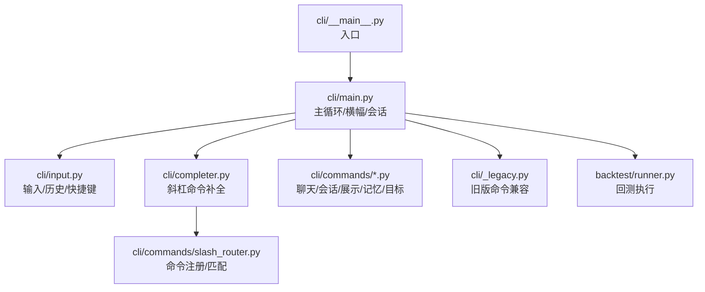
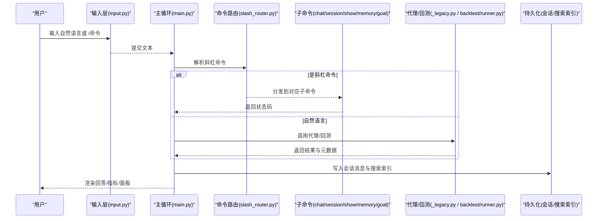
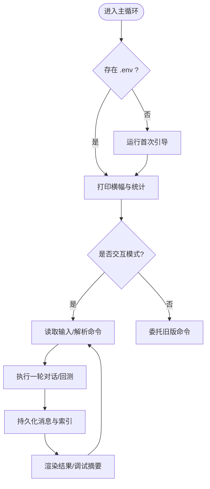
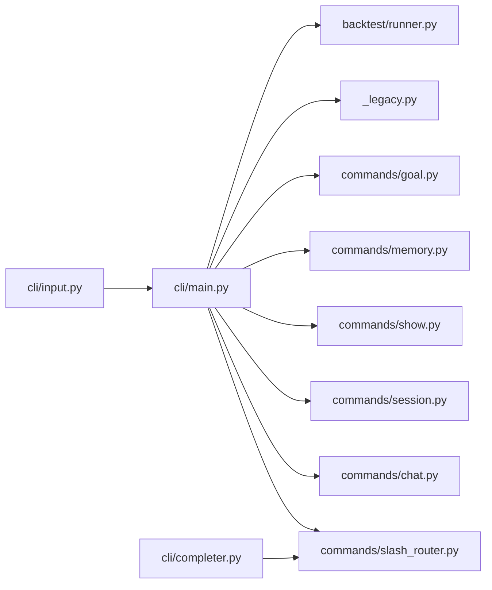

# 命令行界面使用

<cite>
**本文引用的文件**
- [agent/cli/main.py](file://agent/cli/main.py)
- [agent/cli/__main__.py](file://agent/cli/__main__.py)
- [agent/cli/input.py](file://agent/cli/input.py)
- [agent/cli/completer.py](file://agent/cli/completer.py)
- [agent/cli/commands/slash_router.py](file://agent/cli/commands/slash_router.py)
- [agent/cli/commands/chat.py](file://agent/cli/commands/chat.py)
- [agent/cli/commands/session.py](file://agent/cli/commands/session.py)
- [agent/cli/commands/help.py](file://agent/cli/commands/help.py)
- [agent/cli/commands/show.py](file://agent/cli/commands/show.py)
- [agent/cli/commands/memory.py](file://agent/cli/commands/memory.py)
- [agent/cli/commands/goal.py](file://agent/cli/commands/goal.py)
- [agent/cli/onboard.py](file://agent/cli/onboard.py)
- [agent/cli/intro.py](file://agent/cli/intro.py)
- [agent/backtest/runner.py](file://agent/backtest/runner.py)
- [agent/cli/_legacy.py](file://agent/cli/_legacy.py)
</cite>

## 目录
1. [简介](#简介)
2. [项目结构](#项目结构)
3. [核心组件](#核心组件)
4. [架构总览](#架构总览)
5. [详细组件分析](#详细组件分析)
6. [依赖关系分析](#依赖关系分析)
7. [性能考虑](#性能考虑)
8. [故障排查指南](#故障排查指南)
9. [结论](#结论)
10. [附录：常用命令速查与示例](#附录：常用命令速查与示例)

## 简介
本文件面向 Vibe-Trading 的命令行界面（CLI），提供从入门到进阶的使用指南。你将了解 CLI 的整体架构、自然语言驱动的量化研究流程、常用命令的使用方法（聊天交互、回测执行、数据分析、会话管理）、交互式会话的启动与操作方式、高级配置与环境变量、实际使用示例、错误处理与调试方法，以及性能优化建议与最佳实践。

## 项目结构
CLI 采用“入口 + 交互层 + 命令路由 + 子命令模块”的分层设计：
- 入口与引导：负责检测环境、首次引导、打印横幅、决定进入交互模式或旧版命令。
- 交互层：基于 prompt_toolkit 的输入编辑、历史、补全、快捷键、多行输入等。
- 命令路由：集中注册斜杠命令（/help、/model、/history、/search、/goal、/show、/skill、/pine、/memory、/swarm、/clear、/debug、/quit 等），并提供模糊匹配与别名。
- 子命令模块：按功能分组实现具体行为（聊天、会话、展示、记忆、目标管理等）。
- 回测与数据：通过内部工具链调用回测引擎与数据加载器，支持多种市场与数据源。

图表来源
- [agent/cli/__main__.py:1-6](file://agent/cli/__main__.py#L1-L6)
- [agent/cli/main.py:1-120](file://agent/cli/main.py#L1-L120)
- [agent/cli/input.py:1-120](file://agent/cli/input.py#L1-L120)
- [agent/cli/completer.py:1-60](file://agent/cli/completer.py#L1-L60)
- [agent/cli/commands/slash_router.py:1-60](file://agent/cli/commands/slash_router.py#L1-L60)
- [agent/backtest/runner.py:1-60](file://agent/backtest/runner.py#L1-L60)

章节来源
- [agent/cli/__main__.py:1-6](file://agent/cli/__main__.py#L1-L6)
- [agent/cli/main.py:1-120](file://agent/cli/main.py#L1-L120)

## 核心组件
- 交互入口与主循环：负责检测是否进入交互模式、显示横幅、维护会话上下文、调度单轮对话、持久化消息与搜索索引。
- 输入编辑器：提供多行编辑、括号平衡判断、Ctrl+C 两击退出、UTF-8 输出适配、历史文件安全写入。
- 斜杠命令系统：集中注册命令、别名、模糊匹配、帮助与类型提示。
- 子命令模块：聊天（模型切换、清理、日志、影子账户、集群、调试、退出）、会话（历史、搜索、导出）、展示（查看运行、技能、Pine 脚本）、记忆（列出/查看/搜索/删除片段）、目标（创建/状态/证据/完成/取消）。
- 回测执行：读取配置、选择数据源、导入信号引擎、运行引擎并产出指标。

章节来源
- [agent/cli/main.py:219-320](file://agent/cli/main.py#L219-L320)
- [agent/cli/input.py:121-154](file://agent/cli/input.py#L121-L154)
- [agent/cli/commands/slash_router.py:37-66](file://agent/cli/commands/slash_router.py#L37-L66)
- [agent/backtest/runner.py:68-163](file://agent/backtest/runner.py#L68-L163)

## 架构总览
下图展示了 CLI 的一次典型对话流程：用户输入 → 解析斜杠命令或自然语言 → 调用代理循环 → 渲染结果 → 持久化会话与搜索索引。

图表来源
- [agent/cli/main.py:696-773](file://agent/cli/main.py#L696-L773)
- [agent/cli/commands/slash_router.py:206-251](file://agent/cli/commands/slash_router.py#L206-L251)
- [agent/cli/_legacy.py:1-120](file://agent/cli/_legacy.py#L1-L120)
- [agent/backtest/runner.py:1-60](file://agent/backtest/runner.py#L1-L60)

## 详细组件分析

### 交互入口与主循环（cli/main.py）
- 启动时检测环境变量与提供商配置，若缺失则触发首次引导。
- 打印横幅并统计可用技能、工具、会话数量。
- 决定是否为交互模式（TTY、无参数或 chat 子命令）。
- 维护 InteractiveContext（会话 ID、历史、最大迭代、调试开关、待处理提示、提案拦截）。
- 单轮执行：记录用户消息、调用代理/回测、渲染结果、追加助手回复、可选调试摘要。
- 会话持久化：双写 JSONL 消息与 SQLite FTS5 搜索索引，失败不阻塞主流程。

图表来源
- [agent/cli/main.py:219-320](file://agent/cli/main.py#L219-L320)
- [agent/cli/main.py:696-773](file://agent/cli/main.py#L696-L773)

章节来源
- [agent/cli/main.py:219-320](file://agent/cli/main.py#L219-L320)
- [agent/cli/main.py:696-773](file://agent/cli/main.py#L696-L773)

### 输入编辑器（cli/input.py）
- 多行编辑：当缓冲区包含未闭合括号时回车插入换行；否则提交。
- Ctrl+C 语义：第一次清空或提示退出，第二次在时间窗口内真正退出。
- 历史文件：SafeFileHistory 去除非法代理字符，避免 Windows 终端导致的编码问题。
- UTF-8 输出：Windows 下强制重配 stdout/stderr 以正确显示品牌符号与框线。

章节来源
- [agent/cli/input.py:121-154](file://agent/cli/input.py#L121-L154)
- [agent/cli/input.py:156-249](file://agent/cli/input.py#L156-L249)
- [agent/cli/input.py:258-304](file://agent/cli/input.py#L258-L304)

### 斜杠命令系统（slash_router.py）
- 命令注册：SLASH_COMMANDS 为不可变元组，支持动态追加（如机构工作流、研究模板、连接器/数据路由命令）。
- 别名：q、exit、:q 映射到 quit；? 映射到 help。
- 模糊匹配：前缀匹配 > 子串匹配 > 子序列匹配，用于类型提示与补全。
- 精确查找：find_exact 用于命令分发。

章节来源
- [agent/cli/commands/slash_router.py:22-66](file://agent/cli/commands/slash_router.py#L22-L66)
- [agent/cli/commands/slash_router.py:159-251](file://agent/cli/commands/slash_router.py#L159-L251)

### 聊天子命令（cli/commands/chat.py）
- /model：显示当前提供商与模型，或提示重新运行初始化向导。
- /clear：清屏并重绘横幅，清空内存中的对话历史。
- /journal：将交易记录路径转换为自然语言提示并排队执行。
- /shadow：打开/检查影子账户或训练新影子策略。
- /swarm：转发到旧版集群处理器。
- /debug：切换调试摘要开关，便于观察迭代次数、工具调用、耗时与上下文大小估算。
- /quit：返回特定退出码，主循环识别后保存会话并退出。

章节来源
- [agent/cli/commands/chat.py:41-98](file://agent/cli/commands/chat.py#L41-L98)
- [agent/cli/commands/chat.py:116-180](file://agent/cli/commands/chat.py#L116-L180)
- [agent/cli/commands/chat.py:183-221](file://agent/cli/commands/chat.py#L183-L221)

### 会话子命令（cli/commands/session.py）
- /history：列出最近会话（委托旧版命令）。
- /search <query>：跨会话全文检索（SQLite FTS5）。
- /export：占位命令，富导出由 Web UI 提供。

章节来源
- [agent/cli/commands/session.py:25-67](file://agent/cli/commands/session.py#L25-L67)
- [agent/cli/commands/session.py:70-78](file://agent/cli/commands/session.py#L70-L78)

### 展示子命令（cli/commands/show.py）
- /show <run_id>：回放历史运行详情。
- /skill：列出内置与用户技能。
- /pine <run_id>：导出历史回测对应的 Pine Script。

章节来源
- [agent/cli/commands/show.py:24-66](file://agent/cli/commands/show.py#L24-L66)

### 记忆子命令（cli/commands/memory.py）
- /memory：列出持久记忆片段。
- /memory <name>：查看指定片段。
- /memory search <q>：全文检索。
- /memory forget <name>：删除片段。

章节来源
- [agent/cli/commands/memory.py:24-59](file://agent/cli/commands/memory.py#L24-L59)

### 目标管理（cli/commands/goal.py）
- /goal <objective>：开始或替换当前研究目标。
- /goal status：显示当前目标快照（目标、标准、证据、进度）。
- /goal evidence <criterion-index-or-id> <note>：手动添加证据。
- /goal complete [recap]：审计已验证证据后完成目标。
- /goal cancel [recap]：取消当前目标。

章节来源
- [agent/cli/commands/goal.py:168-195](file://agent/cli/commands/goal.py#L168-L195)
- [agent/cli/commands/goal.py:219-262](file://agent/cli/commands/goal.py#L219-L262)
- [agent/cli/commands/goal.py:297-354](file://agent/cli/commands/goal.py#L297-L354)

### 首次引导（cli/onboard.py）
- 自动检测 ~/.vibe-trading/.env 是否存在，缺失则启动五步向导（提供商→模型→密钥→超时→可选 Tushare）。
- 原子写入：先写临时文件再替换，崩溃不损坏配置。
- 支持多种提供商与模型，掩码输入 API Key，默认超时与推荐模型。

章节来源
- [agent/cli/onboard.py:1-13](file://agent/cli/onboard.py#L1-L13)
- [agent/cli/onboard.py:124-178](file://agent/cli/onboard.py#L124-L178)
- [agent/cli/onboard.py:402-561](file://agent/cli/onboard.py#L402-L561)

### 回测执行（backtest/runner.py）
- 读取 config.json，校验字段（代码、日期、区间、引擎、初始资金等）。
- 根据 source/auto 路由到数据加载器，支持多种市场与数据源。
- 导入信号引擎并运行回测，产出指标与产物。

章节来源
- [agent/backtest/runner.py:1-60](file://agent/backtest/runner.py#L1-L60)
- [agent/backtest/runner.py:68-163](file://agent/backtest/runner.py#L68-L163)

## 依赖关系分析
- 入口依赖：__main__ 仅导入 main 的入口函数。
- 主循环依赖：横幅、引导、主题、输入、补全、命令路由、旧版命令、代理/回测。
- 命令路由依赖：各子命令模块，惰性导入以避免冷启动开销。
- 回测依赖：数据加载器注册表、市场钩子、引擎选择。

图表来源
- [agent/cli/main.py:545-642](file://agent/cli/main.py#L545-L642)
- [agent/cli/commands/slash_router.py:37-66](file://agent/cli/commands/slash_router.py#L37-L66)
- [agent/cli/completer.py:47-116](file://agent/cli/completer.py#L47-L116)
- [agent/backtest/runner.py:30-47](file://agent/backtest/runner.py#L30-L47)

章节来源
- [agent/cli/main.py:545-642](file://agent/cli/main.py#L545-L642)
- [agent/cli/commands/slash_router.py:37-66](file://agent/cli/commands/slash_router.py#L37-L66)

## 性能考虑
- 懒加载与缓存：横幅统计、会话存储、工具注册表按需加载并缓存，避免每次按键重复构建。
- 非阻塞预检：后台线程预热凭证/网络探测，不影响首屏体验。
- 最小化导入：命令路由与子命令模块延迟导入，减少冷启动成本。
- 高效匹配：斜杠命令使用轻量级评分算法进行类型提示，避免昂贵查询。
- 回测配置校验：在入口处快速拒绝无效配置，减少无效运行。

章节来源
- [agent/cli/main.py:117-211](file://agent/cli/main.py#L117-L211)
- [agent/cli/main.py:518-537](file://agent/cli/main.py#L518-L537)
- [agent/backtest/runner.py:68-163](file://agent/backtest/runner.py#L68-L163)

## 故障排查指南
- 未知命令：会给出拼写建议与 /help 提示。
- 子命令异常：捕获异常并输出友好错误信息，保持 REPL 存活以便恢复。
- 会话持久化失败：JSONL 写入失败不影响主流程；搜索索引失败也不阻塞消息写入。
- 输入中断：Ctrl+C 两击退出；管道关闭时优雅处理 BrokenPipeError。
- 回测失败：检查 config.json 字段（日期格式、区间、引擎、初始资金、数据源）与数据可用性。

章节来源
- [agent/cli/main.py:589-642](file://agent/cli/main.py#L589-L642)
- [agent/cli/main.py:696-773](file://agent/cli/main.py#L696-L773)
- [agent/backtest/runner.py:68-163](file://agent/backtest/runner.py#L68-L163)

## 结论
Vibe-Trading CLI 通过清晰的层次化设计与健壮的交互体验，让用户以自然语言驱动量化研究、回测与数据分析。斜杠命令系统提供了强大的可发现性与扩展性，会话管理与持久化确保研究过程可追溯。结合回测引擎与多数据源，既能满足初学者快速上手，也能支撑高级用户的复杂策略探索。

## 附录：常用命令速查与示例
- 启动与基础
  - 启动交互：直接运行或在支持 TTY 的环境下执行。
  - 首次引导：若无配置文件，自动进入向导设置提供商、模型、密钥与超时。
- 聊天交互
  - /model：查看/切换提供商与模型。
  - /clear：清屏并重置内存中的对话历史。
  - /journal <path>：分析交易记录 CSV。
  - /shadow：打开/训练影子账户。
  - /swarm：使用预设的多智能体工作流。
  - /debug：切换调试摘要。
  - /quit：退出。
- 会话管理
  - /history：列出最近会话。
  - /search <query>：跨会话全文检索。
  - /export：富导出由 Web UI 提供。
- 展示与技能
  - /show <run_id>：回放历史运行。
  - /skill：列出技能。
  - /pine <run_id>：导出 Pine Script。
- 记忆
  - /memory：列出/查看/搜索/删除记忆片段。
- 目标管理
  - /goal <objective>：开始研究目标。
  - /goal status：查看目标快照。
  - /goal evidence <id> <note>：添加证据。
  - /goal complete：审计后完成。
  - /goal cancel：取消目标。
- 回测执行
  - 通过自然语言或子命令触发回测，内部会校验配置、选择数据源、运行引擎并输出指标。

章节来源
- [agent/cli/commands/chat.py:41-221](file://agent/cli/commands/chat.py#L41-L221)
- [agent/cli/commands/session.py:25-78](file://agent/cli/commands/session.py#L25-L78)
- [agent/cli/commands/show.py:24-66](file://agent/cli/commands/show.py#L24-L66)
- [agent/cli/commands/memory.py:24-59](file://agent/cli/commands/memory.py#L24-L59)
- [agent/cli/commands/goal.py:168-354](file://agent/cli/commands/goal.py#L168-L354)
- [agent/backtest/runner.py:68-163](file://agent/backtest/runner.py#L68-L163)