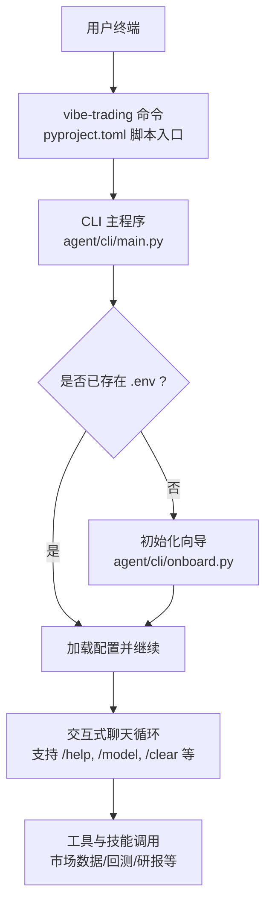
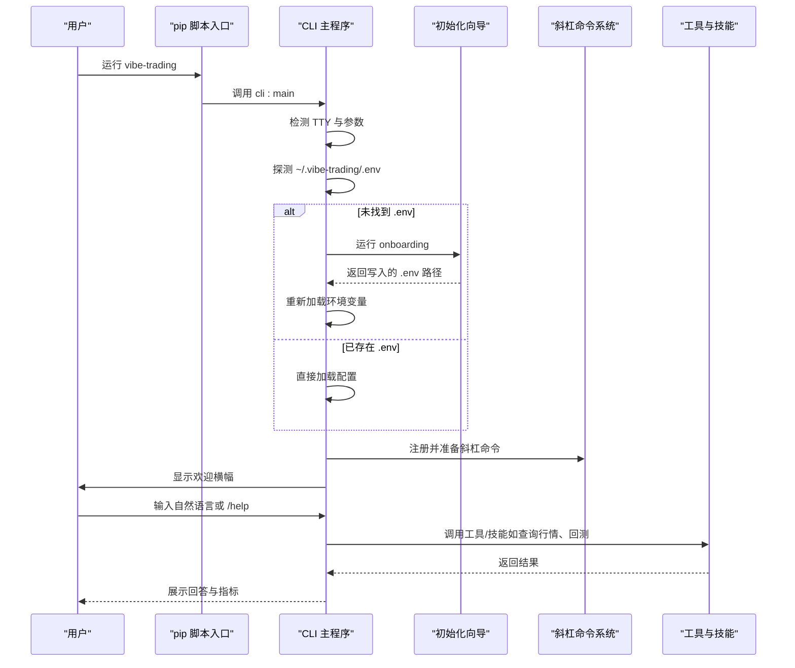
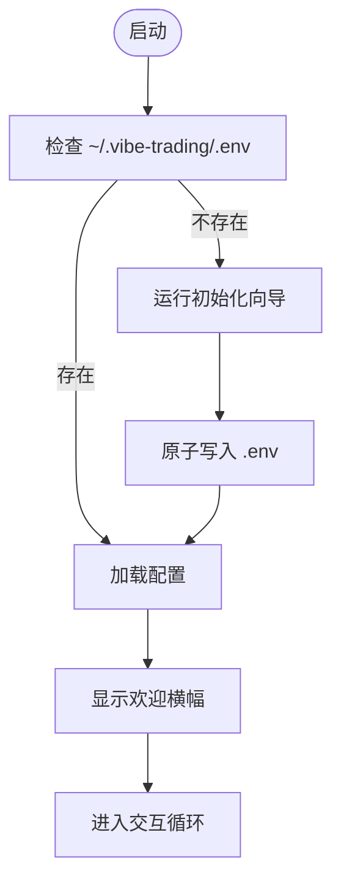
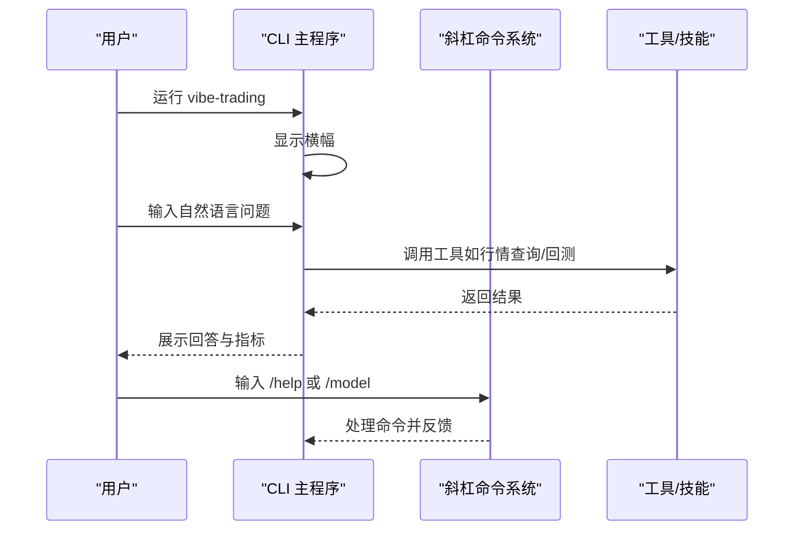
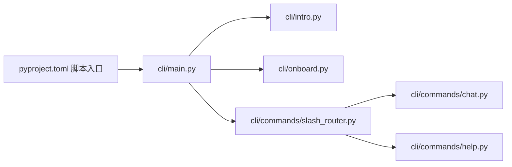

# 快速开始

<cite>
**本文引用的文件**
- [README.md](file://README.md)
- [pyproject.toml](file://pyproject.toml)
- [agent/cli/main.py](file://agent/cli/main.py)
- [agent/cli/__main__.py](file://agent/cli/__main__.py)
- [agent/cli/onboard.py](file://agent/cli/onboard.py)
- [agent/cli/intro.py](file://agent/cli/intro.py)
- [agent/cli/commands/chat.py](file://agent/cli/commands/chat.py)
- [agent/cli/commands/help.py](file://agent/cli/commands/help.py)
- [agent/cli/commands/slash_router.py](file://agent/cli/commands/slash_router.py)
</cite>

## 目录
1. [简介](#简介)
2. [项目结构](#项目结构)
3. [核心组件](#核心组件)
4. [架构总览](#架构总览)
5. [详细组件分析](#详细组件分析)
6. [依赖关系分析](#依赖关系分析)
7. [性能与使用建议](#性能与使用建议)
8. [故障排除指南](#故障排除指南)
9. [结论](#结论)
10. [附录：常用命令速查](#附录：常用命令速查)

## 简介
本指南帮助你在5分钟内完成 Vibe-Trading CLI 的首次安装、初始化配置，并进入交互式聊天模式进行量化交易研究。你将学会：
- 启动命令行界面
- 首次运行时的环境配置向导
- 进入聊天模式并进行常见操作（查询股票信息、执行基础回测等）
- 掌握基本命令格式与交互方式
- 快速定位常见问题并解决

## 项目结构
Vibe-Trading 的 CLI 入口由包脚本暴露，核心逻辑位于 agent/cli 目录：
- 入口点：通过 pip 安装的命令 vibe-trading 指向 cli:main
- 交互式会话：cli.main 负责检测环境、引导初始化、渲染横幅、驱动 REPL
- 初始化向导：cli.onboard 提供五步式向导（提供商→模型→密钥→超时→可选数据源）
- 命令系统：slash_router 维护斜杠命令注册表；chat/help 实现具体命令
- 兼容层：intro 为横幅打印提供兼容包装

图表来源
- [pyproject.toml:84-86](file://pyproject.toml#L84-L86)
- [agent/cli/main.py:1-18](file://agent/cli/main.py#L1-L18)
- [agent/cli/onboard.py:1-13](file://agent/cli/onboard.py#L1-L13)

章节来源
- [pyproject.toml:84-86](file://pyproject.toml#L84-L86)
- [agent/cli/main.py:1-18](file://agent/cli/main.py#L1-L18)
- [agent/cli/onboard.py:1-13](file://agent/cli/onboard.py#L1-L13)

## 核心组件
- CLI 入口与路由
  - 脚本入口将 vibe-trading 绑定到 cli:main
  - main 模块负责交互式判断、环境探测、横幅输出、会话恢复、斜杠命令分发
- 初始化向导
  - onboard 提供可后退的五步向导，原子写入 .env.partial → .env，支持多种 LLM 提供商与本地 Ollama
- 斜杠命令系统
  - slash_router 集中管理命令注册与模糊匹配
  - chat 提供 /model、/clear、/journal、/shadow、/swarm、/debug、/quit 等
  - help 展示命令列表与快捷键

章节来源
- [pyproject.toml:84-86](file://pyproject.toml#L84-L86)
- [agent/cli/main.py:219-268](file://agent/cli/main.py#L219-L268)
- [agent/cli/onboard.py:402-561](file://agent/cli/onboard.py#L402-L561)
- [agent/cli/commands/slash_router.py:39-56](file://agent/cli/commands/slash_router.py#L39-L56)
- [agent/cli/commands/chat.py:44-68](file://agent/cli/commands/chat.py#L44-L68)
- [agent/cli/commands/help.py:36-61](file://agent/cli/commands/help.py#L36-L61)

## 架构总览
下图展示了从启动到进入聊天模式的完整流程，包括首次初始化与环境探测。

图表来源
- [agent/cli/main.py:271-291](file://agent/cli/main.py#L271-L291)
- [agent/cli/onboard.py:402-561](file://agent/cli/onboard.py#L402-L561)
- [agent/cli/commands/slash_router.py:39-56](file://agent/cli/commands/slash_router.py#L39-L56)

## 详细组件分析

### 启动与初始化流程
- 入口点
  - 通过 pyproject 的脚本入口将 vibe-trading 指向 cli:main
  - 也支持 python -m cli 运行
- 交互式判断
  - 当标准输入/输出均为 TTY，且无参数或仅 chat 子命令时进入交互模式
- 首次初始化
  - 若未检测到任何 provider 的 .env 候选，则自动启动 onboarding 向导
  - 向导步骤：选择提供商 → 选择模型 → 粘贴 API Key（部分提供商无需） → 设置默认超时 → 可选启用 Tushare
  - 原子写入 .env.partial 并在完成后替换为 .env，避免中断导致损坏

图表来源
- [agent/cli/main.py:271-291](file://agent/cli/main.py#L271-L291)
- [agent/cli/onboard.py:124-178](file://agent/cli/onboard.py#L124-L178)
- [agent/cli/onboard.py:402-561](file://agent/cli/onboard.py#L402-L561)

章节来源
- [pyproject.toml:84-86](file://pyproject.toml#L84-L86)
- [agent/cli/__main__.py:1-6](file://agent/cli/__main__.py#L1-L6)
- [agent/cli/main.py:219-268](file://agent/cli/main.py#L219-L268)
- [agent/cli/main.py:271-291](file://agent/cli/main.py#L271-L291)
- [agent/cli/onboard.py:124-178](file://agent/cli/onboard.py#L124-L178)
- [agent/cli/onboard.py:402-561](file://agent/cli/onboard.py#L402-L561)

### 交互式聊天模式
- 进入方式
  - 直接运行 vibe-trading（TTY 环境下）
  - 或显式运行 vibe-trading chat
- 对话与命令
  - 支持自然语言提问，例如“查询 AAPL 近30天走势”
  - 斜杠命令：/help（查看命令与快捷键）、/model（查看当前提供商/模型）、/clear（清空屏幕并重新打印横幅）、/debug（切换调试摘要）、/quit（退出）
- 会话恢复
  - 启动时可提示是否恢复最近一次会话
  - 支持通过历史命令浏览与恢复

图表来源
- [agent/cli/main.py:307-321](file://agent/cli/main.py#L307-L321)
- [agent/cli/commands/chat.py:44-68](file://agent/cli/commands/chat.py#L44-L68)
- [agent/cli/commands/help.py:36-61](file://agent/cli/commands/help.py#L36-L61)

章节来源
- [agent/cli/main.py:307-321](file://agent/cli/main.py#L307-L321)
- [agent/cli/commands/chat.py:44-68](file://agent/cli/commands/chat.py#L44-L68)
- [agent/cli/commands/help.py:36-61](file://agent/cli/commands/help.py#L36-L61)

### 常用操作示例
- 查询股票信息
  - 在聊天中输入自然语言，如“查询 AAPL 近30日行情”
  - 系统将调用市场数据工具并返回可视化结果
- 执行基础回测
  - 在聊天中输入“对 AAPL 过去一年的20/50日均线交叉策略进行回测，展示夏普比率与最大回撤”
  - 系统将生成回测并输出关键指标
- 查看与切换模型
  - 输入 /model 查看当前提供商与模型
  - 如需更换，可重新运行初始化向导或按提示调整

章节来源
- [README_zh.md:1093-1134](file://README_zh.md#L1093-L1134)
- [agent/cli/commands/chat.py:44-68](file://agent/cli/commands/chat.py#L44-L68)

### 命令系统与快捷键
- 斜杠命令
  - /help：显示键盘快捷键与命令列表
  - /model：查看当前提供商/模型，并提供切换指引
  - /clear：清屏并重新打印横幅
  - /debug：切换调试摘要（每轮后显示迭代次数、工具调用数、耗时、上下文大小估算）
  - /quit：退出交互循环
- 快捷键
  - 回车发送、Shift+回车换行、Tab接受补全、上下键浏览历史、Ctrl+C清除输入、Ctrl+D退出、/打开斜杠命令前缀

章节来源
- [agent/cli/commands/slash_router.py:39-56](file://agent/cli/commands/slash_router.py#L39-L56)
- [agent/cli/commands/help.py:25-33](file://agent/cli/commands/help.py#L25-L33)
- [agent/cli/commands/chat.py:183-221](file://agent/cli/commands/chat.py#L183-L221)

## 依赖关系分析
- 脚本入口
  - pyproject.toml 定义 vibe-trading 命令指向 cli:main
- CLI 主程序
  - 依赖 intro 横幅、onboard 初始化、theme 主题、slash_router 命令系统
- 初始化向导
  - 依赖 rich、prompt_toolkit（可选），原子写入 .env.partial → .env
- 命令系统
  - slash_router 维护 SLASH_COMMANDS 元组；chat/help 实现具体命令

图表来源
- [pyproject.toml:84-86](file://pyproject.toml#L84-L86)
- [agent/cli/main.py:1-18](file://agent/cli/main.py#L1-L18)
- [agent/cli/intro.py:1-6](file://agent/cli/intro.py#L1-L6)
- [agent/cli/onboard.py:1-13](file://agent/cli/onboard.py#L1-L13)
- [agent/cli/commands/slash_router.py:39-56](file://agent/cli/commands/slash_router.py#L39-L56)
- [agent/cli/commands/chat.py:44-68](file://agent/cli/commands/chat.py#L44-L68)
- [agent/cli/commands/help.py:36-61](file://agent/cli/commands/help.py#L36-L61)

章节来源
- [pyproject.toml:84-86](file://pyproject.toml#L84-L86)
- [agent/cli/main.py:1-18](file://agent/cli/main.py#L1-L18)
- [agent/cli/commands/slash_router.py:39-56](file://agent/cli/commands/slash_router.py#L39-L56)

## 性能与使用建议
- 首次启动会后台预检提供商连通性，不阻塞交互体验
- 合理设置默认超时：向导中提供推荐值，长回测可选择更长超时
- 使用缓存：开启数据缓存可减少重复下载与网络请求
- 调试模式：开启 /debug 可查看每轮迭代的工具调用与耗时，便于定位瓶颈

[本节为通用指导，不直接分析具体文件]

## 故障排除指南
- 无法进入交互模式
  - 确认标准输入/输出为 TTY；若非 TTY，需以非交互方式运行
  - 检查是否有未知参数导致被识别为非交互
- 首次初始化失败
  - 确认 ~/.vibe-trading 目录可写
  - 检查 API Key 是否符合提供商要求（长度、前缀）
  - 若中途取消，不会写入 .env；可重试
- 提供商连接异常
  - 使用 /model 查看当前提供商与模型
  - 重新运行初始化向导或手动修正 .env
  - 参考 README 中的提供商说明与代理设置
- 命令无效或拼写错误
  - 使用 /help 查看可用命令
  - 系统会给出相似命令建议

章节来源
- [agent/cli/main.py:219-268](file://agent/cli/main.py#L219-L268)
- [agent/cli/onboard.py:381-389](file://agent/cli/onboard.py#L381-L389)
- [agent/cli/commands/help.py:36-61](file://agent/cli/commands/help.py#L36-L61)

## 结论
通过以上步骤，你可以在5分钟内完成 Vibe-Trading CLI 的安装、初始化与首次使用。借助自然语言与斜杠命令，你可以快速查询行情、执行回测、管理会话与模型，高效开展量化交易研究。

[本节为总结，不直接分析具体文件]

## 附录：常用命令速查
- 启动交互模式
  - vibe-trading
  - vibe-trading chat
- 查看帮助
  - /help
- 查看/切换模型
  - /model
- 清理与调试
  - /clear
  - /debug
- 退出
  - /quit

章节来源
- [agent/cli/commands/help.py:36-61](file://agent/cli/commands/help.py#L36-L61)
- [agent/cli/commands/chat.py:44-68](file://agent/cli/commands/chat.py#L44-L68)
- [agent/cli/commands/chat.py:183-221](file://agent/cli/commands/chat.py#L183-L221)