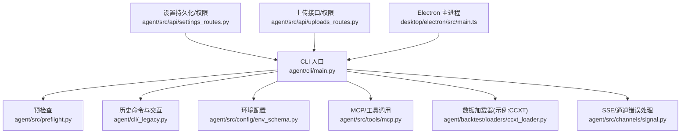
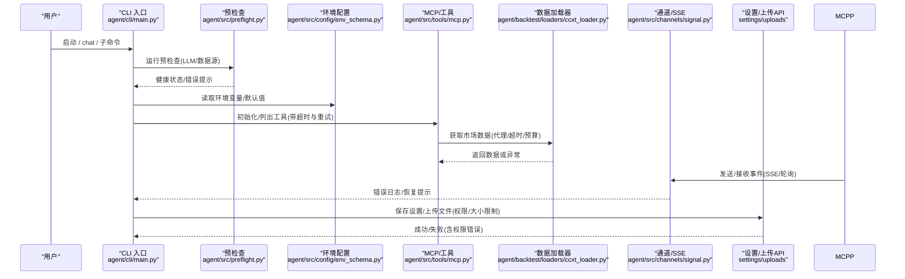
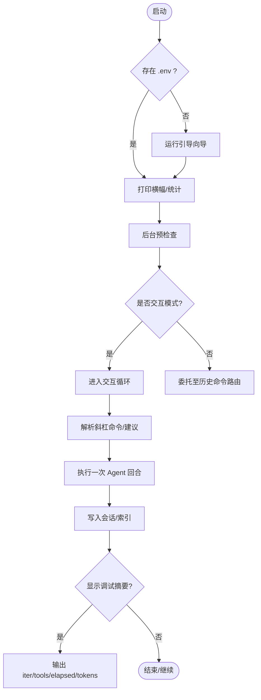
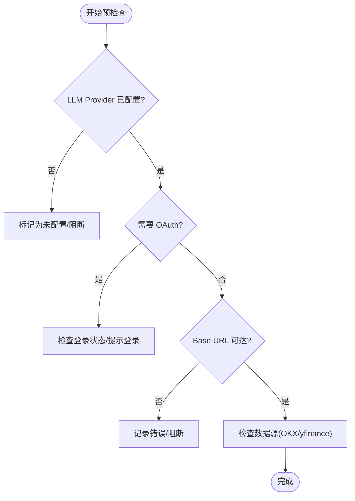
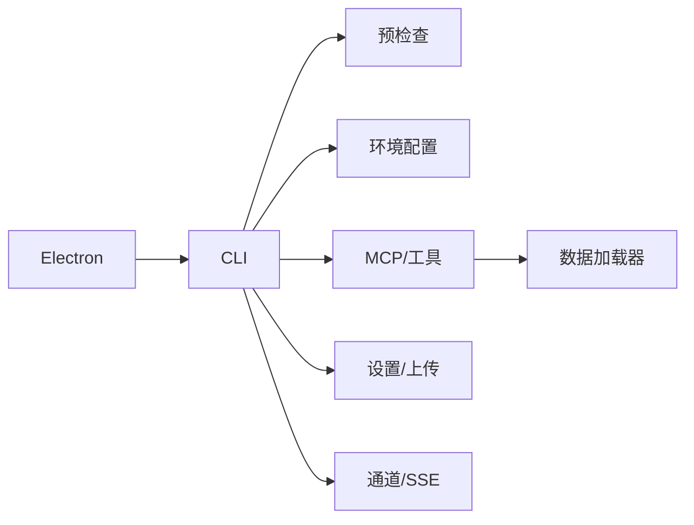

# 故障排除

<cite>
**本文引用的文件**
- [agent/cli/main.py](file://agent/cli/main.py)
- [agent/cli/_legacy.py](file://agent/cli/_legacy.py)
- [agent/src/preflight.py](file://agent/src/preflight.py)
- [agent/src/config/env_schema.py](file://agent/src/config/env_schema.py)
- [agent/backtest/loaders/ccxt_loader.py](file://agent/backtest/loaders/ccxt_loader.py)
- [agent/src/tools/mcp.py](file://agent/src/tools/mcp.py)
- [agent/src/channels/signal.py](file://agent/src/channels/signal.py)
- [agent/src/api/settings_routes.py](file://agent/src/api/settings_routes.py)
- [agent/src/api/uploads_routes.py](file://agent/src/api/uploads_routes.py)
- [desktop/electron/src/main.ts](file://desktop/electron/src/main.ts)
- [README.md](file://README.md)
</cite>

## 目录
1. [简介](#简介)
2. [项目结构](#项目结构)
3. [核心组件](#核心组件)
4. [架构总览](#架构总览)
5. [详细组件分析](#详细组件分析)
6. [依赖关系分析](#依赖关系分析)
7. [性能注意事项](#性能注意事项)
8. [故障排除指南](#故障排除指南)
9. [结论](#结论)
10. [附录](#附录)

## 简介
本指南面向 Vibe-Trading CLI 用户与开发者，聚焦常见问题定位与解决：启动失败、连接超时、权限错误、代理/防火墙问题、兼容性与依赖冲突、性能瓶颈（内存过高、响应缓慢）等。文档提供错误消息解读、诊断步骤、调试模式与日志分析方法，并给出网络配置、兼容性排查与社区支持渠道建议，帮助用户独立解决大部分问题。

## 项目结构
Vibe-Trading CLI 的入口在 agent/cli 下，负责交互式会话、命令路由、预检与状态展示；后端服务与数据源通过 src/* 模块提供；桌面端 Electron 主进程负责生命周期管理与错误上报；配置与环境变量集中在 src/config/env_schema.py；数据加载器（如 CCXT）处理代理与超时策略。

图表来源
- [agent/cli/main.py:1-120](file://agent/cli/main.py#L1-L120)
- [agent/src/preflight.py:1-120](file://agent/src/preflight.py#L1-L120)
- [agent/cli/_legacy.py:1-120](file://agent/cli/_legacy.py#L1-L120)
- [agent/src/config/env_schema.py:1-200](file://agent/src/config/env_schema.py#L1-L200)
- [agent/src/tools/mcp.py:724-759](file://agent/src/tools/mcp.py#L724-L759)
- [agent/backtest/loaders/ccxt_loader.py:73-92](file://agent/backtest/loaders/ccxt_loader.py#L73-L92)
- [agent/src/channels/signal.py:644-673](file://agent/src/channels/signal.py#L644-L673)
- [agent/src/api/settings_routes.py:541-613](file://agent/src/api/settings_routes.py#L541-L613)
- [agent/src/api/uploads_routes.py:141-178](file://agent/src/api/uploads_routes.py#L141-L178)
- [desktop/electron/src/main.ts:188-226](file://desktop/electron/src/main.ts#L188-L226)

章节来源
- [agent/cli/main.py:1-120](file://agent/cli/main.py#L1-L120)
- [agent/src/preflight.py:1-120](file://agent/src/preflight.py#L1-L120)
- [agent/cli/_legacy.py:1-120](file://agent/cli/_legacy.py#L1-L120)
- [agent/src/config/env_schema.py:1-200](file://agent/src/config/env_schema.py#L1-L200)

## 核心组件
- CLI 入口与交互循环：负责检测 .env、启动引导、打印横幅、路由子命令、维护会话与调试摘要。
- 预检查：启动时校验 LLM 提供商连通性、数据源可用性，输出关键健康信息。
- 环境与配置：集中定义环境变量默认值与类型约束，统一读取与迁移。
- 数据加载器：封装各市场数据源的请求、代理、超时与预算控制。
- MCP/工具层：管理远程工具初始化、重试与超时，避免冷启动阻塞。
- 通道与 SSE：统一记录网络错误与流关闭事件，便于定位通信问题。
- API 设置与上传：持久化设置到用户目录，处理权限与大小限制。
- Electron 主进程：管理后端生命周期、打开日志、上报启动错误。

章节来源
- [agent/cli/main.py:1-120](file://agent/cli/main.py#L1-L120)
- [agent/src/preflight.py:1-120](file://agent/src/preflight.py#L1-L120)
- [agent/src/config/env_schema.py:1-200](file://agent/src/config/env_schema.py#L1-L200)
- [agent/backtest/loaders/ccxt_loader.py:50-110](file://agent/backtest/loaders/ccxt_loader.py#L50-L110)
- [agent/src/tools/mcp.py:724-759](file://agent/src/tools/mcp.py#L724-L759)
- [agent/src/channels/signal.py:644-673](file://agent/src/channels/signal.py#L644-L673)
- [agent/src/api/settings_routes.py:541-613](file://agent/src/api/settings_routes.py#L541-L613)
- [agent/src/api/uploads_routes.py:141-178](file://agent/src/api/uploads_routes.py#L141-L178)
- [desktop/electron/src/main.ts:188-226](file://desktop/electron/src/main.ts#L188-L226)

## 架构总览
下图展示了从 CLI 启动到数据源与外部服务的典型调用链，以及错误与日志的关键落点。

图表来源
- [agent/cli/main.py:1-120](file://agent/cli/main.py#L1-L120)
- [agent/src/preflight.py:1-120](file://agent/src/preflight.py#L1-L120)
- [agent/src/config/env_schema.py:1-200](file://agent/src/config/env_schema.py#L1-L200)
- [agent/src/tools/mcp.py:724-759](file://agent/src/tools/mcp.py#L724-L759)
- [agent/backtest/loaders/ccxt_loader.py:73-92](file://agent/backtest/loaders/ccxt_loader.py#L73-L92)
- [agent/src/channels/signal.py:644-673](file://agent/src/channels/signal.py#L644-L673)
- [agent/src/api/settings_routes.py:541-613](file://agent/src/api/settings_routes.py#L541-L613)
- [agent/src/api/uploads_routes.py:141-178](file://agent/src/api/uploads_routes.py#L141-L178)

## 详细组件分析

### CLI 启动与交互循环
- 启动流程：检测 .env 是否存在，必要时运行引导向导；打印横幅并后台执行预检查；根据参数进入交互或子命令。
- 交互循环：维护会话、历史记录、最大迭代次数；捕获工具结果预览与调试摘要；处理中断与管道关闭。
- 常见错误：未知命令、导入失败、处理器退出码；均会友好提示并保留 REPL 以便恢复。

图表来源
- [agent/cli/main.py:219-268](file://agent/cli/main.py#L219-L268)
- [agent/cli/main.py:271-304](file://agent/cli/main.py#L271-L304)
- [agent/cli/main.py:307-321](file://agent/cli/main.py#L307-L321)
- [agent/cli/main.py:518-537](file://agent/cli/main.py#L518-L537)
- [agent/cli/main.py:589-642](file://agent/cli/main.py#L589-L642)
- [agent/cli/main.py:696-773](file://agent/cli/main.py#L696-L773)

章节来源
- [agent/cli/main.py:219-268](file://agent/cli/main.py#L219-L268)
- [agent/cli/main.py:271-304](file://agent/cli/main.py#L271-L304)
- [agent/cli/main.py:307-321](file://agent/cli/main.py#L307-L321)
- [agent/cli/main.py:518-537](file://agent/cli/main.py#L518-L537)
- [agent/cli/main.py:589-642](file://agent/cli/main.py#L589-L642)
- [agent/cli/main.py:696-773](file://agent/cli/main.py#L696-L773)

### 预检查与健康报告
- 功能：校验 LLM 提供商连通性、模型名称、base URL、代理与超时；对特定提供商（如 OpenAI Codex、Copilot）进行认证状态检查；探测 OKX/yfinance 等数据源可达性。
- 输出：结构化健康表，区分就绪/未配置/错误/跳过，标注影响范围。
- 排错要点：若 LLM 未配置或 base URL 不可达，需检查 .env 与网络；若 OAuth 登录缺失，按提示执行登录流程。

图表来源
- [agent/src/preflight.py:32-153](file://agent/src/preflight.py#L32-L153)
- [agent/src/preflight.py:156-200](file://agent/src/preflight.py#L156-L200)

章节来源
- [agent/src/preflight.py:32-153](file://agent/src/preflight.py#L32-L153)
- [agent/src/preflight.py:156-200](file://agent/src/preflight.py#L156-L200)

### 环境与配置
- 集中定义所有环境变量及其默认值、类型与别名；支持布尔/数值安全转换；覆盖 LLM、数据源、API、路径等。
- 常见问题：缺少必要键（如 LANGCHAIN_PROVIDER/LANGCHAIN_MODEL_NAME）、代理禁用开关、缓存开关等。
- 建议：使用 Settings 界面或命令行更新，确保写入 ~/.vibe-trading/.env；遇到权限错误参考“权限错误”章节。

章节来源
- [agent/src/config/env_schema.py:1-200](file://agent/src/config/env_schema.py#L1-L200)

### 数据加载器（以 CCXT 为例）
- 代理：优先读取 HTTP_PROXY/HTTPS_PROXY/ALL_PROXY，构建 proxies 字典传入交易所客户端。
- 超时与预算：可配置 CCXT_TIMEOUT_MS 与 CCXT_FETCH_BUDGET_S，防止长耗时挂起。
- 排错：若出现连接超时或速率限制，调整代理与预算；确认交易所符号格式正确。

章节来源
- [agent/backtest/loaders/ccxt_loader.py:50-110](file://agent/backtest/loaders/ccxt_loader.py#L50-L110)
- [agent/backtest/loaders/ccxt_loader.py:73-92](file://agent/backtest/loaders/ccxt_loader.py#L73-L92)

### MCP/工具层
- 初始化超时：为冷启动服务器设置最小 init_timeout，避免与单次工具调用超时混淆。
- 重试策略：list_tools 等关键操作具备重试机制，减少瞬态失败影响。
- 排错：若工具列表拉取失败，检查远端服务可达性与超时配置；查看日志中的错误片段。

章节来源
- [agent/src/tools/mcp.py:724-759](file://agent/src/tools/mcp.py#L724-L759)

### 通道与 SSE 错误处理
- 统一格式化错误信息，区分网络问题与其他错误，记录警告/错误级别日志。
- SSE 接收循环关闭时抛出连接错误，便于上层恢复。
- 排错：关注 polling/network 相关日志，结合代理与防火墙设置排查。

章节来源
- [agent/src/channels/signal.py:644-673](file://agent/src/channels/signal.py#L644-L673)

### API 设置与上传
- 设置持久化：将更新写入用户级 .env，处理 Windows 平台权限差异；写失败返回明确错误。
- 上传限制：文件大小上限、跨站请求防护、存储错误不泄露路径。
- 排错：权限不足时检查 ~/.vibe-trading/.env 所有权；上传失败重试或更换文件。

章节来源
- [agent/src/api/settings_routes.py:541-613](file://agent/src/api/settings_routes.py#L541-L613)
- [agent/src/api/uploads_routes.py:141-178](file://agent/src/api/uploads_routes.py#L141-L178)

### Electron 主进程
- 生命周期：管理后端启动/停止，捕获启动错误并通过窗口事件上报。
- 日志：提供菜单项打开系统日志目录，便于收集崩溃与启动问题。
- 排错：若后端启动失败，查看桌面端错误弹窗与日志目录内容。

章节来源
- [desktop/electron/src/main.ts:188-226](file://desktop/electron/src/main.ts#L188-L226)

## 依赖关系分析
- CLI 依赖预检查与环境配置，再驱动工具与数据加载器；MCP 作为工具桥接层；通道与 SSE 用于实时通信；API 提供设置与上传能力；Electron 主进程协调后端。
- 潜在环依赖：通过延迟导入与模块化拆分避免；测试中验证了代理与环境隔离。

图表来源
- [agent/cli/main.py:1-120](file://agent/cli/main.py#L1-L120)
- [agent/src/preflight.py:1-120](file://agent/src/preflight.py#L1-L120)
- [agent/src/config/env_schema.py:1-200](file://agent/src/config/env_schema.py#L1-L200)
- [agent/src/tools/mcp.py:724-759](file://agent/src/tools/mcp.py#L724-L759)
- [agent/backtest/loaders/ccxt_loader.py:73-92](file://agent/backtest/loaders/ccxt_loader.py#L73-L92)
- [agent/src/channels/signal.py:644-673](file://agent/src/channels/signal.py#L644-L673)
- [agent/src/api/settings_routes.py:541-613](file://agent/src/api/settings_routes.py#L541-L613)
- [agent/src/api/uploads_routes.py:141-178](file://agent/src/api/uploads_routes.py#L141-L178)
- [desktop/electron/src/main.ts:188-226](file://desktop/electron/src/main.ts#L188-L226)

章节来源
- [agent/cli/main.py:1-120](file://agent/cli/main.py#L1-L120)
- [agent/src/preflight.py:1-120](file://agent/src/preflight.py#L1-L120)
- [agent/src/config/env_schema.py:1-200](file://agent/src/config/env_schema.py#L1-L200)

## 性能注意事项
- 工具调用与数据加载：合理设置 CCXT_TIMEOUT_MS 与 CCXT_FETCH_BUDGET_S，避免长时间占用；启用数据缓存可减少重复下载。
- 上下文大小：交互循环估算 token 数量，过大历史会导致响应变慢；可通过 /debug 观察 iter/tools/elapsed/tokens。
- 内存使用：大量并行任务或大文件上传可能增加内存；注意上传大小限制与清理临时文件。
- 建议：逐步缩小回测范围、分批加载数据、关闭不必要的通道与服务。

[本节为通用指导，无需具体文件引用]

## 故障排除指南

### 启动失败
- 症状：CLI 无法进入交互模式或立即退出。
- 可能原因：
  - 未配置 LLM Provider 或模型名，导致预检查阻断。
  - .env 不存在且引导向导被取消。
  - 环境变量非法导致配置加载失败。
- 诊断步骤：
  - 运行预检查，查看健康表中的 LLM Provider 状态与 base URL。
  - 检查 ~/.vibe-trading/.env 是否存在并包含必要键。
  - 若使用 OpenAI Codex/Copilot，确认 OAuth 登录状态。
- 修复建议：
  - 补充 LANGCHAIN_PROVIDER 与 LANGCHAIN_MODEL_NAME。
  - 重新运行引导向导或手动创建 .env。
  - 修正非法环境变量值，使其符合类型约束。

章节来源
- [agent/src/preflight.py:32-153](file://agent/src/preflight.py#L32-L153)
- [agent/cli/main.py:271-304](file://agent/cli/main.py#L271-L304)
- [agent/src/config/env_schema.py:1-200](file://agent/src/config/env_schema.py#L1-L200)

### 连接超时
- 症状：数据加载或 MCP 工具调用卡住/超时。
- 可能原因：
  - 代理未正确配置或被系统代理拦截。
  - 远端服务不可达或限流。
  - 超时/预算设置过小。
- 诊断步骤：
  - 检查 CCXT 代理配置（HTTP_PROXY/HTTPS_PROXY/ALL_PROXY）。
  - 查看 MCP 初始化超时与重试日志。
  - 调整 CCXT_TIMEOUT_MS 与 CCXT_FETCH_BUDGET_S。
- 修复建议：
  - 设置正确的代理地址与端口；必要时禁用系统代理。
  - 增大超时与预算；对高频请求启用数据缓存。
  - 检查防火墙与 DNS 解析。

章节来源
- [agent/backtest/loaders/ccxt_loader.py:73-92](file://agent/backtest/loaders/ccxt_loader.py#L73-L92)
- [agent/src/tools/mcp.py:724-759](file://agent/src/tools/mcp.py#L724-L759)

### 权限错误
- 症状：保存设置失败、上传失败、无法写入 .env。
- 可能原因：
  - ~/.vibe-trading/.env 无写权限。
  - 上传目录不存在或磁盘空间不足。
  - 跨站请求被拒绝。
- 诊断步骤：
  - 查看设置保存返回的错误详情。
  - 检查上传文件大小与扩展名限制。
  - 确认浏览器/前端来源与 Host 匹配。
- 修复建议：
  - 赋予 ~/.vibe-trading/.env 写权限；Windows 上注意平台差异。
  - 清理临时文件，释放磁盘空间。
  - 本地开发通过 localhost 访问，或在设置中配置 API_AUTH_KEY。

章节来源
- [agent/src/api/settings_routes.py:541-613](file://agent/src/api/settings_routes.py#L541-L613)
- [agent/src/api/uploads_routes.py:141-178](file://agent/src/api/uploads_routes.py#L141-L178)

### 代理与防火墙
- 症状：外部 API 无法访问，数据加载失败。
- 可能原因：
  - 系统代理未生效或被 NO_PROXY 排除。
  - 防火墙阻止出站连接。
  - 企业代理要求认证。
- 诊断步骤：
  - 检查 HTTP_PROXY/HTTPS_PROXY/ALL_PROXY 与 no_proxy/no-proxy。
  - 使用 curl/wget 测试目标域名可达性。
  - 查看通道/SSE 的网络错误日志。
- 修复建议：
  - 配置代理并在 CLI 环境中生效；必要时设置 VIBE_TRADING_DISABLE_HTTP_PROXY=1 绕过。
  - 添加例外域名到 NO_PROXY；联系网络管理员放行端口。

章节来源
- [agent/backtest/loaders/ccxt_loader.py:73-92](file://agent/backtest/loaders/ccxt_loader.py#L73-L92)
- [agent/src/channels/signal.py:644-673](file://agent/src/channels/signal.py#L644-L673)

### 兼容性与依赖冲突
- 症状：安装失败、运行时崩溃、行为异常。
- 可能原因：
  - Python 版本不兼容。
  - 第三方库版本冲突（如 pandas 3.x 破坏性变更）。
  - 可选依赖未安装（如 channels extra）。
- 诊断步骤：
  - 查看 README 中的 Python 版本要求。
  - 检查依赖锁定文件与 CI 忽略规则。
  - 使用 pip list 与 pyproject.toml 对比版本。
- 修复建议：
  - 升级/降级 Python 至受支持版本。
  - 遵循依赖锁定，避免随意升级破坏性版本。
  - 按需安装 extras（如 channels、deepseek）。

章节来源
- [README.md:1-166](file://README.md#L1-L166)
- [.github/dependabot.yml:1-31](file://.github/dependabot.yml#L1-L31)

### 调试模式与日志分析
- 调试摘要：交互模式下启用 /debug 可查看迭代次数、工具调用数、耗时与近似 token 数。
- 日志位置：
  - 桌面端：通过菜单打开系统日志目录。
  - 后端：关注通道/SSE 的网络错误与 SSE 关闭日志。
- 分析要点：
  - 定位首次失败点（预检查/数据加载/MCP 初始化）。
  - 结合代理与超时配置判断是否为网络问题。
  - 对上传/设置错误，检查权限与大小限制。

章节来源
- [agent/cli/main.py:664-694](file://agent/cli/main.py#L664-L694)
- [desktop/electron/src/main.ts:188-226](file://desktop/electron/src/main.ts#L188-L226)
- [agent/src/channels/signal.py:644-673](file://agent/src/channels/signal.py#L644-L673)

### 性能问题诊断与优化
- 症状：响应缓慢、内存占用高。
- 诊断步骤：
  - 使用 /debug 观察 iter/tools/elapsed/tokens。
  - 检查数据缓存是否启用，减少重复下载。
  - 限制并行任务数量，避免大文件上传。
- 优化建议：
  - 调整 CCXT_TIMEOUT_MS/CCXT_FETCH_BUDGET_S。
  - 启用 VIBE_TRADING_DATA_CACHE 与合适缓存根目录。
  - 分批次加载数据，缩短回测范围。

章节来源
- [agent/cli/main.py:664-694](file://agent/cli/main.py#L664-L694)
- [agent/backtest/loaders/ccxt_loader.py:50-110](file://agent/backtest/loaders/ccxt_loader.py#L50-L110)
- [agent/src/config/env_schema.py:1-200](file://agent/src/config/env_schema.py#L1-L200)

### 网络连接故障排除方法
- 步骤：
  - 验证代理配置是否正确（HTTP_PROXY/HTTPS_PROXY/ALL_PROXY）。
  - 检查防火墙与 DNS 解析。
  - 查看通道/SSE 的网络错误日志。
  - 对 MCP 初始化与数据加载分别设置超时与重试。
- 建议：
  - 在企业网络中配置白名单与认证。
  - 对本地开发使用 localhost，避免跨域与鉴权问题。

章节来源
- [agent/backtest/loaders/ccxt_loader.py:73-92](file://agent/backtest/loaders/ccxt_loader.py#L73-L92)
- [agent/src/channels/signal.py:644-673](file://agent/src/channels/signal.py#L644-L673)
- [agent/src/tools/mcp.py:724-759](file://agent/src/tools/mcp.py#L724-L759)

### 社区支持与问题报告模板
- 社区渠道：官方 Discord、飞书群、微信群（见 README 徽章）。
- 问题报告模板建议：
  - 环境信息：操作系统、Python 版本、CLI 版本。
  - 配置摘要：LANGCHAIN_PROVIDER、模型名、base URL、代理设置。
  - 错误日志：预检查结果、通道/SSE 错误、MCP 初始化日志。
  - 复现步骤：最小化命令与输入。
  - 期望行为与实际行为。
- 提交方式：在 GitHub Issues 中附上上述信息，便于快速定位。

章节来源
- [README.md:1-166](file://README.md#L1-L166)

## 结论
通过理解 CLI 启动流程、预检查机制、环境与配置、数据加载器与 MCP 工具层、通道与 SSE 错误处理、API 权限与上传限制，以及 Electron 主进程的生命周期管理，用户可以系统化地定位并解决大多数常见问题。结合调试模式与日志分析，配合合理的代理与性能调优，能够显著提升稳定性与效率。遇到问题时，建议按照本指南的步骤逐一排查，并借助社区渠道获取支持。

[本节为总结，无需具体文件引用]

## 附录
- 常用环境变量参考：
  - LLM：LANGCHAIN_PROVIDER、LANGCHAIN_MODEL_NAME、TIMEOUT_SECONDS、MAX_RETRIES、OPENAI_BASE_URL、VIBE_TRADING_DISABLE_HTTP_PROXY。
  - 数据源：CCXT_EXCHANGE、CCXT_TIMEOUT_MS、CCXT_FETCH_BUDGET_S、TUSHARE_TOKEN、FINNHUB_API_KEY 等。
  - 缓存：VIBE_TRADING_DATA_CACHE、VIBE_TRADING_DATA_CACHE_ROOT。
- 建议：在 Settings 界面统一管理，避免分散配置；修改后重启 CLI 以生效。

[本节为补充信息，无需具体文件引用]