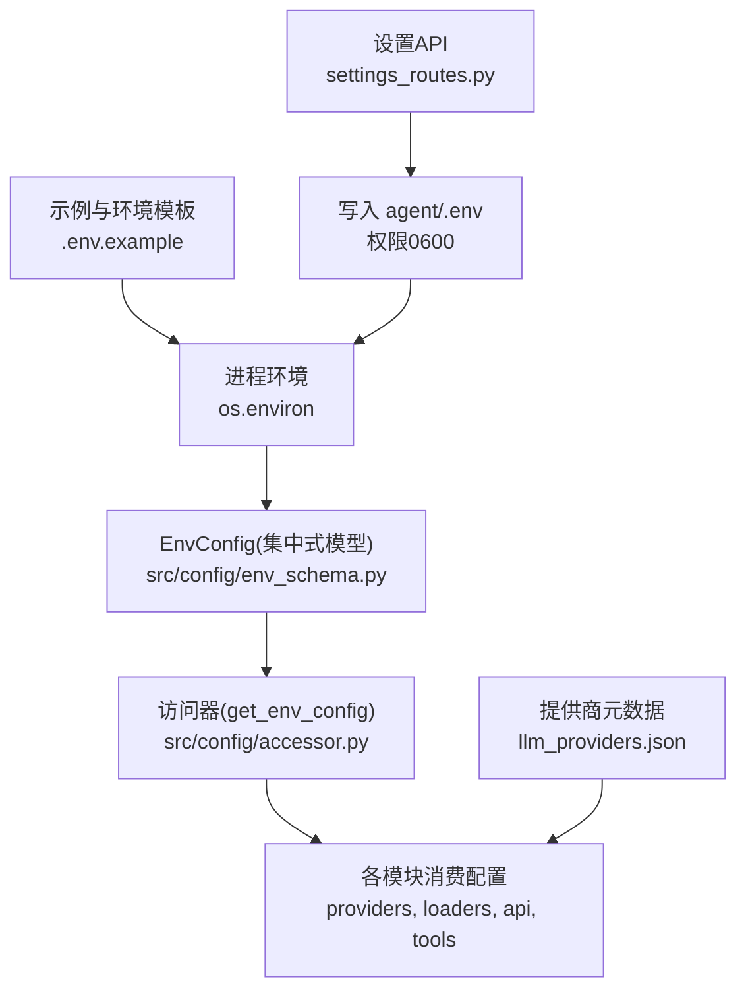
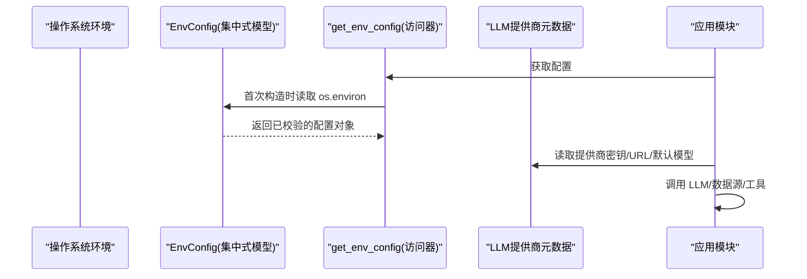
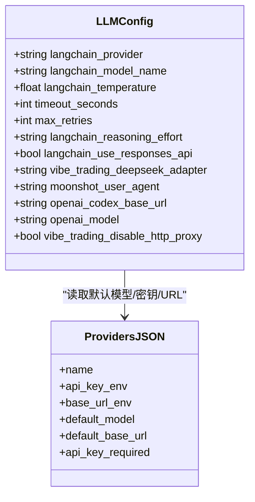
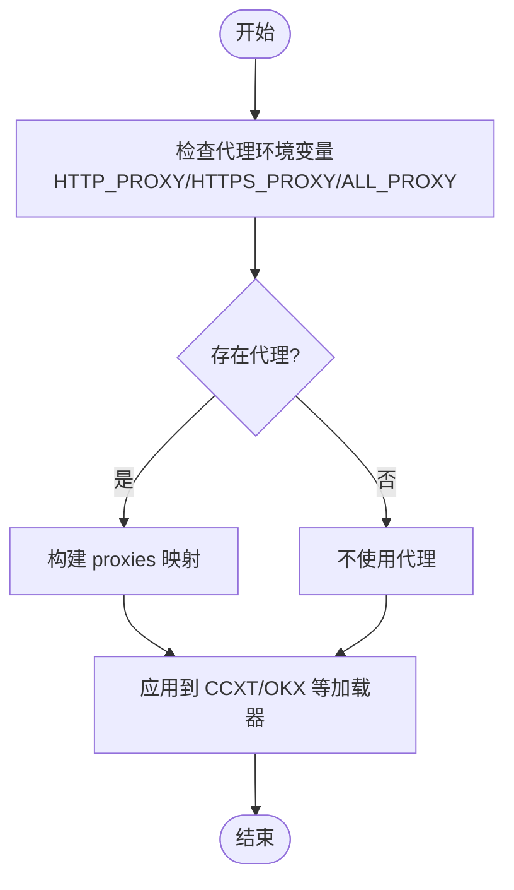
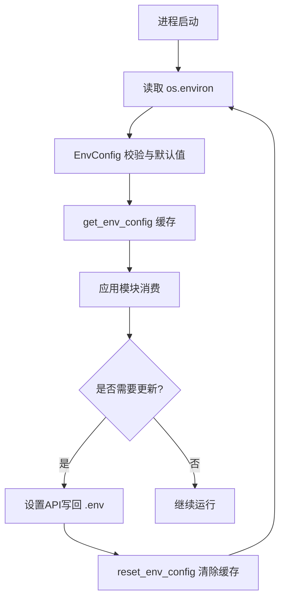
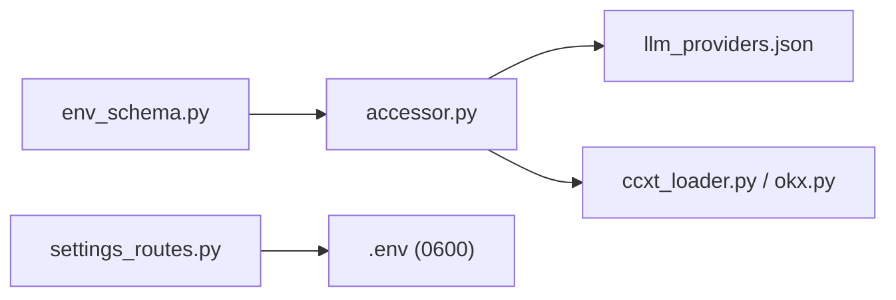

# 环境变量配置

<cite>
**本文引用的文件**
- [agent/src/config/env_schema.py](file://agent/src/config/env_schema.py)
- [agent/src/config/accessor.py](file://agent/src/config/accessor.py)
- [agent/src/config/loader.py](file://agent/src/config/loader.py)
- [agent/src/providers/llm_providers.json](file://agent/src/providers/llm_providers.json)
- [agent/.env.example](file://agent/.env.example)
- [agent/src/api/settings_routes.py](file://agent/src/api/settings_routes.py)
- [agent/backtest/loaders/ccxt_loader.py](file://agent/backtest/loaders/ccxt_loader.py)
- [agent/backtest/loaders/okx.py](file://agent/backtest/loaders/okx.py)
- [agent/src/providers/llm.py](file://agent/src/providers/llm.py)
- [README.md](file://README.md)
</cite>

## 目录
1. [简介](#简介)
2. [项目结构](#项目结构)
3. [核心组件](#核心组件)
4. [架构总览](#架构总览)
5. [详细组件分析](#详细组件分析)
6. [依赖关系分析](#依赖关系分析)
7. [性能与调优建议](#性能与调优建议)
8. [故障排查指南](#故障排查指南)
9. [结论](#结论)
10. [附录：环境变量清单与推荐配置](#附录环境变量清单与推荐配置)

## 简介
本文件为 Vibe-Trading 的环境变量配置权威文档，覆盖 LLM 提供商、API 密钥、模型选择、数据源、代理行为、内存系统、路径与存储等所有受控环境变量。内容基于代码中的单一真相来源（Pydantic 模型）与示例文件整理，提供默认值、取值范围、验证规则、加载优先级与覆盖机制，并给出开发/生产/高性能场景的推荐方案与安全最佳实践。

## 项目结构
Vibe-Trading 的环境变量通过集中式 Pydantic 模型进行统一声明、校验与读取，并通过访问器在运行时缓存；LLM 提供商元数据由 JSON 描述；设置 API 负责持久化到 .env 并提供只读查询。

**图表来源**
- [agent/src/config/env_schema.py:1-593](file://agent/src/config/env_schema.py#L1-L593)
- [agent/src/config/accessor.py:1-149](file://agent/src/config/accessor.py#L1-L149)
- [agent/src/providers/llm_providers.json:1-236](file://agent/src/providers/llm_providers.json#L1-L236)
- [agent/.env.example:1-348](file://agent/.env.example#L1-L348)
- [agent/src/api/settings_routes.py:364-389](file://agent/src/api/settings_routes.py#L364-L389)

**章节来源**
- [agent/src/config/env_schema.py:1-593](file://agent/src/config/env_schema.py#L1-L593)
- [agent/src/config/accessor.py:1-149](file://agent/src/config/accessor.py#L1-L149)
- [agent/src/providers/llm_providers.json:1-236](file://agent/src/providers/llm_providers.json#L1-L236)
- [agent/.env.example:1-348](file://agent/.env.example#L1-L348)
- [agent/src/api/settings_routes.py:364-389](file://agent/src/api/settings_routes.py#L364-L389)

## 核心组件
- EnvConfig 及其子模型：集中定义全部环境变量、类型、默认值、别名与校验规则。
- 访问器 get_env_config：线程安全的单例，首次构建后缓存，支持 reset 刷新。
- 提供商元数据 llm_providers.json：声明每个 LLM 提供商的密钥环境变量名、Base URL 环境变量名、默认模型与是否必需密钥。
- 设置 API settings_routes：提供只读查询与受保护的写回 .env 能力，确保敏感信息以安全模式写入。

**章节来源**
- [agent/src/config/env_schema.py:1-593](file://agent/src/config/env_schema.py#L1-L593)
- [agent/src/config/accessor.py:1-149](file://agent/src/config/accessor.py#L1-L149)
- [agent/src/providers/llm_providers.json:1-236](file://agent/src/providers/llm_providers.json#L1-L236)
- [agent/src/api/settings_routes.py:364-389](file://agent/src/api/settings_routes.py#L364-L389)

## 架构总览
环境变量加载与使用流程如下：

**图表来源**
- [agent/src/config/env_schema.py:81-124](file://agent/src/config/env_schema.py#L81-L124)
- [agent/src/config/accessor.py:52-76](file://agent/src/config/accessor.py#L52-L76)
- [agent/src/providers/llm_providers.json:1-236](file://agent/src/providers/llm_providers.json#L1-L236)

## 详细组件分析

### LLM 提供商与模型选择
- 关键变量
  - LANGCHAIN_PROVIDER：当前使用的 LLM 提供商名称（如 openai、anthropic、deepseek、ollama 等）。
  - LANGCHAIN_MODEL_NAME：要调用的模型名称；若为空则回退到提供商默认模型。
  - <PROVIDER>_API_KEY：各提供商的 API 密钥环境变量名（例如 OPENAI_API_KEY、ANTHROPIC_API_KEY、DEEPSEEK_API_KEY 等），由 llm_providers.json 声明。
  - <PROVIDER>_BASE_URL：各提供商的 Base URL 环境变量名（例如 OPENAI_BASE_URL、ANTHROPIC_BASE_URL 等）。
  - LANGCHAIN_TEMPERATURE：采样温度，默认 0.0。
  - TIMEOUT_SECONDS：LLM 调用超时秒数，默认 120。
  - MAX_RETRIES：最大重试次数，默认 2。
  - LANGCHAIN_REASONING_EFFORT：推理努力级别（none/low/medium/high/max），用于 Chat Completions 兼容提供商。
  - LANGCHAIN_USE_RESPONSES_API：仅当值为字面量 true 时启用 /v1/responses 传输；其他值走 Chat Completions。
  - OPENAI_CODEX_BASE_URL：OpenAI Codex（ChatGPT OAuth）后端地址。
  - OPENAI_MODEL：OpenAI 专用模型覆盖。
  - VIBE_TRADING_DEEPSEEK_ADAPTER：DeepSeek 适配器模式（auto/native/openai-compatible）。
  - MOONSHOT_USER_AGENT：Moonshot/Kimi 用户代理。
  - VIBE_TRADING_DISABLE_HTTP_PROXY：禁用 HTTP(S) 代理（需 httpx）。
- 默认值与校验
  - 默认提供商为 openai；默认模型为空字符串时会从 llm_providers.json 中取对应 provider 的 default_model。
  - 数值型字段（如 TIMEOUT_SECONDS、MAX_RETRIES）若解析失败会静默回退到默认值。
  - 布尔型字段采用统一解析（true/1/on/yes 为真，其余为假）。
- 提供商元数据
  - 每个提供商的 api_key_env、base_url_env、default_model、default_base_url、api_key_required 均在 llm_providers.json 中声明。

**图表来源**
- [agent/src/config/env_schema.py:132-158](file://agent/src/config/env_schema.py#L132-L158)
- [agent/src/providers/llm_providers.json:1-236](file://agent/src/providers/llm_providers.json#L1-L236)

**章节来源**
- [agent/src/config/env_schema.py:132-158](file://agent/src/config/env_schema.py#L132-L158)
- [agent/src/providers/llm_providers.json:1-236](file://agent/src/providers/llm_providers.json#L1-L236)
- [agent/src/providers/llm.py:855-1003](file://agent/src/providers/llm.py#L855-L1003)
- [agent/src/api/settings_routes.py:364-389](file://agent/src/api/settings_routes.py#L364-L389)
- [README.md:1077-1097](file://README.md#L1077-L1097)

### 数据源与外部服务
- 关键变量
  - TUSHARE_TOKEN：A股数据源 Tushare Pro token。
  - CCXT_EXCHANGE：加密货币交易所（默认 binance）。
  - CCXT_TIMEOUT_MS、CCXT_FETCH_BUDGET_S：CCXT 请求超时与预算。
  - FUTU_HOST、FUTU_PORT：富途 OpenAPI 本地服务地址与端口。
  - FINNHUB_API_KEY、ALPHAVANTAGE_API_KEY、TIINGO_API_KEY、FMP_API_KEY：美股 OHLCV 备用数据源密钥。
  - FRED_API_KEY：宏观数据源密钥。
  - VIBE_TRADING_IWENCAI_KEY：A股自然语言研究搜索密钥。
  - VIBE_TRADING_SEC_UA：SEC EDGAR 合规 User-Agent。
  - VIBE_TRADING_SEC_13F_MAX_XML_MB、VIBE_TRADING_SEC_13F_BUDGET_S：SEC 13F 扫描限制与预算。
  - VIBE_TRADING_SEC_FTD_URL、VIBE_TRADING_SEC_FTD_FILES：FTD 相关配置。
  - VIBE_TRADING_OPENALEX_MAILTO：OpenAlex 联系邮箱。
  - VIBE_TW_STOCK_DB：台湾市场 SQLite 快照路径（只读工具注册条件）。
  - VIBE_TRADING_DATA_CACHE、VIBE_TRADING_DATA_CACHE_ROOT：开关与缓存根目录。
  - ALIYUN_IQS_API_KEY、QVERIS_API_KEY、QVERIS_BASE_URL、TICKERALL_*、RSSHUB_BASE_URL、DASHSCOPE_API_KEY、LONGBRIDGE_*、ETORO_*：各类数据源密钥与端点。
- 代理行为
  - CCXT/OKX 等数据源通过标准代理环境变量注入：HTTP_PROXY、HTTPS_PROXY、ALL_PROXY 及其小写别名；优先使用显式 http/https 代理，否则回退 all_proxy。
- 默认值与校验
  - 多数密钥默认空字符串，未设置时相应功能不启用或回退到其他免费源。
  - 数值型字段非法值将回退默认值。

**图表来源**
- [agent/backtest/loaders/ccxt_loader.py:73-92](file://agent/backtest/loaders/ccxt_loader.py#L73-L92)
- [agent/backtest/loaders/okx.py:72-90](file://agent/backtest/loaders/okx.py#L72-L90)

**章节来源**
- [agent/src/config/env_schema.py:166-214](file://agent/src/config/env_schema.py#L166-L214)
- [agent/backtest/loaders/ccxt_loader.py:73-92](file://agent/backtest/loaders/ccxt_loader.py#L73-L92)
- [agent/backtest/loaders/okx.py:72-90](file://agent/backtest/loaders/okx.py#L72-L90)

### OCR 引擎与模型
- 关键变量
  - VIBE_TRADING_OCR_ENGINE：OCR 引擎选择（auto/rapid/llm-vision/none）。
  - VIBE_TRADING_OCR_LLM_MODEL：LLM 视觉 OCR 模型覆盖；旧版 VIBE_TRADING_OCR_QWEN_MODEL 仍兼容但会告警弃用。
- 默认值与校验
  - 默认 auto；当同时设置新旧变量时，新变量优先且无告警。

**章节来源**
- [agent/src/config/env_schema.py:286-318](file://agent/src/config/env_schema.py#L286-L318)

### API 服务器与安全
- 关键变量
  - API_AUTH_KEY：网络部署时要求 Bearer Token 的认证密钥。
  - CORS_ORIGINS：CORS 允许源列表（设置后替换默认）。
  - VIBE_TRADING_EXTRA_CORS_ORIGINS：追加到回环默认源的额外来源。
  - ENABLE_SESSION_RUNTIME：启用会话运行时。
  - VIBE_TRADING_TRUST_DOCKER_LOOPBACK：信任 Docker 回环访问。
  - VIBE_TRADING_CSP_REPORT_ONLY：CSP 报告模式。
  - VIBE_TRADING_ENABLE_SHELL_TOOLS：远程部署下显式启用 shell 工具。
  - VIBE_TRADING_ALLOWED_FILE_ROOTS、VIBE_TRADING_ALLOWED_RUN_ROOTS：允许的读写/运行目录白名单。
  - VIBE_TRADING_MCP_ALLOWED_HOSTS：MCP 网络传输主机白名单。
  - VIBE_TRADING_API_URL：API 服务地址。
  - FUTU_TRADE_PWD_MD5：富途交易密码 MD5。
- 安全特性
  - 设置 API 写回 .env 时使用原子写入与 0600 权限，避免泄露。
  - 当配置了 API_AUTH_KEY 时，设置接口需要鉴权才能修改敏感配置。

**章节来源**
- [agent/src/config/env_schema.py:326-375](file://agent/src/config/env_schema.py#L326-L375)
- [agent/src/api/settings_routes.py:364-389](file://agent/src/api/settings_routes.py#L364-L389)

### Swarm 多智能体执行参数
- 关键变量
  - SWARM_WORKER_TIMEOUT、SWARM_WORKER_MAX_ITER、SWARM_MAX_WORKERS、SWARM_TIMEOUT、SWARM_HEARTBEAT_INTERVAL_S、SWARM_STREAM_RETRY_DELAY_S、SWARM_GROUNDING_MAX_SYMBOLS。
- 默认值与校验
  - 均为整数/浮点数，非法值回退默认。

**章节来源**
- [agent/src/config/env_schema.py:318-332](file://agent/src/config/env_schema.py#L318-L332)

### Agent 调优与特性开关
- 关键变量
  - TOKEN_THRESHOLD：令牌阈值。
  - VT_HEARTBEAT_INTERVAL_S、VT_REASONING_DELTA_MIN_INTERVAL_S、VT_STREAM_RETRY_DELAY_S：心跳与重试间隔。
  - VIBE_TRADING_TOOL_TIMEOUT_SECONDS：工具执行硬超时。
  - VIBE_TRADING_GOAL_MAX_CONTINUATIONS：目标最大延续次数。
  - VIBE_TRADING_SSE_TIMEOUT：前端 SSE 空闲超时。
  - CONTENT_FILTER_WARNING_THRESHOLD：内容过滤告警比例阈值。
  - VIBE_TRADING_ENABLE_ADVISORY、VIBE_TRADING_ENABLE_SCHEDULER、VIBE_TRADING_CHANNELS_AUTO_START、VIBE_TRADING_DISABLE_BOTTLENECK：功能开关。
  - VIBE_TRADING_SCHEDULER_*：调度器失败次数与重试延迟。
  - VIBE_TRADING_BENCH_WORKERS、VIBE_TRADING_SEARCH_BACKENDS、VIBE_TRADING_SLASH_ARG_MAX、VIBE_TRADING_SEARCH_BING_FALLBACK、VIBE_LIVE_AUTHORIZE_TIMEOUT_SECONDS。
- 默认值与校验
  - 数值型非法值回退默认；布尔型按统一解析。

**章节来源**
- [agent/src/config/env_schema.py:339-394](file://agent/src/config/env_schema.py#L339-L394)

### 路径与存储
- 关键变量
  - VIBE_TRADING_HYPOTHESES_PATH、VIBE_TRADING_GOAL_DB_PATH、VIBE_TRADING_PLAYBOOK_DIR、VIBE_TRADING_SWARM_AGENT_CONFIG、ALLOW_SESSION_MCP_SERVERS、VIBE_TRADING_THEME、VIBE_GOAL_SESSION_ID、VIBE_TRADING_STRATEGY_STORE_DB_PATH。
- 默认值与校验
  - 路径类字段为空字符串表示使用默认位置；ALLOW_SESSION_MCP_SERVERS 控制是否允许会话级 MCP 注入（安全风险较高）。

**章节来源**
- [agent/src/config/env_schema.py:522-540](file://agent/src/config/env_schema.py#L522-L540)

### 记忆系统（Memory）
- 关键变量
  - VT_MEMORY：一键预设（off/on/full）。
  - VT_MEMORY_QUALITY、VT_MEMORY_GC、VT_MEMORY_DECAY、VT_MEMORY_HIERARCHY、VT_MEMORY_LINKS、VT_MEMORY_COMPRESSION、VT_MEMORY_FTS_INDEX：细粒度开关。
- 默认值与校验
  - 预设作为基线，单独开关可覆盖；布尔型按统一解析。

**章节来源**
- [agent/src/config/env_schema.py:551-677](file://agent/src/config/env_schema.py#L551-L677)

### 环境变量加载优先级与覆盖机制
- 读取顺序
  - 程序启动时从 os.environ 读取；EnvConfig 的 _load_from_env 会将缺失字段从环境变量填充，并做类型转换与非法值回退。
  - 访问器 get_env_config 缓存实例，后续调用直接返回；可通过 reset_env_config 清空缓存以重新读取。
- 覆盖机制
  - 显式构造参数优先于环境变量；同一字段既传 Python 名又传别名时，已有值跳过环境变量填充。
  - 设置 API 写回 .env 后，需重置缓存使新值生效。
- 配置文件关系
  - .env.example 提供示例；实际生效的是 .env 与进程环境。
  - 结构化 agent.json/yaml 用于 MCP/通道等高级配置，与环境变量互补。

**图表来源**
- [agent/src/config/env_schema.py:81-124](file://agent/src/config/env_schema.py#L81-L124)
- [agent/src/config/accessor.py:52-93](file://agent/src/config/accessor.py#L52-L93)
- [agent/src/api/settings_routes.py:364-389](file://agent/src/api/settings_routes.py#L364-L389)

**章节来源**
- [agent/src/config/env_schema.py:81-124](file://agent/src/config/env_schema.py#L81-L124)
- [agent/src/config/accessor.py:52-93](file://agent/src/config/accessor.py#L52-L93)
- [agent/src/config/loader.py:28-55](file://agent/src/config/loader.py#L28-L55)

## 依赖关系分析
- EnvConfig 依赖 Pydantic 进行类型校验与默认值管理。
- 访问器依赖线程锁保证并发安全。
- LLM 提供商元数据由 JSON 驱动，影响密钥/URL/默认模型解析。
- 数据源加载器依赖标准代理环境变量注入网络层。
- 设置 API 依赖文件系统权限控制与原子写入保障安全。

**图表来源**
- [agent/src/config/env_schema.py:1-593](file://agent/src/config/env_schema.py#L1-L593)
- [agent/src/config/accessor.py:1-149](file://agent/src/config/accessor.py#L1-L149)
- [agent/src/providers/llm_providers.json:1-236](file://agent/src/providers/llm_providers.json#L1-L236)
- [agent/backtest/loaders/ccxt_loader.py:73-92](file://agent/backtest/loaders/ccxt_loader.py#L73-L92)
- [agent/backtest/loaders/okx.py:72-90](file://agent/backtest/loaders/okx.py#L72-L90)
- [agent/src/api/settings_routes.py:364-389](file://agent/src/api/settings_routes.py#L364-L389)

**章节来源**
- [agent/src/config/env_schema.py:1-593](file://agent/src/config/env_schema.py#L1-L593)
- [agent/src/config/accessor.py:1-149](file://agent/src/config/accessor.py#L1-L149)
- [agent/src/providers/llm_providers.json:1-236](file://agent/src/providers/llm_providers.json#L1-L236)
- [agent/backtest/loaders/ccxt_loader.py:73-92](file://agent/backtest/loaders/ccxt_loader.py#L73-L92)
- [agent/backtest/loaders/okx.py:72-90](file://agent/backtest/loaders/okx.py#L72-L90)
- [agent/src/api/settings_routes.py:364-389](file://agent/src/api/settings_routes.py#L364-L389)

## 性能与调优建议
- LLM 调用
  - 合理设置 TIMEOUT_SECONDS 与 MAX_RETRIES，避免长尾请求拖慢整体吞吐。
  - 对高延迟本地模型提高 VIBE_TRADING_SSE_TIMEOUT，减少前端误报超时。
  - 使用合适的 LANGCHAIN_REASONING_EFFORT 平衡质量与成本。
- 数据源
  - 开启 VIBE_TRADING_DATA_CACHE 提升重复回测性能；注意缓存目录磁盘空间。
  - 根据网络状况调整 CCXT_TIMEOUT_MS 与 CCXT_FETCH_BUDGET_S。
- 代理
  - 明确设置 HTTP_PROXY/HTTPS_PROXY 以获得稳定连接；必要时使用 ALL_PROXY 兜底。
  - 如需绕过代理直连，设置 VIBE_TRADING_DISABLE_HTTP_PROXY=1（需安装 httpx）。
- 内存系统
  - 生产环境建议使用 VT_MEMORY=on 或 full 以提升检索质量与生命周期管理。
- Swarm
  - 根据硬件资源调整 SWARM_MAX_WORKERS 与 SWARM_TIMEOUT，避免资源争用。

[本节为通用指导，无需特定文件引用]

## 故障排查指南
- 无法连接 LLM
  - 检查 LANGCHAIN_PROVIDER、LANGCHAIN_MODEL_NAME、<PROVIDER>_API_KEY、<PROVIDER>_BASE_URL 是否正确。
  - 确认网络可达与代理设置；必要时启用 VIBE_TRADING_DISABLE_HTTP_PROXY。
- 设置接口被拒绝
  - 若设置了 API_AUTH_KEY，需携带 Bearer Token 访问设置接口。
  - 写回 .env 成功后，调用 reset_env_config 使新配置生效。
- 数据源不可用
  - 检查对应密钥是否设置；部分数据源仅在密钥存在时启用。
  - 代理问题可通过标准代理环境变量排查。
- 内容过滤告警
  - 调整 CONTENT_FILTER_WARNING_THRESHOLD 或更换提供商。
- 路径与权限
  - 确保 .env 所在目录与文件权限正确（非 Windows 平台应为 0700/0600）。
  - 路径类环境变量为空时使用默认路径；自定义路径需绝对路径并确保存在。

**章节来源**
- [agent/src/api/settings_routes.py:364-389](file://agent/src/api/settings_routes.py#L364-L389)
- [agent/src/config/accessor.py:79-93](file://agent/src/config/accessor.py#L79-L93)
- [agent/backtest/loaders/ccxt_loader.py:73-92](file://agent/backtest/loaders/ccxt_loader.py#L73-L92)
- [agent/backtest/loaders/okx.py:72-90](file://agent/backtest/loaders/okx.py#L72-L90)

## 结论
Vibe-Trading 通过集中式 Pydantic 模型统一管理环境变量，提供强类型校验、默认值与灵活覆盖机制。结合提供商元数据与设置 API，可实现安全、可观测、可维护的配置管理。遵循本文推荐的配置策略与安全实践，可在开发、生产与高性能场景中稳定运行。

[本节为总结性内容，无需特定文件引用]

## 附录：环境变量清单与推荐配置

### 环境变量清单（节选）
- LLM
  - LANGCHAIN_PROVIDER、LANGCHAIN_MODEL_NAME、<PROVIDER>_API_KEY、<PROVIDER>_BASE_URL、LANGCHAIN_TEMPERATURE、TIMEOUT_SECONDS、MAX_RETRIES、LANGCHAIN_REASONING_EFFORT、LANGCHAIN_USE_RESPONSES_API、OPENAI_CODEX_BASE_URL、OPENAI_MODEL、VIBE_TRADING_DEEPSEEK_ADAPTER、MOONSHOT_USER_AGENT、VIBE_TRADING_DISABLE_HTTP_PROXY。
- 数据源
  - TUSHARE_TOKEN、CCXT_EXCHANGE、CCXT_TIMEOUT_MS、CCXT_FETCH_BUDGET_S、FUTU_HOST、FUTU_PORT、FINNHUB_API_KEY、ALPHAVANTAGE_API_KEY、TIINGO_API_KEY、FMP_API_KEY、FRED_API_KEY、VIBE_TRADING_IWENCAI_KEY、VIBE_TRADING_SEC_UA、VIBE_TRADING_SEC_13F_MAX_XML_MB、VIBE_TRADING_SEC_13F_BUDGET_S、VIBE_TRADING_SEC_FTD_URL、VIBE_TRADING_SEC_FTD_FILES、VIBE_TRADING_OPENALEX_MAILTO、VIBE_TW_STOCK_DB、VIBE_TRADING_DATA_CACHE、VIBE_TRADING_DATA_CACHE_ROOT、ALIYUN_IQS_API_KEY、QVERIS_API_KEY、QVERIS_BASE_URL、TICKERALL_API_KEY、TICKERALL_ACCOUNT_ID、TICKERALL_BASE_URL、RSSHUB_BASE_URL、DASHSCOPE_API_KEY、LONGBRIDGE_APP_KEY、LONGBRIDGE_APP_SECRET、LONGBRIDGE_ACCESS_TOKEN、ETORO_API_KEY、ETORO_USER_KEY。
- OCR
  - VIBE_TRADING_OCR_ENGINE、VIBE_TRADING_OCR_LLM_MODEL。
- API 与安全
  - API_AUTH_KEY、CORS_ORIGINS、VIBE_TRADING_EXTRA_CORS_ORIGINS、ENABLE_SESSION_RUNTIME、VIBE_TRADING_TRUST_DOCKER_LOOPBACK、VIBE_TRADING_CSP_REPORT_ONLY、VIBE_TRADING_ENABLE_SHELL_TOOLS、VIBE_TRADING_ALLOWED_FILE_ROOTS、VIBE_TRADING_ALLOWED_RUN_ROOTS、VIBE_TRADING_MCP_ALLOWED_HOSTS、VIBE_TRADING_API_URL、FUTU_TRADE_PWD_MD5。
- Swarm
  - SWARM_WORKER_TIMEOUT、SWARM_WORKER_MAX_ITER、SWARM_MAX_WORKERS、SWARM_TIMEOUT、SWARM_HEARTBEAT_INTERVAL_S、SWARM_STREAM_RETRY_DELAY_S、SWARM_GROUNDING_MAX_SYMBOLS。
- Agent 调优
  - TOKEN_THRESHOLD、VT_HEARTBEAT_INTERVAL_S、VT_REASONING_DELTA_MIN_INTERVAL_S、VT_STREAM_RETRY_DELAY_S、VIBE_TRADING_TOOL_TIMEOUT_SECONDS、VIBE_TRADING_GOAL_MAX_CONTINUATIONS、VIBE_TRADING_SSE_TIMEOUT、CONTENT_FILTER_WARNING_THRESHOLD、VIBE_TRADING_ENABLE_ADVISORY、VIBE_TRADING_ENABLE_SCHEDULER、VIBE_TRADING_CHANNELS_AUTO_START、VIBE_TRADING_DISABLE_BOTTLENECK、VIBE_TRADING_SCHEDULER_MAX_CONSECUTIVE_FAILURES、VIBE_TRADING_SCHEDULER_RETRY_BASE_DELAY_MS、VIBE_TRADING_SCHEDULER_RETRY_MAX_DELAY_MS、VIBE_TRADING_BENCH_WORKERS、VIBE_TRADING_SEARCH_BACKENDS、VIBE_TRADING_SLASH_ARG_MAX、VIBE_TRADING_SEARCH_BING_FALLBACK、VIBE_LIVE_AUTHORIZE_TIMEOUT_SECONDS。
- 路径与存储
  - VIBE_TRADING_HYPOTHESES_PATH、VIBE_TRADING_GOAL_DB_PATH、VIBE_TRADING_PLAYBOOK_DIR、VIBE_TRADING_SWARM_AGENT_CONFIG、ALLOW_SESSION_MCP_SERVERS、VIBE_TRADING_THEME、VIBE_GOAL_SESSION_ID、VIBE_TRADING_STRATEGY_STORE_DB_PATH。
- 记忆系统
  - VT_MEMORY、VT_MEMORY_QUALITY、VT_MEMORY_GC、VT_MEMORY_DECAY、VT_MEMORY_HIERARCHY、VT_MEMORY_LINKS、VT_MEMORY_COMPRESSION、VT_MEMORY_FTS_INDEX。

**章节来源**
- [agent/src/config/env_schema.py:132-553](file://agent/src/config/env_schema.py#L132-L553)
- [agent/.env.example:1-348](file://agent/.env.example#L1-L348)
- [agent/src/providers/llm_providers.json:1-236](file://agent/src/providers/llm_providers.json#L1-L236)
- [README.md:1077-1097](file://README.md#L1077-L1097)

### 不同场景推荐配置
- 开发环境
  - 使用本地或低成本提供商（如 ollama），关闭数据缓存，降低超时与重试。
  - 关闭 shell 工具与严格 CSP，便于调试。
- 生产环境
  - 设置 API_AUTH_KEY，启用 CORS 白名单，开启内容过滤告警阈值监控。
  - 开启数据缓存与合理的超时/重试，限制允许的文件/运行目录。
- 高性能计算
  - 提高 TIMEOUT_SECONDS、MAX_RETRIES，适当增大 SWARM_MAX_WORKERS。
  - 开启 VT_MEMORY=full，优化检索与压缩；合理设置数据缓存根目录。

[本节为通用指导，无需特定文件引用]

### 安全性最佳实践
- 敏感信息保护
  - 使用 .env 存储密钥，保持文件权限为 0600；避免提交到版本库。
  - 网络部署必须设置 API_AUTH_KEY，限制未授权访问。
- 权限控制
  - 谨慎启用 VIBE_TRADING_ENABLE_SHELL_TOOLS 与 ALLOW_SESSION_MCP_SERVERS。
  - 使用 VIBE_TRADING_ALLOWED_FILE_ROOTS/VIBE_TRADING_ALLOWED_RUN_ROOTS 限制读写范围。
- 代理与网络
  - 明确代理配置，必要时禁用代理直连；确保证书链可用。
- 审计与日志
  - 关注内容过滤告警阈值，及时调整提供商或策略。

**章节来源**
- [agent/src/api/settings_routes.py:364-389](file://agent/src/api/settings_routes.py#L364-L389)
- [agent/src/config/env_schema.py:326-375](file://agent/src/config/env_schema.py#L326-L375)
- [agent/src/config/loader.py:107-134](file://agent/src/config/loader.py#L107-L134)