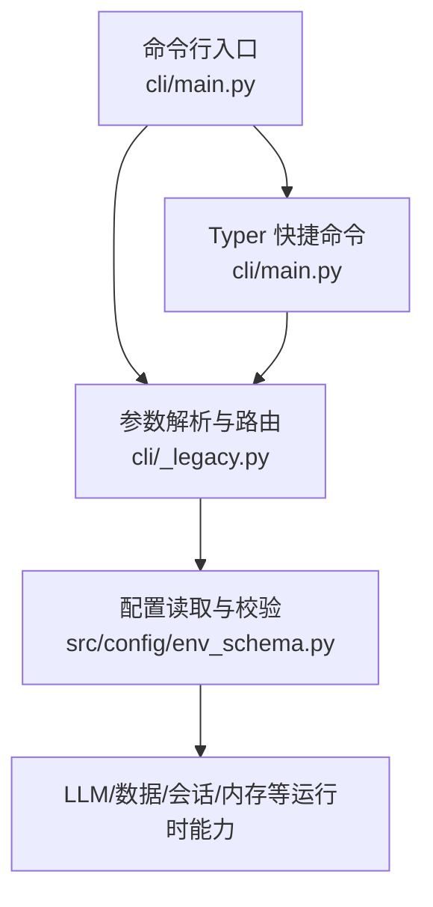
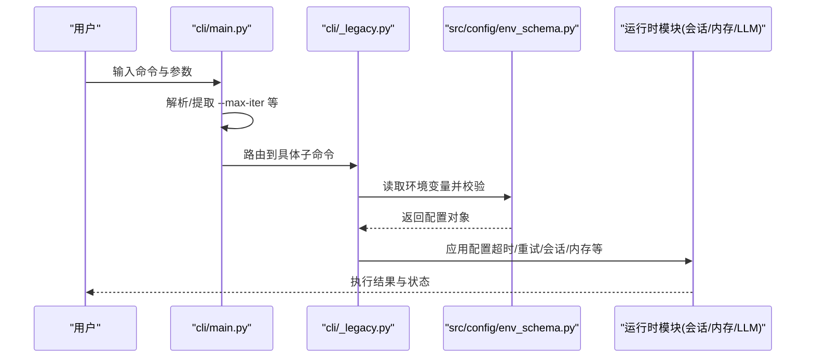
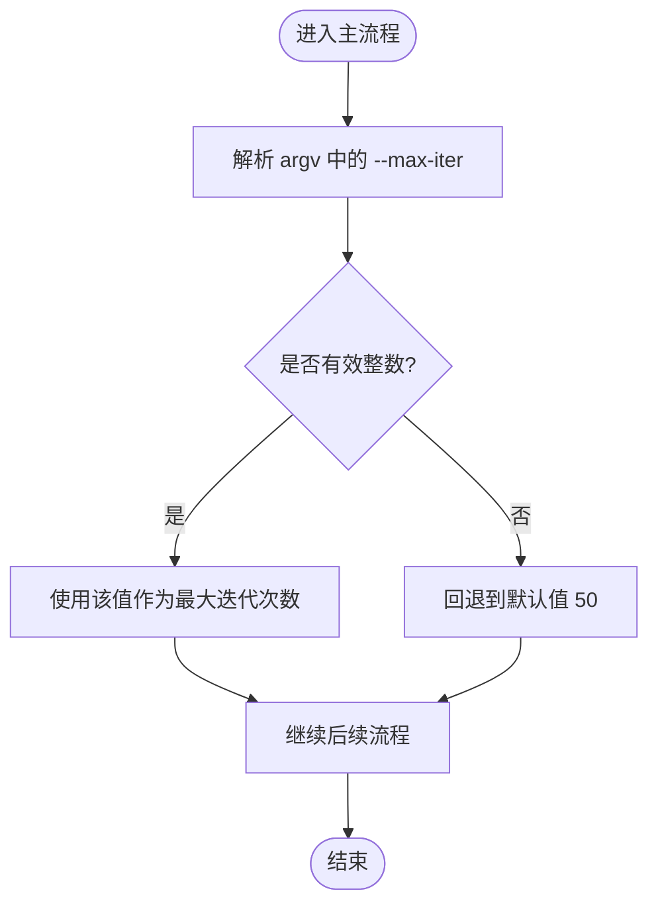
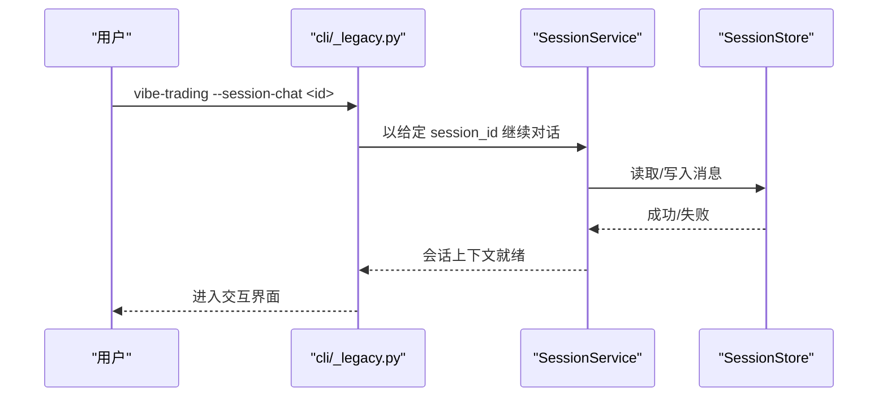
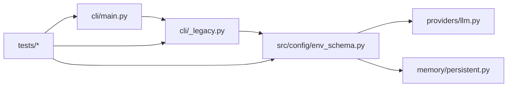

# 运行时选项

<cite>
**本文引用的文件**
- [agent/cli/_legacy.py](file://agent/cli/_legacy.py)
- [agent/cli/main.py](file://agent/cli/main.py)
- [agent/src/config/env_schema.py](file://agent/src/config/env_schema.py)
- [agent/src/providers/llm.py](file://agent/src/providers/llm.py)
- [agent/src/memory/persistent.py](file://agent/src/memory/persistent.py)
- [agent/tests/test_cli_interactive.py](file://agent/tests/test_cli_interactive.py)
- [agent/tests/test_cli_runtime.py](file://agent/tests/test_cli_runtime.py)
- [agent/tests/test_env_schema.py](file://agent/tests/test_env_schema.py)
</cite>

## 目录
1. [简介](#简介)
2. [项目结构](#项目结构)
3. [核心组件](#核心组件)
4. [架构总览](#架构总览)
5. [详细组件分析](#详细组件分析)
6. [依赖关系分析](#依赖关系分析)
7. [性能考虑](#性能考虑)
8. [故障排查指南](#故障排查指南)
9. [结论](#结论)
10. [附录：常用运行命令与最佳实践](#附录：常用运行命令与最佳实践)

## 简介
本文件聚焦 Vibe-Trading 的“运行时选项”，覆盖命令行启动时的关键参数、环境变量配置、会话管理、日志与调试、以及性能调优等主题。目标是帮助你在交互式模式与批处理模式下，正确选择并组合运行参数，以获得稳定、可观测且高效的执行体验。

## 项目结构
Vibe-Trading 的运行时入口由 CLI 层（argparse/Typer）与配置层（Pydantic 环境模型）共同组成：
- CLI 负责解析命令行参数、路由子命令、提取关键开关（如 --max-iter）。
- 配置层集中定义所有环境变量及其默认值、类型校验与回退策略。
- 运行时行为（如会话、内存、并发、超时）通过配置层暴露给上层模块使用。

**图表来源**
- [agent/cli/main.py:1517-1644](file://agent/cli/main.py#L1517-L1644)
- [agent/cli/_legacy.py:4764-4959](file://agent/cli/_legacy.py#L4764-L4959)
- [agent/src/config/env_schema.py:1-125](file://agent/src/config/env_schema.py#L1-L125)

**章节来源**
- [agent/cli/_legacy.py:4764-4959](file://agent/cli/_legacy.py#L4764-L4959)
- [agent/cli/main.py:1517-1644](file://agent/cli/main.py#L1517-L1644)
- [agent/src/config/env_schema.py:1-125](file://agent/src/config/env_schema.py#L1-L125)

## 核心组件
- 最大迭代次数（--max-iter）
  - 作用：限制智能体在单次交互中的最大推理步数，防止无限循环或过长运行。
  - 支持位置：顶层参数、run/chat 子命令参数；Typer 也提供便捷入口。
  - 默认值：50。
  - 影响范围：控制 ReAct 循环的最大展开深度，直接影响耗时与资源占用。
  - 参考路径：[CLI 顶层与子命令定义:4780-4800](file://agent/cli/_legacy.py#L4780-L4800)、[chat 子命令:5453-5454](file://agent/cli/_legacy.py#L5453-L5454)、[Typer 映射:1569-1573](file://agent/cli/main.py#L1569-L1573)、[提取逻辑:1517-1537](file://agent/cli/main.py#L1517-L1537)。

- 会话管理选项
  - 列出会话：--sessions
  - 继续会话聊天：--session-chat SESSION_ID
  - 作用：用于查看历史会话或在已有会话上下文中继续对话。
  - 参考路径：[会话相关参数:5389-5390](file://agent/cli/_legacy.py#L5389-L5390)、[会话 ID 传递测试:146-173](file://agent/tests/test_cli_session_id.py#L146-L173)。

- 其他常见 CLI 开关（节选）
  - --prompt / -p：传入提示文本（批处理常用）。
  - --prompt-file / -f：从文件读取提示文本。
  - --json：输出机器可读 JSON。
  - --no-rich：禁用富文本渲染（适合管道/自动化场景）。
  - --list/--show/--trace 等：查看运行历史与回放。
  - 参考路径：[顶层参数定义:5365-5378](file://agent/cli/_legacy.py#L5365-L5378)。

- 环境变量与配置（部分与运行时相关）
  - LLM 超时与重试：TIMEOUT_SECONDS、MAX_RETRIES、LANGCHAIN_* 系列。
  - 数据源与缓存：VIBE_TRADING_DATA_CACHE、CCXT_*、TUSHARE_TOKEN 等。
  - API 安全与 CORS：API_AUTH_KEY、CORS_ORIGINS、VIBE_TRADING_MCP_ALLOWED_HOSTS 等。
  - 会话运行时开关：ENABLE_SESSION_RUNTIME。
  - 内存特性开关：VT_MEMORY 及 VT_MEMORY_* 系列。
  - 参考路径：[配置模型与环境变量:132-394](file://agent/src/config/env_schema.py#L132-L394)、[内存开关使用:84-106](file://agent/src/memory/persistent.py#L84-L106)。

**章节来源**
- [agent/cli/_legacy.py:4767-4800](file://agent/cli/_legacy.py#L4767-L4800)
- [agent/cli/_legacy.py:5453-5454](file://agent/cli/_legacy.py#L5453-L5454)
- [agent/cli/main.py:1517-1573](file://agent/cli/main.py#L1517-L1573)
- [agent/src/config/env_schema.py:132-394](file://agent/src/config/env_schema.py#L132-L394)
- [agent/src/memory/persistent.py:84-106](file://agent/src/memory/persistent.py#L84-L106)
- [agent/tests/test_cli_session_id.py:146-173](file://agent/tests/test_cli_session_id.py#L146-L173)

## 架构总览
下图展示了从命令行到运行时配置的完整链路，包括参数提取、配置加载与生效点。

**图表来源**
- [agent/cli/main.py:1517-1644](file://agent/cli/main.py#L1517-L1644)
- [agent/cli/_legacy.py:4764-4959](file://agent/cli/_legacy.py#L4764-L4959)
- [agent/src/config/env_schema.py:1-125](file://agent/src/config/env_schema.py#L1-L125)

## 详细组件分析

### 最大迭代次数（--max-iter）
- 作用：限制智能体单轮交互的最大推理步数，避免长时间运行或资源耗尽。
- 默认值：50。
- 支持方式：
  - 顶层参数：vibe-trading --max-iter N
  - 子命令参数：vibe-trading chat --max-iter N
  - Typer 快捷：python -m cli.main chat --max-iter N
- 解析与验证：
  - 支持 --max-iter=N 与 --max-iter N 两种形式。
  - 非整数时回退为默认值，交由 argparse 做最终校验。
- 影响范围：
  - 控制 ReAct 循环展开深度，影响 CPU/内存与外部调用次数。
  - 与 LLM 超时、工具超时等配合，避免卡死。

**图表来源**
- [agent/cli/main.py:1517-1537](file://agent/cli/main.py#L1517-L1537)
- [agent/cli/_legacy.py:4780-4800](file://agent/cli/_legacy.py#L4780-L4800)
- [agent/cli/_legacy.py:5453-5454](file://agent/cli/_legacy.py#L5453-L5454)
- [agent/cli/main.py:1569-1573](file://agent/cli/main.py#L1569-L1573)

**章节来源**
- [agent/cli/main.py:1517-1537](file://agent/cli/main.py#L1517-L1537)
- [agent/cli/_legacy.py:4780-4800](file://agent/cli/_legacy.py#L4780-L4800)
- [agent/cli/_legacy.py:5453-5454](file://agent/cli/_legacy.py#L5453-L5454)
- [agent/cli/main.py:1569-1573](file://agent/cli/main.py#L1569-L1573)
- [agent/tests/test_cli_interactive.py:85-113](file://agent/tests/test_cli_interactive.py#L85-L113)

### 会话管理选项
- --sessions：列出当前会话。
- --session-chat SESSION_ID：在指定会话中继续对话。
- 行为要点：
  - 会话 ID 会透传到会话服务，确保消息归属同一上下文。
  - 若会话存储不可用，会降级为不持久化的临时 ID，保证流程不断裂。

**图表来源**
- [agent/cli/_legacy.py:5389-5390](file://agent/cli/_legacy.py#L5389-L5390)
- [agent/tests/test_cli_session_id.py:146-173](file://agent/tests/test_cli_session_id.py#L146-L173)

**章节来源**
- [agent/cli/_legacy.py:5389-5390](file://agent/cli/_legacy.py#L5389-L5390)
- [agent/tests/test_cli_session_id.py:146-173](file://agent/tests/test_cli_session_id.py#L146-L173)

### 日志级别与调试模式
- 日志级别：
  - 代码库未提供统一的 --log-level 命令行参数。
  - 可通过设置环境变量调整 LLM 请求超时、重试等行为，间接影响日志量与稳定性。
  - 参考路径：[LLM 配置项:132-159](file://agent/src/config/env_schema.py#L132-L159)。
- 调试模式：
  - 官方文档建议在需要详细日志时设置 VIBE_TRADING_DEBUG=1 并重启。
  - 该标志用于开启更详细的诊断信息，便于定位问题。
  - 参考路径：[调试提示](file://agent/cli/commands/chat.py:211)。

**章节来源**
- [agent/src/config/env_schema.py:132-159](file://agent/src/config/env_schema.py#L132-L159)
- [agent/cli/commands/chat.py:211](file://agent/cli/commands/chat.py#L211)

### 批处理模式下的选项支持
- 批处理常用参数：
  - --prompt/-p：直接传入提示文本。
  - --prompt-file/-f：从文件读取提示文本。
  - --json：输出结构化结果，便于脚本处理。
  - --no-rich：关闭富文本，利于管道输出。
  - --max-iter：限制运行步数，避免长尾任务。
- 参考路径：[顶层参数定义:5365-5378](file://agent/cli/_legacy.py#L5365-L5378)。

**章节来源**
- [agent/cli/_legacy.py:5365-5378](file://agent/cli/_legacy.py#L5365-L5378)

### 性能调优相关的运行时选项
- 并发与并行
  - SWARM_MAX_WORKERS：多智能体工作进程上限。
  - VIBE_TRADING_BENCH_WORKERS：基准测试并发度。
  - 参考路径：[Swarm 与 Agent 调优:318-394](file://agent/src/config/env_schema.py#L318-L394)。
- 超时与重试
  - TIMEOUT_SECONDS：LLM 请求超时。
  - MAX_RETRIES：最大重试次数。
  - 参考路径：[LLM 配置项:132-159](file://agent/src/config/env_schema.py#L132-L159)。
- 数据与缓存
  - VIBE_TRADING_DATA_CACHE：启用数据缓存以减少重复请求。
  - CCXT_TIMEOUT_MS、CCXT_FETCH_BUDGET_S：交易所拉取超时与预算。
  - 参考路径：[数据源配置:166-214](file://agent/src/config/env_schema.py#L166-L214)。
- 内存优化
  - VT_MEMORY 预设与 VT_MEMORY_* 细粒度开关，控制质量评分、GC、衰减、层级、链接、压缩、全文索引等。
  - 参考路径：[内存配置:601-655](file://agent/src/config/env_schema.py#L601-L655)、[衰减与质量开关使用:84-106](file://agent/src/memory/persistent.py#L84-L106)。

**章节来源**
- [agent/src/config/env_schema.py:166-214](file://agent/src/config/env_schema.py#L166-L214)
- [agent/src/config/env_schema.py:318-394](file://agent/src/config/env_schema.py#L318-L394)
- [agent/src/config/env_schema.py:601-655](file://agent/src/config/env_schema.py#L601-L655)
- [agent/src/memory/persistent.py:84-106](file://agent/src/memory/persistent.py#L84-L106)

### 环境变量优先级与验证机制
- 优先级
  - 显式构造参数优先于环境变量。
  - 环境变量通过 Pydantic 字段别名注入，缺失时回退到默认值。
  - 非法数值会被静默丢弃，从而触发默认值回退，避免启动失败。
- 类型与布尔转换
  - 布尔值接受多种字符串表示（true/false/on/off/1/0 等）。
  - 数值型字段对无效字符串进行安全降级。
- 参考路径：[配置基类与加载逻辑:81-125](file://agent/src/config/env_schema.py#L81-L125)、[类型转换与回退测试](file://agent/tests/test_env_schema.py:188-218)。

**章节来源**
- [agent/src/config/env_schema.py:81-125](file://agent/src/config/env_schema.py#L81-L125)
- [agent/tests/test_env_schema.py:188-218](file://agent/tests/test_env_schema.py#L188-L218)

### 错误处理与验证
- CLI 参数校验
  - --max-iter 非整数时回退默认值，再由 argparse 报错或继续。
  - 子命令路由失败时给出明确提示。
- 配置层容错
  - 非法环境变量值被忽略并回退默认值，保障系统健壮性。
- 参考路径：[参数提取与回退](file://agent/cli/main.py#L1517-L1537)、[配置加载与回退](file://agent/src/config/env_schema.py:81-125)、[连接器子命令路由](file://agent/tests/test_cli_runtime.py:113-140)。

**章节来源**
- [agent/cli/main.py:1517-1537](file://agent/cli/main.py#L1517-L1537)
- [agent/src/config/env_schema.py:81-125](file://agent/src/config/env_schema.py#L81-L125)
- [agent/tests/test_cli_runtime.py:113-140](file://agent/tests/test_cli_runtime.py#L113-L140)

## 依赖关系分析
- CLI 层依赖配置层提供的统一环境变量模型，确保运行时行为一致。
- 会话、内存、LLM 等模块通过配置层获取运行时参数，形成松耦合依赖。
- 测试用例覆盖了参数解析、路由与配置类型转换的关键路径。

**图表来源**
- [agent/cli/main.py:1517-1644](file://agent/cli/main.py#L1517-L1644)
- [agent/cli/_legacy.py:4764-4959](file://agent/cli/_legacy.py#L4764-L4959)
- [agent/src/config/env_schema.py:1-125](file://agent/src/config/env_schema.py#L1-L125)
- [agent/src/providers/llm.py:855-893](file://agent/src/providers/llm.py#L855-L893)
- [agent/src/memory/persistent.py:84-106](file://agent/src/memory/persistent.py#L84-L106)

**章节来源**
- [agent/cli/main.py:1517-1644](file://agent/cli/main.py#L1517-L1644)
- [agent/cli/_legacy.py:4764-4959](file://agent/cli/_legacy.py#L4764-L4959)
- [agent/src/config/env_schema.py:1-125](file://agent/src/config/env_schema.py#L1-L125)

## 性能考虑
- 合理设置 --max-iter，避免过深推理导致超时或资源耗尽。
- 结合 TIMEOUT_SECONDS 与 MAX_RETRIES，平衡稳定性与响应速度。
- 启用数据缓存（VIBE_TRADING_DATA_CACHE）减少重复网络请求。
- 根据硬件与任务规模调整 SWARM_MAX_WORKERS 与 VIBE_TRADING_BENCH_WORKERS。
- 使用 VT_MEMORY 预设与细粒度开关，按需开启 GC、压缩、全文索引等功能，降低内存压力。

[本节为通用指导，无需特定文件引用]

## 故障排查指南
- 无法识别的参数或子命令
  - 检查命令拼写与子命令顺序，确认使用了正确的子命令（如 chat/run/serve）。
  - 参考路径：[子命令路由与提示](file://agent/cli/_legacy.py:4764-4959)。
- --max-iter 无效
  - 确认传入值为整数；非整数将回退默认值并由 argparse 报错。
  - 参考路径：[参数提取与回退](file://agent/cli/main.py#L1517-L1537)。
- 环境变量未生效
  - 确认环境变量名与别名一致；非法值会被静默丢弃并回退默认值。
  - 参考路径：[配置加载与回退](file://agent/src/config/env_schema.py:81-125)。
- 会话相关问题
  - 检查 --session-chat 传入的会话 ID 是否存在；若存储异常会降级为临时 ID。
  - 参考路径：[会话 ID 传递测试](file://agent/tests/test_cli_session_id.py:146-173)。

**章节来源**
- [agent/cli/_legacy.py:4764-4959](file://agent/cli/_legacy.py#L4764-L4959)
- [agent/cli/main.py:1517-1537](file://agent/cli/main.py#L1517-L1537)
- [agent/src/config/env_schema.py:81-125](file://agent/src/config/env_schema.py#L81-L125)
- [agent/tests/test_cli_session_id.py:146-173](file://agent/tests/test_cli_session_id.py#L146-L173)

## 结论
Vibe-Trading 的运行时选项通过 CLI 与配置层协同工作，提供了灵活的参数控制与健壮的默认回退机制。建议在生产环境中结合 --max-iter、超时与重试、数据缓存与内存开关进行综合调优，并在需要时启用调试模式以获取更详细的诊断信息。

[本节为总结，无需特定文件引用]

## 附录：常用运行命令与最佳实践
- 交互式聊天（限制最大迭代）
  - 命令示例：vibe-trading chat --max-iter 30
  - 说明：限制智能体单轮最多 30 步，适合快速探索。
  - 参考路径：[chat 子命令参数](file://agent/cli/_legacy.py#L5453-L5454)、[提取逻辑](file://agent/cli/main.py#L1517-L1537)。
- 批处理运行（JSON 输出）
  - 命令示例：vibe-trading run -p "分析 AAPL 近一周走势" --json --max-iter 20
  - 说明：适合脚本化流水线，限制步数以控制成本。
  - 参考路径：[run 子命令参数](file://agent/cli/_legacy.py#L5395-L5400)。
- 继续会话
  - 命令示例：vibe-trading --session-chat abc123
  - 说明：在已有会话中继续对话，保持上下文连贯。
  - 参考路径：[会话参数](file://agent/cli/_legacy.py#L5389-L5390)。
- 开发/服务模式
  - 命令示例：vibe-trading serve --host 0.0.0.0 --port 8000
  - 说明：启动 API 服务，便于前端或外部系统集成。
  - 参考路径：[serve 子命令参数](file://agent/cli/_legacy.py#L5402-L5405)。
- 调试与日志
  - 设置环境变量：VIBE_TRADING_DEBUG=1
  - 说明：开启更详细的诊断信息，便于定位问题。
  - 参考路径：[调试提示](file://agent/cli/commands/chat.py:211)。

**章节来源**
- [agent/cli/_legacy.py:5395-5405](file://agent/cli/_legacy.py#L5395-L5405)
- [agent/cli/_legacy.py:5453-5454](file://agent/cli/_legacy.py#L5453-L5454)
- [agent/cli/main.py:1517-1537](file://agent/cli/main.py#L1517-L1537)
- [agent/cli/commands/chat.py:211](file://agent/cli/commands/chat.py#L211)