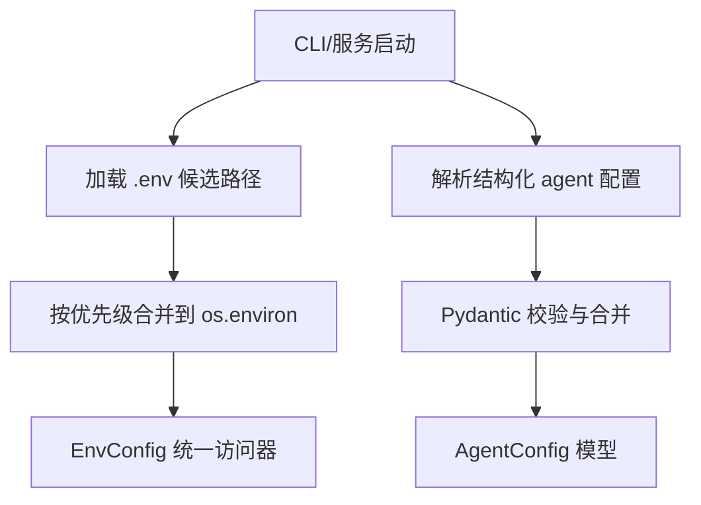
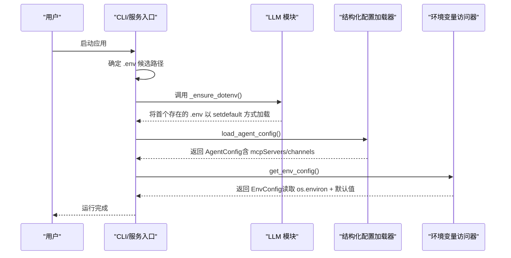
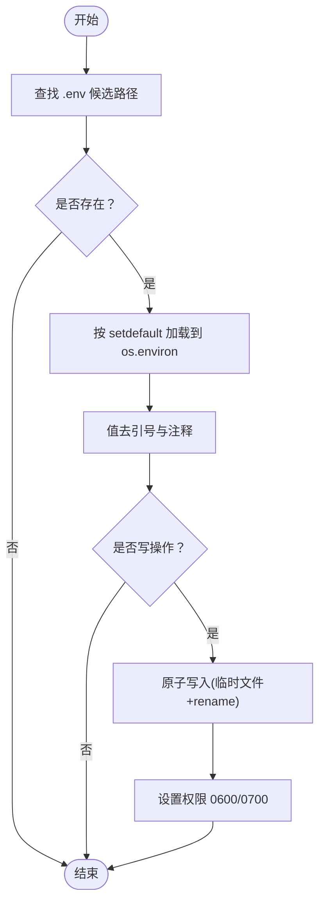
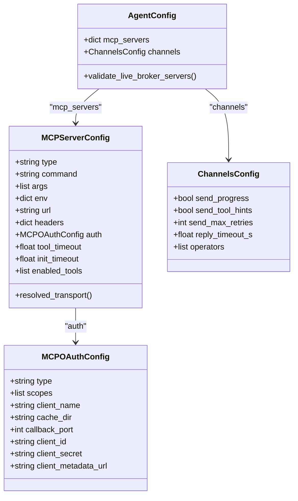
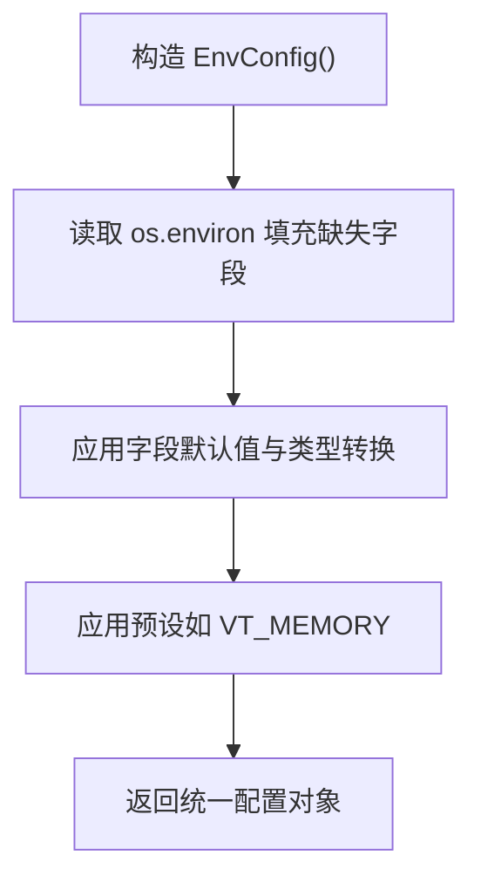
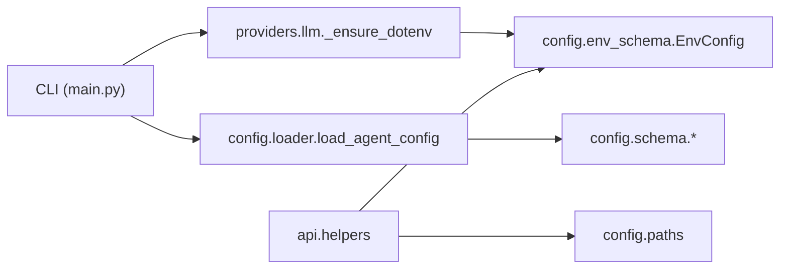

# 配置文件管理

<cite>
**本文引用的文件**
- [agent/src/config/loader.py](file://agent/src/config/loader.py)
- [agent/src/config/paths.py](file://agent/src/config/paths.py)
- [agent/src/config/schema.py](file://agent/src/config/schema.py)
- [agent/src/config/env_schema.py](file://agent/src/config/env_schema.py)
- [agent/src/config/migrate.py](file://agent/src/config/migrate.py)
- [agent/src/api/helpers.py](file://agent/src/api/helpers.py)
- [agent/cli/main.py](file://agent/cli/main.py)
- [agent/src/providers/llm.py](file://agent/src/providers/llm.py)
- [agent/tests/test_agent_config.py](file://agent/tests/test_agent_config.py)
- [agent/tests/test_env_schema.py](file://agent/tests/test_env_schema.py)
- [agent/tests/test_settings_api.py](file://agent/tests/test_settings_api.py)
</cite>

## 目录
1. [简介](#简介)
2. [项目结构](#项目结构)
3. [核心组件](#核心组件)
4. [架构总览](#架构总览)
5. [详细组件分析](#详细组件分析)
6. [依赖关系分析](#依赖关系分析)
7. [性能考虑](#性能考虑)
8. [故障排查指南](#故障排查指南)
9. [结论](#结论)
10. [附录](#附录)

## 简介
本文件系统性说明 Vibe-Trading 的配置文件管理机制，覆盖用户级、项目级与工作目录级的 .env 加载顺序与优先级；结构化 agent 配置（JSON/YAML）的位置、格式、类型与嵌套结构；运行时覆盖与合并策略；版本迁移与回滚；验证与错误处理；以及备份、恢复、同步与安全权限的最佳实践。

## 项目结构
Vibe-Trading 的配置体系由两部分组成：
- 环境变量型配置（.env）：通过 dotenv 机制加载到进程环境，供各模块读取。
- 结构化 Agent 配置（agent.json / agent.yaml / agent.yml）：用于定义 MCP 服务器、通道等高级能力。

**图示来源**
- [agent/cli/main.py:95-103](file://agent/cli/main.py#L95-L103)
- [agent/src/providers/llm.py:965-988](file://agent/src/providers/llm.py#L965-L988)
- [agent/src/config/loader.py:28-54](file://agent/src/config/loader.py#L28-L54)
- [agent/src/config/env_schema.py:685-716](file://agent/src/config/env_schema.py#L685-L716)

**章节来源**
- [agent/cli/main.py:95-103](file://agent/cli/main.py#L95-L103)
- [agent/src/providers/llm.py:965-988](file://agent/src/providers/llm.py#L965-L988)
- [agent/src/config/loader.py:28-54](file://agent/src/config/loader.py#L28-L54)
- [agent/src/config/env_schema.py:685-716](file://agent/src/config/env_schema.py#L685-L716)

## 核心组件
- 环境变量配置（.env）
  - 候选路径与优先级：用户级 ~/.vibe-trading/.env、项目级 agent/.env、工作目录 ./ .env。
  - 加载方式：首次发现即加载，使用 setdefault 避免覆盖已存在的环境变量。
  - 读写安全：原子写入、0600 权限、父目录 0700。
- 结构化 Agent 配置
  - 支持 JSON/YAML，位于运行时根目录（默认 ~/.vibe-trading），文件名 agent.json / agent.yaml / agent.yml。
  - 通过 Pydantic 模型严格校验，支持 camelCase/snake_case 别名。
  - 支持运行时覆盖（overrides）与深度合并，MCP 服务器字段有专用合并逻辑。
- 统一访问器
  - EnvConfig：集中声明所有环境变量及其默认值、类型与别名。
  - AgentConfig：集中声明结构化配置项与约束。

**章节来源**
- [agent/cli/main.py:95-103](file://agent/cli/main.py#L95-L103)
- [agent/src/providers/llm.py:965-988](file://agent/src/providers/llm.py#L965-L988)
- [agent/src/config/paths.py:13-87](file://agent/src/config/paths.py#L13-L87)
- [agent/src/config/loader.py:28-54](file://agent/src/config/loader.py#L28-L54)
- [agent/src/config/env_schema.py:685-716](file://agent/src/config/env_schema.py#L685-L716)
- [agent/src/config/schema.py:301-513](file://agent/src/config/schema.py#L301-L513)

## 架构总览
下图展示了从 CLI 启动到配置生效的关键流程，包括 .env 候选路径选择、加载顺序、环境变量注入，以及结构化配置的解析与合并。

**图示来源**
- [agent/cli/main.py:95-103](file://agent/cli/main.py#L95-L103)
- [agent/src/providers/llm.py:965-988](file://agent/src/providers/llm.py#L965-L988)
- [agent/src/config/loader.py:28-54](file://agent/src/config/loader.py#L28-L54)
- [agent/src/config/env_schema.py:685-716](file://agent/src/config/env_schema.py#L685-L716)

## 详细组件分析

### 环境变量型配置（.env）
- 位置与优先级
  - 用户级：~/.vibe-trading/.env
  - 项目级：agent/.env
  - 工作目录：./ .env
  - 加载顺序：按上述顺序查找第一个存在的文件并加载。
- 语法与特性
  - KEY=VALUE，支持单引号/双引号包裹值，支持行内注释（#）。
  - 支持 export KEY=VALUE 形式键名识别。
  - 重复键：读取时“最后一条有效”；写入时更新最后一个匹配键。
- 安全与权限
  - 写入采用原子替换（临时文件 + rename），失败清理临时文件。
  - 文件权限 0600，父目录 0700。
  - 日志中自动脱敏 URL 中的凭据片段。

**图示来源**
- [agent/cli/main.py:95-103](file://agent/cli/main.py#L95-L103)
- [agent/src/providers/llm.py:965-988](file://agent/src/providers/llm.py#L965-L988)
- [agent/src/api/helpers.py:73-133](file://agent/src/api/helpers.py#L73-L133)
- [agent/src/api/helpers.py:167-180](file://agent/src/api/helpers.py#L167-L180)

**章节来源**
- [agent/cli/main.py:95-103](file://agent/cli/main.py#L95-L103)
- [agent/src/providers/llm.py:965-988](file://agent/src/providers/llm.py#L965-L988)
- [agent/src/api/helpers.py:73-133](file://agent/src/api/helpers.py#L73-L133)
- [agent/src/api/helpers.py:167-180](file://agent/src/api/helpers.py#L167-L180)
- [agent/tests/test_settings_api.py:597-609](file://agent/tests/test_settings_api.py#L597-L609)

### 结构化 Agent 配置（JSON/YAML）
- 位置与发现
  - 运行时根目录：默认 ~/.vibe-trading，可通过环境变量覆盖。
  - 候选文件名：agent.json、agent.yaml、agent.yml。
  - Swarm 专用：优先使用 swarm-agent.json，否则回退到主 agent 配置。
- 格式与类型
  - 支持 JSON 与 YAML（需安装 PyYAML）。
  - 顶层模型：AgentConfig（包含 mcp_servers、channels）。
  - 子模型：MCPServerConfig（stdio/sse/streamableHttp）、MCPOAuthConfig、ChannelsConfig。
  - 支持 snake_case 与 camelCase 别名。
- 合并与覆盖
  - 运行时覆盖（overrides）先按部分模型校验，再递归合并。
  - mcp_servers 支持按服务器名称进行增量覆盖；若覆盖改变传输族，则重置不兼容字段。
- 安全与限制
  - 实时券商（如 robinhood、ibkr）禁止使用 enabled_tools=["*"]，必须显式白名单。
  - OAuth 仅允许 HTTPS，且不允许同时设置静态 headers。
  - 会话级覆盖默认剥离 mcpServers/mcp_servers，除非显式开启 ALLOW_SESSION_MCP_SERVERS。

**图示来源**
- [agent/src/config/schema.py:301-513](file://agent/src/config/schema.py#L301-L513)
- [agent/src/config/loader.py:262-345](file://agent/src/config/loader.py#L262-L345)

**章节来源**
- [agent/src/config/paths.py:13-87](file://agent/src/config/paths.py#L13-L87)
- [agent/src/config/loader.py:28-54](file://agent/src/config/loader.py#L28-L54)
- [agent/src/config/loader.py:137-151](file://agent/src/config/loader.py#L137-L151)
- [agent/src/config/loader.py:154-229](file://agent/src/config/loader.py#L154-L229)
- [agent/src/config/loader.py:232-345](file://agent/src/config/loader.py#L232-L345)
- [agent/src/config/schema.py:301-513](file://agent/src/config/schema.py#L301-L513)
- [agent/tests/test_agent_config.py:63-200](file://agent/tests/test_agent_config.py#L63-L200)

### 环境变量配置（EnvConfig）
- 作用
  - 作为所有环境变量的单一事实来源，提供类型、默认值与别名。
  - 支持布尔值宽松解析（true/false/yes/on/1 等）。
  - 支持预设模式（如 VT_MEMORY=off|on|full）与细粒度覆盖。
- 分组
  - llm、data、api、swarm、agent_tuning、paths、ocr、memory。
- 访问与缓存
  - 通过单例访问器获取，支持线程安全重置。

**图示来源**
- [agent/src/config/env_schema.py:81-124](file://agent/src/config/env_schema.py#L81-L124)
- [agent/src/config/env_schema.py:601-677](file://agent/src/config/env_schema.py#L601-L677)
- [agent/src/config/env_schema.py:685-716](file://agent/src/config/env_schema.py#L685-L716)

**章节来源**
- [agent/src/config/env_schema.py:81-124](file://agent/src/config/env_schema.py#L81-L124)
- [agent/src/config/env_schema.py:601-677](file://agent/src/config/env_schema.py#L601-L677)
- [agent/src/config/env_schema.py:685-716](file://agent/src/config/env_schema.py#L685-L716)
- [agent/tests/test_env_schema.py:69-178](file://agent/tests/test_env_schema.py#L69-L178)

### 版本管理与迁移策略
- 历史状态迁移
  - 旧版数据目录（sessions/runs/uploads/.swarm/runs）从代码相对路径迁移至运行时根目录。
  - 迁移过程原子化（临时命名 + rename），中断可恢复，冲突跳过。
- 环境变量示例与模板
  - 提供 .env.example 作为模板参考，便于初始化与对齐。
- 建议
  - 升级前备份 ~/.vibe-trading 目录。
  - 迁移完成后检查目标目录结构与权限。

**章节来源**
- [agent/src/config/migrate.py:1-153](file://agent/src/config/migrate.py#L1-L153)
- [agent/src/api/helpers.py:31-33](file://agent/src/api/helpers.py#L31-L33)

### 验证与错误处理
- 结构化配置
  - 使用 Pydantic 模型进行强类型校验；非法值或冲突字段直接抛出异常。
  - 对实时券商启用 wildcard 工具列表进行拒绝，强制显式白名单。
- 环境变量
  - 非数字/非法布尔值会静默回退到默认值，避免启动失败。
  - 日志中对敏感信息（URL 中的凭据）进行脱敏。
- 会话覆盖
  - 默认剥离可能带来执行能力的 mcpServers/mcp_servers，除非显式开启开关。

**章节来源**
- [agent/src/config/schema.py:419-457](file://agent/src/config/schema.py#L419-L457)
- [agent/src/config/schema.py:514-548](file://agent/src/config/schema.py#L514-L548)
- [agent/src/config/env_schema.py:48-74](file://agent/src/config/env_schema.py#L48-L74)
- [agent/src/config/loader.py:107-134](file://agent/src/config/loader.py#L107-L134)
- [agent/tests/test_dotenv_observability.py:100-118](file://agent/tests/test_dotenv_observability.py#L100-L118)

### 备份、恢复与同步最佳实践
- 备份
  - 定期备份 ~/.vibe-trading 目录（包含 .env、sessions、runs、uploads、workspace）。
  - 对 .env 单独做加密备份（因其包含密钥）。
- 恢复
  - 恢复时保持目录结构与权限（父目录 0700，.env 0600）。
  - 若使用桌面端安全存储，注意明文字段已被移除，需通过安全存储恢复。
- 同步
  - 多机同步建议使用受控渠道（如加密仓库），避免泄露密钥。
  - 变更 .env 后，重启服务或调用设置接口以刷新配置缓存。

[本节为通用实践指导，无需具体文件引用]

### 安全性与权限控制
- 文件权限
  - .env 与相关目录使用严格权限（0600/0700），防止未授权读取。
- 写入安全
  - 原子写入避免崩溃导致半写文件或残留临时文件。
- 网络与认证
  - OAuth 仅允许 HTTPS；禁止与静态 headers 混用。
  - 实时券商禁用 wildcard 工具列表，强制最小权限白名单。
- 会话注入防护
  - 默认剥离高风险的 mcpServers 注入，需显式开启才允许。

**章节来源**
- [agent/src/api/helpers.py:73-133](file://agent/src/api/helpers.py#L73-L133)
- [agent/src/config/schema.py:419-457](file://agent/src/config/schema.py#L419-L457)
- [agent/src/config/schema.py:514-548](file://agent/src/config/schema.py#L514-L548)
- [agent/src/config/loader.py:107-134](file://agent/src/config/loader.py#L107-L134)

## 依赖关系分析
- CLI 负责 .env 候选路径选择与首次加载。
- providers.llm 实现 .env 的 setdefault 加载与日志脱敏。
- config.loader 负责结构化配置读取、校验与合并。
- config.env_schema 提供统一的环境变量访问器与默认值。
- api.helpers 提供安全的 .env 读写与路径常量。

**图示来源**
- [agent/cli/main.py:95-103](file://agent/cli/main.py#L95-L103)
- [agent/src/providers/llm.py:965-988](file://agent/src/providers/llm.py#L965-L988)
- [agent/src/config/loader.py:28-54](file://agent/src/config/loader.py#L28-L54)
- [agent/src/config/env_schema.py:685-716](file://agent/src/config/env_schema.py#L685-L716)
- [agent/src/api/helpers.py:31-33](file://agent/src/api/helpers.py#L31-L33)
- [agent/src/config/paths.py:13-87](file://agent/src/config/paths.py#L13-L87)

**章节来源**
- [agent/cli/main.py:95-103](file://agent/cli/main.py#L95-L103)
- [agent/src/providers/llm.py:965-988](file://agent/src/providers/llm.py#L965-L988)
- [agent/src/config/loader.py:28-54](file://agent/src/config/loader.py#L28-L54)
- [agent/src/config/env_schema.py:685-716](file://agent/src/config/env_schema.py#L685-L716)
- [agent/src/api/helpers.py:31-33](file://agent/src/api/helpers.py#L31-L33)
- [agent/src/config/paths.py:13-87](file://agent/src/config/paths.py#L13-L87)

## 性能考虑
- .env 仅在首次发现时加载一次，避免重复 I/O。
- 结构化配置加载失败会降级为默认配置，不影响启动。
- 环境变量读取通过单例缓存，减少重复解析开销。
- 大体积配置（如大量 mcp_servers）应谨慎维护，必要时拆分与按需加载。

[本节为通用性能指导，无需具体文件引用]

## 故障排查指南
- 症状：配置未生效
  - 检查 .env 候选路径是否正确，确认首个存在的文件被加载。
  - 确认键名大小写与别名正确，查看 EnvConfig 字段别名。
- 症状：启动时报错
  - 检查结构化配置是否符合 schema 约束（如 HTTP 传输需指定 type）。
  - 检查实时券商配置是否使用了 wildcard 工具列表。
- 症状：权限错误
  - 确认 ~/.vibe-trading 目录与 .env 文件权限符合 0700/0600。
  - 在容器只读根文件系统下，原子写入不可用时回退为原地写入。
- 症状：敏感信息泄露
  - 检查日志是否包含 URL 中的凭据片段（应已脱敏）。
  - 确保未将密钥提交至版本库。

**章节来源**
- [agent/src/config/loader.py:28-54](file://agent/src/config/loader.py#L28-L54)
- [agent/src/config/schema.py:419-457](file://agent/src/config/schema.py#L419-L457)
- [agent/src/config/schema.py:514-548](file://agent/src/config/schema.py#L514-L548)
- [agent/src/api/helpers.py:73-133](file://agent/src/api/helpers.py#L73-L133)
- [agent/tests/test_dotenv_observability.py:100-118](file://agent/tests/test_dotenv_observability.py#L100-L118)

## 结论
Vibe-Trading 的配置文件管理通过“环境变量 + 结构化配置”的双层设计，兼顾灵活性与安全性。环境变量负责密钥与基础参数，结构化配置负责高级能力（如 MCP 服务器）。严格的校验、安全的写入与权限控制、完善的迁移与回滚机制，使其在生产环境中具备高可靠性。建议遵循本文的最佳实践进行配置管理。

[本节为总结性内容，无需具体文件引用]

## 附录

### 配置项速查（节选）
- 环境变量（部分）
  - LANGCHAIN_PROVIDER、TIMEOUT_SECONDS、MAX_RETRIES
  - TUSHARE_TOKEN、CCXT_EXCHANGE、FINNHUB_API_KEY
  - API_AUTH_KEY、CORS_ORIGINS、ENABLE_SESSION_RUNTIME
  - SWARM_WORKER_TIMEOUT、SWARM_MAX_WORKERS
  - VT_MEMORY（off/on/full）及 VT_MEMORY_* 细粒度开关
- 结构化配置（顶层）
  - mcp_servers：外部 MCP 服务器集合
  - channels：IM 通道全局设置

**章节来源**
- [agent/src/config/env_schema.py:132-213](file://agent/src/config/env_schema.py#L132-L213)
- [agent/src/config/env_schema.py:261-332](file://agent/src/config/env_schema.py#L261-L332)
- [agent/src/config/env_schema.py:339-394](file://agent/src/config/env_schema.py#L339-L394)
- [agent/src/config/env_schema.py:601-677](file://agent/src/config/env_schema.py#L601-L677)
- [agent/src/config/schema.py:508-512](file://agent/src/config/schema.py#L508-L512)