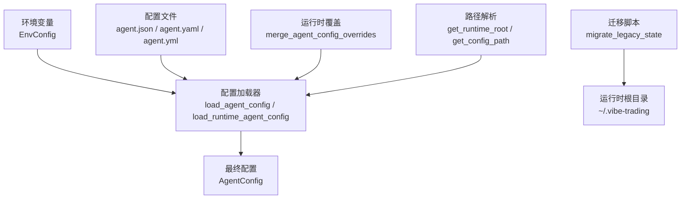
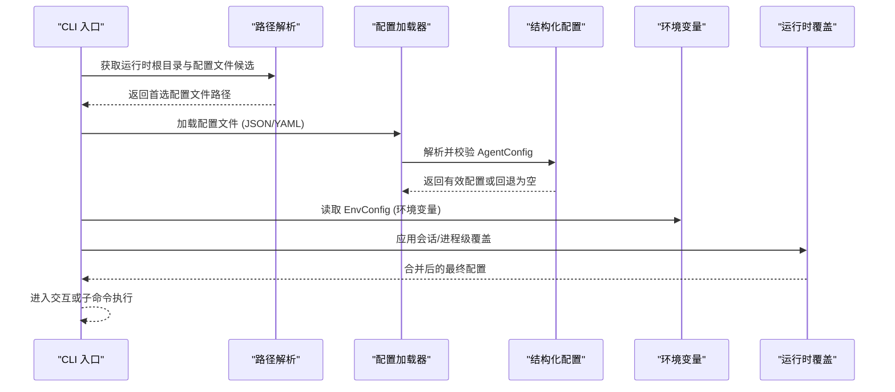
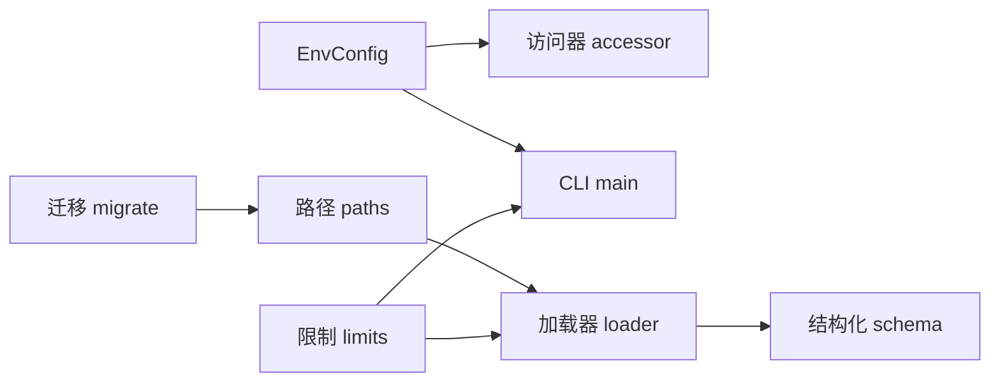

# 配置选项

<cite>
**本文引用的文件**
- [env_schema.py](file://agent/src/config/env_schema.py)
- [accessor.py](file://agent/src/config/accessor.py)
- [loader.py](file://agent/src/config/loader.py)
- [paths.py](file://agent/src/config/paths.py)
- [schema.py](file://agent/src/config/schema.py)
- [migrate.py](file://agent/src/config/migrate.py)
- [limits.py](file://agent/src/config/limits.py)
- [main.py](file://agent/cli/main.py)
- [_legacy.py](file://agent/cli/_legacy.py)
</cite>

## 目录
1. [简介](#简介)
2. [项目结构](#项目结构)
3. [核心组件](#核心组件)
4. [架构总览](#架构总览)
5. [详细组件分析](#详细组件分析)
6. [依赖关系分析](#依赖关系分析)
7. [性能考量](#性能考量)
8. [故障排查指南](#故障排查指南)
9. [结论](#结论)
10. [附录](#附录)

## 简介
本文件面向 Vibe-Trading CLI 的配置体系，系统性说明环境变量、配置文件与运行时参数的来源、优先级、校验规则与安全边界。重点覆盖：
- 环境变量：LLM 提供商、API 密钥、模型选择、数据源凭据、OCR、API 服务器安全开关、多智能体集群参数、内存特性开关等。
- 配置文件：位置、格式（JSON/YAML）、加载顺序、合并策略与迁移机制。
- 运行时参数：最大迭代次数、调试模式、日志级别、工具结果截断等。
- 场景化推荐：开发、生产、高性能计算环境的最佳实践。
- 验证与错误处理：Pydantic 校验、回退策略、安全门控。
- 版本兼容与迁移：旧变量别名、状态目录迁移。
- 常见配置问题诊断与解决。

## 项目结构
Vibe-Trading 的配置由“环境变量 + 结构化配置文件 + 运行时覆盖”三层组成：
- 环境变量层：集中定义于 Pydantic 模型，统一读取 os.environ，提供类型校验与默认值。
- 配置文件层：位于用户运行时根目录，支持 JSON/YAML，按优先级查找并解析。
- 运行时覆盖层：会话级或进程级覆盖，经严格白名单与沙箱限制后合并入最终配置。

图表来源
- [env_schema.py:685-703](file://agent/src/config/env_schema.py#L685-L703)
- [loader.py:28-54](file://agent/src/config/loader.py#L28-L54)
- [paths.py:13-34](file://agent/src/config/paths.py#L13-L34)
- [migrate.py:114-152](file://agent/src/config/migrate.py#L114-L152)

章节来源
- [env_schema.py:685-703](file://agent/src/config/env_schema.py#L685-L703)
- [loader.py:28-54](file://agent/src/config/loader.py#L28-L54)
- [paths.py:13-34](file://agent/src/config/paths.py#L13-L34)
- [migrate.py:114-152](file://agent/src/config/migrate.py#L114-L152)

## 核心组件
- 环境变量模型 EnvConfig：集中管理所有环境变量，分组为 LLM、数据源、OCR、API 服务器、多智能体、Agent 调优、路径、内存等子配置。
- 配置加载器：从磁盘加载 JSON/YAML 配置文件，失败时回退到空配置；支持运行时覆盖合并。
- 路径解析：确定运行时根目录、配置文件候选路径、会话/运行/上传目录。
- 结构化 AgentConfig：定义 MCP 服务器、通道等高级配置，含安全校验（如禁止在线券商使用通配符工具列表）。
- 访问器：线程安全的单例缓存 EnvConfig，支持运行时重置。
- 限制与截断：统一工具结果长度上限与提示。

章节来源
- [env_schema.py:132-579](file://agent/src/config/env_schema.py#L132-L579)
- [loader.py:28-151](file://agent/src/config/loader.py#L28-L151)
- [paths.py:13-113](file://agent/src/config/paths.py#L13-L113)
- [schema.py:301-513](file://agent/src/config/schema.py#L301-L513)
- [accessor.py:52-93](file://agent/src/config/accessor.py#L52-L93)
- [limits.py:12-49](file://agent/src/config/limits.py#L12-L49)

## 架构总览
下图展示配置在启动时的装配流程：CLI 入口探测 .env，必要时引导初始化；随后通过路径解析找到配置文件，加载并合并运行时覆盖；环境变量作为基础配置注入；最终得到可被各模块消费的 AgentConfig 与 EnvConfig。

图表来源
- [main.py:271-304](file://agent/cli/main.py#L271-L304)
- [loader.py:28-54](file://agent/src/config/loader.py#L28-L54)
- [paths.py:57-87](file://agent/src/config/paths.py#L57-L87)
- [env_schema.py:685-703](file://agent/src/config/env_schema.py#L685-L703)

## 详细组件分析

### 环境变量配置（EnvConfig）
- LLM 提供商与生成参数：
  - 提供商与模型：LANGCHAIN_PROVIDER、LANGCHAIN_MODEL_NAME、OPENAI_MODEL
  - 温度与推理努力：LANGCHAIN_TEMPERATURE、LANGCHAIN_REASONING_EFFORT
  - 超时与重试：TIMEOUT_SECONDS、MAX_RETRIES
  - Responses API 开关：LANGCHAIN_USE_RESPONSES_API（仅字面量 "true" 启用）
  - DeepSeek 适配器：VIBE_TRADING_DEEPSEEK_ADAPTER
  - Moonshot 用户代理：MOONSHOT_USER_AGENT
  - OpenAI Codex 基址：OPENAI_CODEX_BASE_URL
  - HTTP 代理禁用：VIBE_TRADING_DISABLE_HTTP_PROXY
- 数据源凭据与调优：
  - Tushare、CCXT、Futu、Finnhub、AlphaVantage、Tiingo、FMP、Fred、Iwencai、SEC、OpenAlex、阿里云 IQS、Qveris、Tickerall、RSSHub、DashScope、Longbridge、Etoro 等键名与默认值。
  - 数据缓存开关与根路径：VIBE_TRADING_DATA_CACHE、VIBE_TRADING_DATA_CACHE_ROOT
- OCR 引擎与模型：
  - VIBE_TRADING_OCR_ENGINE、VIBE_TRADING_OCR_LLM_MODEL
  - 兼容旧别名 VIBE_TRADING_OCR_QWEN_MODEL（弃用警告）
- API 服务器安全与网络：
  - 认证键：API_AUTH_KEY、VIBE_TRADING_API_KEY（自动复制到 api_auth_key）
  - CORS 与允许主机：CORS_ORIGINS、VIBE_TRADING_EXTRA_CORS_ORIGINS、API_ALLOWED_HOSTS、VIBE_TRADING_MCP_ALLOWED_HOSTS
  - 会话运行时开关：ENABLE_SESSION_RUNTIME
  - Docker 环回信任：VIBE_TRADING_TRUST_DOCKER_LOOPBACK
  - CSP 报告模式：VIBE_TRADING_CSP_REPORT_ONLY
  - Shell 工具开关：VIBE_TRADING_ENABLE_SHELL_TOOLS
  - 文件读写/运行根白名单：VIBE_TRADING_ALLOWED_FILE_ROOTS、VIBE_TRADING_ALLOWED_WRITE_ROOTS、VIBE_TRADING_ALLOWED_RUN_ROOTS
  - API 地址：VIBE_TRADING_API_URL
  - Futu 交易密码 MD5：FUTU_TRADE_PWD_MD5
- 多智能体集群：
  - 工作器超时、最大迭代、并发数、心跳间隔、流重试延迟、 grounding 符号上限等。
- Agent 调优：
  - Token 阈值、心跳间隔、推理增量最小间隔、流重试延迟、工具超时、目标最大续写、SSE 超时、内容过滤告警阈值、顾问/调度器开关、搜索后端、斜杠参数上限、Bing 回退、授权超时等。
- 路径与会话信任：
  - 假设/目标数据库路径、剧本目录、Swarm 配置路径、会话级 MCP 信任开关、主题、会话 ID、策略存储 DB 路径。
- 内存特性开关：
  - VT_MEMORY 预设（off/on/full），以及 VT_MEMORY_QUALITY/GC/DECAY/HIERARCHY/LINKS/COMPRESSION/FTS_INDEX 等独立开关。

章节来源
- [env_schema.py:132-579](file://agent/src/config/env_schema.py#L132-L579)

### 配置文件（JSON/YAML）
- 位置与查找顺序：
  - 运行时根目录 ~/.vibe-trading（可通过 VIBE_TRADING_HOME 覆盖）
  - 候选文件名：agent.json、agent.yaml、agent.yml
  - 显式路径优先；不存在则返回推荐默认路径
- 格式与解析：
  - JSON 直接解析；YAML 需要 PyYAML，否则报错
  - 必须解析为对象（字典）
- Swarm 专用配置：
  - 优先使用 VIBE_TRADING_SWARM_AGENT_CONFIG 指定路径
  - 其次尝试 <runtime_root>/swarm-agent.json
  - 最后回退到主 agent.json/yaml/yml
- 运行时覆盖合并：
  - 支持 snake_case 与 camelCase 键
  - mcp_servers 的合并会检测传输族切换并重置不兼容字段
  - 会话覆盖中的敏感键（mcpServers/mcp_servers）默认剥离，除非设置 ALLOW_SESSION_MCP_SERVERS=1

章节来源
- [paths.py:13-87](file://agent/src/config/paths.py#L13-L87)
- [loader.py:154-229](file://agent/src/config/loader.py#L154-L229)
- [loader.py:232-346](file://agent/src/config/loader.py#L232-L346)

### 结构化 AgentConfig 与安全门控
- MCP 服务器配置：
  - 传输类型：stdio/sse/streamableHttp
  - 命令与环境：stdio 必需 command；HTTP 必需 url 且需显式 type
  - OAuth：仅 HTTPS，禁止同时设置静态 headers
  - 工具白名单：默认 ["*"]，但在线券商禁止通配符，必须显式只读白名单
- 在线券商识别与限制：
  - 通过 key 或 URL host 后缀识别（robinhood.com、ibkr.com）
  - 仅 IBKR 允许在特定 read-only 范围下使用通配符进行工具发现
  - Robinhood 提供只读种子配置模板
- 通道配置：
  - 全局发送进度、工具提示、重试次数、回复超时
  - 操作者白名单用于跨通道配对控制

章节来源
- [schema.py:11-50](file://agent/src/config/schema.py#L11-L50)
- [schema.py:72-143](file://agent/src/config/schema.py#L72-L143)
- [schema.py:181-237](file://agent/src/config/schema.py#L181-L237)
- [schema.py:301-513](file://agent/src/config/schema.py#L301-L513)

### 运行时参数与 CLI
- 最大迭代次数：
  - CLI chat 支持 --max-iter 或 --max-iter=N
  - 交互式上下文默认 max_iter=50
- 调试模式：
  - 交互式上下文 debug 标志控制是否打印调试摘要
- 日志级别：
  - 配置加载失败记录 warning，并附带 debug 详情
- 工具结果截断：
  - 统一上限 10,000 字符，超出时附加提示

章节来源
- [main.py:250-268](file://agent/cli/main.py#L250-L268)
- [main.py:329-359](file://agent/cli/main.py#L329-L359)
- [loader.py:44-54](file://agent/src/config/loader.py#L44-L54)
- [limits.py:12-49](file://agent/src/config/limits.py#L12-L49)

### 配置验证与错误处理
- 环境变量：
  - 布尔值宽松解析（"1"/"true"/"yes"/"on" 为真；"0"/"false"/"no"/"off"/"" 为假）
  - 数值型无效值静默丢弃，回退到默认值
  - 响应式 API 开关仅接受字面量 "true"
- 配置文件：
  - 解析失败或不可读时，记录警告并回退到空配置
  - YAML 缺失时抛出明确错误
- 运行时覆盖：
  - 非法覆盖忽略并记录警告，保留基础配置
  - 会话覆盖中剥离敏感键，除非显式开启
- 在线券商：
  - 通配符工具列表拒绝，给出具体修复指引（Robinhood 种子配置）

章节来源
- [env_schema.py:48-74](file://agent/src/config/env_schema.py#L48-L74)
- [env_schema.py:91-124](file://agent/src/config/env_schema.py#L91-L124)
- [loader.py:44-54](file://agent/src/config/loader.py#L44-L54)
- [loader.py:57-99](file://agent/src/config/loader.py#L57-L99)
- [loader.py:107-134](file://agent/src/config/loader.py#L107-L134)
- [schema.py:514-548](file://agent/src/config/schema.py#L514-L548)

### 配置迁移与版本兼容性
- 旧环境变量别名：
  - VIBE_TRADING_OCR_QWEN_MODEL → VIBE_TRADING_OCR_LLM_MODEL（带弃用警告）
  - VIBE_TRADING_API_KEY → API_AUTH_KEY（自动复制语义）
- 状态目录迁移：
  - 将 sessions/runs/.swarm/runs/uploads 从代码相对路径迁移至运行时根目录
  - 原子移动与恢复中断迁移，避免半拷贝残留
  - 跳过疑似 Python 包目录，防止误删

章节来源
- [env_schema.py:295-318](file://agent/src/config/env_schema.py#L295-L318)
- [env_schema.py:705-716](file://agent/src/config/env_schema.py#L705-L716)
- [migrate.py:1-19](file://agent/src/config/migrate.py#L1-L19)
- [migrate.py:114-152](file://agent/src/config/migrate.py#L114-L152)

### 不同使用场景的推荐配置
- 开发环境：
  - 启用本地调试与更多日志；适当提高 TIMEOUT_SECONDS 与 MAX_RETRIES
  - 关闭严格 CSP 报告模式（如需自定义前端资源）
  - 使用本地数据源或测试凭据
- 生产环境：
  - 固定 LLM 提供商与模型；设置强 API_AUTH_KEY/VIBE_TRADING_API_KEY
  - 限制 CORS_ORIGINS 与 API_ALLOWED_HOSTS；启用 VIBE_TRADING_MCP_ALLOWED_HOSTS 仅允许内网
  - 关闭 shell 工具；限定文件读写/运行根白名单
  - 合理设置 SWARM_* 参数以控制并发与超时
- 高性能计算：
  - 调整 TOKEN_THRESHOLD、VT_HEARTBEAT_INTERVAL_S、VT_REASONING_DELTA_MIN_INTERVAL_S
  - 增大 SWARM_WORKER_TIMEOUT、SWARM_MAX_WORKERS、SWARM_TIMEOUT
  - 启用内存 full 预设以提升检索与压缩能力

[本节为概念性建议，不直接引用具体文件]

### 安全性最佳实践
- 凭证管理：
  - 使用环境变量或受保护的 .env 文件；避免硬编码
  - 对在线券商使用只读白名单；仅在存在授权委托后添加写入工具
- 网络安全：
  - 强制 HTTPS 用于 OAuth；限制允许的 Host/Origin
  - 谨慎启用 shell 工具与文件根白名单
- 会话隔离：
  - 默认剥离会话级 MCP 注入；仅在可信环境中开启 ALLOW_SESSION_MCP_SERVERS
- 审计与合规：
  - 使用 CSP Report-Only 逐步过渡；记录配置加载失败与迁移信息

章节来源
- [schema.py:514-548](file://agent/src/config/schema.py#L514-L548)
- [loader.py:107-134](file://agent/src/config/loader.py#L107-L134)
- [env_schema.py:326-375](file://agent/src/config/env_schema.py#L326-L375)

## 依赖关系分析
配置子系统内部依赖清晰，低耦合高内聚：
- EnvConfig 作为单一事实来源，被 CLI、加载器、访问器消费
- 加载器依赖路径解析与结构化 schema
- 迁移脚本依赖路径解析，确保状态目录一致性
- 限制模块被循环与集群共享，避免重复定义

图表来源
- [accessor.py:52-93](file://agent/src/config/accessor.py#L52-L93)
- [loader.py:28-54](file://agent/src/config/loader.py#L28-L54)
- [paths.py:13-87](file://agent/src/config/paths.py#L13-L87)
- [limits.py:12-49](file://agent/src/config/limits.py#L12-L49)

章节来源
- [accessor.py:52-93](file://agent/src/config/accessor.py#L52-L93)
- [loader.py:28-54](file://agent/src/config/loader.py#L28-L54)
- [paths.py:13-87](file://agent/src/config/paths.py#L13-L87)
- [limits.py:12-49](file://agent/src/config/limits.py#L12-L49)

## 性能考量
- 工具结果截断：统一 10,000 字符上限，减少大响应对模型上下文的影响
- 心跳与重试：VT_HEARTBEAT_INTERVAL_S、VT_STREAM_RETRY_DELAY_S、SWARM_* 相关参数影响交互流畅度与稳定性
- 内存特性：full 预设启用层级路由、链接、压缩与全文索引，提升检索效率但增加开销
- 并发与超时：SWARM_MAX_WORKERS、SWARM_TIMEOUT、TIMEOUT_SECONDS 需根据硬件与网络状况调优

章节来源
- [limits.py:12-49](file://agent/src/config/limits.py#L12-L49)
- [env_schema.py:318-394](file://agent/src/config/env_schema.py#L318-L394)
- [env_schema.py:601-677](file://agent/src/config/env_schema.py#L601-L677)

## 故障排查指南
- 无法加载配置文件：
  - 检查文件格式与权限；确认 YAML 依赖已安装
  - 查看日志中的警告与调试详情
- 环境变量未生效：
  - 确认变量名与别名；检查布尔值字符串是否符合约定
  - 调用 reset_env_config 后重新获取配置
- 在线券商配置被拒绝：
  - 移除通配符 enabled_tools，改用只读白名单
  - 遵循 Robinhood 种子配置模板
- 会话覆盖被剥离：
  - 如需注入 MCP 服务器，设置 ALLOW_SESSION_MCP_SERVERS=1
- 状态目录冲突：
  - 检查迁移日志；手动清理或重命名冲突项

章节来源
- [loader.py:44-54](file://agent/src/config/loader.py#L44-L54)
- [accessor.py:79-93](file://agent/src/config/accessor.py#L79-L93)
- [schema.py:514-548](file://agent/src/config/schema.py#L514-L548)
- [loader.py:107-134](file://agent/src/config/loader.py#L107-L134)
- [migrate.py:77-102](file://agent/src/config/migrate.py#L77-L102)

## 结论
Vibe-Trading 的配置体系以环境变量为核心，结合结构化配置文件与严格的运行时覆盖，提供了类型安全、可迁移、可扩展且具备安全门控的配置能力。通过统一的校验与回退机制，系统在开发与生产环境中均能稳定运行；通过场景化调参与安全最佳实践，可在保证安全的前提下获得更佳性能与用户体验。

[本节为总结性内容，不直接引用具体文件]

## 附录
- 常用环境变量速查（节选）：
  - LLM：LANGCHAIN_PROVIDER、LANGCHAIN_MODEL_NAME、OPENAI_MODEL、TIMEOUT_SECONDS、MAX_RETRIES
  - 数据源：TUSHARE_TOKEN、FINNHUB_API_KEY、ALPHAVANTAGE_API_KEY、TIINGO_API_KEY、FMP_API_KEY、FRED_API_KEY
  - API 安全：API_AUTH_KEY、CORS_ORIGINS、API_ALLOWED_HOSTS、VIBE_TRADING_MCP_ALLOWED_HOSTS、VIBE_TRADING_ENABLE_SHELL_TOOLS
  - 多智能体：SWARM_WORKER_TIMEOUT、SWARM_WORKER_MAX_ITER、SWARM_MAX_WORKERS、SWARM_TIMEOUT
  - Agent 调优：TOKEN_THRESHOLD、VT_HEARTBEAT_INTERVAL_S、VIBE_TRADING_TOOL_TIMEOUT_SECONDS
  - 路径与信任：VIBE_TRADING_HOME、ALLOW_SESSION_MCP_SERVERS
  - 内存：VT_MEMORY、VT_MEMORY_QUALITY、VT_MEMORY_GC、VT_MEMORY_DECAY、VT_MEMORY_HIERARCHY、VT_MEMORY_LINKS、VT_MEMORY_COMPRESSION、VT_MEMORY_FTS_INDEX

[本节为概念性附录，不直接引用具体文件]