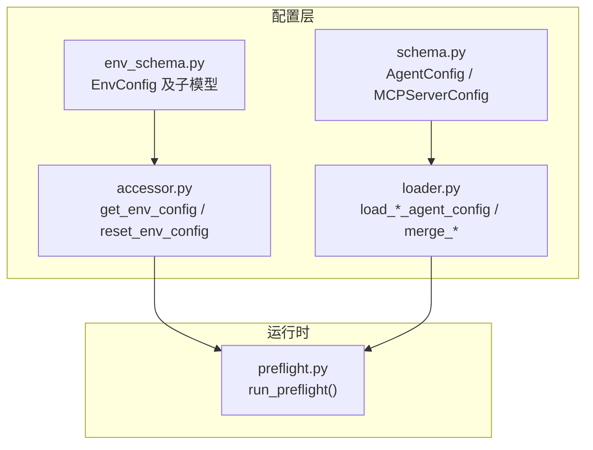
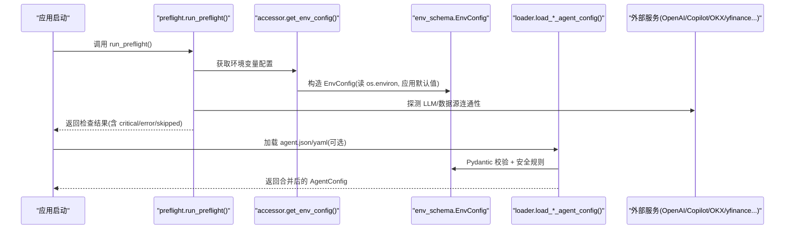
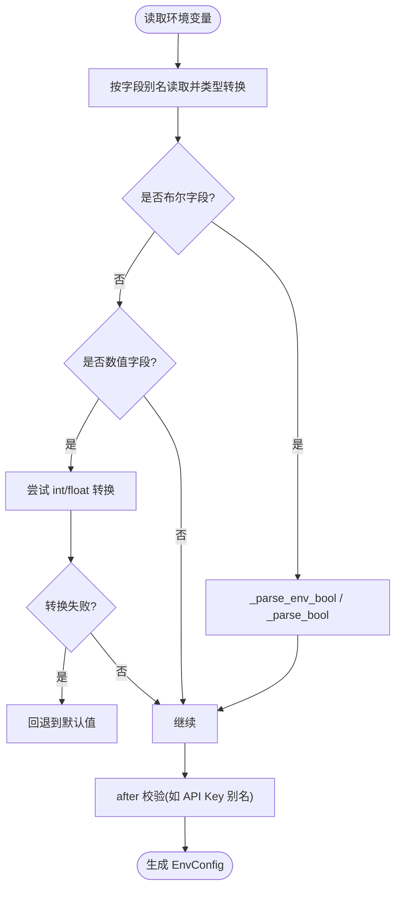
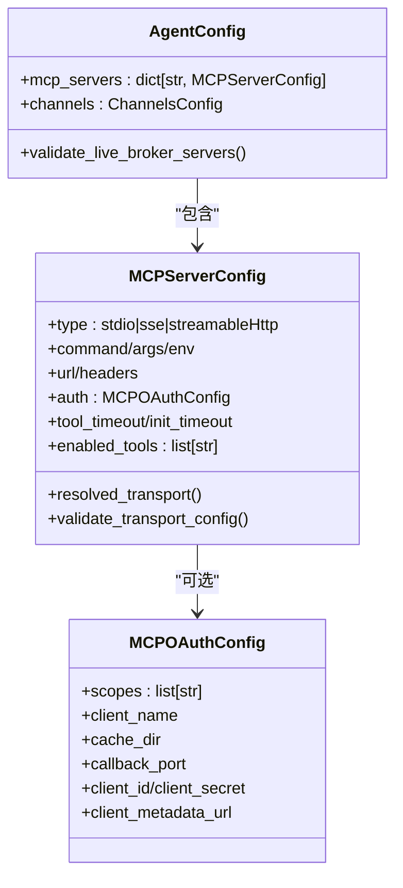
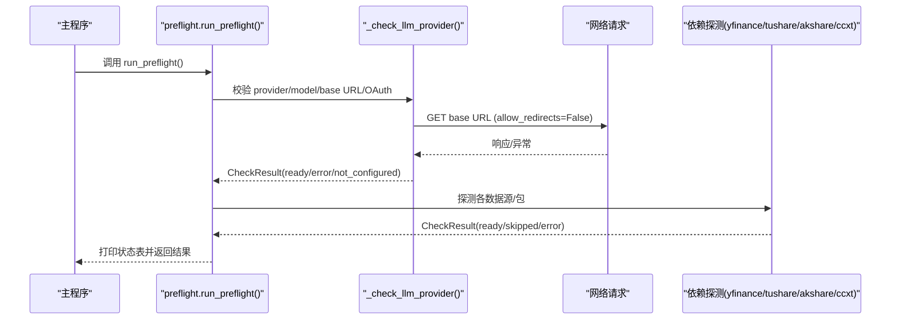
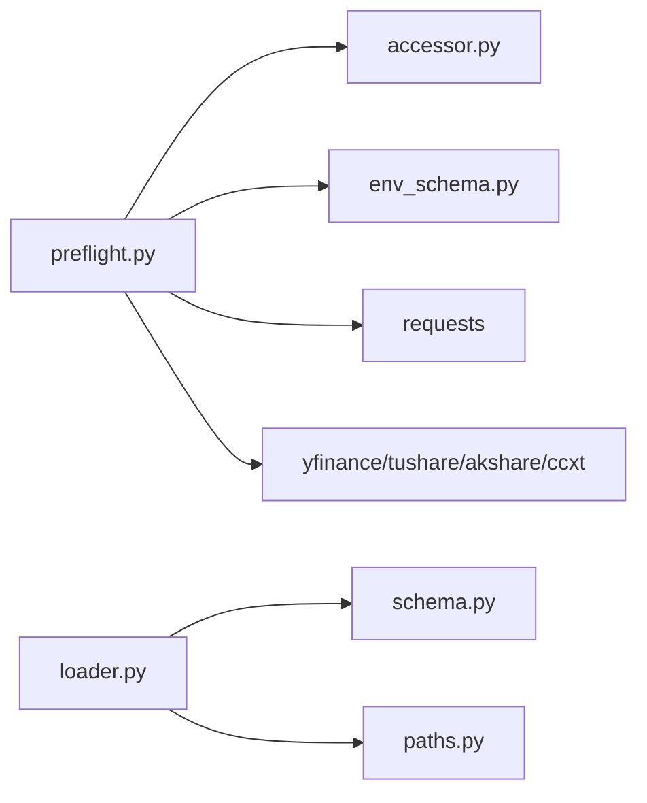

# 配置验证与错误处理

<cite>
**本文引用的文件**
- [preflight.py](file://agent/src/preflight.py)
- [accessor.py](file://agent/src/config/accessor.py)
- [env_schema.py](file://agent/src/config/env_schema.py)
- [loader.py](file://agent/src/config/loader.py)
- [schema.py](file://agent/src/config/schema.py)
- [test_preflight.py](file://agent/tests/test_preflight.py)
- [test_agent_config.py](file://agent/tests/test_agent_config.py)
- [test_env_schema.py](file://agent/tests/test_env_schema.py)
</cite>

## 目录
1. [简介](#简介)
2. [项目结构](#项目结构)
3. [核心组件](#核心组件)
4. [架构总览](#架构总览)
5. [详细组件分析](#详细组件分析)
6. [依赖关系分析](#依赖关系分析)
7. [性能考虑](#性能考虑)
8. [故障排除指南](#故障排除指南)
9. [结论](#结论)
10. [附录](#附录)

## 简介
本文件系统性说明 Vibe-Trading 的配置验证与错误处理机制，覆盖环境变量校验、配置文件格式检查、依赖项可用性检测、预检流程（preflight）的执行时机与作用、常见错误类型与消息、诊断与修复建议、自动修复能力、性能优化策略、测试与验证工具使用方法，以及版本兼容性与迁移策略。目标是帮助开发者与运维人员快速定位并解决配置问题，确保系统稳定启动与运行。

## 项目结构
配置相关代码集中在 agent/src/config 与 agent/src/preflight.py：
- 环境变量模型与默认值：env_schema.py
- 单例访问器与布尔解析：accessor.py
- 结构化 Agent 配置加载与合并：loader.py、schema.py
- 启动前预检（数据源/LLM 连通性）：preflight.py
- 单元测试覆盖：test_env_schema.py、test_agent_config.py、test_preflight.py

**图表来源**
- [env_schema.py:685-716](file://agent/src/config/env_schema.py#L685-L716)
- [accessor.py:52-92](file://agent/src/config/accessor.py#L52-L92)
- [schema.py:395-457](file://agent/src/config/schema.py#L395-L457)
- [loader.py:28-55](file://agent/src/config/loader.py#L28-L55)
- [preflight.py:284-337](file://agent/src/preflight.py#L284-L337)

**章节来源**
- [env_schema.py:1-593](file://agent/src/config/env_schema.py#L1-L593)
- [accessor.py:1-149](file://agent/src/config/accessor.py#L1-L149)
- [schema.py:1-513](file://agent/src/config/schema.py#L1-L513)
- [loader.py:1-346](file://agent/src/config/loader.py#L1-L346)
- [preflight.py:1-337](file://agent/src/preflight.py#L1-L337)

## 核心组件
- 环境变量配置模型（EnvConfig）：集中定义所有环境变量的别名、类型、默认值与约束；支持布尔、数值、字符串的严格转换与回退。
- 配置访问器（accessor）：提供线程安全的 EnvConfig 单例读取与重置；统一布尔解析与环境变量读取辅助函数。
- 结构化 Agent 配置（schema + loader）：从磁盘加载 JSON/YAML，进行 Pydantic 校验、安全限制（如 live broker 通配符拒绝）、运行时覆盖合并。
- 预检（preflight）：启动时探测 LLM 提供商、OKX/yfinance/Tushare/AkShare/ccxt 等依赖可用性与连通性，输出状态表并标记关键失败。

**章节来源**
- [env_schema.py:132-593](file://agent/src/config/env_schema.py#L132-L593)
- [accessor.py:52-149](file://agent/src/config/accessor.py#L52-L149)
- [schema.py:301-513](file://agent/src/config/schema.py#L301-L513)
- [loader.py:28-230](file://agent/src/config/loader.py#L28-L230)
- [preflight.py:21-337](file://agent/src/preflight.py#L21-L337)

## 架构总览
配置验证与错误处理贯穿“环境变量 → 模型校验 → 文件加载 → 运行时覆盖 → 启动预检”的链路。

**图表来源**
- [preflight.py:284-337](file://agent/src/preflight.py#L284-L337)
- [accessor.py:52-92](file://agent/src/config/accessor.py#L52-L92)
- [env_schema.py:685-716](file://agent/src/config/env_schema.py#L685-L716)
- [loader.py:28-151](file://agent/src/config/loader.py#L28-L151)

## 详细组件分析

### 环境变量验证（EnvConfig）
- 字段分组：LLM、Data、API、Swarm、AgentTuning、Path、OCR、Memory。
- 类型与默认值：通过 Pydantic Field 指定类型、默认值、别名与环境变量映射；数值型非法输入会静默回退到默认值，避免启动崩溃。
- 布尔解析：
  - EnvBool 使用 BeforeValidator 将字符串转换为 bool（接受 true/yes/on/1 等）。
  - 专用 ResponsesApiBool 仅当字面量 "true" 才启用。
  - accessor._parse_bool 提供统一的布尔解析逻辑。
- API Key 别名：EnvConfig 在 after 校验中将 VIBE_TRADING_API_KEY 复制到 api_auth_key，保证 CLI 与服务端一致。
- 内存功能预设：VT_MEMORY=off|on|full 作为基线，可被 VT_MEMORY_* 单项覆盖。

**图表来源**
- [env_schema.py:48-74](file://agent/src/config/env_schema.py#L48-L74)
- [env_schema.py:81-124](file://agent/src/config/env_schema.py#L81-L124)
- [env_schema.py:685-716](file://agent/src/config/env_schema.py#L685-L716)
- [accessor.py:95-149](file://agent/src/config/accessor.py#L95-L149)

**章节来源**
- [env_schema.py:132-593](file://agent/src/config/env_schema.py#L132-L593)
- [accessor.py:95-149](file://agent/src/config/accessor.py#L95-L149)
- [test_env_schema.py:69-179](file://agent/tests/test_env_schema.py#L69-L179)
- [test_env_schema.py:185-235](file://agent/tests/test_env_schema.py#L185-L235)
- [test_env_schema.py:360-383](file://agent/tests/test_env_schema.py#L360-L383)

### 配置文件格式检查与合并（AgentConfig）
- 支持 JSON/YAML，缺失或不可解析时记录警告并回退到空配置。
- 运行时覆盖：merge_agent_config_overrides 先以部分模型校验，再合并字典，最后整体校验；失败则忽略覆盖并使用基础配置。
- 安全限制：
  - Live broker（如 Robinhood、IBKR）禁止使用 enabledTools=["*"]，除非满足特定只读探针条件。
  - OAuth 必须 HTTPS，且不允许同时设置静态 headers。
  - 传输类型与字段互斥校验（stdio 不接受 url/headers/auth；HTTP 需显式 type）。
- 会话覆盖清洗：sanitize_session_overrides 默认剥离 mcpServers/mcp_servers，防止非受信任来源注入进程命令；可通过 ALLOW_SESSION_MCP_SERVERS 显式开启。

**图表来源**
- [schema.py:395-457](file://agent/src/config/schema.py#L395-L457)
- [schema.py:508-548](file://agent/src/config/schema.py#L508-L548)

**章节来源**
- [loader.py:28-151](file://agent/src/config/loader.py#L28-L151)
- [loader.py:232-346](file://agent/src/config/loader.py#L232-L346)
- [schema.py:301-513](file://agent/src/config/schema.py#L301-L513)
- [test_agent_config.py:63-147](file://agent/tests/test_agent_config.py#L63-L147)
- [test_agent_config.py:149-223](file://agent/tests/test_agent_config.py#L149-L223)
- [test_agent_config.py:225-341](file://agent/tests/test_agent_config.py#L225-L341)
- [test_agent_config.py:364-489](file://agent/tests/test_agent_config.py#L364-L489)
- [test_agent_config.py:495-609](file://agent/tests/test_agent_config.py#L495-L609)

### 预检流程（Preflight）
- 执行时机：应用启动早期，用于快速发现关键依赖问题。
- 检查项：
  - LLM Provider：校验 provider/model/base URL/OAuth 登录状态，必要时 ping base URL（不跟随重定向）。
  - OKX API：公开行情接口可达性。
  - yfinance：包可用性与基本报价查询。
  - Tushare：token 配置与包安装。
  - AkShare：包存在性（避免导入开销）。
  - ccxt：包存在性。
  - 内容过滤阈值：显示当前阈值。
- 结果展示：表格输出 ready/error/not_configured/skipped，critical 失败会阻断启动。

**图表来源**
- [preflight.py:32-153](file://agent/src/preflight.py#L32-L153)
- [preflight.py:156-271](file://agent/src/preflight.py#L156-L271)
- [preflight.py:284-337](file://agent/src/preflight.py#L284-L337)

**章节来源**
- [preflight.py:1-337](file://agent/src/preflight.py#L1-L337)
- [test_preflight.py:12-157](file://agent/tests/test_preflight.py#L12-L157)

### 错误类型与错误消息
- 环境变量错误：
  - 非法数值：静默回退到默认值（例如 TIMEOUT_SECONDS 非数字），避免启动失败。
  - 布尔解析：仅特定字面量生效（如 LANGCHAIN_USE_RESPONSES_API 仅 "true"）。
  - API Key 别名：若仅设置 VIBE_TRADING_API_KEY，会自动复制到 api_auth_key。
- 配置文件错误：
  - 文件格式不支持或 YAML 缺失：记录警告并回退到空配置。
  - 合并失败：记录警告并忽略覆盖，保留基础配置。
  - Live broker 通配符：抛出 ValueError，提示必须使用显式只读工具列表，并提供安全种子配置。
  - 传输配置冲突：stdio 与 HTTP 字段互斥；HTTP 需显式 type；OAuth 必须 HTTPS 且不允许静态 headers。
- 预检错误：
  - LLM Provider 未配置或连接失败：critical 错误，阻断启动。
  - 数据源不可用：error/skipped，影响对应功能但不会阻止启动。

**章节来源**
- [env_schema.py:48-74](file://agent/src/config/env_schema.py#L48-L74)
- [env_schema.py:685-716](file://agent/src/config/env_schema.py#L685-L716)
- [loader.py:28-55](file://agent/src/config/loader.py#L28-L55)
- [loader.py:57-100](file://agent/src/config/loader.py#L57-L100)
- [schema.py:419-457](file://agent/src/config/schema.py#L419-L457)
- [schema.py:514-548](file://agent/src/config/schema.py#L514-L548)
- [preflight.py:32-153](file://agent/src/preflight.py#L32-L153)
- [test_agent_config.py:225-341](file://agent/tests/test_agent_config.py#L225-L341)
- [test_preflight.py:34-75](file://agent/tests/test_preflight.py#L34-L75)

### 预检流程的作用与执行时机
- 作用：在应用启动早期快速识别关键依赖问题（尤其是 LLM 提供商），输出可读的状态表，便于用户即时修复。
- 执行时机：在 main 入口或服务器初始化阶段调用 run_preflight()，根据 critical 结果决定是否继续启动。
- 行为：对非关键依赖（如 yfinance、akshare）采用 skipped/error 降级；对 LLM 提供商采用 critical 阻断。

**章节来源**
- [preflight.py:1-6](file://agent/src/preflight.py#L1-L6)
- [preflight.py:284-337](file://agent/src/preflight.py#L284-L337)

### 配置错误的诊断方法与故障排除步骤
- 查看预检输出：关注 critical 与 error 行，依据 impact 描述定位受影响功能。
- 检查环境变量：
  - LLM：确认 LANGCHAIN_PROVIDER、LANGCHAIN_MODEL_NAME、OPENAI_BASE_URL（或 OPENAI_API_BASE）已正确设置。
  - 数据源：确认 TUSHARE_TOKEN、CCXT_EXCHANGE、FINNHUB_API_KEY 等按需配置。
  - 布尔开关：确认 VT_MEMORY、VIBE_TRADING_DATA_CACHE、ENABLE_SESSION_RUNTIME 等符合预期。
- 检查配置文件：
  - 确认 agent.json/yaml 语法正确；YAML 需要 PyYAML。
  - Live broker 配置避免 enabledTools=["*"]，使用安全种子或显式只读工具列表。
  - HTTP 传输需显式 type 且 OAuth 必须 HTTPS。
- 运行时覆盖：
  - 若 session 覆盖包含 mcpServers，默认会被剥离；如需允许，设置 ALLOW_SESSION_MCP_SERVERS=1。
- 日志与调试：
  - 加载失败会记录 WARNING 与 DEBUG 详情；结合日志定位具体字段与错误原因。

**章节来源**
- [preflight.py:32-153](file://agent/src/preflight.py#L32-L153)
- [loader.py:28-55](file://agent/src/config/loader.py#L28-L55)
- [schema.py:419-457](file://agent/src/config/schema.py#L419-L457)
- [schema.py:514-548](file://agent/src/config/schema.py#L514-L548)
- [loader.py:107-134](file://agent/src/config/loader.py#L107-L134)

### 配置修复建议与自动修复功能
- 自动回退：
  - 非法数值自动回退到默认值，避免启动失败。
  - 配置文件不可解析时回退到空配置，保持系统可用。
- 别名与迁移：
  - VIBE_TRADING_API_KEY → api_auth_key 自动复制，兼容历史用法。
  - OCR 旧环境变量 VIBE_TRADING_OCR_QWEN_MODEL 自动迁移到新字段并记录弃用警告。
- 安全种子：
  - 提供 Robinhood 只读 MCP 服务器种子配置，指导用户安全启用。
- 手动修复：
  - 为 live broker 配置显式 enabled_tools 白名单。
  - 为 HTTP 传输显式指定 type 并确保 HTTPS。
  - 清理冲突字段（如 stdio 不应包含 url/headers/auth）。

**章节来源**
- [env_schema.py:81-124](file://agent/src/config/env_schema.py#L81-L124)
- [env_schema.py:286-318](file://agent/src/config/env_schema.py#L286-L318)
- [env_schema.py:685-716](file://agent/src/config/env_schema.py#L685-L716)
- [schema.py:182-219](file://agent/src/config/schema.py#L182-L219)
- [schema.py:514-548](file://agent/src/config/schema.py#L514-L548)

### 配置验证的性能考虑与优化策略
- 懒加载与缓存：
  - EnvConfig 通过 get_env_config() 单例缓存，避免重复解析；reset_env_config() 在环境变量变更后重建。
  - 模块级锁保证多线程安全，避免竞态条件。
- 轻量探测：
  - akshare 检查仅使用 find_spec 判断包存在性，避免导入开销。
  - LLM 预检 ping 时禁用重定向，减少额外往返。
- 容错设计：
  - 数值字段非法输入静默回退，避免昂贵异常路径。
  - 配置文件加载失败记录日志并回退，保障启动鲁棒性。

**章节来源**
- [accessor.py:52-92](file://agent/src/config/accessor.py#L52-L92)
- [preflight.py:237-246](file://agent/src/preflight.py#L237-L246)
- [preflight.py:131-153](file://agent/src/preflight.py#L131-L153)
- [loader.py:28-55](file://agent/src/config/loader.py#L28-L55)

### 配置测试与验证工具的使用方法
- 单元测试：
  - test_env_schema.py：覆盖默认值、类型转换、别名、单例与线程安全。
  - test_agent_config.py：覆盖 JSON/YAML 加载、运行时覆盖、live broker 安全规则、会话覆盖清洗。
  - test_preflight.py：覆盖 LLM 预检、重定向行为、依赖探测。
- 运行方式：
  - 使用 pytest 运行对应测试文件，验证配置行为是否符合预期。
  - 在 CI 中集成这些测试，确保配置变更不会引入回归。

**章节来源**
- [test_env_schema.py:69-539](file://agent/tests/test_env_schema.py#L69-L539)
- [test_agent_config.py:63-609](file://agent/tests/test_agent_config.py#L63-L609)
- [test_preflight.py:12-157](file://agent/tests/test_preflight.py#L12-L157)

### 常见配置错误的解决方案与预防措施
- LLM 提供商未配置或连接失败：
  - 设置 LANGCHAIN_PROVIDER 与 LANGCHAIN_MODEL_NAME；如需自定义 base URL，设置 OPENAI_BASE_URL。
  - 对于 Copilot/OpenAI-Codex，完成 OAuth 登录或使用 SDK 认证。
- Live broker 通配符错误：
  - 移除 enabledTools=["*"]，改用安全种子或显式只读工具列表。
- 传输配置冲突：
  - stdio 不要设置 url/headers/auth；HTTP 必须显式 type 且 OAuth 必须 HTTPS。
- 会话覆盖被剥离：
  - 如需允许 session 注入 mcpServers，设置 ALLOW_SESSION_MCP_SERVERS=1。
- 预防措施：
  - 使用 Pydantic 模型与单元测试锁定配置契约。
  - 在 CI 中运行配置相关测试，提前发现错误。
  - 遵循安全种子与最佳实践文档。

**章节来源**
- [preflight.py:32-153](file://agent/src/preflight.py#L32-L153)
- [schema.py:419-457](file://agent/src/config/schema.py#L419-L457)
- [schema.py:514-548](file://agent/src/config/schema.py#L514-L548)
- [loader.py:107-134](file://agent/src/config/loader.py#L107-L134)

### 配置版本兼容性与迁移策略
- 环境变量别名：
  - VIBE_TRADING_API_KEY → api_auth_key 自动复制，兼容历史用法。
  - OCR 旧环境变量 VIBE_TRADING_OCR_QWEN_MODEL → VIBE_TRADING_OCR_LLM_MODEL 自动迁移并记录弃用警告。
- 配置格式：
  - 支持 snake_case 与 camelCase 键名，提升兼容性。
  - YAML 依赖 PyYAML；缺失时记录错误并回退。
- 迁移建议：
  - 逐步替换旧环境变量为新别名，观察弃用警告。
  - 更新 live broker 配置为显式工具白名单，避免通配符。
  - 在 CI 中运行测试，确保迁移后行为一致。

**章节来源**
- [env_schema.py:286-318](file://agent/src/config/env_schema.py#L286-L318)
- [env_schema.py:685-716](file://agent/src/config/env_schema.py#L685-L716)
- [schema.py:286-305](file://agent/src/config/schema.py#L286-L305)
- [loader.py:232-259](file://agent/src/config/loader.py#L232-L259)

## 依赖关系分析
- 组件耦合：
  - preflight 依赖 accessor 与 env_schema 获取环境变量；依赖 providers 与第三方库进行连通性探测。
  - loader 依赖 schema 进行 Pydantic 校验与安全规则；依赖 paths 确定配置文件位置。
  - schema 定义强约束，loader 负责加载与合并；accessor 提供线程安全的单例访问。
- 外部依赖：
  - requests：LLM 预检 ping。
  - yfinance、tushare、akshare、ccxt：数据源可用性探测。
  - PyYAML：YAML 配置解析（可选）。

**图表来源**
- [preflight.py:18-19](file://agent/src/preflight.py#L18-L19)
- [preflight.py:32-153](file://agent/src/preflight.py#L32-L153)
- [loader.py:13-15](file://agent/src/config/loader.py#L13-L15)
- [loader.py:232-259](file://agent/src/config/loader.py#L232-L259)

**章节来源**
- [preflight.py:1-337](file://agent/src/preflight.py#L1-L337)
- [loader.py:1-346](file://agent/src/config/loader.py#L1-L346)
- [schema.py:1-513](file://agent/src/config/schema.py#L1-L513)

## 性能考虑
- 单例与缓存：EnvConfig 单例减少重复解析；reset 仅在环境变量变更后触发。
- 轻量探测：akshare 使用 find_spec 避免导入开销；LLM 预检禁用重定向。
- 容错回退：非法数值静默回退，配置文件加载失败记录日志并回退，保障启动鲁棒性。
- 线程安全：模块级锁保护单例创建与重置，避免并发竞争。

[本节为通用性能指导，无需特定文件引用]

## 故障排除指南
- 启动失败（LLM 提供商 critical 错误）：
  - 检查 LANGCHAIN_PROVIDER、LANGCHAIN_MODEL_NAME、OPENAI_BASE_URL。
  - 对于 Copilot/OpenAI-Codex，完成 OAuth 登录。
  - 查看预检输出的 message 与 impact，定位具体问题。
- 数据源不可用：
  - 检查 TUSHARE_TOKEN、CCXT_EXCHANGE、FINNHUB_API_KEY 等。
  - 确认依赖包已安装（yfinance、tushare、akshare、ccxt）。
- 配置文件错误：
  - 检查 JSON/YAML 语法；YAML 需安装 PyYAML。
  - Live broker 配置避免通配符，使用安全种子或显式白名单。
  - HTTP 传输需显式 type 且 OAuth 必须 HTTPS。
- 会话覆盖被剥离：
  - 如需允许 session 注入 mcpServers，设置 ALLOW_SESSION_MCP_SERVERS=1。
- 日志与调试：
  - 查看 WARNING 与 DEBUG 日志，定位具体字段与错误原因。
  - 使用 pytest 运行相关测试，验证配置行为。

**章节来源**
- [preflight.py:32-153](file://agent/src/preflight.py#L32-L153)
- [loader.py:28-55](file://agent/src/config/loader.py#L28-L55)
- [schema.py:419-457](file://agent/src/config/schema.py#L419-L457)
- [schema.py:514-548](file://agent/src/config/schema.py#L514-L548)
- [loader.py:107-134](file://agent/src/config/loader.py#L107-L134)

## 结论
Vibe-Trading 的配置验证与错误处理通过 Pydantic 模型、单例访问器、结构化配置加载与启动预检，构建了健壮、可诊断、易维护的配置体系。其设计强调安全（live broker 通配符拒绝、OAuth HTTPS 强制）、兼容（环境变量别名、snake/camelCase 支持）、性能（懒加载、轻量探测、容错回退）与可测试性（全面单元测试）。遵循本文的诊断与修复建议，可有效降低配置错误风险，提升系统稳定性与可运维性。

[本节为总结性内容，无需特定文件引用]

## 附录
- 常用环境变量参考：
  - LLM：LANGCHAIN_PROVIDER、LANGCHAIN_MODEL_NAME、TIMEOUT_SECONDS、MAX_RETRIES、OPENAI_BASE_URL。
  - 数据源：TUSHARE_TOKEN、CCXT_EXCHANGE、FINNHUB_API_KEY、ALPHAVANTAGE_API_KEY、TIINGO_API_KEY、FMP_API_KEY、FRED_API_KEY。
  - API：API_AUTH_KEY、CORS_ORIGINS、ENABLE_SESSION_RUNTIME、VIBE_TRADING_ENABLE_SHELL_TOOLS。
  - Swarm：SWARM_WORKER_TIMEOUT、SWARM_MAX_WORKERS、SWARM_TIMEOUT。
  - Agent Tuning：TOKEN_THRESHOLD、CONTENT_FILTER_WARNING_THRESHOLD、VIBE_TRADING_TOOL_TIMEOUT_SECONDS。
  - Memory：VT_MEMORY、VT_MEMORY_QUALITY、VT_MEMORY_GC、VT_MEMORY_DECAY、VT_MEMORY_HIERARCHY、VT_MEMORY_LINKS、VT_MEMORY_COMPRESSION、VT_MEMORY_FTS_INDEX。
- 安全建议：
  - 避免在生产环境暴露敏感密钥；使用环境变量或安全存储。
  - Live broker 配置务必使用显式工具白名单，避免通配符。
  - OAuth 必须 HTTPS，且不与静态 headers 混用。

[本节为通用参考，无需特定文件引用]