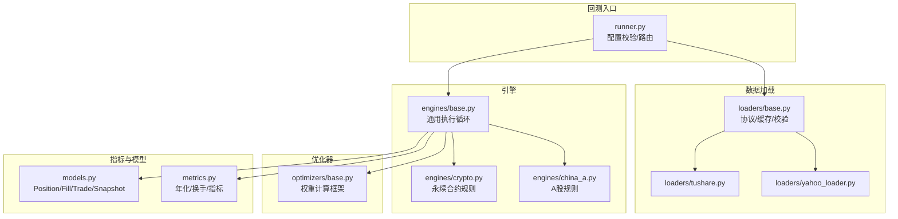
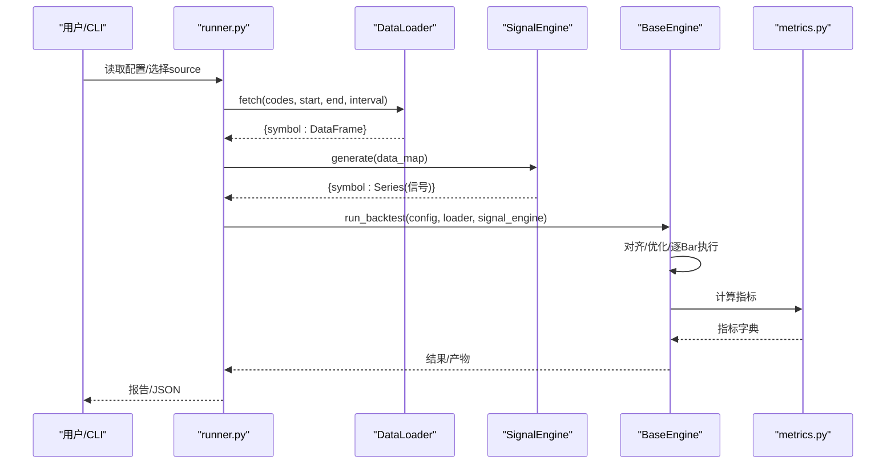
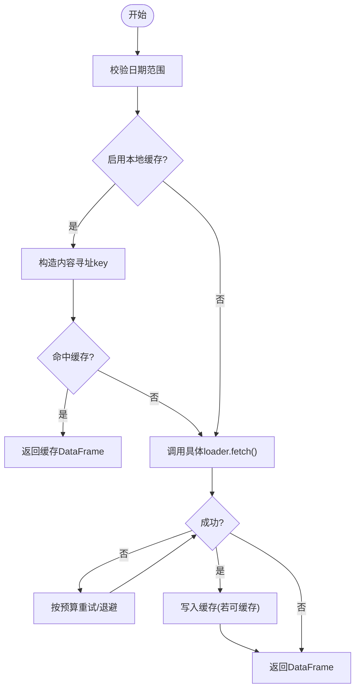
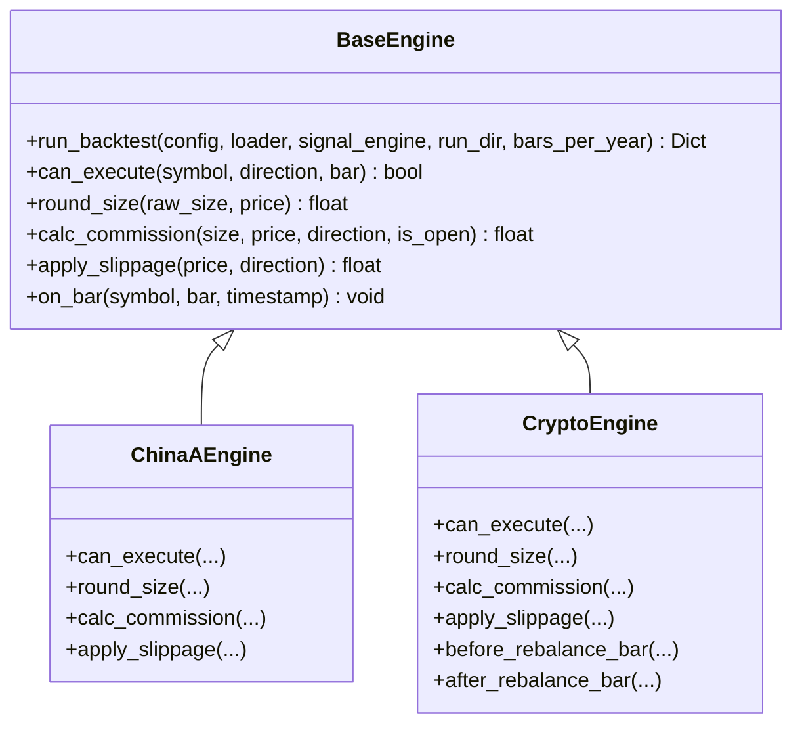
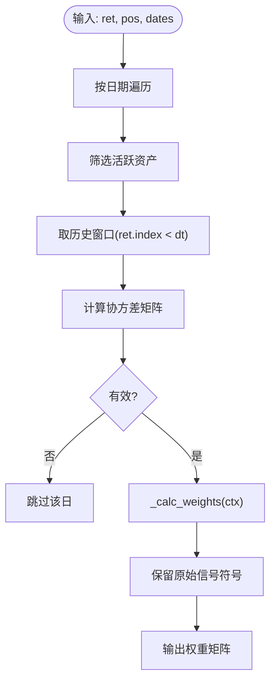
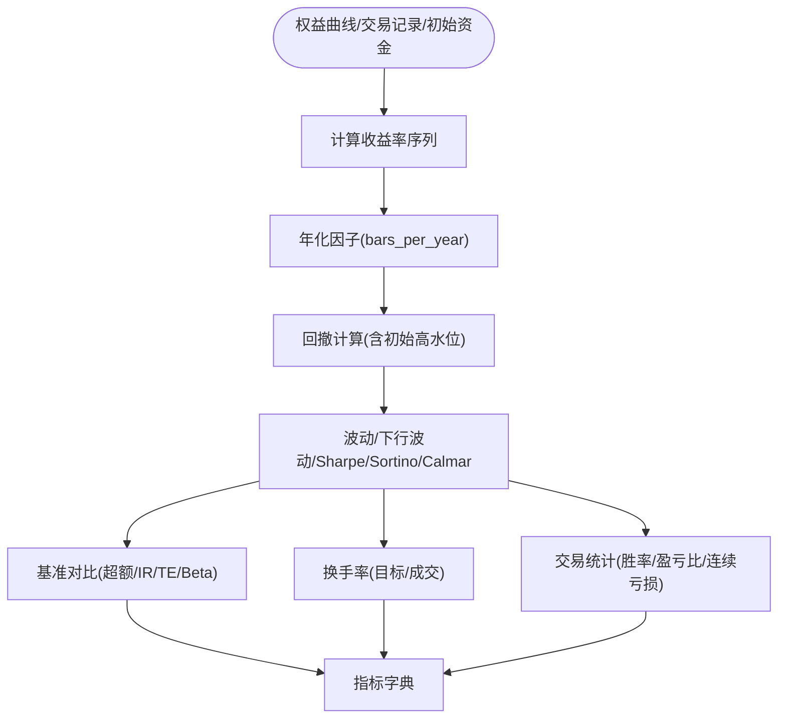
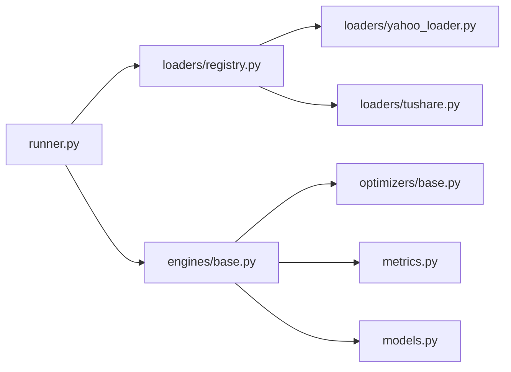

# 回测引擎

<cite>
**本文引用的文件**
- [base.py](file://agent/backtest/engines/base.py)
- [china_a.py](file://agent/backtest/engines/china_a.py)
- [crypto.py](file://agent/backtest/engines/crypto.py)
- [runner.py](file://agent/backtest/runner.py)
- [models.py](file://agent/backtest/models.py)
- [metrics.py](file://agent/backtest/metrics.py)
- [base.py（数据加载器）](file://agent/backtest/loaders/base.py)
- [yahoo_loader.py](file://agent/backtest/loaders/yahoo_loader.py)
- [tushare.py](file://agent/backtest/loaders/tushare.py)
</cite>

## 目录
1. [简介](#简介)
2. [项目结构](#项目结构)
3. [核心组件](#核心组件)
4. [架构总览](#架构总览)
5. [详细组件分析](#详细组件分析)
6. [依赖关系分析](#依赖关系分析)
7. [性能考虑](#性能考虑)
8. [故障排查指南](#故障排查指南)
9. [结论](#结论)
10. [附录：配置与使用示例](#附录：配置与使用示例)

## 简介
本技术文档面向策略开发者与引擎扩展者，系统化说明回测引擎的架构设计与实现要点，覆盖多市场支持、数据加载与标准化、执行模拟、绩效评估、优化器系统、回测配置与最佳实践。文档以代码级事实为依据，提供可视化图示与可追溯来源，帮助读者快速理解并安全扩展。

## 项目结构
回测子系统位于 agent/backtest 下，采用“引擎-加载器-优化器-指标”分层组织：
- 引擎层：统一基类 BaseEngine 定义通用执行循环与规则钩子；各市场引擎（A股、加密货币等）继承并实现市场特定规则。
- 数据加载层：DataLoaderProtocol 统一接口；多种数据源适配器（Yahoo、Tushare 等），内置缓存、重试与 OHLC 校验。
- 优化器层：BaseOptimizer 抽象权重计算流程，子类实现具体组合优化策略。
- 指标层：统一的年化因子、收益序列、换手率与综合指标计算。

图表来源
- [runner.py:1-120](file://agent/backtest/runner.py#L1-L120)
- [base.py（数据加载器）:1-120](file://agent/backtest/loaders/base.py#L1-L120)
- [base.py（引擎基类）:377-724](file://agent/backtest/engines/base.py#L377-L724)
- [metrics.py:153-171](file://agent/backtest/metrics.py#L153-L171)
- [models.py:13-118](file://agent/backtest/models.py#L13-L118)

章节来源
- [runner.py:1-120](file://agent/backtest/runner.py#L1-L120)
- [base.py（数据加载器）:1-120](file://agent/backtest/loaders/base.py#L1-L120)

## 核心组件
- 数据加载器系统
  - DataLoaderProtocol 统一 fetch() 接口，约定 name/markets/requires_auth/volume_units 等元信息。
  - 共享工具：日期范围校验、OHLC 不变性校验、预算化重试（带退避）、本地 Parquet 缓存（内容寻址键、版本控制、原子写入）。
  - 典型实现：Yahoo 全球权益（无认证直连 HTTP）、Tushare A股/港股（含复权、分钟线、基础字段合并）。
- 市场引擎
  - BaseEngine 提供 run_backtest() 主流程：数据加载→信号生成→对齐与优化→逐Bar执行→指标输出。
  - 市场规则通过 can_execute/round_size/calc_commission/apply_slippage/on_bar 等钩子定制。
  - 已实现：A股（T+1、涨跌停、最小整手、印花税等）、加密货币永续（资金费率、强平、隔离/全仓风控）。
- 优化器系统
  - BaseOptimizer 封装因果滚动窗口、协方差构建、符号保持的权重归一化；子类实现 _calc_weights。
- 指标与模型
  - metrics 提供 bar_returns（处理零/负前价）、年化 bars_per_year 映射、换手率、综合指标 calc_metrics。
  - models 定义 Position/FillRecord/TradeRecord/EquitySnapshot 不可变记录，保证审计与回溯一致性。

章节来源
- [base.py（数据加载器）:851-887](file://agent/backtest/loaders/base.py#L851-L887)
- [base.py（数据加载器）:168-256](file://agent/backtest/loaders/base.py#L168-L256)
- [base.py（数据加载器）:377-450](file://agent/backtest/loaders/base.py#L377-L450)
- [base.py（数据加载器）:243-441](file://agent/backtest/loaders/base.py#L243-L441)
- [yahoo_loader.py:173-275](file://agent/backtest/loaders/yahoo_loader.py#L173-L275)
- [tushare.py:116-205](file://agent/backtest/loaders/tushare.py#L116-L205)
- [base.py（引擎基类）:377-724](file://agent/backtest/engines/base.py#L377-L724)
- [china_a.py:20-93](file://agent/backtest/engines/china_a.py#L20-L93)
- [crypto.py:41-140](file://agent/backtest/engines/crypto.py#L41-L140)
- [base.py（优化器基类）:14-85](file://agent/backtest/optimizers/base.py#L14-L85)
- [metrics.py:245-302](file://agent/backtest/metrics.py#L245-L302)
- [metrics.py:461-626](file://agent/backtest/metrics.py#L461-L626)
- [models.py:13-118](file://agent/backtest/models.py#L13-L118)

## 架构总览
回测主流程由 runner 协调 loader 获取数据，signal_engine 生成信号，engine 执行逐Bar交易，最后由 metrics 汇总指标。

图表来源
- [runner.py:1-120](file://agent/backtest/runner.py#L1-L120)
- [base.py（引擎基类）:652-724](file://agent/backtest/engines/base.py#L652-L724)
- [metrics.py:461-626](file://agent/backtest/metrics.py#L461-L626)

## 详细组件分析

### 数据加载器系统
- 协议与校验
  - DataLoaderProtocol 定义 name/markets/requires_auth/fetch()，便于注册与路由。
  - validate_date_range 与 validate_ohlc 在加载边界进行严格校验，避免脏数据进入回测。
- 缓存机制
  - 基于内容寻址的 key（source/symbol/timeframe/start/end/fields），Parquet 存储 + JSON 元数据。
  - 仅对已结算区间缓存；读写失败不中断 fetch；DuckDB 加速读写与索引恢复。
- 重试与预算
  - retry_with_budget 针对声明的瞬时异常进行有限重试，结合 deadline 防止无限等待。
- 典型实现
  - Yahoo：直接 HTTP 拉取 US/HK/CA 等权益，时间戳规范化为午夜索引（日线及以上）。
  - Tushare：A股/港股/指数/基金，支持分钟线；按类型调用不同 API；可选基础字段合并；自动复权（qfq）。

图表来源
- [base.py（数据加载器）:168-256](file://agent/backtest/loaders/base.py#L168-L256)
- [base.py（数据加载器）:377-450](file://agent/backtest/loaders/base.py#L377-L450)
- [base.py（数据加载器）:243-441](file://agent/backtest/loaders/base.py#L243-L441)
- [yahoo_loader.py:173-275](file://agent/backtest/loaders/yahoo_loader.py#L173-L275)
- [tushare.py:116-205](file://agent/backtest/loaders/tushare.py#L116-L205)

章节来源
- [base.py（数据加载器）:851-887](file://agent/backtest/loaders/base.py#L851-L887)
- [base.py（数据加载器）:243-441](file://agent/backtest/loaders/base.py#L243-L441)
- [yahoo_loader.py:173-275](file://agent/backtest/loaders/yahoo_loader.py#L173-L275)
- [tushare.py:116-205](file://agent/backtest/loaders/tushare.py#L116-L205)

### 市场引擎实现
- BaseEngine 通用流程
  - run_backtest(): 数据加载→信号生成→对齐与优化→逐Bar执行→指标输出。
  - 价格限制与滑点：prospective_fill_price/limit_band/historical_base_price 确保合规成交。
  - 持仓与资金：Position/FillRecord/TradeRecord/EquitySnapshot 不可变记录保障审计。
- A股引擎（ChinaAEngine）
  - 规则：禁止做空、T+1、涨跌停（主板±10%、创业板/科创板±20%、ST±5%）、最小整手100股、佣金/印花税/过户费。
  - 涨跌停检查：基于前一收盘价或结算价构建价格带，比较实际成交价（含滑点）是否越界。
- 加密货币永续引擎（CryptoEngine）
  - 规则：24/7、多空自由、Maker/Taker 手续费、资金费率结算、强制平仓（维持保证金比率阈值）。
  - 严格模式：基于 mark_open/adverse 极端值评估风险，支持隔离/全仓，记录事件与总结。

图表来源
- [base.py（引擎基类）:377-724](file://agent/backtest/engines/base.py#L377-L724)
- [china_a.py:20-93](file://agent/backtest/engines/china_a.py#L20-L93)
- [crypto.py:41-140](file://agent/backtest/engines/crypto.py#L41-L140)

章节来源
- [base.py（引擎基类）:377-724](file://agent/backtest/engines/base.py#L377-L724)
- [china_a.py:20-93](file://agent/backtest/engines/china_a.py#L20-L93)
- [crypto.py:41-140](file://agent/backtest/engines/crypto.py#L41-L140)

### 优化器系统
- BaseOptimizer 提供因果滚动窗口与协方差矩阵构建，确保权重计算不泄露未来信息。
- 权重符号保持：根据原始信号方向保留正负号，仅调整绝对权重。
- 可扩展：子类实现 _calc_weights 以支持均值-方差、风险平价、最大分散化等策略。

图表来源
- [base.py（优化器基类）:36-85](file://agent/backtest/optimizers/base.py#L36-L85)
- [base.py（优化器基类）:91-145](file://agent/backtest/optimizers/base.py#L91-L145)

章节来源
- [base.py（优化器基类）:14-145](file://agent/backtest/optimizers/base.py#L14-L145)

### 绩效评估与指标
- 收益序列：bar_returns 对非正/非有限前价做安全处理，避免 inf/nan 污染。
- 年化：按 source 与 interval 映射 bars_per_year，支持跨市场日历日年化。
- 换手率：从目标权重与实际成交分别计算，支持平均与累计换手。
- 综合指标：总收益、年化收益、最大回撤、夏普、索提诺、卡玛、胜率、盈亏比、跟踪误差、信息比率、Beta 等。

图表来源
- [metrics.py:245-302](file://agent/backtest/metrics.py#L245-L302)
- [metrics.py:153-171](file://agent/backtest/metrics.py#L153-L171)
- [metrics.py:441-531](file://agent/backtest/metrics.py#L441-L531)
- [metrics.py:461-626](file://agent/backtest/metrics.py#L461-L626)

章节来源
- [metrics.py:153-171](file://agent/backtest/metrics.py#L153-L171)
- [metrics.py:245-302](file://agent/backtest/metrics.py#L245-L302)
- [metrics.py:441-531](file://agent/backtest/metrics.py#L441-L531)
- [metrics.py:461-626](file://agent/backtest/metrics.py#L461-L626)

## 依赖关系分析
- runner 负责配置校验与数据源路由，将 codes/source/interval/engine 解析后驱动 loader 与 engine。
- engines.base 依赖 loaders.registry 与 optimizers.* 动态加载；依赖 metrics 与 models 产出指标与记录。
- 各 loader 通过 register 装饰器注册到 registry，支持 fallback chain。
- 指标模块维护 source→trading_days/bars_per_day 映射，确保年化一致。

图表来源
- [runner.py:1-120](file://agent/backtest/runner.py#L1-L120)
- [base.py（引擎基类）:652-724](file://agent/backtest/engines/base.py#L652-L724)
- [metrics.py:153-171](file://agent/backtest/metrics.py#L153-L171)

章节来源
- [runner.py:1-120](file://agent/backtest/runner.py#L1-L120)
- [base.py（引擎基类）:652-724](file://agent/backtest/engines/base.py#L652-L724)
- [metrics.py:153-171](file://agent/backtest/metrics.py#L153-L171)

## 性能考虑
- 数据加载
  - 使用本地 Parquet 缓存减少重复请求；仅对已结算区间缓存，避免临时数据污染。
  - 批量 fetch 时单 symbol 失败不影响整体；对不稳定接口采用预算化重试与退避。
- 执行与对齐
  - 对齐阶段使用 numpy 向量化与 pandas ffill(limit) 降低开销；跨市场放宽前向填充上限以避免长停牌影响。
  - 价格限制检查基于历史 base price 与 prospective fill price，避免未来函数。
- 指标计算
  - 年化 bars_per_year 按 source/interval 精确映射；对零/负前价收益做安全处理，避免 inf/nan。
  - 换手率优先使用成交证据，其次回退到权重变化，保证稳健性。
- 建议
  - 合理设置 initial_cash 与 leverage，避免极端杠杆导致数值溢出。
  - 对高频数据注意内存与 I/O，必要时分块处理或降低频率。
  - 开启本地缓存并定期清理过期条目，提升迭代效率。

[本节为通用指导，无需列出具体文件来源]

## 故障排查指南
- 数据为空或无效
  - 检查 start_date/end_date 合法性与顺序；确认 source 可用性与认证。
  - 查看 OHLC 校验日志，确认是否存在 high<low 或非正价格被丢弃。
- 信号未生成或为空
  - 确认 SignalEngine.generate 返回类型为 Dict[str, pd.Series]；检查 codes 与 data_map 交集。
- 执行被拒绝
  - A股：检查 T+1、涨跌停、最小整手；确认 can_execute 逻辑与 limit_band 计算。
  - 加密货币：检查资金费率、维持保证金、强平阈值与 strict 模式。
- 指标异常
  - 关注 bar_returns 对非正前价的警告；检查权益曲线是否触零导致收益率非有限。
  - 核对 bars_per_year 与 interval/source 匹配是否正确。

章节来源
- [base.py（数据加载器）:168-256](file://agent/backtest/loaders/base.py#L168-L256)
- [base.py（引擎基类）:652-724](file://agent/backtest/engines/base.py#L652-L724)
- [china_a.py:40-93](file://agent/backtest/engines/china_a.py#L40-L93)
- [crypto.py:111-142](file://agent/backtest/engines/crypto.py#L111-L142)
- [metrics.py:245-302](file://agent/backtest/metrics.py#L245-L302)

## 结论
本回测引擎以 BaseEngine 为核心，结合多市场引擎、统一数据加载器与优化器框架，提供稳健、可扩展的回测能力。通过严格的 OHLC 校验、价格限制与资金风控、以及完善的指标体系，既满足策略开发者的日常需求，也为引擎扩展提供了清晰接口与最佳实践。

[本节为总结，无需列出具体文件来源]

## 附录：配置与使用示例
- 基本配置项
  - codes: 标的列表（如 A股代码、美股后缀 .US、港股后缀 .HK、加密货币 BTC-USDT/ETH/USDT）。
  - start_date/end_date: 回测起止日期（YYYY-MM-DD）。
  - source: 数据源（如 tushare、yahoo、ccxt 等）。
  - interval: K线周期（1m/5m/15m/30m/1H/4H/1D）。
  - engine: 回测引擎（daily/options）。
  - position_adjustment: hold 或 rebalance。
  - initial_cash: 初始资金（必须为正数）。
  - fundamental_fields/event_feeds: 可选基本面与事件增强。
- 策略编写
  - 实现 SignalEngine 类，包含 generate(self, data_map) -> Dict[str, pd.Series]。
  - 安全约束：runner 会扫描运行时可达代码，禁止网络/进程/文件系统写入等危险操作。
- 结果分析
  - 指标字典包含总收益、年化收益、最大回撤、夏普、索提诺、卡玛、胜率、盈亏比、跟踪误差、信息比率、Beta、换手率等。
  - 可通过 by_symbol/by_exit_reason 细分统计定位问题。
- 简单策略示例（描述）
  - 双均线交叉：当短期均线上穿长期均线做多，下穿做空（A股仅做多）。
- 复杂多因子模型示例（描述）
  - 多因子打分→信号归一化→优化器（如风险平价/均值-方差）→约束（行业/个股权重上限）→回测。

章节来源
- [runner.py:68-163](file://agent/backtest/runner.py#L68-L163)
- [runner.py:786-837](file://agent/backtest/runner.py#L786-L837)
- [metrics.py:461-626](file://agent/backtest/metrics.py#L461-L626)