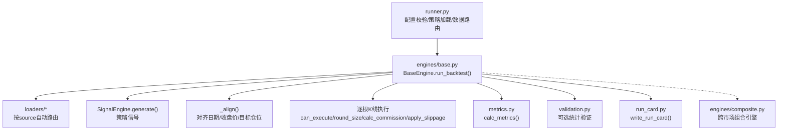
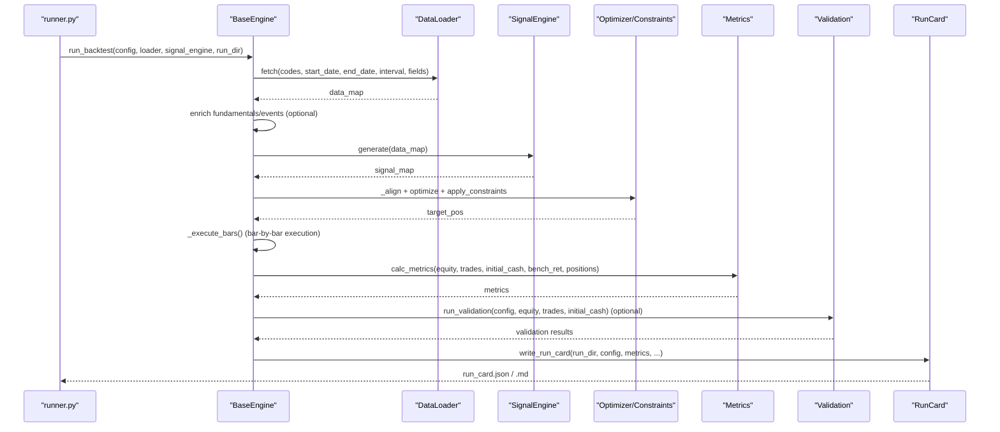
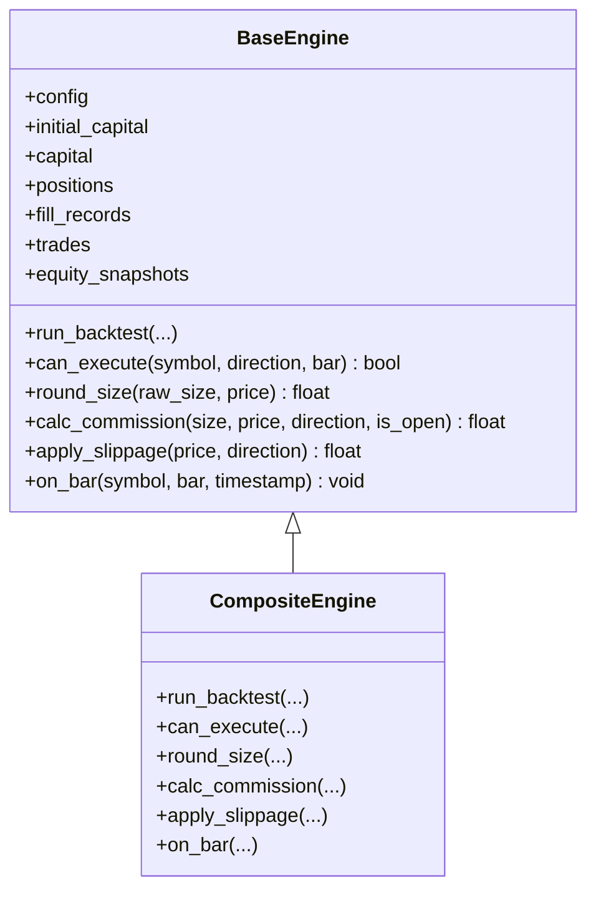
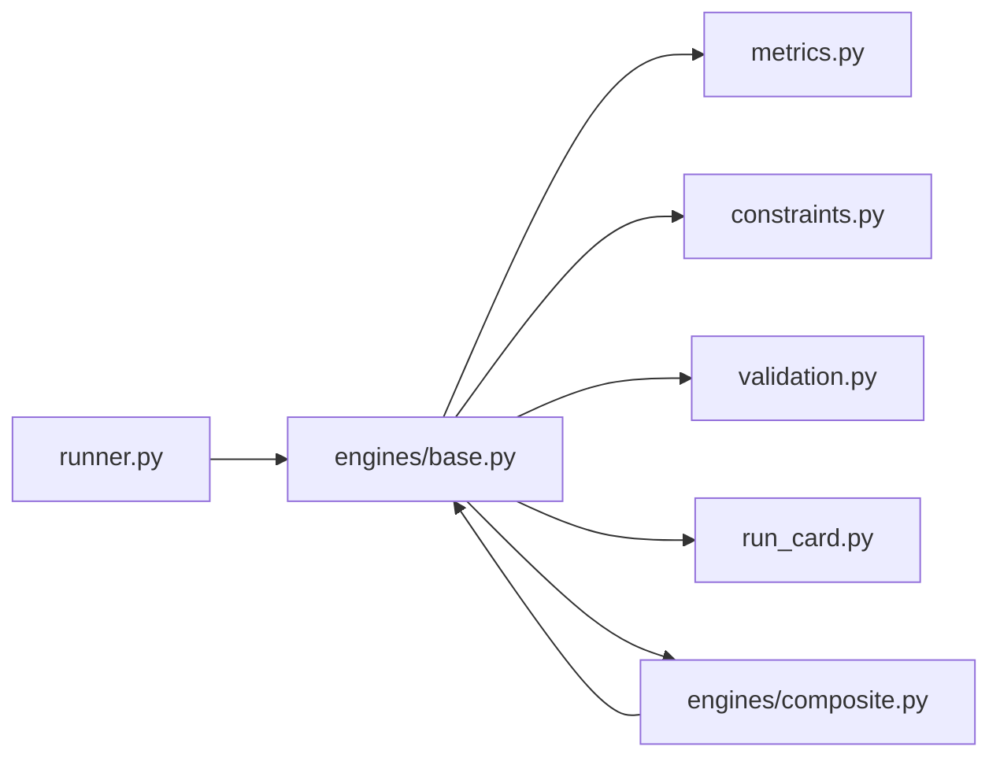

# 回测执行器

<cite>
**本文引用的文件**
- [runner.py](file://agent/backtest/runner.py)
- [base.py](file://agent/backtest/engines/base.py)
- [composite.py](file://agent/backtest/engines/composite.py)
- [models.py](file://agent/backtest/models.py)
- [metrics.py](file://agent/backtest/metrics.py)
- [constraints.py](file://agent/backtest/constraints.py)
- [validation.py](file://agent/backtest/validation.py)
- [run_card.py](file://agent/backtest/run_card.py)
</cite>

## 目录
1. [简介](#简介)
2. [项目结构](#项目结构)
3. [核心组件](#核心组件)
4. [架构总览](#架构总览)
5. [详细组件分析](#详细组件分析)
6. [依赖关系分析](#依赖关系分析)
7. [性能考量](#性能考量)
8. [故障排查指南](#故障排查指南)
9. [结论](#结论)
10. [附录：使用示例与最佳实践](#附录使用示例与最佳实践)

## 简介
本技术文档面向策略开发者与高级用户，系统化阐述回测执行器的完整流程与实现细节，覆盖：
- 策略加载、数据准备、交易模拟、结果收集等核心步骤
- 回测配置模型（参数、约束、风险控制）
- 运行卡片（Run Card）系统（元数据存储、结果追踪、版本可复现性）
- 最佳实践（性能优化、错误处理、日志记录）
- 从简单单因子到复杂多因子组合策略的实战指引

## 项目结构
回测子系统位于 agent/backtest 下，关键模块职责如下：
- runner.py：固定入口，读取配置、选择数据源、导入信号引擎、驱动回测
- engines/base.py：通用回测引擎基类，统一“数据→信号→权重→逐根K线执行→指标”流水线
- engines/composite.py：跨市场组合引擎，共享资金池并按市场类型分发规则
- models.py：不可变数据模型（持仓、成交、交易、权益快照）
- metrics.py：收益、风险、换手率、基准对比等指标计算
- constraints.py：可组合权重约束层（最大权重、最小权重、分组暴露）
- validation.py：统计验证（蒙特卡洛置换检验、Bootstrap Sharpe CI、滚动窗口一致性）
- run_card.py：运行卡片生成（JSON+Markdown），包含配置摘要、哈希、指标、工件清单

图表来源
- [runner.py:68-162](file://agent/backtest/runner.py#L68-L162)
- [base.py:652-800](file://agent/backtest/engines/base.py#L652-L800)
- [composite.py:102-147](file://agent/backtest/engines/composite.py#L102-L147)

章节来源
- [runner.py:1-162](file://agent/backtest/runner.py#L1-L162)
- [base.py:1-800](file://agent/backtest/engines/base.py#L1-L800)
- [composite.py:1-147](file://agent/backtest/engines/composite.py#L1-L147)

## 核心组件
- 配置与校验：BacktestConfigSchema 对 codes、日期、interval、engine、initial_cash、fundamental_fields、event_feeds 等进行严格校验，防止非法输入导致运行时异常。
- 数据加载：通过 loaders.registry 根据 source/auto 路由至具体数据源；支持事件增强与基本面字段注入。
- 信号生成：策略以 SignalEngine 形式提供 generate(data_map) -> Dict[str, pd.Series]。
- 权重对齐与优化：_align 将信号对齐到统一日历并归一化；可选 optimizer 动态加载并应用 constraints。
- 逐根K线执行：BaseEngine 维护资金、持仓、成交、交易、权益快照，调用子类市场规则完成成交、滑点、手续费、涨跌停等限制。
- 指标与基准：metrics 计算收益、波动、回撤、Sharpe/Sortino/Calmar、换手率、基准超额与信息比率等。
- 统计验证：validation 提供蒙特卡洛、Bootstrap、Walk-Forward 三种独立工具。
- 运行卡片：run_card 输出 JSON/Markdown，包含配置摘要、策略与工件哈希、数据源、指标、警告、工件清单，保障可复现性与审计。

章节来源
- [runner.py:68-162](file://agent/backtest/runner.py#L68-L162)
- [base.py:149-279](file://agent/backtest/engines/base.py#L149-L279)
- [base.py:652-800](file://agent/backtest/engines/base.py#L652-L800)
- [metrics.py:461-626](file://agent/backtest/metrics.py#L461-L626)
- [validation.py:291-346](file://agent/backtest/validation.py#L291-L346)
- [run_card.py:25-95](file://agent/backtest/run_card.py#L25-L95)

## 架构总览
回测执行的主流程由 BaseEngine.run_backtest 串联：
1) 数据加载与增强（基本面/事件）
2) 信号生成与校验
3) 权重对齐与优化（含约束）
4) 逐根K线执行（市场规则、滑点、手续费、涨跌停、T+1等）
5) 指标计算与基准对比
6) 可选统计验证
7) 产出运行卡片与工件

图表来源
- [base.py:652-800](file://agent/backtest/engines/base.py#L652-L800)
- [base.py:149-279](file://agent/backtest/engines/base.py#L149-L279)
- [metrics.py:461-626](file://agent/backtest/metrics.py#L461-L626)
- [validation.py:291-346](file://agent/backtest/validation.py#L291-L346)
- [run_card.py:25-95](file://agent/backtest/run_card.py#L25-L95)

## 详细组件分析

### 配置模型与校验（BacktestConfigSchema）
- 关键字段：codes、start_date、end_date、source、interval、engine、initial_cash、position_adjustment、fundamental_fields、event_feeds
- 校验要点：
  - codes 非空且无空串
  - 日期格式合法且 start <= end
  - interval 限定为 1m/5m/15m/30m/1H/4H/1D
  - engine 限定为 daily/options
  - source 必须在注册表中
  - fundamental_fields 表名与字段名非空
  - event_feeds 条目必须包含 name/route_template/event_type
  - initial_cash > 0 且有限值，避免指标出现 inf/NaN

章节来源
- [runner.py:68-162](file://agent/backtest/runner.py#L68-L162)

### 数据加载与增强
- 数据路由：runner 通过 loaders.registry 根据 source/auto 选择数据源；支持按符号格式自动路由
- 基本面增强：若配置了 fundamental_fields，则通过 TushareFundamentalProvider 在信号生成前注入报表字段
- 事件增强：若配置了 event_feeds，则通过 RSSHubEventProvider 注入 point-in-time 安全的事件评分列

章节来源
- [base.py:282-371](file://agent/backtest/engines/base.py#L282-L371)

### 信号生成与对齐
- 策略接口：SignalEngine.generate(data_map) -> Dict[str, pd.Series]
- 对齐逻辑：_align 构建统一日期索引、收盘价矩阵、目标仓位矩阵与收益率矩阵；信号按各自交易日历对齐后 shift(1) 实现“下一根开盘价执行”语义；随后按绝对值和归一化保证 sum(|w|) <= 1
- 优化器与约束：可选 optimizer 动态加载；constraints 在优化输出上按行施加（最大权重、最小权重、分组暴露）

章节来源
- [base.py:149-279](file://agent/backtest/engines/base.py#L149-L279)
- [constraints.py:1-206](file://agent/backtest/constraints.py#L1-L206)

### 逐根K线执行与市场规则
- BaseEngine 维护资金、持仓、成交、交易、权益快照与实际仓位快照
- 市场规则抽象：can_execute、round_size、calc_commission、apply_slippage、on_bar、before/after_rebalance_bar、after_position_adjustment
- 价格限制与历史基准价：historical_base_price 与 limit_band 确保不穿越交易所法定区间；prospective_fill_price 用于预估成交价
- 组合引擎：CompositeEngine 共享资金池，按市场类型分发规则（A股T+1拦截、加密货币资金费率与强平、外汇隔夜息等）

图表来源
- [base.py:377-649](file://agent/backtest/engines/base.py#L377-L649)
- [composite.py:102-257](file://agent/backtest/engines/composite.py#L102-L257)

章节来源
- [base.py:377-649](file://agent/backtest/engines/base.py#L377-L649)
- [composite.py:102-257](file://agent/backtest/engines/composite.py#L102-L257)

### 指标计算与基准对比
- 年化因子：基于 source 与 interval 映射得到 bars_per_year
- 收益序列：bar_returns 对零/负前价做安全处理，避免无穷大或 NaN 污染
- 综合指标：total_return、annual_return、max_drawdown、sharpe、sortino、calmar、win_rate、profit_factor、turnover、benchmark_return、excess_return、information_ratio、tracking_error、benchmark_beta
- 基准：支持外部基准解析与对齐，修正极端价格路径下的基准回报计算

章节来源
- [metrics.py:153-170](file://agent/backtest/metrics.py#L153-L170)
- [metrics.py:245-302](file://agent/backtest/metrics.py#L245-L302)
- [metrics.py:461-626](file://agent/backtest/metrics.py#L461-L626)
- [base.py:734-788](file://agent/backtest/engines/base.py#L734-L788)

### 统计验证（Validation）
- 蒙特卡洛置换检验：打乱交易PnL顺序评估显著性，输出p值与分位数带
- Bootstrap Sharpe置信区间：重采样估计Sharpe稳定性
- Walk-Forward：分段窗口评估一致性
- 集成方式：BaseEngine 可在完成后调用 run_validation，结果写入 artifacts/validation.json

章节来源
- [validation.py:29-113](file://agent/backtest/validation.py#L29-L113)
- [validation.py:142-203](file://agent/backtest/validation.py#L142-L203)
- [validation.py:214-291](file://agent/backtest/validation.py#L214-L291)
- [validation.py:291-346](file://agent/backtest/validation.py#L291-L346)
- [validation.py:453-505](file://agent/backtest/validation.py#L453-L505)

### 运行卡片（Run Card）
- 内容：schema_version、generated_at、run_dir、backtest摘要、reproducibility（config_hash、strategy_hash）、data_sources、metrics（标量）、warnings、artifacts（含sha256）、artifact_refs
- 输出：run_card.json 与 run_card.md，便于人类阅读与机器解析
- 可复现性：对配置文件与策略文件进行哈希，工件目录扫描并记录大小与哈希

章节来源
- [run_card.py:25-95](file://agent/backtest/run_card.py#L25-L95)
- [run_card.py:102-167](file://agent/backtest/run_card.py#L102-L167)
- [run_card.py:181-249](file://agent/backtest/run_card.py#L181-L249)

### 数据模型
- Position：单标的持仓（方向、入场价、时间、数量、杠杆、入场佣金等）
- FillRecord：单笔成交证据（时间、动作、数量、名义价值、执行价、费用、保证金、原因、持有根数）
- TradeRecord：完整往返交易（入场/出场价与时间、数量、杠杆、盈亏、退出原因、持有根数、佣金、保证金）
- EquitySnapshot：时点权益快照（时间、现金、未实现盈亏、权益、持仓数）

章节来源
- [models.py:13-118](file://agent/backtest/models.py#L13-L118)

## 依赖关系分析
- runner.py 负责配置校验、策略安全扫描与加载、数据源路由与基础市场检测
- engines/base.py 是核心执行骨架，依赖 metrics、constraints、loaders 的事件/基本面增强
- engines/composite.py 聚合多个子引擎，按市场类型分发规则，维护共享资金池
- metrics.py 提供统一的指标计算与年化因子映射
- validation.py 提供统计验证工具，可与 BaseEngine 集成
- run_card.py 输出运行元数据与工件清单，支撑审计与复现

图表来源
- [runner.py:68-162](file://agent/backtest/runner.py#L68-L162)
- [base.py:652-800](file://agent/backtest/engines/base.py#L652-L800)
- [composite.py:102-147](file://agent/backtest/engines/composite.py#L102-L147)

章节来源
- [runner.py:68-162](file://agent/backtest/runner.py#L68-L162)
- [base.py:652-800](file://agent/backtest/engines/base.py#L652-L800)
- [composite.py:102-147](file://agent/backtest/engines/composite.py#L102-L147)

## 性能考量
- 向量化对齐：_align 使用 numpy/pandas 向量化构建 close/pos/ret 矩阵，减少循环开销
- 前向填充限制：ffill_limit 控制跨日缺失的最大填充长度，避免长停牌导致的失真
- 年化因子映射：按 source 与 interval 精确映射 bars_per_day，避免错误年化
- 指标鲁棒性：bar_returns 对零/负前价安全处理，避免无穷大/NaN 污染累计收益
- 内存控制：蒙特卡洛 equity_paths 仅在规模可控时保留，避免JSON膨胀
- 约束迭代：约束层采用有限次迭代（MAX_PASSES=50），防止死循环

[本节为通用性能建议，无需特定文件引用]

## 故障排查指南
- 配置错误：日期格式、interval/engine/source 不在允许集合、initial_cash<=0、codes为空等会在 BacktestConfigSchema 阶段报错
- 数据问题：无可用数据或所有标的在日期范围内全NaN会被丢弃并报错；bar_returns 会对非正前价给出警告
- 信号错误：generate 返回类型不符或缺少有效信号会直接终止运行并输出错误信息
- 执行失败：市场规则拒绝（如涨跌停、T+1、空头限制）、滑点/手续费导致无法成交、资金不足等
- 指标异常：权益触及零导致部分比率非有限值，metrics 已做保护；基准路径异常时会修正基准回报
- 验证失败：参数类型/范围校验失败会返回错误字典；CLI 模式需存在 artifacts/equity.csv 与 trades.csv

章节来源
- [runner.py:68-162](file://agent/backtest/runner.py#L68-L162)
- [base.py:178-209](file://agent/backtest/engines/base.py#L178-L209)
- [base.py:920-939](file://agent/backtest/engines/base.py#L920-L939)
- [metrics.py:245-302](file://agent/backtest/metrics.py#L245-L302)
- [validation.py:29-113](file://agent/backtest/validation.py#L29-L113)
- [validation.py:366-435](file://agent/backtest/validation.py#L366-L435)

## 结论
回测执行器以 BaseEngine 为核心，结合 runner 的配置与策略加载、多市场引擎的规则抽象、严格的指标与验证体系，以及可复现的运行卡片，形成端到端的回测闭环。其设计兼顾易用性与可扩展性：
- 策略开发者可通过 SignalEngine 快速接入
- 高级用户可定制优化器、约束、事件/基本面增强、基准与验证
- 跨市场场景通过 CompositeEngine 统一管理资金与规则

[本节为总结性内容，无需特定文件引用]

## 附录：使用示例与最佳实践

### 典型流程（从配置到结果）
- 编写策略：实现 SignalEngine.generate(data_map) -> Dict[str, pd.Series]
- 准备配置：设置 codes、start_date、end_date、source、interval、engine、initial_cash、optimizer（可选）、constraints（可选）、validation（可选）
- 运行回测：通过 runner 启动，自动生成 artifacts 与 run_card
- 分析结果：查看 metrics、by_symbol、by_exit_reason、benchmark 对比、validation 报告

章节来源
- [runner.py:68-162](file://agent/backtest/runner.py#L68-L162)
- [base.py:652-800](file://agent/backtest/engines/base.py#L652-L800)
- [run_card.py:25-95](file://agent/backtest/run_card.py#L25-L95)

### 约束与风险控制
- 最大权重：限制单一标的权重上限，超出的权重按比例再分配
- 最小权重：保证活跃标的不低于下限，资金来自高于下限的标的按比例削减
- 分组暴露：对行业/主题分组设定暴露上限，超出时按比例缩放且不重新分配
- 组合使用：按配置顺序依次应用，保持符号方向与零行不变

章节来源
- [constraints.py:48-129](file://agent/backtest/constraints.py#L48-L129)
- [constraints.py:170-206](file://agent/backtest/constraints.py#L170-L206)

### 统计验证建议
- 蒙特卡洛：评估策略是否显著优于随机路径，关注 p_value_sharpe 与 p_value_max_dd
- Bootstrap：观察 Sharpe 置信区间与概率为正的比例，评估稳健性
- Walk-Forward：检查不同窗口的一致性，关注 consistency_rate 与 sharpe_std

章节来源
- [validation.py:29-113](file://agent/backtest/validation.py#L29-L113)
- [validation.py:142-203](file://agent/backtest/validation.py#L142-L203)
- [validation.py:214-291](file://agent/backtest/validation.py#L214-L291)

### 性能优化建议
- 合理设置 ffill_limit，避免过长停牌导致的信号失真
- 使用合适的 interval 与 source 以匹配交易时段与年化因子
- 谨慎启用大数据量的 Monte Carlo equity_paths，避免JSON过大
- 利用 constraints 控制组合规模与换手，降低交易成本与冲击

[本节为通用建议，无需特定文件引用]

### 错误处理与日志
- 配置阶段：BacktestConfigSchema 抛出明确错误信息，便于快速定位
- 数据阶段：bar_returns 对非正前价发出警告；无数据或全部NaN会终止并提示
- 执行阶段：市场规则拒绝、滑点/手续费导致无法成交、资金不足等均有清晰路径
- 指标阶段：对非有限值做保护，基准路径异常时修正计算

章节来源
- [runner.py:68-162](file://agent/backtest/runner.py#L68-L162)
- [metrics.py:245-302](file://agent/backtest/metrics.py#L245-L302)
- [base.py:920-939](file://agent/backtest/engines/base.py#L920-L939)

### 实际使用示例（概念性说明）
- 单因子策略：基于技术指标生成信号，配合 hold/rebalance 调整，观察收益与回撤
- 多因子组合策略：引入 optimizer（如 mean_variance、risk_parity、equal_volatility 等）与 constraints（max_weight/min_weight/group_exposure），控制组合风险与暴露
- 跨市场组合：使用 CompositeEngine 同时回测股票、期货、加密货币、外汇，注意结算货币一致性与资金费率/隔夜息

[本节为概念性示例，无需特定文件引用]