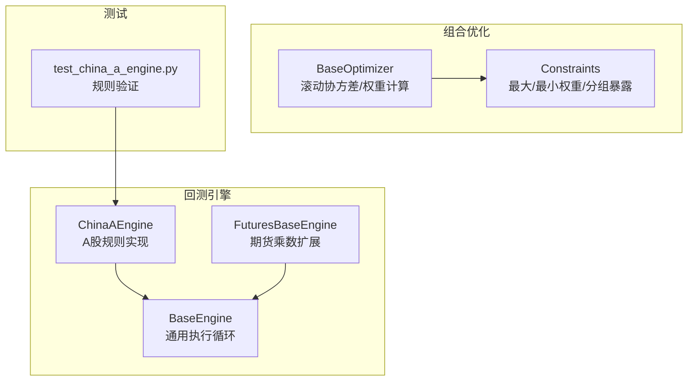
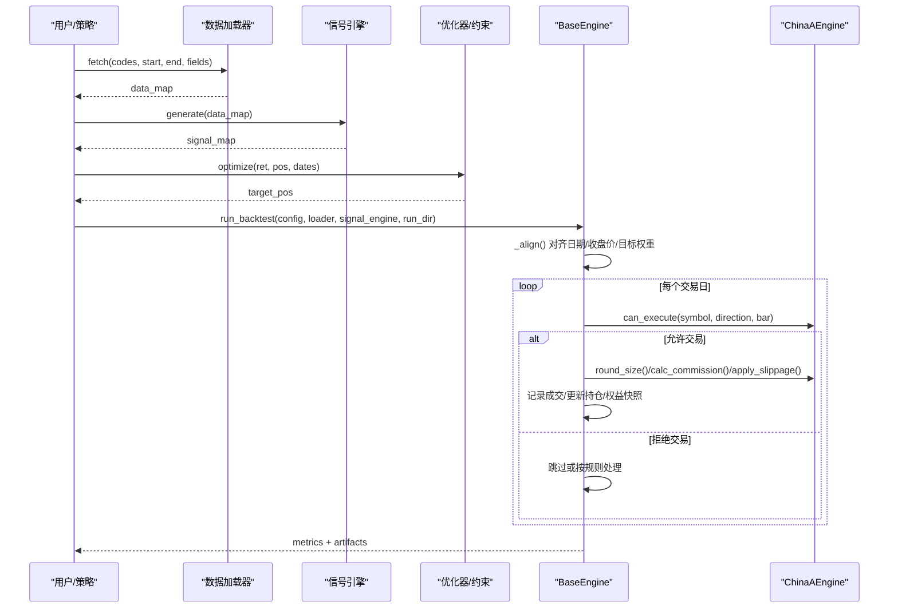
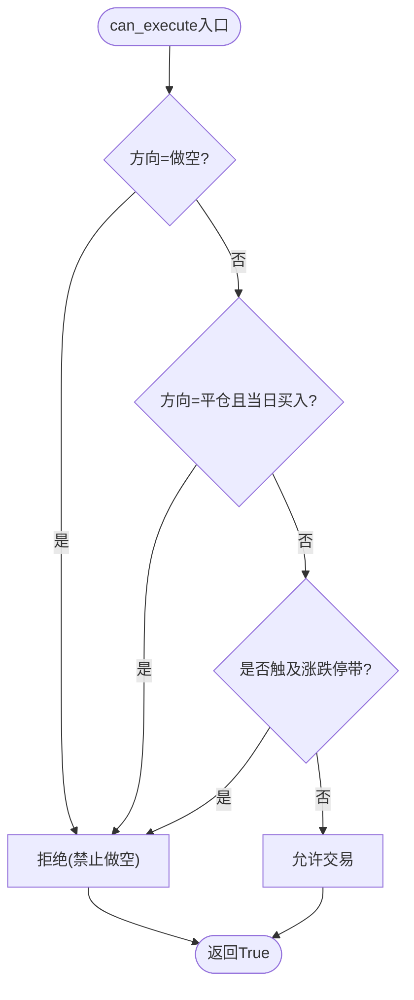
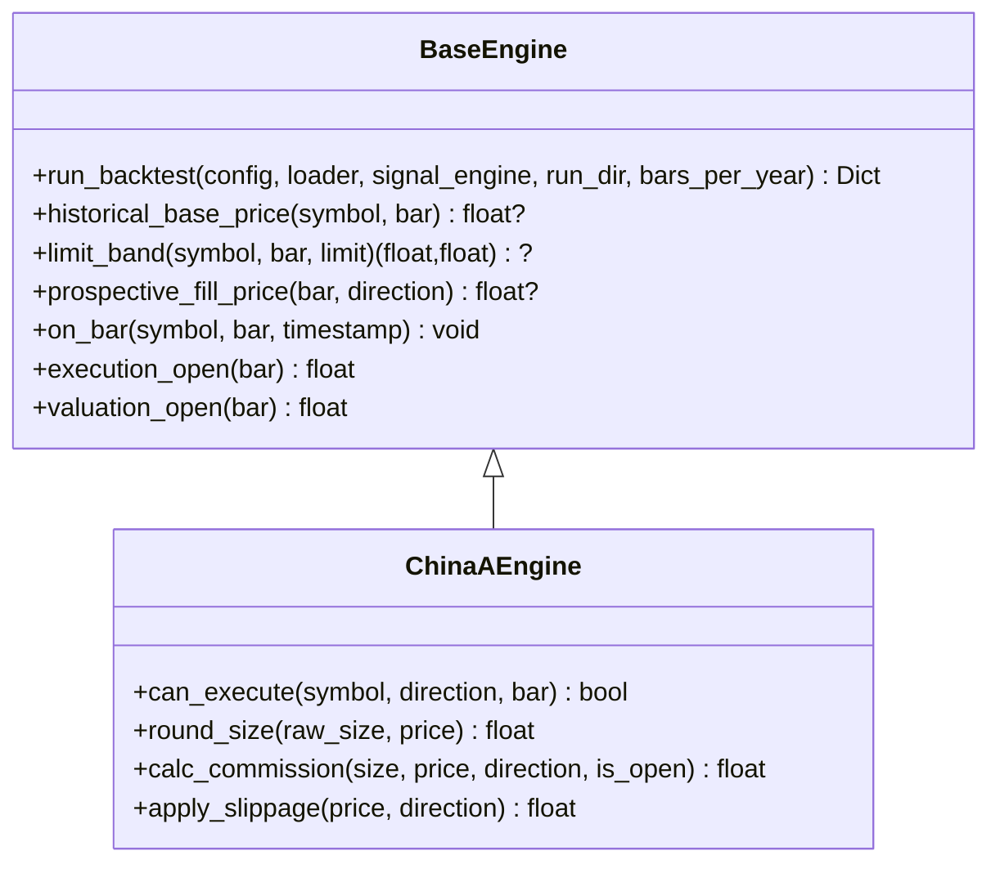
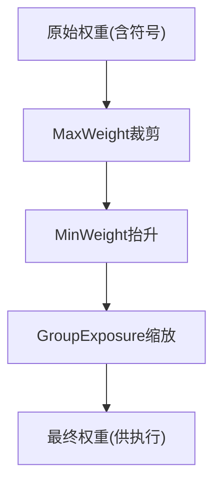
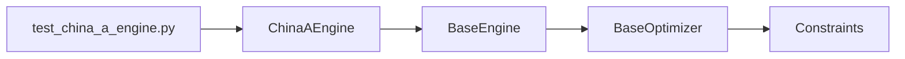

# A股市场引擎

<cite>
**本文引用的文件**
- [china_a.py](file://agent/backtest/engines/china_a.py)
- [base.py](file://agent/backtest/engines/base.py)
- [constraints.py](file://agent/backtest/constraints.py)
- [futures_base.py](file://agent/backtest/engines/futures_base.py)
- [test_china_a_engine.py](file://agent/tests/test_china_a_engine.py)
</cite>

## 目录
1. [简介](#简介)
2. [项目结构](#项目结构)
3. [核心组件](#核心组件)
4. [架构总览](#架构总览)
5. [详细组件分析](#详细组件分析)
6. [依赖关系分析](#依赖关系分析)
7. [性能考量](#性能考量)
8. [故障排查指南](#故障排查指南)
9. [结论](#结论)
10. [附录](#附录)

## 简介
本技术文档聚焦于A股市场引擎的实现与使用，围绕A股特有的交易规则与数据处理逻辑展开，包括：
- T+1交易制度、涨跌停限制（主板±10%、创业板/科创板±20%、北交所±30%）、最小交易单位（100股整手）等约束。
- 佣金模型：券商佣金（最低5元）、印花税（仅卖出）、过户费（双边）。
- 订单执行模拟：基于日频回测的“开盘价成交”语义，结合滑点与涨跌停带检查，避免未来函数与非法成交。
- 数据增强：支持基本面字段与事件流注入，便于因子构建与组合优化。
- 策略开发指南：因子构建、组合优化、风险控制与成本建模的最佳实践，并附测试用例参考。

## 项目结构
与A股引擎直接相关的代码集中在回测引擎模块中：
- 市场引擎实现：A股专用引擎 ChinaAEngine 继承自通用基类 BaseEngine。
- 约束与优化：权重约束层 constraints 与优化器基类 BaseOptimizer。
- 测试验证：针对A股规则的单元测试覆盖T+1、涨跌停、整手、费用等。

图表来源
- [base.py:377-800](file://agent/backtest/engines/base.py#L377-L800)
- [china_a.py:20-93](file://agent/backtest/engines/china_a.py#L20-L93)
- [constraints.py:1-206](file://agent/backtest/constraints.py#L1-L206)
- [futures_base.py:19-57](file://agent/backtest/engines/futures_base.py#L19-L57)
- [test_china_a_engine.py:1-274](file://agent/tests/test_china_a_engine.py#L1-L274)

章节来源
- [base.py:377-800](file://agent/backtest/engines/base.py#L377-L800)
- [china_a.py:20-93](file://agent/backtest/engines/china_a.py#L20-L93)

## 核心组件
- ChinaAEngine：实现A股特有规则（T+1、涨跌停、整手、费用、滑点），并复用基类的执行框架。
- BaseEngine：提供统一的回测执行流程（数据加载→信号生成→目标权重→逐Bar执行→指标输出），以及价格带、历史基准价、预期成交价等工具方法。
- Constraints：在优化器输出之上施加可组合的权重约束（单票上限/下限、行业/分组暴露上限）。
- FuturesBaseEngine：为期货引擎提供合约乘数对PnL、保证金、头寸规模的影响（A股不使用，但作为对比参考）。

章节来源
- [china_a.py:20-93](file://agent/backtest/engines/china_a.py#L20-L93)
- [base.py:377-800](file://agent/backtest/engines/base.py#L377-L800)
- [constraints.py:1-206](file://agent/backtest/constraints.py#L1-L206)
- [futures_base.py:19-57](file://agent/backtest/engines/futures_base.py#L19-L57)

## 架构总览
A股回测的整体流程由BaseEngine驱动，ChinaAEngine通过覆写市场规则接口参与执行：

图表来源
- [base.py:652-800](file://agent/backtest/engines/base.py#L652-L800)
- [china_a.py:40-93](file://agent/backtest/engines/china_a.py#L40-L93)

## 详细组件分析

### A股引擎 ChinaAEngine
- 交易规则
  - 禁止做空：direction == -1 一律拒绝。
  - T+1：当日买入不可当日卖出；通过比较bar日期与持仓entry_time.date()实现。
  - 涨跌停限制：根据股票代码前缀判断板块，主板±10%，创业板/科创板±20%，北交所±30%；通过limit_band与prospective_fill_price进行“开盘价+滑点”是否触及涨跌停带的判定。
  - 最小交易单位：round_size将头寸向下取整到100股的整数倍。
- 费用模型
  - 券商佣金：名义金额×佣金率，且不低于最低5元。
  - 印花税：仅卖出时收取，名义金额×印花税率。
  - 过户费：双边收取，名义金额×过户费率。
- 滑点模型
  - 相对滑点：以方向乘以滑点率调整开盘价，用于成交价估计与涨跌停带检查。
- 关键方法
  - can_execute：综合T+1、涨跌停带检查决定是否允许交易。
  - calc_commission：计算单笔交易费用。
  - apply_slippage：应用滑点。
  - round_size：整手约束。

图表来源
- [china_a.py:40-68](file://agent/backtest/engines/china_a.py#L40-L68)
- [china_a.py:98-154](file://agent/backtest/engines/china_a.py#L98-L154)

章节来源
- [china_a.py:20-93](file://agent/backtest/engines/china_a.py#L20-L93)
- [test_china_a_engine.py:60-156](file://agent/tests/test_china_a_engine.py#L60-L156)

### 通用执行基类 BaseEngine
- 执行主循环 run_backtest：负责数据加载、信号生成、目标权重对齐、逐Bar执行、指标计算与结果输出。
- 价格带与基准价
  - historical_base_price：优先从bar中的pre_close获取，否则回溯前一交易日close或通过pct_chg反推昨日收盘，确保不引入未来信息。
  - limit_band：基于基准价与涨跌幅限制计算当日合法价格区间。
  - prospective_fill_price：以bar的open为基础，叠加滑点得到预期成交价，用于涨跌停带检查。
- 钩子与扩展点
  - on_bar：每根Bar的市场规则钩子（如资金费用、强平逻辑等）。
  - before_rebalance_bar / after_rebalance_bar：重平衡前后钩子。
  - after_position_adjustment：成交后更新风险状态/证据。
- 指标与基准
  - 内置收益序列、换手率、基准收益对齐与超额收益计算。

图表来源
- [base.py:377-800](file://agent/backtest/engines/base.py#L377-L800)
- [china_a.py:20-93](file://agent/backtest/engines/china_a.py#L20-L93)

章节来源
- [base.py:377-800](file://agent/backtest/engines/base.py#L377-L800)

### 组合优化与约束
- 优化器基类 BaseOptimizer：提供滚动窗口、协方差矩阵构建、权重归一化与符号保持的通用流程；子类实现具体权重计算。
- 约束层 Constraints：在优化器输出上依次施加
  - MaxWeight：单票权重上限，超出的权重按比例再分配给未达上限的标的。
  - MinWeight：单票权重下限，低于下限的标的是否提升取决于其他标的能否让渡权重。
  - GroupExposure：按组（如行业）限制总暴露，超限则按比例缩放。
- 与执行的关系：约束作用于目标权重，实际成交可能因涨跌停、整手、资金不足等与市场规则而偏离目标权重。

图表来源
- [constraints.py:48-130](file://agent/backtest/constraints.py#L48-L130)
- [constraints.py:170-206](file://agent/backtest/constraints.py#L170-L206)

章节来源
- [constraints.py:1-206](file://agent/backtest/constraints.py#L1-L206)
- [base.py:358-385](file://agent/backtest/engines/base.py#L358-L385)

### 费用与滑点模型（A股）
- 券商佣金：名义金额×佣金率，且不低于最低5元。
- 印花税：仅卖出时收取，名义金额×印花税率。
- 过户费：双边收取，名义金额×过户费率。
- 滑点：相对滑点，买入加、卖出减，影响预期成交价与涨跌停带判定。

章节来源
- [china_a.py:57-75](file://agent/backtest/engines/china_a.py#L57-L75)
- [test_china_a_engine.py:188-239](file://agent/tests/test_china_a_engine.py#L188-L239)

### 涨跌停带判定与板块识别
- 板块识别：根据股票代码前缀判断
  - 300xxx/688xxx：±20%
  - 8xxxxx（北交所）：±30%
  - 其余主板：±10%
- 涨跌停带：基于历史基准价（pre_close或前一交易日close）计算上下限，用“开盘价+滑点”的预期成交价与上下限比较，避免未来函数。

章节来源
- [china_a.py:157-175](file://agent/backtest/engines/china_a.py#L157-L175)
- [china_a.py:98-154](file://agent/backtest/engines/china_a.py#L98-L154)
- [base.py:623-711](file://agent/backtest/engines/base.py#L623-L711)

### 数据增强与因子构建
- 基本面字段注入：可在数据加载后附加财务报表字段，便于价值/质量因子构建。
- 事件流注入：可通过RSSHub事件源注入事件评分，用于事件驱动因子。
- 信号对齐：统一日期索引、前向填充限制、按各自日历对齐信号并shift(1)，保证无未来信息泄露。

章节来源
- [base.py:282-371](file://agent/backtest/engines/base.py#L282-L371)
- [base.py:149-249](file://agent/backtest/engines/base.py#L149-L249)

## 依赖关系分析
- ChinaAEngine 依赖 BaseEngine 提供的执行框架与价格带工具。
- BaseEngine 依赖优化器与约束层对目标权重进行加工。
- 测试用例覆盖A股规则的关键分支，保障T+1、涨跌停、整手、费用等正确性。

图表来源
- [china_a.py:20-93](file://agent/backtest/engines/china_a.py#L20-L93)
- [base.py:377-800](file://agent/backtest/engines/base.py#L377-L800)
- [constraints.py:1-206](file://agent/backtest/constraints.py#L1-L206)
- [test_china_a_engine.py:1-274](file://agent/tests/test_china_a_engine.py#L1-L274)

章节来源
- [china_a.py:20-93](file://agent/backtest/engines/china_a.py#L20-L93)
- [base.py:377-800](file://agent/backtest/engines/base.py#L377-L800)
- [constraints.py:1-206](file://agent/backtest/constraints.py#L1-L206)
- [test_china_a_engine.py:1-274](file://agent/tests/test_china_a_engine.py#L1-L274)

## 性能考量
- 数据对齐与填充：使用numpy/pandas向量化操作与前向填充限制，减少长停牌导致的NaN扩散。
- 滚动优化：优化器采用滚动窗口计算协方差，避免全量矩阵运算带来的内存压力。
- 涨跌停带检查：基于历史基准价与预期成交价，避免复杂盘口模拟，降低计算开销。
- 建议
  - 合理设置ffill_limit，兼顾长停牌与跨市场差异。
  - 控制优化器lookback长度，平衡稳定性与响应速度。
  - 对高换手策略，谨慎评估滑点与涨跌停封板对成交率的侵蚀。

[本节为通用指导，不直接分析具体文件]

## 故障排查指南
- 无法成交
  - 检查是否触发T+1限制（当日买入不可卖出）。
  - 检查是否触及涨跌停带（开盘价+滑点超出合法区间）。
  - 检查整手约束导致四舍五入后头寸为零。
- 费用异常
  - 确认券商佣金是否达到最低5元。
  - 确认印花税仅在卖出时计入。
- 基准价缺失
  - 若bar缺少pre_close，系统会尝试回溯前一交易日close或通过pct_chg反推；若仍失败，涨跌停带检查将被跳过，需检查数据完整性。
- 信号对齐问题
  - 确认信号已按各自交易日历对齐并shift(1)，避免未来信息泄露。

章节来源
- [china_a.py:40-93](file://agent/backtest/engines/china_a.py#L40-L93)
- [base.py:623-711](file://agent/backtest/engines/base.py#L623-L711)
- [test_china_a_engine.py:82-156](file://agent/tests/test_china_a_engine.py#L82-L156)

## 结论
该A股市场引擎以BaseEngine为核心执行框架，ChinaAEngine精准实现了A股的交易规则与费用模型，并通过Constraints与BaseOptimizer提供灵活的组合优化能力。其设计强调无未来函数、严格的价格带检查与合理的滑点建模，适合用于A股日频策略的回测与初步验证。对于更复杂的盘中时段（集合竞价、连续竞价、尾盘集合竞价）与高频细节，可在现有框架基础上扩展数据粒度与执行模型。

[本节为总结性内容，不直接分析具体文件]

## 附录

### A股策略开发最佳实践
- 因子构建
  - 利用基本面字段注入与事件流注入，构建价值、质量、事件驱动因子。
  - 注意信号对齐与shift(1)，避免未来信息泄露。
- 组合优化
  - 使用BaseOptimizer的滚动协方差与权重归一化，结合Constraints进行单票与分组暴露控制。
  - 对高相关性资产，适当降低集中度，避免过度集中风险。
- 风险控制
  - 设置单票权重上限与行业暴露上限，控制尾部风险。
  - 考虑涨跌停与流动性约束，避免极端行情下的无法成交。
- 成本建模
  - 准确计入券商佣金（最低5元）、印花税（仅卖出）、过户费（双边）。
  - 对高换手策略，合理设置滑点参数，评估成交损耗。
- 回测与实盘差距
  - 涨跌停封板无法成交是主要失真来源，需在策略中显式建模。
  - 不同券商佣金与系统延迟差异显著，回测参数应保守取值。

[本节为通用指导，不直接分析具体文件]