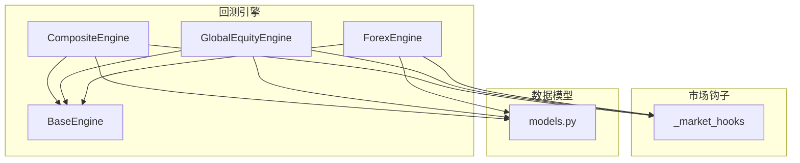
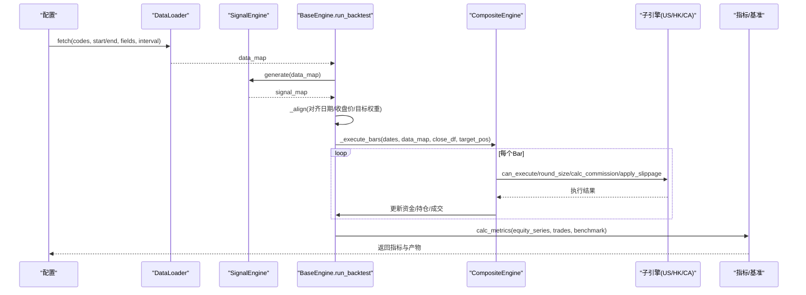
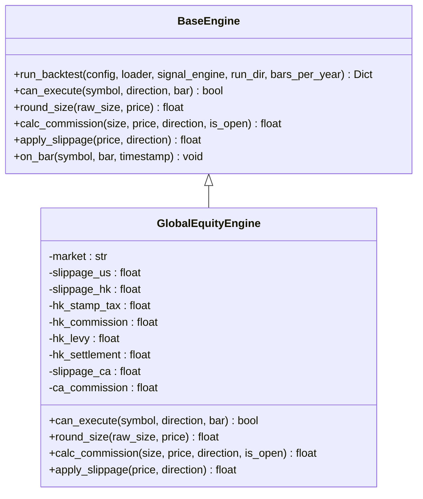
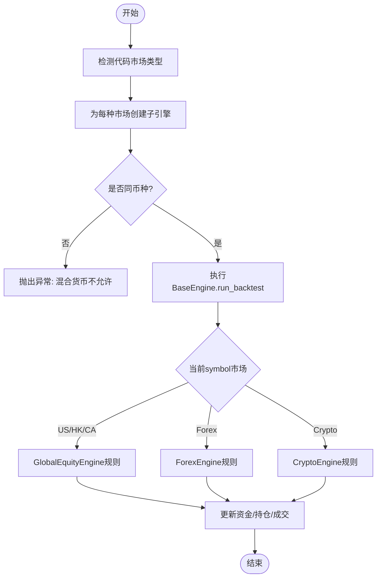
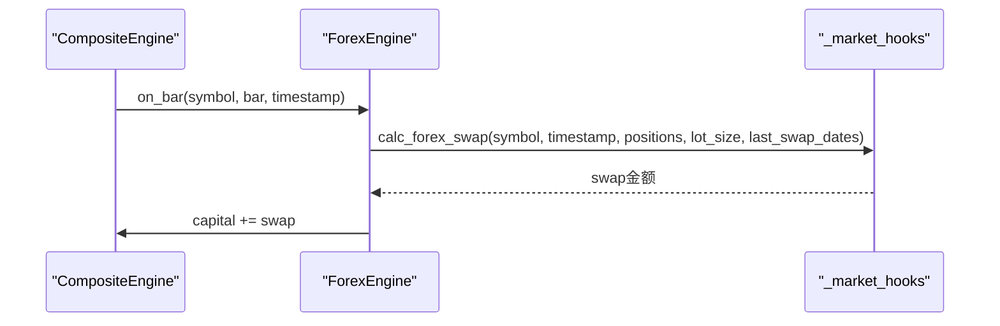
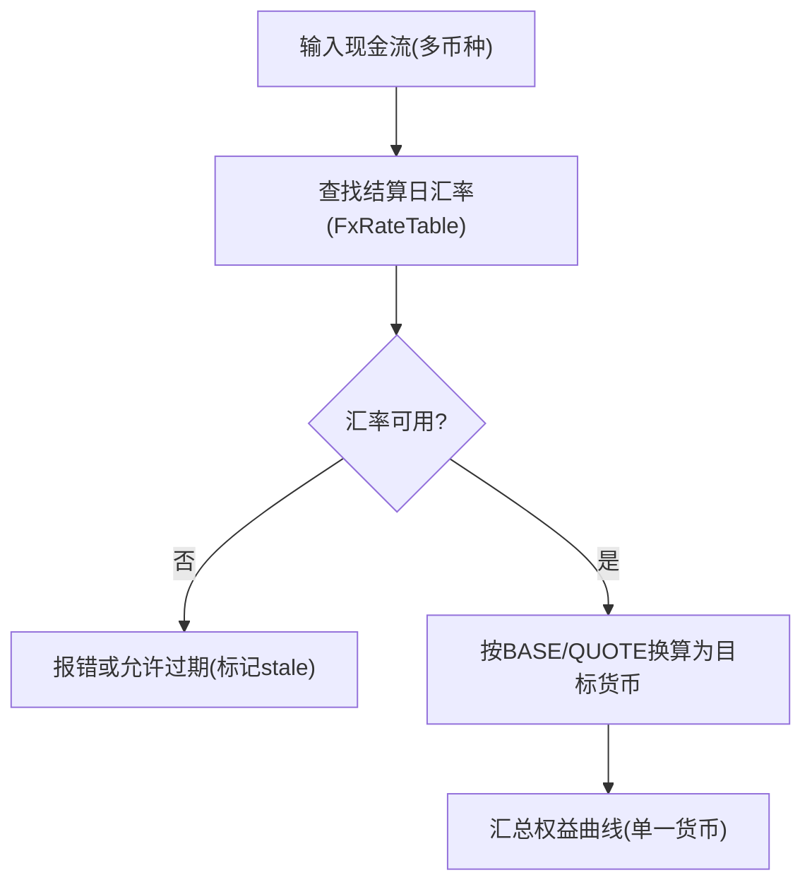
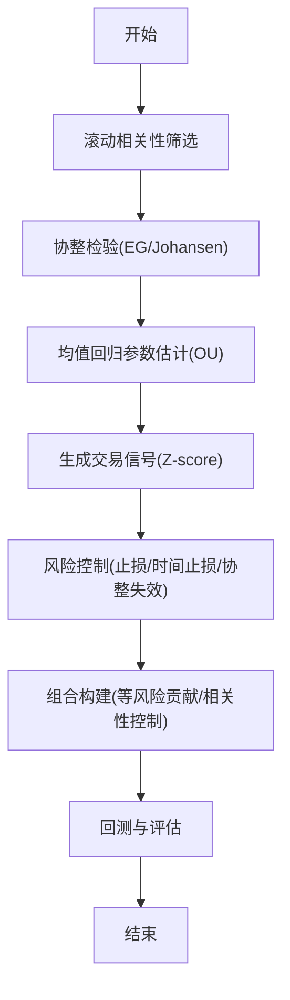
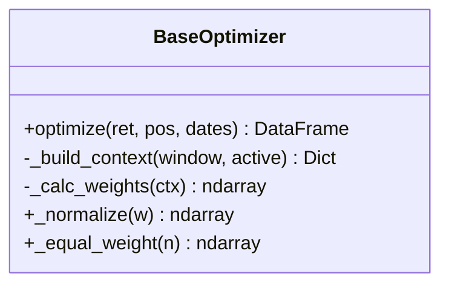
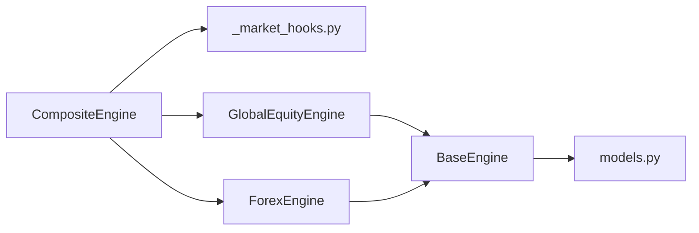

# 全球股票引擎

<cite>
**本文引用的文件**
- [global_equity.py](file://agent/backtest/engines/global_equity.py)
- [base.py](file://agent/backtest/engines/base.py)
- [composite.py](file://agent/backtest/engines/composite.py)
- [_market_hooks.py](file://agent/backtest/engines/_market_hooks.py)
- [forex.py](file://agent/backtest/engines/forex.py)
- [models.py](file://agent/backtest/models.py)
- [SKILL.md（资产分配）](file://agent/src/skills/asset-allocation/SKILL.md)
- [statistical_arbitrage_desk.yaml](file://agent/src/swarm/presets/statistical_arbitrage_desk.yaml)
- [pairs_research_lab.yaml](file://agent/src/swarm/presets/pairs_research_lab.yaml)
- [cashflow.py](file://agent/src/entities/cashflow.py)
</cite>

## 目录
1. [简介](#简介)
2. [项目结构](#项目结构)
3. [核心组件](#核心组件)
4. [架构总览](#架构总览)
5. [详细组件分析](#详细组件分析)
6. [依赖关系分析](#依赖关系分析)
7. [性能考量](#性能考量)
8. [故障排查指南](#故障排查指南)
9. [结论](#结论)
10. [附录](#附录)

## 简介
本技术文档面向“全球股票引擎”，聚焦多市场统一处理机制与跨市场策略落地。系统通过统一的回测引擎抽象，将美股、港股、加拿大股市等纳入同一执行框架，并扩展至外汇、加密货币与期货，形成可组合的跨市场回测能力。文档重点包括：
- 多市场标准化接口与规则适配（交易制度、涨跌停、盘前盘后、T+0/T+1、结算周期等）
- 汇率与多币种账户管理（汇率表、折算、风险标注）
- 跨市场套利策略（价差分析、协整关系、统计套利）
- 全球化投资组合构建（资产配置、风险管理、合规约束）
- 实际跨国策略示例与回测结果分析方法

## 项目结构
全球股票引擎位于回测子系统内，采用“基类 + 市场专用实现 + 组合引擎”的分层设计：
- BaseEngine：提供统一的回测流水线（数据加载→信号生成→权重优化→逐Bar执行→指标计算）
- GlobalEquityEngine：美股/港股/加拿大股票的规则实现（滑点、佣金、手数、价格步进）
- CompositeEngine：跨市场组合引擎，共享资金池，按代码路由到对应子引擎
- _market_hooks：市场识别、货币判定、外汇掉期与资金费率钩子
- ForexEngine：外汇现货/CFD引擎（点差、标准手、隔夜掉期）
- models：统一的头寸、成交、交易记录与权益快照数据结构

图表来源
- [base.py:377-800](file://agent/backtest/engines/base.py#L377-L800)
- [global_equity.py:33-124](file://agent/backtest/engines/global_equity.py#L33-L124)
- [composite.py:102-257](file://agent/backtest/engines/composite.py#L102-L257)
- [_market_hooks.py:23-115](file://agent/backtest/engines/_market_hooks.py#L23-L115)
- [forex.py:56-137](file://agent/backtest/engines/forex.py#L56-L137)
- [models.py:13-118](file://agent/backtest/models.py#L13-L118)

章节来源
- [base.py:377-800](file://agent/backtest/engines/base.py#L377-L800)
- [composite.py:1-257](file://agent/backtest/engines/composite.py#L1-L257)

## 核心组件
- BaseEngine：定义统一回测流程与可扩展的市场规则接口（can_execute、round_size、calc_commission、apply_slippage、on_bar），并提供基准收益、指标计算、重平衡注释输出等能力。
- GlobalEquityEngine：针对美股、港股、加拿大市场的规则实现，覆盖：
  - 美股：T+0、可做多做空、零佣金、支持碎股、低滑点
  - 港股：T+0、可做多做空、印花税+附加费、100股整数倍、较高滑点
  - 加拿大：整手交易、TSX/TSXV官方价格步进网格、可配置券商佣金
- CompositeEngine：跨市场组合引擎，维护共享资金池，按代码自动识别市场类型并路由到相应子引擎；强制同币种集合以避免错误汇总不同货币的权益曲线。
- ForexEngine：外汇现货/CFD引擎，使用点差作为成本、标准手为10万基础货币单位、支持隔夜掉期与杠杆。
- _market_hooks：符号→市场分类、结算货币判定、外汇掉期计算、加密货币资金费率与强平检查。
- models：Position/FillRecord/TradeRecord/EquitySnapshot等不可变数据类，保证回测证据链一致性与可追溯性。

章节来源
- [base.py:377-800](file://agent/backtest/engines/base.py#L377-L800)
- [global_equity.py:33-124](file://agent/backtest/engines/global_equity.py#L33-L124)
- [composite.py:102-257](file://agent/backtest/engines/composite.py#L102-L257)
- [forex.py:56-137](file://agent/backtest/engines/forex.py#L56-L137)
- [_market_hooks.py:23-115](file://agent/backtest/engines/_market_hooks.py#L23-L115)
- [models.py:13-118](file://agent/backtest/models.py#L13-L118)

## 架构总览
下图展示从数据加载到逐Bar执行的完整流程，以及跨市场路由与规则应用：

图表来源
- [base.py:652-800](file://agent/backtest/engines/base.py#L652-L800)
- [composite.py:129-257](file://agent/backtest/engines/composite.py#L129-L257)
- [global_equity.py:65-124](file://agent/backtest/engines/global_equity.py#L65-L124)

## 详细组件分析

### 全球股票引擎（GlobalEquityEngine）
- 市场规则
  - 美股：T+0、可做多做空、零佣金、碎股（0.01）、低滑点
  - 港股：T+0、可做多做空、印花税双边0.1%、附加费与结算费、100股整数倍、较高滑点
  - 加拿大：整手、TSX/TSXV价格步进网格（$0.50以下$0.005步进，否则$0.01）、可配置券商佣金
- 关键方法
  - can_execute：允许当日回转与双向交易
  - round_size：按市场规则进行手数/碎股调整
  - calc_commission：按市场费用结构计算
  - apply_slippage：按市场滑点与价格步进调整成交价

图表来源
- [base.py:377-608](file://agent/backtest/engines/base.py#L377-L608)
- [global_equity.py:33-124](file://agent/backtest/engines/global_equity.py#L33-L124)

章节来源
- [global_equity.py:33-124](file://agent/backtest/engines/global_equity.py#L33-L124)

### 组合引擎（CompositeEngine）与跨市场路由
- 功能要点
  - 自动识别代码所属市场（美股/港股/加拿大/A股/印度/韩国/加密/外汇/期货）
  - 为每种市场类型实例化对应的子引擎，作为无状态“规则书”
  - 共享资金池与持仓，所有PnL与交易记录集中在组合引擎中
  - 强制同币种集合校验，避免混合货币导致权益曲线无意义
- 关键逻辑
  - _build_rule_engines：根据codes检测市场并创建子引擎
  - _reject_mixed_currency：拒绝跨结算货币的组合
  - on_bar：按市场类型调用子引擎或公共钩子（如外汇掉期、加密资金费率）

图表来源
- [composite.py:26-147](file://agent/backtest/engines/composite.py#L26-L147)
- [_market_hooks.py:23-115](file://agent/backtest/engines/_market_hooks.py#L23-L115)

章节来源
- [composite.py:26-147](file://agent/backtest/engines/composite.py#L26-L147)
- [_market_hooks.py:23-115](file://agent/backtest/engines/_market_hooks.py#L23-L115)

### 外汇引擎（ForexEngine）与掉期
- 市场规则
  - 24x5交易、点差替代显式佣金、高杠杆、标准手10万基础货币、每日掉期、无涨跌停限制
- 关键点
  - apply_slippage：基于点差与滑点调整成交价
  - on_bar：每日掉期计入资金
  - 与组合引擎协作：在CompositeEngine.on_bar中统一计算掉期并扣/加资金

图表来源
- [forex.py:124-132](file://agent/backtest/engines/forex.py#L124-L132)
- [_market_hooks.py:532-573](file://agent/backtest/engines/_market_hooks.py#L532-L573)
- [composite.py:229-257](file://agent/backtest/engines/composite.py#L229-L257)

章节来源
- [forex.py:56-137](file://agent/backtest/engines/forex.py#L56-L137)
- [_market_hooks.py:510-573](file://agent/backtest/engines/_market_hooks.py#L510-L573)
- [composite.py:229-257](file://agent/backtest/engines/composite.py#L229-L257)

### 汇率处理与多币种账户管理
- 汇率表（FxRateTable）
  - 以BASE/QUOTE约定存储汇率，严格校验正数与有限值
  - 现金流折算时采用每笔现金流结算日汇率，而非期末汇率，避免系统性偏差
  - 缺失汇率默认报错，可选allow_stale_rates放宽但会标记stale
- 组合引擎币种约束
  - 组合回测要求所有代码结算于同一货币，防止CNY/USD/KRW直接相加导致指标失真
- 外汇掉期
  - 对主要货币对提供固定掉期表，周三三倍掉期
- 实践建议
  - 多币种账户需在外层做统一折算（例如全部折算至USD），再进入组合引擎
  - 对跨境现金流使用精确结算日汇率，并在报告中披露汇率来源与时效

图表来源
- [cashflow.py:427-515](file://agent/src/entities/cashflow.py#L427-L515)
- [composite.py:85-116](file://agent/backtest/engines/composite.py#L85-L116)
- [_market_hooks.py:510-573](file://agent/backtest/engines/_market_hooks.py#L510-L573)

章节来源
- [cashflow.py:427-515](file://agent/src/entities/cashflow.py#L427-L515)
- [composite.py:85-116](file://agent/backtest/engines/composite.py#L85-L116)

### 跨市场套利策略（统计套利）
- 配对筛选
  - 相关性预筛（滚动相关系数阈值）
  - 协整检验（Engle–Granger、Johansen）
- 均值回归建模
  - 价差OU过程估计（半衰期、均衡均值、波动率）
  - 动态对冲比率（Kalman滤波、VECM）
- 交易规则
  - 入场：Z-score阈值（±1.5~2.0σ），动态阈值在高波动区放宽
  - 出场：价差回归至±0.5σ，止损|Z|>3.0~3.5σ，时间止损（2×半衰期）
  - 组合：多对并行，等风险贡献（反波动加权），控制配对间相关性
- 评分体系
  - 协整强度、半衰期区间、价差波动适中、Hurst指数、历史稳定性综合打分

图表来源
- [statistical_arbitrage_desk.yaml:1-168](file://agent/src/swarm/presets/statistical_arbitrage_desk.yaml#L1-L168)
- [pairs_research_lab.yaml:88-124](file://agent/src/swarm/presets/pairs_research_lab.yaml#L88-L124)

章节来源
- [statistical_arbitrage_desk.yaml:1-168](file://agent/src/swarm/presets/statistical_arbitrage_desk.yaml#L1-L168)
- [pairs_research_lab.yaml:88-124](file://agent/src/swarm/presets/pairs_research_lab.yaml#L88-L124)

### 全球化投资组合构建
- 资产配置理论
  - 现代投资组合理论（MPT）、Black-Litterman、风险预算、全天候策略
- 内置优化器
  - equal_volatility、risk_parity、mean_variance、max_diversification、turnover_aware
- 实践要点
  - 使用滚动协方差矩阵与因果窗口，避免未来信息泄露
  - 结合约束（行业/国家/杠杆上限）与交易成本惩罚
  - 定期再平衡与阈值触发

图表来源
- [base.py(optimizers):14-145](file://agent/backtest/optimizers/base.py#L14-L145)

章节来源
- [SKILL.md（资产分配）:1-306](file://agent/src/skills/asset-allocation/SKILL.md#L1-L306)
- [base.py(optimizers):14-145](file://agent/backtest/optimizers/base.py#L14-L145)

## 依赖关系分析
- 模块耦合
  - CompositeEngine依赖_market_hooks进行市场识别与货币判定，并委托子引擎执行规则
  - GlobalEquityEngine与ForexEngine均继承BaseEngine，复用统一回测流程
  - models提供不可变数据类，确保回测证据一致性
- 外部依赖
  - pandas/numpy用于数据处理与向量化计算
  - 可选RSSHub事件与Tushare基本面增强（由BaseEngine管线注入）

图表来源
- [base.py:377-800](file://agent/backtest/engines/base.py#L377-L800)
- [composite.py:102-257](file://agent/backtest/engines/composite.py#L102-L257)
- [global_equity.py:33-124](file://agent/backtest/engines/global_equity.py#L33-L124)
- [forex.py:56-137](file://agent/backtest/engines/forex.py#L56-L137)
- [models.py:13-118](file://agent/backtest/models.py#L13-L118)

章节来源
- [composite.py:102-257](file://agent/backtest/engines/composite.py#L102-L257)
- [base.py:377-800](file://agent/backtest/engines/base.py#L377-L800)

## 性能考量
- 数据对齐与填充
  - 使用numpy与pandas向量化操作进行收盘价矩阵构建与前向填充，跨市场场景提高ffill_limit以避免长停牌导致的信号失真
- 优化器效率
  - 滚动协方差窗口与因果切片，避免未来信息泄露的同时保持计算效率
- 滑点与手续费
  - 针对不同市场设置合理滑点与费用，避免过度乐观的回测结果
- 内存与I/O
  - 大数据集建议使用本地加载器或缓存，减少网络请求开销

[本节为通用指导，不直接分析具体文件]

## 故障排查指南
- 混合货币错误
  - 现象：组合回测抛出“混合货币不允许”异常
  - 原因：codes包含不同结算货币，导致权益曲线无意义
  - 解决：拆分运行或在外层统一折算至单一货币
- 汇率缺失
  - 现象：现金流折算时报MissingExchangeRateError
  - 原因：结算日无可用汇率
  - 解决：补充汇率数据或使用allow_stale_rates并审查stale标记
- 信号为空
  - 现象：无有效信号导致回测终止
  - 原因：信号生成失败或数据未对齐
  - 解决：检查数据范围、字段映射与信号生成逻辑
- 外汇掉期异常
  - 现象：资金曲线出现跳变
  - 原因：周三三倍掉期或掉期表缺失
  - 解决：确认timestamp与掉期表匹配，必要时自定义掉期参数

章节来源
- [composite.py:85-116](file://agent/backtest/engines/composite.py#L85-L116)
- [cashflow.py:427-515](file://agent/src/entities/cashflow.py#L427-L515)
- [forex.py:124-132](file://agent/backtest/engines/forex.py#L124-L132)

## 结论
全球股票引擎通过统一的回测框架与灵活的市场规则适配，实现了美股、港股、加拿大股市等多市场的标准化处理，并扩展到外汇与加密货币领域。组合引擎确保跨市场策略的可执行性与一致性，汇率表与币种约束保障了多币种环境的正确性。配合统计套利与资产配置工具，用户可构建稳健的全球化投资组合并进行严谨的回测验证。

[本节为总结性内容，不直接分析具体文件]

## 附录
- 市场规则速查
  - 美股：T+0、可做多做空、零佣金、碎股、低滑点
  - 港股：T+0、可做多做空、印花税+附加费、100股整数倍、较高滑点
  - 加拿大：整手、TSX/TSXV价格步进网格、可配置佣金
  - 外汇：24x5、点差成本、标准手、隔夜掉期
- 策略模板
  - 统计套利：配对筛选、协整检验、均值回归、风险控制
  - 资产配置：MPT、BL、风险预算、全天候
- 回测产物
  - 权益曲线、交易记录、指标摘要、重平衡注释

[本节为参考信息，不直接分析具体文件]