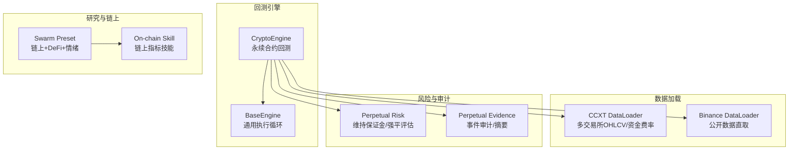
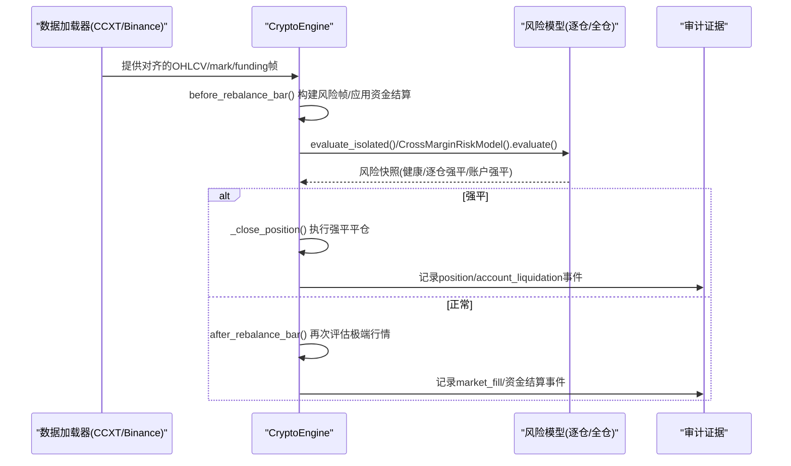
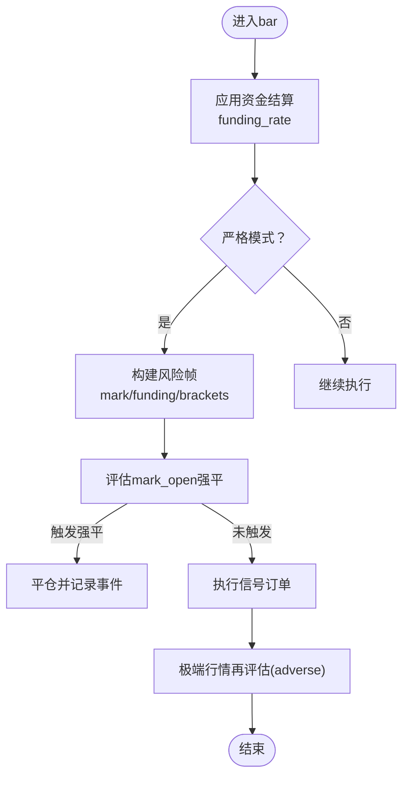
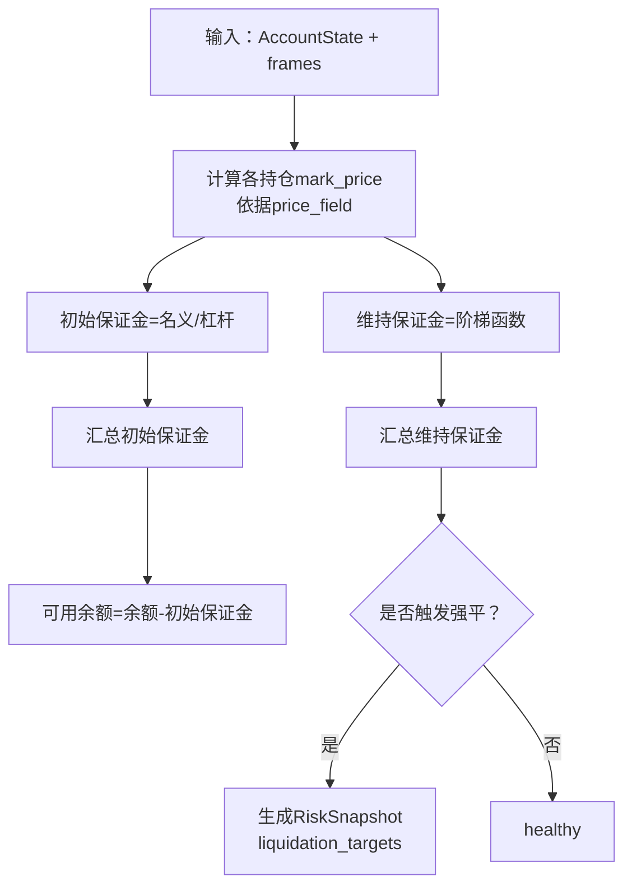
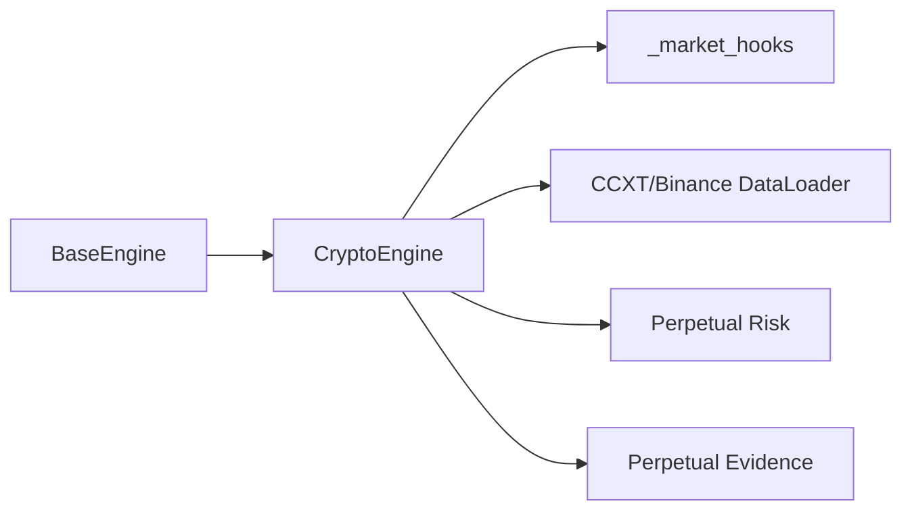

# 加密货币引擎

<cite>
**本文引用的文件**
- [crypto.py](file://agent/backtest/engines/crypto.py)
- [_market_hooks.py](file://agent/backtest/engines/_market_hooks.py)
- [base.py](file://agent/backtest/engines/base.py)
- [ccxt_loader.py](file://agent/backtest/loaders/ccxt_loader.py)
- [binance_loader.py](file://agent/backtest/loaders/binance_loader.py)
- [perpetual_risk.py](file://agent/backtest/perpetual_risk.py)
- [perpetual_evidence.py](file://agent/backtest/perpetual_evidence.py)
- [crypto_research_lab.yaml](file://agent/src/swarm/presets/crypto_research_lab.yaml)
- [SKILL.md](file://agent/src/skills/onchain-analysis/SKILL.md)
</cite>

## 目录
1. [简介](#简介)
2. [项目结构](#项目结构)
3. [核心组件](#核心组件)
4. [架构总览](#架构总览)
5. [详细组件分析](#详细组件分析)
6. [依赖关系分析](#依赖关系分析)
7. [性能与数据特性](#性能与数据特性)
8. [风险管理指南](#风险管理指南)
9. [策略与实战示例](#策略与实战示例)
10. [故障排查](#故障排查)
11. [结论](#结论)

## 简介
本技术文档围绕“加密货币引擎”展开，系统化阐述加密货币市场的独特性（24小时交易、高波动、流动性差异）、交易所特定规则（手续费、资金费率、交割机制、杠杆与强平）、数据处理（分钟级高频、链上数据集成、DeFi协议交互），以及策略类型（做市、套利、趋势跟踪）与风险管理（极端波动、交易所风险、智能合约风险）。文档同时给出可落地的回测与实盘注意事项。

## 项目结构
本项目将“加密货币永续合约回测引擎”作为核心，围绕统一的数据加载层、风险模型与审计证据输出构建。关键目录与职责：
- backtest/engines/crypto.py：加密货币永续合约回测引擎实现，封装手续费、滑点、资金费率、强平与严格模式下的风控流程。
- backtest/loaders/ccxt_loader.py 与 binance_loader.py：通过 CCXT 统一接入百余家交易所的现货与永续合约 OHLCV 与资金费率历史；Binance 专用加载器提供公开市场数据直取能力。
- backtest/perpetual_risk.py：纯状态与风险契约，定义维持保证金阶梯、账户/持仓风险快照、逐条评估逻辑，支持逐仓与全仓两种模式。
- backtest/perpetual_evidence.py：严格模式下的事件审计日志与汇总摘要，确保可追溯与可复现。
- backtest/engines/base.py：通用回测循环与执行框架，所有市场引擎继承并覆写市场规则方法。
- agent/src/swarm/presets/crypto_research_lab.yaml：链上+DeFi+情绪三维研究流水线配置，体现链上与 DeFi 数据的集成思路。
- agent/src/skills/onchain-analysis/SKILL.md：链上数据分析技能说明，涵盖活跃地址、鲸鱼追踪、TVL、估值指标等。



图表来源
- [crypto.py:41-106](file://agent/backtest/engines/crypto.py#L41-L106)
- [ccxt_loader.py:184-308](file://agent/backtest/loaders/ccxt_loader.py#L184-L308)
- [binance_loader.py:23-44](file://agent/backtest/loaders/binance_loader.py#L23-L44)
- [perpetual_risk.py:181-418](file://agent/backtest/perpetual_risk.py#L181-L418)
- [perpetual_evidence.py:17-85](file://agent/backtest/perpetual_evidence.py#L17-L85)

章节来源
- [crypto.py:41-106](file://agent/backtest/engines/crypto.py#L41-L106)
- [base.py:1-200](file://agent/backtest/engines/base.py#L1-L200)
- [ccxt_loader.py:184-308](file://agent/backtest/loaders/ccxt_loader.py#L184-L308)
- [binance_loader.py:23-44](file://agent/backtest/loaders/binance_loader.py#L23-L44)
- [perpetual_risk.py:181-418](file://agent/backtest/perpetual_risk.py#L181-L418)
- [perpetual_evidence.py:17-85](file://agent/backtest/perpetual_evidence.py#L17-L85)

## 核心组件
- 加密货币永续合约回测引擎（CryptoEngine）
  - 支持24小时交易、方向不限、Maker/Taker 手续费分离、每8小时资金结算、强平阈值、允许小数仓位。
  - 严格模式（perpetual_strict）下，使用标记价（mark price）与资金费率对齐的帧进行风险评估，支持逐仓/全仓，记录完整审计事件。
- 数据加载器（CCXT/Binance）
  - 统一拉取OHLCV与永续合约资金费率历史，支持分页、超时与预算限制，保证长时间拉取不挂起。
  - 对永续合约返回 trade 与 mark 价格对齐的列，并在资金结算时刻填充 funding_rate 与 settlement time。
- 风险模型（Perpetual Risk）
  - 维护保证金按名义价值阶梯计算，支持逐仓与全仓评估，产出风险快照（健康/逐仓强平/账户强平）。
- 审计证据（Perpetual Evidence）
  - 以不可变追加方式记录资金结算、强平、成交等事件，并生成JSON摘要，便于复盘与合规审计。

章节来源
- [crypto.py:41-106](file://agent/backtest/engines/crypto.py#L41-L106)
- [ccxt_loader.py:226-372](file://agent/backtest/loaders/ccxt_loader.py#L226-L372)
- [perpetual_risk.py:181-418](file://agent/backtest/perpetual_risk.py#L181-L418)
- [perpetual_evidence.py:17-85](file://agent/backtest/perpetual_evidence.py#L17-L85)

## 架构总览
下图展示从数据到执行再到风险与审计的端到端流程，强调严格模式下的资金费率与标记价对齐、以及强平触发路径。



图表来源
- [crypto.py:352-385](file://agent/backtest/engines/crypto.py#L352-L385)
- [perpetual_risk.py:357-418](file://agent/backtest/perpetual_risk.py#L357-L418)
- [perpetual_evidence.py:17-85](file://agent/backtest/perpetual_evidence.py#L17-L85)

## 详细组件分析

### 加密货币永续合约回测引擎（CryptoEngine）
- 市场规则
  - 24/7交易、方向自由、Maker/Taker 手续费分离、每8小时资金结算、强平阈值、小数仓位。
- 关键行为
  - 开仓/加仓/减仓/平仓时记录成交事件与费用；严格模式下使用 execution_open/mark_open 等字段。
  - 资金费率：优先使用数据源的历史 funding_rate，否则回退到固定配置；在结算时刻扣减/增加资金。
  - 强平：基于逐仓或全仓风险模型评估，若触及维持保证金则触发逐仓或账户级强平，并记录强平费用。
  - 严格模式校验：要求时间粒度≤1H，且需配套维护保证金阶梯版本一致。
- 执行时序
  - before_rebalance_bar：构建风险帧、应用资金结算、预评估 mark_open。
  - after_rebalance_bar：在极端行情（adverse）再评估一次，防止盘中滑点导致的强平遗漏。
  - 每次成交后：更新逐仓保证金（逐仓模式），并再次评估风险。



图表来源
- [crypto.py:352-385](file://agent/backtest/engines/crypto.py#L352-L385)
- [crypto.py:446-455](file://agent/backtest/engines/crypto.py#L446-L455)
- [crypto.py:601-615](file://agent/backtest/engines/crypto.py#L601-L615)

章节来源
- [crypto.py:41-106](file://agent/backtest/engines/crypto.py#L41-L106)
- [crypto.py:111-142](file://agent/backtest/engines/crypto.py#L111-L142)
- [crypto.py:246-350](file://agent/backtest/engines/crypto.py#L246-L350)
- [crypto.py:352-385](file://agent/backtest/engines/crypto.py#L352-L385)
- [crypto.py:446-455](file://agent/backtest/engines/crypto.py#L446-L455)
- [crypto.py:601-615](file://agent/backtest/engines/crypto.py#L601-L615)

### 数据加载器（CCXT/Binance）
- 统一接口
  - 支持多种时间粒度映射（1m/5m/15m/30m/1h/4h/1d/1w/1M），自动处理分页与超时，避免网络异常导致长时间阻塞。
  - 永续合约拉取 trade 与 mark 两路数据并对齐时间戳，补充 funding_rate 与 funding_settlement_time。
- 维护保证金阶梯
  - 通过外部传入的“维护保证金阶梯工件”（含 schema_version、content_hash、symbol、brackets）进行校验与注入，不在回测路径中调用需要鉴权的API。
- Binance 专用加载器
  - 直接构造 ccxt.binance 或 ccxt.binanceusdm，忽略全局代理设置中的其他交易所，专注公开数据获取。

```mermaid
classDiagram
class CCXT_DataLoader {
+fetch(codes, start_date, end_date, interval, fields, bracket_artifacts, require_brackets) Dict
-_fetch_one(exchange, symbol, timeframe, since_ms, end_ms, params) DataFrame?
-_fetch_perpetual(exchange, symbol, timeframe, since_ms, end_ms, bracket_artifact, require_brackets) DataFrame
-_fetch_funding_history(exchange, symbol, since_ms, end_ms) DataFrame
}
class Binance_DataLoader {
+name = "binance"
+markets = {"crypto"}
+requires_auth = False
-_get_exchange(instrument_type) Exchange
}
CCXT_DataLoader <|-- Binance_DataLoader
```

图表来源
- [ccxt_loader.py:184-308](file://agent/backtest/loaders/ccxt_loader.py#L184-L308)
- [ccxt_loader.py:311-372](file://agent/backtest/loaders/ccxt_loader.py#L311-L372)
- [ccxt_loader.py:374-502](file://agent/backtest/loaders/ccxt_loader.py#L374-L502)
- [binance_loader.py:23-44](file://agent/backtest/loaders/binance_loader.py#L23-L44)

章节来源
- [ccxt_loader.py:226-372](file://agent/backtest/loaders/ccxt_loader.py#L226-L372)
- [ccxt_loader.py:374-502](file://agent/backtest/loaders/ccxt_loader.py#L374-L502)
- [binance_loader.py:23-44](file://agent/backtest/loaders/binance_loader.py#L23-L44)

### 风险模型（逐仓/全仓）
- 数据结构
  - MaintenanceBracket/MaintenanceSchedule：维护保证金阶梯与版本化集合，严格校验层级与名义上限递增。
  - PositionState/AccountState：持仓与账户状态，包含杠杆、累计入场费、逐仓保证金等。
  - MarketRiskFrame：不可变的标记价OHLC、资金费率与结算时间、维护保证金计划与数据来源。
- 评估逻辑
  - 逐仓：每个持仓独立评估，当 margin_balance ≤ maintenance_margin 时触发逐仓强平。
  - 全仓：合并所有持仓未实现盈亏，当 margin_balance ≤ maintenance_margin 或空账户余额为负时触发账户强平。
- 极端行情假设
  - adverse 模式下，多头采用 mark_low、空头采用 mark_high，保守估计盘中最大不利波动。



图表来源
- [perpetual_risk.py:181-272](file://agent/backtest/perpetual_risk.py#L181-L272)
- [perpetual_risk.py:274-333](file://agent/backtest/perpetual_risk.py#L274-L333)
- [perpetual_risk.py:335-418](file://agent/backtest/perpetual_risk.py#L335-L418)

章节来源
- [perpetual_risk.py:181-418](file://agent/backtest/perpetual_risk.py#L181-L418)

### 审计证据（严格模式）
- 事件类型
  - funding_settlement：资金结算事件，记录符号、数量、标记价、资金费率与PnL。
  - position_liquidation / account_liquidation：逐仓或账户级强平事件，记录强平价、费用与保真标志。
  - market_fill：成交事件，记录动作、方向、数量、成交价、费用与原因。
- 输出
  - perpetual_events.jsonl：不可变追加的事件流。
  - perpetual_summary.json：汇总统计（手续费、资金费率PnL、强平次数与费用、终端状态等）。

章节来源
- [perpetual_evidence.py:17-85](file://agent/backtest/perpetual_evidence.py#L17-L85)
- [crypto.py:559-603](file://agent/backtest/engines/crypto.py#L559-L603)

## 依赖关系分析
- CryptoEngine 依赖 BaseEngine 的通用执行循环，覆写市场规则方法以实现加密货币特有逻辑。
- 数据加载器通过 CCXT 抽象不同交易所，Binance 专用加载器进一步简化配置。
- 风险模型与审计模块解耦于引擎，仅通过不可变数据结构交互，提升可测试性与可追溯性。
- 符号分类与市场检测由共享工具完成，确保跨市场组合回测时的路由正确性。



图表来源
- [base.py:1-200](file://agent/backtest/engines/base.py#L1-L200)
- [crypto.py:41-106](file://agent/backtest/engines/crypto.py#L41-L106)
- [_market_hooks.py:23-80](file://agent/backtest/engines/_market_hooks.py#L23-L80)

章节来源
- [base.py:1-200](file://agent/backtest/engines/base.py#L1-L200)
- [crypto.py:41-106](file://agent/backtest/engines/crypto.py#L41-L106)
- [_market_hooks.py:23-80](file://agent/backtest/engines/_market_hooks.py#L23-L80)

## 性能与数据特性
- 24小时不间断交易
  - 无休市限制，回测需覆盖完整时间序列；建议合理选择时间粒度（如1m/5m/15m/1h）以平衡精度与性能。
- 高波动性与流动性差异
  - 大币种与小币种流动性差异显著，滑点与冲击成本需纳入策略设计；严格模式使用 mark 价与极端假设降低漏检风险。
- 分钟级高频数据
  - 数据加载器支持分页拉取与超时控制，避免长时段拉取挂起；注意时间对齐与去重（资金结算时刻）。
- 链上数据与DeFi协议交互
  - 通过 Swarm Preset 与 On-chain Skill 集成链上指标（活跃地址、TVL、MVRV/NVT/SOPR等）与 DeFi 生态健康度，形成多维Alpha合成。

章节来源
- [ccxt_loader.py:226-372](file://agent/backtest/loaders/ccxt_loader.py#L226-L372)
- [crypto_research_lab.yaml:1-271](file://agent/src/swarm/presets/crypto_research_lab.yaml#L1-L271)
- [SKILL.md:1-36](file://agent/src/skills/onchain-analysis/SKILL.md#L1-L36)

## 风险管理指南
- 极端波动处理
  - 使用严格模式与 adverse 极端假设，确保盘中极端行情不被忽略；结合逐仓/全仓模式选择合适的风险隔离方式。
- 交易所风险
  - 数据源延迟或中断可能导致信号错位；加载器已内置超时与预算限制，但仍需在实盘中加入熔断与降级机制。
- 智能合约风险（DeFi）
  - 链上数据与协议交互存在合约漏洞与黑天鹅风险；建议在策略中加入合约审计、白名单与限额控制。
- 资金费率与强平
  - 资金费率可能长期为正或为负，影响持有成本；强平阈值需结合阶梯维持保证金与杠杆动态调整。
- 实操建议
  - 小步验证：先在严格模式下用历史数据验证强平与资金费率逻辑，再逐步放宽至实盘。
  - 监控与告警：对资金费率异常、强平接近阈值、网络异常等进行实时监控与告警。

章节来源
- [crypto.py:246-350](file://agent/backtest/engines/crypto.py#L246-L350)
- [_market_hooks.py:223-308](file://agent/backtest/engines/_market_hooks.py#L223-L308)
- [perpetual_risk.py:357-418](file://agent/backtest/perpetual_risk.py#L357-L418)

## 策略与实战示例
- 做市商策略
  - 利用连续报价与微小价差获利，需关注手续费结构与滑点；在严格模式下评估极端行情对库存风险的影响。
- 套利策略
  - 跨所/跨期/期现套利需考虑资金费率、转账延迟与交易所规则差异；建议使用对齐的资金费率与标记价数据进行回测。
- 趋势跟踪
  - 在高波动环境中捕捉趋势，但需防范假突破与强平；结合链上活动与情绪指标过滤噪音。
- 链上与DeFi融合
  - 使用活跃地址、TVL、MVRV/NVT/SOPR等指标识别周期位置；结合情绪指标（恐惧贪婪指数、资金费率、OI）进行择时。

章节来源
- [crypto_research_lab.yaml:1-271](file://agent/src/swarm/presets/crypto_research_lab.yaml#L1-L271)
- [SKILL.md:1-36](file://agent/src/skills/onchain-analysis/SKILL.md#L1-L36)

## 故障排查
- 数据缺失或不完整
  - 检查时间范围与时间粒度是否匹配；确认资金结算时刻是否齐全（0/8/16 UTC）。
- 强平未触发
  - 确认严格模式与 adverse 极端假设启用；检查维护保证金阶梯版本与符号匹配。
- 资金费率异常
  - 核对历史 funding_rate 与固定回退值；确认结算时间与去重逻辑。
- 网络超时或挂起
  - 调整 CCXT_TIMEOUT_MS 与 CCXT_FETCH_BUDGET_S；检查代理设置与交易所可用性。

章节来源
- [ccxt_loader.py:226-372](file://agent/backtest/loaders/ccxt_loader.py#L226-L372)
- [ccxt_loader.py:374-502](file://agent/backtest/loaders/ccxt_loader.py#L374-L502)
- [crypto.py:246-350](file://agent/backtest/engines/crypto.py#L246-L350)

## 结论
本加密货币引擎以严格模式为核心，结合对齐的资金费率与标记价数据、逐仓/全仓风险模型与完整审计证据，提供了面向永续合约的高保真回测环境。配合链上与DeFi数据的三维研究流水线，可在复杂市场中构建稳健的策略体系。实盘部署时需重点关注数据质量、网络稳定性、合约风险与极端行情的应对机制。