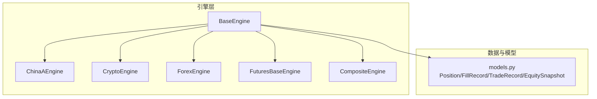
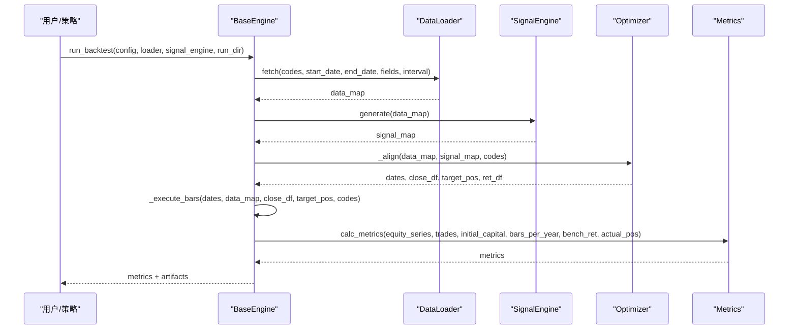
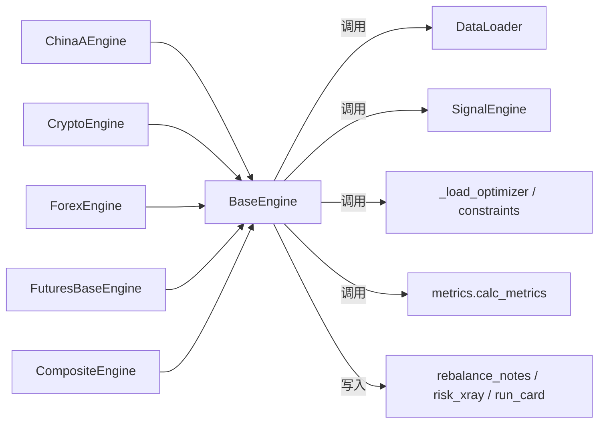

# 基础引擎架构

<cite>
**本文引用的文件**
- [agent/backtest/engines/base.py](file://agent/backtest/engines/base.py)
- [agent/backtest/engines/china_a.py](file://agent/backtest/engines/china_a.py)
- [agent/backtest/engines/crypto.py](file://agent/backtest/engines/crypto.py)
- [agent/backtest/engines/forex.py](file://agent/backtest/engines/forex.py)
- [agent/backtest/engines/futures_base.py](file://agent/backtest/engines/futures_base.py)
- [agent/backtest/engines/composite.py](file://agent/backtest/engines/composite.py)
- [agent/backtest/models.py](file://agent/backtest/models.py)
</cite>

## 目录
1. [简介](#简介)
2. [项目结构](#项目结构)
3. [核心组件](#核心组件)
4. [架构总览](#架构总览)
5. [详细组件分析](#详细组件分析)
6. [依赖关系分析](#依赖关系分析)
7. [性能考量](#性能考量)
8. [故障排查指南](#故障排查指南)
9. [结论](#结论)
10. [附录：扩展指南与最佳实践](#附录：扩展指南与最佳实践)

## 简介
本技术文档聚焦于回测基础引擎架构，围绕 BaseEngine 抽象类展开，系统阐述市场规则接口、回测执行主循环、订单与持仓管理、价格限制与滑点模型、佣金计算等通用逻辑。同时给出 run_backtest 的完整流程说明（数据加载、信号生成、权重优化、逐条执行、指标计算），并提供如何继承 BaseEngine 创建新市场引擎的实践建议与注意事项。

## 项目结构
- 引擎基类与通用执行循环位于 backtest/engines/base.py，提供统一的 run_backtest、_execute_bars、订单计划与执行、资金与持仓状态维护、指标输出与产物写入。
- 具体市场引擎实现：
  - A股：china_a.py（T+1、涨跌停、最小交易单位、印花税等）
  - 加密货币永续合约：crypto.py（资金费率、强平、严格风控模式）
  - 外汇：forex.py（点差、隔夜利息、标准手）
  - 期货基类：futures_base.py（合约乘数对PnL、保证金、头寸规模的影响）
  - 跨市场组合：composite.py（统一资金池，按标的类型路由到子引擎）
- 共享数据模型：models.py（Position、FillRecord、TradeRecord、EquitySnapshot）

图表来源
- [agent/backtest/engines/base.py:377-868](file://agent/backtest/engines/base.py#L377-L868)
- [agent/backtest/engines/china_a.py:20-93](file://agent/backtest/engines/china_a.py#L20-L93)
- [agent/backtest/engines/crypto.py:41-130](file://agent/backtest/engines/crypto.py#L41-L130)
- [agent/backtest/engines/forex.py:56-137](file://agent/backtest/engines/forex.py#L56-L137)
- [agent/backtest/engines/futures_base.py:19-57](file://agent/backtest/engines/futures_base.py#L19-L57)
- [agent/backtest/engines/composite.py:102-257](file://agent/backtest/engines/composite.py#L102-L257)
- [agent/backtest/models.py:13-118](file://agent/backtest/models.py#L13-L118)

章节来源
- [agent/backtest/engines/base.py:377-868](file://agent/backtest/engines/base.py#L377-L868)
- [agent/backtest/models.py:13-118](file://agent/backtest/models.py#L13-L118)

## 核心组件
- BaseEngine：定义市场规则接口与回测主循环，负责数据对齐、目标权重规划、逐bar执行、权益快照、指标计算与产物输出。
- 市场引擎子类：实现 can_execute、round_size、calc_commission、apply_slippage 等接口，封装各市场特有规则。
- 数据模型：Position、FillRecord、TradeRecord、EquitySnapshot 用于记录持仓、成交、交易与权益快照。
- 组合引擎：CompositeEngine 统一管理多市场标的，按标的类型路由到对应子引擎处理规则。

章节来源
- [agent/backtest/engines/base.py:377-868](file://agent/backtest/engines/base.py#L377-L868)
- [agent/backtest/engines/composite.py:102-257](file://agent/backtest/engines/composite.py#L102-L257)
- [agent/backtest/models.py:13-118](file://agent/backtest/models.py#L13-L118)

## 架构总览
BaseEngine.run_backtest 是回测入口，串联以下阶段：
1. 数据加载：通过 loader.fetch 获取OHLCV及可选字段，支持基本面与事件增强。
2. 信号生成：调用 signal_engine.generate 得到每标的信号序列。
3. 权重优化与对齐：_align 构建统一日期索引、收盘价矩阵、目标仓位矩阵，并应用优化器与约束。
4. 逐bar执行：_execute_bars 进行开盘价估值、目标调仓、订单计划与执行、钩子回调、权益快照。
5. 指标计算：基于 equity_series、trades、actual_pos 计算收益、风险、换手等指标。
6. 产物输出：rebalance notes、risk xray、run card、验证报告等。

图表来源
- [agent/backtest/engines/base.py:652-868](file://agent/backtest/engines/base.py#L652-L868)
- [agent/backtest/engines/base.py:872-1060](file://agent/backtest/engines/base.py#L872-L1060)

## 详细组件分析

### BaseEngine 抽象类与市场规则接口
- 市场规则接口（子类必须实现）：
  - can_execute(symbol, direction, bar)：判断是否允许交易（如T+1、涨跌停、做空限制）。
  - round_size(raw_size, price)：按最小交易单位或精度取整。
  - calc_commission(size, price, direction, is_open)：计算佣金/税费。
  - apply_slippage(price, direction)：滑点模型（买入加、卖出减）。
- 价格限制与基准价：
  - historical_base_price：从 pre_close/pre_settle 或前一根close推导历史基准价，避免未来函数。
  - prospective_fill_price：当前bar可执行的“预期成交价”（open + slippage）。
  - limit_band：根据基准价与限制比例计算合法价格区间。
- 订单与持仓：
  - _plan_open_order：在不修改状态的前提下计划开仓订单（含杠杆、保证金、佣金、滑点、正价格校验）。
  - _execute_target_rebalance：批量计划调仓（减仓与加仓），预检资金后原子提交。
  - _execute_open_order/_execute_position_increase/_execute_partial_reduction：提交订单并更新持仓、资金、交易记录。
  - _close_position：平仓、计算已实现盈亏、释放保证金、记录交易。
- 权益与估值：
  - _calc_open_equity/_calc_equity：按执行时可见价格与未实现盈亏计算账户权益。
  - _actual_weights/_actual_positions_frame：记录实际权重用于分析与产物。
- 钩子：
  - on_bar：每bar回调（如资金费率、强平检查、隔夜利息）。
  - before_rebalance_bar/after_rebalance_bar：调仓前后钩子（如严格模式下风险重算）。
  - after_position_adjustment：每次调整后回调（如记录事件、更新隔离保证金）。

章节来源
- [agent/backtest/engines/base.py:377-649](file://agent/backtest/engines/base.py#L377-L649)
- [agent/backtest/engines/base.py:652-868](file://agent/backtest/engines/base.py#L652-L868)
- [agent/backtest/engines/base.py:872-1060](file://agent/backtest/engines/base.py#L872-L1060)
- [agent/backtest/engines/base.py:1149-1600](file://agent/backtest/engines/base.py#L1149-L1600)

### A股市场引擎（ChinaAEngine）
- 规则要点：
  - T+1：当日买入不可当日卖出。
  - 禁止做空（direction == -1 直接拒绝）。
  - 涨跌停限制：主板±10%，创业板/科创板±20%，ST±5%（启发式）。
  - 最小交易单位：100股整数倍。
  - 费用：双边佣金（最低¥5）、双边过户费、卖出印花税。
  - 滑点：相对较小，按方向线性调整。
- 关键方法：
  - can_execute：结合T+1与涨跌停拦截。
  - round_size：向下取整至100股。
  - calc_commission：佣金+过户费+印花税（卖出）。
  - apply_slippage：price * (1 + direction * rate)。

章节来源
- [agent/backtest/engines/china_a.py:20-93](file://agent/backtest/engines/china_a.py#L20-L93)
- [agent/backtest/engines/china_a.py:98-175](file://agent/backtest/engines/china_a.py#L98-L175)

### 加密货币永续合约引擎（CryptoEngine）
- 规则要点：
  - 24/7交易，方向无限制。
  - Maker/Taker 费率分离；固定或数据驱动的资金费率结算。
  - 强平：维持保证金比率阈值触发逐仓或全仓强平。
  - 严格模式：使用 mark_open/mark_close 与极端值评估风险，记录事件与证据。
- 关键方法：
  - can_execute：严格模式下可能因强平而阻断交易。
  - round_size：支持小数，保留6位。
  - calc_commission：开仓通常taker，平仓maker（严格模式除外）。
  - apply_slippage：严格模式下rebalance路径可关闭滑点。
  - on_bar：资金费率扣收与强平检查。
  - before/after_rebalance_bar：严格模式下在调仓前后进行风险评估与可能的强平。
  - _write_artifacts：输出永续合约事件与统计。

章节来源
- [agent/backtest/engines/crypto.py:41-130](file://agent/backtest/engines/crypto.py#L41-L130)
- [agent/backtest/engines/crypto.py:352-447](file://agent/backtest/engines/crypto.py#L352-L447)
- [agent/backtest/engines/crypto.py:555-615](file://agent/backtest/engines/crypto.py#L555-L615)

### 外汇引擎（ForexEngine）
- 规则要点：
  - 24x5交易，无涨跌停与方向限制。
  - 成本以点差体现（bid-ask），外加额外滑点。
  - 标准手=100,000基础货币单位；可按微手粒度取整。
  - 每日收盘收取隔夜利息（swap）。
- 关键方法：
  - round_size：按1000单位取整（微手）。
  - calc_commission：返回0（成本体现在滑点）。
  - apply_slippage：按点对应pip换算，叠加半点差与额外滑点。
  - on_bar：计算并计入swap。

章节来源
- [agent/backtest/engines/forex.py:56-137](file://agent/backtest/engines/forex.py#L56-L137)

### 期货基类（FuturesBaseEngine）
- 作用：在 BaseEngine 基础上引入合约乘数，影响PnL、保证金与头寸规模计算。
- 覆盖方法：
  - get_contract_multiplier(symbol)：子类实现。
  - _calc_pnl/_calc_margin/_calc_raw_size：乘以合约乘数。

章节来源
- [agent/backtest/engines/futures_base.py:19-57](file://agent/backtest/engines/futures_base.py#L19-L57)

### 跨市场组合引擎（CompositeEngine）
- 职责：统一资金池，按标的类型路由到子引擎处理规则；集中管理资金、持仓、交易。
- 关键点：
  - 拒绝混币代码集（不同结算货币无法在同一资金池中正确汇总权益曲线）。
  - 将 can_execute/round_size/calc_commission/apply_slippage 等方法委托给对应子引擎。
  - 在 on_bar 中分发资金费率与swap处理。

章节来源
- [agent/backtest/engines/composite.py:26-100](file://agent/backtest/engines/composite.py#L26-L100)
- [agent/backtest/engines/composite.py:102-257](file://agent/backtest/engines/composite.py#L102-L257)

### 数据模型（models.py）
- Position：持仓信息（方向、入场价、时间、规模、杠杆、入场佣金等）。
- FillRecord：单笔成交证据（数量、价格、费用、保证金等价、原因、持有bar数）。
- TradeRecord：完整交易记录（进出场价、盈亏、百分比、原因、佣金、保证金等）。
- EquitySnapshot：单时间点权益快照（现金、未实现盈亏、总权益、持仓数）。

章节来源
- [agent/backtest/models.py:13-118](file://agent/backtest/models.py#L13-L118)

## 依赖关系分析
- BaseEngine 依赖：
  - 数据与信号：loader.fetch、signal_engine.generate。
  - 优化与约束：_load_optimizer、apply_constraints_frame。
  - 指标与产物：metrics.calc_metrics、rebalance_notes、risk_xray、run_card、validation。
- 子类依赖：
  - ChinaAEngine：依赖 BaseEngine 的涨跌停与基准价工具。
  - CryptoEngine：依赖 _market_hooks 的资金费率与强平检查、perpetual_risk/evidence。
  - ForexEngine：依赖 _market_hooks 的符号归一化与swap计算。
  - FuturesBaseEngine：仅扩展 PnL/保证金/规模计算。
  - CompositeEngine：动态构建子引擎并按标的路由。

图表来源
- [agent/backtest/engines/base.py:652-868](file://agent/backtest/engines/base.py#L652-L868)
- [agent/backtest/engines/composite.py:26-65](file://agent/backtest/engines/composite.py#L26-L65)

章节来源
- [agent/backtest/engines/base.py:652-868](file://agent/backtest/engines/base.py#L652-L868)
- [agent/backtest/engines/composite.py:26-65](file://agent/backtest/engines/composite.py#L26-L65)

## 性能考量
- 向量化对齐：_align 使用 numpy/pandas 向量化构建 close/position 矩阵，减少逐行开销。
- 快速索引：_execute_bars 预提取 ndarray 与 code_to_col 映射，避免 DataFrame.at[] 慢访问。
- 批量计划与缩放：_execute_target_rebalance 先计划所有增减仓，再统一资金校验与提交，避免顺序依赖导致的偏差。
- 条件快路径：当未重写 _calc_pnl/_calc_margin 时使用向量路径计算权益，提升大规模持仓时的性能。
- 合理ffill限制：跨市场场景提高ffill上限，避免长停牌导致的数据缺失影响对齐。

[本节为通用性能讨论，不直接分析具体文件]

## 故障排查指南
- 常见错误与定位：
  - 无数据或无效信号：run_backtest 在数据为空或信号格式不正确时会打印错误并退出。
  - 非有限数值：_validate_rebalance_values 会拒绝非有限或负价格，防止非法订单。
  - 资金不足：计划订单成本超过可用资金会抛出异常或拒绝订单。
  - 混币代码集：CompositeEngine 在运行前检查并拒绝混合结算货币的代码集合。
  - 强平与阻断：CryptoEngine 严格模式下可能标记标的为阻塞，阻止后续交易。
- 调试建议：
  - 检查 base_price_fields 与 historical_base_price 是否能获取有效基准价，确保涨跌停判断正确。
  - 确认 apply_slippage 与 round_size 的实现符合市场规则，避免滑点过大或手数不合规。
  - 在 before/after_rebalance_bar 中打印或记录中间状态，便于定位强平与资金问题。

章节来源
- [agent/backtest/engines/base.py:652-868](file://agent/backtest/engines/base.py#L652-L868)
- [agent/backtest/engines/base.py:1908-1919](file://agent/backtest/engines/base.py#L1908-L1919)
- [agent/backtest/engines/composite.py:85-116](file://agent/backtest/engines/composite.py#L85-L116)
- [agent/backtest/engines/crypto.py:352-447](file://agent/backtest/engines/crypto.py#L352-L447)

## 结论
BaseEngine 提供了稳健且可扩展的回测框架，通过明确的市场规则接口与严格的执行流程，确保回测结果的可复现性与真实性。各市场引擎只需专注实现本地规则，即可无缝接入统一框架。组合引擎进一步支持跨市场回测，但需遵守单一结算货币的限制。整体设计兼顾了性能、可维护性与扩展性。

[本节为总结性内容，不直接分析具体文件]

## 附录：扩展指南与最佳实践

### 如何继承 BaseEngine 创建新市场引擎
- 步骤概览：
  1. 新建子类继承 BaseEngine。
  2. 实现四个核心接口：can_execute、round_size、calc_commission、apply_slippage。
  3. 如需期货特性，继承 FuturesBaseEngine 并实现 get_contract_multiplier。
  4. 在 on_bar 中实现每bar逻辑（如资金费率、swap、强平检查）。
  5. 如有必要，覆盖 before_rebalance_bar/after_rebalance_bar 以插入风险重算或事件记录。
- 最佳实践：
  - 使用 BaseEngine 提供的 historical_base_price/prospective_fill_price/limit_band 来保证价格限制无未来函数。
  - 在 round_size 中严格遵守最小交易单位与精度要求。
  - 在 calc_commission 中区分开仓与平仓费用结构（如印花税、过户费）。
  - 在 apply_slippage 中使用合理的滑点模型，避免过度乐观或悲观。
  - 谨慎设置杠杆与保证金计算，确保 _calc_margin 与 _calc_raw_size 一致。
  - 在 CompositeEngine 环境中，确保标的结算货币一致，避免混币。

章节来源
- [agent/backtest/engines/base.py:377-649](file://agent/backtest/engines/base.py#L377-L649)
- [agent/backtest/engines/futures_base.py:19-57](file://agent/backtest/engines/futures_base.py#L19-L57)
- [agent/backtest/engines/composite.py:102-257](file://agent/backtest/engines/composite.py#L102-L257)

### 回测主流程 run_backtest 的执行步骤
- 数据加载：loader.fetch 获取OHLCV与可选字段，支持基本面与事件增强。
- 信号生成：signal_engine.generate 返回每标的信号序列。
- 权重优化与对齐：_align 构建统一日期索引、收盘价矩阵、目标仓位矩阵，应用优化器与约束。
- 逐bar执行：_execute_bars 进行开盘价估值、目标调仓、订单计划与执行、钩子回调、权益快照。
- 指标计算：基于 equity_series、trades、actual_pos 计算收益、风险、换手等指标。
- 产物输出：rebalance notes、risk xray、run card、验证报告等。

章节来源
- [agent/backtest/engines/base.py:652-868](file://agent/backtest/engines/base.py#L652-L868)
- [agent/backtest/engines/base.py:872-1060](file://agent/backtest/engines/base.py#L872-L1060)

### 关键方法实现规范
- can_execute：
  - 必须考虑市场规则（如T+1、涨跌停、做空限制）。
  - 使用 BaseEngine 的 limit_band 与 prospective_fill_price 避免未来函数。
- round_size：
  - 严格按最小交易单位或精度取整，确保 size > 0。
- calc_commission：
  - 区分开仓与平仓费用结构，考虑最低费用与双边费用。
- apply_slippage：
  - 使用方向参数决定滑点方向，保持与执行价格一致。
- 价格限制计算：
  - 使用 historical_base_price 获取历史基准价，结合 limit 计算上下限。
  - 用 prospective_fill_price 比较是否触及涨跌停。

章节来源
- [agent/backtest/engines/base.py:570-711](file://agent/backtest/engines/base.py#L570-L711)
- [agent/backtest/engines/china_a.py:40-93](file://agent/backtest/engines/china_a.py#L40-L93)
- [agent/backtest/engines/crypto.py:111-132](file://agent/backtest/engines/crypto.py#L111-L132)
- [agent/backtest/engines/forex.py:76-123](file://agent/backtest/engines/forex.py#L76-L123)