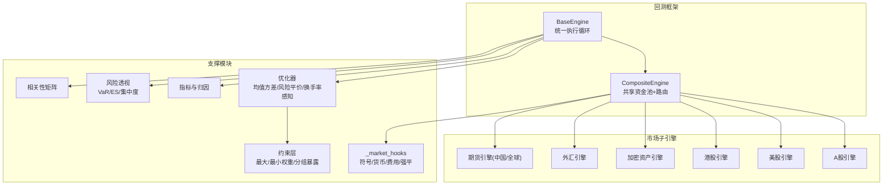
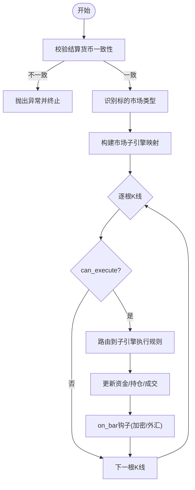
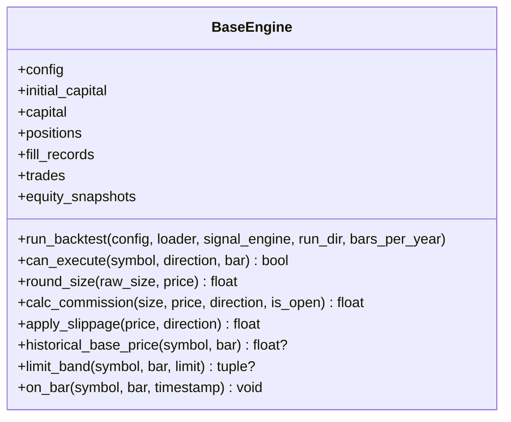
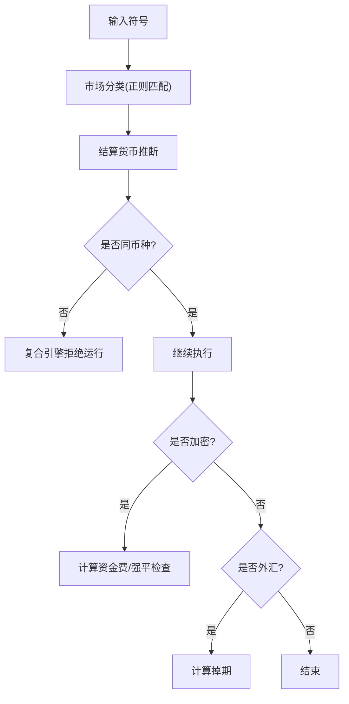
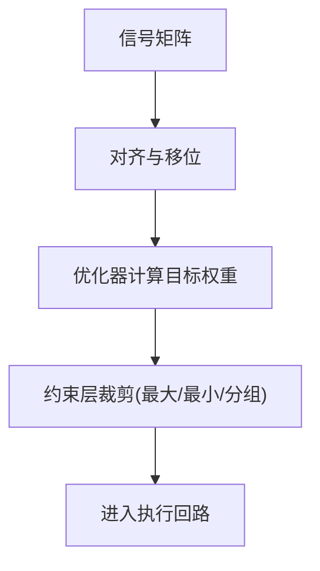
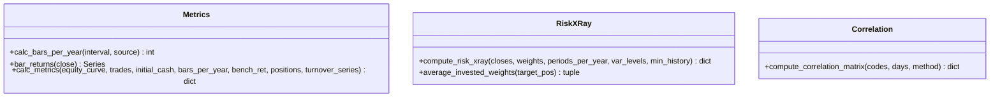
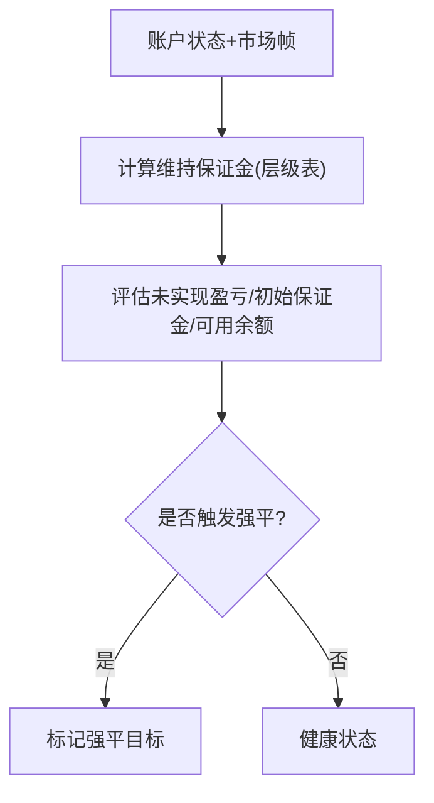
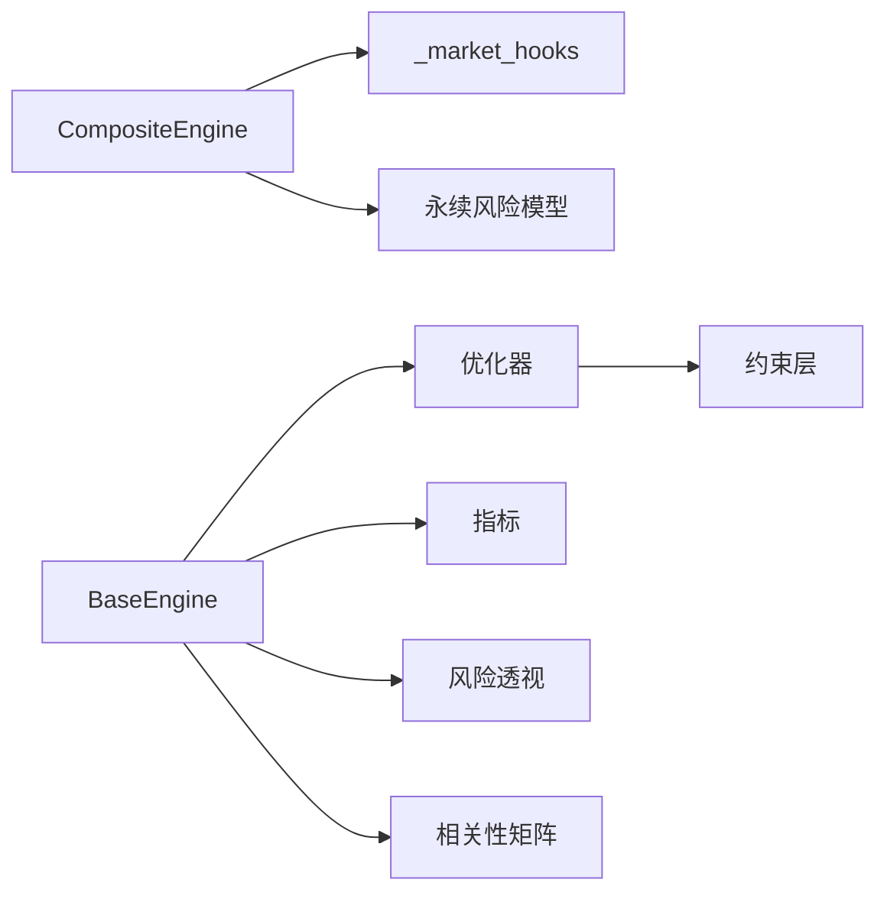

# 复合引擎

<cite>
**本文引用的文件**
- [composite.py](file://agent/backtest/engines/composite.py)
- [base.py](file://agent/backtest/engines/base.py)
- [_market_hooks.py](file://agent/backtest/engines/_market_hooks.py)
- [models.py](file://agent/backtest/models.py)
- [constraints.py](file://agent/backtest/constraints.py)
- [correlation.py](file://agent/backtest/correlation.py)
- [metrics.py](file://agent/backtest/metrics.py)
- [risk_xray.py](file://agent/backtest/risk_xray.py)
- [perpetual_risk.py](file://agent/backtest/perpetual_risk.py)
- [risk_parity.py](file://agent/backtest/optimizers/risk_parity.py)
</cite>

## 目录
1. [简介](#简介)
2. [项目结构](#项目结构)
3. [核心组件](#核心组件)
4. [架构总览](#架构总览)
5. [详细组件分析](#详细组件分析)
6. [依赖关系分析](#依赖关系分析)
7. [性能考量](#性能考量)
8. [故障排查指南](#故障排查指南)
9. [结论](#结论)
10. [附录](#附录)

## 简介
本技术文档聚焦于“复合引擎”在多资产类别组合回测中的架构设计与实现，涵盖跨市场统一协调、数据对齐、权重优化与约束、以及风险度量等关键能力。同时提供配置方式说明（资产类别、权重约束、相关性矩阵）、跨市场套利策略机制（统计套利、基本面套利、事件驱动套利）的实现思路，以及组合风险管理工具（VaR、压力测试、情景分析）的使用方法，并给出多资产策略开发指南与示例路径。

## 项目结构
复合引擎位于回测子系统内，围绕“统一执行循环 + 市场规则分发”的架构组织：
- 基础执行引擎：负责数据加载、信号生成、目标权重预计算、逐根K线执行、指标输出。
- 复合引擎：维护共享资金池与持仓，按标的自动路由到对应市场子引擎处理交易规则（涨跌停、最小变动单位、滑点、手续费、保证金等）。
- 市场钩子：统一的符号识别、货币结算判定、永续合约资金费率与强平、外汇掉期等。
- 优化器与约束：在信号基础上进行权重分配，并施加最大权重、最小权重、分组暴露等约束。
- 风险与指标：收益率、波动率、回撤、VaR/ES、相关性矩阵、风险透视等。



图表来源
- [base.py:652-723](file://agent/backtest/engines/base.py#L652-L723)
- [composite.py:102-147](file://agent/backtest/engines/composite.py#L102-L147)
- [_market_hooks.py:23-80](file://agent/backtest/engines/_market_hooks.py#L23-L80)

章节来源
- [base.py:652-723](file://agent/backtest/engines/base.py#L652-L723)
- [composite.py:102-147](file://agent/backtest/engines/composite.py#L102-L147)

## 核心组件
- 基础执行引擎（BaseEngine）
  - 统一的数据加载、信号生成、目标权重预计算、逐根K线执行、指标计算与输出。
  - 支持外部基准收益接入、实际持仓快照记录、换手率与成交证据追踪。
- 复合引擎（CompositeEngine）
  - 维护共享资金池与全局持仓；根据标的自动识别市场类型并路由至对应子引擎。
  - 强制同币种集合校验，避免不同结算货币混算导致权益曲线无意义。
  - 对加密货币的资金费与强平、外汇掉期进行集中式状态去重与扣减/加回。
- 市场钩子（_market_hooks）
  - 符号到市场的分类、结算货币推断、中国期货识别、加密货币资金费与强平、外汇掉期计算。
- 优化器与约束
  - 动态加载优化器（如风险平价），并在其输出上应用可组合约束（最大权重、最小权重、分组暴露）。
- 风险与指标
  - 收益率、年化、夏普、索提诺、最大回撤、信息比率、跟踪误差、基准Beta等。
  - 风险透视（风险x-ray）提供集中度、波动率、回撤、尾部风险（VaR/ES）、分散化与相关性。
  - 相关性矩阵计算（滚动窗口、Pearson/Spearman）。
- 永续合约风险模型（perpetual_risk）
  - 独立账户状态、维持保证金层级、逐仓/全仓评估、强平目标选择。

章节来源
- [base.py:377-723](file://agent/backtest/engines/base.py#L377-L723)
- [composite.py:102-257](file://agent/backtest/engines/composite.py#L102-L257)
- [_market_hooks.py:23-374](file://agent/backtest/engines/_market_hooks.py#L23-L374)
- [constraints.py:1-206](file://agent/backtest/constraints.py#L1-L206)
- [metrics.py:16-641](file://agent/backtest/metrics.py#L16-L641)
- [risk_xray.py:86-176](file://agent/backtest/risk_xray.py#L86-L176)
- [correlation.py:19-302](file://agent/backtest/correlation.py#L19-L302)
- [perpetual_risk.py:181-418](file://agent/backtest/perpetual_risk.py#L181-L418)

## 架构总览
复合引擎采用“共享状态 + 无状态规则书”的设计：
- 共享状态：资金、持仓、成交记录、权益快照由BaseEngine及其子类持有。
- 无状态规则：各市场子引擎仅实现市场特定规则（涨跌停、最小交易单位、滑点、手续费、保证金、强平逻辑等），不持有持久状态。
- 路由机制：通过符号识别函数将每个标的映射到对应市场子引擎，确保规则正确落地。
- 数据对齐：在不同交易日历下，构建统一日期索引，前向填充限制以避免长停牌影响，信号按各自日历移位后对齐。
- 权重优化：在信号基础上，使用优化器计算目标权重，再经约束层裁剪，保证组合符合风控要求。
- 执行回路：逐根K线执行，调用子引擎的交易可行性判断、价格滑点、手续费、保证金、PnL与仓位调整。

```mermaid
sequenceDiagram
participant Runner as "运行器"
participant Base as "BaseEngine"
participant Comp as "CompositeEngine"
participant Loader as "数据加载器"
participant Signal as "信号引擎"
participant Opt as "优化器"
participant Sub as "市场子引擎"
Runner->>Base : run_backtest(config, loader, signal_engine)
Base->>Loader : fetch(codes, start, end, fields, interval)
Base->>Signal : generate(data_map)
Base->>Opt : optimize(ret, pos, dates)
Opt-->>Base : target_pos (受约束)
loop 每根K线
Base->>Comp : can_execute(symbol, direction, bar)
Comp->>Sub : can_execute(...)
Sub-->>Comp : 允许/拒绝
Comp-->>Base : 允许/拒绝
alt 允许
Base->>Sub : apply_slippage / calc_commission / _calc_margin
Base->>Base : 更新资金/持仓/成交记录
end
Base->>Comp : on_bar(symbol, bar, timestamp)
Comp->>Sub : on_bar(...) (加密资金费/强平; 外汇掉期)
end
Base->>Base : 计算指标与输出
```

图表来源
- [base.py:652-723](file://agent/backtest/engines/base.py#L652-L723)
- [composite.py:129-257](file://agent/backtest/engines/composite.py#L129-L257)
- [_market_hooks.py:223-374](file://agent/backtest/engines/_market_hooks.py#L223-L374)

## 详细组件分析

### 复合引擎（CompositeEngine）
- 职责
  - 维护共享资金池与全局持仓，禁止跨结算货币混合。
  - 根据标的自动识别市场类型，构建并路由到对应子引擎。
  - 统一处理加密货币资金费与强平、外汇掉期，并进行去重。
- 关键流程
  - 运行前校验：若代码集包含多种结算货币，直接报错，防止权益曲线无意义。
  - 执行拦截：A股T+1拦截（当日买入不可卖出），其他规则委托子引擎。
  - 费用与滑点：按活跃标的路由到子引擎计算。
  - PnL与保证金：按标的路由到子引擎计算。
  - 每根K线钩子：加密资金费扣减与强平检查；外汇掉期加回。



图表来源
- [composite.py:68-147](file://agent/backtest/engines/composite.py#L68-L147)
- [composite.py:149-257](file://agent/backtest/engines/composite.py#L149-L257)

章节来源
- [composite.py:68-257](file://agent/backtest/engines/composite.py#L68-L257)

### 基础执行引擎（BaseEngine）
- 职责
  - 统一执行循环：数据加载 → 信号生成 → 目标权重预计算 → 逐根K线执行 → 指标输出。
  - 市场规则接口：可执行性判断、手数取整、手续费、滑点、历史基准价、限价带、估值价等。
  - 指标计算：年化、收益、波动、回撤、夏普、索提诺、信息比率、跟踪误差、基准Beta、换手率等。
- 数据对齐
  - 构建统一日期索引，前向填充限制（跨市场更大限制以容忍长假）。
  - 信号按各自交易日历移位后对齐，避免未来函数。
  - 优化器输入为收益率矩阵与初始位置矩阵，输出为目标权重矩阵。
- 基准与外部数据
  - 支持外部基准收益接入，修正超额收益计算一致性。
  - 可选基本面字段与事件流增强（RSSHub事件）。



图表来源
- [base.py:377-649](file://agent/backtest/engines/base.py#L377-L649)

章节来源
- [base.py:149-249](file://agent/backtest/engines/base.py#L149-L249)
- [base.py:358-385](file://agent/backtest/engines/base.py#L358-L385)
- [base.py:652-723](file://agent/backtest/engines/base.py#L652-L723)

### 市场钩子（_market_hooks）
- 符号识别与市场分类
  - 基于正则表达式匹配A股、美股、港股、印度、韩国、加拿大、加密、期货、外汇等。
- 结算货币推断
  - 按市场或外汇报价货币推断结算货币，用于复合引擎的同币种校验。
- 中国期货识别
  - 支持带交易所后缀与裸产品代码两种形式，避免误路由到全球期货引擎。
- 加密资金费与强平
  - 按小时或日去重计算资金费；基于维持保证金层级判断是否触发强平。
- 外汇掉期
  - 按标准手规模计算掉期，周三三倍掉期。



图表来源
- [_market_hooks.py:23-115](file://agent/backtest/engines/_market_hooks.py#L23-L115)
- [_market_hooks.py:223-374](file://agent/backtest/engines/_market_hooks.py#L223-L374)

章节来源
- [_market_hooks.py:23-115](file://agent/backtest/engines/_market_hooks.py#L23-L115)
- [_market_hooks.py:223-374](file://agent/backtest/engines/_market_hooks.py#L223-L374)

### 优化器与约束
- 优化器
  - 动态加载：从配置读取优化器名称与参数，失败时回退等权。
  - 风险平价：在长期多头单纯形上求解边际风险贡献相等。
- 约束层
  - 最大权重：超过上限的部分按比例再分配到未达上限的标的。
  - 最小权重：低于下限的活跃标的基本身抬升至下限，资金由超上限标的按比例让渡。
  - 分组暴露：对每组标的的合计权重设置上限，超限则按比例缩放。
- 应用顺序
  - 优化器输出 → 约束层按配置顺序依次作用，保留符号方向与零行/零单元。



图表来源
- [base.py:358-385](file://agent/backtest/engines/base.py#L358-L385)
- [risk_parity.py:11-60](file://agent/backtest/optimizers/risk_parity.py#L11-L60)
- [constraints.py:48-167](file://agent/backtest/constraints.py#L48-L167)
- [constraints.py:180-206](file://agent/backtest/constraints.py#L180-L206)

章节来源
- [risk_parity.py:11-60](file://agent/backtest/optimizers/risk_parity.py#L11-L60)
- [constraints.py:1-206](file://agent/backtest/constraints.py#L1-L206)

### 风险与指标
- 指标计算
  - 年化因子：按数据源与周期映射（股票252、加密365、外汇260等）。
  - 收益定义：安全处理非正/非有限前值，避免无穷回报污染累计收益。
  - 交易统计：胜率、盈亏比、最大连亏、平均持仓天数、利润因子。
  - 基准对比：基准收益、超额收益、信息比率、跟踪误差、基准Beta。
- 风险透视（Risk X-Ray）
  - 集中度：HHI、有效N、Top1/Top3权重。
  - 波动率：日度与年化波动率、下行波动率。
  - 回撤：最大回撤及起止时间。
  - 尾部风险：历史模拟VaR与预期短缺（ES）。
  - 分散化：分散化比率、相关性与Beta。
- 相关性矩阵
  - 滚动窗口计算Pearson或Spearman相关系数，支持多市场数据对齐与缺失处理。



图表来源
- [metrics.py:16-641](file://agent/backtest/metrics.py#L16-L641)
- [risk_xray.py:86-176](file://agent/backtest/risk_xray.py#L86-L176)
- [correlation.py:135-319](file://agent/backtest/correlation.py#L135-L319)

章节来源
- [metrics.py:16-641](file://agent/backtest/metrics.py#L16-L641)
- [risk_xray.py:86-176](file://agent/backtest/risk_xray.py#L86-L176)
- [correlation.py:135-319](file://agent/backtest/correlation.py#L135-L319)

### 永续合约风险模型（perpetual_risk）
- 职责
  - 独立账户状态与逐仓/全仓模式下的维持保证金计算与强平评估。
  - 支持维护保证金层级表（名义价值区间与维持保证金率）。
- 关键能力
  - 维持保证金：按名义价值落入相应层级计算。
  - 风险评估：计算未实现盈亏、初始保证金、维持保证金、可用余额。
  - 强平判定：逐仓模式下单个头寸保证金余额低于维持保证金即触发；全仓模式下账户整体余额低于维持保证金或负余额即触发。



图表来源
- [perpetual_risk.py:181-418](file://agent/backtest/perpetual_risk.py#L181-L418)

章节来源
- [perpetual_risk.py:181-418](file://agent/backtest/perpetual_risk.py#L181-L418)

## 依赖关系分析
- 耦合与内聚
  - 复合引擎与基础执行引擎高内聚：共享状态集中在BaseEngine，复合引擎专注路由与跨市场规则协调。
  - 市场钩子作为单一事实来源，被复合引擎与各市场引擎复用，降低重复实现风险。
  - 优化器与约束解耦：优化器负责权重生成，约束层负责合规裁剪，便于扩展新约束。
- 直接/间接依赖
  - 复合引擎依赖市场钩子进行符号识别与货币推断。
  - 基础执行引擎依赖优化器与约束层进行权重分配。
  - 指标与风险模块依赖基础执行引擎输出的权益曲线与成交记录。
- 外部集成点
  - 数据加载器：多市场数据源（股票、加密、外汇、期货）。
  - 基准数据：外部基准收益接入。
  - 事件流：RSSHub事件注入。



图表来源
- [composite.py:102-257](file://agent/backtest/engines/composite.py#L102-L257)
- [base.py:358-385](file://agent/backtest/engines/base.py#L358-L385)
- [metrics.py:16-641](file://agent/backtest/metrics.py#L16-L641)
- [risk_xray.py:86-176](file://agent/backtest/risk_xray.py#L86-L176)
- [correlation.py:135-319](file://agent/backtest/correlation.py#L135-L319)
- [perpetual_risk.py:181-418](file://agent/backtest/perpetual_risk.py#L181-L418)

章节来源
- [composite.py:102-257](file://agent/backtest/engines/composite.py#L102-L257)
- [base.py:358-385](file://agent/backtest/engines/base.py#L358-L385)

## 性能考量
- 数据对齐与填充
  - 使用numpy与pandas向量化操作构建收盘价矩阵与位置矩阵，减少Python循环开销。
  - 跨市场前向填充限制更大，以容忍长假导致的长时间缺失。
- 年化因子映射
  - 针对不同数据源与周期精确映射每日条数，确保年化指标准确。
- 收益计算安全性
  - 对非正或非有限前值进行安全处理，避免无穷回报污染累计收益与指标。
- 优化器与约束
  - 优化器失败时回退等权，保障回测稳定性。
  - 约束层迭代裁剪，控制最大传递次数，避免无限循环。
- 风险计算
  - 风险透视与相关性矩阵采用滚动窗口与向量化计算，提升大规模资产处理能力。

[本节为通用性能指导，无需具体文件引用]

## 故障排查指南
- 混合结算货币错误
  - 现象：复合引擎启动时报错，提示代码集包含多种结算货币。
  - 原因：共享资金池不支持跨币种汇总，会导致权益曲线无意义。
  - 解决：拆分回测或统一输入币种。
- 无可用数据或信号
  - 现象：回测退出并提示无数据或无有效信号。
  - 原因：数据加载失败或信号生成返回空。
  - 解决：检查数据源可用性、时间范围与标的有效性。
- 收益计算异常
  - 现象：出现无穷或NaN收益，指标异常。
  - 原因：前值为非正或非有限。
  - 解决：检查价格序列质量，必要时过滤异常数据。
- 相关性矩阵为空
  - 现象：无法计算相关性矩阵。
  - 原因：至少两个资产且存在重叠交易日。
  - 解决：扩大时间范围或检查数据对齐。
- 永续合约强平
  - 现象：头寸被强平。
  - 原因：保证金余额低于维持保证金。
  - 解决：调整杠杆或止损，检查维持保证金层级。

章节来源
- [composite.py:68-147](file://agent/backtest/engines/composite.py#L68-L147)
- [base.py:678-723](file://agent/backtest/engines/base.py#L678-L723)
- [metrics.py:245-302](file://agent/backtest/metrics.py#L245-L302)
- [correlation.py:216-319](file://agent/backtest/correlation.py#L216-L319)
- [perpetual_risk.py:357-418](file://agent/backtest/perpetual_risk.py#L357-L418)

## 结论
复合引擎通过“共享状态 + 无状态规则书”的架构，实现了跨市场统一协调与高效执行。结合优化器与约束层，能够在多资产类别中实现稳健的权重分配与风险控制。风险与指标模块提供了全面的绩效评估与风险透视能力，支持VaR、ES、相关性分析与分散化度量。对于跨市场套利策略，系统提供了统计套利、基本面套利与事件驱动套利的实现基础与工具链。

[本节为总结性内容，无需具体文件引用]

## 附录

### 配置方式
- 资产类别配置
  - 通过代码列表指定多市场标的，系统自动识别市场类型与结算货币。
  - 支持A股、美股、港股、印度、韩国、加拿大、加密、外汇、期货等。
- 权重约束
  - 最大权重：限制单标的权重上限，超出部分按比例再分配。
  - 最小权重：保证活跃标的最低权重，不足部分由超上限标的让渡。
  - 分组暴露：对行业或主题分组设置合计权重上限。
- 相关性矩阵
  - 通过相关性模块计算滚动窗口内的Pearson或Spearman相关系数，用于资产配置与风险分散。

章节来源
- [_market_hooks.py:23-115](file://agent/backtest/engines/_market_hooks.py#L23-L115)
- [constraints.py:48-167](file://agent/backtest/constraints.py#L48-L167)
- [correlation.py:135-319](file://agent/backtest/correlation.py#L135-L319)

### 跨市场套利策略实现机制
- 统计套利
  - 配对扫描：滚动相关性筛选、协整检验、均值回归特性评估。
  - 动态对冲：卡尔曼滤波滚动Beta、对冲比率漂移监控。
  - 组合管理：多对组合、等风险贡献权重、组合内相关性控制。
- 基本面套利
  - 基本面字段增强：在数据加载阶段注入财务报表字段，辅助信号生成。
  - 事件驱动：RSSHub事件流注入，结合事件评分衰减与回溯窗口。
- 事件驱动套利
  - 事件研究：估计窗口模型、累计异常收益（CAR）与显著性检验。
  - 策略模式：事件前布局、事件后动量、事件反转、并购套利。

章节来源
- [base.py:282-371](file://agent/backtest/engines/base.py#L282-L371)
- [correlation.py:19-115](file://agent/backtest/correlation.py#L19-L115)

### 组合风险管理工具
- VaR与ES
  - 历史模拟法计算VaR与预期短缺，支持多置信水平。
- 压力测试与情景分析
  - 通过风险透视模块评估集中度、波动率、回撤与尾部风险。
  - 结合相关性矩阵进行情景冲击分析。
- 风险平价
  - 在长期多头单纯形上求解边际风险贡献相等，实现风险均衡配置。

章节来源
- [risk_xray.py:86-176](file://agent/backtest/risk_xray.py#L86-L176)
- [risk_parity.py:11-60](file://agent/backtest/optimizers/risk_parity.py#L11-L60)
- [correlation.py:135-319](file://agent/backtest/correlation.py#L135-L319)

### 多资产策略开发指南
- 资产配置
  - 使用优化器与约束层进行权重分配，结合相关性矩阵进行分散化。
- 动态再平衡
  - 基于信号移位与对齐，定期调整目标权重，执行市场规则与费用扣除。
- 风险平价
  - 通过风险平价优化器实现风险均衡配置，降低单一资产风险贡献。

章节来源
- [base.py:149-249](file://agent/backtest/engines/base.py#L149-L249)
- [base.py:358-385](file://agent/backtest/engines/base.py#L358-L385)
- [risk_parity.py:11-60](file://agent/backtest/optimizers/risk_parity.py#L11-L60)

### 实际多资产组合策略示例与绩效归因
- 示例路径
  - 统计套利桌面预设：pair_scanner与arb_strategist协作，完成配对扫描与策略设计。
  - 事件驱动任务组：event_study与strategy_builder协作，完成事件影响研究与策略构建。
- 绩效归因
  - 通过指标模块计算收益、波动、回撤、夏普、索提诺、信息比率、跟踪误差、基准Beta。
  - 通过成交记录与换手率系列进行归因分析。

章节来源
- [metrics.py:16-641](file://agent/backtest/metrics.py#L16-L641)