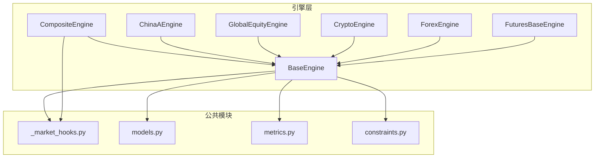
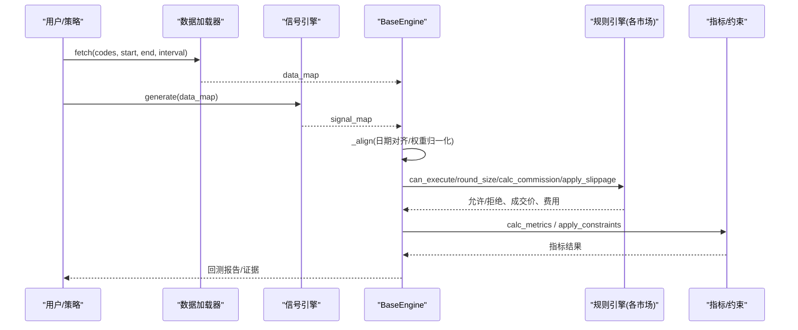
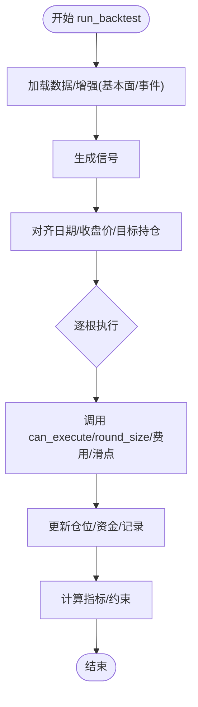
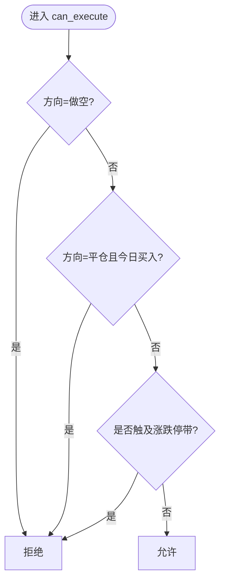
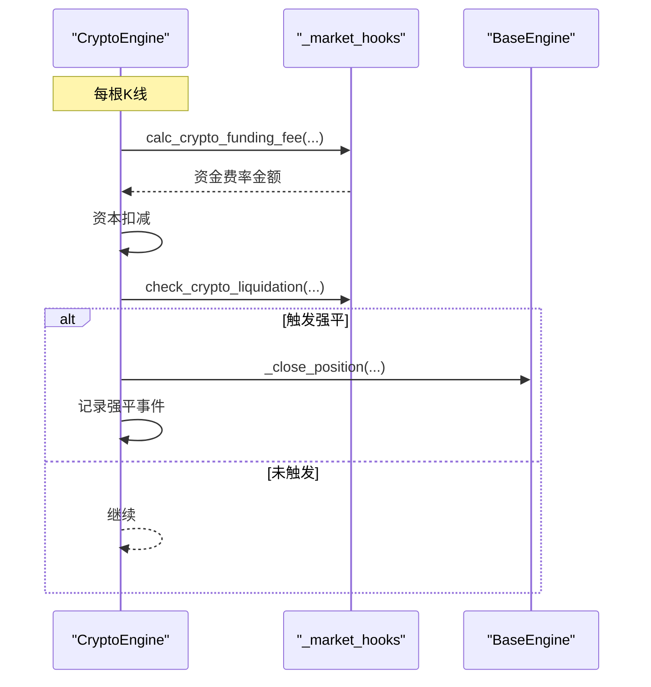
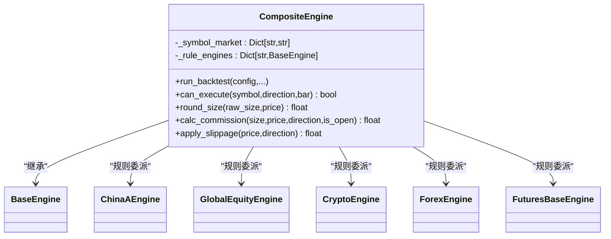
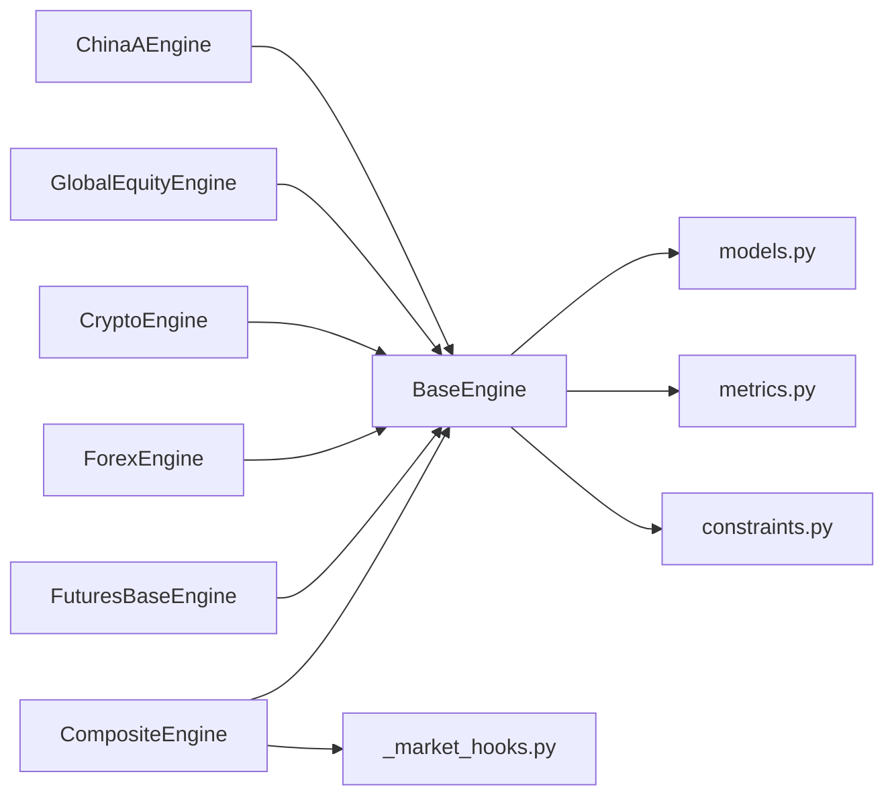

# 市场引擎

<cite>
**本文引用的文件**
- [base.py](file://agent/backtest/engines/base.py)
- [china_a.py](file://agent/backtest/engines/china_a.py)
- [crypto.py](file://agent/backtest/engines/crypto.py)
- [global_equity.py](file://agent/backtest/engines/global_equity.py)
- [composite.py](file://agent/backtest/engines/composite.py)
- [futures_base.py](file://agent/backtest/engines/futures_base.py)
- [_market_hooks.py](file://agent/backtest/engines/_market_hooks.py)
- [models.py](file://agent/backtest/models.py)
- [metrics.py](file://agent/backtest/metrics.py)
- [constraints.py](file://agent/backtest/constraints.py)
</cite>

## 目录
1. [简介](#简介)
2. [项目结构](#项目结构)
3. [核心组件](#核心组件)
4. [架构总览](#架构总览)
5. [详细组件分析](#详细组件分析)
6. [依赖关系分析](#依赖关系分析)
7. [性能考量](#性能考量)
8. [故障排查指南](#故障排查指南)
9. [结论](#结论)
10. [附录：扩展与使用示例](#附录：扩展与使用示例)

## 简介
本技术文档围绕“市场引擎”子系统，系统化阐述多市场回测架构与实现。内容涵盖：
- 基础引擎接口与通用执行循环
- 各市场特定规则（A股涨跌停、T+1；美股零佣金与碎股；加密货币永续合约资金费率与强平；外汇掉期等）
- 交易成本模型（佣金、印花税、过户费、滑点、冲击成本近似）
- 订单执行模拟（限价/市价/止损在回测中的等价实现方式）
- 跨市场组合引擎（共享资金池、统一指标计算）
- 扩展指南（接入新市场、定制规则、性能优化）
- 实际使用示例（单一市场策略到跨市场套利策略）

## 项目结构
市场引擎位于 backtest/engines 目录下，采用“抽象基类 + 市场专用子类 + 组合引擎”的分层设计：
- BaseEngine：定义统一的回测生命周期、信号对齐、逐根K线执行、费用与滑点钩子、PnL/保证金计算、指标输出等
- 市场引擎：ChinaAEngine、GlobalEquityEngine、CryptoEngine、ForexEngine、FuturesBaseEngine 等，分别实现各自市场的成交规则、费用、滑点、涨跌停/强平/掉期等
- CompositeEngine：跨市场组合引擎，按代码自动路由到对应子引擎，维护共享资金池与全局状态
- _market_hooks.py：符号分类、货币判定、资金费率、强平检查、外汇掉期等公共逻辑
- models.py：Position/FillRecord/TradeRecord/EquitySnapshot 等不可变数据模型
- metrics.py：年化因子、收益率、换手率、指标汇总
- constraints.py：权重约束（单票上限/下限、分组暴露度），作用于优化器输出

图表来源
- [base.py:377-800](file://agent/backtest/engines/base.py#L377-L800)
- [composite.py:102-257](file://agent/backtest/engines/composite.py#L102-L257)
- [_market_hooks.py:1-374](file://agent/backtest/engines/_market_hooks.py#L1-L374)
- [models.py:1-118](file://agent/backtest/models.py#L1-L118)
- [metrics.py:1-200](file://agent/backtest/metrics.py#L1-L200)
- [constraints.py:1-200](file://agent/backtest/constraints.py#L1-L200)

章节来源
- [base.py:377-800](file://agent/backtest/engines/base.py#L377-L800)
- [composite.py:102-257](file://agent/backtest/engines/composite.py#L102-L257)

## 核心组件
- BaseEngine：提供 run_backtest() 主流程（数据加载→信号生成→权重对齐→逐根执行→指标输出），并定义 can_execute/round_size/calc_commission/apply_slippage/on_bar 等市场规则钩子
- 市场引擎：
  - ChinaAEngine：A股 T+1、禁止融券做空、涨跌停限制、最小整手、佣金/印花税/过户费、小滑点
  - GlobalEquityEngine：美股/港股/加拿大，支持碎股、不同税费与滑点、加拿大盘口步进
  - CryptoEngine：24小时交易、Maker/Taker 费率、资金费率结算、维持保证金强平、严格模式下的风险快照与事件记录
  - ForexEngine：外汇掉期（swap）与标准手数
  - FuturesBaseEngine：带乘数的 PnL/保证金/头寸换算
- CompositeEngine：按代码识别市场类型，构建子引擎映射，统一调度规则方法，维护共享资金池与全局去重（如资金费率、掉期）
- 公共工具：_market_hooks.py 提供符号分类、币种判定、资金费率、强平检查、外汇掉期等
- 数据模型：models.py 的 Position/FillRecord/TradeRecord/EquitySnapshot 贯穿全链路
- 指标与约束：metrics.py 负责年化与指标汇总；constraints.py 对优化器输出施加权重约束

章节来源
- [base.py:377-800](file://agent/backtest/engines/base.py#L377-L800)
- [china_a.py:20-193](file://agent/backtest/engines/china_a.py#L20-L193)
- [global_equity.py:33-124](file://agent/backtest/engines/global_equity.py#L33-L124)
- [crypto.py:41-615](file://agent/backtest/engines/crypto.py#L41-L615)
- [futures_base.py:19-57](file://agent/backtest/engines/futures_base.py#L19-L57)
- [_market_hooks.py:1-374](file://agent/backtest/engines/_market_hooks.py#L1-L374)
- [models.py:1-118](file://agent/backtest/models.py#L1-L118)
- [metrics.py:1-200](file://agent/backtest/metrics.py#L1-L200)
- [constraints.py:1-200](file://agent/backtest/constraints.py#L1-L200)

## 架构总览
下图展示从配置到执行的完整流程，以及各引擎的职责边界与交互点。

图表来源
- [base.py:652-800](file://agent/backtest/engines/base.py#L652-L800)
- [composite.py:129-147](file://agent/backtest/engines/composite.py#L129-L147)
- [metrics.py:153-170](file://agent/backtest/metrics.py#L153-L170)
- [constraints.py:170-200](file://agent/backtest/constraints.py#L170-L200)

## 详细组件分析

### 基础引擎 BaseEngine
- 职责
  - 统一回测管线：数据加载→信号生成→权重对齐→逐根执行→指标输出
  - 市场规则钩子：can_execute、round_size、calc_commission、apply_slippage、on_bar
  - 价格基准与涨跌停带：historical_base_price、limit_band、prospective_fill_price
  - PnL/保证金/头寸换算：_calc_pnl、_calc_margin、_calc_raw_size、_leverage_for_symbol
- 关键流程
  - run_backtest：校验输入、加载数据、可选基本面/事件增强、信号对齐、执行、指标、写产物
  - _align：构建统一日期索引、收盘价矩阵、目标持仓矩阵、收益率矩阵，并进行归一化
- 防前视与合规
  - 涨跌停带基于历史基准价（pre_close/前日收盘/pct_chg推导），比较的是“预期成交价”而非当日收盘，避免前视偏差

图表来源
- [base.py:652-800](file://agent/backtest/engines/base.py#L652-L800)
- [base.py:149-249](file://agent/backtest/engines/base.py#L149-L249)
- [base.py:623-711](file://agent/backtest/engines/base.py#L623-L711)

章节来源
- [base.py:377-800](file://agent/backtest/engines/base.py#L377-L800)
- [base.py:149-249](file://agent/backtest/engines/base.py#L149-L249)
- [base.py:623-711](file://agent/backtest/engines/base.py#L623-L711)

### A股市场引擎 ChinaAEngine
- 规则要点
  - T+1：当日买入不可当日卖出
  - 禁止融券做空
  - 涨跌停：主板±10%，创业板/科创板±20%，ST±5%（启发式）
  - 最小交易单位：100股整数倍
  - 费用：佣金（最低¥5）、印花税（卖出）、过户费（双边）
  - 滑点：较小
- 执行逻辑
  - can_execute：先判断方向与T+1，再根据涨跌停带拦截
  - round_size：向下取整至100股
  - calc_commission：佣金+过户费+印花税（卖出）
  - apply_slippage：相对滑点
  - 涨跌停带：通过 BaseEngine.limit_band 与 prospective_fill_price 比较

图表来源
- [china_a.py:40-68](file://agent/backtest/engines/china_a.py#L40-L68)
- [china_a.py:98-154](file://agent/backtest/engines/china_a.py#L98-L154)

章节来源
- [china_a.py:20-193](file://agent/backtest/engines/china_a.py#L20-L193)

### 全球权益引擎 GlobalEquityEngine（美股/港股/加拿大）
- 规则要点
  - 美股：T+0、可多空、碎股、低滑点、零佣金
  - 港股：T+0、可多空、印花税与附加费、整手近似处理、较高滑点
  - 加拿大：整手为主，盘口步进（$0.005/$0.01）
- 执行逻辑
  - can_execute：同日内双向交易均允许
  - round_size：按市场区分（碎股/整手/整手）
  - calc_commission：美股0，港股复合费用，加拿大按配置
  - apply_slippage：按市场选择滑点，加拿大额外应用盘口步进

章节来源
- [global_equity.py:33-124](file://agent/backtest/engines/global_equity.py#L33-L124)

### 加密货币引擎 CryptoEngine（永续合约）
- 规则要点
  - 24/7交易、可多空、Maker/Taker 费率分离
  - 资金费率：每8小时结算（固定或数据驱动）
  - 强平：维持保证金比率阈值触发
  - 严格模式：隔离/全仓、风险快照、事件审计
- 执行逻辑
  - can_execute：默认放行，严格模式下可能屏蔽已强平标的
  - round_size：支持小数位精度
  - calc_commission：开仓通常Taker，平仓Maker（严格模式）
  - apply_slippage：严格模式下rebalance路径无滑点
  - on_bar：资金费率扣减与强平检查
  - before/after_rebalance_bar：严格模式下预/后评估强平
  - 事件与证据：记录资金结算、强平、市场成交等

图表来源
- [crypto.py:601-615](file://agent/backtest/engines/crypto.py#L601-L615)
- [_market_hooks.py:223-307](file://agent/backtest/engines/_market_hooks.py#L223-L307)

章节来源
- [crypto.py:41-615](file://agent/backtest/engines/crypto.py#L41-L615)
- [_market_hooks.py:223-307](file://agent/backtest/engines/_market_hooks.py#L223-L307)

### 期货基础引擎 FuturesBaseEngine
- 职责：在 BaseEngine 基础上引入合约乘数，影响 PnL、保证金与头寸换算
- 覆盖方法：_calc_pnl、_calc_margin、_calc_raw_size 均乘以乘数

章节来源
- [futures_base.py:19-57](file://agent/backtest/engines/futures_base.py#L19-L57)

### 组合引擎 CompositeEngine（跨市场）
- 职责：共享资金池、统一指标；按代码识别市场类型，动态构建子引擎；将规则方法委派给对应子引擎
- 关键点
  - 币种一致性校验：拒绝混合结算货币的组合（避免错误加总净值曲线）
  - 规则委派：can_execute/round_size/calc_commission/apply_slippage 等按标的路由
  - 状态集中：资金、仓位、交易记录集中在 CompositeEngine
  - 特殊处理：A股T+1在组合层拦截（因子引擎无共享仓位视图）

图表来源
- [composite.py:26-65](file://agent/backtest/engines/composite.py#L26-L65)
- [composite.py:102-257](file://agent/backtest/engines/composite.py#L102-L257)

章节来源
- [composite.py:26-65](file://agent/backtest/engines/composite.py#L26-L65)
- [composite.py:102-257](file://agent/backtest/engines/composite.py#L102-L257)

### 公共工具与市场钩子 _market_hooks.py
- 符号分类：根据后缀/格式识别 A股、美股、港股、印度、韩国、加拿大、加密、期货、外汇等
- 币种判定：code_currency 返回结算币种，用于组合引擎的币种一致性检查
- 资金费率：calc_crypto_funding_fee 支持历史费率与固定费率回退，含去重
- 强平检查：check_crypto_liquidation 基于维持保证金比率
- 外汇掉期：calc_forex_swap 按多头/空头表与周三三倍掉期

章节来源
- [_market_hooks.py:1-374](file://agent/backtest/engines/_market_hooks.py#L1-L374)

### 数据模型 models.py
- Position：持仓信息（方向、入场价、时间、规模、杠杆、费用）
- FillRecord：单笔成交证据（数量、名义价值、成交价、费用、保证金）
- TradeRecord：完整交易闭环（盈亏、持有周期、费用、保证金）
- EquitySnapshot：账户快照（现金、浮盈、净值、持仓数）

章节来源
- [models.py:1-118](file://agent/backtest/models.py#L1-L118)

### 指标与约束 metrics.py / constraints.py
- 年化：calc_bars_per_year 按数据源与周期计算年频
- 收益率：bar_returns 安全处理零/负价格导致的异常百分比收益
- 约束：max_weight/min_weight/group_exposure 对优化器输出进行权重裁剪与再分配

章节来源
- [metrics.py:153-170](file://agent/backtest/metrics.py#L153-L170)
- [metrics.py:245-267](file://agent/backtest/metrics.py#L245-L267)
- [constraints.py:48-130](file://agent/backtest/constraints.py#L48-L130)
- [constraints.py:170-200](file://agent/backtest/constraints.py#L170-L200)

## 依赖关系分析
- 耦合与内聚
  - BaseEngine 高内聚地封装了回测主循环与通用逻辑，市场引擎仅关注规则差异，内聚良好
  - CompositeEngine 作为编排者，降低上层对具体市场实现的感知
- 直接/间接依赖
  - 所有引擎依赖 models.py 的数据结构
  - 指标与约束被 BaseEngine 在运行后期使用
  - 公共钩子在多个引擎中复用，减少重复
- 外部依赖
  - 数据加载器（由外部传入）
  - 信号引擎（由外部传入）
- 潜在循环依赖
  - 当前结构未见循环导入；引擎之间通过组合引擎解耦

图表来源
- [base.py:377-800](file://agent/backtest/engines/base.py#L377-L800)
- [composite.py:102-257](file://agent/backtest/engines/composite.py#L102-L257)
- [_market_hooks.py:1-374](file://agent/backtest/engines/_market_hooks.py#L1-L374)

## 性能考量
- 向量化对齐：_align 使用 numpy/pandas 向量化构建日期索引、收盘价矩阵与目标持仓矩阵，提升大规模标的的回测速度
- 前向填充限制：ffill_limit 控制长停牌/跨市场对齐时的填充长度，避免失真
- 年化因子：按数据源与周期精确计算 bars_per_year，保证波动率/Sharpe等指标可比
- 严格模式开销：CryptoEngine 严格模式在每个 rebalance 前后进行风险评估与快照，带来额外计算，但换来更真实的强平与资金费率行为
- 组合引擎路由：按代码识别市场类型并缓存子引擎，减少重复构造

[本节为通用指导，不直接分析具体文件]

## 故障排查指南
- 常见错误与定位
  - 无数据/无信号：run_backtest 会打印 JSON 错误并退出，检查 loader.fetch 与 signal_engine.generate 返回值
  - 混合货币组合：CompositeEngine 会拒绝跨结算货币的代码集，需拆分运行或统一到同一币种
  - 强平与资金费率：CryptoEngine 严格模式下若出现账户强平，查看事件日志与终端状态
  - 年化不一致：确认 interval 与 source 匹配，避免错误的年化因子导致指标失真
- 建议步骤
  - 缩小标的范围，逐步验证数据与信号
  - 开启严格模式并检查 perpetual 事件与快照
  - 检查涨跌停带与滑点设置是否符合市场预期
  - 使用约束层限制暴露度，避免极端权重

章节来源
- [base.py:902-939](file://agent/backtest/engines/base.py#L902-L939)
- [composite.py:85-116](file://agent/backtest/engines/composite.py#L85-L116)
- [crypto.py:299-350](file://agent/backtest/engines/crypto.py#L299-L350)
- [metrics.py:153-170](file://agent/backtest/metrics.py#L153-L170)

## 结论
该市场引擎系统以 BaseEngine 为核心，结合各市场专用引擎与组合引擎，实现了多市场回测的统一框架。其优势在于：
- 清晰的职责划分与可扩展性：新增市场只需实现规则钩子
- 严格的合规与防前视：涨跌停带基于历史基准价，避免未来信息泄露
- 丰富的市场特性支持：A股T+1与涨跌停、美股碎股与零佣金、加密永续合约资金费率与强平、外汇掉期等
- 完善的证据与指标：FillRecord/TradeRecord/EquitySnapshot 与指标/约束层保障可审计性与稳健性

[本节为总结，不直接分析具体文件]

## 附录：扩展与使用示例

### 扩展指南：接入新市场
- 步骤
  - 新建市场引擎类，继承 BaseEngine（或 FuturesBaseEngine 若涉及乘数）
  - 实现 can_execute、round_size、calc_commission、apply_slippage、on_bar（如需）
  - 在 CompositeEngine._build_rule_engines 中添加路由分支
  - 在 _market_hooks.py 补充符号分类与币种映射（如需要）
- 注意事项
  - 确保涨跌停/强平/掉期等规则符合交易所实际
  - 费用与滑点需贴近真实成本，避免虚高收益
  - 若涉及跨币种，需在组合层考虑汇率转换或拆分运行

章节来源
- [base.py:570-621](file://agent/backtest/engines/base.py#L570-L621)
- [composite.py:26-65](file://agent/backtest/engines/composite.py#L26-L65)
- [_market_hooks.py:135-150](file://agent/backtest/engines/_market_hooks.py#L135-L150)

### 交易成本模型
- 佣金：各市场自定义（A股万2.5最低¥5；美股0；加密Maker/Taker；港股复合费用）
- 滑点：相对比例或盘口步进（加拿大盘口步进）
- 冲击成本：可通过滑点放大或自定义 apply_slippage 近似
- 其他费用：印花税（A股卖出）、过户费（A股双边）、外汇掉期（按日/周）

章节来源
- [china_a.py:57-75](file://agent/backtest/engines/china_a.py#L57-L75)
- [global_equity.py:83-124](file://agent/backtest/engines/global_equity.py#L83-L124)
- [crypto.py:119-132](file://agent/backtest/engines/crypto.py#L119-L132)
- [_market_hooks.py:532-573](file://agent/backtest/engines/_market_hooks.py#L532-L573)

### 订单执行模拟
- 限价单：通过 limit_band 与 prospective_fill_price 判断是否成交，避免超出涨跌停带
- 市价单：以 execution_open 或 mark_open（严格模式）作为成交价，叠加滑点
- 止损单：可在 can_execute 中根据止损条件拦截或提前平仓，或在 on_bar 中触发
- 注意：回测中“止损/限价”本质是规则判断，非真实挂单队列

章节来源
- [base.py:672-711](file://agent/backtest/engines/base.py#L672-L711)
- [crypto.py:134-142](file://agent/backtest/engines/crypto.py#L134-L142)

### 实际使用示例
- 单一市场策略（A股）
  - 配置 codes 为 A股代码，选择 ChinaAEngine
  - 设置 commission_rate、stamp_tax、transfer_fee、slippage
  - 运行回测，观察涨跌停与T+1对成交的影响
- 跨市场套利策略（加密+外汇）
  - 使用 CompositeEngine，codes 包含加密与外汇代码
  - 确保结算币种一致（组合层会拒绝混合币种）
  - 设置加密资金费率与外汇掉期参数，观察资金结算与掉期对净值的影响

章节来源
- [china_a.py:20-92](file://agent/backtest/engines/china_a.py#L20-L92)
- [composite.py:102-257](file://agent/backtest/engines/composite.py#L102-L257)
- [_market_hooks.py:223-307](file://agent/backtest/engines/_market_hooks.py#L223-L307)