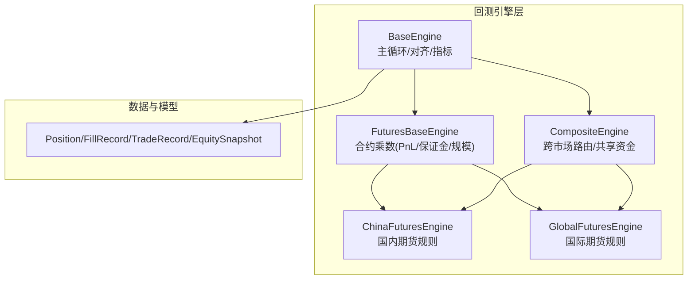
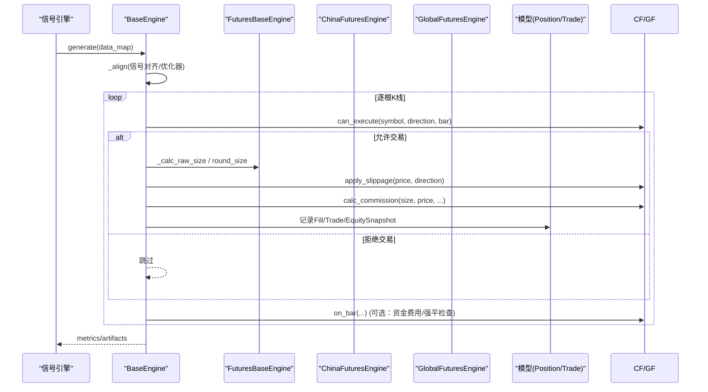
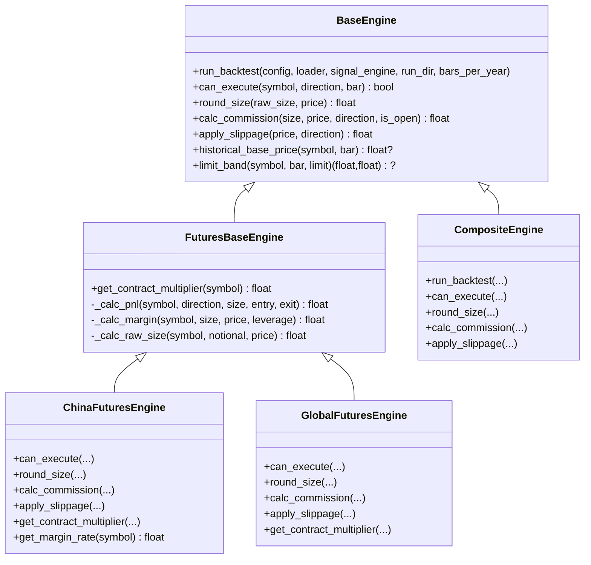

# 期货基础引擎

<cite>
**本文引用的文件**
- [futures_base.py](file://agent/backtest/engines/futures_base.py)
- [china_futures.py](file://agent/backtest/engines/china_futures.py)
- [global_futures.py](file://agent/backtest/engines/global_futures.py)
- [base.py](file://agent/backtest/engines/base.py)
- [composite.py](file://agent/backtest/engines/composite.py)
- [models.py](file://agent/backtest/models.py)
- [perpetual_risk.py](file://agent/backtest/perpetual_risk.py)
</cite>

## 目录
1. [简介](#简介)
2. [项目结构](#项目结构)
3. [核心组件](#核心组件)
4. [架构总览](#架构总览)
5. [详细组件分析](#详细组件分析)
6. [依赖关系分析](#依赖关系分析)
7. [性能与实现要点](#性能与实现要点)
8. [故障排查指南](#故障排查指南)
9. [结论](#结论)
10. [附录：策略与风控实践](#附录：策略与风控实践)

## 简介
本技术文档围绕仓库中的“期货基础引擎”展开，系统阐述期货交易的核心机制在回测系统中的实现方式，包括合约乘数、保证金制度、价格涨跌停限制、滑点与手续费、每日无负债结算（以基准价与结算价为基础的价格带）、以及强制平仓等。同时，文档给出期货特有的价格计算与风险管理流程，并基于现有代码提供可落地的策略开发建议与参数调优方向。

## 项目结构
期货相关能力集中在 backtest.engines 子包中，采用分层抽象：
- 通用回测基类 BaseEngine：负责数据加载、信号对齐、逐根K线执行、指标统计等主循环。
- 期货基类 FuturesBaseEngine：在通用基类之上注入合约乘数对盈亏、保证金、头寸规模的影响。
- 市场特定引擎：
  - ChinaFuturesEngine：覆盖国内四大商品及金融期货交易所规则（T+0、涨跌停、按产品的手续费与保证金）。
  - GlobalFuturesEngine：覆盖CME/ICE/Eurex等国际市场（近似24小时交易、指数品种涨跌停、按合约固定手续费）。
- 组合引擎 CompositeEngine：跨市场统一资金池，按标的自动路由到对应子引擎处理规则。

图表来源
- [base.py:377-800](file://agent/backtest/engines/base.py#L377-L800)
- [futures_base.py:19-57](file://agent/backtest/engines/futures_base.py#L19-L57)
- [china_futures.py:131-251](file://agent/backtest/engines/china_futures.py#L131-L251)
- [global_futures.py:176-264](file://agent/backtest/engines/global_futures.py#L176-L264)
- [composite.py:102-257](file://agent/backtest/engines/composite.py#L102-L257)
- [models.py:13-118](file://agent/backtest/models.py#L13-L118)

章节来源
- [base.py:377-800](file://agent/backtest/engines/base.py#L377-L800)
- [futures_base.py:19-57](file://agent/backtest/engines/futures_base.py#L19-L57)
- [china_futures.py:131-251](file://agent/backtest/engines/china_futures.py#L131-L251)
- [global_futures.py:176-264](file://agent/backtest/engines/global_futures.py#L176-L264)
- [composite.py:102-257](file://agent/backtest/engines/composite.py#L102-L257)
- [models.py:13-118](file://agent/backtest/models.py#L13-L118)

## 核心组件
- 合约乘数（Contract Multiplier）：将“点数变动”转换为“货币盈亏”，影响PnL、保证金占用与目标名义价值换算。
- 保证金与杠杆：通过“初始保证金率”或“每合约保证金”决定杠杆倍数；不同市场/产品差异显著。
- 价格涨跌停：基于前一结算价（期货）或前收市价（股票）的百分比限制，执行前拦截越界订单。
- 滑点与手续费：模拟真实成交成本，影响净收益与换手率。
- 逐日估值与结算：以历史基准价计算当日价格带，保证不出现未来函数。
- 强制平仓：当账户权益低于维持保证金时触发强平逻辑（在永续/加密货币路径中尤为明确）。

章节来源
- [futures_base.py:19-57](file://agent/backtest/engines/futures_base.py#L19-L57)
- [china_futures.py:29-115](file://agent/backtest/engines/china_futures.py#L29-L115)
- [global_futures.py:23-92](file://agent/backtest/engines/global_futures.py#L23-L92)
- [base.py:623-711](file://agent/backtest/engines/base.py#L623-L711)
- [perpetual_risk.py:181-191](file://agent/backtest/perpetual_risk.py#L181-L191)

## 架构总览
下图展示从信号生成到逐根K线执行的完整流程，以及期货引擎如何参与价格限制、滑点、手续费与保证金计算。

图表来源
- [base.py:652-800](file://agent/backtest/engines/base.py#L652-L800)
- [china_futures.py:161-228](file://agent/backtest/engines/china_futures.py#L161-L228)
- [global_futures.py:196-259](file://agent/backtest/engines/global_futures.py#L196-L259)
- [models.py:13-118](file://agent/backtest/models.py#L13-L118)

## 详细组件分析

### 中国期货市场引擎（ChinaFuturesEngine）
- 规则要点
  - T+0：允许日内开平仓。
  - 涨跌停：按产品设置涨跌幅比例，执行前校验。
  - 手续费：按产品区分“按名义价值比例”或“按手固定”。
  - 保证金：按产品设置最低保证金率，用于推导杠杆。
  - 合约乘数：按产品映射（如IF=300、rb=10、au=1000等）。
- 关键方法
  - can_execute：结合涨跌停限制判断是否允许下单。
  - round_size：最小1手，整数手数。
  - calc_commission/calc_commission_for_symbol：按产品费率或固定值计算。
  - apply_slippage：线性滑点模型。
  - get_contract_multiplier/get_margin_rate：查询乘数与保证金率。
- 设计要点
  - 使用前一结算价作为涨跌停基准价，避免未来函数。
  - 支持全局覆盖保证金率与手续费，便于统一实验。

章节来源
- [china_futures.py:29-115](file://agent/backtest/engines/china_futures.py#L29-L115)
- [china_futures.py:131-251](file://agent/backtest/engines/china_futures.py#L131-L251)

### 全球期货市场引擎（GlobalFuturesEngine）
- 规则要点
  - 近似24小时交易（CME Globex），指数品种有动态涨跌停（简化为固定比例）。
  - 合约乘数：按产品定义（ES=50、CL=1000、GC=100等）。
  - 手续费：按合约固定美元费用。
  - 保证金：以“每合约保证金”参考表为主（当前未直接消耗，但可用于扩展强平检查）。
- 关键方法
  - can_execute：仅对部分指数品种做涨跌停限制。
  - round_size：整数合约，最小1。
  - calc_commission/calc_commission_for_symbol：按合约固定费用。
  - apply_slippage：线性滑点。
  - get_contract_multiplier：查询乘数。

章节来源
- [global_futures.py:23-92](file://agent/backtest/engines/global_futures.py#L23-L92)
- [global_futures.py:176-264](file://agent/backtest/engines/global_futures.py#L176-L264)

### 期货基类（FuturesBaseEngine）
- 作用：在通用基类上注入合约乘数对以下环节的影响：
  - PnL：direction × size × multiplier × (exit - entry)
  - 保证金：size × price × multiplier / leverage
  - 头寸规模：target_notional / (price × multiplier)
- 抽象接口：get_contract_multiplier(symbol) 由子类实现。

章节来源
- [futures_base.py:19-57](file://agent/backtest/engines/futures_base.py#L19-L57)

### 组合引擎（CompositeEngine）
- 作用：统一管理多市场共享资金池，按标的自动路由到对应子引擎（A股、美股、外汇、加密、国内期货、国际期货）。
- 特性：
  - 禁止混合结算货币的回测（避免不同币种加总导致指标失真）。
  - 对每个市场类型维护独立的规则引擎实例，状态（资金、持仓、交易）集中在组合引擎。
  - 对加密资产提供资金费率与强平钩子；对外汇提供隔夜利息。

章节来源
- [composite.py:26-65](file://agent/backtest/engines/composite.py#L26-L65)
- [composite.py:102-257](file://agent/backtest/engines/composite.py#L102-L257)

### 通用回测基类（BaseEngine）
- 主循环：run_backtest 完成数据加载、信号对齐、优化器权重、逐根K线执行、指标计算与输出。
- 价格限制：
  - historical_base_price：优先使用前结算价（期货），否则前收盘价或派生前收价，确保无未来函数。
  - limit_band：根据基准价与涨跌幅比例计算合法价格区间。
  - prospective_fill_price：考虑滑点的预期成交价，用于执行前校验。
- 盈亏与保证金：
  - _calc_pnl/_calc_margin/_calc_raw_size：默认按现货逻辑，期货基类重写以引入合约乘数。
  - _leverage_for_symbol：默认使用全局杠杆，子类可按产品覆盖。

章节来源
- [base.py:473-648](file://agent/backtest/engines/base.py#L473-L648)
- [base.py:652-800](file://agent/backtest/engines/base.py#L652-L800)

### 风险与强平（永续/加密路径）
- 维护保证金阶梯：按名义价值分档，计算维持保证金。
- 账户状态：包含钱包余额、持仓、保证金模式等。
- 强平判定：当可用余额不足以覆盖维持保证金时触发强平。

章节来源
- [perpetual_risk.py:181-191](file://agent/backtest/perpetual_risk.py#L181-L191)
- [perpetual_risk.py:194-200](file://agent/backtest/perpetual_risk.py#L194-L200)

## 依赖关系分析
- 继承关系
  - FuturesBaseEngine 继承 BaseEngine，并重写盈亏/保证金/规模计算。
  - ChinaFuturesEngine 与 GlobalFuturesEngine 继承 FuturesBaseEngine，实现各自市场规则。
  - CompositeEngine 继承 BaseEngine，内部聚合多个子引擎并按标的路由。
- 数据模型
  - Position/FillRecord/TradeRecord/EquitySnapshot 贯穿整个回测生命周期，记录持仓、成交、交易与权益快照。

图表来源
- [base.py:377-648](file://agent/backtest/engines/base.py#L377-L648)
- [futures_base.py:19-57](file://agent/backtest/engines/futures_base.py#L19-L57)
- [china_futures.py:131-251](file://agent/backtest/engines/china_futures.py#L131-L251)
- [global_futures.py:176-264](file://agent/backtest/engines/global_futures.py#L176-L264)
- [composite.py:102-257](file://agent/backtest/engines/composite.py#L102-L257)

## 性能与实现要点
- 信号对齐与矩阵运算：使用numpy/pandas向量化对齐日期索引、填充缺失值，减少循环开销。
- 价格限制无未来函数：严格基于历史基准价（优先pre_settle）计算涨跌停区间，避免使用当期close。
- 滑点与手续费：线性滑点与按产品/合约的费用模型，兼顾效率与真实性。
- 合约乘数统一：通过FuturesBaseEngine集中处理乘数对PnL、保证金、规模的影响，降低重复实现。
- 跨市场路由：CompositeEngine按市场类型分发规则，保持单一资金池的一致性。

[本节为通用指导，不直接分析具体文件]

## 故障排查指南
- 无法成交/被拒单
  - 检查涨跌停限制：确认基准价字段存在且为正，limit_band计算正确。
  - 检查滑点：prospective_fill_price是否超出价格带。
- 盈亏异常
  - 核对合约乘数是否正确映射。
  - 核对手续费与滑点配置是否符合产品实际。
- 强平/爆仓
  - 检查维持保证金计算与可用余额是否满足要求。
  - 对于加密/永续路径，关注资金费率与阶梯维持保证金。
- 指标不一致
  - 检查外部基准收益率修正后，超额收益是否同步重算。

章节来源
- [base.py:623-711](file://agent/backtest/engines/base.py#L623-L711)
- [perpetual_risk.py:181-191](file://agent/backtest/perpetual_risk.py#L181-L191)

## 结论
该回测框架通过清晰的层次化设计与严格的无未来函数约束，提供了贴近实际的期货回测能力。合约乘数、保证金、涨跌停、滑点与手续费均按市场规则建模，支持国内与国际期货市场，并通过组合引擎实现跨市场统一资金管理。在此基础上，可便捷地接入各类策略并进行稳健性评估。

[本节为总结性内容，不直接分析具体文件]

## 附录：策略与风控实践

### 期货核心概念与计算
- 合约乘数：将“点数变动”转化为“货币盈亏”，直接影响盈亏、保证金与头寸规模。
- 保证金制度：以“初始保证金率”或“每合约保证金”确定杠杆；不同产品差异大。
- 每日无负债结算：以“前一结算价”为基准计算当日价格带与盈亏，确保公平与风险控制。
- 交割机制：回测通常假设连续主力合约数据，不显式建模交割过程。

章节来源
- [futures_base.py:19-57](file://agent/backtest/engines/futures_base.py#L19-L57)
- [china_futures.py:29-115](file://agent/backtest/engines/china_futures.py#L29-L115)
- [global_futures.py:23-92](file://agent/backtest/engines/global_futures.py#L23-L92)

### 期货价格计算
- 基差（Basis）：现货价格与期货价格之差，反映持有成本与市场预期。
- 展期收益（Roll Yield）：近月与远月价差变化带来的收益/损耗。
- 持有成本（Cost of Carry）：融资成本、仓储成本、股息/便利收益等综合体现。

[本节为概念性说明，不直接分析具体文件]

### 杠杆交易与风险管理
- 追加保证金通知：当权益接近维持保证金时发出预警。
- 强制平仓：权益低于维持保证金时自动减仓或清仓。
- 爆仓风险：高杠杆下价格波动可能导致快速亏损，需严格控制仓位与止损。

章节来源
- [perpetual_risk.py:181-191](file://agent/backtest/perpetual_risk.py#L181-L191)

### 合约管理
- 主力合约选择：基于流动性与连续性选择主力合约序列。
- 合约换月：在到期前移仓至下一合约，注意滑点与价差成本。
- 跨期套利：利用近远月价差进行均值回归或趋势跟踪。

[本节为概念性说明，不直接分析具体文件]

### 策略开发与示例
- 趋势跟踪：基于动量或突破信号，配合移动止损与仓位缩放。
- 均值回归：基于价差或技术指标偏离度，设定回归阈值与止盈止损。
- 跨品种套利：配对交易或篮子对冲，控制相关性风险与流动性风险。
- 参数调优建议：
  - 滑点与手续费：按产品实际调整，避免过度乐观。
  - 保证金率：保守估计，预留安全边际。
  - 止损/止盈：结合波动率与ATR动态调整。
  - 杠杆：根据最大回撤容忍度反推合理杠杆。

[本节为策略指导，不直接分析具体文件]