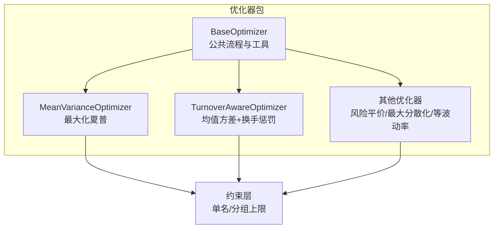
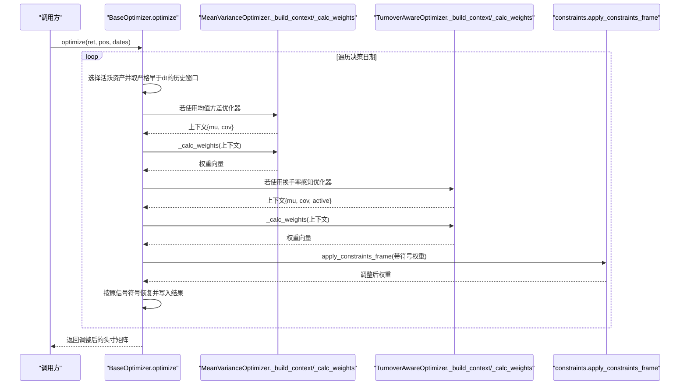
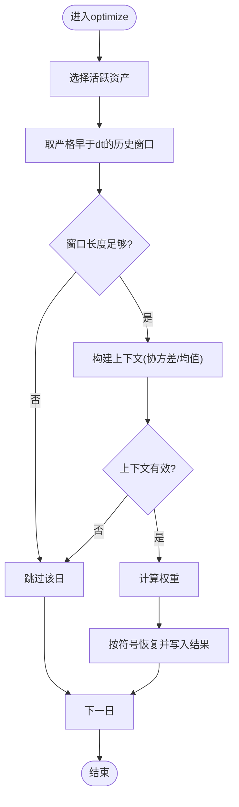
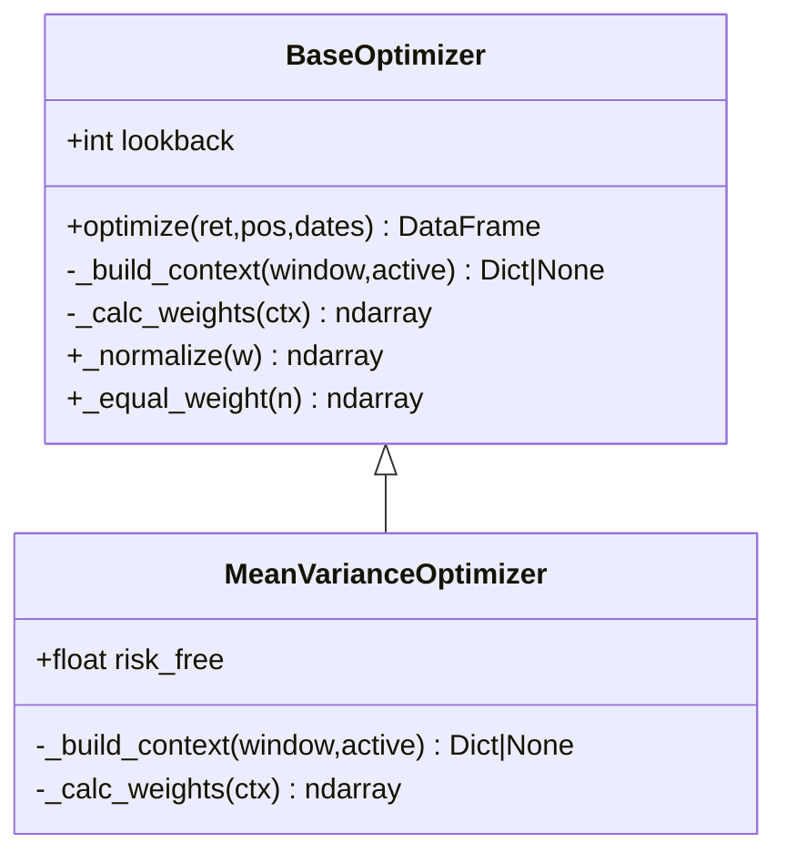
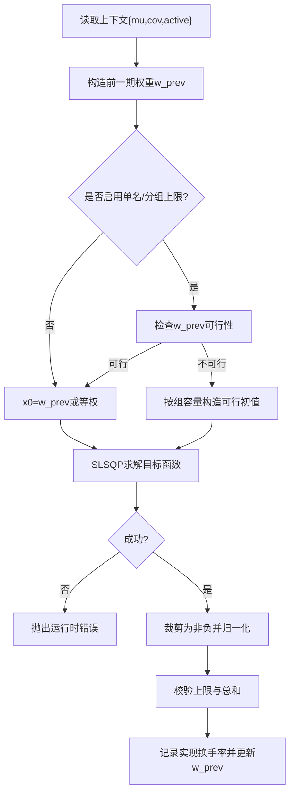
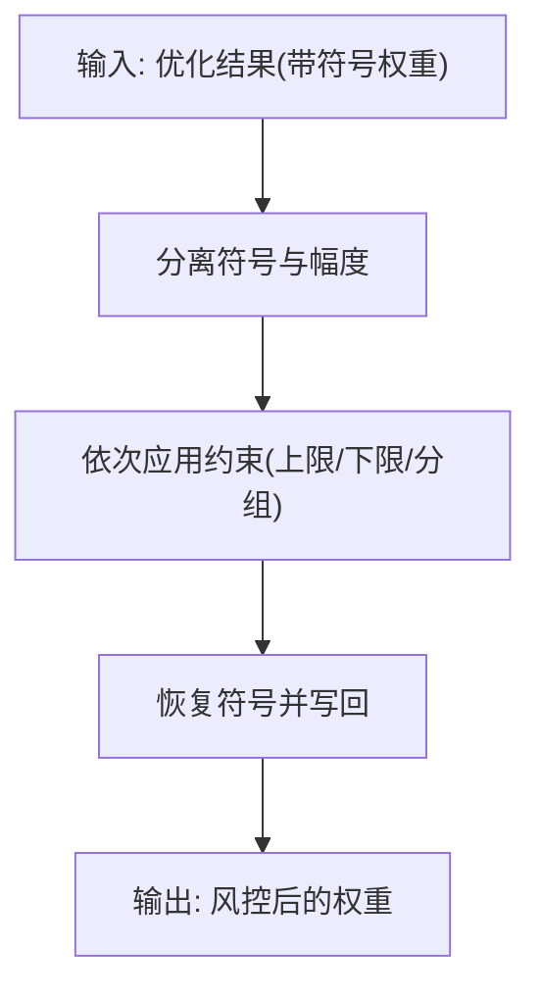
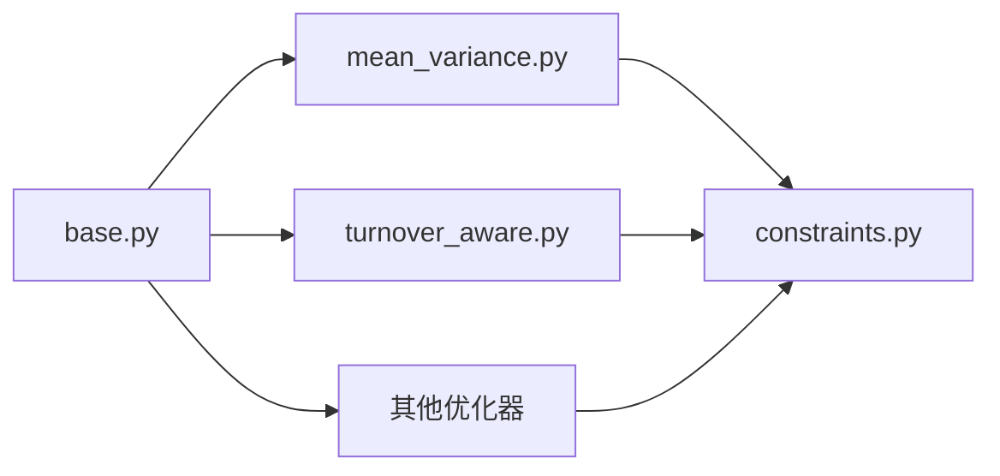

# 均值方差优化器

<cite>
**本文引用的文件**
- [agent/backtest/optimizers/base.py](file://agent/backtest/optimizers/base.py)
- [agent/backtest/optimizers/mean_variance.py](file://agent/backtest/optimizers/mean_variance.py)
- [agent/backtest/optimizers/turnover_aware.py](file://agent/backtest/optimizers/turnover_aware.py)
- [agent/backtest/constraints.py](file://agent/backtest/constraints.py)
- [agent/backtest/optimizers/__init__.py](file://agent/backtest/optimizers/__init__.py)
- [agent/tests/test_optimizer_causality.py](file://agent/tests/test_optimizer_causality.py)
- [agent/tests/test_turnover_aware_optimizer.py](file://agent/tests/test_turnover_aware_optimizer.py)
</cite>

## 目录
1. [简介](#简介)
2. [项目结构](#项目结构)
3. [核心组件](#核心组件)
4. [架构总览](#架构总览)
5. [详细组件分析](#详细组件分析)
6. [依赖关系分析](#依赖关系分析)
7. [性能与数值稳定性](#性能与数值稳定性)
8. [参数敏感性与最佳实践](#参数敏感性与最佳实践)
9. [使用示例](#使用示例)
10. [故障排查指南](#故障排查指南)
11. [结论](#结论)

## 简介
本技术文档围绕仓库中的“均值方差优化器”实现，系统阐述马科维茨均值方差理论的工程化落地：从期望收益估计、协方差矩阵计算、有效前沿概念，到目标函数设置（含风险厌恶参数、收益预测方法、协方差收缩思路）、约束条件配置（权重限制、行业集中度控制、换手率约束）以及参数敏感性分析与稳定性增强。文档同时提供从简单两资产组合到复杂多因子策略优化的使用路径，并总结奇异矩阵处理、数值稳定性与过拟合防范等常见问题解决方案。

## 项目结构
优化器位于回测模块的 optimizers 子包中，采用“基类 + 具体优化器”的分层设计：
- 基类 BaseOptimizer：统一处理滚动窗口、因果性切片、上下文构建、权重归一化与符号保持。
- 具体优化器：
  - MeanVarianceOptimizer：最大化夏普比率（长期多头单纯形）。
  - TurnoverAwareOptimizer：均值方差效用 + L1 换手惩罚，支持单名与分组上限。
  - 其他优化器（如风险平价、最大分散化、等波动率）作为对比或替代方案。
- 约束层 constraints：在任意优化器输出之上施加可组合的权重约束（单名上下限、分组暴露上限），保持正负号不变。

图表来源
- [agent/backtest/optimizers/base.py:14-145](file://agent/backtest/optimizers/base.py#L14-L145)
- [agent/backtest/optimizers/mean_variance.py:11-70](file://agent/backtest/optimizers/mean_variance.py#L11-L70)
- [agent/backtest/optimizers/turnover_aware.py:38-251](file://agent/backtest/optimizers/turnover_aware.py#L38-L251)
- [agent/backtest/constraints.py:1-206](file://agent/backtest/constraints.py#L1-L206)

章节来源
- [agent/backtest/optimizers/__init__.py:1-13](file://agent/backtest/optimizers/__init__.py#L1-L13)
- [agent/backtest/optimizers/base.py:14-145](file://agent/backtest/optimizers/base.py#L14-L145)

## 核心组件
- 基类 BaseOptimizer
  - 输入：收益率 DataFrame（日期×代码）、原始信号位置 DataFrame、决策日期索引。
  - 因果性保证：对每个决策日 dt，仅使用严格早于 dt 的历史数据；避免未来信息泄露。
  - 上下文构建：默认返回协方差矩阵；子类可扩展为包含均值、波动率等。
  - 权重应用：将优化得到的非负权重按原信号符号恢复，得到最终调整后的头寸。
- 均值方差优化器 MeanVarianceOptimizer
  - 目标：最大化夏普比率（经无风险利率调整），约束为长头寸单纯形（权重非负且和为1）。
  - 实现：通过 scipy.optimize.minimize 以 SLSQP 求解；若失败则回退到等权。
- 换手率感知优化器 TurnoverAwareOptimizer
  - 目标：均值方差效用 -w'μ + λ w'Σw + γ ||w - w_prev||_1，支持单名与分组上限。
  - 特性：记录每调仓期的实现换手率；当无约束时优先以历史权重为初值加速收敛。
- 约束层 constraints
  - MaxWeight：单名权重上限，超出的权重按比例再分配给未达上限的资产。
  - MinWeight：单名权重下限，低于下限的资产提升至下限，资金来自高于下限的资产。
  - GroupExposure：按组映射限制组内总权重，超限按比例缩放。
  - 接口：load_constraints 解析配置；apply_constraints_frame 逐行应用到优化结果。

章节来源
- [agent/backtest/optimizers/base.py:36-85](file://agent/backtest/optimizers/base.py#L36-L85)
- [agent/backtest/optimizers/mean_variance.py:11-70](file://agent/backtest/optimizers/mean_variance.py#L11-L70)
- [agent/backtest/optimizers/turnover_aware.py:38-251](file://agent/backtest/optimizers/turnover_aware.py#L38-L251)
- [agent/backtest/constraints.py:48-167](file://agent/backtest/constraints.py#L48-L167)

## 架构总览
下图展示从输入到输出的端到端流程，包括因果性切片、上下文构建、优化求解与约束后处理。

图表来源
- [agent/backtest/optimizers/base.py:36-85](file://agent/backtest/optimizers/base.py#L36-L85)
- [agent/backtest/optimizers/mean_variance.py:18-56](file://agent/backtest/optimizers/mean_variance.py#L18-L56)
- [agent/backtest/optimizers/turnover_aware.py:95-218](file://agent/backtest/optimizers/turnover_aware.py#L95-L218)
- [agent/backtest/constraints.py:180-206](file://agent/backtest/constraints.py#L180-L206)

## 详细组件分析

### 基类 BaseOptimizer：因果性与通用流程
- 关键职责
  - 滚动窗口：按 lookback 截取历史收益，确保长度不低于阈值。
  - 因果性：严格使用早于决策日的历史，避免闭市到开盘之间的收益泄露。
  - 上下文：默认仅提供协方差；允许子类扩展。
  - 权重归一化与等权回退：保证权重非负且和为1；空集或失败时回退等权。
- 复杂度
  - 时间：O(D·N^2) 量级（D 为决策日数，N 为活跃资产数），主要开销在协方差与优化。
  - 空间：O(N^2) 存储协方差矩阵。

图表来源
- [agent/backtest/optimizers/base.py:36-85](file://agent/backtest/optimizers/base.py#L36-L85)

章节来源
- [agent/backtest/optimizers/base.py:14-145](file://agent/backtest/optimizers/base.py#L14-L145)
- [agent/tests/test_optimizer_causality.py:45-66](file://agent/tests/test_optimizer_causality.py#L45-L66)

### 均值方差优化器：最大化夏普比率
- 数学基础
  - 目标：max (w'μ - r_f)/√(w'Σw)，约束 w≥0，∑w=1。
  - 解释：在给定预期收益 μ 与协方差 Σ 下，寻找有效前沿上的最优风险调整收益。
- 实现要点
  - 使用 SLSQP 求解；若优化失败或波动率过小，回退到等权。
  - 无风险利率 risk_free 可直接传入。
- 适用场景
  - 中长期调仓、长头寸为主的投资组合；对 μ 与 Σ 的估计质量敏感。

图表来源
- [agent/backtest/optimizers/base.py:14-145](file://agent/backtest/optimizers/base.py#L14-L145)
- [agent/backtest/optimizers/mean_variance.py:11-70](file://agent/backtest/optimizers/mean_variance.py#L11-L70)

章节来源
- [agent/backtest/optimizers/mean_variance.py:11-70](file://agent/backtest/optimizers/mean_variance.py#L11-L70)

### 换手率感知优化器：均值方差效用 + L1 换手惩罚
- 目标函数
  - min -w'μ + λ w'Σw + γ ||w - w_prev||_1，约束 w≥0，∑w=1，可选单名与分组上限。
- 关键特性
  - 风险厌恶系数 risk_aversion（λ）控制方差项权重。
  - 换手惩罚 turnover_penalty（γ）抑制频繁调仓；γ=0 时退化为均值方差。
  - 支持 max_per_name 与 groups/max_per_group 进行暴露控制。
  - 记录 realized_turnover，便于成本与滑点评估。
- 可行性与鲁棒性
  - 当存在强约束时，自动构造可行初值；若不可行直接报错。
  - 优化失败抛出异常，不隐式回退等权，便于上层捕获。

图表来源
- [agent/backtest/optimizers/turnover_aware.py:95-218](file://agent/backtest/optimizers/turnover_aware.py#L95-L218)

章节来源
- [agent/backtest/optimizers/turnover_aware.py:38-251](file://agent/backtest/optimizers/turnover_aware.py#L38-L251)
- [agent/tests/test_turnover_aware_optimizer.py:24-145](file://agent/tests/test_turnover_aware_optimizer.py#L24-L145)

### 约束层：可组合的风控措施
- 单名上限 MaxWeight：超过上限的权重被截断并按比例再分配至未达上限的资产。
- 单名下限 MinWeight：低于下限的资产提升至下限，资金来自高于下限的资产；若无法支撑则退化等权。
- 分组暴露 GroupExposure：按资产到组的映射限制组内总权重，超限按比例缩放。
- 应用方式：逐行作用于优化器的输出（保留正负号），顺序执行配置中的约束列表。

图表来源
- [agent/backtest/constraints.py:180-206](file://agent/backtest/constraints.py#L180-L206)
- [agent/backtest/constraints.py:48-167](file://agent/backtest/constraints.py#L48-L167)

章节来源
- [agent/backtest/constraints.py:1-206](file://agent/backtest/constraints.py#L1-L206)

## 依赖关系分析
- 内部依赖
  - 所有优化器继承自 BaseOptimizer，复用因果性切片、上下文构建与权重归一化逻辑。
  - 换手率感知优化器额外依赖上一期权重状态，用于计算 L1 换手惩罚。
- 外部依赖
  - numpy/pandas：数据处理与线性代数。
  - scipy.optimize.minimize：SLSQP 求解器。
- 耦合与内聚
  - 高内聚：每个优化器聚焦单一目标函数与约束集合。
  - 低耦合：通过统一的 BaseOptimizer 接口与 constraints 层解耦。

图表来源
- [agent/backtest/optimizers/base.py:14-145](file://agent/backtest/optimizers/base.py#L14-L145)
- [agent/backtest/optimizers/mean_variance.py:11-70](file://agent/backtest/optimizers/mean_variance.py#L11-L70)
- [agent/backtest/optimizers/turnover_aware.py:38-251](file://agent/backtest/optimizers/turnover_aware.py#L38-L251)
- [agent/backtest/constraints.py:1-206](file://agent/backtest/constraints.py#L1-L206)

章节来源
- [agent/backtest/optimizers/__init__.py:1-13](file://agent/backtest/optimizers/__init__.py#L1-L13)

## 性能与数值稳定性
- 性能特征
  - 协方差计算 O(N^2)，优化求解受 N 与约束数量影响；建议合理选择 lookback 与活跃资产数。
  - 换手率感知优化器在多次调仓中累积状态，需关注内存占用（realized_turnover 列表）。
- 数值稳定性
  - 协方差奇异或接近奇异：可通过协方差收缩（见下文最佳实践）提升条件数。
  - 波动率过低或为零：优化器会回退到等权或跳过该日，避免除零与不稳定。
  - 浮点误差：权重归一化与边界检查防止微小越界。

[本节为一般性指导，不直接分析具体文件]

## 参数敏感性与最佳实践
- lookback 窗口选择
  - 短窗口：更灵敏但噪声大；长窗口：更稳定但滞后。建议基于样本频率与资产波动特征，结合滚动验证选择。
  - 基类要求窗口长度不低于阈值，否则跳过该日。
- 风险厌恶系数 risk_aversion
  - 越大越重视方差项，降低组合波动；越小更追求收益。建议以历史夏普或波动率为参考校准。
- 换手惩罚 turnover_penalty
  - 越大越抑制调仓，适合交易成本高或滑点显著的场景；过小可能导致频繁调仓。
  - 测试表明，提高 gamma 可实现单调的非增换手趋势。
- 收益预测方法
  - 当前实现使用滚动均值作为 μ 估计；可替换为更稳健的估计（如缩尾、指数加权、贝叶斯收缩）。
- 协方差收缩技术
  - 建议对样本协方差进行收缩（例如向单位阵或多因子模型协方差收缩），改善条件数与稳定性。
- 稳定性增强
  - 启用单名与分组上限，避免极端集中；必要时加入最小权重约束，提升分散度。
  - 对异常值与缺失值进行预处理（剔除 NaN、缩尾、插值）。

章节来源
- [agent/backtest/optimizers/base.py:68-71](file://agent/backtest/optimizers/base.py#L68-L71)
- [agent/backtest/optimizers/turnover_aware.py:15-25](file://agent/backtest/optimizers/turnover_aware.py#L15-L25)
- [agent/tests/test_turnover_aware_optimizer.py:71-92](file://agent/tests/test_turnover_aware_optimizer.py#L71-L92)

## 使用示例
- 简单两资产组合
  - 输入：两资产的日收益率与初始等权头寸。
  - 步骤：选择 MeanVarianceOptimizer，设定 lookback 与 risk_free；运行 optimize 获取权重；如需风控，叠加 constraints 的单名上限/下限。
  - 参考：基类的因果性保证与权重符号恢复机制。
- 多资产多因子策略
  - 输入：多因子信号生成的原始头寸（含多空），配合换手率感知优化器。
  - 步骤：设置 risk_aversion 与 turnover_penalty；定义 groups 与 max_per_group 控制行业暴露；运行 optimize 并记录 realized_turnover 评估交易成本。
  - 参考：换手率感知优化器的分组约束与可行性初值构造。

章节来源
- [agent/backtest/optimizers/base.py:36-85](file://agent/backtest/optimizers/base.py#L36-L85)
- [agent/backtest/optimizers/turnover_aware.py:238-257](file://agent/backtest/optimizers/turnover_aware.py#L238-L257)
- [agent/backtest/constraints.py:170-206](file://agent/backtest/constraints.py#L170-L206)

## 故障排查指南
- 奇异矩阵与数值不稳定
  - 现象：优化失败或权重异常。
  - 解决：引入协方差收缩；增加最小权重；缩短 lookback 或过滤低流动性资产。
- 未来信息泄露
  - 现象：回测表现虚高。
  - 解决：确认仅使用严格早于决策日的历史；参考因果性测试用例。
- 约束不可行
  - 现象：抛出“exposure caps are infeasible”。
  - 解决：放宽单名或分组上限；减少活跃资产或调整组映射。
- 过拟合防范
  - 现象：样本内夏普极高，样本外衰减严重。
  - 解决：缩短 lookback、增大换手惩罚、加入正则化（收缩）、交叉验证与稳健估计。
- 单资产或极短窗口
  - 现象：优化器直接返回原始头寸或跳过该日。
  - 解决：确保至少两个活跃资产且窗口长度满足阈值。

章节来源
- [agent/backtest/optimizers/base.py:54-71](file://agent/backtest/optimizers/base.py#L54-L71)
- [agent/backtest/optimizers/turnover_aware.py:195-199](file://agent/backtest/optimizers/turnover_aware.py#L195-L199)
- [agent/tests/test_optimizer_causality.py:45-66](file://agent/tests/test_optimizer_causality.py#L45-L66)

## 结论
本仓库实现了模块化、可组合的均值方差优化体系：以 BaseOptimizer 统一因果性与流程，MeanVarianceOptimizer 提供经典夏普最大化，TurnoverAwareOptimizer 在均值方差基础上引入换手惩罚与暴露控制，constraints 层提供灵活的风控手段。实践中应结合数据频率与交易成本，合理选择 lookback、risk_aversion 与 turnover_penalty，并通过协方差收缩与稳健估计提升稳定性与泛化能力。测试用例覆盖了因果性、约束可行性与换手行为，可作为集成与回归验证的基础。