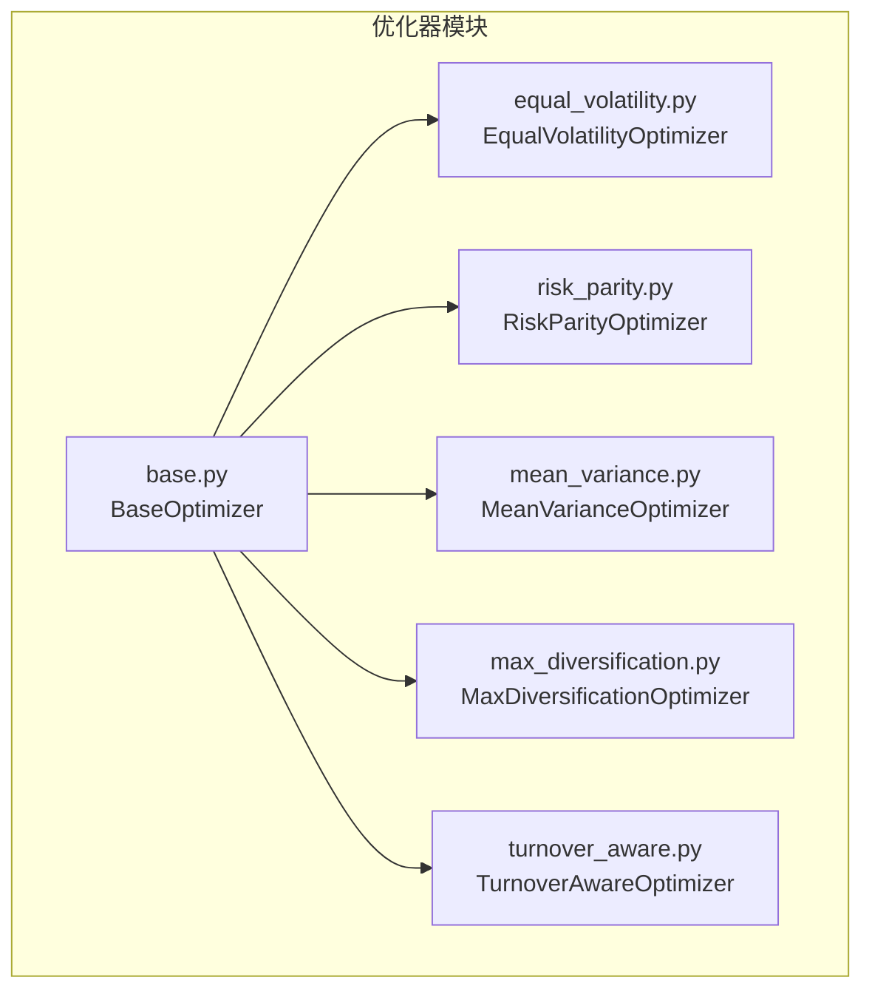
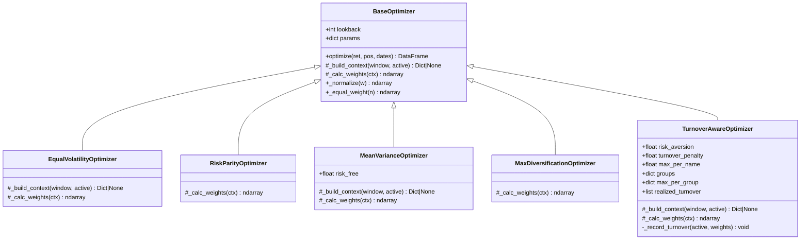
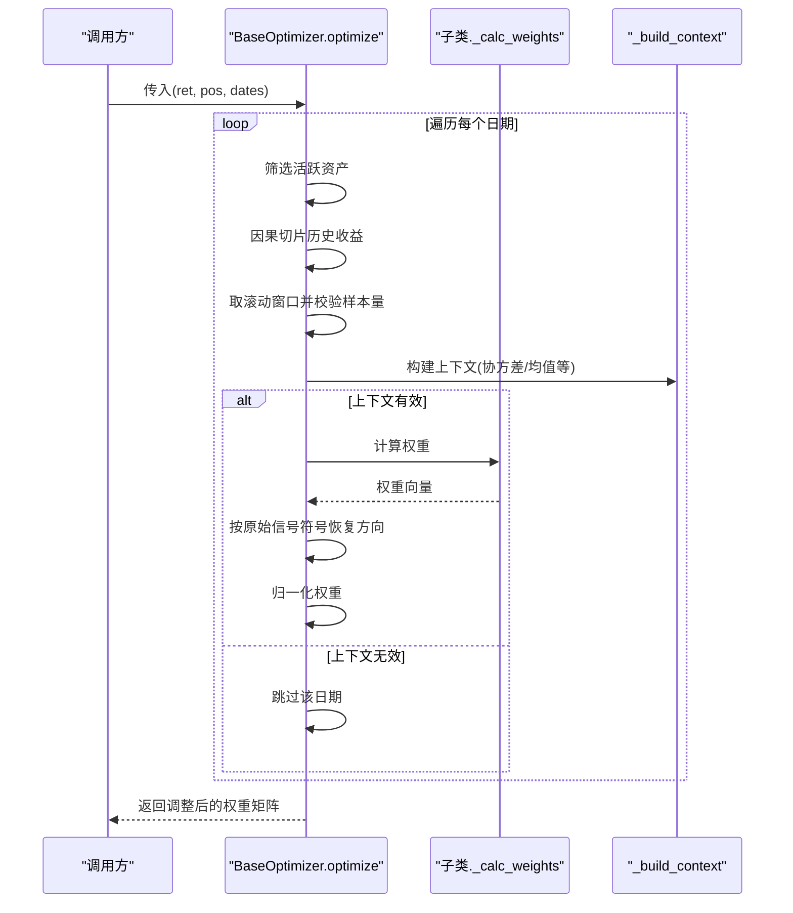
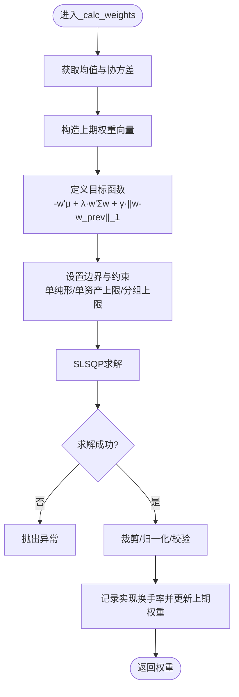
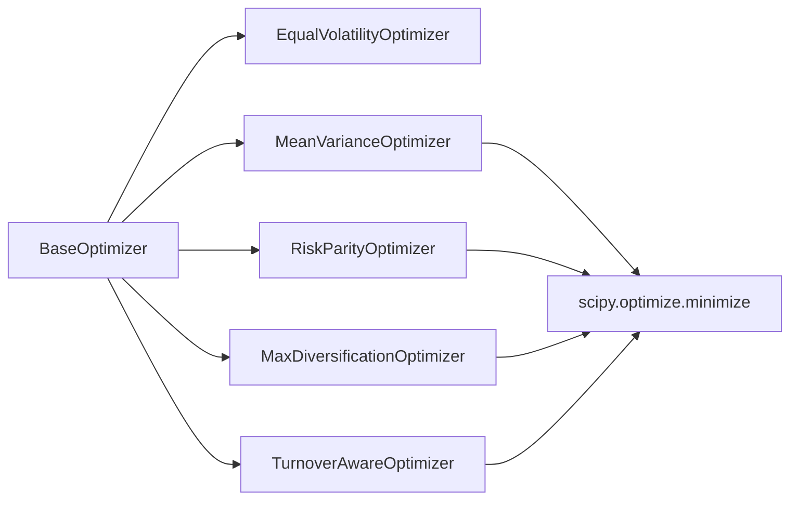

# 基础优化器架构

<cite>
**本文引用的文件**
- [agent/backtest/optimizers/base.py](file://agent/backtest/optimizers/base.py)
- [agent/backtest/optimizers/equal_volatility.py](file://agent/backtest/optimizers/equal_volatility.py)
- [agent/backtest/optimizers/risk_parity.py](file://agent/backtest/optimizers/risk_parity.py)
- [agent/backtest/optimizers/mean_variance.py](file://agent/backtest/optimizers/mean_variance.py)
- [agent/backtest/optimizers/max_diversification.py](file://agent/backtest/optimizers/max_diversification.py)
- [agent/backtest/optimizers/turnover_aware.py](file://agent/backtest/optimizers/turnover_aware.py)
- [agent/backtest/optimizers/__init__.py](file://agent/backtest/optimizers/__init__.py)
- [agent/tests/test_optimizer_causality.py](file://agent/tests/test_optimizer_causality.py)
- [agent/tests/test_turnover_aware_optimizer.py](file://agent/tests/test_turnover_aware_optimizer.py)
</cite>

## 目录
1. [简介](#简介)
2. [项目结构](#项目结构)
3. [核心组件](#核心组件)
4. [架构总览](#架构总览)
5. [详细组件分析](#详细组件分析)
6. [依赖关系分析](#依赖关系分析)
7. [性能考量](#性能考量)
8. [故障排查指南](#故障排查指南)
9. [结论](#结论)
10. [附录：优化器开发指南](#附录：优化器开发指南)

## 简介
本技术文档聚焦于回测框架中的“基础优化器架构”，围绕 BaseOptimizer 抽象类展开，系统阐述其统一接口设计、滚动协方差窗口处理、权重归一化机制与符号保持策略；并详解 optimize 方法的执行流程（信号预处理、活跃资产选择、历史数据切片、上下文构建等）；说明 _build_context 钩子的作用与扩展点，以及如何通过覆盖 _calc_weights 实现自定义优化算法。最后提供面向实践的开发指南，包括继承最佳实践、参数配置建议与性能优化技巧。

## 项目结构
优化器模块位于 agent/backtest/optimizers 下，采用“基类 + 多策略实现”的组织方式：
- base.py：定义 BaseOptimizer 抽象类，封装统一的 optimize 流程、滚动窗口、上下文构建与权重归一化。
- equal_volatility.py / risk_parity.py / mean_variance.py / max_diversification.py / turnover_aware.py：具体优化策略实现，均继承自 BaseOptimizer。
- __init__.py：模块级说明与注册入口提示。

图表来源
- [agent/backtest/optimizers/base.py:14-145](file://agent/backtest/optimizers/base.py#L14-L145)
- [agent/backtest/optimizers/equal_volatility.py:14-48](file://agent/backtest/optimizers/equal_volatility.py#L14-L48)
- [agent/backtest/optimizers/risk_parity.py:11-60](file://agent/backtest/optimizers/risk_parity.py#L11-L60)
- [agent/backtest/optimizers/mean_variance.py:11-70](file://agent/backtest/optimizers/mean_variance.py#L11-L70)
- [agent/backtest/optimizers/max_diversification.py:15-59](file://agent/backtest/optimizers/max_diversification.py#L15-L59)
- [agent/backtest/optimizers/turnover_aware.py:38-251](file://agent/backtest/optimizers/turnover_aware.py#L38-L251)

章节来源
- [agent/backtest/optimizers/__init__.py:1-13](file://agent/backtest/optimizers/__init__.py#L1-L13)

## 核心组件
- BaseOptimizer：提供统一的 optimize 流程，负责：
  - 活跃资产筛选（基于原始信号非零）
  - 因果性保证（仅使用决策日之前的收益历史）
  - 滚动窗口切片与最小样本量校验
  - 上下文构建（默认包含协方差矩阵）
  - 调用子类 _calc_weights 计算权重
  - 权重归一化与符号保持（结果方向与原始信号一致）
- 各策略优化器：通过覆盖 _build_context 和/或 _calc_weights 实现不同目标函数与约束。

章节来源
- [agent/backtest/optimizers/base.py:14-145](file://agent/backtest/optimizers/base.py#L14-L145)

## 架构总览
下图展示了 BaseOptimizer 与各策略优化器的继承关系及关键方法交互。

图表来源
- [agent/backtest/optimizers/base.py:14-145](file://agent/backtest/optimizers/base.py#L14-L145)
- [agent/backtest/optimizers/equal_volatility.py:14-48](file://agent/backtest/optimizers/equal_volatility.py#L14-L48)
- [agent/backtest/optimizers/risk_parity.py:11-60](file://agent/backtest/optimizers/risk_parity.py#L11-L60)
- [agent/backtest/optimizers/mean_variance.py:11-70](file://agent/backtest/optimizers/mean_variance.py#L11-L70)
- [agent/backtest/optimizers/max_diversification.py:15-59](file://agent/backtest/optimizers/max_diversification.py#L15-L59)
- [agent/backtest/optimizers/turnover_aware.py:38-251](file://agent/backtest/optimizers/turnover_aware.py#L38-L251)

## 详细组件分析

### BaseOptimizer 抽象类
- 统一接口与职责
  - optimize：对外入口，接收收益矩阵 ret、原始信号位置 pos、日期索引 dates，返回调整后的权重矩阵（未进行美元标准化）。
  - 内部流程：
    - 提取当前日期下的活跃资产（绝对值大于阈值的列）。
    - 若活跃资产为空或不足，跳过该日期。
    - 严格因果切片：仅取决策日之前（不含当日）的收益作为历史。
    - 滚动窗口：取最近 lookback 行，且要求有效样本数不低于阈值。
    - 上下文构建：调用 _build_context，默认返回协方差矩阵；若返回 None 则跳过。
    - 权重计算：调用 _calc_weights，得到权重向量后按原始信号符号恢复方向。
    - 归一化：对非负权重进行归一化，确保总和为 1。
- 钩子与扩展点
  - _build_context：可注入均值、波动率、分组信息等；返回 None 表示跳过该日期。
  - _calc_weights：必须实现，输入上下文，输出长度为活跃资产数量的权重向量。
- 工具方法
  - _normalize：将非负权重归一化为和为 1。
  - _equal_weight：生成等权向量。

图表来源
- [agent/backtest/optimizers/base.py:36-85](file://agent/backtest/optimizers/base.py#L36-L85)
- [agent/backtest/optimizers/base.py:91-109](file://agent/backtest/optimizers/base.py#L91-L109)
- [agent/backtest/optimizers/base.py:128-157](file://agent/backtest/optimizers/base.py#L128-L157)

章节来源
- [agent/backtest/optimizers/base.py:14-145](file://agent/backtest/optimizers/base.py#L14-L145)

### EqualVolatilityOptimizer（等波动率/反波动率加权）
- 特点：不依赖完整协方差模型，仅使用滚动标准差计算反波动率权重。
- 上下文：计算每资产的滚动波动率，过滤 NaN 与近零波动率。
- 权重：1/vol 归一化。

章节来源
- [agent/backtest/optimizers/equal_volatility.py:14-48](file://agent/backtest/optimizers/equal_volatility.py#L14-L48)

### RiskParityOptimizer（风险平价）
- 目标：在长仓单纯形上使边际风险贡献相等。
- 上下文：使用协方差矩阵。
- 求解：SLSQP 最小化风险贡献误差，失败时回退到等权。

章节来源
- [agent/backtest/optimizers/risk_parity.py:11-60](file://agent/backtest/optimizers/risk_parity.py#L11-L60)

### MeanVarianceOptimizer（均值-方差/最大夏普）
- 目标：最大化 (w'μ - r_f)/sqrt(w'Σw)，长仓单纯形约束。
- 上下文：均值向量与协方差矩阵。
- 求解：SLSQP 最小化负夏普比率，失败时回退到等权。

章节来源
- [agent/backtest/optimizers/mean_variance.py:11-70](file://agent/backtest/optimizers/mean_variance.py#L11-L70)

### MaxDiversificationOptimizer（最大分散化比率）
- 目标：最大化 w'σ / sqrt(w'Σw)，即分散化比率。
- 上下文：协方差矩阵。
- 求解：SLSQP 最小化负分散化比率，失败时回退到等权。

章节来源
- [agent/backtest/optimizers/max_diversification.py:15-59](file://agent/backtest/optimizers/max_diversification.py#L15-L59)

### TurnoverAwareOptimizer（换手率感知优化）
- 目标：均值-方差效用 + L1 换手惩罚，支持单资产上限与分组上限。
- 上下文：均值、协方差、当前活跃资产列表。
- 求解：SLSQP 最小化 -w'μ + λ·w'Σw + γ·||w - w_prev||_1，带边界与约束。
- 状态：维护上一期权重映射，记录每期实现换手率。
- 健壮性：对不可行约束给出明确错误；对求解失败抛出异常。

图表来源
- [agent/backtest/optimizers/turnover_aware.py:112-235](file://agent/backtest/optimizers/turnover_aware.py#L112-L235)

章节来源
- [agent/backtest/optimizers/turnover_aware.py:38-251](file://agent/backtest/optimizers/turnover_aware.py#L38-L251)

## 依赖关系分析
- 模块内依赖
  - 所有策略优化器均依赖 BaseOptimizer 提供的统一流程与工具方法。
  - 部分策略引入 scipy.optimize.minimize 进行数值优化。
- 外部依赖
  - numpy/pandas：数据处理与线性代数。
  - scipy：非线性优化求解器。

图表来源
- [agent/backtest/optimizers/base.py:14-145](file://agent/backtest/optimizers/base.py#L14-L145)
- [agent/backtest/optimizers/mean_variance.py:36-64](file://agent/backtest/optimizers/mean_variance.py#L36-L64)
- [agent/backtest/optimizers/risk_parity.py:14-49](file://agent/backtest/optimizers/risk_parity.py#L14-L49)
- [agent/backtest/optimizers/max_diversification.py:18-48](file://agent/backtest/optimizers/max_diversification.py#L18-L48)
- [agent/backtest/optimizers/turnover_aware.py:112-225](file://agent/backtest/optimizers/turnover_aware.py#L112-L225)

章节来源
- [agent/backtest/optimizers/base.py:14-145](file://agent/backtest/optimizers/base.py#L14-L145)

## 性能考量
- 滚动窗口大小 lookback：越大越稳定但滞后更强；过小易受噪声影响。
- 最小样本量阈值：避免在短窗或大量缺失数据下产生不稳定估计。
- 协方差矩阵质量：NaN、奇异或接近奇异会导致优化失败或不稳定；可在 _build_context 中做正则化或降维。
- 优化器复杂度：含分组约束与换手惩罚的优化问题规模更大，需关注收敛性与迭代次数。
- 向量化与缓存：尽量复用中间结果（如协方差、均值），减少重复计算。
- 数值稳定性：对极小波动率、接近零方差等进行保护，必要时回退到等权。

[本节为通用指导，不直接分析具体文件]

## 故障排查指南
- 常见错误与定位
  - 上下文无效（返回 None）：检查历史数据是否过短、是否存在过多 NaN；确认 _build_context 的条件判断。
  - 优化失败：查看求解器返回信息；对于 TurnoverAwareOptimizer，当约束不可行会抛出异常，需放宽上限或调整分组。
  - 权重不归一或符号错误：确认 _normalize 与符号保持逻辑未被覆盖破坏。
- 回归测试参考
  - 因果性：确保决策日收益不参与权重计算，窗口最大值严格小于决策日。
  - 符号保持：优化结果方向应与原始信号一致（多头为正、空头为负）。
  - 换手率单调性：提高换手惩罚应降低实现换手率。

章节来源
- [agent/tests/test_optimizer_causality.py:45-66](file://agent/tests/test_optimizer_causality.py#L45-L66)
- [agent/tests/test_turnover_aware_optimizer.py:110-122](file://agent/tests/test_turnover_aware_optimizer.py#L110-L122)
- [agent/tests/test_turnover_aware_optimizer.py:71-92](file://agent/tests/test_turnover_aware_optimizer.py#L71-L92)

## 结论
BaseOptimizer 以清晰的钩子设计与严格的因果性保障，提供了稳健、可扩展的回测优化框架。通过覆盖 _build_context 与 _calc_weights，开发者可以便捷地实现多种资产配置策略，并在统一流程中获得一致的输入处理、上下文构建、权重归一与符号保持。结合单元测试与回归用例，可有效验证优化器的正确性与鲁棒性。

[本节为总结性内容，不直接分析具体文件]

## 附录：优化器开发指南

### 继承 BaseOptimizer 的最佳实践
- 明确目标与约束
  - 在 _calc_weights 中清晰表达目标函数与约束；优先使用凸优化形式以便稳定求解。
- 上下文设计
  - 在 _build_context 中准备必要统计量（均值、协方差、波动率、分组映射等），并进行有效性检查（NaN、奇异、过小方差）。
  - 若上下文不完整或数据质量不佳，返回 None 让 BaseOptimizer 跳过该日期。
- 权重输出规范
  - _calc_weights 返回长度等于活跃资产数的权重向量；无需美元标准化，由调用方决定。
  - 若需要长仓约束，请在目标函数或约束中体现；最终可通过 _normalize 保证和为 1。
- 符号保持
  - BaseOptimizer 会在写入结果前乘以原始信号的符号，因此 _calc_weights 只需输出非负权重即可。

章节来源
- [agent/backtest/optimizers/base.py:36-85](file://agent/backtest/optimizers/base.py#L36-L85)
- [agent/backtest/optimizers/base.py:91-145](file://agent/backtest/optimizers/base.py#L91-L145)

### 参数配置建议
- lookback：根据数据频率与策略周期选择；高频可较小，低频可较大。
- 风险厌恶/换手惩罚：与收益单位尺度相关，需校准；例如日频收益约 1e-3，换手惩罚需相应缩放。
- 约束设置：单资产上限与分组上限需满足可行域；避免过紧导致无解。

章节来源
- [agent/backtest/optimizers/turnover_aware.py:52-93](file://agent/backtest/optimizers/turnover_aware.py#L52-L93)
- [agent/backtest/optimizers/turnover_aware.py:127-166](file://agent/backtest/optimizers/turnover_aware.py#L127-L166)

### 性能优化技巧
- 数据预处理：剔除全 NaN 列、填充缺失、去极值。
- 协方差估计：考虑收缩估计或因子模型以降低维度与改善条件数。
- 优化器调参：适当提高容差与最大迭代次数；为复杂约束提供良好初值（如上期权重）。
- 批处理：对多日期循环时尽量向量化计算，减少 Python 层开销。

[本节为通用指导，不直接分析具体文件]