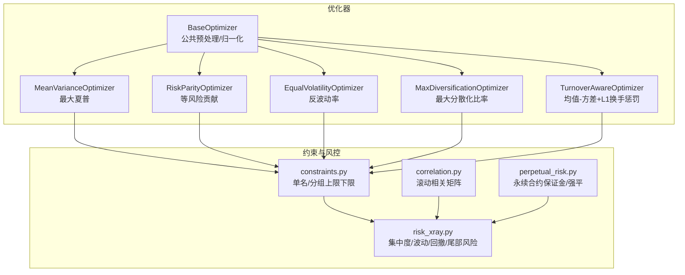
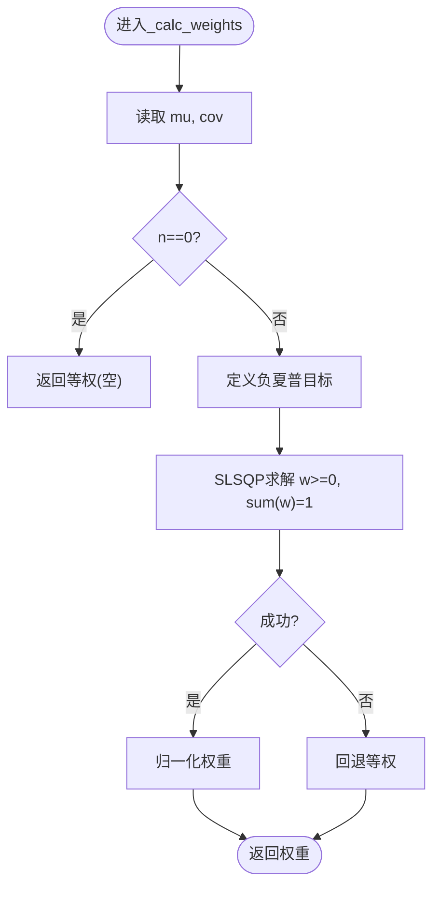
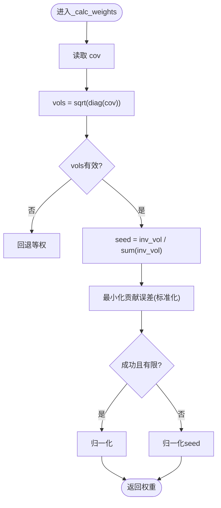
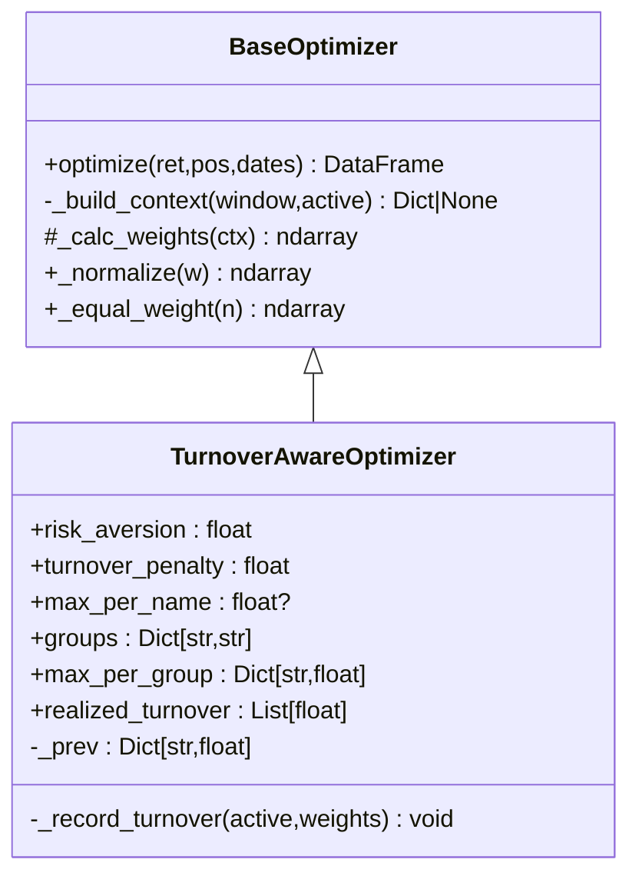
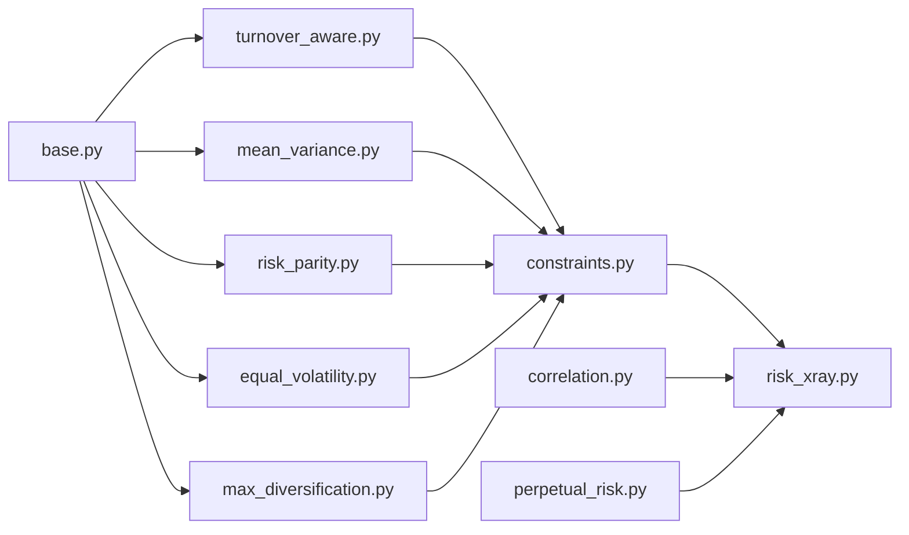
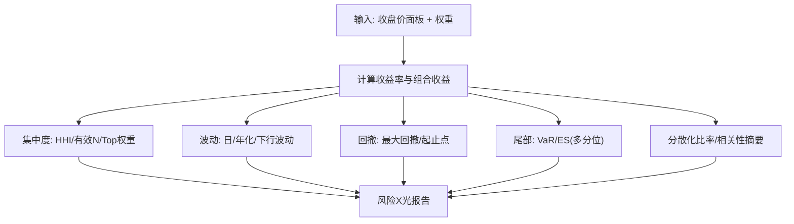

# 投资组合优化器

<cite>
**本文引用的文件**
- [agent/backtest/optimizers/base.py](file://agent/backtest/optimizers/base.py)
- [agent/backtest/optimizers/mean_variance.py](file://agent/backtest/optimizers/mean_variance.py)
- [agent/backtest/optimizers/risk_parity.py](file://agent/backtest/optimizers/risk_parity.py)
- [agent/backtest/optimizers/equal_volatility.py](file://agent/backtest/optimizers/equal_volatility.py)
- [agent/backtest/optimizers/max_diversification.py](file://agent/backtest/optimizers/max_diversification.py)
- [agent/backtest/optimizers/turnover_aware.py](file://agent/backtest/optimizers/turnover_aware.py)
- [agent/backtest/constraints.py](file://agent/backtest/constraints.py)
- [agent/backtest/correlation.py](file://agent/backtest/correlation.py)
- [agent/backtest/perpetual_risk.py](file://agent/backtest/perpetual_risk.py)
- [agent/backtest/risk_xray.py](file://agent/backtest/risk_xray.py)
- [agent/tests/test_risk_parity.py](file://agent/tests/test_risk_parity.py)
- [agent/tests/test_turnover_aware_optimizer.py](file://agent/tests/test_turnover_aware_optimizer.py)
</cite>

## 目录
1. [简介](#简介)
2. [项目结构](#项目结构)
3. [核心组件](#核心组件)
4. [架构总览](#架构总览)
5. [详细组件分析](#详细组件分析)
6. [依赖关系分析](#依赖关系分析)
7. [性能与数值计算](#性能与数值计算)
8. [风险管理集成](#风险管理集成)
9. [优化器选择指南](#优化器选择指南)
10. [使用示例](#使用示例)
11. [故障排查](#故障排查)
12. [结论](#结论)

## 简介
本技术文档系统化梳理了仓库中的投资组合优化模块，覆盖以下主题：
- 优化算法原理：均值方差（最大夏普）、风险平价、等波动率、最大分散化、换手率感知优化。
- 配置项：目标函数、约束条件、参数调优。
- 风险管理：风险预算分配、相关性分析、压力测试与尾部风险度量。
- 性能与数值：滚动窗口、收敛判断、资源管理与鲁棒性。
- 选择指南：不同策略的适用性、参数敏感性与稳定性评估。
- 实战示例：从简单权重分配到复杂多因子组合优化的端到端流程。

## 项目结构
优化器位于回测子系统中，采用“基类 + 具体策略”的分层设计；约束与风控作为可插拔层叠加在优化输出之上。



图表来源
- [agent/backtest/optimizers/base.py:14-145](file://agent/backtest/optimizers/base.py#L14-L145)
- [agent/backtest/optimizers/mean_variance.py:11-70](file://agent/backtest/optimizers/mean_variance.py#L11-L70)
- [agent/backtest/optimizers/risk_parity.py:11-60](file://agent/backtest/optimizers/risk_parity.py#L11-L60)
- [agent/backtest/optimizers/equal_volatility.py:14-48](file://agent/backtest/optimizers/equal_volatility.py#L14-L48)
- [agent/backtest/optimizers/max_diversification.py:15-59](file://agent/backtest/optimizers/max_diversification.py#L15-L59)
- [agent/backtest/optimizers/turnover_aware.py:38-251](file://agent/backtest/optimizers/turnover_aware.py#L38-L251)
- [agent/backtest/constraints.py:1-206](file://agent/backtest/constraints.py#L1-L206)
- [agent/backtest/correlation.py:1-302](file://agent/backtest/correlation.py#L1-L302)
- [agent/backtest/perpetual_risk.py:1-418](file://agent/backtest/perpetual_risk.py#L1-L418)
- [agent/backtest/risk_xray.py:1-369](file://agent/backtest/risk_xray.py#L1-L369)

章节来源
- [agent/backtest/optimizers/base.py:14-145](file://agent/backtest/optimizers/base.py#L14-L145)
- [agent/backtest/optimizers/__init__.py:1-13](file://agent/backtest/optimizers/__init__.py#L1-L13)

## 核心组件
- BaseOptimizer：统一处理滚动历史切片、协方差/均值构建、NaN检查、权重归一化与信号方向保持。
- MeanVarianceOptimizer：最大化夏普比率（长期多头单纯形）。
- RiskParityOptimizer：等风险贡献（边际风险贡献相等）的长头权重。
- EqualVolatilityOptimizer：反波动率加权，使各资产对组合波动的贡献近似相等。
- MaxDiversificationOptimizer：最大化分散化比率（Choueifaty & Coignard）。
- TurnoverAwareOptimizer：均值-方差效用加上L1换手惩罚，支持单名与分组暴露上限。

章节来源
- [agent/backtest/optimizers/base.py:14-145](file://agent/backtest/optimizers/base.py#L14-L145)
- [agent/backtest/optimizers/mean_variance.py:11-70](file://agent/backtest/optimizers/mean_variance.py#L11-L70)
- [agent/backtest/optimizers/risk_parity.py:11-60](file://agent/backtest/optimizers/risk_parity.py#L11-L60)
- [agent/backtest/optimizers/equal_volatility.py:14-48](file://agent/backtest/optimizers/equal_volatility.py#L14-L48)
- [agent/backtest/optimizers/max_diversification.py:15-59](file://agent/backtest/optimizers/max_diversification.py#L15-L59)
- [agent/backtest/optimizers/turnover_aware.py:38-251](file://agent/backtest/optimizers/turnover_aware.py#L38-L251)

## 架构总览
优化器通过统一的optimize接口接收收益矩阵、原始信号仓位与日期索引，按滚动窗口计算上下文（协方差/均值/波动），调用子类_calc_weights得到目标权重，并保留信号方向。约束层在优化输出后按行应用，保证单名/分组暴露合规。风控模块提供相关性、尾部风险、保证金与强平评估。

```mermaid
sequenceDiagram
participant Engine as "回测引擎"
participant Opt as "BaseOptimizer.optimize"
participant Sub as "具体优化器._calc_weights"
participant Cons as "constraints.apply_constraints_frame"
participant Risk as "risk_xray / correlation / perpetual_risk"
Engine->>Opt : optimize(ret, pos, dates)
loop 每个调仓日
Opt->>Opt : 取活跃资产与滚动历史
Opt->>Sub : _build_context(window, active)
Sub-->>Opt : ctx(协方差/均值/波动)
Opt->>Sub : _calc_weights(ctx)
Sub-->>Opt : 权重向量
Opt->>Opt : 恢复信号方向并写入结果
end
Opt-->>Engine : 调整后的仓位矩阵
Engine->>Cons : apply_constraints_frame(frame)
Cons-->>Engine : 合规权重
Engine->>Risk : 相关性/风险X光/保证金快照
Risk-->>Engine : 风险报告
```

图表来源
- [agent/backtest/optimizers/base.py:36-85](file://agent/backtest/optimizers/base.py#L36-L85)
- [agent/backtest/constraints.py:180-206](file://agent/backtest/constraints.py#L180-L206)
- [agent/backtest/correlation.py:285-319](file://agent/backtest/correlation.py#L285-L319)
- [agent/backtest/perpetual_risk.py:357-418](file://agent/backtest/perpetual_risk.py#L357-L418)
- [agent/backtest/risk_xray.py:86-176](file://agent/backtest/risk_xray.py#L86-L176)

## 详细组件分析

### 基类 BaseOptimizer
- 职责：
  - 滚动历史切片：仅使用决策时点之前的数据，避免未来信息泄露。
  - 上下文构建：默认提供协方差矩阵，子类可扩展均值/波动等。
  - 权重归一化：非负权重归一到和为1；空集返回等权。
  - 信号方向保持：将优化得到的正权重乘以原始信号的符号，以维持多空方向。
- 关键方法：
  - optimize：主入口，逐日处理活跃资产。
  - _build_context：默认返回协方差；若含NaN则跳过该日。
  - _calc_weights：抽象方法，由子类实现。
  - _normalize/_equal_weight：工具方法。

章节来源
- [agent/backtest/optimizers/base.py:14-145](file://agent/backtest/optimizers/base.py#L14-L145)

### 均值方差优化（最大夏普）
- 数学基础：
  - 目标：最大化 (w'μ - r_f)/√(w'Σw)，约束 w≥0，∑w=1。
  - 求解：scipy SLSQP最小化负夏普。
- 适用场景：
  - 有稳定预期收益估计且希望追求单位风险下的超额收益。
- 鲁棒性：
  - 协方差或均值含NaN时跳过；失败时回退等权。



图表来源
- [agent/backtest/optimizers/mean_variance.py:36-64](file://agent/backtest/optimizers/mean_variance.py#L36-L64)

章节来源
- [agent/backtest/optimizers/mean_variance.py:11-70](file://agent/backtest/optimizers/mean_variance.py#L11-L70)

### 风险平价（等风险贡献）
- 数学基础：
  - 目标：使各资产的边际风险贡献相等，即 w⊙(Σw) ≈ (w'Σw)/n · 1。
  - 求解：最小化标准化误差，约束 w≥0，∑w=1。
- 适用场景：
  - 关注风险分散而非收益预测，适合波动差异较大的资产池。
- 鲁棒性：
  - 奇异协方差或零波动时回退等权；失败时回退初始逆波动权重。



图表来源
- [agent/backtest/optimizers/risk_parity.py:14-49](file://agent/backtest/optimizers/risk_parity.py#L14-L49)

章节来源
- [agent/backtest/optimizers/risk_parity.py:11-60](file://agent/backtest/optimizers/risk_parity.py#L11-L60)
- [agent/tests/test_risk_parity.py:15-87](file://agent/tests/test_risk_parity.py#L15-L87)

### 等波动率（反波动率）
- 数学基础：
  - 权重 ∝ 1/σ_i，使各资产对组合波动贡献相近。
- 适用场景：
  - 无收益预测时的稳健基准；对协方差建模不敏感。
- 鲁棒性：
  - 任一资产波动为零或NaN则跳过该日。

章节来源
- [agent/backtest/optimizers/equal_volatility.py:14-48](file://agent/backtest/optimizers/equal_volatility.py#L14-L48)

### 最大分散化比率
- 数学基础：
  - 最大化 DR = (w'σ)/√(w'Σw)，其中σ为资产波动向量。
- 适用场景：
  - 强调分散化效果，降低组合波动相对加权平均波动的比例。
- 鲁棒性：
  - 零波动回退等权；失败回退等权。

章节来源
- [agent/backtest/optimizers/max_diversification.py:15-59](file://agent/backtest/optimizers/max_diversification.py#L15-L59)

### 换手率感知优化（均值-方差 + L1换手惩罚）
- 数学基础：
  - 目标：min -w'μ + λ·w'Σw + γ·||w - w_prev||_1，约束 w≥0，∑w=1，以及可选的单名/分组上限。
  - 通过前一次权重w_prev引入平滑，抑制频繁调仓。
- 适用场景：
  - 交易成本较高或需要控制换手率的策略。
- 约束能力：
  - 单名上限max_per_name；分组映射groups与组上限max_per_group。
- 鲁棒性：
  - 不可行上限会抛出异常；求解失败抛出运行时错误；记录realized_turnover用于事后分析。



图表来源
- [agent/backtest/optimizers/base.py:14-145](file://agent/backtest/optimizers/base.py#L14-L145)
- [agent/backtest/optimizers/turnover_aware.py:38-251](file://agent/backtest/optimizers/turnover_aware.py#L38-L251)

章节来源
- [agent/backtest/optimizers/turnover_aware.py:38-251](file://agent/backtest/optimizers/turnover_aware.py#L38-L251)
- [agent/tests/test_turnover_aware_optimizer.py:24-144](file://agent/tests/test_turnover_aware_optimizer.py#L24-L144)
- [agent/tests/test_turnover_aware_optimizer.py:208-356](file://agent/tests/test_turnover_aware_optimizer.py#L208-L356)

## 依赖关系分析
- 优化器均继承自BaseOptimizer，复用统一的输入处理、滚动窗口与权重归一化逻辑。
- 约束层独立于优化器，作用于优化输出的带符号权重矩阵，保持方向不变。
- 风控模块与优化器解耦：相关性计算基于价格序列；风险X光基于收盘价面板；永续合约风险模型基于账户与持仓状态。



图表来源
- [agent/backtest/optimizers/base.py:14-145](file://agent/backtest/optimizers/base.py#L14-L145)
- [agent/backtest/constraints.py:1-206](file://agent/backtest/constraints.py#L1-L206)
- [agent/backtest/correlation.py:1-302](file://agent/backtest/correlation.py#L1-L302)
- [agent/backtest/perpetual_risk.py:1-418](file://agent/backtest/perpetual_risk.py#L1-L418)
- [agent/backtest/risk_xray.py:1-369](file://agent/backtest/risk_xray.py#L1-L369)

章节来源
- [agent/backtest/optimizers/base.py:14-145](file://agent/backtest/optimizers/base.py#L14-L145)
- [agent/backtest/constraints.py:1-206](file://agent/backtest/constraints.py#L1-L206)

## 性能与数值计算
- 滚动窗口与数据有效性：
  - 仅使用决策时点之前的收益，避免未来信息泄露。
  - 窗口长度不足或协方差/均值含NaN时跳过该日，保证稳定性。
- 数值优化：
  - 使用SLSQP进行约束优化，设置迭代次数与容差；失败时回退等权或初始猜测。
  - 换手率感知优化中，通过前一时刻权重作为初值，提升收敛效率。
- 资源管理：
  - 优化过程为逐日循环，内存占用与资产数量线性相关；大规模资产建议分批或降维。
- 收敛判断：
  - 基于求解器success标志与权重有限性检查；不可行约束直接报错，便于快速定位配置问题。

章节来源
- [agent/backtest/optimizers/base.py:36-85](file://agent/backtest/optimizers/base.py#L36-L85)
- [agent/backtest/optimizers/mean_variance.py:36-64](file://agent/backtest/optimizers/mean_variance.py#L36-L64)
- [agent/backtest/optimizers/risk_parity.py:14-49](file://agent/backtest/optimizers/risk_parity.py#L14-L49)
- [agent/backtest/optimizers/turnover_aware.py:204-225](file://agent/backtest/optimizers/turnover_aware.py#L204-L225)

## 风险管理集成
- 风险预算分配：
  - 风险平价通过等风险贡献实现预算分配；最大分散化比率间接控制风险集中。
- 相关性分析：
  - 支持Pearson与Spearman滚动相关矩阵，自动对齐跨市场时间戳，缺失值处理与最小样本量校验。
- 压力测试与尾部风险：
  - risk_xray提供集中度（HHI、有效资产数）、年化波动、下行波动、最大回撤、历史VaR与期望短缺（ES）。
  - 永续合约风险模型提供保证金、维持保证金、强平判定与账户状态快照。



图表来源
- [agent/backtest/risk_xray.py:86-176](file://agent/backtest/risk_xray.py#L86-L176)
- [agent/backtest/risk_xray.py:179-287](file://agent/backtest/risk_xray.py#L179-L287)
- [agent/backtest/correlation.py:135-213](file://agent/backtest/correlation.py#L135-L213)
- [agent/backtest/perpetual_risk.py:357-418](file://agent/backtest/perpetual_risk.py#L357-L418)

章节来源
- [agent/backtest/correlation.py:19-302](file://agent/backtest/correlation.py#L19-L302)
- [agent/backtest/risk_xray.py:86-176](file://agent/backtest/risk_xray.py#L86-L176)
- [agent/backtest/perpetual_risk.py:181-418](file://agent/backtest/perpetual_risk.py#L181-L418)

## 优化器选择指南
- 均值方差（最大夏普）：
  - 适用：有较稳定的预期收益估计，追求单位风险下的高回报。
  - 敏感性：对μ估计误差敏感；需配合稳健估计或收缩协方差。
  - 稳定性：失败时回退等权；建议监控求解器成功标志。
- 风险平价：
  - 适用：关注风险分散，对收益预测不确定时更稳健。
  - 敏感性：对协方差估计质量敏感；低波动资产权重更高。
  - 稳定性：奇异协方差回退等权；适合宽基多资产。
- 等波动率：
  - 适用：无收益预测时的稳健基准；对协方差建模要求低。
  - 敏感性：对波动估计噪声敏感；短窗易波动。
  - 稳定性：任一资产波动异常则跳过该日。
- 最大分散化比率：
  - 适用：强调分散化效果，降低组合波动相对于加权平均波动。
  - 敏感性：对协方差结构敏感；高相关资产会降低DR。
  - 稳定性：失败回退等权。
- 换手率感知优化：
  - 适用：交易成本高或需控制换手的策略。
  - 敏感性：γ越大越平滑；λ影响风险厌恶程度；单名/分组上限直接影响可行性。
  - 稳定性：不可行上限会报错；建议先验证约束可行性再上线。

章节来源
- [agent/backtest/optimizers/mean_variance.py:11-70](file://agent/backtest/optimizers/mean_variance.py#L11-L70)
- [agent/backtest/optimizers/risk_parity.py:11-60](file://agent/backtest/optimizers/risk_parity.py#L11-L60)
- [agent/backtest/optimizers/equal_volatility.py:14-48](file://agent/backtest/optimizers/equal_volatility.py#L14-L48)
- [agent/backtest/optimizers/max_diversification.py:15-59](file://agent/backtest/optimizers/max_diversification.py#L15-L59)
- [agent/backtest/optimizers/turnover_aware.py:38-251](file://agent/backtest/optimizers/turnover_aware.py#L38-L251)

## 使用示例
以下为典型用法路径（不展示代码内容，仅提供路径参考）：
- 简单权重分配：
  - 使用等波动率或风险平价生成初始权重，适用于多资产宽基组合。
  - 参考：[equal_volatility.optimize:40-48](file://agent/backtest/optimizers/equal_volatility.py#L40-L48)、[risk_parity.optimize:52-60](file://agent/backtest/optimizers/risk_parity.py#L52-L60)
- 均值方差优化：
  - 提供预期收益与协方差，最大化夏普比率。
  - 参考：[mean_variance.optimize:67-77](file://agent/backtest/optimizers/mean_variance.py#L67-L77)
- 换手率感知优化：
  - 设置风险厌恶λ与换手惩罚γ，加入单名/分组上限。
  - 参考：[turnover_aware.optimize:238-257](file://agent/backtest/optimizers/turnover_aware.py#L238-L257)
- 约束应用：
  - 在优化输出上应用单名上限、下限与分组暴露限制。
  - 参考：[apply_constraints_frame:180-206](file://agent/backtest/constraints.py#L180-L206)
- 风险X光与相关性：
  - 基于收盘价面板与权重计算集中度、波动、回撤、尾部风险与相关性摘要。
  - 参考：[compute_risk_xray:86-176](file://agent/backtest/risk_xray.py#L86-L176)、[compute_correlation_matrix:285-319](file://agent/backtest/correlation.py#L285-L319)
- 永续合约风险：
  - 基于账户与持仓状态计算保证金与强平判定。
  - 参考：[evaluate_isolated/CrossMarginRiskModel.evaluate:357-418](file://agent/backtest/perpetual_risk.py#L357-L418)

章节来源
- [agent/backtest/optimizers/equal_volatility.py:40-48](file://agent/backtest/optimizers/equal_volatility.py#L40-L48)
- [agent/backtest/optimizers/risk_parity.py:52-60](file://agent/backtest/optimizers/risk_parity.py#L52-L60)
- [agent/backtest/optimizers/mean_variance.py:67-77](file://agent/backtest/optimizers/mean_variance.py#L67-L77)
- [agent/backtest/optimizers/turnover_aware.py:238-257](file://agent/backtest/optimizers/turnover_aware.py#L238-L257)
- [agent/backtest/constraints.py:180-206](file://agent/backtest/constraints.py#L180-L206)
- [agent/backtest/risk_xray.py:86-176](file://agent/backtest/risk_xray.py#L86-L176)
- [agent/backtest/correlation.py:285-319](file://agent/backtest/correlation.py#L285-L319)
- [agent/backtest/perpetual_risk.py:357-418](file://agent/backtest/perpetual_risk.py#L357-L418)

## 故障排查
- 常见错误与处理：
  - 协方差/均值含NaN：跳过该日或回退等权，检查数据质量与窗口长度。
  - 约束不可行：单名/分组上限过紧导致无可行解，放宽上限或减少活跃资产。
  - 求解失败：检查目标函数与约束一致性，必要时增大迭代次数或调整初值。
  - 权重非有限：确保协方差正定或接近正定，必要时添加正则化。
- 调试建议：
  - 打印每步上下文（cov/mu/vols）与求解结果标志。
  - 使用单元测试验证极端情况（零波动、单资产、全NaN列）。
  - 结合risk_xray与相关性分析定位风险集中与尾部风险来源。

章节来源
- [agent/backtest/optimizers/base.py:91-109](file://agent/backtest/optimizers/base.py#L91-L109)
- [agent/backtest/optimizers/mean_variance.py:36-64](file://agent/backtest/optimizers/mean_variance.py#L36-L64)
- [agent/backtest/optimizers/risk_parity.py:14-49](file://agent/backtest/optimizers/risk_parity.py#L14-L49)
- [agent/backtest/optimizers/turnover_aware.py:204-225](file://agent/backtest/optimizers/turnover_aware.py#L204-L225)
- [agent/tests/test_risk_parity.py:70-87](file://agent/tests/test_risk_parity.py#L70-L87)
- [agent/tests/test_turnover_aware_optimizer.py:94-144](file://agent/tests/test_turnover_aware_optimizer.py#L94-L144)

## 结论
该投资组合优化模块提供了从基础到高级的多类优化方法，并通过约束与风控层形成完整的投研闭环。建议在实盘中：
- 根据数据质量与业务目标选择合适的优化器。
- 严格配置约束与参数，并进行充分的回测与压力测试。
- 持续监控风险指标（集中度、波动、回撤、尾部风险）与相关性变化。
- 利用换手率感知优化控制交易成本，提升策略稳健性。