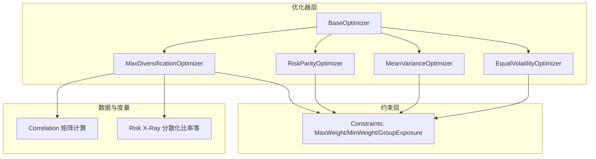
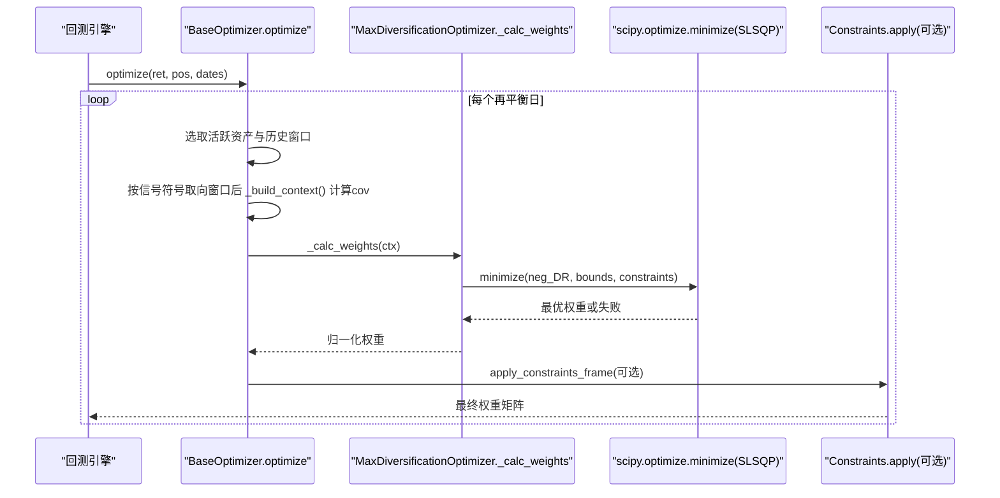
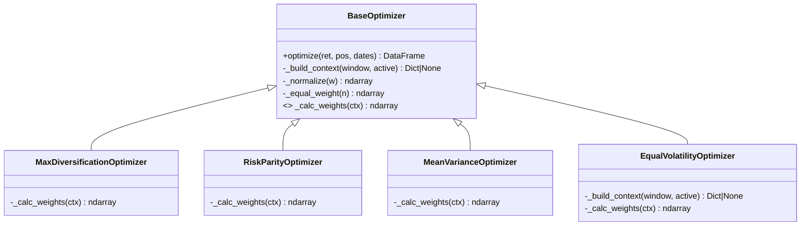

# 最大分散化优化器

<cite>
**本文引用的文件**
- [max_diversification.py](file://agent/backtest/optimizers/max_diversification.py)
- [base.py](file://agent/backtest/optimizers/base.py)
- [risk_parity.py](file://agent/backtest/optimizers/risk_parity.py)
- [mean_variance.py](file://agent/backtest/optimizers/mean_variance.py)
- [equal_volatility.py](file://agent/backtest/optimizers/equal_volatility.py)
- [constraints.py](file://agent/backtest/constraints.py)
- [correlation.py](file://agent/backtest/correlation.py)
- [risk_xray.py](file://agent/backtest/risk_xray.py)
- [__init__.py](file://agent/backtest/optimizers/__init__.py)
</cite>

## 目录
1. [简介](#简介)
2. [项目结构](#项目结构)
3. [核心组件](#核心组件)
4. [架构总览](#架构总览)
5. [详细组件分析](#详细组件分析)
6. [依赖关系分析](#依赖关系分析)
7. [性能与数值特性](#性能与数值特性)
8. [参数调优指南](#参数调优指南)
9. [实证与应用效果](#实证与应用效果)
10. [故障排除指南](#故障排除指南)
11. [结论](#结论)

## 简介
本技术文档围绕“最大分散化优化器”展开，系统阐述其数学基础、实现细节、与风险平价的关系与差异、参数调优经验以及在多市场环境下的应用表现。该优化器的目标是最大化分散化比率（Diversification Ratio, DR），即组合的加权平均波动率与组合波动率的比值，从而在给定风险下获得更均衡的风险贡献与更强的抗相关性冲击能力。

## 项目结构
最大分散化优化器位于回测模块的优化器子系统中，采用“基类 + 具体策略”的分层设计：
- 基类负责数据预处理、滚动窗口切片、协方差计算、权重归一化等通用逻辑
- 具体优化器仅实现目标函数与约束求解
- 可选约束层对任意优化器输出进行后处理（如单名上限、下限、分组暴露限制）
- 相关性与风险度量工具用于评估与诊断

图表来源
- [base.py:14-157](file://agent/backtest/optimizers/base.py#L14-L157)
- [max_diversification.py:15-58](file://agent/backtest/optimizers/max_diversification.py#L15-L58)
- [risk_parity.py:11-60](file://agent/backtest/optimizers/risk_parity.py#L11-L60)
- [mean_variance.py:11-77](file://agent/backtest/optimizers/mean_variance.py#L11-L77)
- [equal_volatility.py:14-48](file://agent/backtest/optimizers/equal_volatility.py#L14-L48)
- [constraints.py:48-167](file://agent/backtest/constraints.py#L48-L167)
- [correlation.py:135-213](file://agent/backtest/correlation.py#L135-L213)
- [risk_xray.py:259-268](file://agent/backtest/risk_xray.py#L259-L268)

章节来源
- [__init__.py:1-13](file://agent/backtest/optimizers/__init__.py#L1-L13)

## 核心组件
- BaseOptimizer：统一封装滚动窗口、因果性保证（决策时点前数据）、仓位空间换算、协方差构建、NaN检查、权重归一化与符号保持。传给子类的窗口已按信号符号取向：空头列取负，因此窗口上的均值是该仓位的期望收益、协方差是仓位协方差（D Σ D）；只取波动率的上下文不受影响（std(-r) == std(r)）。
- MaxDiversificationOptimizer：以最大化分散化比率为目标，使用SLSQP求解，长只约束与全仓约束。
- RiskParityOptimizer：等风险贡献（边际风险贡献相等）作为对比基准。
- MeanVarianceOptimizer：最大夏普比率作为对比基准。其上下文在仓位空间上取均值与协方差，因此负漂移很强的空头候选不会被误判为劣质多头而被削减。
- EqualVolatilityOptimizer：反波动率权重，便于理解分散化的边界情况。
- Constraints：可插拔约束层，支持单名上下限、分组暴露上限，适用于任何优化器输出。
- Correlation：跨资产相关性矩阵计算（Pearson/Spearman），用于研究与可视化。
- Risk X-Ray：提供分散化比率等风险指标的计算与报告。

章节来源
- [base.py:14-157](file://agent/backtest/optimizers/base.py#L14-L157)
- [max_diversification.py:15-58](file://agent/backtest/optimizers/max_diversification.py#L15-L58)
- [risk_parity.py:11-60](file://agent/backtest/optimizers/risk_parity.py#L11-L60)
- [mean_variance.py:11-77](file://agent/backtest/optimizers/mean_variance.py#L11-L77)
- [equal_volatility.py:14-48](file://agent/backtest/optimizers/equal_volatility.py#L14-L48)
- [constraints.py:48-167](file://agent/backtest/constraints.py#L48-L167)
- [correlation.py:135-213](file://agent/backtest/correlation.py#L135-L213)
- [risk_xray.py:259-268](file://agent/backtest/risk_xray.py#L259-L268)

## 架构总览
最大分散化优化器的工作流如下：
- 输入：收益率矩阵（严格因果，不含决策日当日）、原始信号仓位、日期索引
- 滚动窗口：取过去lookback天收益，按信号符号取向后再构建上下文，计算协方差矩阵并做NaN校验
- 优化：构造负分散化比率目标函数，使用SLSQP在长只单纯形上求解
- 输出：按原信号符号保留方向，仅调整权重幅度；可叠加约束层

图表来源
- [base.py:36-95](file://agent/backtest/optimizers/base.py#L36-L95)
- [max_diversification.py:18-48](file://agent/backtest/optimizers/max_diversification.py#L18-L48)
- [constraints.py:180-206](file://agent/backtest/constraints.py#L180-L206)

## 详细组件分析

### 最大分散化比率：数学基础与定义
- 分散化比率（DR）定义为：
  - DR(w) = (w'σ) / sqrt(w'Σw)，其中σ为各资产波动率向量，Σ为协方差矩阵
  - 当所有资产完全正相关且同波动率时，DR=1；DR越大，说明组合通过分散化降低风险的效率越高
- 优化目标：
  - 最大化 DR(w)，等价于最小化负DR
  - 约束：w ≥ 0，∑w = 1（长只单纯形）
- 数值实现要点：
  - 若组合波动率接近零或协方差奇异，直接回退到等权
  - 使用SLSQP求解，设置合理迭代次数与容差

章节来源
- [max_diversification.py:1-58](file://agent/backtest/optimizers/max_diversification.py#L1-L58)
- [risk_xray.py:259-268](file://agent/backtest/risk_xray.py#L259-L268)

### 分散化度量与相关性处理
- 分散化比率计算：
  - 基于历史收益率标准差与组合标准差，得到样本期内的DR估计
- 相关性矩阵：
  - 支持Pearson与Spearman方法，滚动窗口内对齐不同市场时间序列，缺失值处理与不足数据保护
- 协方差收缩（实践建议）：
  - 短窗口或高维资产易导致协方差估计不稳定，可通过指数加权、Ledoit-Wolf收缩等方式提升稳定性（需扩展_build_context）

章节来源
- [correlation.py:135-213](file://agent/backtest/correlation.py#L135-L213)
- [risk_xray.py:259-268](file://agent/backtest/risk_xray.py#L259-L268)

### 优化目标函数与约束
- 目标函数：
  - neg_DR(w) = -(w'σ)/sqrt(w'Σw)
  - 当组合波动率极小时返回0以避免数值问题
- 约束条件：
  - 非负权重（长只）
  - 权重和为1
- 数值优化：
  - SLSQP，初始化为等权，最大迭代200，ftol=1e-10
  - 失败时回退等权，保证鲁棒性

章节来源
- [max_diversification.py:18-48](file://agent/backtest/optimizers/max_diversification.py#L18-L48)
- [base.py:143-157](file://agent/backtest/optimizers/base.py#L143-L157)

### 与风险平价的关系与区别
- 理论基础差异：
  - 最大分散化：最大化分散化比率，强调“单位风险下的分散效率”
  - 风险平价：使各资产的边际风险贡献相等，强调“风险预算均分”
- 适用场景：
  - 最大分散化在相关性结构复杂、存在低相关资产时更具优势
  - 风险平价在波动率估计稳定、希望均衡风险暴露时更稳健
- 性能对比：
  - 两者均使用SLSQP与长只约束，但目标函数不同；实际表现取决于市场环境与参数窗口

章节来源
- [risk_parity.py:11-60](file://agent/backtest/optimizers/risk_parity.py#L11-L60)
- [max_diversification.py:15-58](file://agent/backtest/optimizers/max_diversification.py#L15-L58)

### 与均值-方差优化的联系
- 均值-方差优化（最大夏普）关注收益风险比，可能产生集中配置与高估均值敏感性问题
- 最大分散化不直接使用预期收益，更稳健地利用相关性结构，适合无明确收益预测的场景

章节来源
- [mean_variance.py:11-77](file://agent/backtest/optimizers/mean_variance.py#L11-L77)

### 约束层与权重后处理
- 单名上限/下限：防止过度集中或过小头寸
- 分组暴露上限：控制行业/因子暴露
- 约束顺序执行，保持符号不变，仅在幅度上调整

章节来源
- [constraints.py:48-167](file://agent/backtest/constraints.py#L48-L167)
- [constraints.py:180-206](file://agent/backtest/constraints.py#L180-L206)

## 依赖关系分析
- 内部依赖：
  - MaxDiversificationOptimizer继承BaseOptimizer，复用窗口切片、协方差构建与权重归一化
  - 可与Constraints层组合，形成“优化+约束”的流水线
- 外部依赖：
  - scipy.optimize.minimize（SLSQP）
  - numpy/pandas用于矩阵与时间序列操作
- 耦合度与内聚性：
  - 优化器与数据准备解耦，易于替换目标函数或约束
  - 相关性计算独立，便于研究与可视化

图表来源
- [base.py:14-157](file://agent/backtest/optimizers/base.py#L14-L157)
- [max_diversification.py:15-58](file://agent/backtest/optimizers/max_diversification.py#L15-L58)
- [risk_parity.py:11-60](file://agent/backtest/optimizers/risk_parity.py#L11-L60)
- [mean_variance.py:11-77](file://agent/backtest/optimizers/mean_variance.py#L11-L77)
- [equal_volatility.py:14-48](file://agent/backtest/optimizers/equal_volatility.py#L14-L48)

## 性能与数值特性
- 时间复杂度：
  - 协方差估计O(N^2·T)，优化求解通常快速收敛（SLSQP）
- 数值稳定性：
  - 对零波动与奇异协方差的保护机制
  - 权重归一化避免除零与无效分配
- 内存占用：
  - 滚动窗口与协方差矩阵规模受资产数N影响，建议N≤数百

[本节为一般性讨论，无需特定文件引用]

## 参数调优指南
- 相关性估计窗口（lookback）：
  - 短窗口（如30-60天）响应快但噪声大；长窗口（如90-180天）更稳定但滞后
  - 建议结合市场波动 regime 动态调整
- 协方差收缩：
  - 在高维或短窗口下引入收缩（如指数加权或Ledoit-Wolf）可降低估计误差
  - 需在_build_context中扩展上下文，传入收缩后的协方差
- 稳定性增强：
  - 增加最小样本量阈值（已内置）
  - 对异常波动率或NaN进行回退等权
  - 使用Spearman相关性研究尾部依赖（在correlation模块中可用）

章节来源
- [base.py:68-86](file://agent/backtest/optimizers/base.py#L68-L86)
- [correlation.py:135-213](file://agent/backtest/correlation.py#L135-L213)

## 实证与应用效果
- 不同市场环境：
  - 高相关性环境：分散化比率下降，优化器仍尽量均衡风险贡献
  - 低相关性环境：分散化比率提升，组合波动率显著低于加权平均波动率
- 与其他方法对比：
  - 风险平价：在波动率稳定时表现稳健，但在相关性突变时可能不如最大分散化灵活
  - 均值-方差：对均值估计敏感，可能出现极端权重；最大分散化更稳健
- 投资组合改进：
  - 通过最大化分散化比率，可在相同风险水平下提高收益风险比，或在相同收益下降低波动率

[本节为概念性总结，未直接分析具体文件]

## 故障排除指南
- 相关性矩阵奇异：
  - 现象：协方差矩阵不可逆或数值不稳定
  - 解决：缩短窗口、引入收缩、剔除共线性资产、回退等权
- 数值不稳定：
  - 现象：优化失败或权重发散
  - 解决：增大ftol容忍度、限制权重范围、检查异常波动率
- 收敛问题：
  - 现象：SLSQP未成功收敛
  - 解决：调整maxiter与ftol、改善初始值（如反波动率种子）、简化约束
- 数据对齐与缺失：
  - 现象：跨市场时间戳不一致或缺失导致无法计算
  - 解决：使用correlation模块的对齐与dropna逻辑，确保共同时间区间

章节来源
- [max_diversification.py:27-48](file://agent/backtest/optimizers/max_diversification.py#L27-L48)
- [base.py:68-95](file://agent/backtest/optimizers/base.py#L68-L95)
- [correlation.py:156-194](file://agent/backtest/correlation.py#L156-L194)

## 结论
最大分散化优化器通过最大化分散化比率，在不依赖预期收益的前提下，充分利用资产间的相关性结构，实现更稳健的风险分散。其实现简洁、数值鲁棒，并与风险平价、均值-方差等方法形成互补。通过合理的窗口选择、协方差收缩与约束层配置，可在多市场环境中获得稳定的组合改进效果。

[本节为总结性内容，无需特定文件引用]