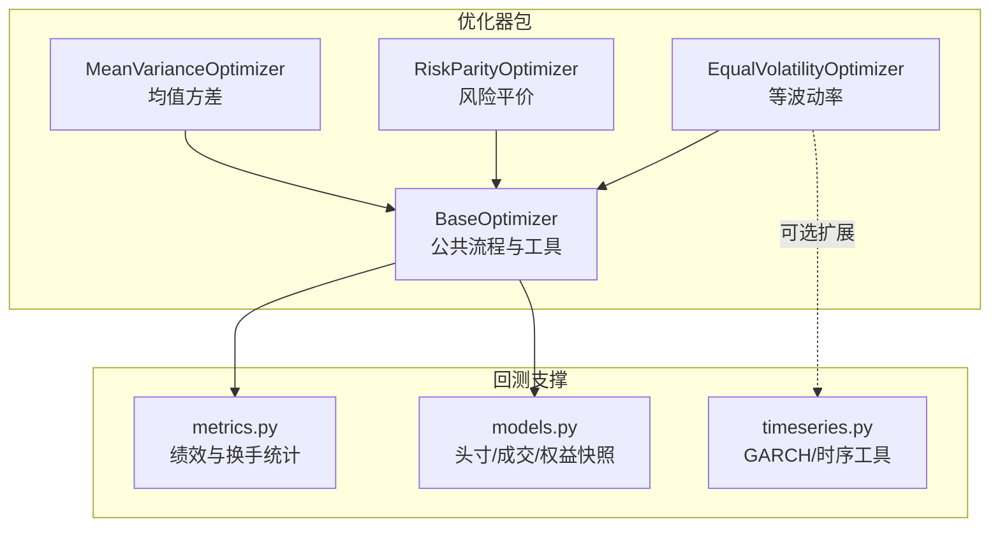
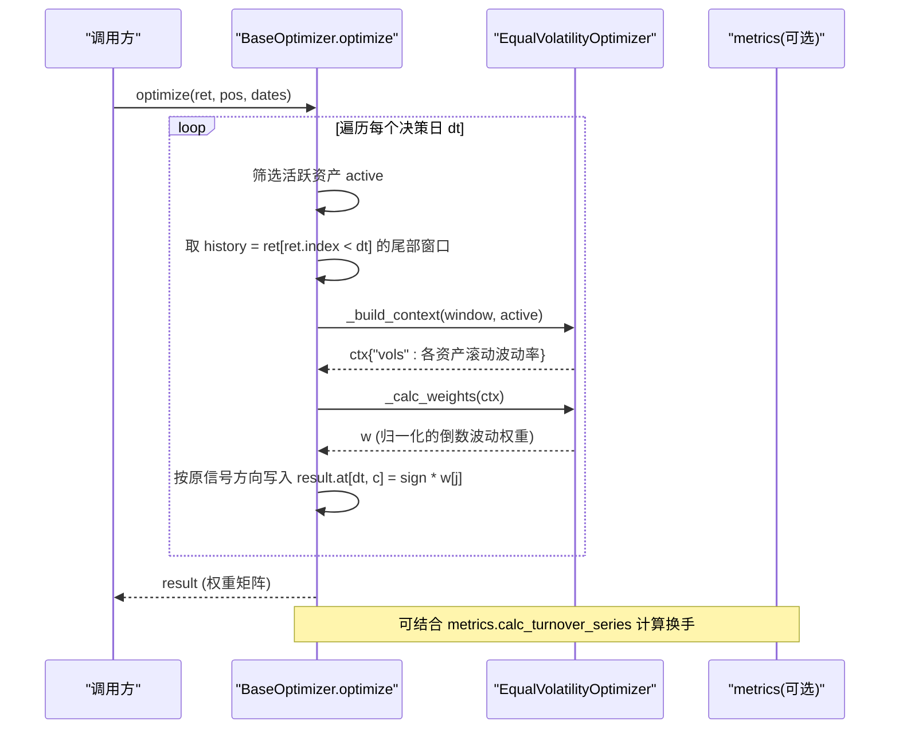
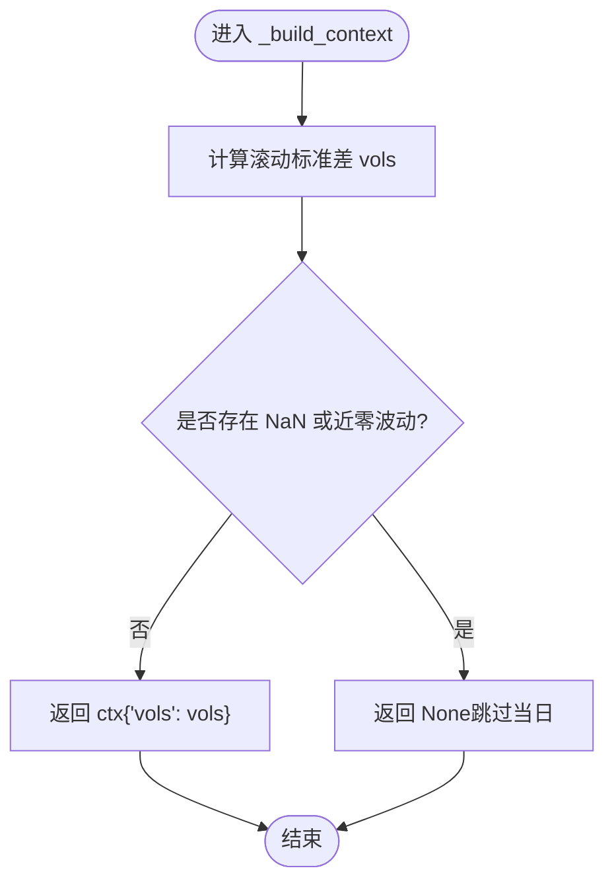
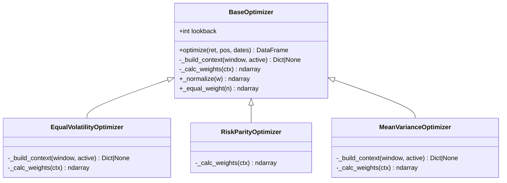
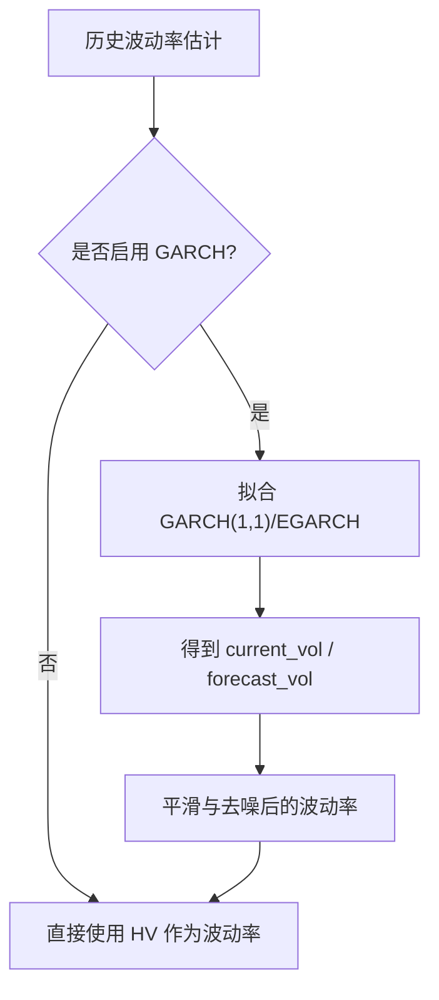
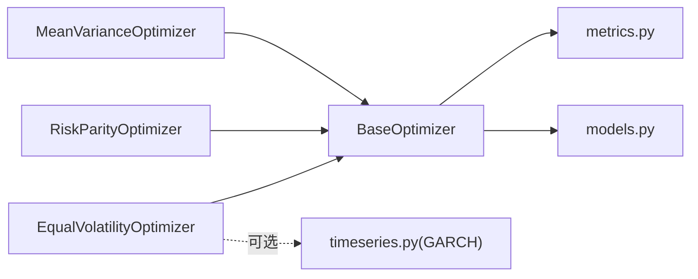

# 等波动率优化器

<cite>
**本文引用的文件**
- [equal_volatility.py](file://agent/backtest/optimizers/equal_volatility.py)
- [base.py](file://agent/backtest/optimizers/base.py)
- [risk_parity.py](file://agent/backtest/optimizers/risk_parity.py)
- [mean_variance.py](file://agent/backtest/optimizers/mean_variance.py)
- [__init__.py](file://agent/backtest/optimizers/__init__.py)
- [metrics.py](file://agent/backtest/metrics.py)
- [models.py](file://agent/backtest/models.py)
- [timeseries.py](file://agent/src/quantlib/timeseries.py)
</cite>

## 目录
1. [简介](#简介)
2. [项目结构](#项目结构)
3. [核心组件](#核心组件)
4. [架构总览](#架构总览)
5. [详细组件分析](#详细组件分析)
6. [依赖关系分析](#依赖关系分析)
7. [性能考量](#性能考量)
8. [故障排查指南](#故障排查指南)
9. [结论](#结论)
10. [附录](#附录)

## 简介
本技术文档围绕“等波动率优化器”展开，系统阐述其理论基础、实现细节与工程实践。等波动率（Inverse-Volatility）通过为低波动资产赋予更高权重，使组合中各资产的波动贡献趋于均衡，从而在不依赖完整协方差建模的前提下，获得稳健的分散化效果。该方案具备简单、稳健、换手较低等优势，适合趋势跟踪、均值回归与多资产配置等场景。

文档同时覆盖：
- 波动率估计方法：历史波动率、GARCH模型应用、波动率聚类处理
- 权重调整机制：动态再平衡频率、阈值与极端值处理
- 与其他优化方法的对比：风险平价、均值方差等
- 参数配置指南：窗口选择、再平衡策略、风险控制参数
- 应用场景与效果对比：不同策略下的优化表现
- 性能评估指标：夏普比率、最大回撤、换手成本等

## 项目结构
等波动率优化器位于回测模块的优化器子系统中，采用“基类 + 具体优化器”的分层设计。基础框架负责滚动窗口切片、信号方向保持、权重归一化等通用逻辑；具体优化器仅实现核心权重计算。

图表来源
- [base.py:14-85](file://agent/backtest/optimizers/base.py#L14-L85)
- [equal_volatility.py:14-47](file://agent/backtest/optimizers/equal_volatility.py#L14-L47)
- [risk_parity.py:11-59](file://agent/backtest/optimizers/risk_parity.py#L11-L59)
- [mean_variance.py:11-69](file://agent/backtest/optimizers/mean_variance.py#L11-L69)
- [metrics.py:441-506](file://agent/backtest/metrics.py#L441-L506)
- [models.py:13-118](file://agent/backtest/models.py#L13-L118)
- [timeseries.py:148-162](file://agent/src/quantlib/timeseries.py#L148-L162)

章节来源
- [__init__.py:1-12](file://agent/backtest/optimizers/__init__.py#L1-L12)
- [base.py:14-85](file://agent/backtest/optimizers/base.py#L14-L85)

## 核心组件
- BaseOptimizer：提供统一的优化入口 optimize()，负责：
  - 活跃资产筛选
  - 因果滚动窗口切片（严格使用决策时刻之前的数据，避免未来信息泄露）
  - 上下文构建（默认协方差矩阵）
  - 权重计算与符号保持（保留原始信号的长/短方向）
  - 权重归一化与边界保护
- EqualVolatilityOptimizer：在 _build_context 中计算滚动标准差，在 _calc_weights 中执行倒数波动加权并归一化。
- RiskParityOptimizer / MeanVarianceOptimizer：作为对比参考，分别实现风险平价与最大夏普的优化逻辑。
- metrics.py：提供换手率序列、年化因子、夏普、最大回撤、索提诺等关键指标的计算。
- timeseries.py：提供 GARCH 拟合接口，用于更精细的波动率预测与聚类建模。

章节来源
- [base.py:14-145](file://agent/backtest/optimizers/base.py#L14-L145)
- [equal_volatility.py:14-47](file://agent/backtest/optimizers/equal_volatility.py#L14-L47)
- [risk_parity.py:11-59](file://agent/backtest/optimizers/risk_parity.py#L11-L59)
- [mean_variance.py:11-69](file://agent/backtest/optimizers/mean_variance.py#L11-L69)
- [metrics.py:153-170](file://agent/backtest/metrics.py#L153-L170)
- [metrics.py:441-506](file://agent/backtest/metrics.py#L441-L506)
- [metrics.py:461-626](file://agent/backtest/metrics.py#L461-L626)
- [timeseries.py:148-162](file://agent/src/quantlib/timeseries.py#L148-L162)

## 架构总览
等波动率优化器的运行流程如下：
- 输入：收益率矩阵 ret、原始信号位置 pos、日期索引 dates
- 对每个决策日 dt：
  - 选取活跃资产（非零信号）
  - 取 dt 之前 lookback 窗口的收益 history
  - 构建上下文 ctx（等波动率下为各资产滚动波动率）
  - 计算目标权重 w
  - 将权重按原信号方向应用到结果矩阵
- 输出：经波动率调整后的权重矩阵（未做美元标准化）

图表来源
- [base.py:36-85](file://agent/backtest/optimizers/base.py#L36-L85)
- [equal_volatility.py:17-37](file://agent/backtest/optimizers/equal_volatility.py#L17-L37)
- [metrics.py:441-463](file://agent/backtest/metrics.py#L441-L463)

## 详细组件分析

### 等波动率优化器（EqualVolatilityOptimizer）
- 理论基础
  - 波动率倒数加权：权重与波动率成反比，使高波动资产降权、低波动资产升权，达到“各资产波动贡献相近”的效果。
  - 无需完整协方差建模：仅依赖单资产波动率，降低估计误差与过拟合风险。
  - 信号方向保持：最终权重乘以原始信号的正负号，保留多头/空头方向。
- 实现要点
  - _build_context：以滚动窗口计算各资产标准差 vols，若存在 NaN 或接近零波动则跳过当日。
  - _calc_weights：计算 inv_vol = 1/vols，归一化为 sum=1 的权重向量。
  - 鲁棒性：极小波动阈值过滤、NaN 检查、最小样本量保护（lookback 的一半或至少 5）。
- 复杂度
  - 时间复杂度：O(N·T)，N 为资产数，T 为交易日数；每步计算标准差 O(N)。
  - 空间复杂度：O(N·T) 存储窗口与中间结果。
- 适用场景
  - 多资产组合、跨市场配置
  - 趋势跟踪与均值回归策略中的仓位缩放
  - 需要低换手与稳健性的中长期策略

图表来源
- [equal_volatility.py:17-32](file://agent/backtest/optimizers/equal_volatility.py#L17-L32)

章节来源
- [equal_volatility.py:14-47](file://agent/backtest/optimizers/equal_volatility.py#L14-L47)
- [base.py:36-85](file://agent/backtest/optimizers/base.py#L36-L85)

### 基类 BaseOptimizer
- 职责
  - 统一优化入口 optimize()，封装滚动窗口、活跃资产筛选、上下文构建、权重计算与符号保持。
  - 提供 _normalize 与 _equal_weight 等工具函数。
- 关键约束
  - 因果性：仅使用决策时刻之前的收益，避免未来信息泄露。
  - 最小样本：窗口长度不足时跳过优化，保证稳定性。
  - 符号保持：result.at[dt, c] = sign * weights[j]，确保方向不变。
- 可扩展性
  - 子类只需实现 _calc_weights，并可重写 _build_context 以引入均值、波动率、协方差等上下文。

图表来源
- [base.py:14-145](file://agent/backtest/optimizers/base.py#L14-L145)
- [equal_volatility.py:14-47](file://agent/backtest/optimizers/equal_volatility.py#L14-L47)
- [risk_parity.py:11-59](file://agent/backtest/optimizers/risk_parity.py#L11-L59)
- [mean_variance.py:11-69](file://agent/backtest/optimizers/mean_variance.py#L11-L69)

章节来源
- [base.py:14-145](file://agent/backtest/optimizers/base.py#L14-L145)

### 波动率估计与 GARCH 集成
- 历史波动率（HV）
  - 使用滚动窗口收益率的标准差估计，适用于短期波动率刻画。
  - 优点：简单直观；缺点：对近期冲击敏感，易产生噪声。
- GARCH 模型
  - 通过 fit_garch 获取当前波动率、长期波动率与预测路径，捕捉波动率聚类与均值回归特性。
  - 典型参数含义：alpha（冲击响应）、beta（持续性）、persistence（记忆性），long_run_vol（长期波动率）。
  - 中国 A 股与加密货币的典型特征：A 股杠杆效应明显（EGARCH 更优），BTC 对称冲击更强且长期年化波动较高。
- 波动率聚类处理
  - 利用 GARCH 的均值回归特性平滑短期波动率尖峰，提高权重稳定性。
  - 当 persistence 接近 1 时，长期波动率不可用，需谨慎解读预测。

图表来源
- [timeseries.py:148-162](file://agent/src/quantlib/timeseries.py#L148-L162)

章节来源
- [timeseries.py:148-162](file://agent/src/quantlib/timeseries.py#L148-L162)

### 权重调整机制与配置选项
- 动态再平衡频率
  - 由外部调度决定（每日/每周/事件驱动），优化器内部按每个决策日独立计算权重。
  - 建议：低频再平衡以降低换手成本；高频再平衡提升响应速度但增加交易成本。
- 波动率阈值设置
  - 近零波动阈值（如 1e-12）防止除零与权重爆炸。
  - 最小样本保护（lookback 的一半或至少 5）避免早期不稳定。
- 极端值处理
  - 对含 NaN 的窗口直接跳过当日优化。
  - 对异常大波动可通过 GARCH 平滑或截尾处理。
- 其他参数
  - lookback：滚动窗口长度，影响波动率估计的灵敏度与稳定性。
  - risk_free（均值方差对比）：无风险利率，用于夏普优化。

章节来源
- [base.py:36-85](file://agent/backtest/optimizers/base.py#L36-L85)
- [equal_volatility.py:17-37](file://agent/backtest/optimizers/equal_volatility.py#L17-L37)
- [mean_variance.py:14-26](file://agent/backtest/optimizers/mean_variance.py#L14-L26)

### 与其他优化方法的比较优势
- 等波动率 vs 风险平价
  - 等波动率：仅依赖单资产波动率，简单稳健，换手较低。
  - 风险平价：考虑协方差结构，追求边际风险贡献相等，更复杂但对相关性敏感。
- 等波动率 vs 均值方差
  - 等波动率：不估计均值，规避均值估计误差带来的权重不稳定。
  - 均值方差：最大化夏普，但对输入敏感，可能产生集中持仓。
- 综合优势
  - 简单性：易于实现与解释。
  - 稳健性：对估计误差鲁棒，适合中长周期配置。
  - 低换手：权重变化平缓，交易成本低。

章节来源
- [risk_parity.py:11-59](file://agent/backtest/optimizers/risk_parity.py#L11-L59)
- [mean_variance.py:11-69](file://agent/backtest/optimizers/mean_variance.py#L11-L69)
- [equal_volatility.py:14-47](file://agent/backtest/optimizers/equal_volatility.py#L14-L47)

## 依赖关系分析
- 内部依赖
  - EqualVolatilityOptimizer 依赖 BaseOptimizer 提供的公共流程。
  - 所有优化器共享 metrics.py 的换手与绩效指标计算。
  - 可选依赖 timeseries.py 的 GARCH 能力进行波动率预测。
- 外部依赖
  - numpy/pandas：数值与时间序列处理。
  - scipy.optimize（风险平价/均值方差）：非线性优化求解。
  - arch/statsmodels（GARCH/统计检验）：可选，按需安装。

图表来源
- [base.py:14-145](file://agent/backtest/optimizers/base.py#L14-L145)
- [metrics.py:441-506](file://agent/backtest/metrics.py#L441-L506)
- [models.py:13-118](file://agent/backtest/models.py#L13-L118)
- [timeseries.py:148-162](file://agent/src/quantlib/timeseries.py#L148-L162)

章节来源
- [__init__.py:1-12](file://agent/backtest/optimizers/__init__.py#L1-L12)

## 性能考量
- 计算效率
  - 等波动率优化器仅计算标准差，时间复杂度低，适合大规模资产池。
  - 风险平价与均值方差涉及协方差与优化求解，计算开销更大。
- 换手成本
  - 通过低频再平衡与波动率平滑（GARCH）降低换手。
  - 使用 metrics.calc_turnover_series 量化权重变动带来的换手。
- 年化与指标
  - 根据数据源与区间确定 bars_per_year，正确年化波动与夏普。
  - 关注最大回撤、索提诺比率与信息比率，全面评估风险调整后收益。

章节来源
- [metrics.py:153-170](file://agent/backtest/metrics.py#L153-L170)
- [metrics.py:441-506](file://agent/backtest/metrics.py#L441-L506)
- [metrics.py:461-626](file://agent/backtest/metrics.py#L461-L626)

## 故障排查指南
- 常见问题
  - 窗口过小：lookback 不足导致无法计算波动率，优化器会跳过当日。
  - 数据缺失：存在 NaN 或价格非正导致回报未定义，需清理数据。
  - 波动率为零：触发近零阈值保护，回退到等权或跳过。
  - 优化失败：风险平价/均值方差优化收敛失败时回退到等权或种子权重。
- 诊断步骤
  - 检查输入数据的完整性与对齐（日期、列名）。
  - 打印滚动波动率与权重序列，定位异常点。
  - 使用 metrics.calc_metrics 汇总绩效与换手，辅助定位问题。
- 修复建议
  - 增大 lookback 或减少资产数量。
  - 使用 GARCH 平滑波动率，减少极端值影响。
  - 调整再平衡频率与阈值，平衡稳健性与响应速度。

章节来源
- [base.py:36-85](file://agent/backtest/optimizers/base.py#L36-L85)
- [metrics.py:245-302](file://agent/backtest/metrics.py#L245-L302)
- [metrics.py:461-626](file://agent/backtest/metrics.py#L461-L626)

## 结论
等波动率优化器以简洁有效的波动率倒数加权为核心，在不依赖复杂协方差建模的情况下，实现了稳健的分散化与较低的换手成本。结合 GARCH 波动率预测与合理的再平衡策略，可在多种策略与市场中取得良好表现。对于追求稳健与可解释性的投资组合，等波动率是一个值得优先尝试的基础方案。

## 附录
- 参数配置建议
  - 波动率窗口：日线数据常用 60 日；高频数据可适当缩短。
  - 再平衡策略：周度或月度再平衡可降低换手；事件驱动再平衡应对市场突变。
  - 风险控制：设置近零波动阈值、最小样本保护；必要时引入 GARCH 平滑。
- 应用场景示例
  - 趋势跟踪：在上涨趋势中为低波动标的增权，提升收益稳定性。
  - 均值回归：在震荡市中通过波动率倒数加权控制回撤。
  - 多资产配置：跨资产类别（股票、债券、商品、加密）的稳健配置。
- 评估指标
  - 夏普比率、最大回撤、索提诺比率、信息比率、跟踪误差、换手成本。