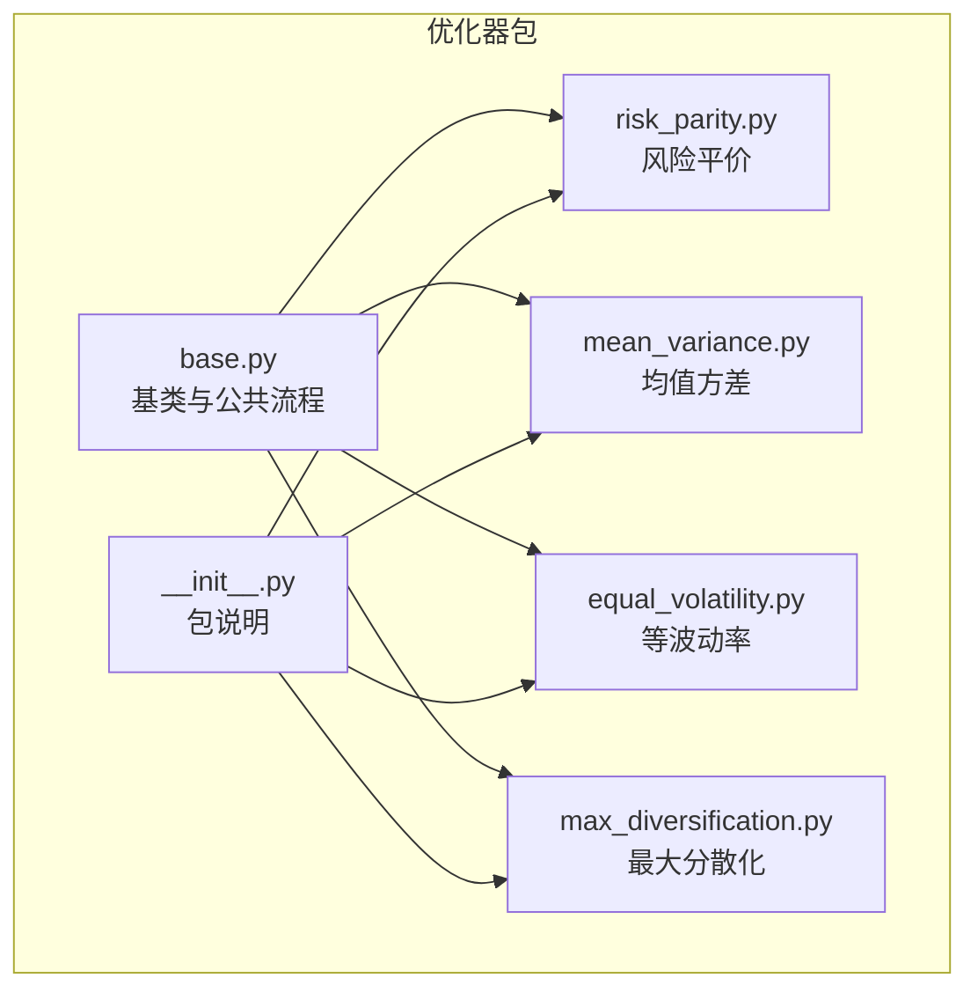
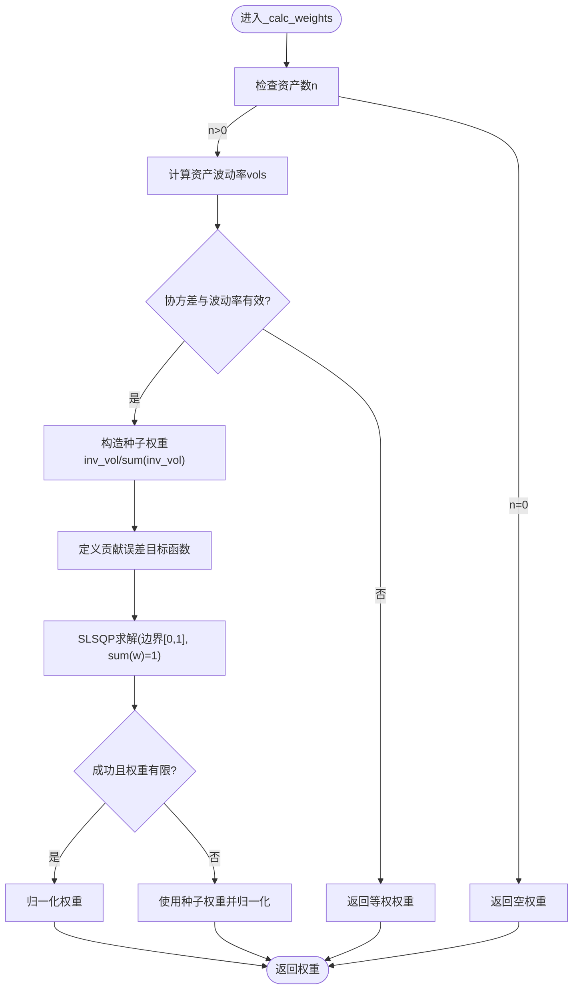
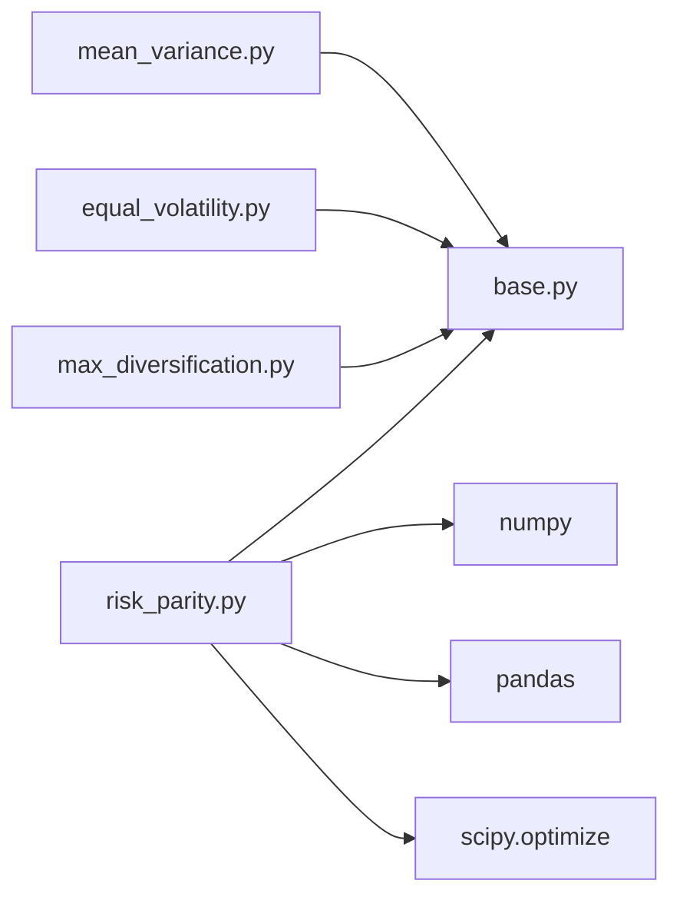

# 风险平价优化器

<cite>
**本文引用的文件**
- [risk_parity.py](file://agent/backtest/optimizers/risk_parity.py)
- [base.py](file://agent/backtest/optimizers/base.py)
- [mean_variance.py](file://agent/backtest/optimizers/mean_variance.py)
- [equal_volatility.py](file://agent/backtest/optimizers/equal_volatility.py)
- [max_diversification.py](file://agent/backtest/optimizers/max_diversification.py)
- [__init__.py](file://agent/backtest/optimizers/__init__.py)
- [test_risk_parity.py](file://agent/tests/test_risk_parity.py)
</cite>

## 目录
1. [简介](#简介)
2. [项目结构](#项目结构)
3. [核心组件](#核心组件)
4. [架构总览](#架构总览)
5. [详细组件分析](#详细组件分析)
6. [依赖关系分析](#依赖关系分析)
7. [性能与数值特性](#性能与数值特性)
8. [故障排查指南](#故障排查指南)
9. [结论](#结论)
10. [附录：参数调优与实践建议](#附录参数调优与实践建议)

## 简介
本技术文档围绕“风险平价优化器”的实现与使用，系统阐述其数学原理、算法实现、收敛与数值细节、与传统均值方差优化的差异、以及在不同资产类别中的实践要点。该优化器在回测框架中作为可插拔的权重调整模块，对信号方向进行保留的同时，基于协方差矩阵估计风险贡献度，使各资产的风险贡献趋于均衡，从而提升组合稳健性与分散化效果。

## 项目结构
风险平价优化器位于回测优化器子系统中，采用基类抽象 + 具体策略实现的模块化设计。核心文件与职责如下：
- base.py：定义通用优化器基类，负责滚动窗口切片、协方差计算、NaN处理、权重归一化与符号保持等公共逻辑。
- risk_parity.py：实现风险平价（Spinu风格）权重求解，目标为等边际风险贡献，约束为多头单形。
- mean_variance.py：均值方差（最大夏普）优化器，用于对比与参考。
- equal_volatility.py：等波动率（反波动率加权）权重方案。
- max_diversification.py：最大化分散化比率权重方案。
- __init__.py：优化器包说明与注册入口。
- test_risk_parity.py：针对风险平价的单元测试与集成测试。



图表来源
- [base.py:14-145](file://agent/backtest/optimizers/base.py#L14-L145)
- [risk_parity.py:11-59](file://agent/backtest/optimizers/risk_parity.py#L11-L59)
- [mean_variance.py:11-69](file://agent/backtest/optimizers/mean_variance.py#L11-L69)
- [equal_volatility.py:14-47](file://agent/backtest/optimizers/equal_volatility.py#L14-L47)
- [max_diversification.py:15-58](file://agent/backtest/optimizers/max_diversification.py#L15-L58)
- [__init__.py:1-12](file://agent/backtest/optimizers/__init__.py#L1-L12)

章节来源
- [base.py:14-145](file://agent/backtest/optimizers/base.py#L14-L145)
- [risk_parity.py:11-59](file://agent/backtest/optimizers/risk_parity.py#L11-L59)
- [__init__.py:1-12](file://agent/backtest/optimizers/__init__.py#L1-L12)

## 核心组件
- BaseOptimizer：提供统一的优化流程，包括：
  - 按日期滚动选择活跃资产；
  - 因果性保证：仅使用决策时点之前的收益历史；
  - 构建上下文（默认包含协方差矩阵），并做NaN检查；
  - 调用子类实现计算权重；
  - 将权重应用到原始信号上，保留多空方向；
  - 权重归一化与等权兜底。
- RiskParityOptimizer：在长只单形约束下，通过非线性优化最小化各资产风险贡献偏差，达到等边际风险贡献的目标。
- MeanVarianceOptimizer：用于对比的传统均值方差（最大夏普）优化器。
- EqualVolatilityOptimizer / MaxDiversificationOptimizer：其他权重方案，便于横向比较。

章节来源
- [base.py:14-145](file://agent/backtest/optimizers/base.py#L14-L145)
- [risk_parity.py:11-59](file://agent/backtest/optimizers/risk_parity.py#L11-L59)
- [mean_variance.py:11-69](file://agent/backtest/optimizers/mean_variance.py#L11-L69)
- [equal_volatility.py:14-47](file://agent/backtest/optimizers/equal_volatility.py#L14-L47)
- [max_diversification.py:15-58](file://agent/backtest/optimizers/max_diversification.py#L15-L58)

## 架构总览
风险平价优化器在回测引擎中被周期性调用，输入为收益率矩阵与原始信号头寸，输出为经风险平价调整后的头寸矩阵。整体流程如下：

```mermaid
sequenceDiagram
participant Engine as "回测引擎"
participant Opt as "BaseOptimizer.optimize"
participant RP as "RiskParityOptimizer._calc_weights"
participant SciPy as "scipy.optimize.minimize"
Engine->>Opt : 传入(ret, pos, dates)
loop 每个决策日
Opt->>Opt : 选择活跃资产与历史窗口
Opt->>Opt : _build_context(计算cov)
Opt->>RP : _calc_weights(ctx)
RP->>SciPy : minimize(贡献误差函数, SLSQP)
SciPy-->>RP : 最优权重w
RP-->>Opt : w(已归一化)
Opt->>Opt : 应用权重并保留原信号方向
end
Opt-->>Engine : 返回调整后的头寸矩阵
```

图表来源
- [base.py:36-85](file://agent/backtest/optimizers/base.py#L36-L85)
- [risk_parity.py:14-49](file://agent/backtest/optimizers/risk_parity.py#L14-L49)

## 详细组件分析

### 风险平价理论与数学原理
- 风险贡献度：在给定权重w与协方差Σ下，组合方差为w'Σw。第i个资产的边际风险贡献为(Σw)_i，绝对风险贡献为w_i·(Σw)_i。
- 等边际风险贡献目标：令各资产的绝对风险贡献相等，即w_i·(Σw)_i = (w'Σw)/n，其中n为资产数。
- 优化目标：最小化各资产风险贡献与目标值的平方差，并以组合方差归一化，得到稳定的数值目标函数。
- 约束条件：权重非负且和为1（长只单形）。

上述目标与约束在本实现中以SLSQP求解，初始值取反波动率加权，以提升收敛稳定性。

章节来源
- [risk_parity.py:14-49](file://agent/backtest/optimizers/risk_parity.py#L14-L49)

#### 风险平价权重求解流程图


图表来源
- [risk_parity.py:14-49](file://agent/backtest/optimizers/risk_parity.py#L14-L49)

### 迭代求解过程与收敛判断
- 求解器：scipy.optimize.minimize，方法SLSQP。
- 目标函数：贡献误差的相对平方和，除以组合方差的平方，以抑制尺度影响。
- 约束：权重非负（边界[0,1]）、权重之和等于1（等式约束）。
- 初始值：反波动率加权，提高收敛速度与稳定性。
- 收敛参数：最大迭代次数200，函数容差ftol=1e-12。
- 失败处理：若求解失败或结果不合法，回退到种子权重并归一化。

章节来源
- [risk_parity.py:14-49](file://agent/backtest/optimizers/risk_parity.py#L14-L49)

### 风险预算配置选项
当前实现聚焦于“等风险贡献”这一特定风险预算分配策略，未暴露显式的风险预算向量参数。可通过以下方式间接控制：
- 整体风险预算：通过筛选活跃资产集合（由原始信号决定）来改变参与优化的资产范围。
- 资产间风险平衡：通过lookback窗口长度影响协方差估计的平滑程度，从而影响风险贡献分布。
- 动态调整机制：在回测中按日滚动更新协方差与权重，自动适应市场状态变化。

若需更灵活的风险预算分配（如指定不同资产的风险预算比例），可在基类基础上扩展上下文与目标函数，引入预算向量与加权误差项。

章节来源
- [base.py:36-85](file://agent/backtest/optimizers/base.py#L36-L85)
- [risk_parity.py:14-49](file://agent/backtest/optimizers/risk_parity.py#L14-L49)

### 与传统均值方差优化的区别
- 目标差异：
  - 风险平价：最小化各资产风险贡献偏差，强调风险分散。
  - 均值方差：最大化夏普比率，强调收益风险比。
- 对协方差估计的鲁棒性：
  - 风险平价对协方差估计误差相对更稳健，因为不直接依赖预期收益估计。
  - 均值方差对预期收益估计敏感，易放大估计误差。
- 分散化效果：
  - 风险平价天然倾向于低波动资产更高权重，提升分散化。
  - 均值方差可能集中配置于高预期收益资产，分散化较弱。
- 极端市场表现：
  - 风险平价在尾部风险事件中通常表现出更平稳的风险贡献分布。
  - 均值方差在极端情况下可能出现权重剧烈变动。

章节来源
- [mean_variance.py:11-69](file://agent/backtest/optimizers/mean_variance.py#L11-L69)
- [risk_parity.py:14-49](file://agent/backtest/optimizers/risk_parity.py#L14-L49)

### 与其他权重方案的对比
- 等波动率（反波动率加权）：简单、稳定，但不考虑相关性。
- 最大分散化比率：在波动率与相关性共同作用下最大化分散化，但目标与风险平价不同。
- 风险平价：在相关性存在的情况下，仍能保证风险贡献均衡，适合多资产组合。

章节来源
- [equal_volatility.py:14-47](file://agent/backtest/optimizers/equal_volatility.py#L14-L47)
- [max_diversification.py:15-58](file://agent/backtest/optimizers/max_diversification.py#L15-L58)
- [risk_parity.py:14-49](file://agent/backtest/optimizers/risk_parity.py#L14-L49)

## 依赖关系分析
- 外部依赖：
  - numpy/pandas：数据处理与线性代数运算。
  - scipy.optimize.minimize：非线性优化求解。
- 内部依赖：
  - BaseOptimizer：统一流程与工具函数。
  - 其他优化器：同属优化器包，便于替换与对比。



图表来源
- [risk_parity.py:14-49](file://agent/backtest/optimizers/risk_parity.py#L14-L49)
- [base.py:14-145](file://agent/backtest/optimizers/base.py#L14-L145)
- [mean_variance.py:11-69](file://agent/backtest/optimizers/mean_variance.py#L11-L69)
- [equal_volatility.py:14-47](file://agent/backtest/optimizers/equal_volatility.py#L14-L47)
- [max_diversification.py:15-58](file://agent/backtest/optimizers/max_diversification.py#L15-L58)

章节来源
- [risk_parity.py:14-49](file://agent/backtest/optimizers/risk_parity.py#L14-L49)
- [base.py:14-145](file://agent/backtest/optimizers/base.py#L14-L145)

## 性能与数值特性
- 时间复杂度：每步优化为O(n^3)量级（SLSQP内层涉及Hessian近似），n为活跃资产数。
- 内存占用：主要消耗在协方差矩阵与中间向量，规模与n^2成正比。
- 数值稳定性：
  - 对奇异或接近奇异的协方差矩阵有保护（检测非有限值与极低波动率）。
  - 目标函数以组合方差归一化，避免尺度问题。
  - 失败时回退到种子权重，确保鲁棒性。
- 并行与批处理：当前实现为逐日循环，若需大规模回测，可在上层进行批处理或并行化。

章节来源
- [risk_parity.py:14-49](file://agent/backtest/optimizers/risk_parity.py#L14-L49)
- [base.py:36-85](file://agent/backtest/optimizers/base.py#L36-L85)

## 故障排查指南
- 协方差矩阵异常：
  - 现象：出现NaN或非正定导致优化失败。
  - 处理：基类会跳过该日；风险平价内部检测到非有限值或极低波动率时回退到等权。
- 单一资产：
  - 现象：优化器直接返回输入头寸，不做调整。
  - 处理：无需干预，符合预期。
- 权重符号保持：
  - 现象：多头/空头方向被错误翻转。
  - 处理：基类在应用权重时乘以原信号符号，确保方向不变。
- 收敛失败：
  - 现象：优化器返回种子权重。
  - 处理：检查lookback窗口是否足够、数据质量是否良好。

章节来源
- [base.py:36-85](file://agent/backtest/optimizers/base.py#L36-L85)
- [risk_parity.py:14-49](file://agent/backtest/optimizers/risk_parity.py#L14-L49)
- [test_risk_parity.py:93-119](file://agent/tests/test_risk_parity.py#L93-L119)

## 结论
风险平价优化器通过等边际风险贡献目标，在多资产组合中实现稳健的风险分散，尤其在对协方差估计误差具有较强鲁棒性的同时，避免了均值方差优化对预期收益估计的过度敏感。其实现简洁、数值稳定，适合股票、跨资产与多因子策略的回测与实盘应用。结合滚动窗口与信号方向保持，能够在动态市场中持续输出合理的权重配置。

## 附录：参数调优与实践建议
- 风险预算分配策略：
  - 当前实现为等风险贡献；如需自定义预算，可扩展目标函数加入预算向量加权。
- 收敛参数设置：
  - 最大迭代次数与容差可根据资产数量与数据噪声调整；默认200次与1e-12适用于多数场景。
- 计算效率优化：
  - 减少活跃资产数量（通过信号过滤）以降低优化维度。
  - 合理设置lookback窗口，平衡估计精度与计算成本。
  - 对高频回测，可考虑缓存协方差或使用近似方法。
- 实际应用案例：
  - 股票组合：利用风险平价降低高波动个股的影响，提升组合稳定性。
  - 跨资产配置：在股、债、商品等多资产中均衡风险贡献，增强抗风险能力。
  - 多因子策略：在因子暴露层面应用风险平价，控制因子间的风险集中度。

章节来源
- [risk_parity.py:14-49](file://agent/backtest/optimizers/risk_parity.py#L14-L49)
- [base.py:36-85](file://agent/backtest/optimizers/base.py#L36-L85)
- [test_risk_parity.py:15-87](file://agent/tests/test_risk_parity.py#L15-L87)